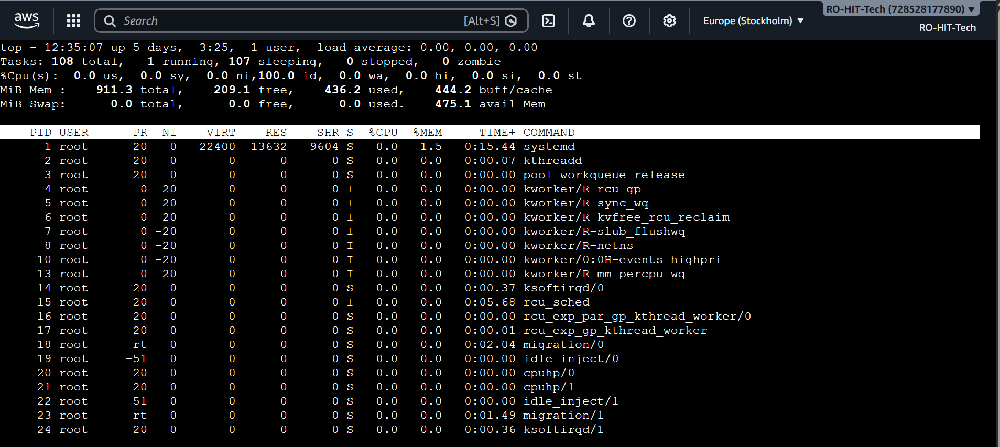
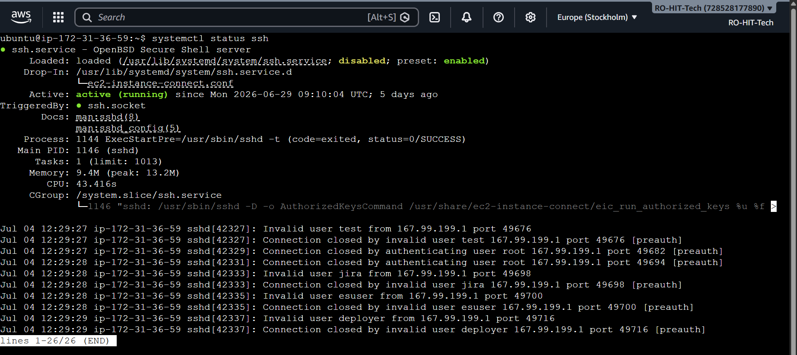
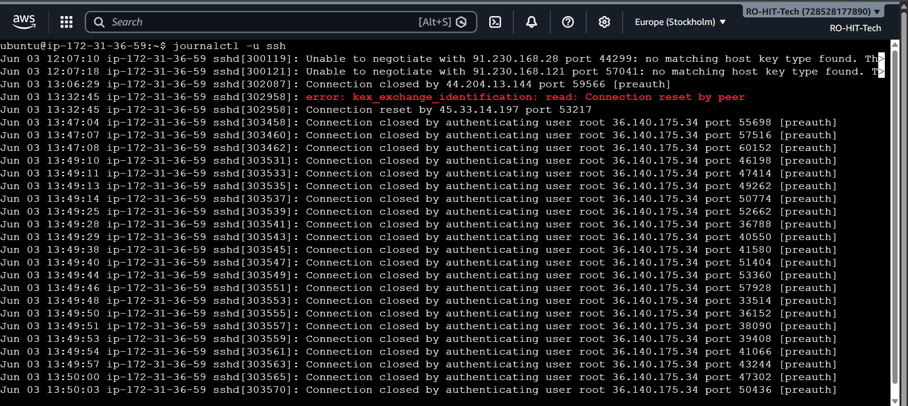
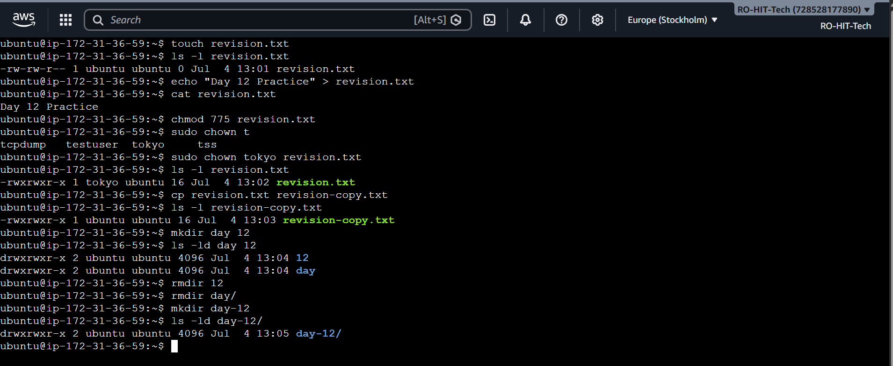
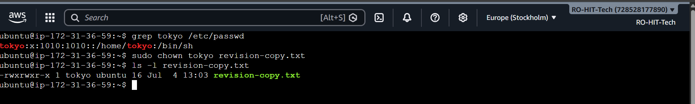

# 📅 Day 12: Revision (Days 01–11)

## 🎯 Objective

Revise and reinforce all Linux concepts learned from Days 01–11 before moving to advanced topics.

---

# 🖥️ Task 1: Review Learning Goals

### 🎯 Objective

Revisited my Day 01 learning plan and checked whether I am progressing towards my DevOps roadmap.

### 📝 Observation

- My learning goal remains the same.
- I will continue focusing on DevOps.
- The fundamentals learned so far have improved my confidence.

---

# 🖥️ Task 2: Process & Service Review

### 💻 Commands

```bash
top

systemctl status ssh

journalctl -u ssh
```

### 📖 What these commands do

| Command | Purpose |
|----------|----------|
| `top` | Displays running processes in real time |
| `systemctl status ssh` | Checks SSH service status |
| `journalctl -u ssh` | Displays SSH service logs |

### 📸 Output

#### Running Processes



#### SSH Service Status



#### SSH Service Logs



### 📝 Observation

- Successfully monitored running processes.
- Verified that the SSH service is active and running.
- Reviewed SSH logs without any issues.

---

# 🖥️ Task 3: File Skills Revision

### 💻 Commands

```bash
touch revision.txt

echo "Day 12 Practice" > revision.txt

chmod 777 revision.txt

mkdir day12

cp revision.txt day12/

ls -l
```

### 📖 What these commands do

| Command | Purpose |
|----------|----------|
| `touch` | Creates a new file |
| `echo` | Adds content into a file |
| `chmod` | Changes file permissions |
| `mkdir` | Creates a new directory |
| `cp` | Copies files |
| `ls -l` | Displays detailed file information |

### 📸 Output



### 📝 Observation

Successfully revised Linux file operations, permissions, directory creation, and file copy commands.

---

# 🖥️ Task 4: Cheat Sheet Refresh

### 📖 Top 5 Frequently Used Commands

| Command | Purpose |
|----------|----------|
| `pwd` | Displays current directory |
| `ls -l` | Lists files with detailed information |
| `cd` | Changes directory |
| `mkdir` | Creates a directory |
| `cp` | Copies files and directories |

---

# 🖥️ Task 5: User & Ownership Revision

### 💻 Commands

```bash
id tokyo

touch ownership.txt

sudo chown tokyo ownership.txt

ls -l ownership.txt
```

### 📖 What these commands do

| Command | Purpose |
|----------|----------|
| `id` | Displays user details |
| `touch` | Creates a file |
| `chown` | Changes file ownership |
| `ls -l` | Verifies ownership and permissions |

### 📸 Output



### 📝 Observation

Verified user information and successfully changed file ownership.

---

# 🧠 Self Check

## 1. Which 3 commands save you the most time?

- `ls -l`
- `systemctl status`
- `journalctl`

---

## 2. How do you check if a service is healthy?

```bash
systemctl status ssh

ps -ef | grep ssh

journalctl -u ssh
```

---

## 3. How do you safely change ownership and permissions?

```bash
sudo chown tokyo file.txt

chmod 644 file.txt
```

Always verify using:

```bash
ls -l
```

---

## 4. What will you focus on improving in the next 3 days?

- Linux Networking
- Package Management
- Shell Scripting

---

# 📋 Commands Summary

| Command | Purpose |
|----------|----------|
| `top` | Shows running processes |
| `systemctl status ssh` | Checks SSH service |
| `journalctl -u ssh` | Views SSH logs |
| `touch` | Creates files |
| `echo` | Adds content |
| `chmod` | Changes permissions |
| `mkdir` | Creates directories |
| `cp` | Copies files |
| `id` | Shows user information |
| `chown` | Changes ownership |
| `ls -l` | Verifies permissions and ownership |

---

# 📚 Key Learnings

- Revised Linux process monitoring.
- Checked SSH service status and logs.
- Practiced common file operations.
- Revised file permissions and ownership.
- Strengthened Linux fundamentals before moving to networking.

---

# ✅ Conclusion

Day 12 was a dedicated revision day. Revisiting the Linux fundamentals helped reinforce key concepts and improved my confidence before starting Linux Networking.
