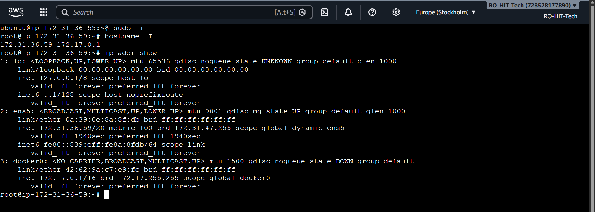
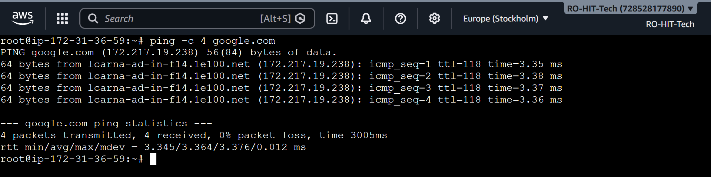
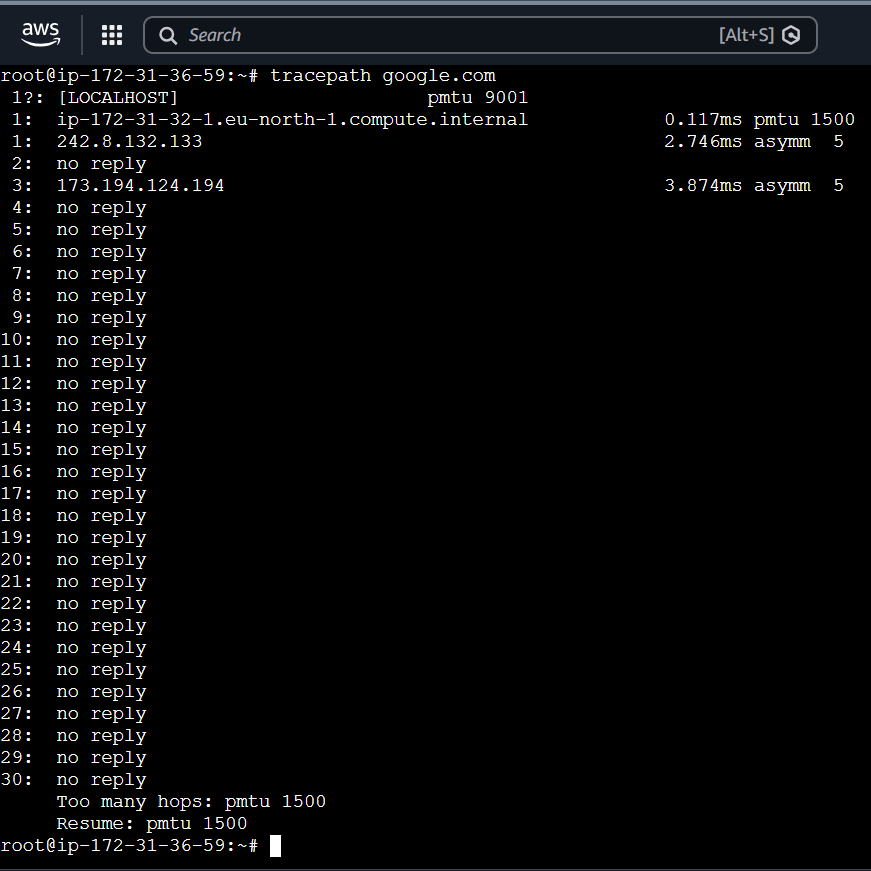
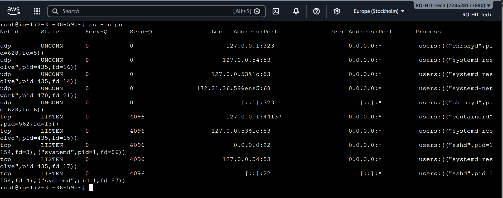
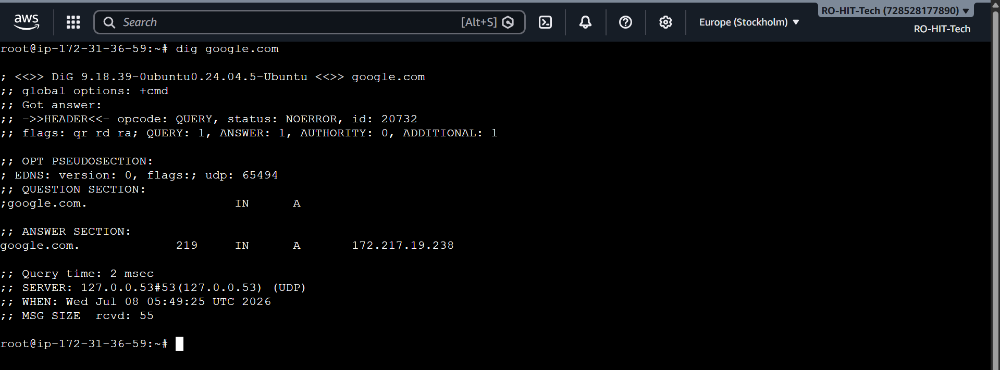
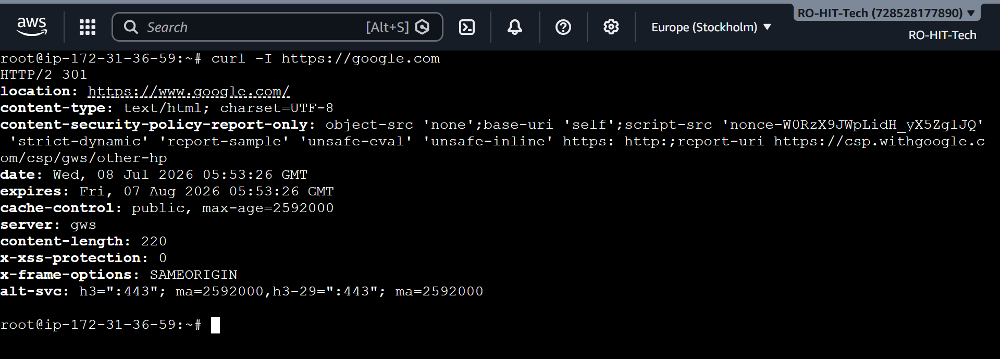
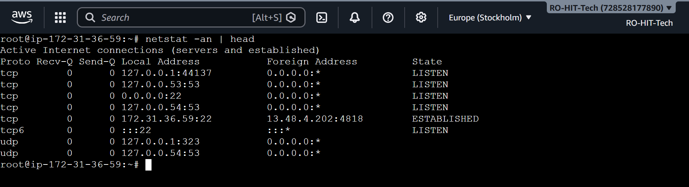
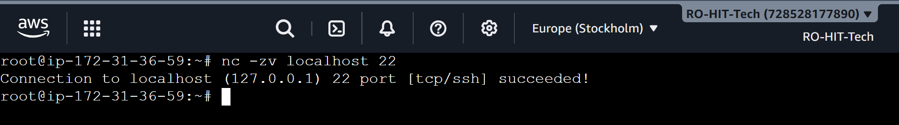

# Day 14 – Networking Fundamentals & Hands-on Checks

## Objective

Learn the basics of Linux networking and practice the essential commands used by DevOps Engineers for troubleshooting connectivity, DNS, ports, and HTTP services.

---

# Quick Concepts

## OSI Model (7 Layers)

1. Physical – Cables, Signals
2. Data Link – MAC Address, Switch
3. Network – IP Address, Routing
4. Transport – TCP / UDP
5. Session – Session Management
6. Presentation – Encryption, Compression
7. Application – HTTP, HTTPS, DNS, SSH

---

## TCP/IP Model

| Layer | Protocols |
|--------|-----------|
| Application | HTTP, HTTPS, DNS, SSH |
| Transport | TCP, UDP |
| Internet | IP, ICMP |
| Network Access | Ethernet |

---

## Where protocols work

| Protocol | Layer |
|----------|-------|
| IP | Internet / Network |
| TCP / UDP | Transport |
| HTTP / HTTPS | Application |
| DNS | Application |

---

## Real Example

```
curl https://google.com
```

Application Layer (HTTP)

↓

Transport Layer (TCP)

↓

Internet Layer (IP)

↓

Network Layer (Ethernet)

---

# Hands-on Practice

## Task 1 – Check Network Identity

### Commands

```bash
hostname -I
ip addr show
```

### Observation

- Verified the private IP address of the EC2 instance.
- Checked available network interfaces and IP configuration.

### Output



---

## Task 2 – Connectivity Test

### Command

```bash
ping -c 4 google.com
```

### Observation

- Successfully reached google.com.
- Received all packets with 0% packet loss.
- Average latency was around 3–4 ms.

### Output



---

## Task 3 – Network Path

### Command

```bash
tracepath google.com
```

### Observation

- Displayed the path taken by packets.
- Some intermediate routers did not reply, which is normal because many routers block ICMP responses.

### Output



---

## Task 4 – Check Listening Ports

### Command

```bash
ss -tulpn
```

### Observation

- Verified SSH service listening on port 22.
- Observed DNS resolver and other system services.

### Output



---

## Task 5 – DNS Lookup

### Command

```bash
dig google.com
```

### Observation

- Successfully resolved the domain name to its IP address.
- Confirmed DNS service was working correctly.

### Output



---

## Task 6 – HTTP Response Check

### Command

```bash
curl -I https://google.com
```

### Observation

- Verified HTTP response headers.
- Received HTTP 301 redirect response.

### Output



---

## Task 7 – Active Network Connections

### Command

```bash
netstat -an | head
```

### Observation

- Displayed listening services and established connections.
- Confirmed active SSH connection.

### Output



---

## Task 8 – Port Probe

### Command

```bash
nc -zv localhost 22
```

### Observation

- Successfully connected to localhost on port 22.
- Confirmed SSH service was reachable.

### Output



---

# Reflection

### Which command gives the fastest signal when something is broken?

`ping` is usually the fastest command to verify basic network connectivity.

---

### What layer would you inspect if DNS fails?

Application Layer (DNS)

---

### What would you inspect if HTTP 500 appears?

- Application logs
- Web server logs
- Backend service status

---

### Two follow-up checks during a real incident

- Check listening ports using `ss -tulpn`
- Verify DNS resolution using `dig`

---

# Commands Practiced

```bash
hostname -I
ip addr show
ping -c 4 google.com
tracepath google.com
ss -tulpn
dig google.com
curl -I https://google.com
netstat -an | head
nc -zv localhost 22
```

---

# Key Learnings

- Understood OSI and TCP/IP networking models.
- Learned how to verify connectivity using ping.
- Used tracepath to inspect packet routing.
- Verified open ports and services.
- Performed DNS lookup using dig.
- Checked HTTP headers using curl.
- Viewed active network connections.
- Tested SSH port availability using Netcat.
- Gained practical troubleshooting skills for Linux networking.
