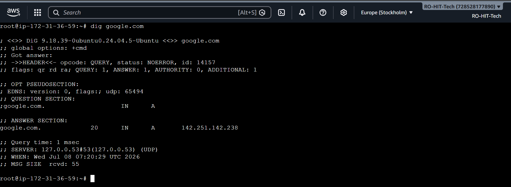
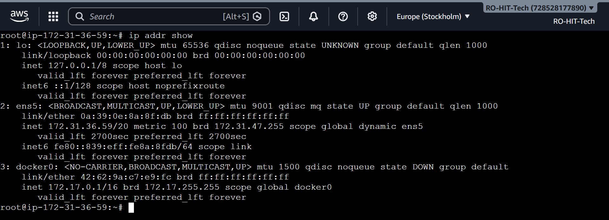
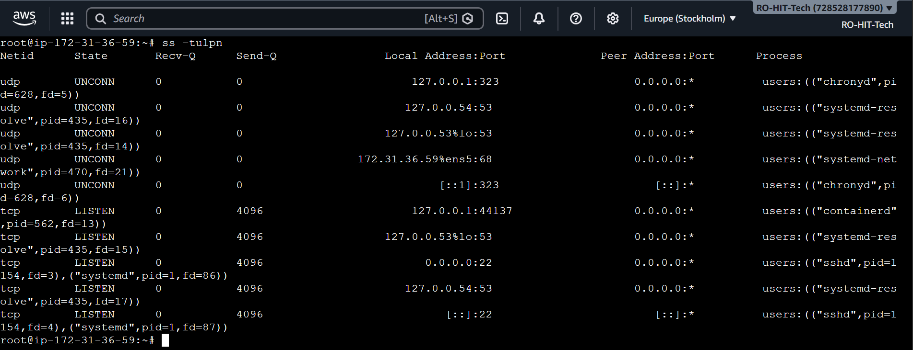

# Day 15 – Networking Concepts: DNS, IP, Subnets & Ports

## Objective

Today I learned the fundamental networking concepts that every DevOps Engineer should understand. I explored how DNS resolves domain names, how IP addresses work, the basics of CIDR and subnetting, and why ports are important for network communication.

---
## Task 1 – DNS (How Names Become IPs)

### What happens when you type google.com in a browser?

When you type `google.com` in a browser, the browser first contacts a DNS server to find the IP address of the domain. After receiving the IP address, it establishes a connection with the server and sends an HTTP/HTTPS request. The server then responds with the requested webpage.

### DNS Record Types

**A Record**

Maps a domain name to an IPv4 address.

**AAAA Record**

Maps a domain name to an IPv6 address.

**CNAME Record**

Points one domain name to another domain name.

**MX Record**

Specifies the mail server responsible for receiving emails.

**NS Record**

Specifies the authoritative DNS server for a domain.

---

### Command

```bash
dig google.com
```

### Observation

- Successfully resolved **google.com** into an IPv4 address.
- Identified the **A Record** and its **TTL** value.
- Confirmed that DNS resolution is working properly.

### Output



---

## Task 2 – IP Addressing

### What is an IPv4 Address?

An IPv4 address is a unique numerical address assigned to every device connected to a network. It contains four octets separated by dots.

Example:

```
192.168.1.10
```

### Public IP vs Private IP

**Public IP**

A Public IP is accessible from the internet.

Example:

```
13.48.xx.xx
```

**Private IP**

A Private IP is used only inside a private network.

Example:

```
172.31.36.59
```

### Private IP Ranges

```
10.0.0.0 – 10.255.255.255

172.16.0.0 – 172.31.255.255

192.168.0.0 – 192.168.255.255
```

---

### Command

```bash
hostname -I

ip addr show
```

### Observation

- Verified the private IP address of the EC2 instance.
- Checked the available network interfaces.
- Confirmed that `172.31.36.59` belongs to the private IP range.
- Observed the Docker bridge interface (`172.17.0.1`).

### Output



---

## Task 3 – CIDR & Subnetting

### What does /24 mean?

`/24` means the first **24 bits** represent the network portion and the remaining **8 bits** represent the host portion.

---

### Why do we subnet?

Subnetting divides one large network into multiple smaller networks.

Benefits:

- Better network management
- Improved security
- Reduced broadcast traffic
- Efficient use of IP addresses

---

### CIDR Table

| CIDR | Subnet Mask | Total IPs | Usable Hosts |
|------|-------------|----------:|-------------:|
| /24 | 255.255.255.0 | 256 | 254 |
| /16 | 255.255.0.0 | 65,536 | 65,534 |
| /28 | 255.255.255.240 | 16 | 14 |

---

## Task 4 – Ports (The Doors to Services)

### What is a Port?

A port is a logical communication endpoint. An IP address identifies the device, while the port identifies the service running on that device.

Example:

```
172.31.36.59:22
```

### Common Ports

| Port | Service |
|------|----------|
|22|SSH|
|80|HTTP|
|443|HTTPS|
|53|DNS|
|3306|MySQL|
|6379|Redis|
|27017|MongoDB|

---

### Command

```bash
ss -tulpn
```

### Observation

- Verified that **SSH** is listening on **Port 22**.
- Verified that **DNS Resolver** is listening on **Port 53**.
- Confirmed active listening services running on the EC2 instance.

### Output



---


# Task 5 – Putting It Together

## Question 1

### You run:

```bash
curl http://myapp.com:8080
```

### What networking concepts are involved?

1. DNS resolves the domain name into an IP address.
2. The client connects to the server using the IP address.
3. TCP establishes the connection.
4. Port **8080** identifies the application.
5. The server returns an HTTP response.

---

## Question 2

### Your application can't reach a database at:

```
10.0.1.50:3306
```

### What would you check first?

- Verify whether the database IP is reachable.
- Check whether port **3306** is open.
- Verify the MySQL service is running.
- Check firewall or security group rules if required.

---

# Commands Used

```bash
dig google.com

ip addr show

ss -tulpn

ping google.com

tracepath google.com

curl -I https://google.com

netstat -an | head

nc -zv localhost 22
```

---

# Screenshots

| Screenshot | Description |
|------------|-------------|
| 01-dns-lookup.png | DNS lookup using the `dig google.com` command showing the A record and TTL. |
| 02-ip-address-information.png | Displayed network interface details using `ip addr show` and identified the private IPv4 address. |
| 04-listening-ports.png | Verified listening services and matched running services with their ports using `ss -tulpn`. |

---

# What I Learned

- DNS converts domain names into IP addresses.
- Public and Private IP addresses have different purposes.
- CIDR notation defines network and host portions of an IP address.
- Subnetting improves network organization and security.
- Ports identify specific services running on a server.
- Commands like `dig`, `ip addr`, `ss`, and `curl` are useful for troubleshooting networking issues.

---

# Conclusion

Today's session helped me understand the basic networking concepts used in real DevOps environments. Instead of only memorizing commands, I learned how DNS, IP addresses, subnetting, and ports work together whenever a client communicates with a server. This practical understanding will help me troubleshoot networking issues more confidently.
