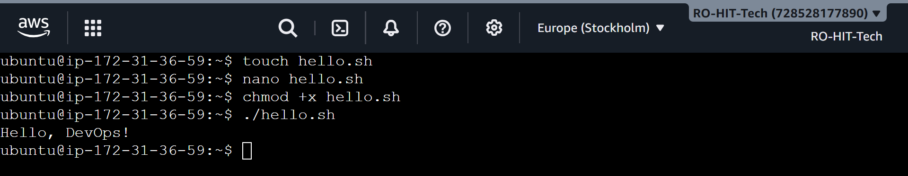
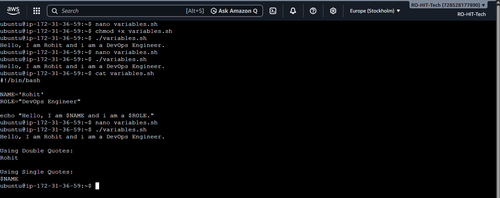
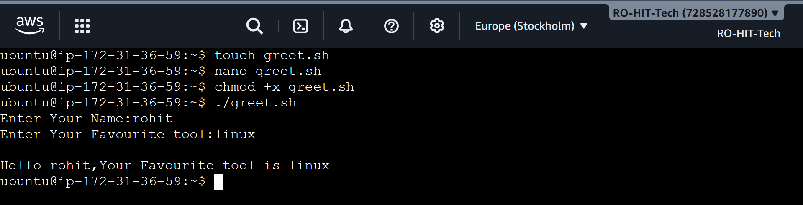
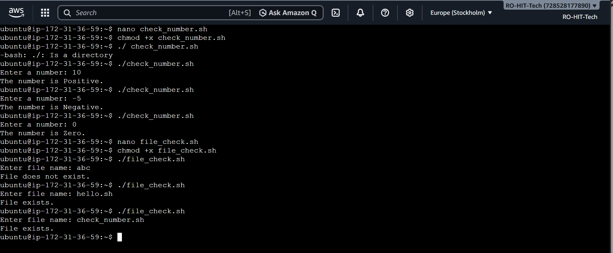
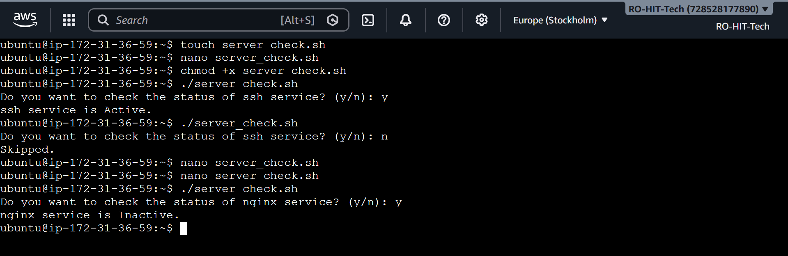

# Day 16 – Shell Scripting Basics

## Objective

The goal of this task was to learn the fundamentals of Shell Scripting. I practiced creating my first shell script, using variables, taking user input, and writing simple conditional statements.

---

# Task 1 – Your First Script

## What is a Shell Script?

A shell script is a text file that contains multiple Linux commands. Instead of executing commands one by one, we can save them in a script and execute them together. Shell scripting helps automate repetitive tasks and improves efficiency.

---

## What is Shebang (`#!/bin/bash`)?

The shebang line tells Linux which interpreter should execute the script.

```bash
#!/bin/bash
```

When we execute a script using `./script.sh`, Linux reads the first line and starts the Bash interpreter to execute the remaining commands.

Without the shebang, Linux may not know which interpreter should execute the script unless we explicitly run it using:

```bash
bash script.sh
```

---

## Script

```bash
#!/bin/bash

echo "Hello, DevOps!"
```

---

## Commands Used

```bash
touch hello.sh

nano hello.sh

chmod +x hello.sh

./hello.sh
```

---

## Observation

- Created my first shell script.
- Understood the purpose of the shebang line.
- Learned how to make a script executable using `chmod +x`.
- Successfully executed the script.

---

## Output



---

# Task 2 – Variables

## What is a Variable?

A variable is a container used to store data. Instead of writing the same value multiple times, we store it in a variable and reuse it whenever needed.

Example:

```bash
NAME="Rohit"
```

Here,

- NAME → Variable
- Rohit → Value

Variables make scripts easier to maintain and modify.

---

## Script

```bash
#!/bin/bash

NAME="Rohit"
ROLE="DevOps Engineer"

echo "Hello, I am $NAME and I am a $ROLE."

echo

echo "Using Double Quotes:"
echo "$NAME"

echo

echo "Using Single Quotes:"
echo '$NAME'
```

---

## Difference Between Single Quotes and Double Quotes

### Double Quotes

Variables are expanded.

Example:

```bash
echo "$NAME"
```

Output:

```
Rohit
```

---

### Single Quotes

Variables are treated as plain text.

Example:

```bash
echo '$NAME'
```

Output:

```
$NAME
```

---

## Commands Used

```bash
touch variables.sh

nano variables.sh

chmod +x variables.sh

./variables.sh
```

---

## Observation

- Learned how to declare variables.
- Used variables inside the `echo` command.
- Understood the difference between single quotes and double quotes.
- Verified that double quotes expand variables while single quotes print them as plain text.

---

## Output



---

# Task 3 – User Input with read

## What is the `read` Command?

The `read` command is used to take input from the user while the script is running. It stores the entered value in a variable, making the script interactive.

Example:

```bash
read -p "Enter your name: " NAME
```

Here,

- `-p` displays a prompt message.
- `NAME` stores the value entered by the user.

---

## Script

```bash
#!/bin/bash

read -p "Enter your name: " NAME

read -p "Enter your favourite tool: " TOOL

echo

echo "Hello $NAME, your favourite tool is $TOOL."
```

---

## Commands Used

```bash
touch greet.sh

nano greet.sh

chmod +x greet.sh

./greet.sh
```

---

## Observation

- Learned how to take user input using the `read` command.
- Used the `-p` option to display a prompt message.
- Stored user input inside variables.
- Printed the entered values using `echo`.

---

## Output



---

# Task 4 – If-Else Conditions

## What is an If-Else Statement?

An If-Else statement allows a script to make decisions based on a condition.

If the condition is true, one block of code is executed.

If the condition is false, another block is executed.

This is one of the most commonly used concepts in shell scripting.

---

## Part A – Check Number

### Script

```bash
#!/bin/bash

read -p "Enter a number: " NUMBER

if [ $NUMBER -gt 0 ]
then
    echo "The number is Positive."

elif [ $NUMBER -lt 0 ]
then
    echo "The number is Negative."

else
    echo "The number is Zero."

fi
```

---

## Part B – File Check

### What is `-f`?

The `-f` option checks whether a file exists or not.

If the file exists, the condition becomes true.

Otherwise, it becomes false.

---

### Script

```bash
#!/bin/bash

read -p "Enter file name: " FILE

if [ -f "$FILE" ]
then
    echo "File exists."

else
    echo "File does not exist."

fi
```

---

## Commands Used

```bash
touch check_number.sh

touch file_check.sh

nano check_number.sh

nano file_check.sh

chmod +x check_number.sh

chmod +x file_check.sh

./check_number.sh

./file_check.sh
```

---

## Observation

- Learned how to use `if`, `elif`, `else`, and `fi`.
- Checked whether a number is positive, negative, or zero.
- Used comparison operators like `-gt` and `-lt`.
- Learned how to verify whether a file exists using the `-f` operator.
- Understood how conditional statements help automate decision-making in shell scripts.

---

## Output



---

# Task 5 – Combine It All (Server Status Check)

## Objective

The purpose of this task was to combine everything learned so far—variables, user input, and if-else conditions—into a single practical shell script.

---

## What is `systemctl`?

`systemctl` is a Linux command used to manage system services.

It helps us:

- Start a service
- Stop a service
- Restart a service
- Check service status

Example:

```bash
systemctl status ssh
```

---

## Why use `systemctl is-active --quiet`?

Instead of printing the complete service status, the `is-active --quiet` option simply checks whether a service is active or not.

This is useful in shell scripts because it returns a success or failure status, making it easy to use inside an `if` condition.

---

## Script

```bash
#!/bin/bash

SERVICE="ssh"

read -p "Do you want to check the status of $SERVICE service? (y/n): " CHOICE

if [ "$CHOICE" = "y" ]
then
    if systemctl is-active --quiet $SERVICE
    then
        echo "$SERVICE service is Active."
    else
        echo "$SERVICE service is Inactive."
    fi
else
    echo "Skipped."
fi
```

---

## Commands Used

```bash
touch server_check.sh

nano server_check.sh

chmod +x server_check.sh

./server_check.sh
```

---

## Observation

- Stored the service name inside a variable.
- Took user input using the `read` command.
- Used an `if-else` statement to make decisions.
- Checked the service status using `systemctl is-active --quiet`.
- Learned how multiple shell scripting concepts work together in a real-world example.

---

## Output



---

# What I Learned

- Learned how to create executable shell scripts using Bash.
- Understood how variables, user input, and conditional statements make scripts interactive.
- Learned how shell scripting helps automate repetitive Linux administration tasks.

---

# Conclusion

Day 16 gave me a strong foundation in Shell Scripting. I learned how to write simple automation scripts using variables, user input, and conditional statements. These concepts are essential for automating daily Linux and DevOps tasks, and they will help me build more advanced scripts in the upcoming days.

---
