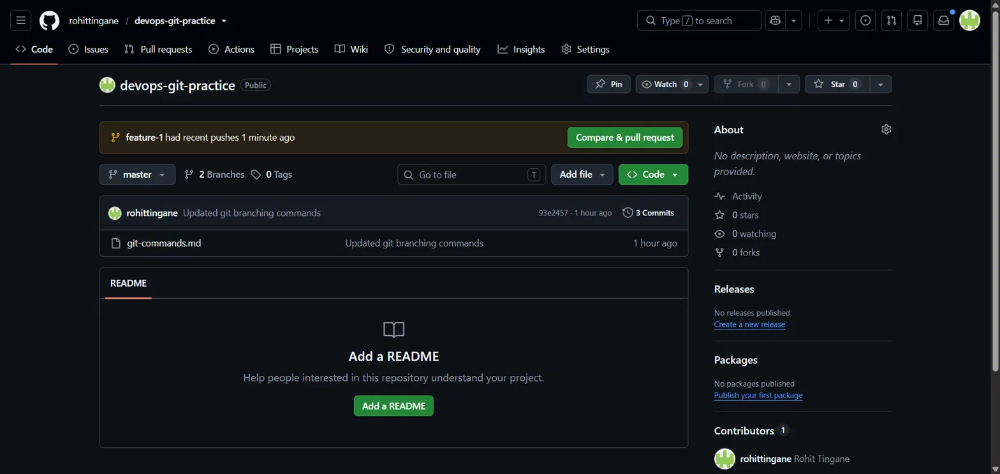
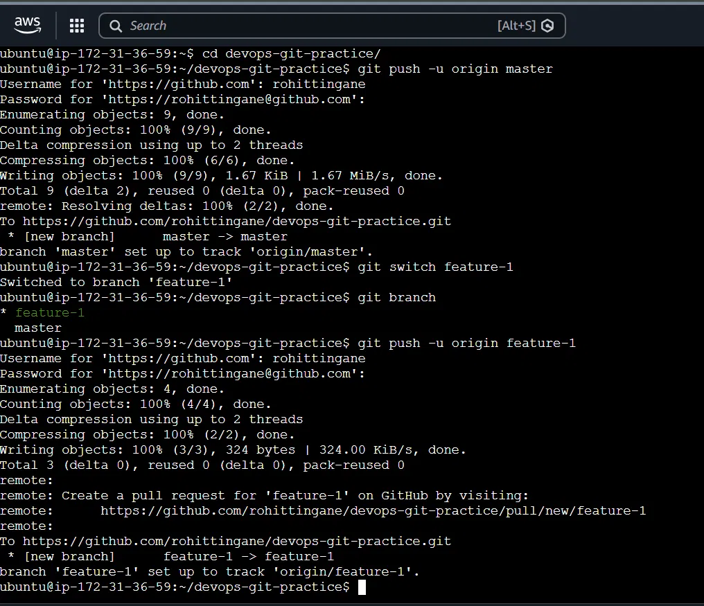
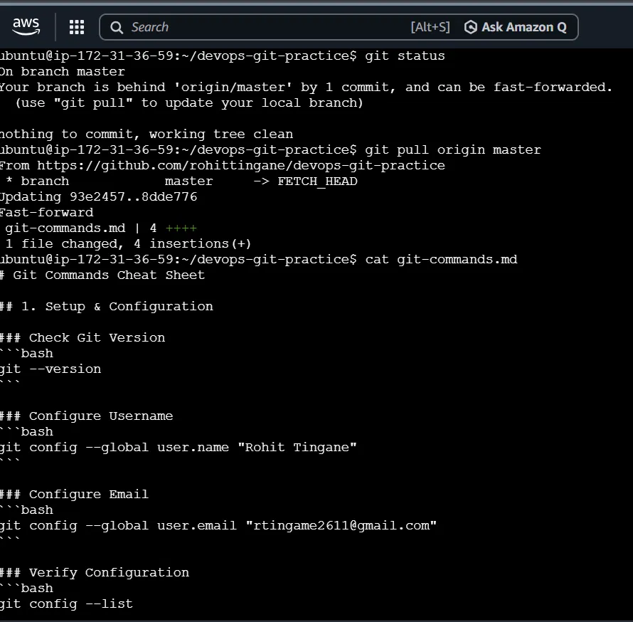
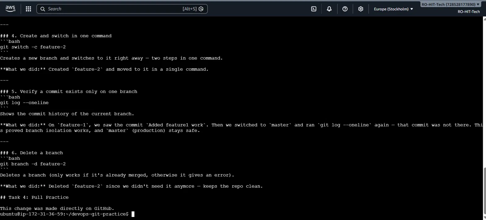
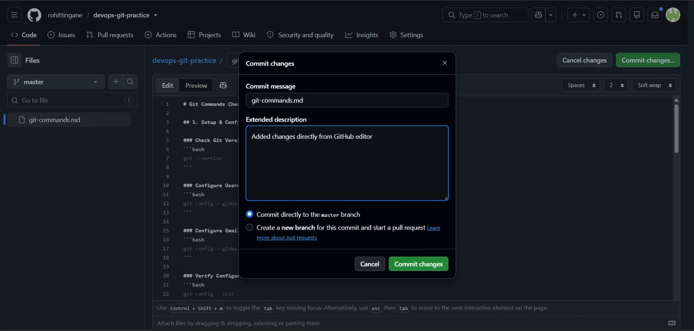
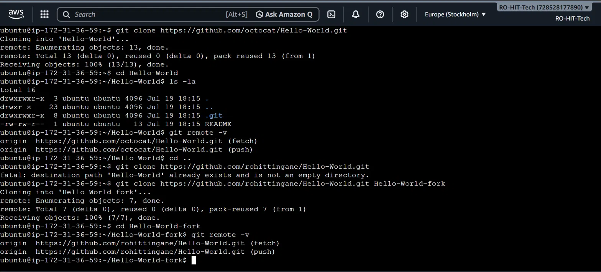
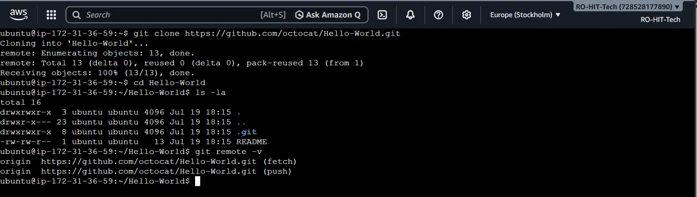
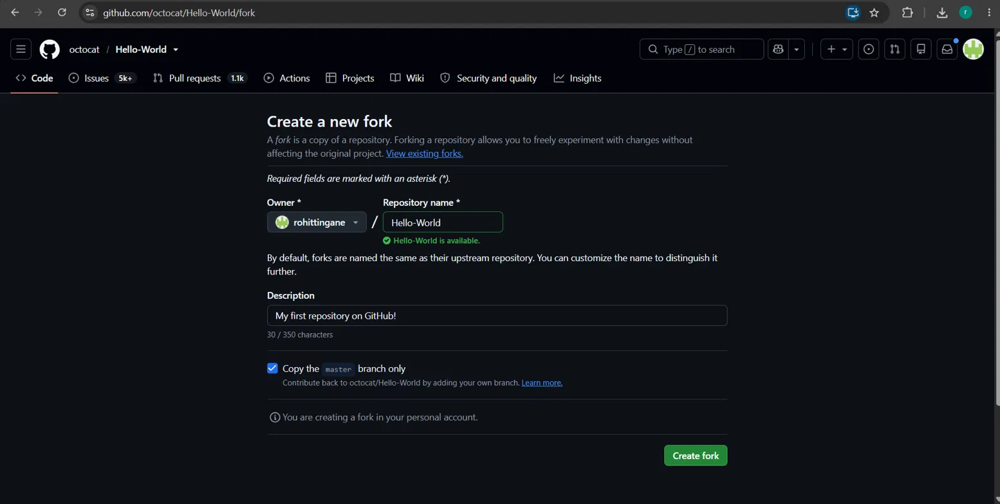

# Day 23 - Git Branching & Working with GitHub

## Task 1 - Understanding Branches

### 1. What is a branch in Git?

A branch is an independent line of development in Git. It allows developers to work on new features, bug fixes, or experiments without affecting the main branch.

**Example:**

```bash
git branch feature-login
git switch feature-login
```

This creates a new branch named `feature-login` and switches to it.

---

### 2. Why do we use branches instead of committing everything to main?

Branches keep the `main` branch stable while allowing developers to work on new features, bug fixes, or experiments independently. Once the work is tested, it can be merged into the `main` branch.

**Example:**

```text
main
 ├── Stable Code
 └── feature-login
      └── Login Feature Development
```

The login feature is developed separately without affecting the stable code in `main`.

---

### 3. What is HEAD in Git?

HEAD is a pointer that refers to the currently checked-out branch or commit. It tells Git where you are currently working.

**Example:**

```bash
git branch
```

Output:

```text
* feature-1
  main
```

The `*` symbol indicates that **HEAD** is currently pointing to the `feature-1` branch.

---

### 4. What happens to your files when you switch branches?

When you switch branches, Git updates your working directory to match the selected branch. Files that belong only to another branch will disappear, and files in the selected branch will appear.

**Example:**

```bash
git switch feature-1
echo "Feature work" > feature.txt
git add .
git commit -m "Add feature.txt"
git switch main
ls
```

After switching back to the `main` branch, `feature.txt` will not be visible because it exists only in the `feature-1` branch.

---

## Task 2: Branching Commands - Hands-On

### List all branches

Command:

```bash
git branch
```

### Create a new branch

Command:

```bash
git branch feature-1
```

### Switch to feature-1 branch

Command:

```bash
git switch feature-1
```

### Create and switch to feature-2 in one command

Command:

```bash
git switch -c feature-2
```

### Difference between git switch and git checkout

**git switch**

Modern command used for switching branches.

It is easier and safer for branch operations.

Example:

```bash
git switch master
```

**git checkout**

Older command used for switching branches and restoring files.

It has multiple functionalities.

Example:

```bash
git checkout master
```

### Commit changes on feature-1

Steps:

```bash
git switch feature-1
echo "Feature 1 changes" > feature1.txt
git add .
git commit -m "Added feature-1 changes"
```

### Verify feature-1 changes are not on main

Switch back:

```bash
git switch master
```

The `feature1.txt` file is not available in the main branch because the commit exists only in feature-1.

### Delete unused branch

Command:

```bash
git branch -d feature-2
```

### Screenshots


---

## Task 3: Push Branches to GitHub

### Connect local repository with GitHub remote

Command:

```bash
git remote add origin repository-url
```

### Push master branch

Command:

```bash
git push -u origin master
```

### Push feature-1 branch

Command:

```bash
git push -u origin feature-1
```

### Difference between origin and upstream

**origin**

Origin is the remote repository that points to my GitHub repository.

It is used for pushing and pulling my changes.

Example:

```
origin → My GitHub repository
```

### Screenshots





**upstream**

Upstream is the original repository from which a project was forked.

It is used to get updates from the original repository.

Example:

```
upstream → Original repository
```

---

## Task 4: Pull from GitHub

### Making changes directly on GitHub

A file was modified using the GitHub editor and committed directly to the repository.

### Pull changes from GitHub

Command:

```bash
git pull origin master
```

This downloads the latest changes from GitHub and merges them into the local branch.

### Difference between git fetch and git pull

**git fetch**

Downloads changes from the remote repository.

Does not merge changes automatically.

Used to review changes before applying them.

Example:

```bash
git fetch origin
```

**git pull**

Downloads changes and automatically merges them into the current branch.

It is a combination of fetch and merge.

Example:

```bash
git pull origin master
```

### Screenshots







---

## Task 5: Clone vs Fork

### Clone

Clone creates a local copy of a Git repository on my machine.

It is used for local development.

It does not create a new repository on GitHub.

Example:

```bash
git clone repository-url
```

### Fork

Fork creates a personal copy of another user's repository on my GitHub account.

It allows me to modify a project without affecting the original repository.

It is mainly used for open-source contributions.

### When would you clone vs fork?

**Clone:**
Use clone when:

- Working on my own repository.
- I have access to the repository.
- I want a local copy for development.

**Fork:**
Use fork when:

- Contributing to someone else's project.
- I do not have write access to the original repository.
- I want to create my own version of a project.

### Keeping a fork in sync with the original repository

Add original repository as upstream:

```bash
git remote add upstream original-repository-url
```

Fetch latest changes:

```bash
git fetch upstream
```

Merge changes:

```bash
git merge upstream/master
```

Remote structure:

```
origin   → My forked repository
upstream → Original repository
```

### Screenshots







---

## Day 23 Summary

Today I learned:

- Git branches and their importance
- Creating and switching branches
- Difference between git switch and git checkout
- Pushing branches to GitHub
- Difference between origin and upstream
- git fetch vs git pull
- Clone vs Fork workflow
- Keeping fork synchronized with original repository
