# Day 24 – Advanced Git: Merge, Rebase, Stash & Cherry Pick

# Git Hands-On Practice

This repository documents hands-on practice with core Git workflows: **Merge, Rebase, Squash, Stash, and Cherry-Pick**. Each task was performed on a real Git repository, with screenshots as proof, and includes a simple explanation of what each concept means and why it matters.

---

## Task 1: Merge

**What I did:**
I created a new branch, added some commits to it, and then merged it back into the main branch. I tried this in two different situations to see how Git behaves differently.

**What I learned:**

- **Fast-forward merge**: If nothing new has happened on the main branch while I was working on my separate branch, Git just "moves the main branch pointer forward" to include my new work. It's the simplest kind of merge — no extra step needed, and the history looks like one straight line.

- **Merge commit**: If someone (or I) made changes on the main branch *while* I was working on my own branch, Git can't just move forward — it has to combine two different versions of the code. In this case, Git creates a special "merge commit" that joins both versions together.

- **Merge conflict**: Sometimes two people (or two branches) change the *exact same line* of the *exact same file* in different ways. Git doesn't know which version is correct, so it stops and asks a human to decide. I intentionally caused this to happen, then manually fixed it and completed the merge.

**Why this matters:** Merging is how teams combine work from different people or features into one shared codebase, without losing anyone's changes.

**Screenshots:**

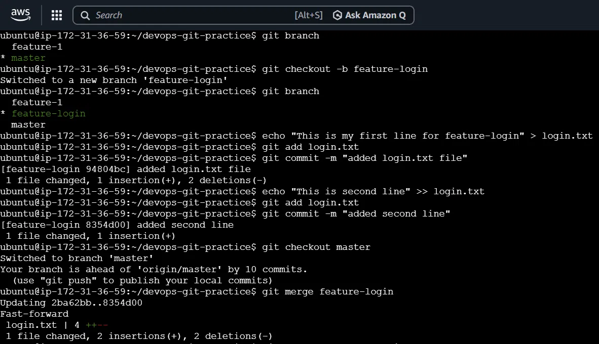
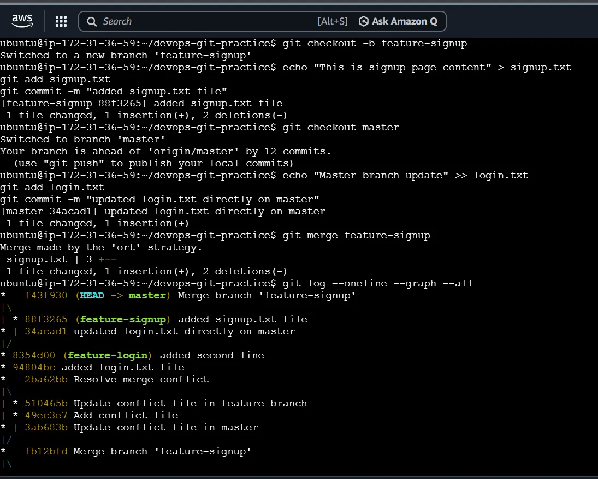
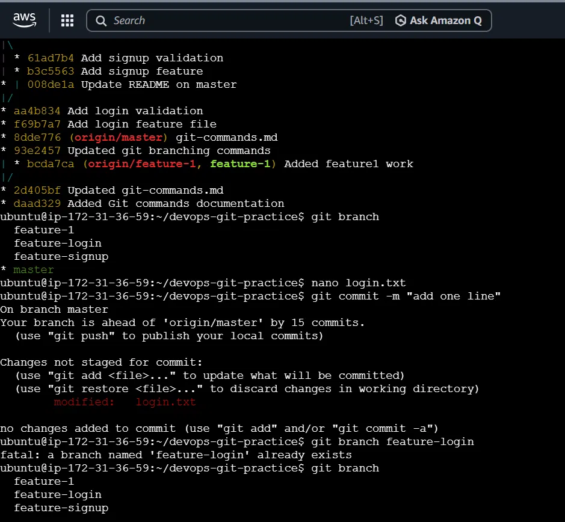
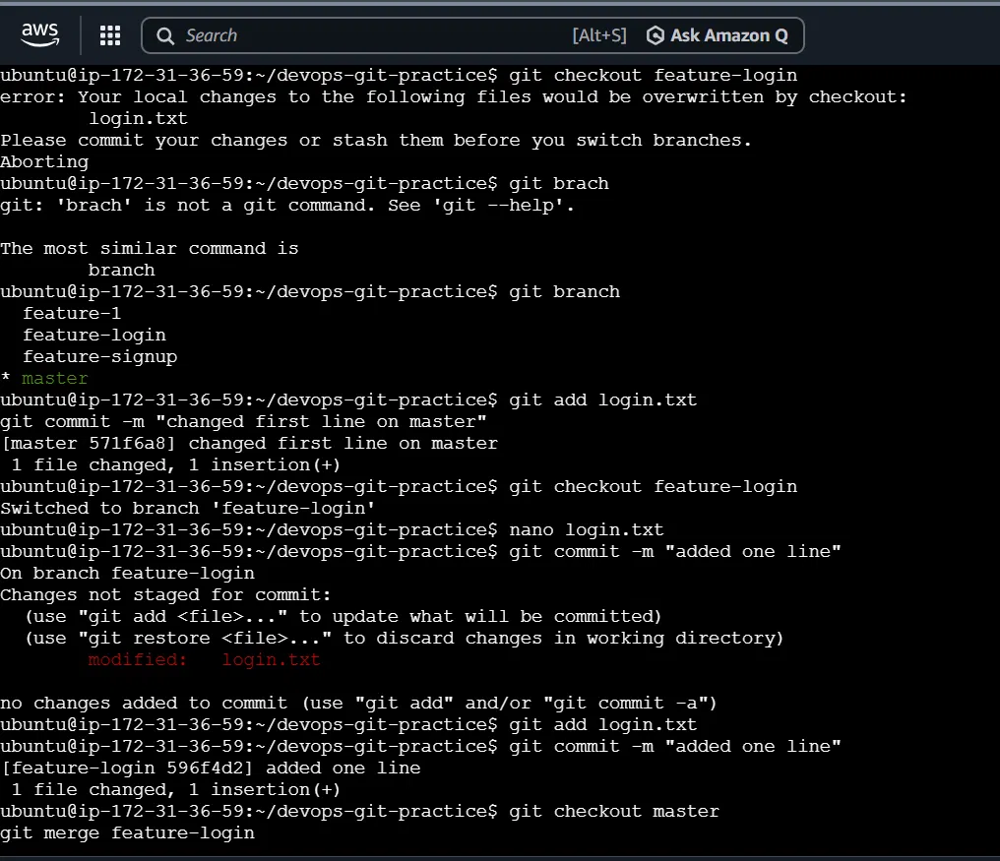
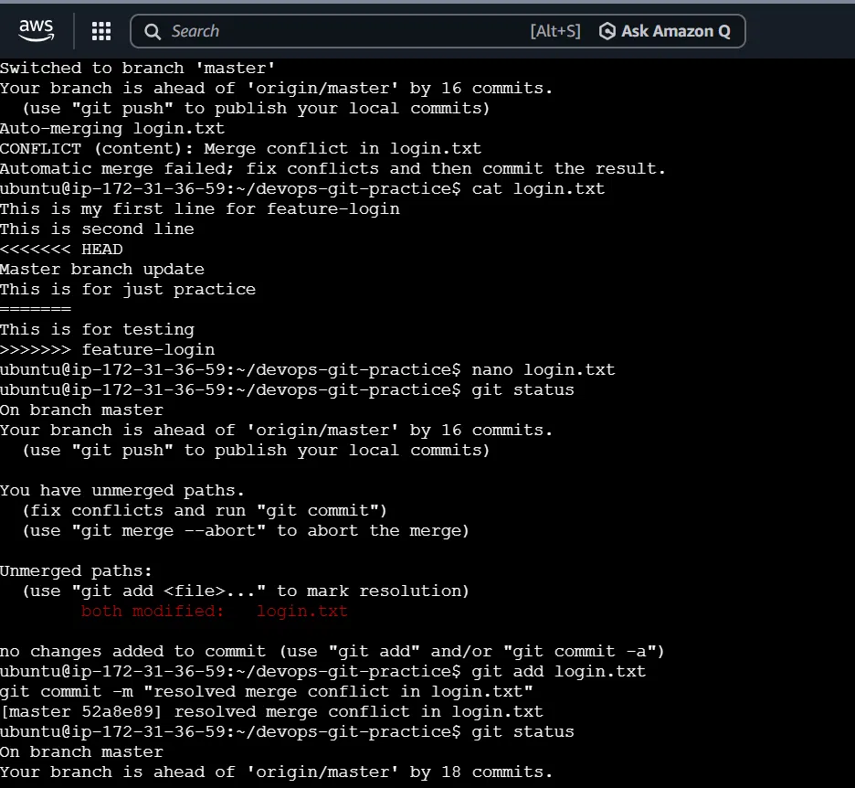

**Q&A (Notes):**

**Q: What is a fast-forward merge?**
A: It happens when the main branch hasn't changed since you started your own branch. Git simply moves the main branch pointer forward to your latest commit — no separate merge commit is created, and the history stays a straight line.

**Q: When does Git create a merge commit instead?**
A: When the main branch has moved forward with its own new commits while you were working separately. Since both branches now have different histories, Git creates a special commit with two parents to join them together.

**Q: What is a merge conflict? (try creating one intentionally by editing the same line in both branches)**
A: A merge conflict happens when two branches change the exact same line of the exact same file in different ways. Git can't decide which version is correct, so it pauses and asks a human to choose. I intentionally edited the same line of `login.txt` on both `master` and `feature-login`, and when I tried to merge, Git flagged a conflict. I then manually edited the file to keep the correct content, removed the conflict markers, and completed the merge with a commit.

---

## Task 2: Rebase

**What I did:**
I created a branch, added a few commits, then added another commit to the main branch separately. Instead of merging, I used **rebase** to bring my branch up to date.

**What I learned:**

- Rebase takes your commits, temporarily sets them aside, and replays them *on top of* the latest version of the main branch — as if you had started your work later than you actually did.
- The result is a clean, straight-line history, with no messy merge commits.
- **Important rule**: Never rebase commits that have already been shared with others (e.g., already pushed to a shared branch). Rebase changes the commit history, so if teammates already have the old version, it creates confusion and conflicts for everyone.
- **When to use what**: Rebase is great for cleaning up your *own* work before sharing it. Merge is better once work is already shared with a team, since it keeps the true record of what happened.

**Why this matters:** Rebase keeps project history clean and easy to read, which is useful when many people are contributing.

**Screenshots:**

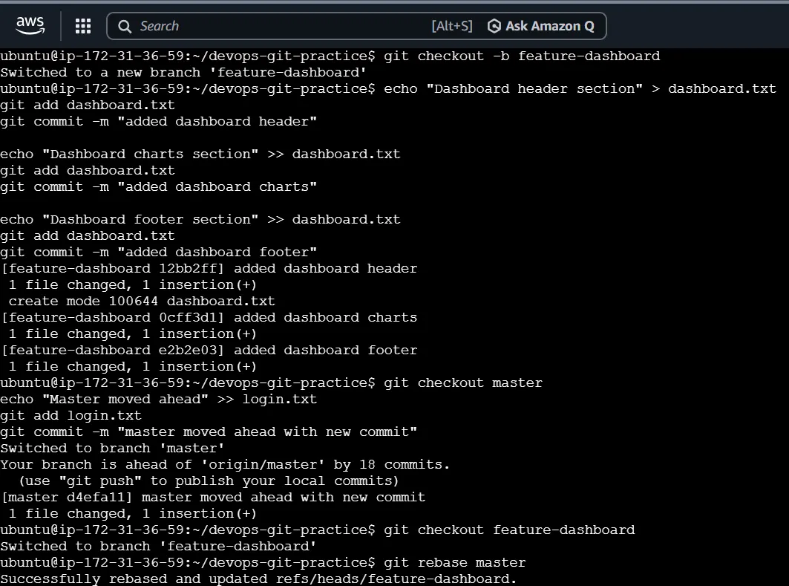
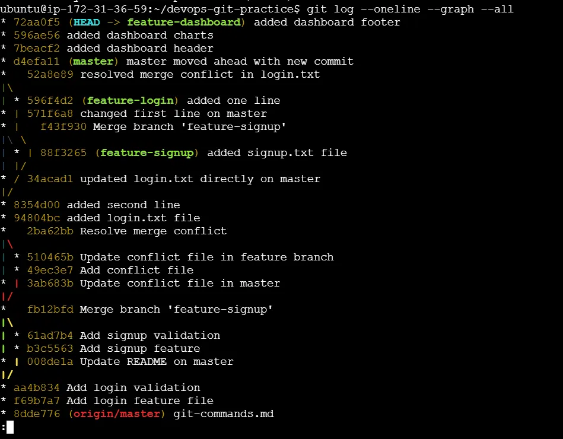

**Q&A (Notes):**

**Q: What does rebase actually do to your commits?**
A: Rebase temporarily removes your commits, moves your branch's starting point to the latest commit on the target branch (main), and then replays your commits one by one on top of it. Each replayed commit gets a brand-new ID (hash), even though the content is the same.

**Q: How is the history different from a merge?**
A: A merge keeps both branches' original history and adds one extra "joining" commit, which shows up as a branch-and-reunite (diamond) shape in the log. A rebase rewrites history into one straight line — it looks as if you did all your work directly on top of the latest main branch, with no branching visible at all.

**Q: Why should you never rebase commits that have been pushed and shared with others?**
A: Because rebase changes the commit IDs. If teammates already pulled the original commits, and you rebase and push new ones, their copy and your copy of history no longer match. This creates confusing duplicate commits and conflicts for everyone else working on that branch. Rebase should only be used on your own private, not-yet-shared work.

**Q: When would you use rebase vs merge?**
A: Use rebase on your own local branch, before sharing it, to keep your history clean and linear. Use merge once a branch is already shared with others, or when you want to preserve the true record of when and how the branches diverged — which is especially important for shared or production branches.

---

## Task 3: Squash Merge vs Regular Merge

**What I did:**
I made several small commits (like fixing typos, small formatting changes) on one branch, and combined them into a **single commit** using squash merge. Then I did a separate branch with a **regular merge**, which kept every commit separately.

**What I learned:**

- **Squash merge** takes many small commits and bundles them into **one clean commit**. Great when you don't need to track every tiny step — just the final result.
- **Regular merge** keeps every individual commit visible in the history — useful when you want a detailed record of every change.
- **Trade-off**: Squashing gives a cleaner history, but you lose the fine-grained detail of exactly what changed and when, which can make it harder to track down bugs later.

**Why this matters:** Squashing is commonly used in real companies to keep the main project history simple and readable, especially in pull requests.

**Screenshots:**

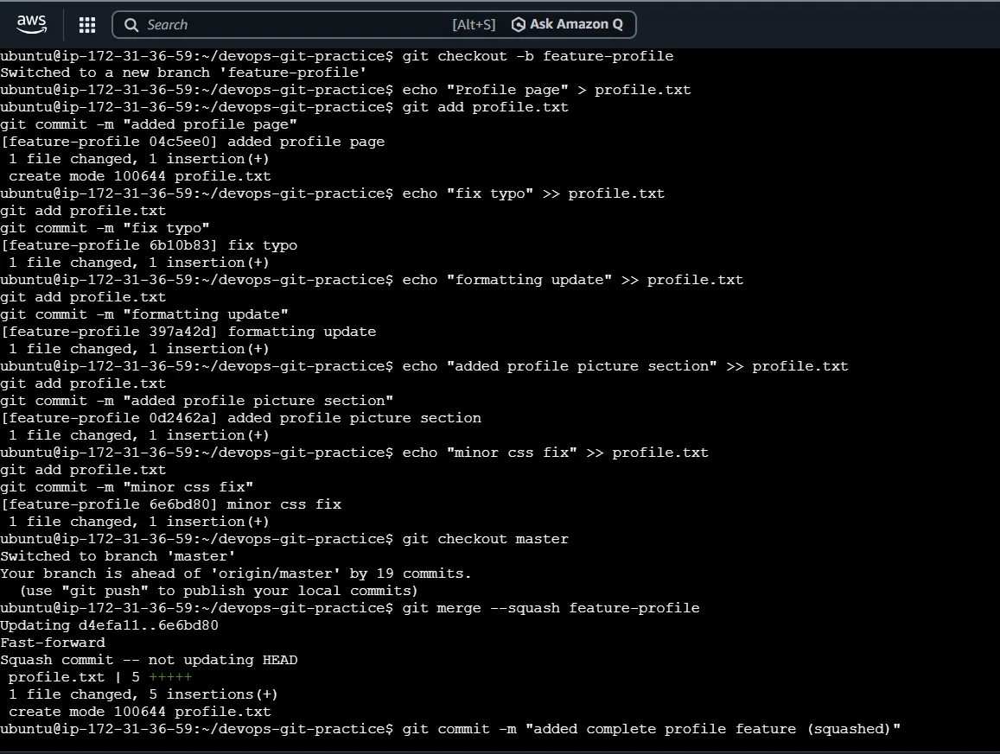
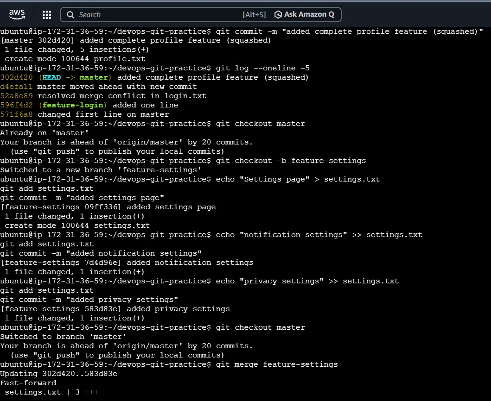
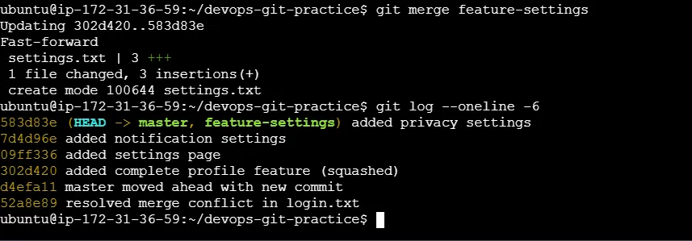

**Q&A (Notes):**

**Q: What does squash merging do?**
A: It takes all the individual commits from a branch (in my case, 5 small commits) and combines them into a single new commit on the main branch. The original step-by-step history is not carried over — only the final combined result is added.

**Q: When would you use squash merge vs regular merge?**
A: Use squash merge when a branch has lots of small or messy commits (like typo fixes or quick tweaks) that don't need to be tracked individually — you just want one clean commit summarizing the whole feature. Use a regular merge when you want to keep every individual commit visible, for example on larger features where you may need to trace exactly what changed and when.

**Q: What is the trade-off of squashing?**
A: You get a cleaner, easier-to-read history, but you lose the detailed record of each small step. This can make it harder later to pinpoint exactly which change introduced a bug, since everything is bundled into one commit instead of several traceable ones.

---

## Task 4: Stash

**What I did:**
I started editing a file but didn't save (commit) my work, then tried to switch to another branch. Git blocked me and warned that my unsaved changes would be lost. I used **git stash** to temporarily "put my work aside," switched branches, did other work, and later brought my saved work back.

**What I learned:**

- **git stash** is like a temporary "save for later" box — you can set aside unfinished work without committing it, do something else, and come back to it anytime.
- **git stash apply** brings your saved work back but keeps a copy in the box (in case you need it again).
- **git stash pop** brings your saved work back *and* removes it from the box (a one-time use).

**Why this matters:** In real jobs, this happens all the time — you're in the middle of something, then get pulled away for an urgent task. Stash lets you pause your work safely without losing anything.

**Screenshots:**

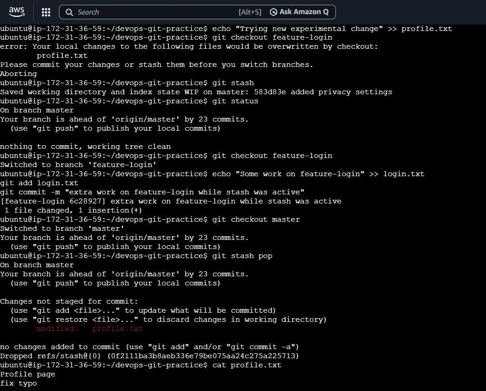
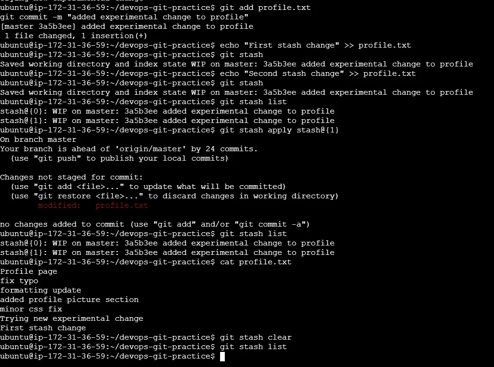

**Q&A (Notes):**

**Q: What is the difference between `git stash pop` and `git stash apply`?**
A: `git stash apply` brings your saved changes back to your working files, but keeps a copy safely stored in the stash list, in case you need it again. `git stash pop` brings your changes back *and* automatically deletes that saved copy from the list — meant for one-time use. I confirmed this by applying a stash and checking that it still appeared in `git stash list` afterward, unlike a popped stash which disappeared.

**Q: When would you use stash in a real-world workflow?**
A: When I'm in the middle of unfinished work and suddenly need to switch branches — for example, to fix an urgent bug, review a teammate's code, or pull the latest updates from the main branch — without wanting to commit incomplete or messy work just to save it temporarily.

---

## Task 5: Cherry-Pick

**What I did:**
I made 3 separate commits on one branch (each fixing a different bug). Instead of bringing over all 3, I picked out just **one specific commit** and applied it to the main branch, leaving the other two behind.

**What I learned:**

- **Cherry-pick** lets you grab one specific change from a branch, without bringing along everything else on that branch.
- This is useful for **urgent fixes** — for example, if a critical bug fix exists on a branch that isn't ready to be fully merged yet, you can cherry-pick just that fix straight into production.
- **Risks**: If the picked commit depends on other changes that were left behind, things can break. It can also create confusing history, since the same fix might end up with different "IDs" on different branches.

**Why this matters:** This mirrors real hotfix situations — getting an urgent fix live without waiting for an entire feature to be finished.

**Screenshots:**

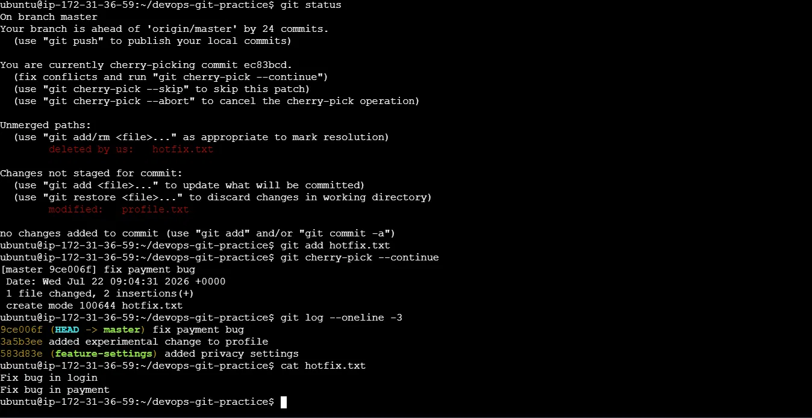

**Q&A (Notes):**

**Q: What does cherry-pick do?**
A: Cherry-pick takes one specific commit from another branch and applies just that commit's changes onto the current branch, as a brand-new commit — without bringing along any of the commits that came before or after it on the original branch.

**Q: When would you use cherry-pick in a real project?**
A: For urgent hotfixes — when a bug fix already exists on a development branch, but you need it live on the main/production branch right away, without merging the entire (possibly unfinished) feature branch. Also useful for backporting a fix to an older release, or moving a commit that was made on the wrong branch by mistake.

**Q: What can go wrong with cherry-picking?**
A: If the picked commit depends on earlier changes that weren't brought over, the code can break. It can also cause conflicts — as happened in my case, where the file didn't exist yet on the main branch, causing a "modify/delete" conflict that had to be resolved manually. Additionally, the same change can end up with different commit IDs on different branches, making history harder to trace over time.

---

## Summary — Why This Practice Matters

These are the everyday tools professional developers use to manage code changes safely when working alone or in a team:

| Concept | In Simple Terms |
|---|---|
| **Merge** | Combine two sets of changes into one |
| **Rebase** | Reorganize your changes to sit cleanly on top of the latest code |
| **Squash** | Combine many small changes into one clean summary |
| **Stash** | Temporarily set aside unfinished work |
| **Cherry-pick** | Copy just one specific change from one place to another |

All 14 screenshots in the `screenshots/` folder serve as proof that each of these workflows was practiced and verified hands-on in a real terminal environment.
