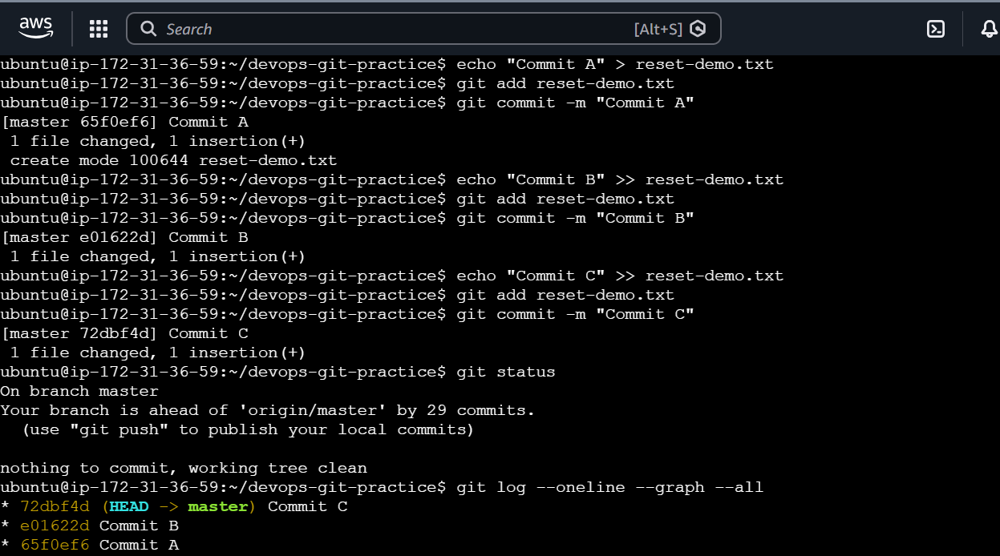
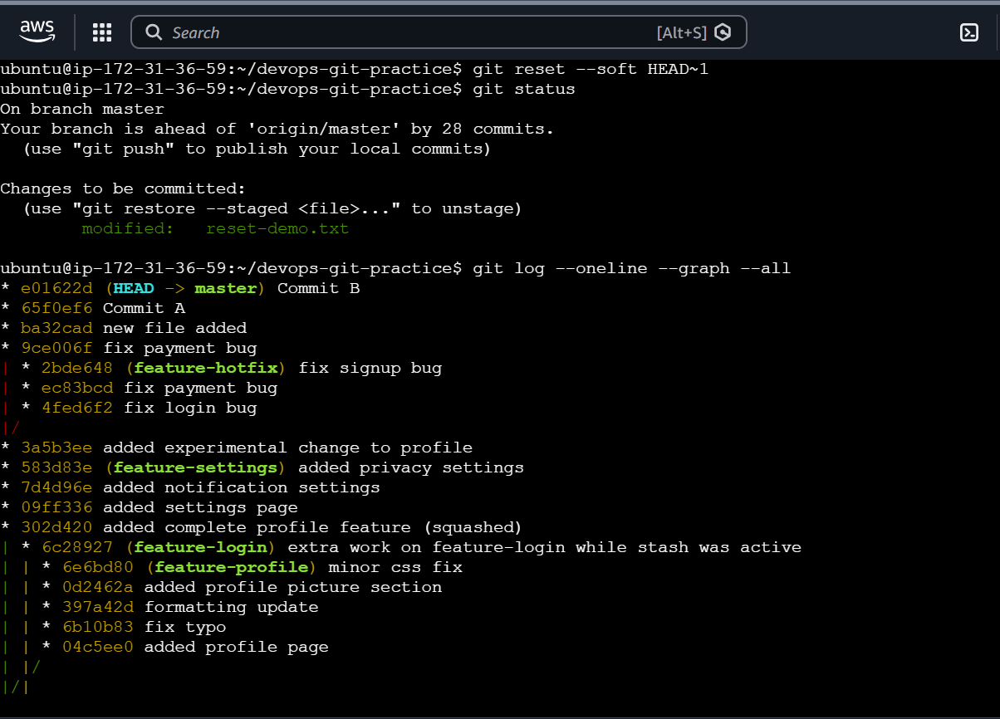
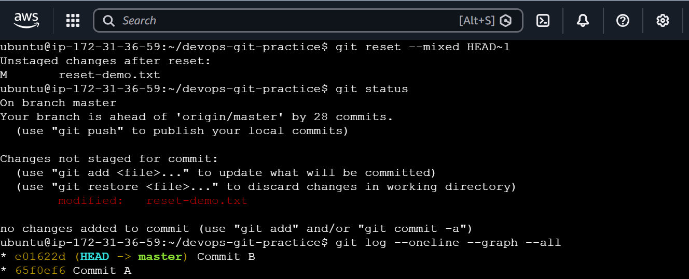
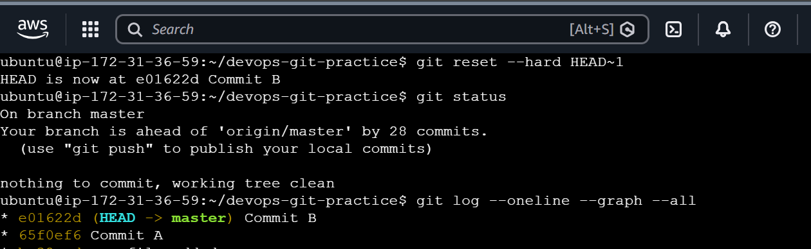
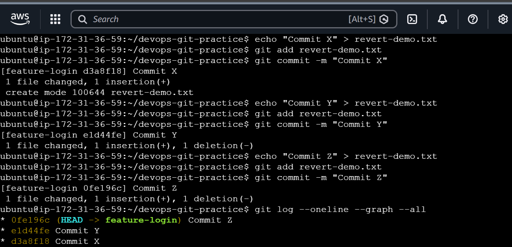
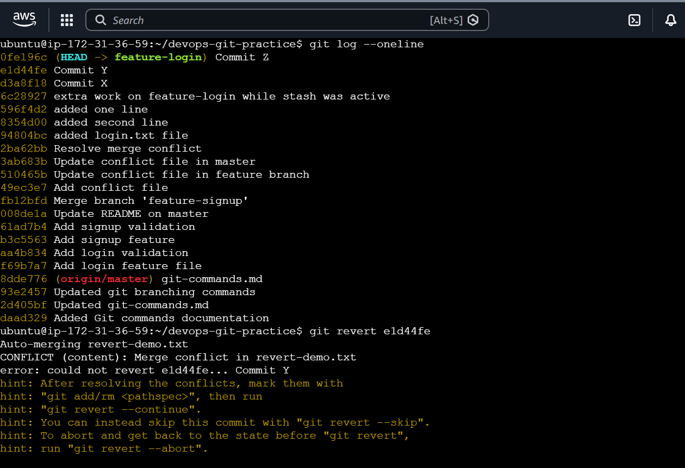
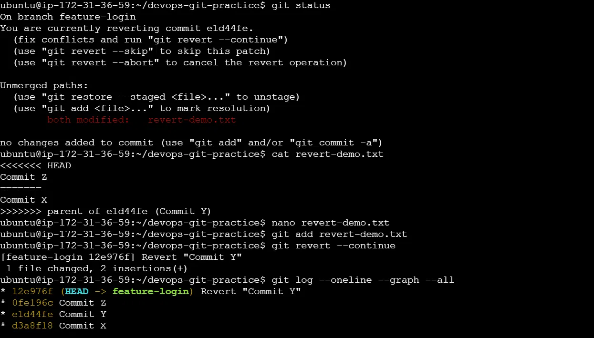

# Day 25 - Git Reset vs Revert & Branching Strategies

## Overview

Today I learned how to undo mistakes safely in Git using `git reset` and `git revert`.

I also learned different branching strategies used by engineering teams for managing code collaboration.

---

# Task 1: Git Reset Hands-on

## What is Git Reset?

Git reset is used to move the HEAD pointer to a previous commit and undo commits.

It is mainly used for local changes before pushing code to a remote repository.

---

## Creating Three Commits

Created three commits:
```
Commit C
Commit B
Commit A
```

Screenshot:



---

## Git Reset --soft

Command:

```bash
git reset --soft HEAD~1
```

Output:

```bash
$ git reset --soft HEAD~1
$ git status
On branch feature-login
Changes to be committed:
  (use "git restore --staged <file>..." to unstage)
        modified:   reset-demo.txt
```

Observation:
- Latest commit was removed from commit history.
- Changes were kept in the staging area.
- Changes were not deleted and could be committed again.

Screenshot:



Use Case:
Use soft reset when:
- Commit message needs to be changed.
- Need to add more changes to the previous commit.
- Want to combine commits.

---

## Git Reset --mixed

Command:

```bash
git reset --mixed HEAD~1
```

Output:

```bash
$ git reset --mixed HEAD~1
$ git status
On branch feature-login
Changes not staged for commit:
  (use "git add <file>..." to update what will be committed)
        modified:   reset-demo.txt
```

Observation:
- Latest commit was removed.
- Changes were kept in the working directory.
- Changes became unstaged.

Screenshot:



Use Case:
Use mixed reset when:
- Want to remove a commit but keep file changes for editing.

---

## Git Reset --hard

Command:

```bash
git reset --hard HEAD~1
```

Output:

```bash
$ git reset --hard HEAD~1
HEAD is now at a1b2c3d Commit B
$ git status
On branch feature-login
nothing to commit, working tree clean
```

Observation:
- Latest commit was removed.
- Changes were also deleted.
- Working directory became clean.

Screenshot:



Important:
`git reset --hard` is destructive because it permanently removes changes.

---

## Difference Between Reset Modes

| Command | Commit | Changes |
|---|---|---|
| git reset --soft | Removed | Staged |
| git reset --mixed | Removed | Unstaged |
| git reset --hard | Removed | Deleted |

---

# Task 2: Git Revert Hands-on

## Creating Three Commits

Created three commits:
```
Commit Z
Commit Y
Commit X
```

Screenshot:



## Reverting Commit Y

Command:

```bash
git revert <commit-id>
```

Example:

```bash
git revert e1d44fe
```

Output:

```bash
$ git revert e1d44fe
[feature-login 12e976f] Revert "Commit Y"
 1 file changed, 1 insertion(+), 1 deletion(-)
```

Observation:
- Git created a new revert commit.
- Original Commit Y remained in history.
- Changes introduced by Commit Y were undone.

Screenshot:



## After Revert History

```
Revert "Commit Y"
Commit Z
Commit Y
Commit X
```

Screenshot:



---

# Task 3: Git Reset vs Git Revert Comparison

| Point | Git Reset | Git Revert |
|---|---|---|
| What it does | Moves HEAD to previous commit and changes history | Creates a new commit that reverses previous changes |
| Removes commit from history? | Yes | No |
| Safe for shared branches? | No | Yes |
| When to use | Local commits before push | Shared branches after push |

---

# Task 4: Branching Strategies

## 1. GitFlow

**How it works**

GitFlow uses different branches for different purposes.

Flow:

```
main
 |
develop
 |
feature branches
 |
release
 |
hotfix
```

**Used For:**
- Large teams
- Enterprise projects
- Scheduled releases

**Pros:**
- Structured workflow
- Better release management
- Clear separation between development and production

**Cons:**
- More complex
- Slower compared to simpler workflows

---

## 2. GitHub Flow

**How it works**

GitHub Flow is a simple branching strategy.

Flow:

```
main
 |
feature branch
 |
Pull Request
 |
Merge to main
```

**Used For:**
- Startups
- Continuous deployment
- Fast-moving projects

**Pros:**
- Simple workflow
- Easy collaboration
- Faster releases

**Cons:**
- Requires good testing
- Not ideal for multiple release versions

---

## 3. Trunk-Based Development

**How it works**

Developers frequently merge small changes into the main branch.

Flow:

```
main
 |
short-lived branches
 |
main
```

**Used For:**
- DevOps teams
- CI/CD environments
- Teams with strong automation

**Pros:**
- Faster integration
- Fewer merge conflicts
- Supports continuous delivery

**Cons:**
- Requires strong automated testing
- Needs disciplined development practices

---

## Branching Strategy Selection

**Which strategy for a startup shipping fast?**

Recommended: **GitHub Flow**

Reason:
- Simple process
- Faster deployment
- Less management overhead

**Which strategy for a large team with scheduled releases?**

Recommended: **GitFlow**

Reason:
- Separate development and release branches
- Better release control

**Open Source Example**

Linux Kernel follows a structured development workflow using multiple maintainers and topic branches.

---

## Key Learnings

- Git reset is useful for undoing local commits.
- Git revert is safer for shared branches.
- Avoid using reset on already pushed commits.
- Choose branching strategy based on team size and workflow.
- Git history is important for collaboration and debugging.


