# Day 33 - Docker Compose (Full Detail, Explained from Basics)

This document is written so that even someone who knows nothing about Docker Compose can read it and fully understand - what was done today, what was written in which file, and which command was used for what.

---

## First of All: What is Docker Compose?

In simple words - using **Docker**, we create a "container", inside which one application runs (like nginx, mysql, wordpress). But in a real project, one application usually needs other apps too - for example, WordPress needs a database (MySQL). When we need to run such multiple containers **together, in a certain order, with a single command**, we use **Docker Compose**.

The first step to use Compose is to create a file called:
```
docker-compose.yml
```
In this file, we write which containers (services) need to run, which image to use, which ports to open, where to save data, etc. Then by running one command (`docker compose up`), all containers start at the same time.

---

## Task 1: Docker Compose Install & Verify

Before using Compose, we need to check whether it is installed on the system or not. Command used:

```
docker compose version
```

**Word-by-word meaning of this command:**
- `docker` = calling the Docker tool.
- `compose` = telling it we want to use Docker's "compose" feature.
- `version` = show its version number, which also confirms whether it is installed or not.

If this command shows a version number in the output (like `Docker Compose version v2.x.x`), it means the installation is correct.

**Screenshot:**

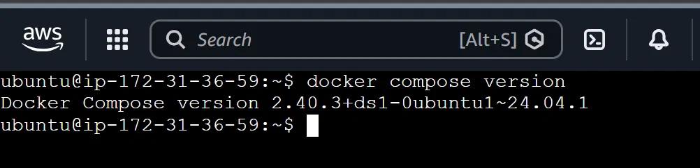

---

## Task 2: Running Nginx with Docker Compose

### Example YAML file content (word by word):

```yaml
services:
  web:
    image: nginx:latest
    ports:
      - "8080:80"
```

**Now let's understand each line's meaning:**

- `services:` - this is the most important part of the whole file. Here we say how many "services" (meaning containers) are defined in the file. It's like a heading - all the services are written below it.

- `web:` - this is the **name of the service**, which we give ourselves (any name works - `web`, `mywebsite`, anything). This container will be identified by this name later.

- `image: nginx:latest` - `image` means "which ready-made software package to use". `nginx` is the name of a web server, and `:latest` means "use the newest version". This line says that this container will run the nginx web server.

- `ports:` - this section tells how the container's port connects to our computer's (host's) port.

- `"8080:80"` - this has two numbers, separated by a colon (`:`).
  - Left side (`8080`) = the **port on our own computer** (host port), which we use in the browser to access the app.
  - Right side (`80`) = the **port inside the container**, on which nginx runs internally.
  - So this means "connect port 8080 of my computer to port 80 of the container".

### Command used:

```
docker compose up
```

**Meaning:** `up` means "start all the services written in the file". When this command runs, Docker reads the file, downloads the image (if not already present), and starts the container.

Then, typing `localhost:8080` in the browser shows nginx's default welcome page, because port 8080 is connected to the container's port 80.

**Screenshots:**

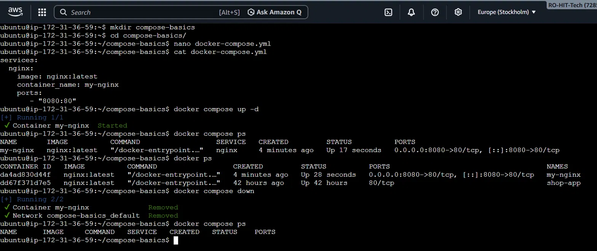

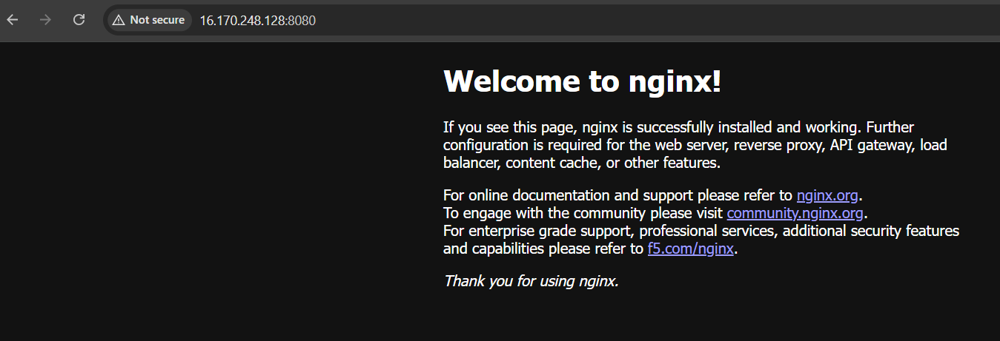

---

## Task 3: WordPress + MySQL - Multi-Service App with Volumes

### Example YAML file content (word by word):

```yaml
services:
  db:
    image: mysql:5.7
    environment:
      MYSQL_ROOT_PASSWORD: rootpass
      MYSQL_DATABASE: wordpress
      MYSQL_USER: wpuser
      MYSQL_PASSWORD: wppass
    volumes:
      - db_data:/var/lib/mysql

  wordpress:
    image: wordpress:latest
    depends_on:
      - db
    ports:
      - "8000:80"
    environment:
      WORDPRESS_DB_HOST: db
      WORDPRESS_DB_USER: wpuser
      WORDPRESS_DB_PASSWORD: wppass
      WORDPRESS_DB_NAME: wordpress

volumes:
  db_data:
```

**Now let's go through this line by line:**

- `services:` - same as before, the section that says "how many containers are there below".

- `db:` - the name of the first service. This container will be used for the **database**, so it's named `db`.

- `image: mysql:5.7` - use the ready-made MySQL database software image, version `5.7`.

- `environment:` - this section is used when we need to give some settings to the container, passed as "environment variables". This means the container gets these values as soon as it starts.

  - `MYSQL_ROOT_PASSWORD: rootpass` - sets the admin (root) password for MySQL.
  - `MYSQL_DATABASE: wordpress` - automatically creates a database named `wordpress`.
  - `MYSQL_USER: wpuser` - creates a new user named `wpuser`.
  - `MYSQL_PASSWORD: wppass` - the password for that user.

- `volumes:` (inside the db service) - `- db_data:/var/lib/mysql` - this means: all of MySQL's data is internally saved inside the `/var/lib/mysql` folder. But if the container is deleted, that data would also be deleted. To save it from that, we create a **volume** named `db_data` (this is permanent storage outside of Docker) and link it to that folder. Because of this, even if the container is gone, the data stays safe.

- `wordpress:` - the second service, to run the WordPress application.

- `image: wordpress:latest` - the ready-made WordPress image.

- `depends_on:` - `- db` - this means: "before starting this wordpress service, start the `db` service first". This is because WordPress needs the database to be ready first, only then can it connect to it.

- `ports:` - `"8000:80"` - our computer's port `8000` is connected to the wordpress container's port `80`. So opening `localhost:8000` in the browser shows WordPress.

- `environment:` (inside wordpress):
  - `WORDPRESS_DB_HOST: db` - tells WordPress where the database is - `db` (the name we gave the service; both services identify each other by this name).
  - `WORDPRESS_DB_USER`, `WORDPRESS_DB_PASSWORD`, `WORDPRESS_DB_NAME` - these are the same values that were set in the database's `environment`, passed here too, so WordPress can log in to that database.

- At the very bottom, `volumes:` (outside the services) - `db_data:` - this simply means, officially create a volume named `db_data`. This is a top-level section, where all volumes get registered.

### Commands and their meaning:

```
docker compose up
```
Starts all services (db + wordpress).

The WordPress setup page opens in the browser (site title, admin username/password, etc. get filled in).

```
docker compose down
```
**Meaning:** `down` means "stop/remove all running containers and their network". But note - since `volumes` were defined separately, even after `down`, the volume's data does not get deleted.

```
docker compose up
```
(again) - starts the services again, and now the previous WordPress data (site title, posts) appears the same as before - because the data was kept safe in the volume.

**Screenshots:**

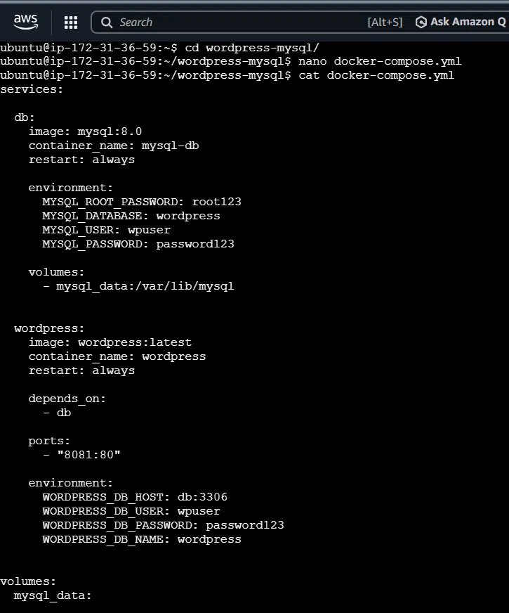
*The YAML file used.*

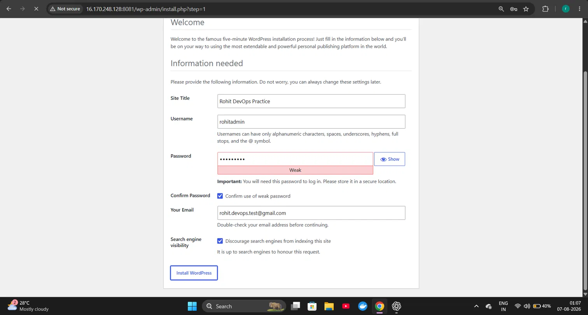
*Setup screen.*

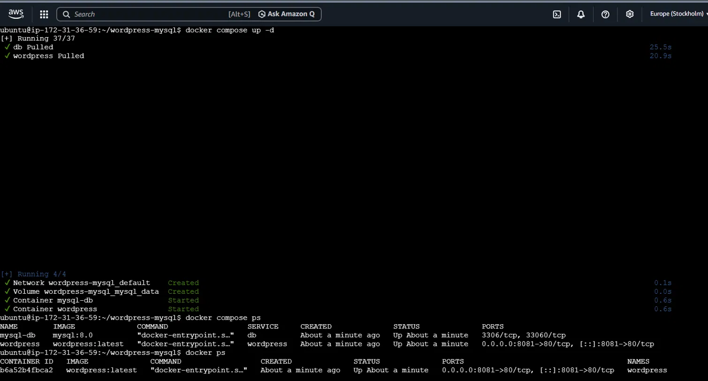
*Both services running.*

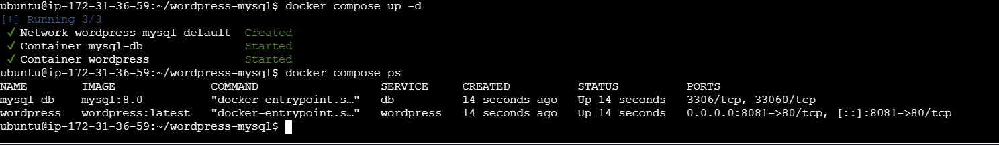
*Working after restart.*

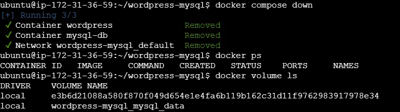
*Even after down, the volume's data is still there.*

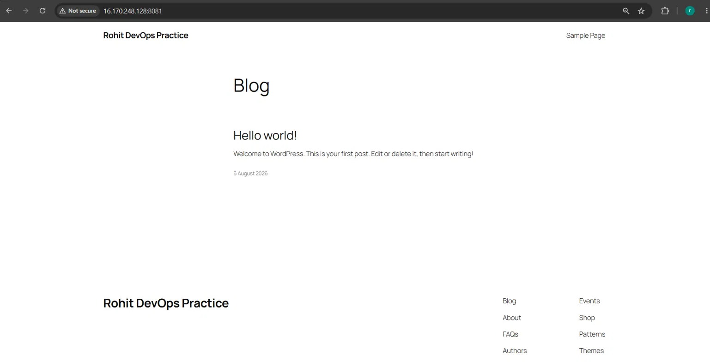
*After bringing it up again, the previous WordPress data appeared.*

---

## Task 4: Compose Lifecycle Commands (Up, Down, Stop, Logs, Ps)

### 1. Running in detached mode:

```
docker compose up -d
```

**Word-by-word meaning:**
- `up` - start the services.
- `-d` - this stands for **"detached"**. Giving this flag (option) makes the containers run in the **background**, and frees up the terminal for use again. (Without `-d`, the terminal stays "attached" to that window, and you can't type anything else in that window until the container is stopped.)

### 2. Checking running services:

```
docker compose ps
```

**Meaning:** `ps` means "process status". This command shows the current status of all services - which container is running, which is stopped, which port is being used, etc.

### 3. Checking logs:

```
docker compose logs
```

**Meaning:** `logs` means all the text of what's happening inside the container, what messages/errors are being printed. Running `docker compose logs` shows **the combined logs of all services together**.

To see a specific service's log, add the service name after it:

```
docker compose logs mysql
```
This shows only the `mysql` service's log.

```
docker compose logs wordpress
```
This shows only the `wordpress` service's log.

**Why this is useful:** If a particular service crashes or shows an error, instead of checking all logs together, checking that specific service's log helps find the problem faster.

### 4. Stopping the services:

```
docker compose stop
```
**Meaning:** `stop` means "stop the containers, but don't delete them". The container still remains in the system, it's just not "running" - it's in a "stopped" state. Running `docker compose up` again starts the same container back up.

```
docker compose down
```
**Meaning:** `down` means "stop the containers, and also delete their network". This is one step further than `stop` - the containers are now removed from the system (but if a volume was defined separately, that volume's data stays safe).

**Screenshots:**

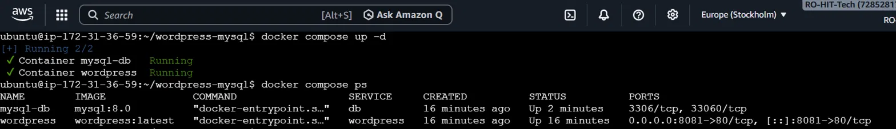
*Up with `-d` and the `ps` output.*

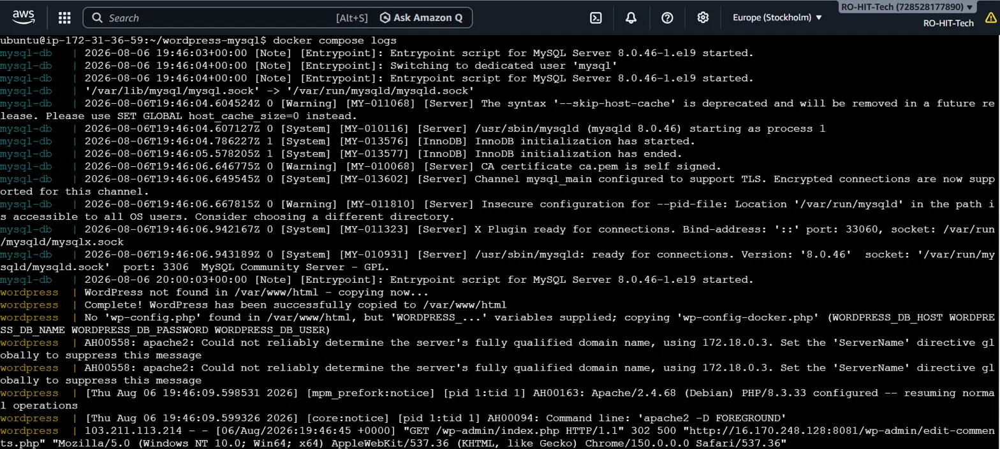
*All combined logs.*

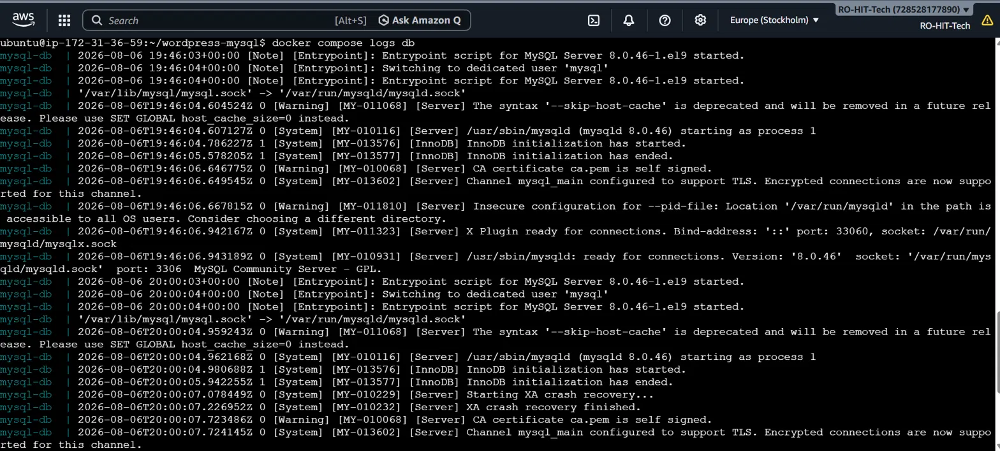
*Only mysql's log.*

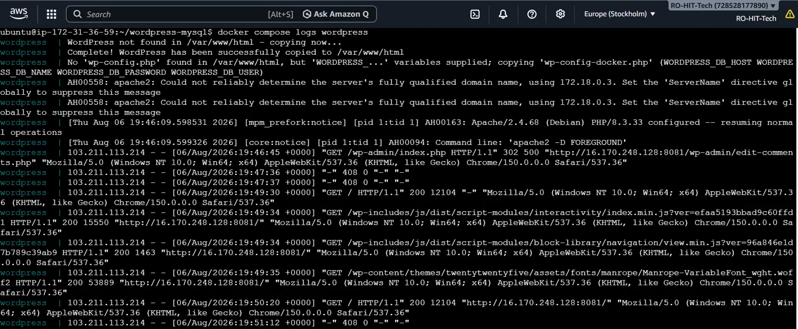
*Only wordpress's log.*

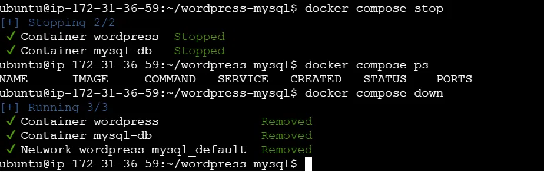
*Stop and down commands.*

---

## Task 5: Managing Configuration Using a `.env` File

### Example `.env` file content:

```
MYSQL_ROOT_PASSWORD=rootpass
MYSQL_DATABASE=wordpress
MYSQL_USER=wpuser
MYSQL_PASSWORD=wppass
```

**Meaning:** This is a simple text file where values are written in `KEY=VALUE` format (equal sign, no quotes, no spaces). This file is kept right next to `docker-compose.yml` (in the same folder). Docker Compose automatically reads this file and uses the values from it.

### Referencing `.env` in `docker-compose.yml`:

```yaml
services:
  db:
    image: mysql:5.7
    environment:
      MYSQL_ROOT_PASSWORD: ${MYSQL_ROOT_PASSWORD}
      MYSQL_DATABASE: ${MYSQL_DATABASE}
      MYSQL_USER: ${MYSQL_USER}
      MYSQL_PASSWORD: ${MYSQL_PASSWORD}
```

**Meaning:**
- `${MYSQL_ROOT_PASSWORD}` - this dollar-curly-braces syntax means: "the value is not written directly here, instead use the value of the variable named `MYSQL_ROOT_PASSWORD` from the `.env` file". So if the `.env` file has `MYSQL_ROOT_PASSWORD=rootpass`, Compose will automatically fill in `rootpass` here.

**Why this is useful:** Because of this, sensitive things like passwords/usernames don't appear directly in the compose file. Just updating the `.env` file changes all the values - there's no need to touch the compose file.

### Command used to verify:

```
docker compose config
```

**Meaning:** `config` means "show what the final compose file will look like, with all the `${...}` variables replaced". Running this command shows that `${MYSQL_ROOT_PASSWORD}` has actually been replaced with `rootpass` (or whatever value was given in `.env`). This lets you confirm the `.env` file is linked correctly, before actually running the app.

### Then ran the app:

```
docker compose up
```
Running this starts all services successfully, using the values from `.env`.

**Screenshots:**

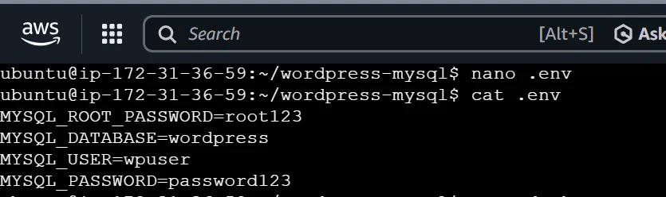
*Content of the `.env` file.*

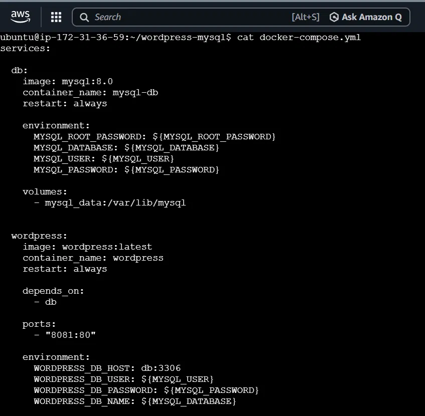
*Use of `${VARIABLE}` syntax in the compose file.*

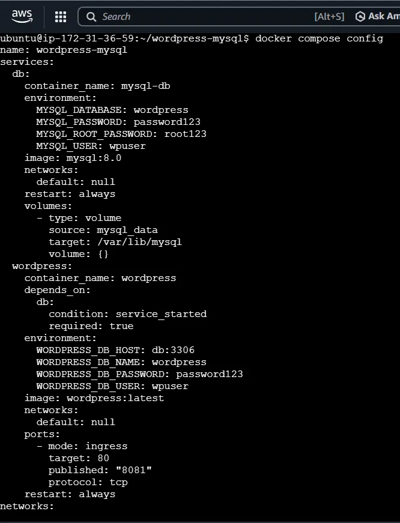
*Output of `docker compose config`.*

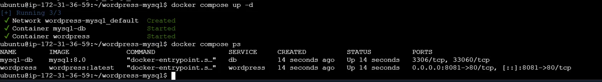
*Proof that the app ran successfully with `.env`.*

---

## Overall Summary (Day 33) - In Simple Words

1. Checked whether Compose is installed or not (`docker compose version`).
2. Wrote a simple YAML file (`image`, `ports`) and ran nginx.
3. Wrote two services (`db` and `wordpress`) in one YAML file, gave them settings using `environment` variables, fixed the order using `depends_on`, and made the data permanent using `volumes`.
4. Used Compose's lifecycle commands (`up -d`, `ps`, `logs`, `stop`, `down`) - practically saw what each command does.
5. Kept sensitive values separate from the compose file using a `.env` file, linked them using `${VARIABLE}` syntax, and verified using `docker compose config`.

Understanding this whole flow means any new person can easily learn the basic to intermediate level usage of Docker Compose.
