# Day 34 – Docker Compose: Real-World Multi-Container Apps

## 📌 Overview

Today I worked on a more realistic Docker Compose setup with multiple services.

Instead of running only one container, I created a **3-service application stack**:

* **Flask** – Web application
* **MySQL** – Database
* **Redis** – Cache

I also practiced:

* `depends_on`
* Healthchecks
* Restart policies
* Custom Dockerfiles
* Named networks
* Named volumes
* Docker labels
* Scaling with `docker compose up --scale`
* Troubleshooting container failures
* Understanding Docker exit code `137`
* Understanding host port conflicts

---

# 1. Application Architecture

The stack contains three services:

```text
                Docker Compose
                     │
       ┌─────────────┼─────────────┐
       ↓             ↓             ↓
    Flask App      MySQL         Redis
      Web           DB           Cache
    Port 5000
```

### Services

| Service | Image / Build           | Purpose     |
| ------- | ----------------------- | ----------- |
| web     | Custom Flask Dockerfile | Application |
| db      | mysql:8.0               | Database    |
| cache   | redis:latest            | Cache       |

All three services communicate through the custom Docker network:

```text
app-network
```

---

# 2. Flask Application

I created a simple Flask application.

The application does not have complex business logic. The purpose was to understand how a web application can run inside Docker Compose along with a database and cache.

### Application files

```text
day34-compose-advanced/
│
├── docker-compose.yml
│
└── app/
    ├── Dockerfile
    ├── app.py
    └── requirements.txt
```


---

# 3. Custom Dockerfile

I created a custom Dockerfile instead of directly using a pre-built Flask image.

### Dockerfile

```dockerfile
FROM python:3.12-slim

WORKDIR /app

COPY . .

RUN pip install -r requirements.txt

EXPOSE 5000

CMD ["python3", "app.py"]
```

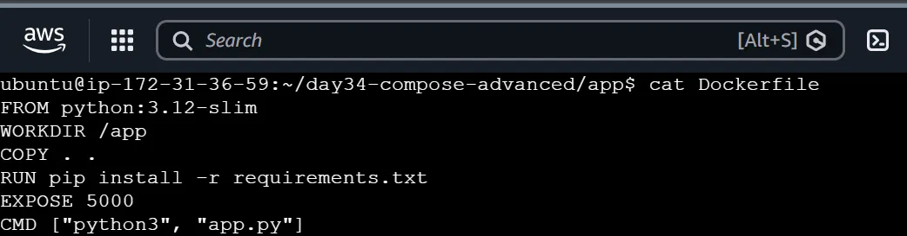

### Explanation

#### `FROM`

```dockerfile
FROM python:3.12-slim
```

Uses a lightweight Python image.

#### `WORKDIR`

```dockerfile
WORKDIR /app
```

Sets `/app` as the working directory inside the container.

#### `COPY`

```dockerfile
COPY . .
```

Copies the application files into the container.

#### Install dependencies

```dockerfile
RUN pip install -r requirements.txt
```

Installs Flask and other required Python packages.

#### Expose port

```dockerfile
EXPOSE 5000
```

Documents that the Flask application uses port `5000`.

#### Start application

```dockerfile
CMD ["python3", "app.py"]
```

Starts the Flask application.

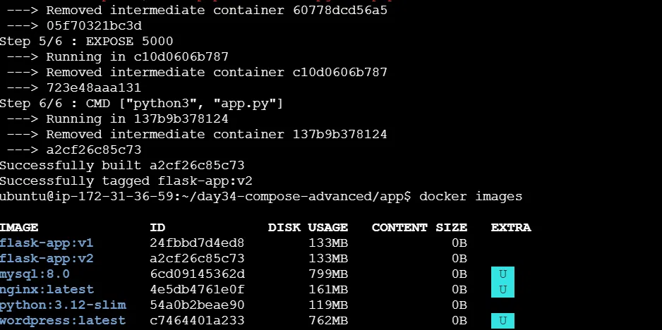

---

# 4. Docker Compose

Docker Compose allows multiple containers to be managed from one YAML file.

Instead of manually creating:

```text
Network
Volume
MySQL container
Redis container
Flask container
```

I can define everything in:

```text
docker-compose.yml
```

and start the complete application using:

```bash
docker compose up -d
```

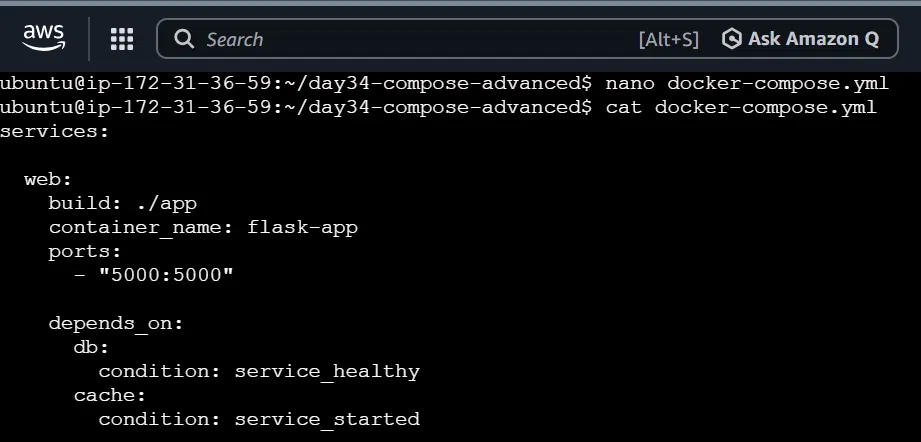

---

# 5. MySQL Healthcheck

One important part of today's task was understanding the difference between:

> Container started

and:

> Database is actually ready.

A MySQL container can be running while MySQL itself is still initializing.

Therefore, I added a healthcheck.

Conceptually:

```text
MySQL container starts
        ↓
Healthcheck runs
        ↓
MySQL ready?
   ↓          ↓
  No         Yes
   ↓          ↓
retry       healthy
```

This allows other services to wait until MySQL is actually ready.

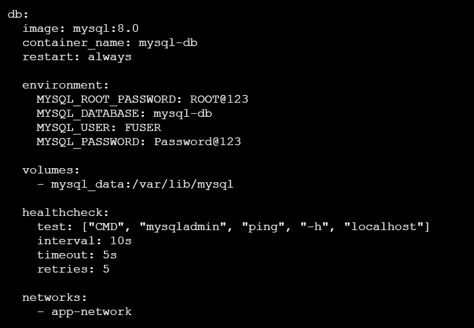

---

# 6. `depends_on` with Healthcheck

The Flask application depends on MySQL.

I used:

```yaml
depends_on:
  db:
    condition: service_healthy
```

### Why?

Without the health condition:

```text
MySQL container starts
        ↓
Flask starts immediately
        ↓
MySQL may still be initializing
        ↓
Application may fail to connect
```

With:

```yaml
condition: service_healthy
```

the application waits for the database healthcheck.

```text
MySQL starts
     ↓
Healthcheck
     ↓
Healthy
     ↓
Flask starts
```

This is more reliable than checking only whether the container has started.

---

# 7. Verifying the Stack

I used:

```bash
docker compose ps
```

to check the Compose services.

Example:

```text
NAME          SERVICE   STATUS
flask-app     web       Up
mysql-db      db        Up (healthy)
redis-cache   cache     Up
```

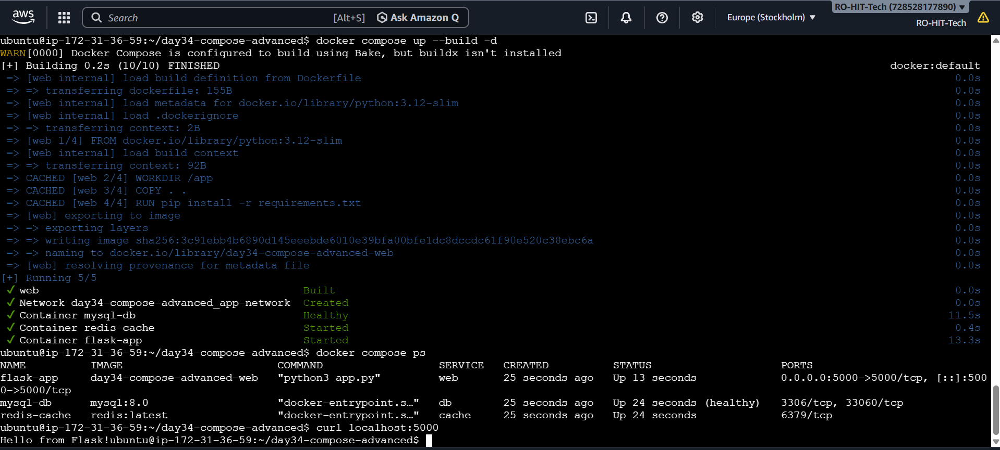

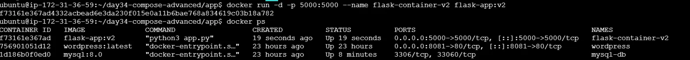

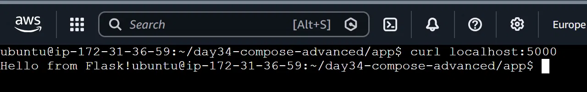

### Why `docker compose ps`?

It shows the containers belonging to the current Compose project.

This is useful when troubleshooting a specific Compose application.

---

# 8. Restart Policy

I added:

```yaml
restart: always
```

to the MySQL service.

### Meaning

Docker should automatically try to restart the container when it stops.

The basic idea is:

```text
MySQL stops
    ↓
Docker detects stop
    ↓
Restart policy
    ↓
MySQL starts again
```

This is useful for services that should normally remain running.

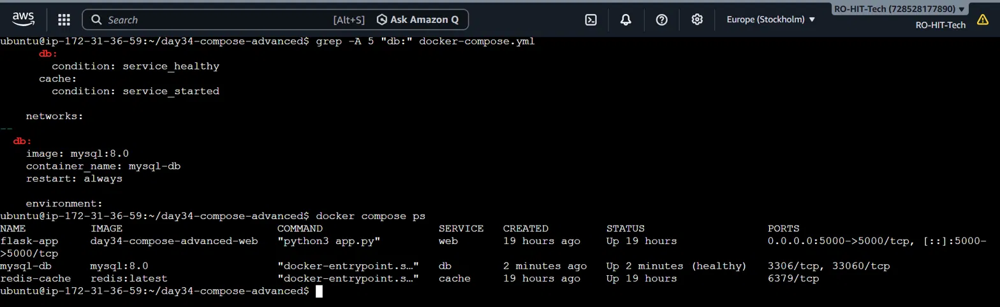

I also tested the `on-failure` restart policy for comparison:

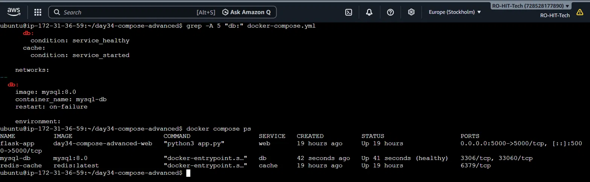

---

# 9. Testing Restart Policy

I manually killed the MySQL container:

```bash
docker kill mysql-db
```

The container initially showed:

```text
Exited (137)
```

I checked the Compose services:

```bash
docker compose ps
```

MySQL was not shown as running.

I also checked all containers:

```bash
docker ps -a | grep mysql-db
```

and saw:

```text
mysql-db ... Exited (137)
```

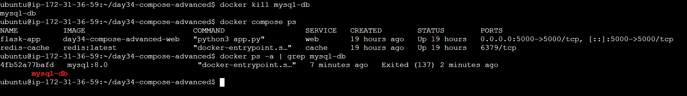

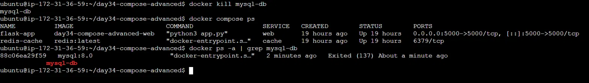

### What does `137` mean?

Exit code `137` usually means the process was killed with `SIGKILL`.

In this case, the important clue was that the server had very limited memory.

---

# 10. Investigating the `137` Error

I checked available memory:

```bash
free -m
```

The server showed approximately:

```text
Total RAM       909 MB
Used            847 MB
Available        61 MB
Swap              0 MB
```

The server had very little available memory and no swap.

I then checked container memory usage:

```bash
docker stats --no-stream
```

The result showed approximately:

```text
mysql-db       356 MB
wordpress       89 MB
flask-app       20 MB
redis            6 MB
```

MySQL was using the most memory.

### Root cause

The server was under heavy memory pressure.

The MySQL process was being killed, resulting in:

```text
Restarting (137)
```

Because `restart: always` was configured, Docker kept trying to restart MySQL.

So the actual situation was:

```text
Low memory
    ↓
MySQL killed
    ↓
Exit 137
    ↓
restart: always
    ↓
Docker restarts MySQL
    ↓
Memory pressure again
```

---

# 11. Solving the Memory Problem

I noticed that an older WordPress container was also running.

I stopped it:

```bash
docker stop wordpress
```

This released memory.

I then checked:

```bash
docker compose ps
```

MySQL became:

```text
mysql-db   Up   (healthy)
```

### Lesson

The problem was **not the Docker volume rename**.

The actual problem was:

> The EC2 server had only around 909 MB RAM, no swap, and multiple containers were consuming memory.

Stopping the unnecessary WordPress container gave MySQL enough memory to become healthy.

---

# 12. Named Network

Instead of relying on Compose's automatically generated network name, I created an explicit network:

```yaml
networks:
  app-network:
    name: app-network
```

I verified the networks using:

```bash
docker network ls
```

The custom network appeared as:

```text
app-network
```

---

# 13. Verifying the Network

I used:

```bash
docker network inspect app-network
```

The output showed:

```text
mysql-db
redis-cache
flask-app
```

all connected to:

```text
app-network
```

It also showed IP addresses for the containers.

For example:

```text
mysql-db
redis-cache
flask-app
```

were all attached to the same Docker bridge network.

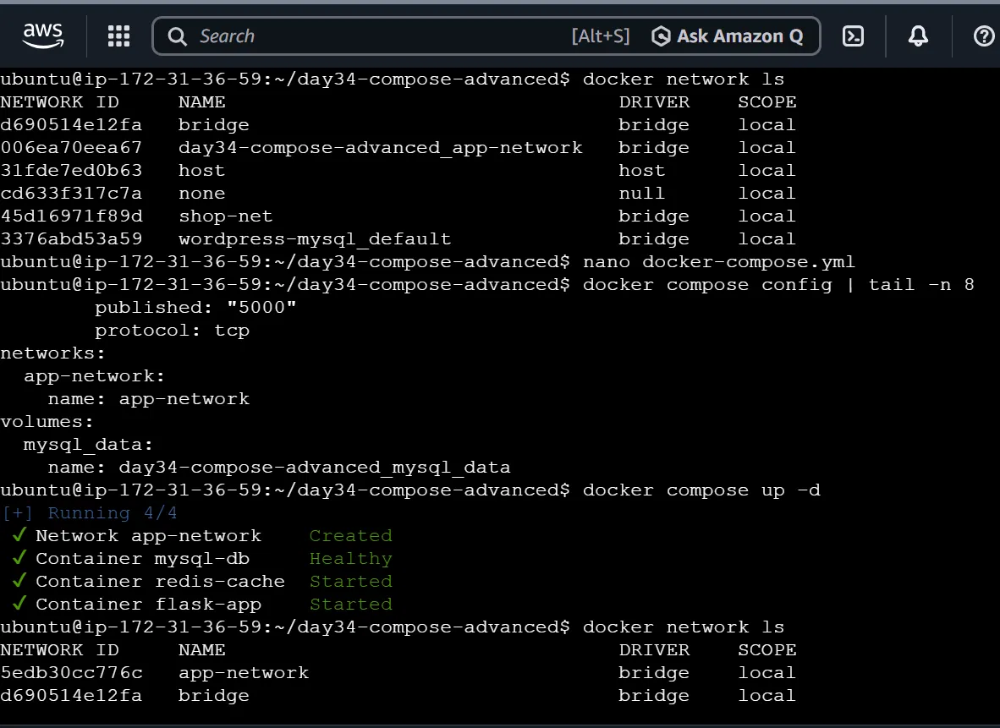

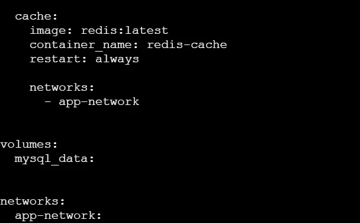

### Why is this useful?

Containers on the same Docker network can communicate with each other using service/container names instead of relying on host IP addresses.

---

# 14. Named Volume

I used a named volume for MySQL data.

The purpose is to keep database data outside the container's writable layer.

Conceptually:

```text
MySQL Container
      │
      ↓
/var/lib/mysql
      │
      ↓
Docker Named Volume
```

This means the database data can survive container recreation.

I checked existing volumes using:

```bash
docker volume ls
```

---

# 15. Changing the Volume Name

Initially, the Compose-created volume was:

```text
day34-compose-advanced_mysql_data
```

I changed the Compose configuration to use:

```yaml
volumes:
  mysql_data:
    name: day34-mysql-data
```

Then I applied the configuration:

```bash
docker compose up -d
```

Docker created:

```text
day34-mysql-data
```

I verified it using:

```bash
docker volume ls
```

The output showed:

```text
day34-compose-advanced_mysql_data
day34-mysql-data
```

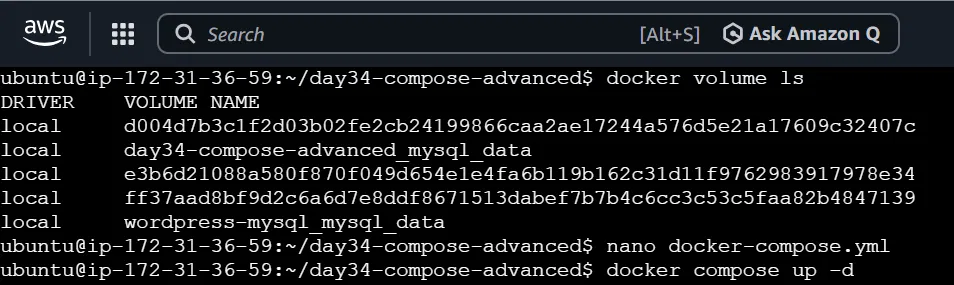

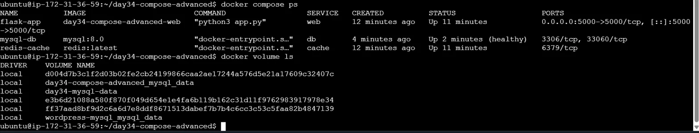

### Important lesson

Changing the volume name does **not rename the existing Docker volume**.

Instead, Docker treats the new name as a different volume.

Therefore, the old volume still existed.

This is important because database data should be considered carefully before changing volume names in real production systems.

---

# 16. Docker Labels

I added labels to the Flask service:

```yaml
labels:
  - "app=flask"
  - "environment=dev"
```

Labels are key-value metadata attached to Docker objects.

They can be used to:

* Identify containers
* Organize services
* Filter resources
* Help monitoring and automation tools

I verified the configuration using:

```bash
docker compose config | grep -A 4 "labels:"
```

The output showed:

```text
labels:
  app: flask
  environment: dev
```

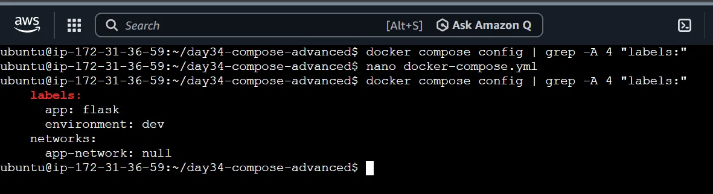

---

# 17. Task 6 – Scaling

I also tested Docker Compose scaling.

The goal was to run three Flask web replicas:

```bash
docker compose up -d --scale web=3
```

Before scaling, I removed:

```yaml
container_name: flask-app
```

### Why?

A fixed container name cannot be reused for multiple replicas.

For example:

```text
flask-app
flask-app
flask-app
```

would create a naming conflict.

Without `container_name`, Compose can generate unique names such as:

```text
day34-compose-advanced-web-1
day34-compose-advanced-web-2
day34-compose-advanced-web-3
```

---

# 18. Scaling Error – Port Already Allocated

When I ran:

```bash
docker compose up -d --scale web=3
```

I received:

```text
Bind for 0.0.0.0:5000 failed:
port is already allocated
```

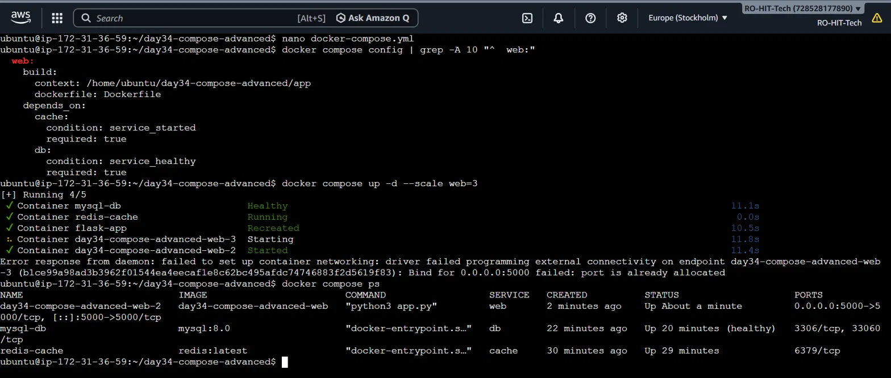

### Why did this happen?

My Compose configuration contained:

```yaml
ports:
  - "5000:5000"
```

This means:

```text
Host Port 5000
      ↓
Container Port 5000
```

The first web container successfully used host port `5000`.

When another replica tried to use the same host port:

```text
Web-1 → Host 5000 → Container 5000
Web-2 → Host 5000 → Container 5000
Web-3 → Host 5000 → Container 5000
```

Docker could not bind the same host port multiple times.

Therefore:

```text
port is already allocated
```

### Important lesson

Simple container scaling does not automatically solve host port conflicts.

In production, multiple replicas are commonly placed behind a:

```text
Load Balancer / Reverse Proxy
```

Architecture:

```text
                  Load Balancer
                       │
             ┌─────────┼─────────┐
             ↓         ↓         ↓
           Web-1     Web-2     Web-3
```

The load balancer receives traffic on one public port and distributes requests to the application replicas.

---

# 19. Rebuild After Code Change

After modifying the Flask application code, I rebuilt the image and verified the change was applied:

```bash
docker compose up -d --build
```

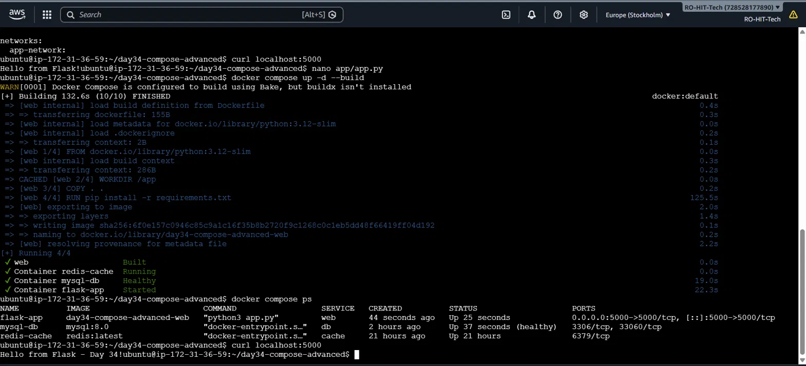

---

# 20. Useful Commands Practiced

## Check running Compose services

```bash
docker compose ps
```

## Start Compose application

```bash
docker compose up -d
```

## Rebuild and start

```bash
docker compose up -d --build
```

## Stop a specific container

```bash
docker stop wordpress
```

## Kill a container

```bash
docker kill mysql-db
```

## Check all containers

```bash
docker ps -a
```

## Check a specific container

```bash
docker ps -a | grep mysql-db
```

## Check Docker networks

```bash
docker network ls
```

## Inspect a network

```bash
docker network inspect app-network
```

## Check Docker volumes

```bash
docker volume ls
```

## Check memory usage

```bash
free -m
```

## Check container resource usage

```bash
docker stats --no-stream
```

## Validate Compose configuration

```bash
docker compose config
```

## Check specific Compose configuration

```bash
docker compose config | grep -A 10 "^  web:"
```

## Check labels

```bash
docker compose config | grep -A 4 "labels:"
```

## Scale a service

```bash
docker compose up -d --scale web=3
```

---

# 21. Problems Faced and Solutions

| Problem                                    | Cause                                    | Solution                                                                      |
| ------------------------------------------ | ---------------------------------------- | ----------------------------------------------------------------------------- |
| MySQL `Exited (137)`                       | Low memory / process killed              | Checked `free -m` and `docker stats`; stopped unnecessary WordPress container |
| MySQL repeatedly restarting                | `restart: always` + memory pressure      | Freed RAM and MySQL became healthy                                            |
| MySQL initially unhealthy                  | Database was not ready / memory pressure | Waited for healthcheck and resolved memory pressure                           |
| Old volume still visible                   | Changing `name:` creates a new volume    | Verified the new named volume                                                 |
| Scaling failed                             | Host port `5000` already allocated       | Identified port mapping limitation                                            |
| Scaling required removing `container_name` | Fixed container name cannot be reused    | Removed `container_name` before scaling                                       |
| Labels command returned nothing initially  | Labels were not configured               | Added labels to the `web` service                                             |

---

# 22. Key Concepts Learned

### Docker Compose

Used to manage multiple related containers from one YAML file.

### Healthcheck

Checks whether a service is actually ready, not just whether its container has started.

### `depends_on`

Controls service startup dependency.

### Restart Policy

Controls what Docker should do when a container stops.

### Named Volume

Provides persistent storage outside the container.

### Named Network

Provides a predictable network for communication between services.

### Docker Labels

Provide metadata for identifying and organizing Docker resources.

### Scaling

Runs multiple replicas of a service.

### Port Mapping

Maps a host port to a container port.

### Exit Code 137

Usually indicates that a process was forcibly killed with `SIGKILL`; in this lab it was associated with severe memory pressure.

---

# 23. Final Architecture

```text
                         Docker Host
                              │
                       Docker Compose
                              │
                    ┌─────────┴─────────┐
                    │    app-network    │
                    │                   │
              ┌─────┴─────┐       ┌────┴─────┐
              │ Flask Web  │       │  Redis   │
              │   :5000    │       │  :6379   │
              └─────┬──────┘       └──────────┘
                    │
                    │
              ┌─────┴──────┐
              │   MySQL    │
              │   :3306    │
              └─────┬──────┘
                    │
                    ↓
             Named Volume
          day34-mysql-data
```

---

# 24. Final Verification

At the end, the stack was running successfully:

```text
flask-app     Up
mysql-db      Up (healthy)
redis-cache   Up
```

The custom network was:

```text
app-network
```

The named MySQL volume was:

```text
day34-mysql-data
```

The Flask service had labels:

```text
app=flask
environment=dev
```

I also successfully demonstrated the limitation of simple Compose scaling with fixed host port mapping.

---

# 25. What I Learned from Day 34

Day 34 helped me understand that Docker Compose is not only about starting multiple containers.

I learned how real applications need:

* Service dependencies
* Database healthchecks
* Restart policies
* Persistent storage
* Custom networks
* Service metadata
* Resource troubleshooting
* Scaling
* Port management

The most useful troubleshooting lesson was understanding that:

```text
Container is running
        ≠
Application is ready
```

and:

```text
Restarting container
        ≠
Problem solved
```

You also need to understand **why the container is failing**.

In my case, the `137` error initially looked like a Docker problem, but checking:

```bash
free -m
docker stats --no-stream
```

showed that the real issue was **limited server memory**.

---

## Day 34 Status

**Docker Compose Real-World Multi-Container App — Completed ✅**

### Practiced

* [x] 3-service Compose stack
* [x] Flask custom Dockerfile
* [x] MySQL
* [x] Redis
* [x] Healthcheck
* [x] `depends_on`
* [x] Restart policy
* [x] Troubleshooting Exit 137
* [x] Memory troubleshooting
* [x] Named network
* [x] Named volume
* [x] Volume naming
* [x] Docker labels
* [x] Scaling test
* [x] Port conflict troubleshooting
* [x] Docker Compose troubleshooting
