# Day 35 – Multi-Stage Builds & Docker Hub

## 📌 Overview

Today I learned and practiced:

* Docker Single-Stage Build
* Docker Multi-Stage Build
* Docker Image Size Optimization
* Docker Hub
* Docker Image Tags
* Docker Image Push & Pull
* Dockerfile Best Practices
* Minimal Base Images
* Non-Root Users
* Docker Image Layers

The main goal of this exercise was not only to build an image, but to understand **why we use Multi-Stage Builds and how they help in real-world Docker projects.**

---

# 🧠 Before Starting – What is a Docker Image?

A Docker image is a packaged application containing everything required to run an application.

For example, a Node.js application needs:

```text
Node.js
Application Code
Required Libraries
Runtime Environment
Configuration
```

Docker packages these into an image.

We can then create a container from that image.

```text
Dockerfile
    ↓
docker build
    ↓
Docker Image
    ↓
docker run
    ↓
Docker Container
```

---

# 🧠 What is a Dockerfile?

A **Dockerfile** is a text file containing instructions that tell Docker how to build an image.

Example:

```dockerfile
FROM node:20-alpine

WORKDIR /app

COPY . .

EXPOSE 3000

CMD ["node", "app.js"]
```

Each instruction tells Docker to perform a specific action while building the image.

---

# 🟢 Task 1 – The Problem with Large Images

## 🎯 Goal

First, I wanted to understand the problem with using a normal Node.js base image.

I created a simple Node.js application.

Example `app.js`:

```javascript
console.log("Hello from Day 35 - Multi-Stage Docker Build!");
```

---

## 📄 Single-Stage Dockerfile

```dockerfile
FROM node:20

WORKDIR app/

COPY . .

EXPOSE 3000

CMD ["node","app.js"]
```

---

# 🔍 Dockerfile Explanation

## 1. `FROM`

```dockerfile
FROM node:20
```

### What?

`FROM` specifies the **base image**.

### Why?

Our application is written in Node.js, so we need Node.js available inside the container.

### How?

Docker downloads `node:20` from Docker Hub and uses it as the starting point for our image.

```text
node:20
   ↓
Our Dockerfile
   ↓
Our final image
```

---

## 2. `WORKDIR`

```dockerfile
WORKDIR app/
```

### What?

Sets the working directory inside the container.

### Why?

Instead of working in `/`, we want our application files in a dedicated directory.

### How?

Docker creates the directory if required and makes it the current working directory.

A better form is:

```dockerfile
WORKDIR /app
```

---

## 3. `COPY`

```dockerfile
COPY . .
```

### What?

Copies files from the current project directory on the host into the Docker image.

### First `.`

The first `.` means:

```text
Current directory on host
```

### Second `.`

The second `.` means:

```text
Current WORKDIR inside container
```

So:

```text
Host
day35-multistage-hub/
        ↓
Docker image
/app/
```

---

## 4. `EXPOSE`

```dockerfile
EXPOSE 3000
```

### What?

Documents that the application uses port `3000`.

### Why?

Our Node.js application listens on port 3000.

### Important

`EXPOSE` itself does **not** publish the port to the host.

To actually access the application from outside the container, we use:

```bash
docker run -p 3000:3000 image-name
```

---

## 5. `CMD`

```dockerfile
CMD ["node","app.js"]
```

### What?

Defines the default command that runs when the container starts.

### Why?

We want to start our Node.js application.

### How?

Docker executes:

```bash
node app.js
```

inside the container.

---

# 🏗️ Build the Single-Stage Image

Command:

```bash
docker build -t day35-node-single:v1 .
```

## Command Explanation

### `docker build`

Tells Docker to build an image using the Dockerfile.

### `-t`

`-t` means **tag**.

It gives the image a name and version.

```text
day35-node-single:v1
        │          │
        │          └── Tag/version
        └───────────── Image name
```

### `.`

The `.` means:

> Use the current directory as the Docker build context.

Docker looks for the Dockerfile and application files in this directory.

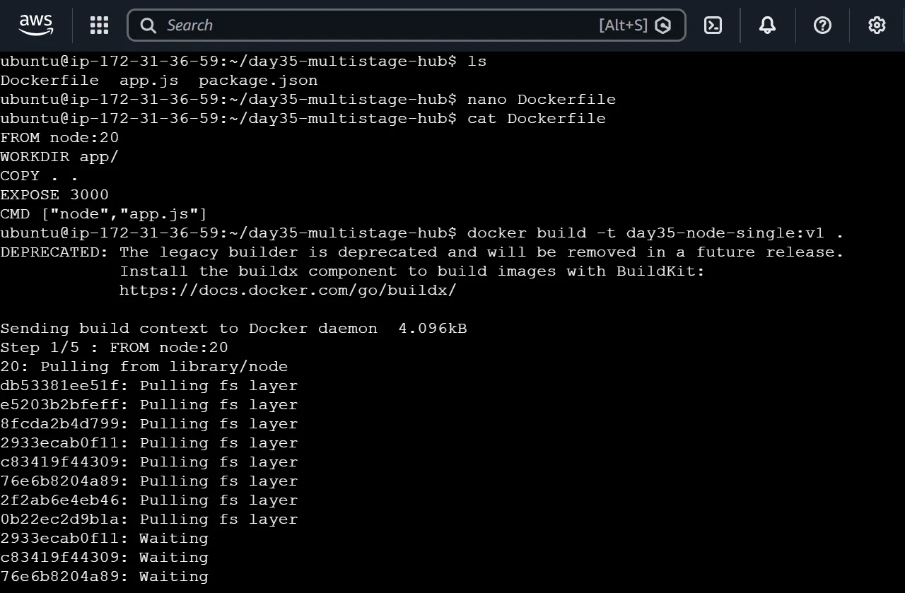

---

# 🔎 Check Image Size

Command:

```bash
docker images day35-node-single:v1
```

Result:

```text
day35-node-single:v1 → 1.1 GB
```

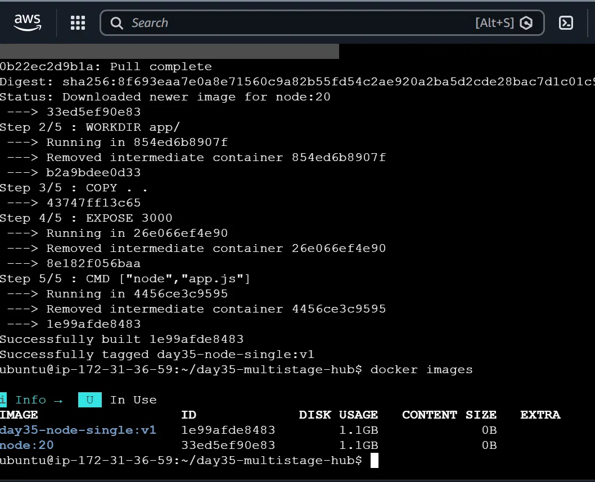

---

# ❓ Why is the Image So Large?

The `node:20` image contains many components that are not necessarily required to run our simple application.

For a small application, a **1.1 GB image** is unnecessarily large.

Large images can mean:

* More disk usage
* Slower image transfer
* Slower deployments
* More storage usage
* Larger attack surface

This is the problem we want to solve.

---

# 🟢 Task 2 – Multi-Stage Build

# 🎯 What is a Multi-Stage Build?

A Multi-Stage Docker build uses **multiple `FROM` statements** in one Dockerfile.

Each `FROM` starts a new stage.

For example:

```dockerfile
FROM node:20-alpine AS builder

# Build stage

FROM node:20-alpine

# Runtime stage
```

The important idea is:

```text
Stage 1
Builder
   ↓
Build application
   ↓
Only required files
   ↓
Stage 2
Runtime image
```

---

# ❓ Why use Multi-Stage Builds?

Imagine a real application that needs many tools to build:

```text
Compiler
npm
Development dependencies
Build tools
Source code
Temporary files
```

But the final application may only need:

```text
Node.js runtime
Application
Production dependencies
```

We don't want all the build tools inside the final production image.

Multi-stage builds allow us to keep the build environment separate from the runtime environment.

---

# 📄 Multi-Stage Dockerfile

```dockerfile
FROM node:20-alpine AS builder

WORKDIR /app

COPY . .

FROM node:20-alpine

WORKDIR /app

COPY --from=builder /app .

EXPOSE 3000

CMD ["node", "app.js"]
```

---

# 🔍 Multi-Stage Dockerfile Explanation

## Stage 1 – Builder

```dockerfile
FROM node:20-alpine AS builder
```

### What?

Creates the first stage and names it:

```text
builder
```

### Why?

We can use this stage for installing dependencies, compiling code, or generating build artifacts.

### Important

`AS builder` gives the stage a name.

---

## Work Directory

```dockerfile
WORKDIR /app
```

The application will work inside:

```text
/app
```

---

## Copy Application

```dockerfile
COPY . .
```

Copies the application files into the builder stage.

---

# Stage 2 – Runtime

```dockerfile
FROM node:20-alpine
```

This starts a **new stage**.

This is important.

The second `FROM` starts a fresh image.

We don't automatically carry everything from the builder stage.

---

## Copy Only Required Content

```dockerfile
COPY --from=builder /app .
```

### What?

Copies files from the `builder` stage.

### `--from=builder`

Means:

> Copy from the stage named `builder`.

### Why?

We can selectively copy only the files required by the runtime image.

This is one of the main benefits of Multi-Stage Builds.

---

# Build Multi-Stage Image

```bash
docker build -t day35-node-multi:v1 .
```

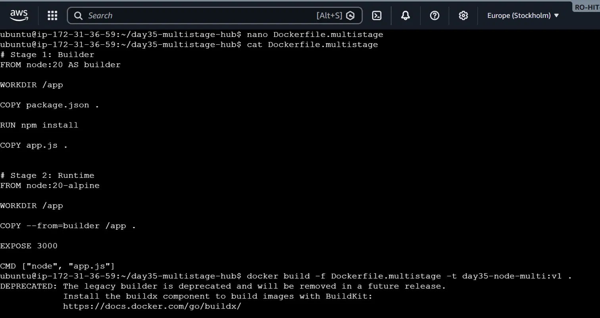

### Check Size

```bash
docker images day35-node-multi:v1
```

Result:

```text
day35-node-multi:v1 → 136 MB
```

Comparison:

```text
Single-stage → 1.1 GB
Multi-stage  → 136 MB
```

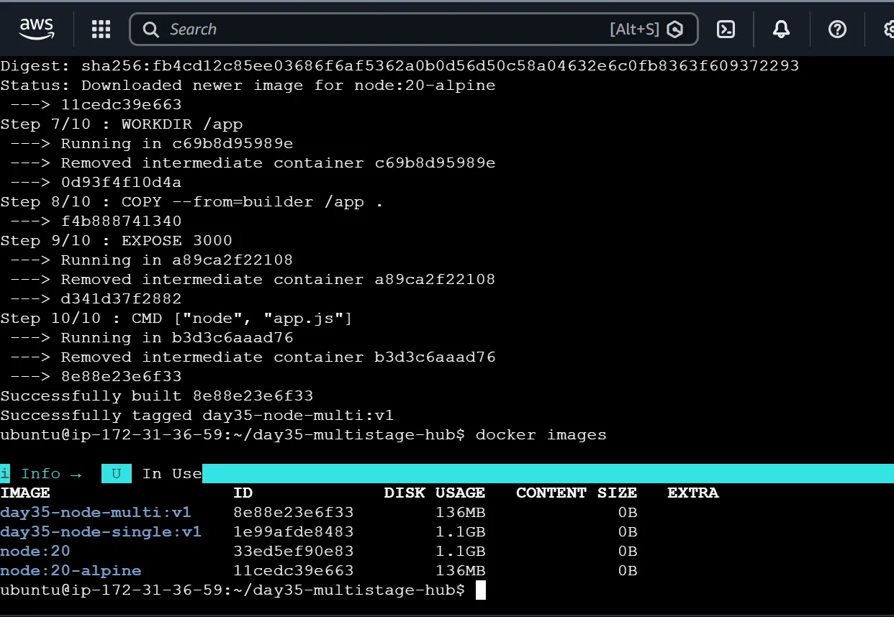

---

# 🧠 Why Did the Image Become Smaller?

The final image uses the smaller Alpine runtime base and does not need unnecessary build-stage content.

The key concept is:

```text
Builder environment
       ↓
Build
       ↓
Required application files
       ↓
Minimal runtime image
```

---

# 🟢 Task 3 – Push Image to Docker Hub

# 🎯 What is Docker Hub?

Docker Hub is a container image registry.

It allows us to store and share Docker images.

Similar concept:

```text
GitHub
   ↓
Stores source code

Docker Hub
   ↓
Stores Docker images
```

Our repository:

```text
rtingane2611/day35-node-multi
```

---

# Step 1 – Docker Login

```bash
docker login
```

### What?

Logs the Docker CLI into Docker Hub.

### Why?

Docker needs authentication before pushing an image to our repository.

---

# Step 2 – Tag the Image

```bash
docker tag day35-node-multi:v1 rtingane2611/day35-node-multi:v1
```

## Why do we tag?

Docker Hub expects images in this format:

```text
username/repository:tag
```

Our image becomes:

```text
rtingane2611/day35-node-multi:v1
```

Breakdown:

```text
rtingane2611
      ↓
Docker Hub username

day35-node-multi
      ↓
Repository name

v1
      ↓
Image tag/version
```

---

# Step 3 – Push Image

```bash
docker push rtingane2611/day35-node-multi:v1
```

### What?

Uploads the image to Docker Hub.

### Flow

```text
Local Docker Image
        ↓
docker push
        ↓
Docker Hub
```

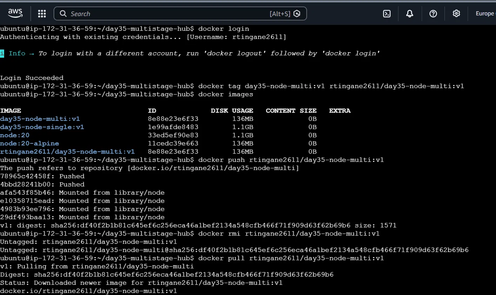

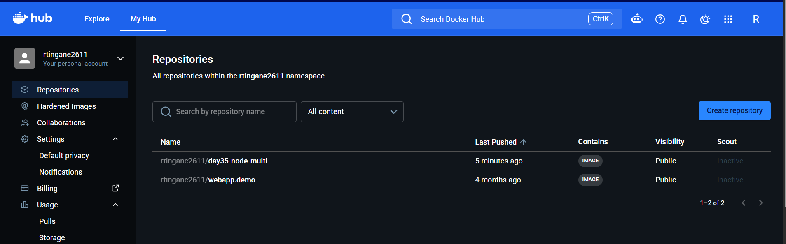

---

# 🟢 Task 4 – Docker Hub Repository

## Step 1 – Add Repository Description

Description:

```text
Optimized Node.js app using a multi-stage Docker build with Alpine.
```

### Why?

A repository description explains what the image is used for.

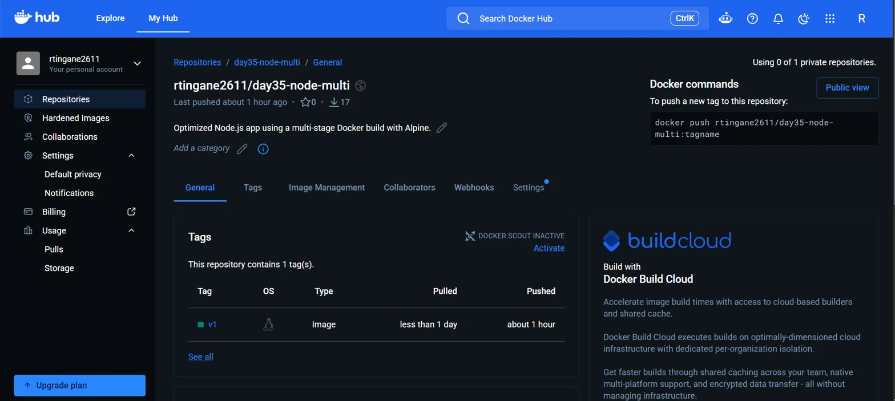

---

# Step 2 – Understand Tags

Our image has:

```text
v1
```

A tag identifies a particular image reference/version.

Example:

```text
rtingane2611/day35-node-multi:v1
```

---

# Step 3 – Check Tag Details

Docker Hub showed:

```text
Tag              → v1
OS/ARCH           → linux/amd64
Compressed size   → 46.12 MB
Manifest digest   → sha256:...
```

### What is a Digest?

A digest is a content-based identifier for an image manifest.

Example:

```text
sha256:df40f2b1...
```

Unlike a tag, the digest identifies the exact image content.

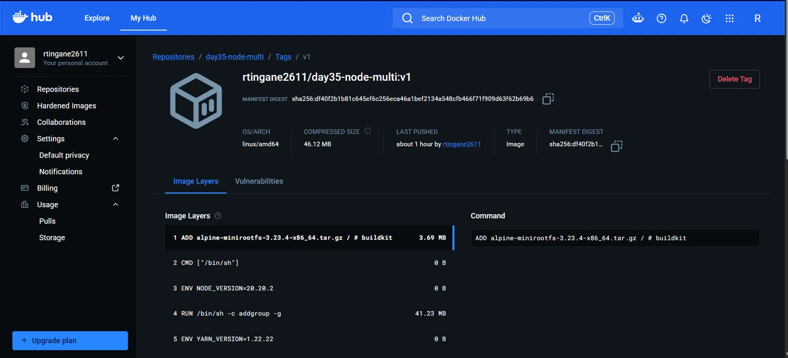

---

# Step 4 – Pull Image

Command:

```bash
docker pull rtingane2611/day35-node-multi:v1
```

### What?

Downloads the `v1` image from Docker Hub.

### Why?

To verify that the image stored on Docker Hub can be pulled successfully.

Result:

```text
Status: Image is up to date for rtingane2611/day35-node-multi:v1
```

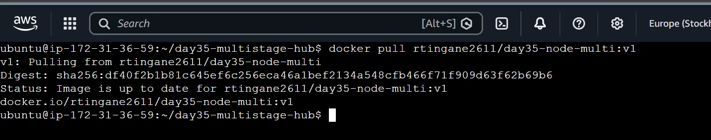

---

# 🧠 `v1` vs `latest`

## Specific Tag

```bash
docker pull rtingane2611/day35-node-multi:v1
```

Means:

> Pull the image specifically tagged `v1`.

---

## `latest`

```bash
docker pull rtingane2611/day35-node-multi:latest
```

Means:

> Pull the image tagged `latest`.

Important:

**`latest` does not automatically mean the newest image.**

It is simply a tag.

For example:

```text
v1       → Version 1
v2       → Version 2
latest   → Whatever image is currently assigned to latest
```

For production, explicit version tags are often easier to control.

---

# 🟢 Task 5 – Docker Image Best Practices

# 🎯 Goal

Now I improved the Dockerfile using common Docker best practices.

We focused on:

```text
1. Minimal base image
2. Non-root user
3. Combine RUN commands
4. Avoid latest
```

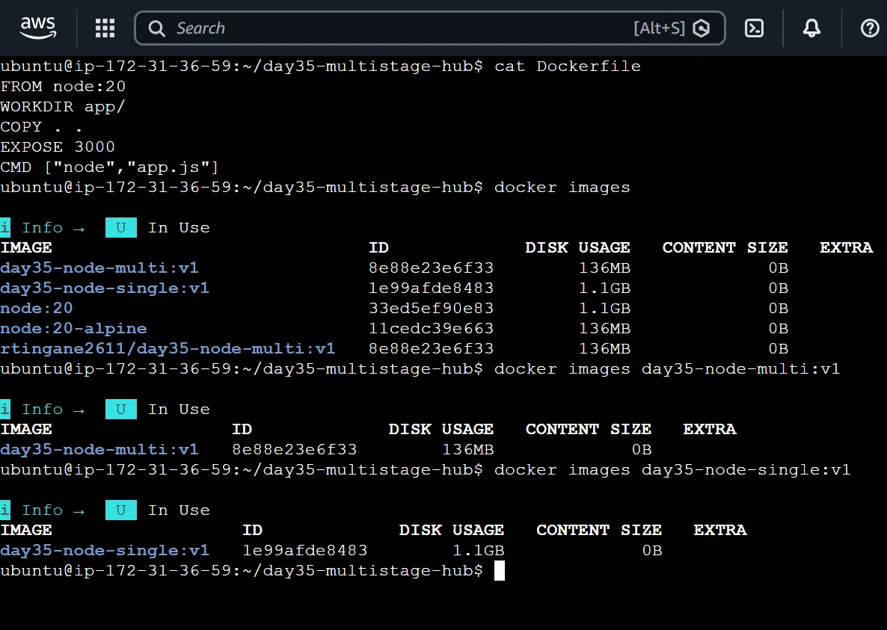

---

# 5.1 Minimal Base Image

Original:

```dockerfile
FROM node:20
```

Size:

```text
1.1 GB
```

Optimized:

```dockerfile
FROM node:20-alpine
```

Size:

```text
136 MB
```

### Why Alpine?

Alpine is a lightweight Linux distribution.

It contains fewer unnecessary packages.

Therefore:

```text
Smaller image
     ↓
Less storage
     ↓
Faster transfer
     ↓
Faster deployment
```

---

# 5.2 Non-Root User

## Problem

Containers can run applications as root by default.

Root has high privileges.

For production applications, we generally want the application to run with the minimum required privileges.

---

## Create Group and User

```dockerfile
RUN addgroup -S appgroup && adduser -S appuser -G appgroup
```

### `addgroup`

Creates:

```text
appgroup
```

### `adduser`

Creates:

```text
appuser
```

and places the user inside:

```text
appgroup
```

So:

```text
appgroup
    └── appuser
```

---

## Set Non-Root User

```dockerfile
USER appuser
```

This tells Docker:

> Run the application as `appuser` instead of root.

---

## Verify

Start the container:

```bash
docker run -d --name day35-best-container -p 3000:3000 day35-node-best:v1
```

Check the user:

```bash
docker exec day35-best-container whoami
```

Output:

```text
appuser
```

This proves that the container is running as the non-root user.

---

# 5.3 Combine RUN Commands

Instead of:

```dockerfile
RUN command1
RUN command2
```

related commands can be combined:

```dockerfile
RUN command1 && command2
```

In our Dockerfile:

```dockerfile
RUN addgroup -S appgroup && adduser -S appuser -G appgroup
```

Two operations are performed in one `RUN` instruction.

### Why?

Docker images are made of layers.

Reducing unnecessary layers can help keep images cleaner and avoid unnecessary intermediate data.

---

# 5.4 Avoid `latest`

Avoid:

```dockerfile
FROM node:latest
```

Instead:

```dockerfile
FROM node:20-alpine
```

### Why?

`latest` can point to a different image version over time.

Using an explicit tag makes the build more predictable.

Our Dockerfile uses:

```dockerfile
FROM node:20-alpine
```

instead of:

```dockerfile
FROM node:latest
```

---

# 📄 Final Optimized Dockerfile

```dockerfile
FROM node:20-alpine

WORKDIR /app

COPY . .

RUN addgroup -S appgroup && adduser -S appuser -G appgroup

USER appuser

EXPOSE 3000

CMD ["node", "app.js"]
```

---

# 🔍 Final Dockerfile – Line-by-Line Summary

| Instruction           | Purpose                              |
| --------------------- | ------------------------------------ |
| `FROM node:20-alpine` | Use lightweight Node.js Alpine image |
| `WORKDIR /app`        | Set application directory            |
| `COPY . .`            | Copy application files               |
| `RUN addgroup...`     | Create application group and user    |
| `USER appuser`        | Run container as non-root            |
| `EXPOSE 3000`         | Document application port            |
| `CMD [...]`           | Start Node.js application            |

---

# 🏗️ Build Optimized Image

```bash
docker build -t day35-node-best:v1 .
```

### What does this command mean?

```text
docker build
    ↓
Build image

-t day35-node-best:v1
    ↓
Give image a name and tag

.
    ↓
Use current directory as build context
```

Result:

```text
Successfully built d65d08925124
Successfully tagged day35-node-best:v1
```

Image size:

```text
day35-node-best:v1 → 136 MB
```

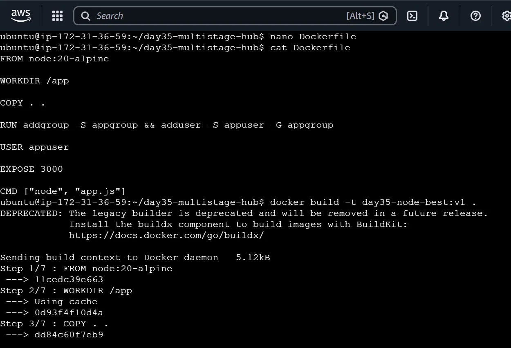

---

# ▶️ Run the Optimized Container

```bash
docker run -d --name day35-best-container -p 3000:3000 day35-node-best:v1
```

## Command Explanation

### `docker run`

Creates and starts a container from an image.

### `-d`

Runs the container in detached/background mode.

### `--name`

Gives the container a readable name:

```text
day35-best-container
```

### `-p 3000:3000`

Maps:

```text
Host port 3000
       ↓
Container port 3000
```

### Image name

```text
day35-node-best:v1
```

This is the image used to create the container.

---

# 🔎 Check Running Container

```bash
docker ps
```

This shows running containers.

Expected:

```text
day35-best-container
```

with:

```text
0.0.0.0:3000->3000/tcp
```

---

# 🔐 Verify Non-Root User

```bash
docker exec day35-best-container whoami
```

Output:

```text
appuser
```

This confirms:

```text
Container
    ↓
appuser
    ↓
Node.js application
```

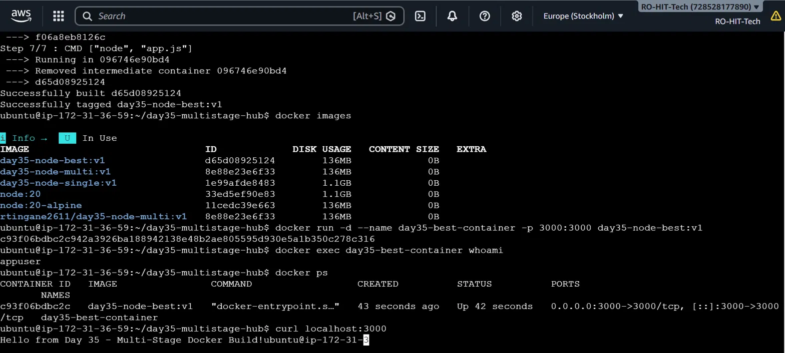

---

# 🌐 Verify Application

```bash
curl localhost:3000
```

Output:

```text
Hello from Day 35 - Multi-Stage Docker Build!
```

This confirms that the application still works after applying the security and optimization changes.

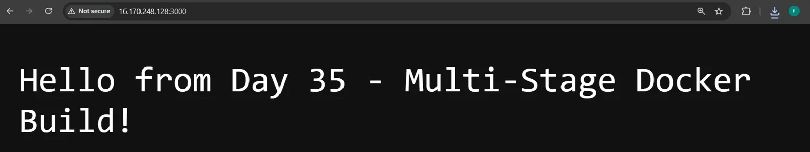

---

# 📊 Final Comparison

| Image                  |       Size | Main Point                              |
| ---------------------- | ---------: | --------------------------------------- |
| `day35-node-single:v1` | **1.1 GB** | Single-stage + standard Node image      |
| `day35-node-multi:v1`  | **136 MB** | Multi-stage + Alpine                    |
| `day35-node-best:v1`   | **136 MB** | Alpine + non-root user + best practices |

---

# 🤔 Why Did Task 5 Image Stay at 136 MB?

This is an important observation.

The image size did not become smaller because our multi-stage image was already using:

```dockerfile
node:20-alpine
```

Therefore, the major size optimization had already happened.

Task 5 mainly improved:

```text
Security
   ↓
Non-root user

Predictability
   ↓
Specific base tag

Image structure
   ↓
Combined RUN commands
```

So optimization is not only about reducing MB.

It also means improving:

* Security
* Reproducibility
* Maintainability
* Image structure

---

# 📊 Overall Day 35 Flow

```text
Node.js Application
        ↓
Single-Stage Dockerfile
        ↓
1.1 GB Image
        ↓
Identify Problem
        ↓
Multi-Stage Dockerfile
        ↓
Minimal Alpine Runtime
        ↓
136 MB Image
        ↓
Push to Docker Hub
        ↓
Tag as v1
        ↓
Pull from Docker Hub
        ↓
Apply Best Practices
        ↓
Non-Root User
        ↓
136 MB Optimized Image
        ↓
Run & Verify Application
```

---

# 🎯 Key Learnings

🔹 A Dockerfile defines how a Docker image is built.

🔹 `FROM` selects the base image.

🔹 `WORKDIR` sets the working directory inside the container.

🔹 `COPY` copies application files into the image.

🔹 `EXPOSE` documents the application port.

🔹 `CMD` defines the default command used to start the container.

🔹 Multi-stage builds use multiple `FROM` instructions to separate build and runtime environments.

🔹 `COPY --from=builder` allows files to be copied from an earlier build stage.

🔹 Alpine images are much smaller than standard Linux-based Node images.

🔹 Docker Hub is used to store and distribute Docker images.

🔹 Image tags such as `v1` help identify image versions.

🔹 `docker push` uploads an image to Docker Hub.

🔹 `docker pull` downloads an image from Docker Hub.

🔹 Running containers as non-root users improves security.

🔹 Combining related `RUN` commands can reduce unnecessary layers.

🔹 Using explicit image tags instead of `latest` makes builds more predictable.

---

# 🏁 Day 35 Completed

```text
Task 1 – Large Image Problem       ✅
Task 2 – Multi-Stage Build         ✅
Task 3 – Docker Hub Push           ✅
Task 4 – Repository & Tags         ✅
Task 5 – Image Best Practices      ✅
```

## Docker Hub Repository

```text
rtingane2611/day35-node-multi
```

## Docker Hub Image

```text
rtingane2611/day35-node-multi:v1
```

Day 35 helped me understand how to build **smaller, more secure, and more maintainable Docker images**, and how to publish and distribute those images using Docker Hub.


