# Day 37 – Docker Revision & Hands-On Practice Guide

## Purpose of this document

This is not just a log of commands — it's written so that **anyone who doesn't know Docker at all** can read it and actually understand what each command does, why it's used, and what problem it solves. Every section follows the same pattern: **what we did → the exact command → what each word in the command means → why it matters in the real world**, with a screenshot showing the actual result.

---

## Task 1: Running a Container (Interactive + Detached)

### The core idea

A Docker **image** is like a saved recipe/template. A Docker **container** is what you get when you actually "cook" that recipe — a running instance of the image. You can create many containers from one image.

### Step 1 — Pull an image and run it in the background

```bash
docker pull ubuntu
docker run -d ubuntu:latest
```

- `docker pull ubuntu` — downloads the `ubuntu` image from Docker Hub (a public library of images) onto our machine.
- `docker run -d ubuntu:latest` — starts a new container from that image.
  - `-d` stands for **detached** — meaning the container runs in the background, and we get our terminal back immediately instead of it being "stuck" inside the container.

**What went wrong the first time:** After running this, `docker ps` showed nothing — the container had already stopped (`Exited`). This is because the `ubuntu` image's default process is `bash` (a command shell), and `bash` only stays alive if something is actively "talking" to it (like a keyboard). With just `-d` and no terminal attached, `bash` had nothing to do, so it exited immediately.

### Step 2 — Fix it with `-it`

```bash
docker run -d -it ubuntu:latest /bin/bash
```

- `-i` (interactive) — keeps input open so the container is ready to receive commands.
- `-t` (tty) — allocates a fake "terminal" inside the container, which is what makes `bash` think someone is there to talk to it.
- Combined, `-it` tricks `bash` into staying alive and waiting, instead of exiting instantly.

### Step 3 — Go inside a running container

```bash
docker exec -it <container-name> bash
```

`exec` starts a **brand new, separate process** inside an already-running container. This is the safe way to "step inside" a container to look around or run commands — if you exit this session, only that session ends; the container itself keeps running because its main process was never touched.

**Important distinction:** `docker attach` is different — it connects you to the container's *original* main process. If you exit from an `attach` session, you kill that main process, and the whole container stops. For day-to-day poking around, `exec` is the safer choice.

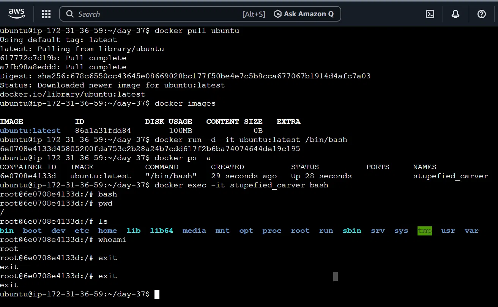

---

## Understanding "Exited (0)" — is it always a problem?

Not always! This confused me at first, so it's worth explaining clearly.

- If a container's main process is something like `bash` (which is meant to wait forever for input) and it exits immediately, that usually **is** a problem — it means the process had nothing to do.
- But if a container's main process is a **task-based script** (like a Python script that just prints some lines and finishes), then `Exited (0)` is actually **success** — the code `0` means "finished with no errors." The script did its job and correctly ended.

The rule of thumb: ask *"was this program supposed to keep running forever, or was it supposed to do a task and stop?"* — that tells you whether `Exited (0)` is good or bad news.

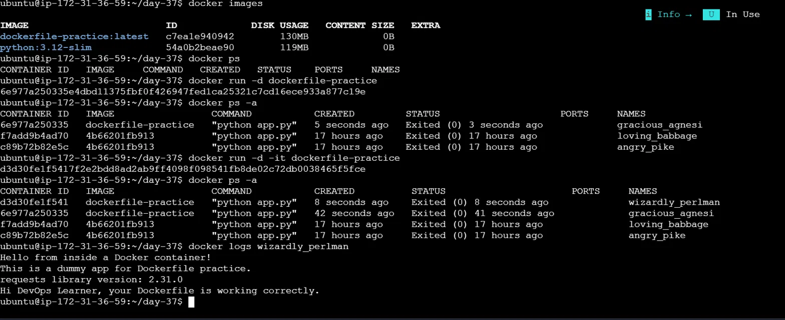

---

## Task 2: Listing, Stopping, and Removing Containers/Images

```bash
docker ps -a          # list ALL containers (running + stopped)
docker stop <name>    # gracefully stop a running container
docker rm <name>      # permanently delete a stopped container
docker rmi <image>    # permanently delete an image
docker container prune  # delete ALL stopped containers at once
```

- `docker ps` on its own only shows **running** containers. Adding `-a` shows everything, including stopped ones — this trips up a lot of beginners who think their container "disappeared."
- `docker rm` removes a **container** (an instance). `docker rmi` removes an **image** (the template). These are two different things, and you can't remove an image with `docker rm`, or a container with `docker rmi` — Docker will give you a "no such image/container" error if you mix them up.

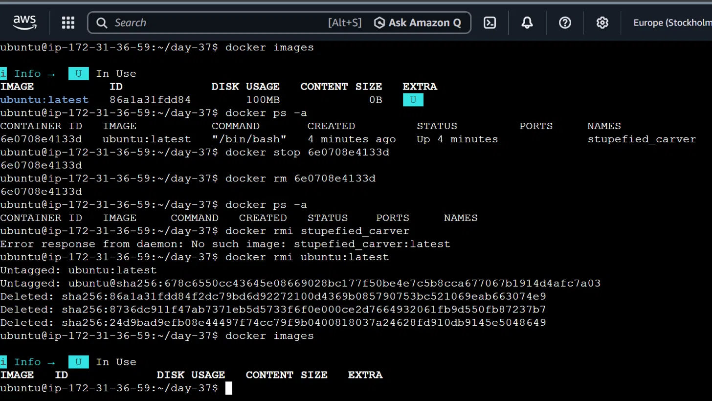

---

## Task 3: Writing a Dockerfile From Scratch

A **Dockerfile** is a plain text file containing step-by-step instructions for building a custom image — think of it as a recipe card.

```dockerfile
FROM python:3.12-slim
WORKDIR /app
COPY requirements.txt .
RUN pip install --no-cache-dir -r requirements.txt
COPY . .
CMD ["python", "app.py"]
```

| Line | Meaning |
|---|---|
| `FROM python:3.12-slim` | Start from an existing image that already has Python installed. `slim` is a smaller, lighter version — good for keeping the final image size down. |
| `WORKDIR /app` | Sets `/app` as the "current folder" inside the container, so every following instruction happens there. |
| `COPY requirements.txt .` | Copies just the dependency list from our computer into the image, **before** copying the rest of the code. |
| `RUN pip install ...` | Installs the Python libraries listed in that file. |
| `COPY . .` | Copies the rest of our application code in. |
| `CMD ["python", "app.py"]` | The command that runs automatically whenever a container is started from this image. |

**Why copy `requirements.txt` separately, before the code?** This is about **layer caching**. Docker builds an image step by step, and remembers ("caches") each step. If nothing in `requirements.txt` changed since the last build, Docker skips re-installing dependencies and reuses the cached result — making rebuilds much faster. If we copied everything at once, even a tiny code change would force dependencies to reinstall every single time.

```bash
docker build -t dockerfile-practice .
```

- `-t dockerfile-practice` — tags (names) the resulting image.
- `.` — tells Docker "look for the Dockerfile in the current folder, and use this folder as the build context."

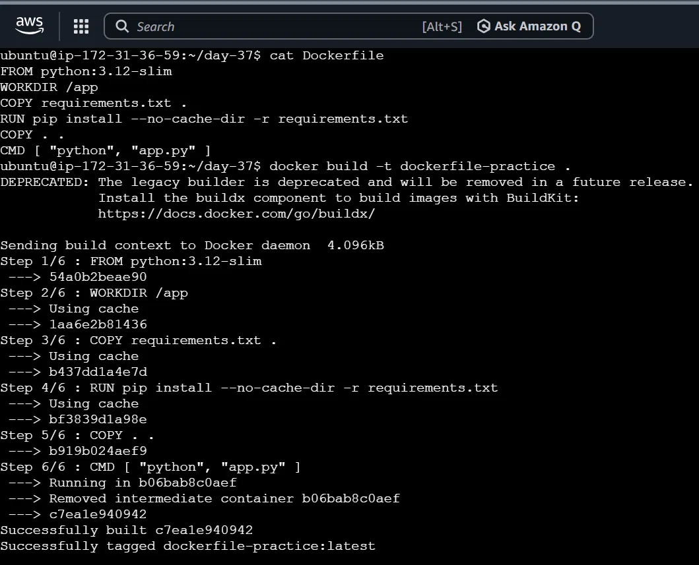

---

## Task 4: CMD vs ENTRYPOINT

This is one of the most confusing Docker concepts for beginners, so here's a simple analogy first.

**Think of two shops:**
- **Shop A (`CMD`)** has a sign saying "Today's special: veg sandwich" — but it's just a *suggestion*. If you walk in and ask for a pizza instead, they'll happily forget the sandwich and make you a pizza. Your request **completely replaces** the shop's plan.
- **Shop B (`ENTRYPOINT`)** has a sign saying "We ONLY sell veg sandwiches." Even if you ask for pizza, they'll still make you a sandwich (maybe treating "pizza" as some odd extra request they ignore). Your request can never replace their one fixed job — it can only be *added on top* of it.

### Proof, tested for real

```dockerfile
CMD ["python", "app.py"]
```
```bash
docker run dockerfile-practice echo "this should override"
# Output: this should override
```
Here, `CMD` got **completely replaced** by our `echo` command — `python app.py` never ran at all.

```dockerfile
ENTRYPOINT ["python", "app.py"]
```
```bash
docker run dockerfile-practice echo "this should override"
# Output: (the app's normal 4 lines still printed)
```
Here, `python app.py` **still ran**, no matter what we typed after the image name — because `ENTRYPOINT` cannot be overridden that easily; extra words just get passed to it as arguments (which our script simply ignored).

### Real-world use case

Imagine a **database backup tool** image whose only job is to run `pg_dump` (a backup command). If it uses `CMD`, then anyone who accidentally runs `docker run backup-tool bash` will silently skip the backup entirely — no error, no warning, the backup just never happens. If it uses `ENTRYPOINT` instead, the backup command is locked in and always runs, protecting the container's core purpose from being accidentally bypassed. This is exactly why official images like `postgres` and `nginx` use `ENTRYPOINT` for their core process.

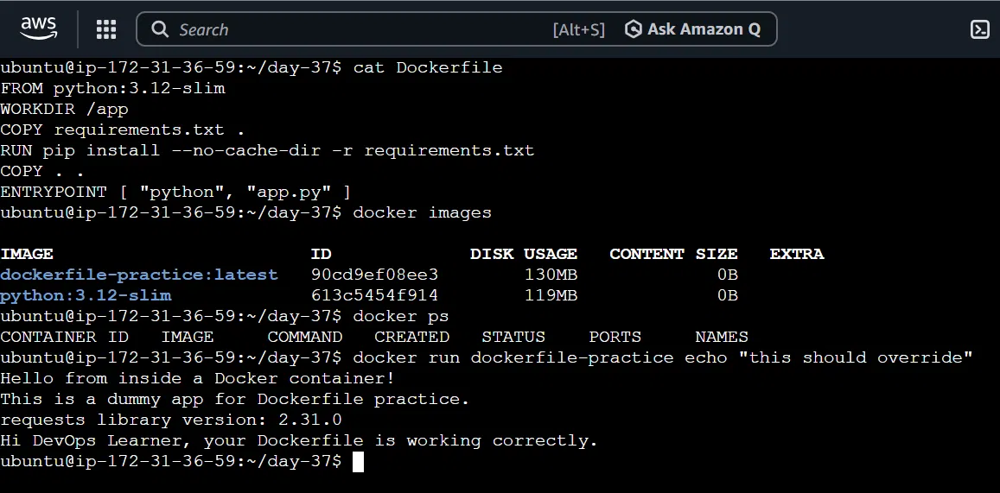

---

## Task 5: Building and Tagging a Custom Image

A **tag** is just a label/version name attached to an image, in the format `name:tag`. If you don't specify one, Docker assumes `latest`.

```bash
docker tag dockerfile-practice:latest dockerfile-practice:v1
```

This command does **not** create a new image — it just gives an existing image an additional name. Proof: both `dockerfile-practice:latest` and `dockerfile-practice:v1` showed the exact same IMAGE ID.

```bash
docker rmi dockerfile-practice:v1
# Output: Untagged: dockerfile-practice:v1  (not "Deleted"!)
```

Removing one tag only removes that *label* — as long as another tag (`latest`) still points to the same image, the actual image data stays on disk. Only when the **last** tag pointing to an image is removed does Docker actually delete the underlying data. This matters in real projects: keeping versioned tags like `v1`, `v2` lets you roll back to an older, known-working version if a new build has a bug.

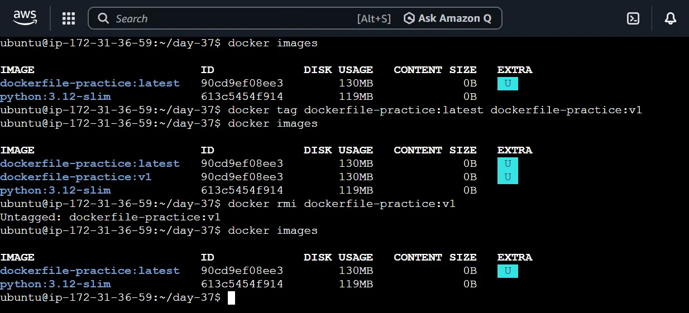

---

## Task 6: Named Volumes (Making Data Survive)

### The problem

Anything written inside a container normally disappears forever the moment that container is deleted, because it only exists inside that container's temporary filesystem.

### The fix — Volumes

A **volume** is storage space that Docker manages *outside* the container, on the host machine. A container can be "mounted" to a volume, meaning anything written to a specific folder inside the container is actually being saved in that external volume — so even if the container is deleted, the data survives.

```bash
docker volume create mysql-data
docker volume inspect mysql-data
docker run -it -v mysql-data:/data ubuntu bash
```

- `docker volume create mysql-data` — creates a volume with a memorable name (a "named" volume, as opposed to an auto-generated random name).
- `docker volume inspect` — shows details, including the exact folder path on the host where Docker is actually storing the data.
- `-v mysql-data:/data` — mounts our volume to the `/data` folder inside the container.

### Proof of persistence

We wrote a file inside a container, deleted that container entirely, then started a **brand new** container using the same volume — and the file was still there.

```bash
echo "hello from volume" > /data/test.txt
exit
docker rm <old-container>
docker run -it -v mysql-data:/data ubuntu bash
cat /data/test.txt   # still shows "hello from volume"
```

This is exactly how a real database container (like Postgres) avoids losing all its data every time it restarts.

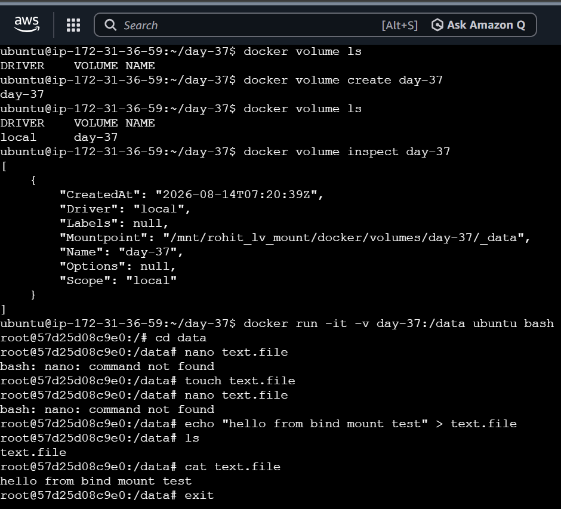
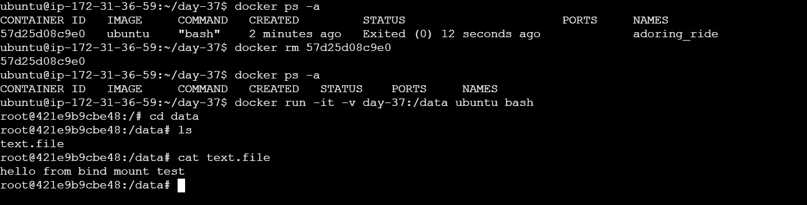

---

## Task 7: Bind Mounts

A bind mount is similar to a volume, but with one key difference: **you** choose the exact folder on the host machine, instead of letting Docker manage a hidden storage location.

```bash
docker run -it -v $(pwd):/data ubuntu bash
```

- `$(pwd)` — inserts the full path of your current folder on the host.
- `:/data` — that exact host folder is mapped to `/data` inside the container.

### Why this matters in real development

If you're actively writing code, a bind mount lets you edit files on your own computer using your normal editor, and see the change reflected **immediately** inside the running container — no rebuild needed. This is how "live reload" development setups work.

### Proof — it works both ways

We created a file *inside* the container, then exited (without deleting the container) — and the file instantly appeared in the normal folder on the host, with no copying step needed.

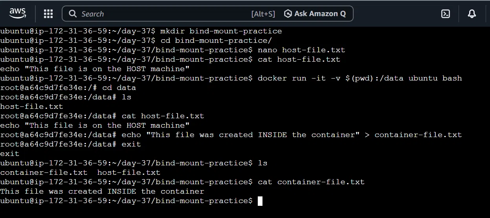

---

## Task 8: Custom Networks and Connecting Containers

By default, containers on Docker's default network can only reach each other by IP address, which is unreliable since IPs can change. A **custom network** solves this — containers on the same custom network can find each other **by name**.

```bash
docker network create my-test-network
docker run -d --name container1 --network my-test-network ubuntu sleep infinity
docker run -d --name container2 --network my-test-network ubuntu sleep infinity
```

- `sleep infinity` — a command that never finishes, used purely to keep the container alive so we can test with it (remember: no ongoing process = container exits).

### Proof

```bash
docker exec -it container1 bash
ping container2
```
```
PING container2 (172.19.0.3)
64 bytes from container2.my-test-network: ...
10 packets transmitted, 10 received, 0% packet loss
```

`container1` found `container2` just by name — Docker automatically resolved it to an IP address behind the scenes. This is exactly the mechanism that lets an app container in Docker Compose connect to a database using something like `DB_HOST: db`.

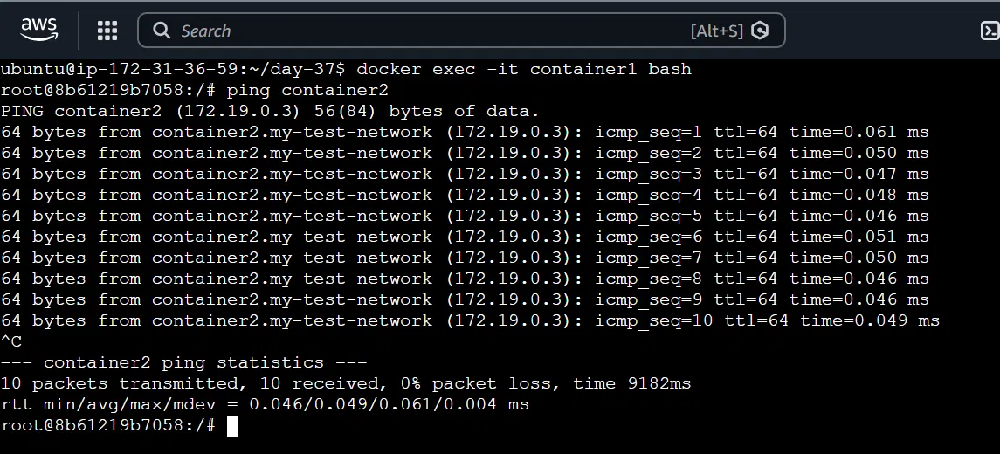

---

## Task 9: Docker Compose for a Multi-Container App

Running multiple containers manually (creating networks, remembering flags, getting startup order right) is tedious. **Docker Compose** puts the whole setup into one YAML file, so the entire stack starts with one command.

We built a simple 2-service app: **Nginx** (a web server) + **Redis** (an in-memory data store).

```yaml
services:
  web:
    image: nginx:alpine
    container_name: web_server
    ports:
      - "8080:80"
    depends_on:
      cache:
        condition: service_healthy
    networks:
      - app_network

  cache:
    image: redis:alpine
    container_name: redis_cache
    volumes:
      - redis_data:/data
    healthcheck:
      test: ["CMD", "redis-cli", "ping"]
      interval: 5s
      timeout: 5s
      retries: 5
    networks:
      - app_network

volumes:
  redis_data:

networks:
  app_network:
    driver: bridge
```

**Explaining the structure:**
- `services:` — lists every container we want. Here we have two: `web` and `cache`.
- `ports: "8080:80"` — maps port 8080 on the host to port 80 inside the container (Nginx's default port), so we can visit it in a browser.
- `volumes:` (top-level) — declares a named volume `redis_data`, so Redis's data survives container restarts.
- `networks:` (top-level) — creates a private network `app_network` so `web` and `cache` can find each other by name if needed.

**A common beginner mistake:** `volumes:` and `networks:` at the top level must be indented at the **same level as `services:`**, not nested inside a service. Putting them inside `cache:` by mistake makes YAML think they're extra services, which breaks everything.

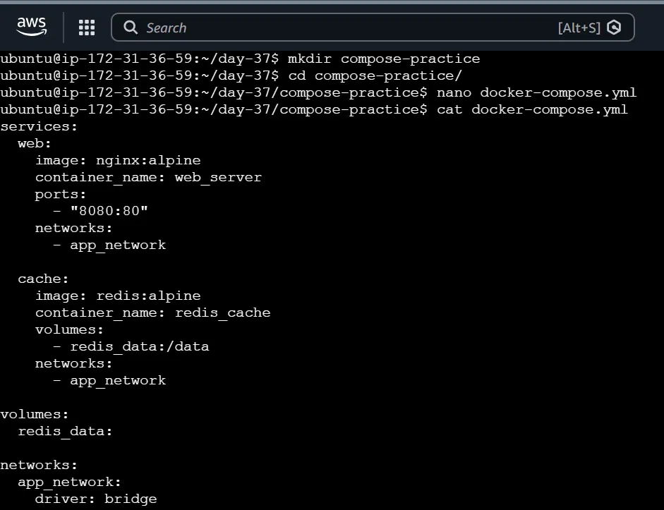

### Running and testing it

```bash
docker compose up -d
docker compose ps
docker exec -it redis_cache redis-cli ping   # returns PONG
```

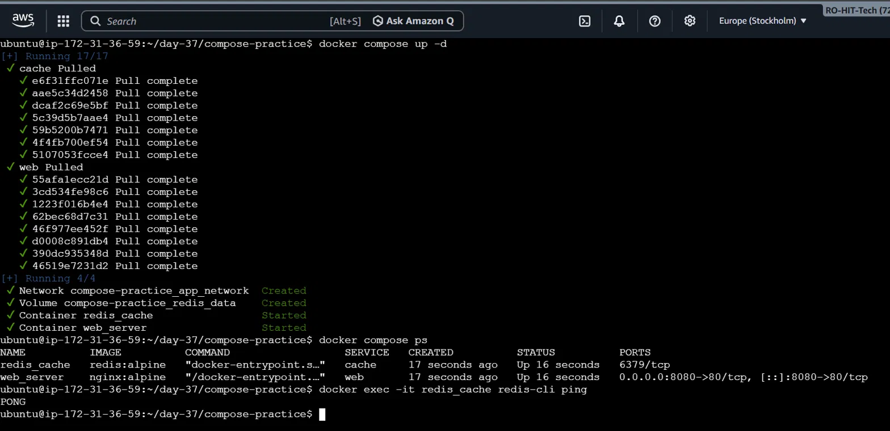

Visiting `http://<ec2-ip>:8080` in a browser showed the default Nginx welcome page — proof the container was reachable from outside.

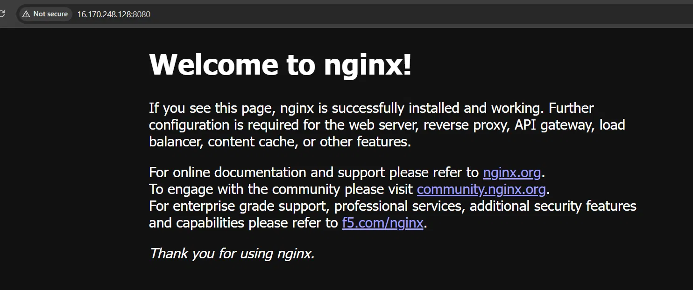

---

## Task 10: Environment Variables and `.env` Files in Compose

**Who provides what?** A developer's code decides the *names* of environment variables it needs (e.g., `os.environ.get("DB_PASSWORD")` in Python) — that part is fixed and can't be changed without editing the code. But the **actual values** (the real password, the real hostname) are provided separately, usually via a `.env` file, and this is typically the DevOps/deployment person's responsibility — not the developer's.

Why separate them? Because the same code needs different values in different situations (a different password for local testing vs. production), and secret values should never be hardcoded into source code that gets pushed to GitHub. A `.env.example` file (with just variable names, no real values) is what usually gets committed to version control; the real `.env` file with actual secrets is created locally by whoever is deploying, and is excluded from git via `.gitignore`.

---

## Task 11: Multi-Stage Dockerfile

### The problem

Installing dependencies sometimes requires heavy "build tools" (compilers, dev libraries) that are only needed *during* installation — not needed at all once the app is actually running. If we keep everything in a single build stage, those heavy tools stay in the final image forever, needlessly bloating its size.

### The analogy

Think of baking a cake. Your kitchen (oven, mixer, ingredients) is needed to *make* the cake, but once it's done, you only bring the **finished cake** to the dining table — not the oven and mixer. A multi-stage Dockerfile does exactly this: one stage does the "cooking" (installing/building), and a second, clean stage only takes the finished result.

```dockerfile
# ---------- STAGE 1: Builder ----------
FROM python:3.12-slim AS builder
WORKDIR /app
COPY requirements.txt .
RUN pip install --user --no-cache-dir -r requirements.txt

# ---------- STAGE 2: Final ----------
FROM python:3.12-slim
WORKDIR /app
COPY --from=builder /root/.local /root/.local
COPY . .
ENV PATH=/root/.local/bin:$PATH
CMD ["python", "app.py"]
```

- `FROM python:3.12-slim AS builder` — starts the first stage, and names it `builder` so we can refer to it later.
- A second `FROM` line starts a **completely fresh** stage — nothing from stage 1 carries over automatically.
- `COPY --from=builder /root/.local /root/.local` — this is the key line: it reaches back into the `builder` stage and copies out **only the installed libraries**, leaving any heavy build tools behind.

### Real-world impact

For our tiny example (a small `requests` library), the size difference was modest (130MB → 122MB) because installing `requests` doesn't need heavy compilers. But for libraries like `psycopg2` (which needs a C compiler and PostgreSQL dev headers to install), a single-stage image might be 500MB+, while a multi-stage version of the exact same app could be under 150MB — because all those compiler tools never make it into the final image.

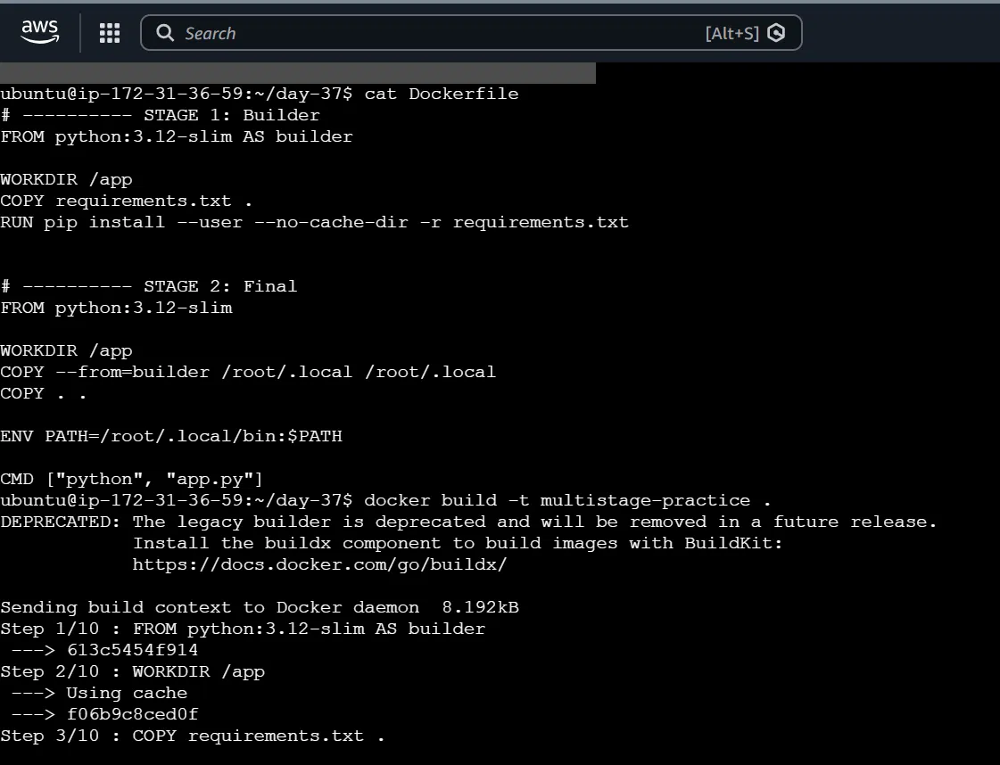
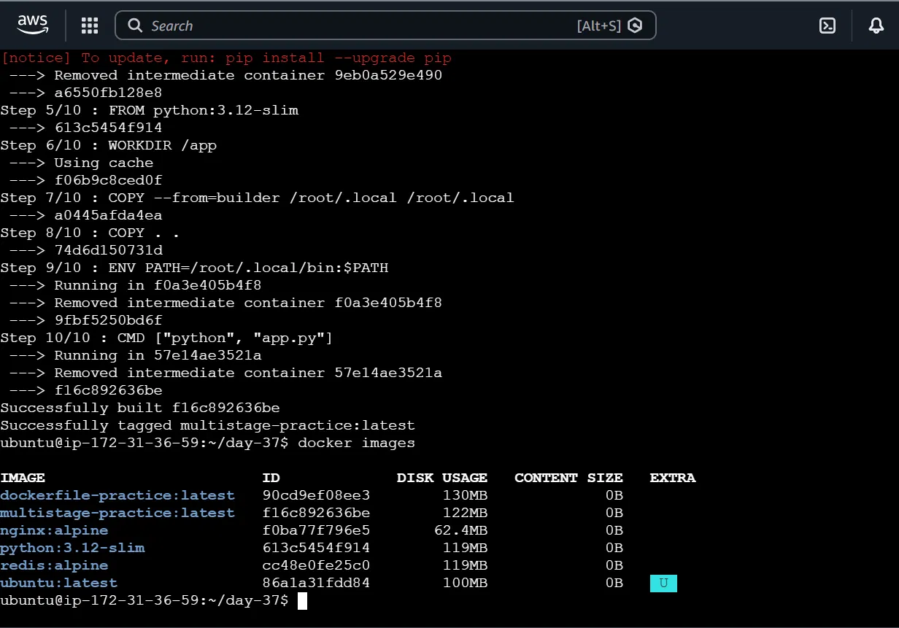

---

## Task 12: Pushing an Image to Docker Hub

**Docker Hub** is a public registry — like GitHub, but for Docker images. Pushing an image there lets anyone (or any server) download and run it without needing your source code.

```bash
docker tag multistage-practice rtingane2611/multistage-practice:v1
docker push rtingane2611/multistage-practice:v1
```

- Images pushed to Docker Hub must be tagged in the format `username/repository:tag`.
- `docker push` uploads the image's layers. Layers that are already common/shared (like the base `python:3.12-slim` layers) are skipped or "mounted" instead of being re-uploaded — this is why the upload can be much faster than the total image size suggests.

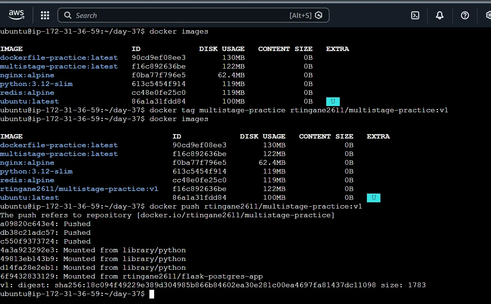
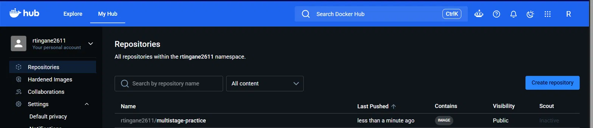

---

## Task 13: Healthchecks and `depends_on`

### The problem `depends_on` alone doesn't solve

`depends_on` by itself only controls **start order** — it makes sure one container's `docker run`/start command fires after another's, but it does **not** wait for that other container to actually be *ready*. A database container might be "started" but still take a few seconds to actually accept connections — an app that starts immediately after could crash trying to connect too early.

### The fix — combining healthcheck with a condition

```yaml
cache:
  healthcheck:
    test: ["CMD", "redis-cli", "ping"]
    interval: 5s
    timeout: 5s
    retries: 5

web:
  depends_on:
    cache:
      condition: service_healthy
```

- `healthcheck:` — tells Docker to periodically run a real test (`redis-cli ping`) inside the `cache` container, every 5 seconds, to check if it's *actually* ready — not just "started."
- `depends_on: condition: service_healthy` — tells the `web` service to wait until `cache` passes that healthcheck before starting itself.

### Proof

```
✔ Container redis_cache   Healthy   5.8s
✔ Container web_server    Started   5.9s
```
```
docker compose ps
redis_cache   Up 20 seconds (healthy)
web_server    Up 15 seconds
```

`web_server` visibly started a few seconds *after* `redis_cache` was confirmed healthy — exactly the safety guarantee we wanted.

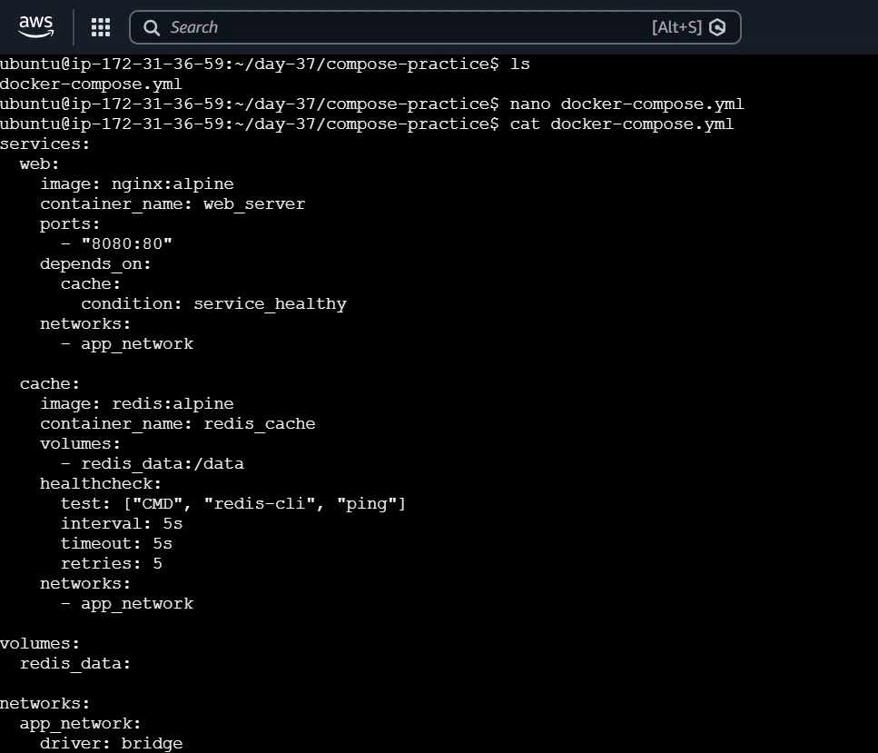
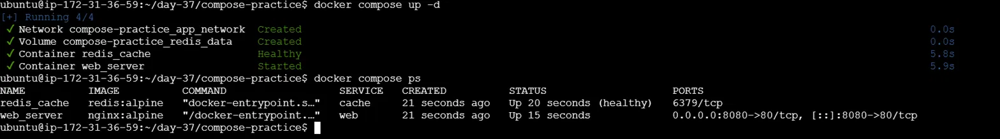

---

## Summary — Self-Assessment After Today

| Skill | Before Today | After Today |
|---|---|---|
| Run containers (interactive + detached) | Shaky | Can do |
| List/stop/remove containers & images | Can do | Can do |
| Explain image layers & caching | Shaky | Can do |
| Write a Dockerfile from scratch | Can do | Can do (deeper understanding) |
| CMD vs ENTRYPOINT | Haven't done | Can do |
| Build and tag a custom image | Can do | Can do (deeper understanding) |
| Named volumes | Shaky | Can do |
| Bind mounts | Haven't done | Can do |
| Custom networks | Haven't done | Can do |
| Docker Compose (multi-container) | Can do | Can do (deeper understanding) |
| Env variables + .env in Compose | Can do | Can do |
| Multi-stage Dockerfile | Haven't done | Can do |
| Push to Docker Hub | Can do | Can do |
| Healthchecks + depends_on | Can do | Can do (deeper understanding) |

The biggest weak spots going in were **CMD vs ENTRYPOINT**, **bind mounts**, and **custom networks** — all three were completely new hands-on territory today, and all three are now backed by real, tested proof rather than just theory.
