# Day 40 – My First GitHub Actions Workflow

`#90DaysOfDevOps` `#DevOpsKaJosh` `#TrainWithShubham`

---

## 🎯 Overview

Today marks the day CI/CD stopped being just a concept and became real for me. I built my first GitHub Actions pipeline from scratch — set it up, watched it run in the cloud, broke it on purpose, read the error, and fixed it. Below is a complete, task-wise breakdown of everything I did.

---

## ✅ Task 1: Set Up

**What I did:**
1. Created a new **public** GitHub repository named `github-actions-practice`.
2. Cloned it to my local machine using:
   ```bash
   git clone https://github.com/rohittingane/github-actions-practice.git
   ```
3. Created the required folder structure inside the repo:
   ```bash
   mkdir -p .github/workflows
   ```

**Why this structure matters:**
GitHub Actions only looks for workflow files inside the `.github/workflows/` folder. If a `.yml` file is placed anywhere else, GitHub will not detect or run it. This is a fixed, non-negotiable location.

📸 *Creating the repository on GitHub:*
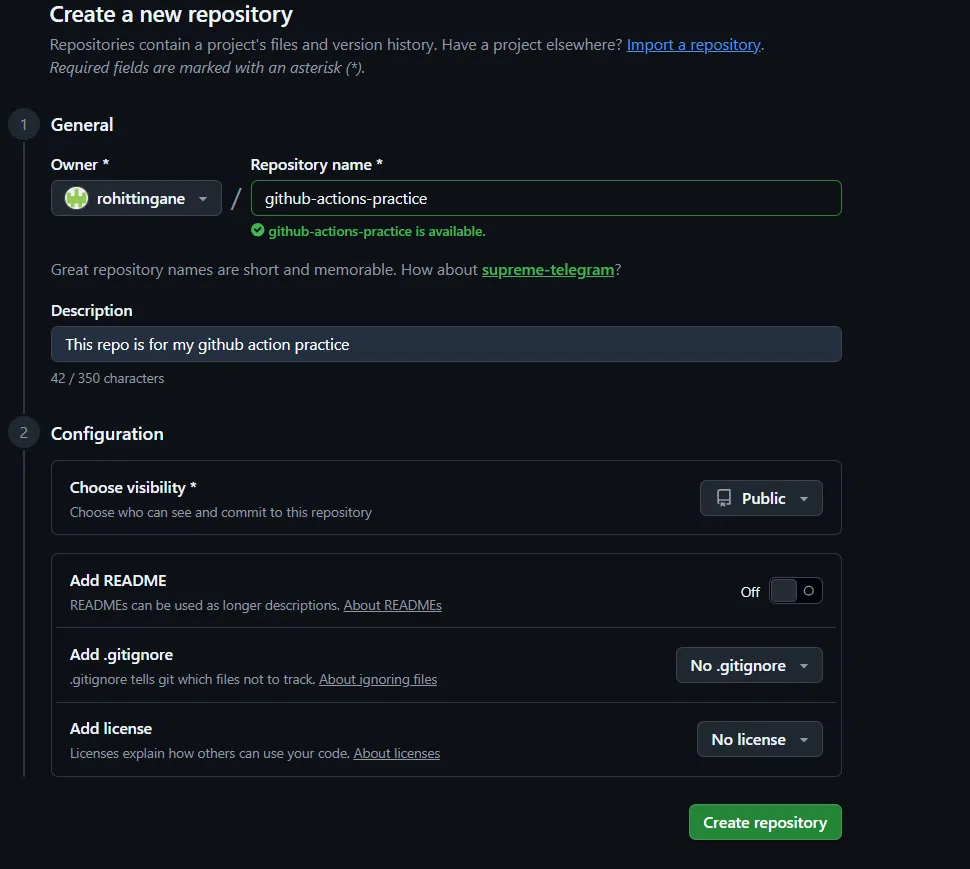

📸 *Local clone + `.github/workflows/` folder structure:*
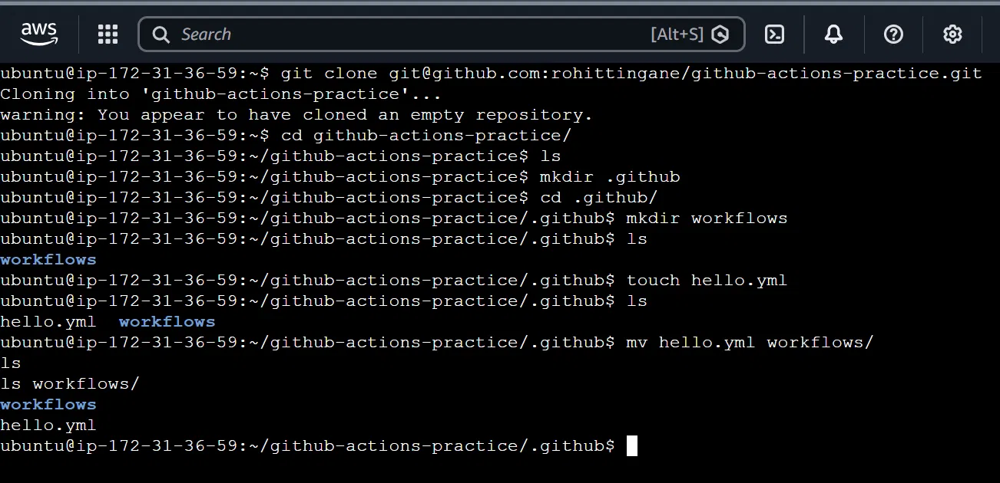

---

## ✅ Task 2: The Hello Workflow

**What I did:**
Created `.github/workflows/hello.yml` with a basic workflow that:
- Triggers on every `push`
- Has one job called `greet`
- Runs on `ubuntu-latest`
- Has two steps: checkout the code, then print a greeting message

```yaml
name: Hello Workflow

on: push

jobs:
  greet:
    runs-on: ubuntu-latest
    steps:
      - name: checkout code
        uses: actions/checkout@v4
      - name: print greeting
        run: echo "Hello from github action"
```

**Mistakes I made and fixed along the way:**
- Initially wrote `user:` instead of `uses:` — GitHub Actions didn't recognize it, causing errors in the "Problems" tab.
- Initially wrote `runs-on: ubuntu:latest` (colon) instead of `runs-on: ubuntu-latest` (hyphen) — this caused the job to get stuck forever at "Waiting for a runner to pick up this job..." because no runner matched that label.

📸 *After fixing the `uses` typo, pushing successfully:*
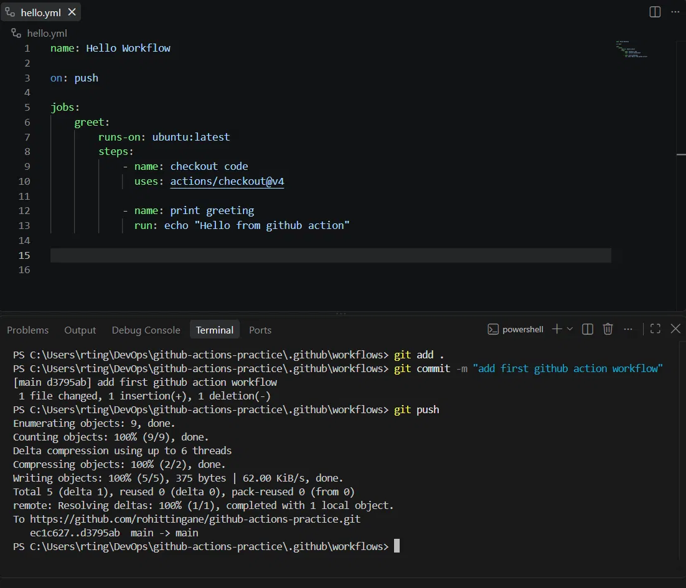

**Result:** After fixing both issues, I pushed the code and went to the **Actions** tab on GitHub. The workflow ran successfully — my first green ✅ pipeline!

📸 *My first green pipeline run:*
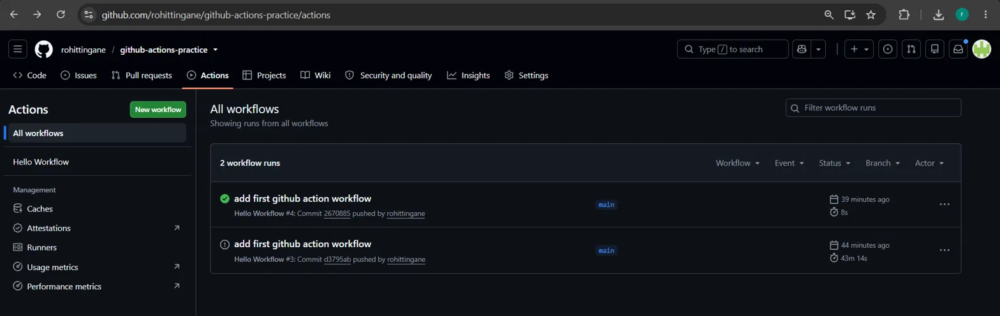

📸 *Run details — Status: Success, Total duration: 8s:*
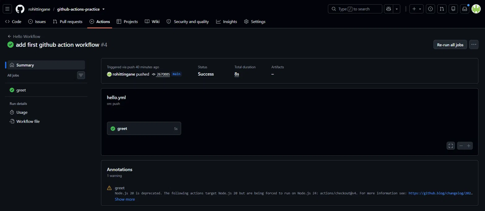

📸 *All steps passing (checkout code, print greeting):*
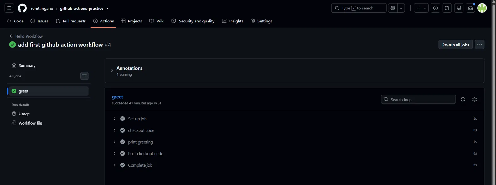

---

## ✅ Task 3: Understanding the Anatomy of a Workflow

I studied my `hello.yml` file and noted down what each key does, in my own words:

| Keyword | What it does |
|---|---|
| `name:` | Gives the workflow a readable name. This is what shows up at the top of the Actions tab so I can identify runs easily. |
| `on:` | Defines the **trigger** — the event that starts the workflow. In my case, `on: push` means the workflow runs every time I push code to the repo. |
| `jobs:` | A workflow is made up of one or more jobs. Each job is an independent unit of work that runs on its own virtual machine (runner). |
| `runs-on:` | Tells GitHub which operating system/environment to spin up for the job. I used `ubuntu-latest`, so my job runs on a fresh Ubuntu Linux VM. |
| `steps:` | A list of individual tasks inside a job. Steps execute **in order, one after another**, from top to bottom. |
| `uses:` | Used when I want to run a **pre-built, reusable action** made by GitHub or the community, instead of writing my own script. Example: `actions/checkout@v4` pulls my repository's code onto the runner so later steps can access it. |
| `run:` | Executes a raw shell/terminal command directly on the runner — like `echo`, `date`, or `ls -la`. |
| `name:` (on a step) | Gives an individual step a human-readable label, so it's easy to identify in the logs (instead of just seeing the raw command). |

---

## ✅ Task 4: Adding More Steps

**What I did:**
Updated `hello.yml` to add four more steps:
1. Print the current date and time
2. Print the branch name that triggered the run
3. List the files in the repo
4. Print the runner's operating system

```yaml
name: Hello Workflow

on: push

jobs:
  greet:
    runs-on: ubuntu-latest
    steps:
      - name: checkout code
        uses: actions/checkout@v4
      - name: print greeting
        run: echo "Hello from github action"
      - name: print current date and time
        run: date
      - name: print branch name
        run: echo "This run was triggered from branch ${{ github.ref_name }}"
      - name: list files in repo
        run: ls -la
      - name: print runner OS
        run: echo "Runner OS is ${{ runner.os }}"
```

**Key learning — GitHub built-in variables:**
- `${{ github.ref_name }}` → gives the name of the branch that triggered the run (e.g. `main`)
- `${{ runner.os }}` → gives the operating system of the runner (e.g. `Linux`)

These are called **context variables**, and GitHub provides many more (like `github.actor`, `github.repository`, `github.sha`) that I can use inside workflows without manually configuring anything.

**Mistake I made:** After adding blank lines between steps, I got a `YAML syntax error` — "Invalid workflow file: You have an error in your yaml syntax on line 8." I fixed this by rewriting the steps list without stray blank lines and keeping consistent indentation (spaces, not tabs).

📸 *Updated `hello.yml` with Task 4 steps added:*
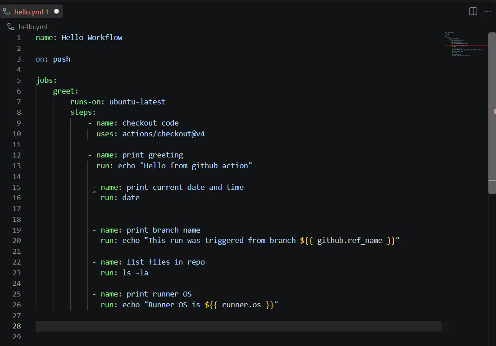

**Result:** Pushed again, and this time all 6 steps ran and passed successfully ✅.

📸 *All steps (checkout, greeting, date, branch, files, OS) passing:*
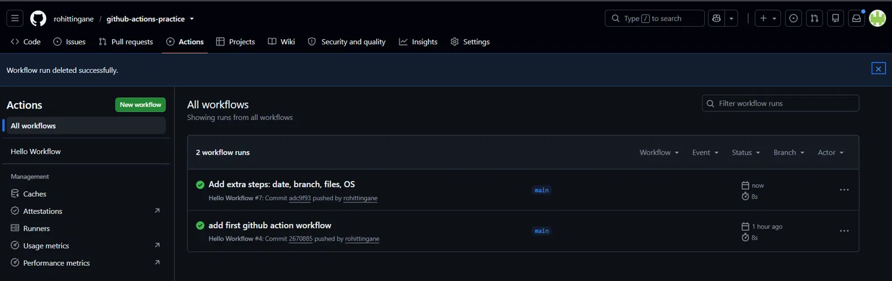

---

## ✅ Task 5: Breaking It On Purpose

**What I did:**
Added a step designed to fail:

```yaml
      - name: this step will fail
        run: exit 1
```

`exit 1` is a shell command that tells the system "something went wrong" — any exit code other than `0` is treated as a failure.

**What happened when I pushed:**
- The run showed a **red ❌ cross icon** instead of the usual green tick.
- The **Status** field showed `Failure`.
- The **Annotations** section clearly reported: *"1 error and 1 warning" → "Process completed with exit code 1."*
- Clicking into the failed job showed that all steps **before** the failing one were still green ✅ — only the last step failed and stopped the job there.

📸 *Failed run — Status: Failure:*
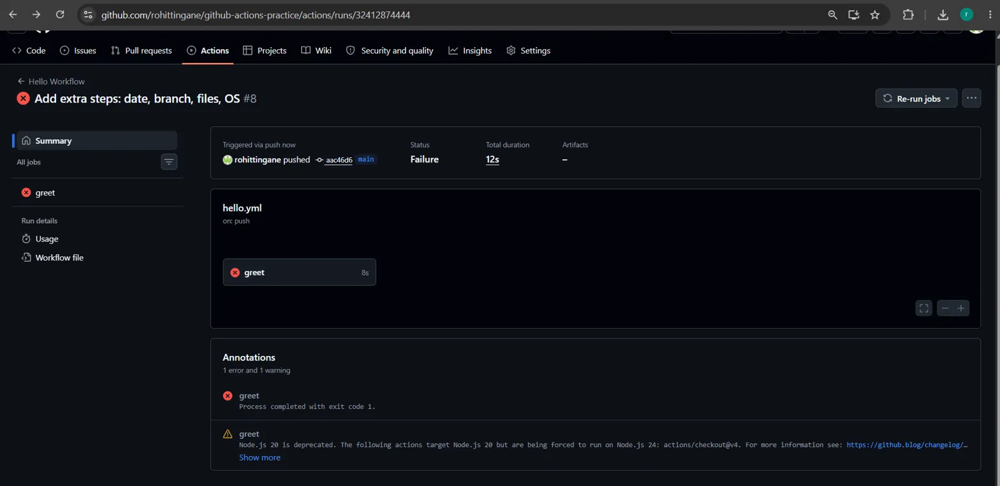

📸 *Failed step expanded — showing `exit 1` and the error log:*
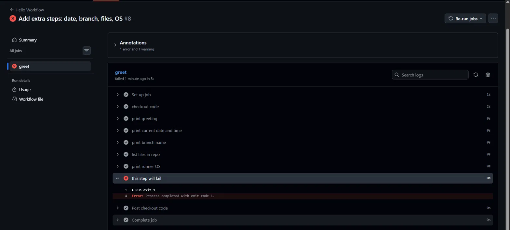

### 🔍 What does a failed pipeline look like?
- Red cross (❌) instead of green tick (✅) next to the run name.
- Status column explicitly says "Failure."
- The failing step is auto-expanded in the logs with the error highlighted in red.
- Steps that ran before the failure remain successful — GitHub Actions stops the job at the point of failure, it doesn't roll back previous steps.

### 🔍 How do you read the error?
1. Go to the failed run → click on the failed job (shown in red in the sidebar).
2. Scroll to find the step with the ❌ icon and click to expand it.
3. Read the log output — it shows the exact command that ran and the exit code returned.
4. The **Annotations** section at the top summarizes the error in one line, so I don't even have to dig through full logs to know something broke.

**How I fixed it:**
I removed the `exit 1` step from `hello.yml`, committed the change with a clear message (`"Remove failing step - pipeline fixed"`), and pushed again. The next run went back to green ✅, confirming the pipeline was healthy.

📸 *Complete run history — Success → Fail → Fixed:*
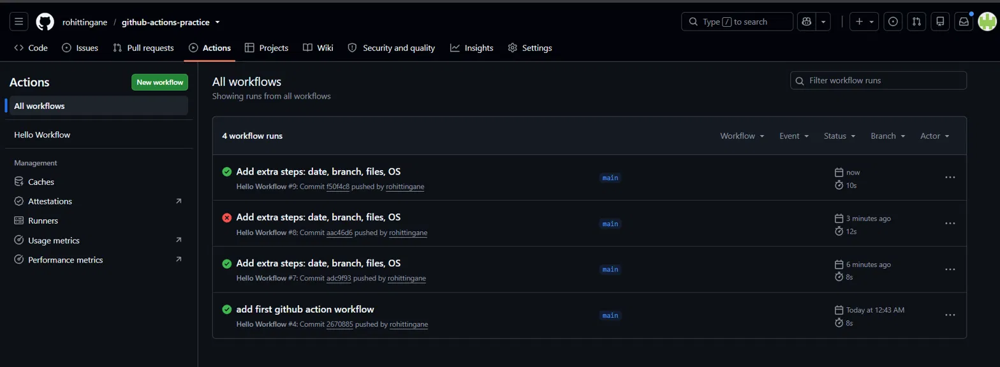

---

## 💡 Key Learnings from Today

1. Workflow files **must** live inside `.github/workflows/` and end in `.yml` — GitHub won't detect them anywhere else.
2. `uses:` vs `run:` — one calls a pre-built action, the other runs a raw shell command. Mixing them up (like typing `user:`) breaks the workflow silently with a "Problems" warning.
3. `runs-on:` needs an exact, valid label (`ubuntu-latest`) — a wrong label doesn't error immediately, it just hangs forever waiting for a runner.
4. YAML is very strict about indentation — inconsistent spacing or stray blank lines inside a `steps:` list can break the entire file.
5. Every `push` automatically triggers a new run — no manual "start" button needed.
6. A failed step stops that job, but doesn't affect steps that already succeeded before it.
7. The **Annotations** section is the fastest way to understand what broke, without reading through the entire log.
8. GitHub provides built-in context variables like `${{ github.ref_name }}` and `${{ runner.os }}` that give useful runtime information for free.

---

**This green checkmark hits different.** ✅


