# Day 41 – GitHub Actions: Triggers & Matrix Builds

Today I learned how to control **when GitHub Actions workflows run** and how to run the same job with different configurations using **Matrix Builds**.

In this Day, I practiced:

* Pull Request trigger
* Scheduled trigger using `cron`
* Manual trigger using `workflow_dispatch`
* Matrix builds with multiple Python versions
* Matrix builds with multiple operating systems
* `exclude`
* `fail-fast`
* Debugging GitHub Actions errors

---

## 📁 Repository

Repository:

`github-actions-practice`

Workflow files are stored inside:

```text
.github/workflows/
```

---

# What is a Trigger?

A **trigger** tells GitHub Actions:

> **When should this workflow run?**

Common GitHub Actions triggers are:

| Trigger             | When it runs                                   |
| ------------------- | ---------------------------------------------- |
| `push`              | When code is pushed                            |
| `pull_request`      | When a Pull Request is opened or updated       |
| `schedule`          | Automatically at a scheduled time              |
| `workflow_dispatch` | When a person manually clicks **Run workflow** |

Today I practiced all of these triggers and also learned **Matrix Builds**.

---

# Task 1 – Pull Request Trigger

## 🎯 Goal

Create a workflow that runs when a Pull Request is opened or updated against the `main` branch.

The workflow should **not run just because of a normal push**.

---

## Step 1 – Go to the repository

Open the repository:

```text
github-actions-practice
```

Open the terminal and go inside the repository:

```bash
cd github-actions-practice
```

---

## Step 2 – Create a new branch

Create a separate branch for the Pull Request:

```bash
git checkout -b add-pr-check
```

A Pull Request compares two branches:

```text
add-pr-check → main
```

So we work on a separate branch instead of directly working on `main`.

---

## Step 3 – Create the workflow folder

If the folder does not already exist:

```bash
mkdir -p .github/workflows
```

Create this file:

```text
.github/workflows/pr-check.yml
```

---

## Step 4 – Add the workflow code

```yaml
name: PR Check

on:
  pull_request:
    branches: [main]

jobs:
  pr-check-job:
    runs-on: ubuntu-latest

    steps:
      - name: checkout code
        uses: actions/checkout@v4

      - name: print branch info
        run: echo "PR check running for branch: ${{ github.head_ref }}"
```

### Screenshot – PR Check Workflow Code

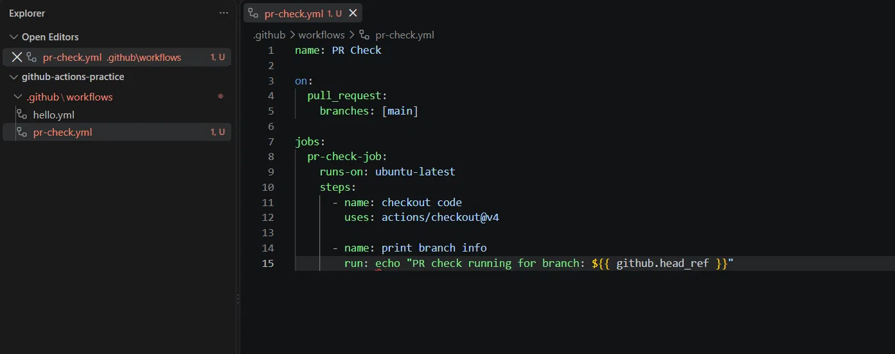

---

## 🧠 Understand the code

### `name`

```yaml
name: PR Check
```

This is the workflow name displayed in GitHub Actions.

### `pull_request`

```yaml
on:
  pull_request:
```

This tells GitHub to run the workflow when a Pull Request event happens.

### `branches: [main]`

```yaml
branches: [main]
```

The workflow runs only when the Pull Request targets the `main` branch.

### `runs-on`

```yaml
runs-on: ubuntu-latest
```

GitHub creates an Ubuntu virtual machine to run the job.

### Checkout

```yaml
uses: actions/checkout@v4
```

This checks out the repository code onto the GitHub runner.

### `github.head_ref`

```yaml
${{ github.head_ref }}
```

This gives the name of the branch from which the Pull Request is coming.

For example:

```text
add-pr-check
```

---

## Step 5 – Save and push the branch

Run:

```bash
git add .
```

Then:

```bash
git commit -m "Add PR check workflow"
```

Then:

```bash
git push origin add-pr-check
```

### Screenshot – Git Push

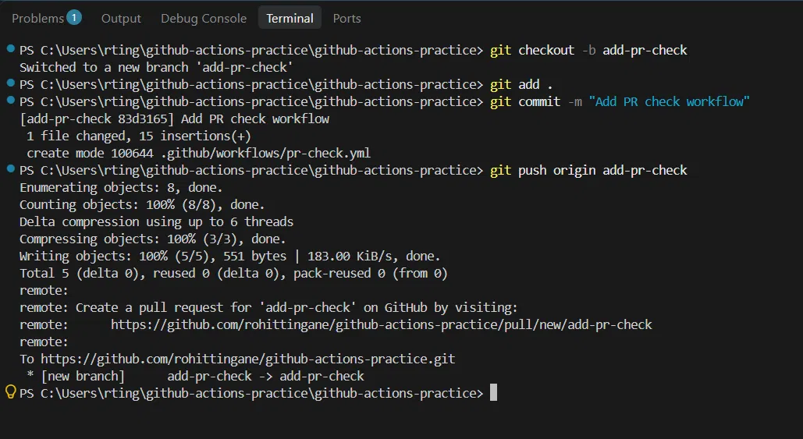

---

## Step 6 – Create the Pull Request

After pushing the branch, GitHub provides an option to create a Pull Request.

You can also go to:

```text
GitHub → Pull Requests → New Pull Request
```

Select:

```text
Base: main
Compare: add-pr-check
```

### Screenshot – Compare Branches

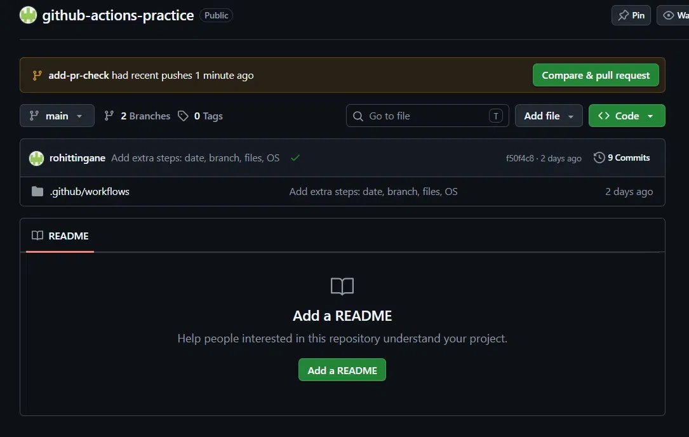

Click:

```text
Create pull request
```

### Screenshot – Pull Request Form

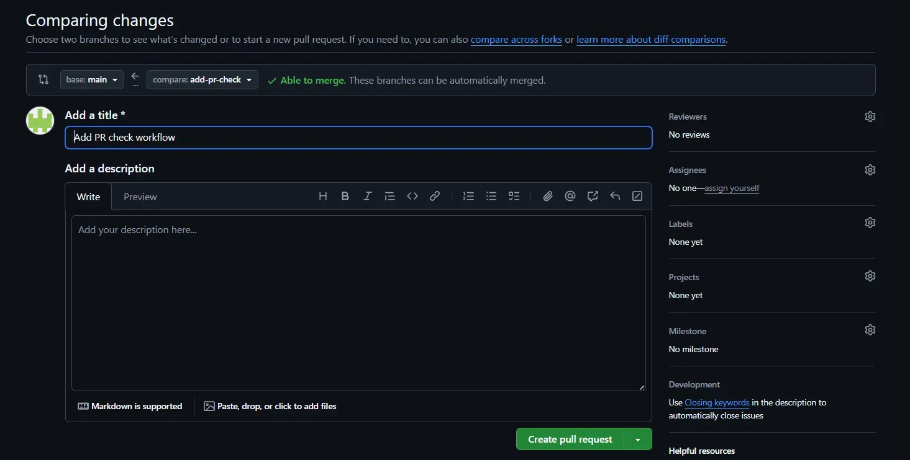

---

## Step 7 – Check the workflow

Open the Pull Request.

Go to the **Checks** section.

The `PR Check` workflow should automatically start.

You do not need to manually click **Run workflow**.

### Screenshot – PR Checks Passed

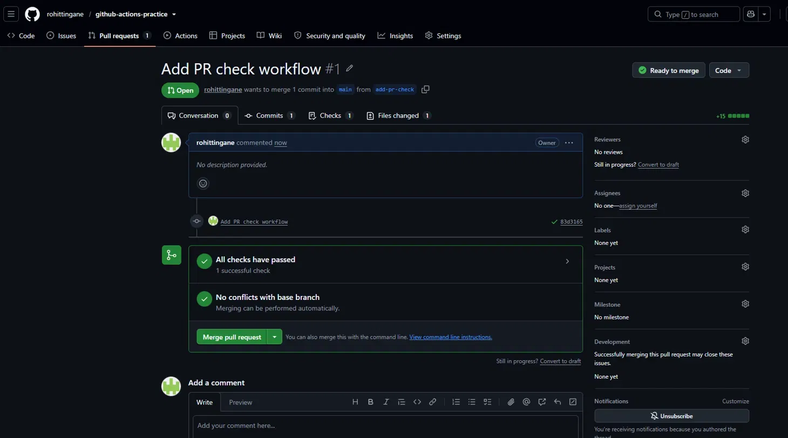

---

## ✅ Expected Result

You should see:

```text
PR Check
✓ Success
```

The workflow ran because a Pull Request was created.

---

## Step 8 – Merge the Pull Request

After confirming that the checks passed, merge the Pull Request into `main`.

### Screenshot – Pull Request Merged

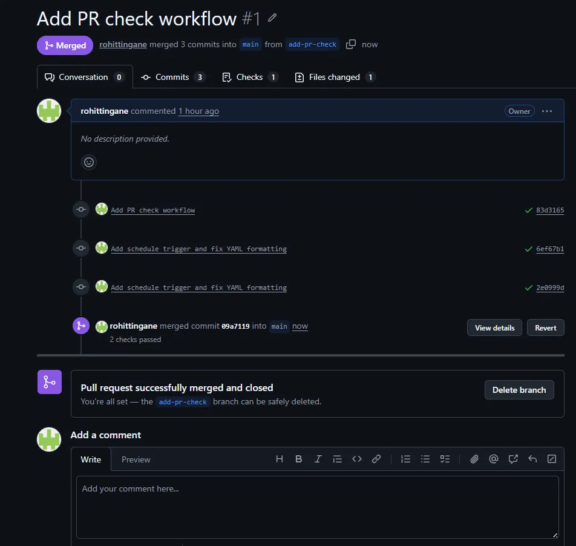

---

## ✅ Task 1 Complete

The complete flow was:

```text
Create branch
      ↓
Write workflow
      ↓
Push branch
      ↓
Create Pull Request
      ↓
GitHub detects pull_request
      ↓
PR Check runs automatically
      ↓
Checks pass
      ↓
Merge Pull Request
```

---

# Task 2 – Scheduled Trigger

## 🎯 Goal

Modify the existing `hello.yml` workflow so that it runs:

1. When code is pushed
2. Automatically every day at a fixed time

We will use:

```yaml
schedule:
```

and:

```yaml
cron:
```

---

## Step 1 – Open the workflow

Open:

```text
.github/workflows/hello.yml
```

---

## Before

The workflow had:

```yaml
on: push
```

---

## After

Change it to:

```yaml
on:
  push: {}
  schedule:
    - cron: '0 0 * * *'
```

### Screenshot – Schedule Trigger Code

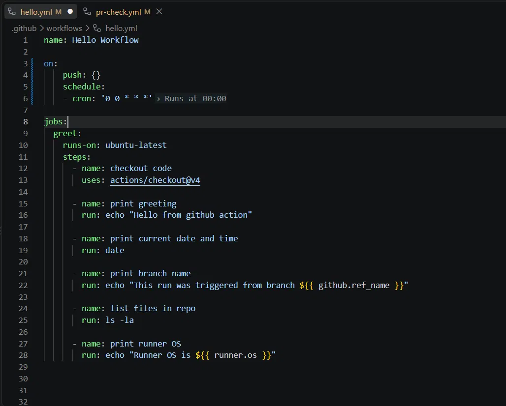

---

## 🧠 Understand the code

### `push: {}`

```yaml
push: {}
```

This keeps the workflow running on push.

The `{}` means that there are no additional settings for the push trigger.

---

### `schedule`

```yaml
schedule:
```

This tells GitHub to run the workflow automatically according to a schedule.

---

### `cron`

```yaml
cron: '0 0 * * *'
```

Cron uses five values:

```text
0 0 * * *
│ │ │ │ │
│ │ │ │ └── Day of week
│ │ │ └──── Month
│ │ └────── Day of month
│ └──────── Hour
└────────── Minute
```

Therefore:

```text
0 0 * * *
```

means:

```text
Every day at 00:00 UTC
```

---

## 🇮🇳 India Time

GitHub Actions cron uses UTC.

India is:

```text
UTC + 5:30
```

Therefore:

```text
00:00 UTC
=
05:30 AM IST
```

So this:

```yaml
cron: '0 0 * * *'
```

runs every day at **5:30 AM India time**.

---

## Bonus Question

### What is the cron expression for every Monday at 9 AM?

Answer:

```text
0 9 * * 1
```

---

## ⚠️ Error I Faced

Initially I wrote:

```yaml
on:
  push:
```

VS Code showed a YAML warning.

The checker complained about:

```text
Required property is missing: on
```

This was not an actual GitHub Actions error.

The YAML checker was being strict about the empty `push:` value.

---

## ✅ Fix

I changed:

```yaml
push:
```

to:

```yaml
push: {}
```

Final code:

```yaml
on:
  push: {}
  schedule:
    - cron: '0 0 * * *'
```

---

## Step 2 – Save and push

```bash
git add .
git commit -m "Add schedule trigger and fix YAML formatting"
git push origin add-pr-check
```

The changes were then merged into `main`.

---

## Step 3 – Verify

The schedule configuration was checked and the workflow remained valid.

### Screenshot – Schedule Checks Passed

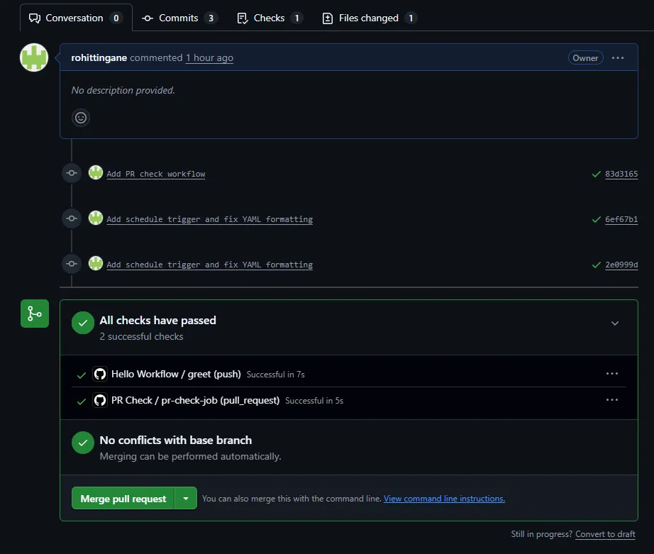

---

## ⚠️ Important Note

A scheduled workflow does not run immediately after a push.

It runs at the configured time.

Also, scheduled workflows run from the repository's default branch.

Therefore, I verified the cron configuration and merged the changes instead of waiting for the actual scheduled execution.

---

# Task 3 – Manual Trigger

## 🎯 Goal

Create a workflow that runs only when a person manually clicks:

```text
Run workflow
```

The workflow should also accept an environment input such as:

```text
staging
```

or:

```text
production
```

---

## Step 1 – Create the workflow

Create:

```text
.github/workflows/manual.yml
```

---

## Step 2 – Add the code

```yaml
name: Manual Trigger Workflow

on:
  workflow_dispatch:
    inputs:
      environment:
        description: "environment name"
        required: true
        default: "staging"

jobs:
  manual-job:
    runs-on: ubuntu-latest

    steps:
      - name: checkout code
        uses: actions/checkout@v4

      - name: print environment input
        run: echo "Deploying to environment ${{ github.event.inputs.environment }}"
```

### Screenshot – Manual Workflow Code

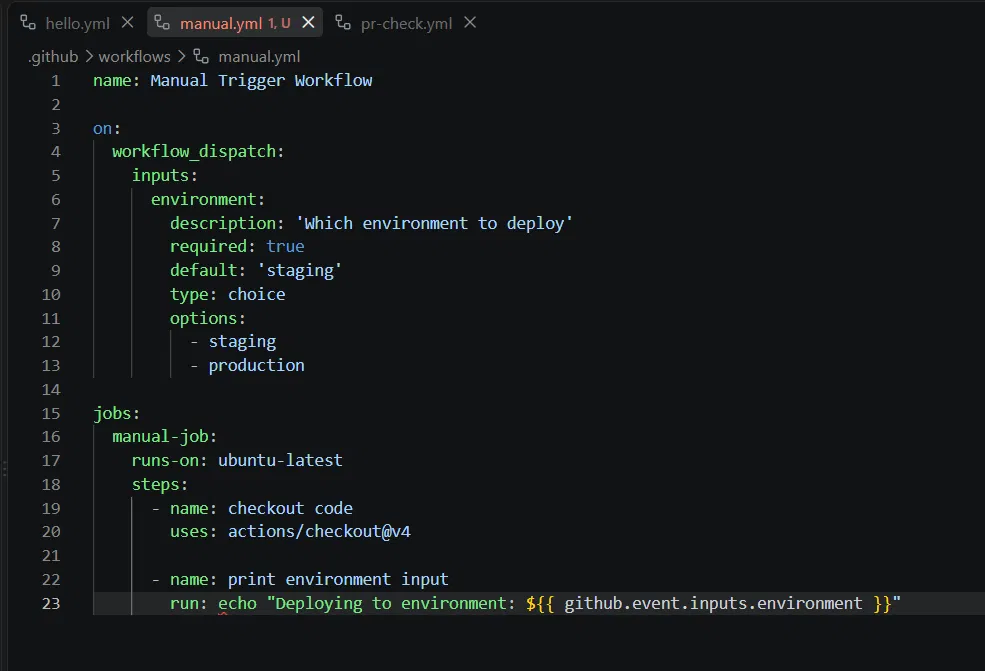

---

## 🧠 Understand the code

### `workflow_dispatch`

```yaml
workflow_dispatch:
```

This adds a **Run workflow** button in GitHub Actions.

The workflow does not automatically run from a normal push or Pull Request.

---

### Input

```yaml
inputs:
  environment:
```

This creates an input field for the user.

---

### Required

```yaml
required: true
```

The user must provide a value.

---

### Default

```yaml
default: "staging"
```

If the user does not change the value, it uses:

```text
staging
```

---

### Reading the input

```yaml
${{ github.event.inputs.environment }}
```

This reads the value provided by the user.

---

## Step 3 – Run the workflow manually

Go to:

```text
GitHub → Actions
```

Select:

```text
Manual Trigger Workflow
```

Click:

```text
Run workflow
```

The environment input will appear.

Leave it as:

```text
staging
```

### Screenshot – Manual Trigger Input

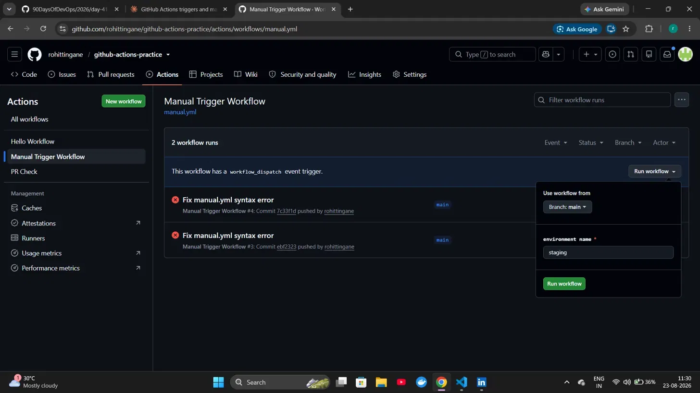

Click:

```text
Run workflow
```

---

## Step 4 – Check the result

The workflow should start successfully.

### Screenshot – Manual Workflow Success

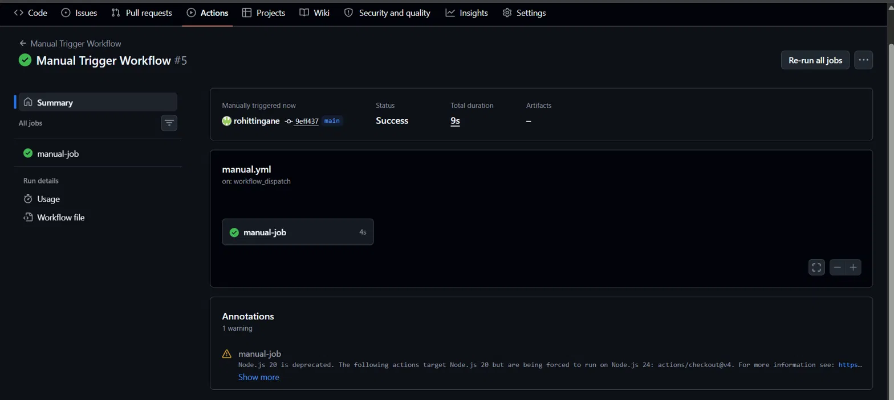

Open the job logs.

You should see:

```text
Deploying to environment staging
```

### Screenshot – Environment Input Printed

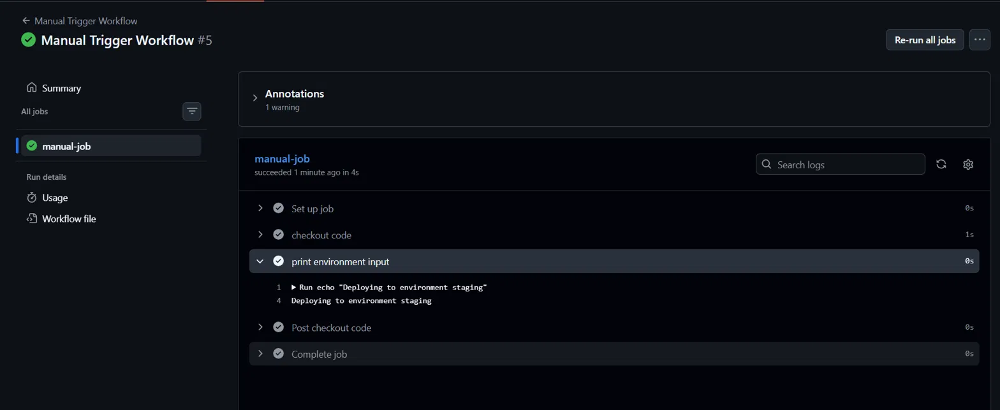

---

## ⚠️ Error 1 – YAML Syntax Error

Initially I wrote:

```yaml
run: {}
echo "Deploying to environment: ${{ github.event.inputs.environment }}"
```

This is incorrect because the `echo` command was not part of the `run` field.

---

## ✅ Fix

Use:

```yaml
run: echo "Deploying to environment ${{ github.event.inputs.environment }}"
```

---

## ⚠️ Error 2 – File Was Not Saved

After fixing the workflow, Git showed:

```text
nothing to commit, working tree clean
```

The reason was that the file still had unsaved changes in VS Code.

Git only sees changes that are actually saved to disk.

---

## ✅ Fix

Press:

```text
Ctrl + S
```

Then run:

```bash
git add .
git commit -m "Fix manual.yml syntax error"
git push origin main
```

---

## ✅ Task 3 Complete

The complete flow was:

```text
GitHub Actions
      ↓
Manual Trigger Workflow
      ↓
Click Run workflow
      ↓
Enter/select environment
      ↓
Workflow starts
      ↓
Environment printed
      ↓
Success
```

---

# Task 4 – Matrix Builds

## 🎯 Goal

Run the same job using multiple Python versions.

We will test:

```text
Python 3.10
Python 3.11
Python 3.12
```

Instead of creating three jobs manually, GitHub Actions will create them automatically using a matrix.

---

## Step 1 – Create the workflow

Create:

```text
.github/workflows/matrix.yml
```

---

## Step 2 – Add the code

```yaml
name: Matrix Build

on: push

jobs:
  test-python:
    runs-on: ubuntu-latest

    strategy:
      matrix:
        python-version: ["3.10", "3.11", "3.12"]

    steps:
      - name: checkout code
        uses: actions/checkout@v4

      - name: setup python
        uses: actions/setup-python@v5
        with:
          python-version: ${{ matrix.python-version }}

      - name: print python version
        run: python --version
```

---

## 🧠 Understand Matrix

This:

```yaml
matrix:
  python-version: ["3.10", "3.11", "3.12"]
```

means:

> Run the same job once for every Python version.

GitHub creates:

```text
Job 1 → Python 3.10
Job 2 → Python 3.11
Job 3 → Python 3.12
```

These jobs can run in parallel.

---

## `matrix.python-version`

```yaml
python-version: ${{ matrix.python-version }}
```

GitHub automatically provides the current Python version for each job.

---

## `setup-python`

```yaml
uses: actions/setup-python@v5
```

This sets up the required Python version on the GitHub runner.

---

## Step 3 – Commit and push

```bash
git add .
git commit -m "Add Python matrix workflow"
git push origin main
```

### Screenshot – Matrix Code Pushed

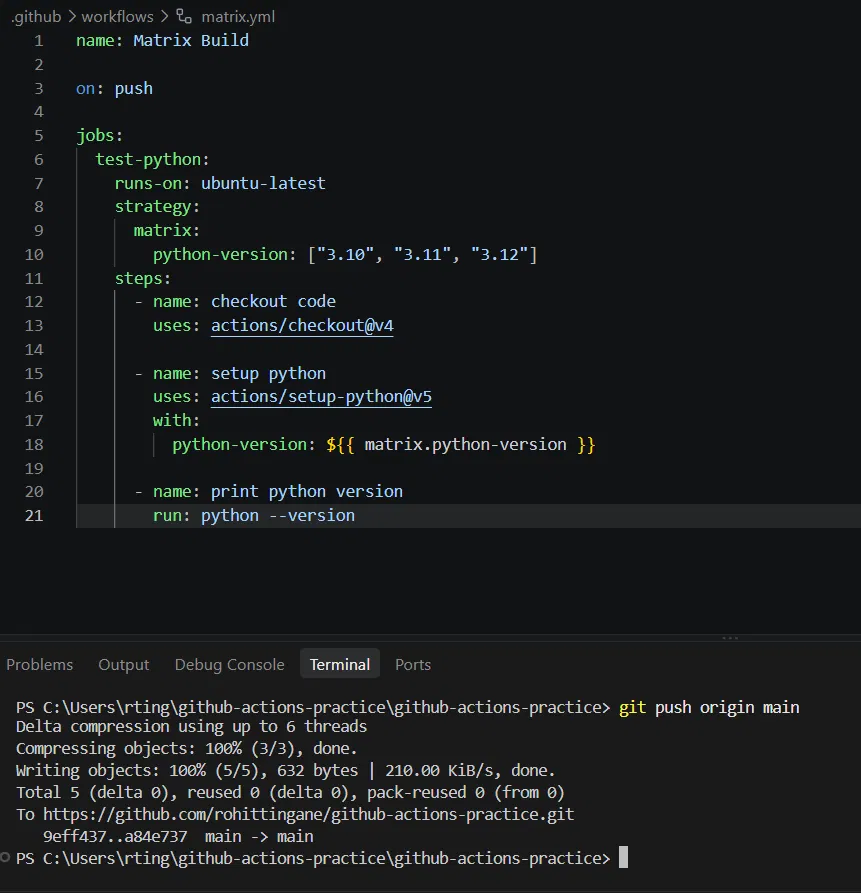

---

## Step 4 – Check the result

Go to:

```text
GitHub → Actions → Matrix Build
```

You should see three jobs:

```text
test-python (3.10)
test-python (3.11)
test-python (3.12)
```

### Screenshot – Python Matrix Jobs Running in Parallel

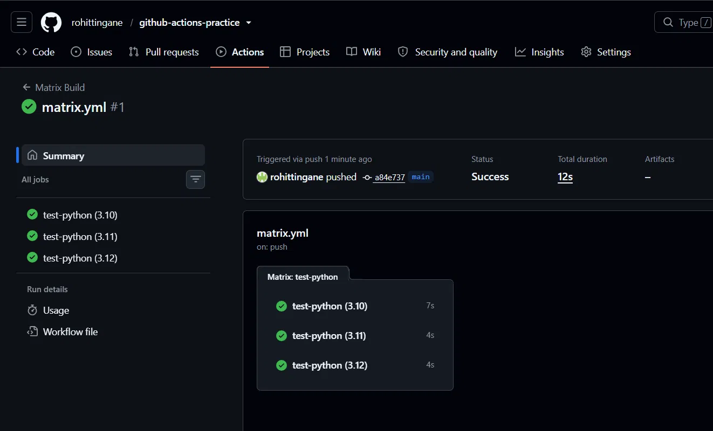

---

# Task 4 – Step 2: Add Operating Systems

Now we will test:

```text
3 Python versions
```

with:

```text
2 Operating Systems
```

The operating systems are:

```text
Ubuntu
Windows
```

---

## Step 1 – Update the matrix

Change the matrix to:

```yaml
strategy:
  matrix:
    python-version: ["3.10", "3.11", "3.12"]
    os: [ubuntu-latest, windows-latest]

runs-on: ${{ matrix.os }}
```

### Screenshot – OS Added to Matrix

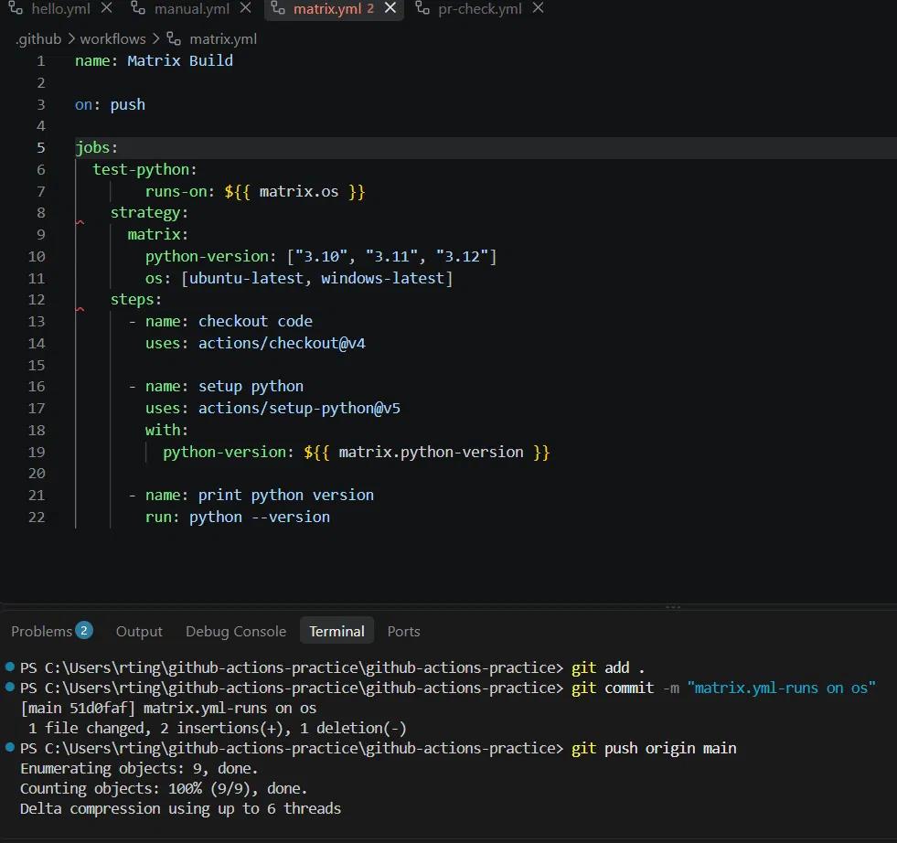

---

## 🧠 How many jobs?

We have:

```text
3 Python versions
×
2 Operating Systems
=
6 jobs
```

The combinations are:

| Python | OS      |
| ------ | ------- |
| 3.10   | Ubuntu  |
| 3.10   | Windows |
| 3.11   | Ubuntu  |
| 3.11   | Windows |
| 3.12   | Ubuntu  |
| 3.12   | Windows |

Total:

```text
6 jobs
```

---

## ⚠️ Error I Faced

Initially I put:

```yaml
jobs:
  test-python:
    runs-on: ${{ matrix.os }}

    strategy:
      matrix:
        ...
```

This caused a workflow error.

The problem was that `runs-on` was trying to use:

```text
matrix.os
```

before the matrix configuration was defined.

---

## ✅ Fix

Define the matrix first:

```yaml
jobs:
  test-python:

    strategy:
      matrix:
        python-version: ["3.10", "3.11", "3.12"]
        os: [ubuntu-latest, windows-latest]

    runs-on: ${{ matrix.os }}
```

### Screenshot – Matrix OS Code Fixed

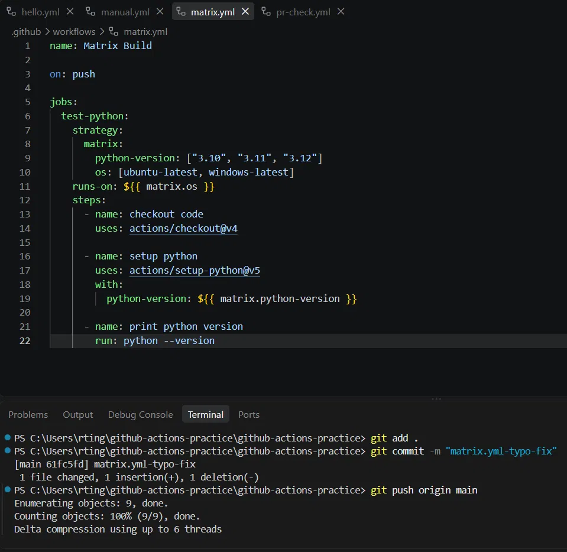

---

## Step 2 – Push the fix

```bash
git add .
git commit -m "matrix.yml runs on os"
git push origin main
```

---

## Step 3 – Check GitHub Actions

Open:

```text
GitHub → Actions → Matrix Build
```

You should now see:

```text
6 jobs
```

### Screenshot – All 6 Matrix Jobs

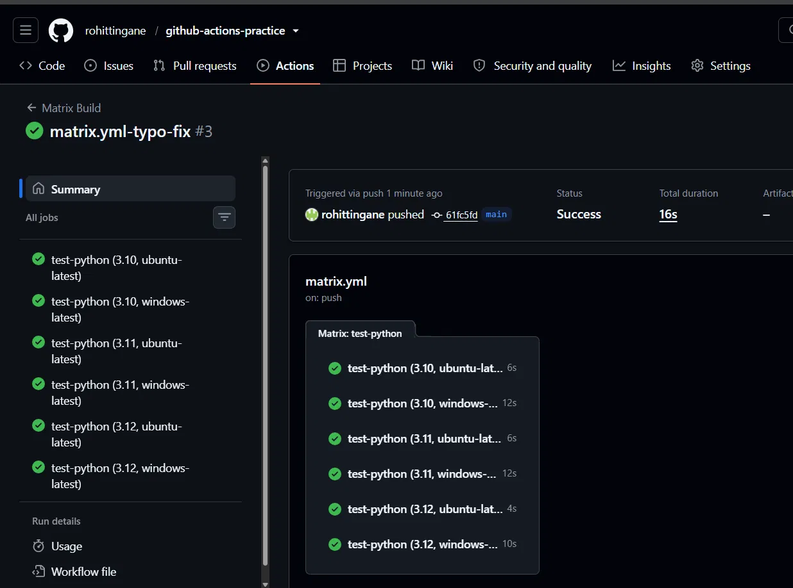

---

## ✅ Task 4 Complete

The matrix now tests:

```text
3 Python versions
×
2 Operating Systems
=
6 jobs
```

GitHub Actions creates the combinations automatically.

---

# Task 5 – Exclude & Fail-Fast

## 🎯 Goal

In this task we will learn:

1. How to remove one specific matrix combination using `exclude`
2. How `fail-fast` affects matrix jobs

---

# Step 1 – Add `exclude`

Use:

```yaml
strategy:
  fail-fast: false

  matrix:
    python-version: ["3.10", "3.11", "3.12"]
    os: [ubuntu-latest, windows-latest]

    exclude:
      - os: windows-latest
        python-version: "3.10"
```

### Screenshot – Exclude and Fail-Fast Code

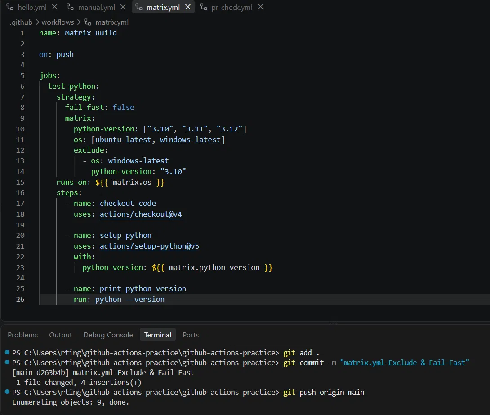

---

## 🧠 What does `exclude` do?

Originally:

```text
3 Python versions × 2 OS = 6 jobs
```

We remove:

```text
Windows + Python 3.10
```

Therefore:

```text
6 - 1 = 5 jobs
```

---

## Expected combinations

```text
Python 3.10 → Ubuntu
Python 3.11 → Ubuntu
Python 3.12 → Ubuntu

Python 3.11 → Windows
Python 3.12 → Windows
```

Total:

```text
5 jobs
```

---

## Step 2 – Verify the excluded matrix

Push the changes:

```bash
git add .
git commit -m "matrix.yml-Exclude & Fail-Fast"
git push origin main
```

GitHub should now create only 5 jobs.

### Screenshot – 5 Jobs Passed

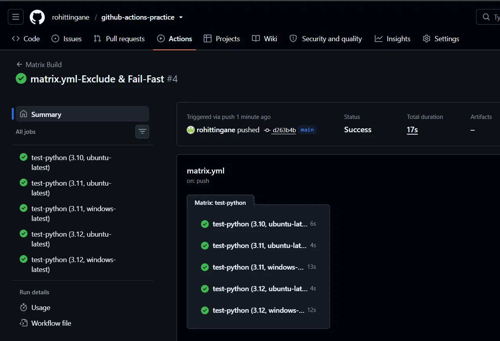

---

# What is `fail-fast`?

By default:

```yaml
fail-fast: true
```

If one matrix job fails, GitHub can cancel other matrix jobs that are still running.

When we use:

```yaml
fail-fast: false
```

other matrix jobs continue running even if one job fails.

---

## `fail-fast: true`

Example:

```text
Job A → ❌ Failed
Job B → Cancelled
Job C → Cancelled
Job D → Cancelled
```

GitHub stops the remaining work.

---

## `fail-fast: false`

Example:

```text
Job A → ❌ Failed
Job B → ✅ Passed
Job C → ✅ Passed
Job D → ❌ Failed
```

All jobs are allowed to finish.

---

# Step 3 – Test an intentional failure

To test the behavior, temporarily use:

```yaml
- name: print python version
  run: |
    if [ "${{ matrix.python-version }}" = "3.10" ]; then
      exit 1
    fi
    python --version
```

This intentionally fails the job when Python version is `3.10`.

### Screenshot – Fail-Fast Test Code

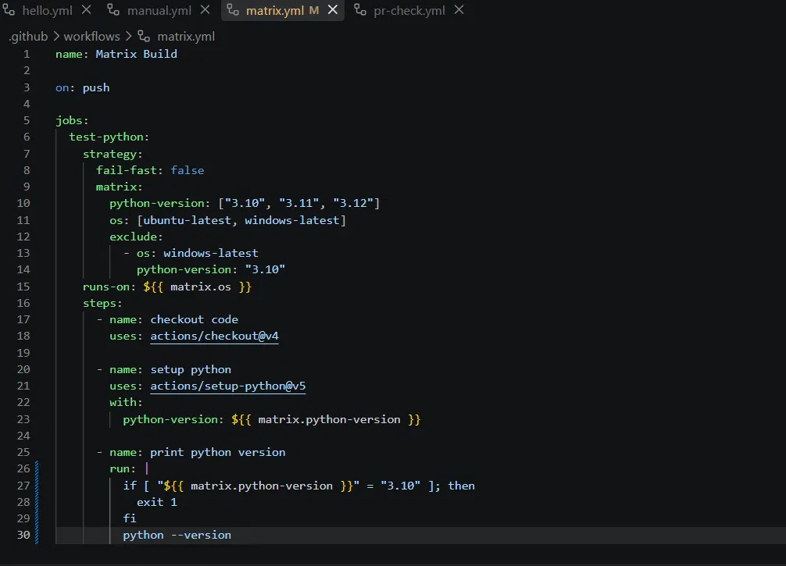

---

## ⚠️ Important Error I Discovered

I expected only the Python 3.10 job to fail.

However, Windows jobs also failed.

The reason was that this:

```bash
if [ "${{ matrix.python-version }}" = "3.10" ]; then
```

is **Bash syntax**.

Ubuntu runners use Bash by default.

Windows runners use PowerShell by default.

Therefore, Bash syntax is not automatically valid on Windows.

---

## 🧠 What I Learned

A script written for Linux/Bash may not work directly on Windows.

```text
Ubuntu
  ↓
Bash
```

while:

```text
Windows
  ↓
PowerShell
```

When creating cross-platform matrix workflows, the shell being used matters.

---

## Step 4 – Check the final result

Even though the Windows failures were unexpected, the test still demonstrated the important behavior of:

```yaml
fail-fast: false
```

The other matrix jobs were allowed to continue running.

### Screenshot – Mixed Matrix Results

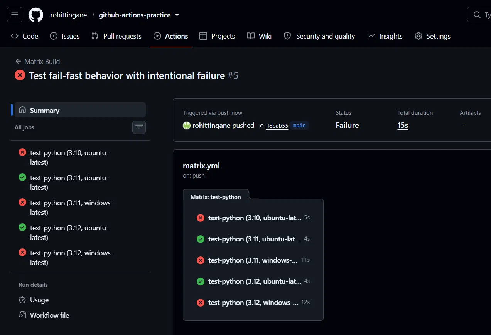

---

## Step 5 – Commit the test

```bash
git add .
git commit -m "Test fail-fast behavior with intentional failure"
git push origin main
```

---

# 📊 `fail-fast: true` vs `false`

| Setting | Behavior                                                  |
| ------- | --------------------------------------------------------- |
| `true`  | Other running matrix jobs can be cancelled when one fails |
| `false` | Other matrix jobs continue running                        |

### `true` is useful when:

You want to stop quickly and save time and compute.

### `false` is useful when:

You want to see the result of every environment.

For example:

```text
Ubuntu → PASS
Windows → FAIL
```

This gives more complete information.

---

# 📊 Day 41 Complete Flow

```text
                         GitHub Actions
                               │
              ┌────────────────┼────────────────┐
              │                │                │
           Triggers       Matrix Builds       Failure
              │                │                │
      ┌───────┼───────┐        │            fail-fast
      │       │       │        │
     PR     Cron   Manual      │
      │       │       │        │
      └───────┴───────┘   Python + OS
                               │
                         ┌─────┴─────┐
                         │           │
                      Include     Exclude
```

---

# 📁 Final Workflow Files

The workflow directory contains:

```text
github-actions-practice/
│
├── .github/
│   └── workflows/
│       ├── hello.yml
│       ├── pr-check.yml
│       ├── manual.yml
│       └── matrix.yml
│
└── ...
```

---

# 🔄 What Happens in Each Workflow?

## Pull Request Workflow

```text
Developer
    ↓
Create Pull Request
    ↓
GitHub detects pull_request
    ↓
PR Check starts
    ↓
Ubuntu runner
    ↓
Checkout code
    ↓
Run checks
    ↓
Success
```

---

## Scheduled Workflow

```text
GitHub waits for scheduled time
          ↓
Cron time matches
          ↓
Workflow starts automatically
          ↓
Job runs
```

---

## Manual Workflow

```text
User opens Actions
        ↓
Clicks Run workflow
        ↓
Selects environment
        ↓
Workflow starts
        ↓
Environment is printed
```

---

## Matrix Workflow

```text
             Matrix
                │
        ┌───────┴────────┐
        │                │
     Python             OS
  3.10/3.11/3.12   Ubuntu/Windows
        │                │
        └───────┬────────┘
                ↓
       All combinations
                ↓
         Parallel jobs
```

---

# 📝 Commands Used

### Go to repository

```bash
cd github-actions-practice
```

### Create workflow directory

```bash
mkdir -p .github/workflows
```

### Create branch

```bash
git checkout -b add-pr-check
```

### Check changes

```bash
git status
```

### Add files

```bash
git add .
```

### Commit

```bash
git commit -m "Add PR check workflow"
```

### Push branch

```bash
git push origin add-pr-check
```

### Push to main

```bash
git push origin main
```

---

# ❌ Errors I Faced

## Error 1 – Empty `push:`

### Problem

```yaml
push:
```

### Fix

```yaml
push: {}
```

---

## Error 2 – Incorrect `run`

### Problem

```yaml
run: {}
echo "..."
```

### Fix

```yaml
run: echo "..."
```

---

## Error 3 – File not saved

### Error

```text
nothing to commit, working tree clean
```

### Fix

Save the file:

```text
Ctrl + S
```

Then run Git commands again.

---

## Error 4 – Matrix ordering

### Problem

```yaml
runs-on: ${{ matrix.os }}

strategy:
  matrix:
```

### Fix

Define the matrix first:

```yaml
strategy:
  matrix:
    ...

runs-on: ${{ matrix.os }}
```

---

## Error 5 – Bash syntax on Windows

### Problem

Bash syntax was used on Windows.

### Reason

Ubuntu normally uses Bash, while Windows normally uses PowerShell.

### Lesson

Cross-platform workflows may need different shell syntax.

---

# 🧠 Key Takeaways

## 1. Triggers decide WHEN a workflow runs

```text
push
pull_request
schedule
workflow_dispatch
```

Each trigger has a different purpose.

---

## 2. Pull Request Trigger

```yaml
on:
  pull_request:
    branches: [main]
```

Runs when a Pull Request targets `main`.

---

## 3. Schedule Trigger

```yaml
schedule:
  - cron: '0 0 * * *'
```

Runs automatically according to the cron schedule.

Remember:

```text
GitHub Actions cron = UTC
```

---

## 4. Manual Trigger

```yaml
workflow_dispatch:
```

Adds the:

```text
Run workflow
```

button.

---

## 5. Matrix Builds

Matrix builds allow the same job to run against multiple configurations.

Example:

```text
3 Python versions
×
2 Operating Systems
=
6 jobs
```

---

## 6. Exclude

`exclude` removes specific combinations from a matrix.

Example:

```yaml
exclude:
  - os: windows-latest
    python-version: "3.10"
```

---

## 7. Fail-Fast

```yaml
fail-fast: false
```

allows the remaining matrix jobs to continue even if another job fails.

---

## 8. YAML Formatting Matters

Small mistakes in:

* indentation
* `{}`
* syntax
* structure

can break a GitHub Actions workflow.

Always check the error message and line number.

---

## 9. Shells Are Different

Linux runners normally use Bash.

Windows runners normally use PowerShell.

Therefore, Bash commands may not work directly on Windows.

---

# 🎯 Day 41 Final Summary

Today I learned how to control **when GitHub Actions workflows run** using:

```text
Pull Request
Schedule
Manual Trigger
```

I also learned how to test the same workflow against multiple environments using:

```text
Matrix Builds
```

Then I learned how:

```text
exclude
fail-fast
```

control matrix behavior.

The hands-on errors also helped me understand that GitHub Actions is not only about writing YAML.

It also requires understanding:

```text
Git
+
GitHub
+
YAML
+
Triggers
+
Runners
+
Shells
+
Matrix Builds
```

---

# ✅ Day 41 Completed

```text
☑ Pull Request Trigger
☑ Scheduled Trigger
☑ Manual Trigger
☑ Matrix – Python Versions
☑ Matrix – Operating Systems
☑ Exclude
☑ Fail-Fast
☑ Debugged YAML Errors
☑ Tested GitHub Actions Workflows
☑ Verified Results with Screenshots
```

---

