# Day 42 – GitHub Actions Runners

---

# Task 1 – GitHub-Hosted Runners

The first task was to understand how GitHub-hosted runners work by running jobs on Ubuntu, Windows, and macOS environments.

### Workflow Configuration

The workflow was configured with three independent jobs using:

```yaml
runs-on: ubuntu-latest
runs-on: windows-latest
runs-on: macos-latest
```

### Screenshot – Hosted Runners Workflow

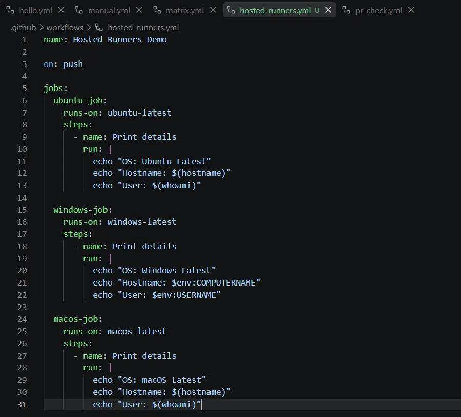

This screenshot shows the workflow containing the three GitHub-hosted runner jobs.

### Screenshot – Workflow Queued

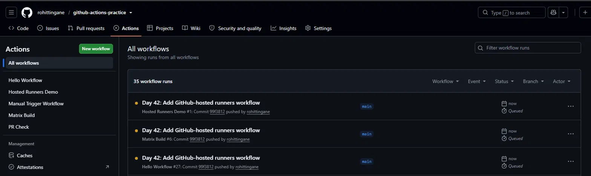

This shows the workflow after it was triggered and the jobs were waiting for their respective runners.

### Screenshot – Ubuntu Job Logs

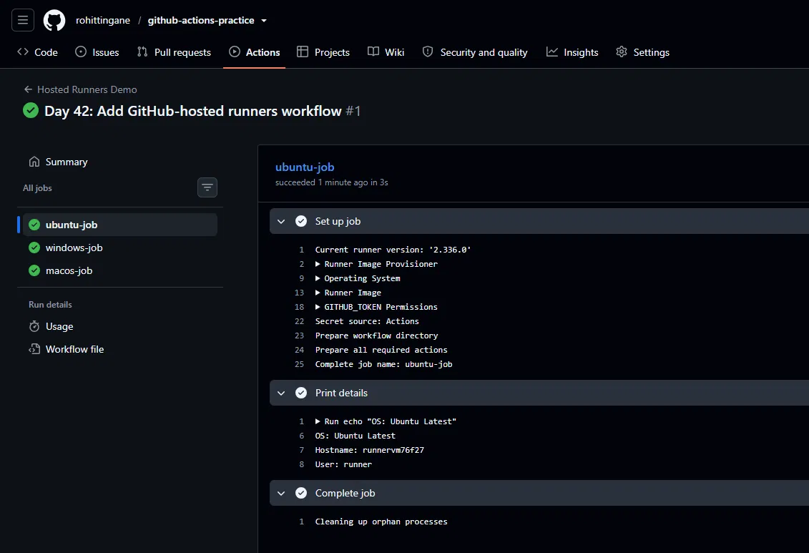

The Ubuntu job successfully executed commands such as `hostname` and `whoami`.

This confirmed that the commands were executed on the GitHub-hosted Ubuntu runner.

### Screenshot – All Jobs Successful

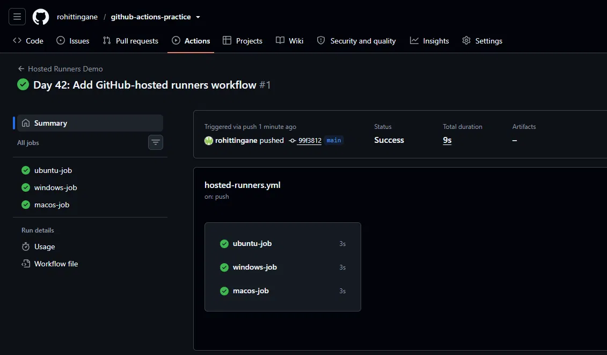

All three jobs completed successfully.

This demonstrated that GitHub Actions can execute independent jobs on different operating-system runners.

---

# Task 2 – Explore Pre-Installed Software

The second task was to check commonly available software on the GitHub-hosted runner.

The workflow checked tools such as:

```bash
docker --version
python3 --version
node --version
git --version
```

### Workflow Code

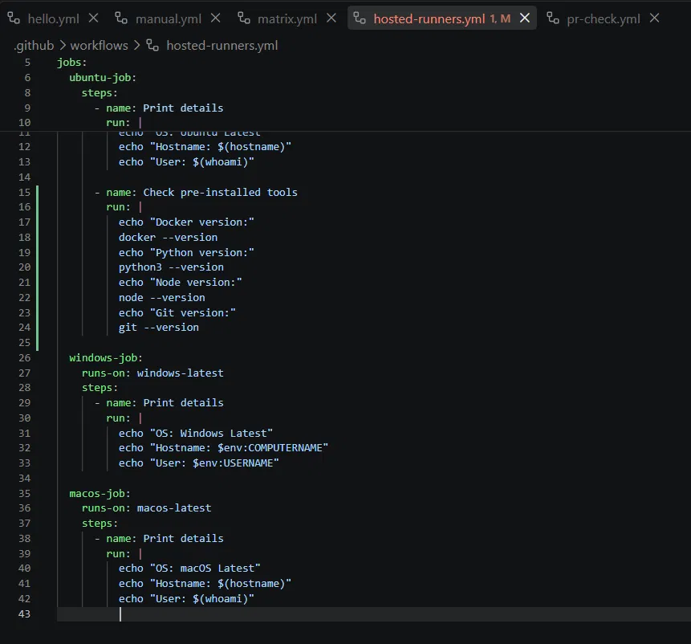

The screenshot shows the workflow commands used to check the installed tools.

### Screenshot – Push Success

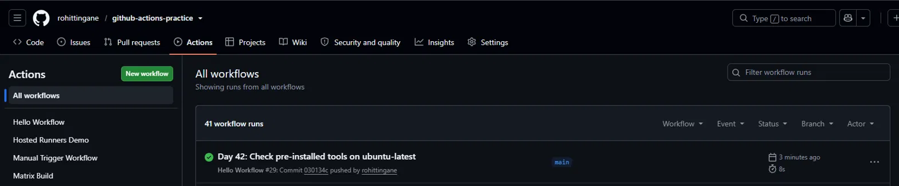

The workflow changes were committed and pushed successfully to GitHub.

### Screenshot – Pre-Installed Tools Output

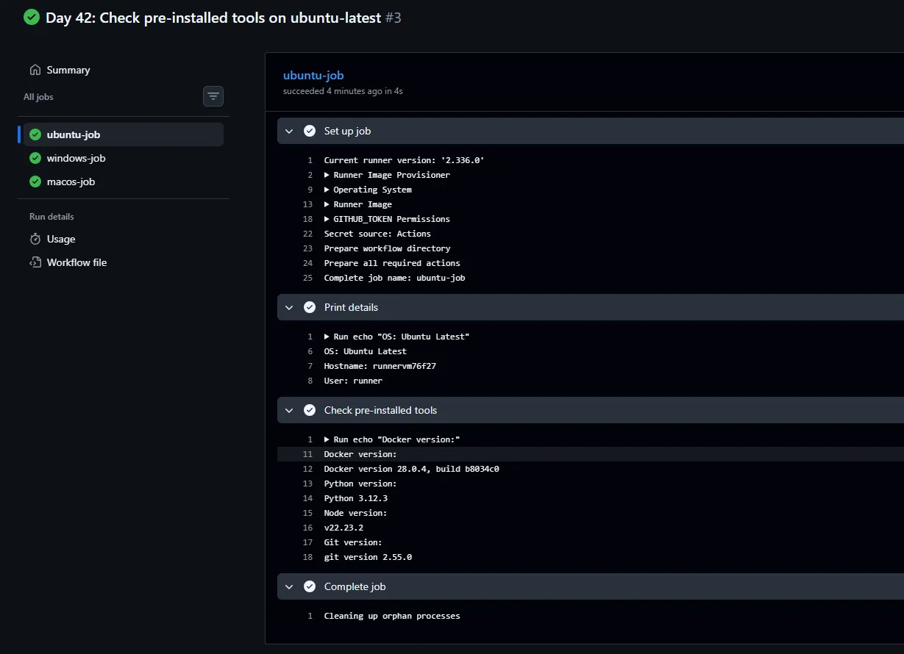

The runner successfully returned the installed versions of the requested tools.

This demonstrated that GitHub-hosted runner images already contain many commonly required development tools.

---

# Task 3 – Set Up a Self-Hosted Runner

The third task was to configure a Linux EC2 server as a self-hosted GitHub Actions runner.

The runner was registered from:

```text
Repository
→ Settings
→ Actions
→ Runners
→ New self-hosted runner
```

The Linux runner was configured on the EC2 server using the commands provided by GitHub.

### Screenshot – Runner Registration

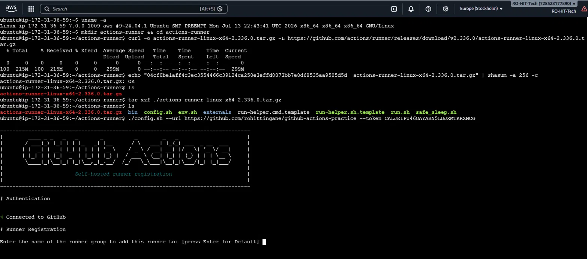

This screenshot shows the beginning of the self-hosted runner registration process on the Linux server.

The runner was connected to the GitHub repository using the registration instructions generated by GitHub.

### Screenshot – Runner Idle Status

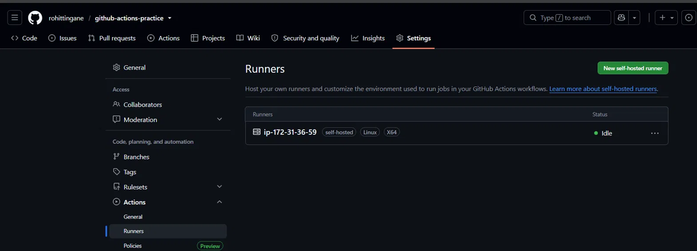

The runner appeared as **Idle** in GitHub Actions.

`Idle` means that the runner is online and ready to accept a job but is not currently executing one.

This confirmed that the EC2 server was successfully registered as a self-hosted runner.

### Self-Hosted Runner Overview

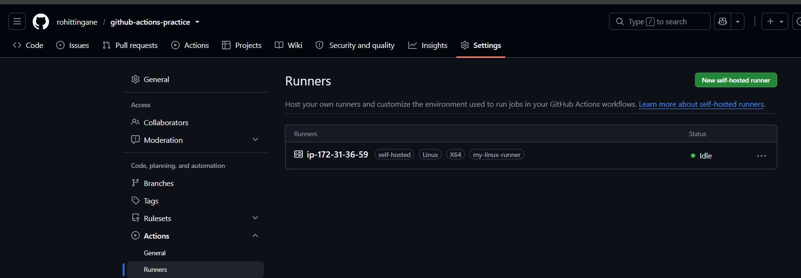

This screenshot provides an overall view of the configured self-hosted runner.

The architecture is:

```text
GitHub Repository
       |
       v
GitHub Actions
       |
       v
Self-Hosted Runner
       |
       v
Linux EC2 Server
```

---

# Task 4 – Run a Job on the Self-Hosted Runner

After successfully registering the runner, the next step was to execute a GitHub Actions job on the EC2 machine.

The workflow used:

```yaml
runs-on: self-hosted
```

This tells GitHub Actions to select an available self-hosted runner.

### Self-Hosted Workflow Code

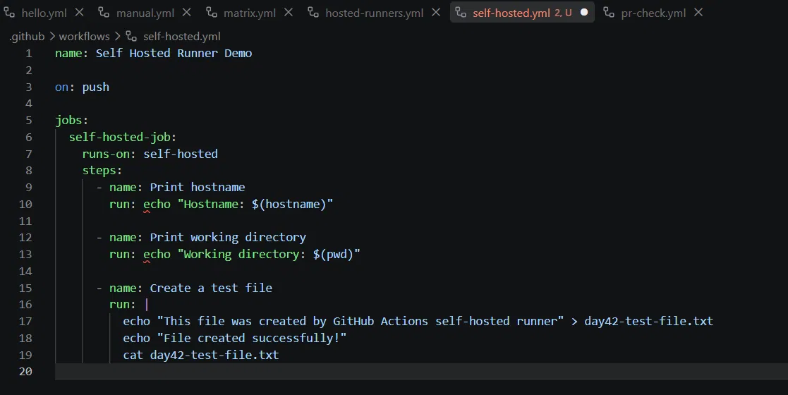

The workflow included commands such as:

```bash
hostname
pwd
```

and created a test file:

```bash
echo "This file was created by GitHub Actions self-hosted runner" > day42-test-file.txt
```

### Self-Hosted Job Logs

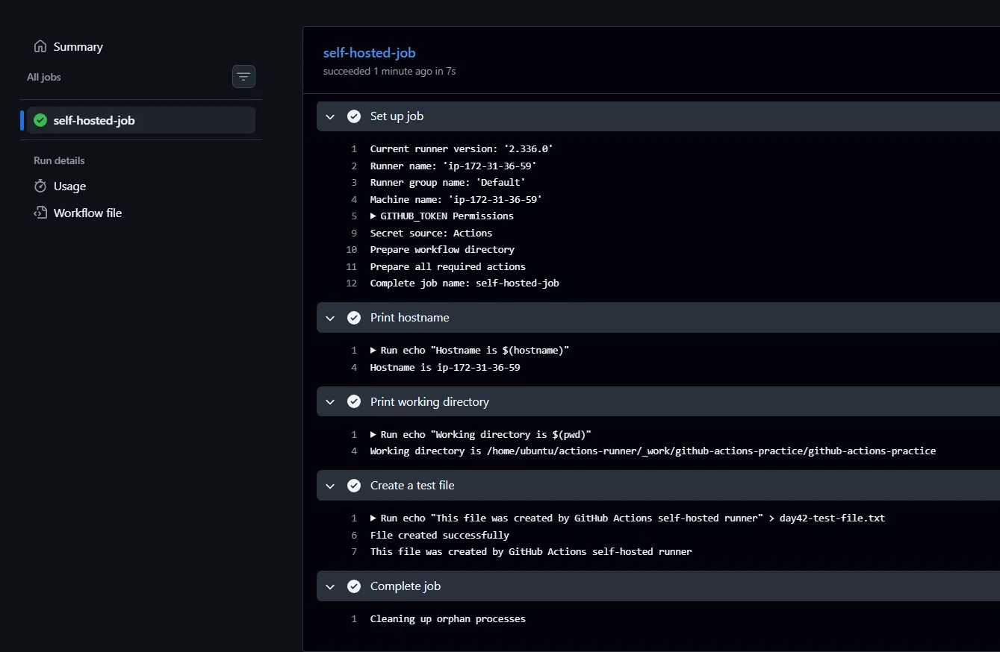

The logs show that the commands were executed successfully on the self-hosted runner.

The hostname output helped verify that the job was running on the configured EC2 machine.

### Workflow Success

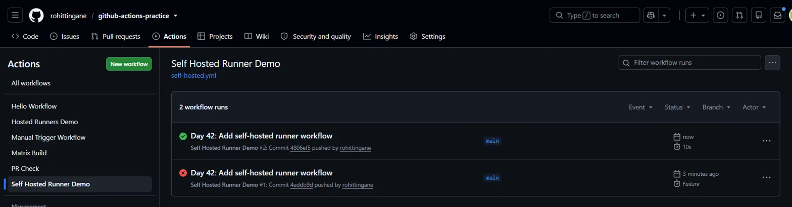

The workflow completed successfully.

This confirmed that GitHub Actions was able to send the job to my own EC2 server and execute the workflow commands there.

---

# Task 5 – Use Runner Labels

The fifth task was to add a custom label to the self-hosted runner.

The custom label used was:

```text
my-linux-runner
```

The workflow was then configured as:

```yaml
runs-on: [self-hosted, my-linux-runner]
```

This means GitHub must find a runner containing both:

```text
self-hosted
```

and:

```text
my-linux-runner
```

### Screenshot – Runner Registered With Label

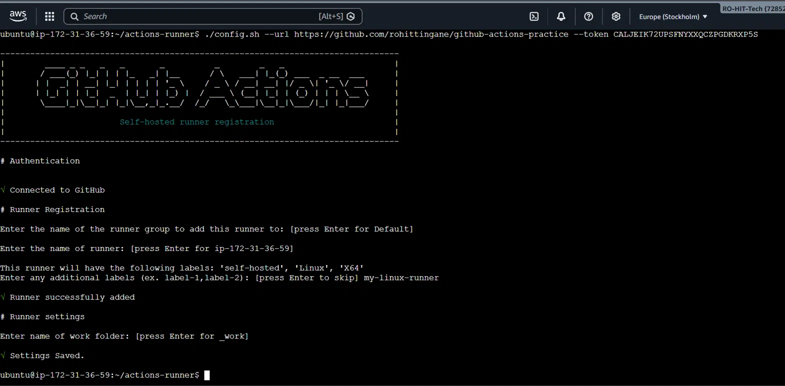

The screenshot shows the self-hosted runner with the custom label registered in GitHub.

### Screenshot – Labeled Runner Job Success

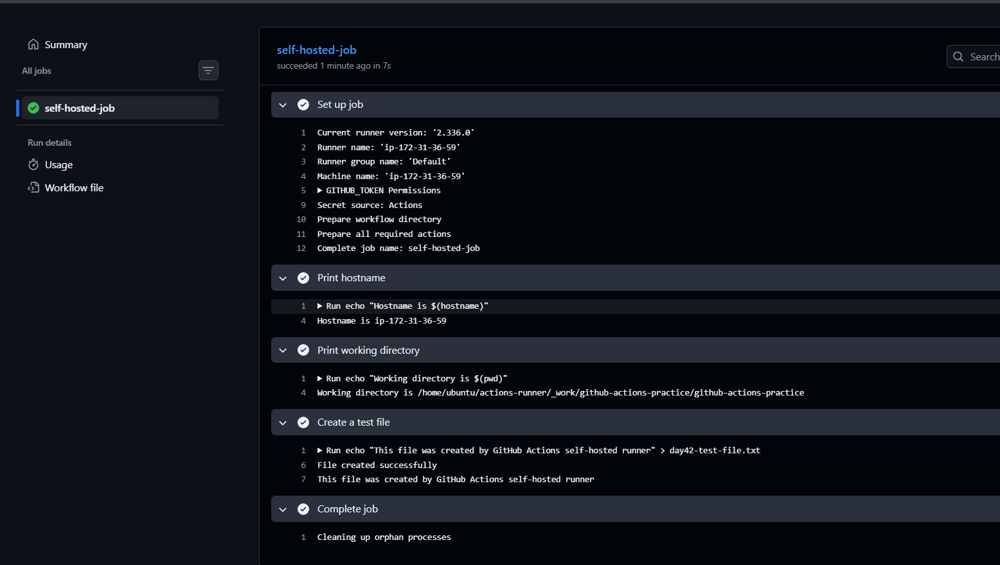

The workflow successfully executed using the labeled runner.

This confirmed that runner labels can be used to target a specific type of self-hosted runner.

---

# Task 6 – GitHub-Hosted vs Self-Hosted

Task 6 focused on comparing GitHub-hosted and self-hosted runners.

No additional screenshot was required because the comparison was documented using the table and explanation above.

The key difference is:

```text
GitHub-Hosted Runner
        |
        v
GitHub manages the machine
```

while:

```text
Self-Hosted Runner
        |
        v
We manage the machine
```

---

# Complete Day 42 Practical Flow

The complete practical flow followed during Day 42 was:

```text
Task 1
GitHub-Hosted Runners
        |
        v
Task 2
Pre-Installed Tools
        |
        v
Task 3
Configure EC2 as Self-Hosted Runner
        |
        v
Task 4
Run GitHub Actions Job on EC2
        |
        v
Task 5
Use Custom Runner Label
        |
        v
Task 6
Compare Hosted vs Self-Hosted
```

This progression helped me understand not only how to write a workflow, but also **where the workflow actually executes and how GitHub selects the machine responsible for running the job.**
