# Day 43 – Jobs, Steps, Env Vars & Conditionals

This document explains everything I learned and built today about controlling
the flow of a GitHub Actions pipeline: multi-job workflows, passing data
between jobs, environment variables, and conditional execution.

---

## Task 1: Multi-Job Workflow

### File: `.github/workflows/multi-job.yml`

```yaml
name: Multi Jobs Workflow

on: push

jobs:
  build:
    runs-on: ubuntu-latest
    steps:
      - name: Build setup
        run: echo "Building the app"

  test:
    needs: build
    runs-on: ubuntu-latest
    steps:
      - name: Test app
        run: echo "Running tests"

  deploy:
    needs: test
    runs-on: ubuntu-latest
    steps:
      - name: Deploy app
        run: echo "Deploying"
```

### What this code does

This workflow defines three separate jobs — `build`, `test`, and `deploy` —
each of which runs on a fresh `ubuntu-latest` virtual machine and prints a
message using the `run:` command.

### Why it is written this way

By default, GitHub Actions runs all jobs in a workflow **in parallel**,
because it has no idea that one job depends on another unless I explicitly
tell it. In a real pipeline, that default behavior is dangerous: if `deploy`
ran before `build` finished, or before `test` verified the code, broken code
could go live. So I needed a way to force jobs to run one after another, in
a specific order, and only if the previous one succeeded.

### How it works (the logic)

The `needs:` keyword is what creates this dependency chain:

- `test` has `needs: build`, which tells GitHub Actions: "Do not start this
  job until the `build` job has finished, and only start it if `build`
  succeeded."
- `deploy` has `needs: test`, applying the same rule one level down.

If `build` fails, GitHub Actions automatically skips `test` and `deploy` —
I don't have to write any extra logic for that; it's built into how `needs:`
behaves.

### Verification

I checked the Actions tab and the workflow graph showed a clear linear
chain: `build → test → deploy`, with each job only starting after the
previous one turned green.

**YAML file (after fixing indentation errors):**
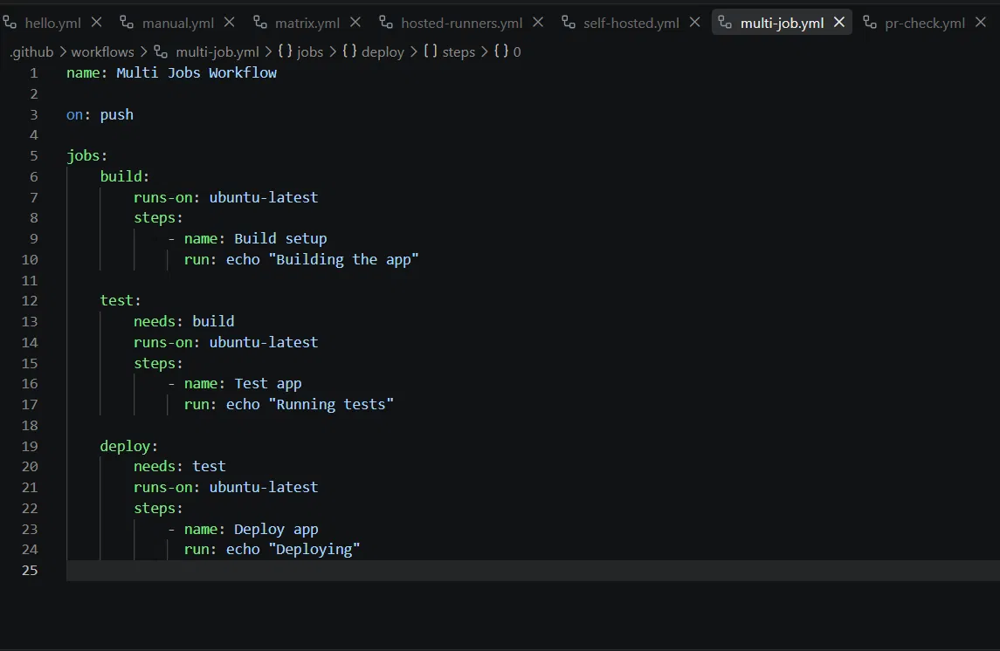

**Workflow run history (showing earlier failures and the final success):**
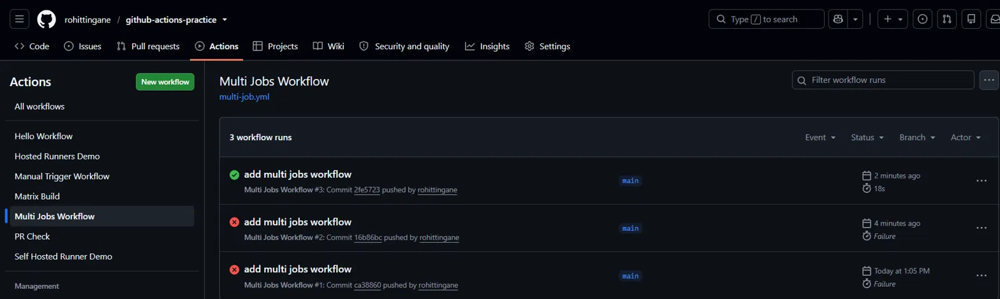

**Dependency graph (build → test → deploy):**
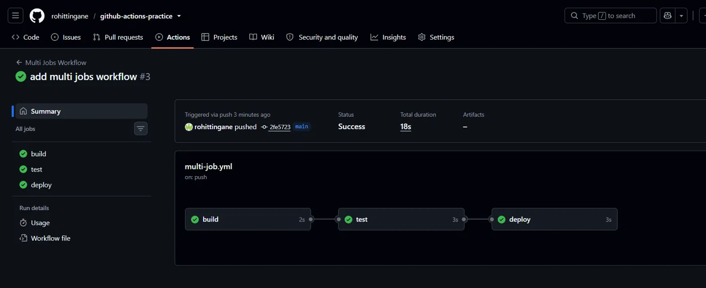

---

## Task 2: Environment Variables

### File: `.github/workflows/env-vars.yml`

```yaml
name: Env Vars Workflow

on: push

env:
  APP_NAME: myapp

jobs:
  show-env:
    runs-on: ubuntu-latest
    env:
      ENVIRONMENT: staging
    steps:
      - name: Print all env vars
        env:
          VERSION: 1.0.0
        run: |
          echo "App Name: $APP_NAME"
          echo "Environment: $ENVIRONMENT"
          echo "Version: $VERSION"

      - name: Print GitHub context info
        run: |
          echo "Commit SHA: ${{ github.sha }}"
          echo "Triggered by: ${{ github.actor }}"
```

### What this code does

This workflow defines an environment variable at three different scopes and
then prints all three values in a single step. It also prints two values
that GitHub provides automatically: the commit SHA and the actor (the user
who triggered the run).

### Why it is written this way

Not every value needs to be available everywhere. Some values, like an
application name, make sense for the entire workflow. Some values, like an
environment name (staging/production), only make sense for a specific job.
And some values, like a version number used in a single command, only need
to exist for one step. Defining `env:` at three different levels lets me
control exactly how far a variable's visibility extends, which keeps the
workflow organized and avoids unnecessary repetition.

### How it works (the logic)

- **Workflow level**: `env: APP_NAME: myapp` is placed at the very top of
  the file, outside of `jobs:`. This makes `APP_NAME` available in every
  job and every step in the whole file.
- **Job level**: `env: ENVIRONMENT: staging` is placed inside the
  `show-env` job, but outside any specific step. This makes `ENVIRONMENT`
  available only to steps within that one job.
- **Step level**: `env: VERSION: 1.0.0` is placed inside a single step.
  This makes `VERSION` available only inside that one step's `run:` block.
- To actually use these values inside a shell command, I reference them
  with a dollar sign: `$APP_NAME`, `$ENVIRONMENT`, `$VERSION`. This is
  standard bash syntax for reading an environment variable.
- GitHub context variables are different — they are not something I define
  myself. GitHub provides them automatically, and I access them using the
  `${{ github.xyz }}` expression syntax, not the dollar-sign syntax.
  `github.sha` gives the commit hash that triggered the run, and
  `github.actor` gives the username of whoever pushed the code.

### Verification

The logs showed exactly what I expected:
```
App Name: myapp
Environment: staging
Version: 1.0.0
Commit SHA: 2684bb26d68710eda1b89f17151a657adc58c342
Triggered by: rohittingane
```

**YAML file:**
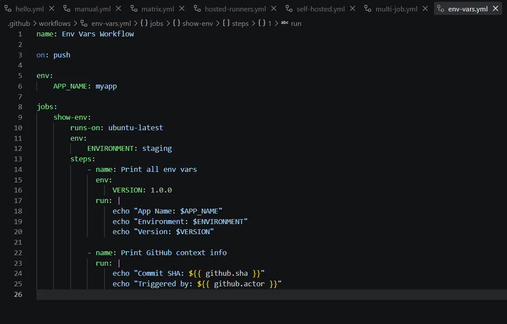

**Workflow run (success):**
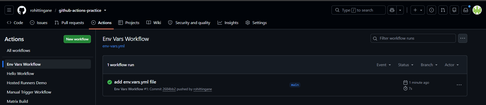

**Job summary:**
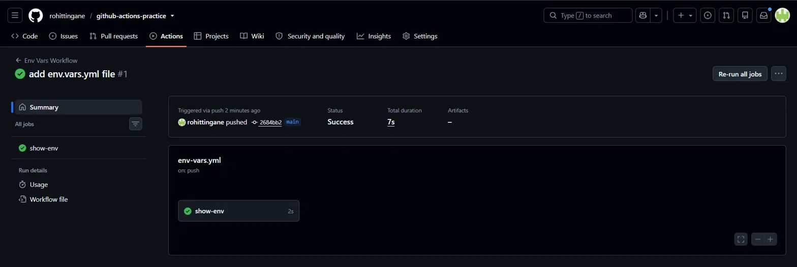

**Logs showing all three env var levels plus GitHub context values:**
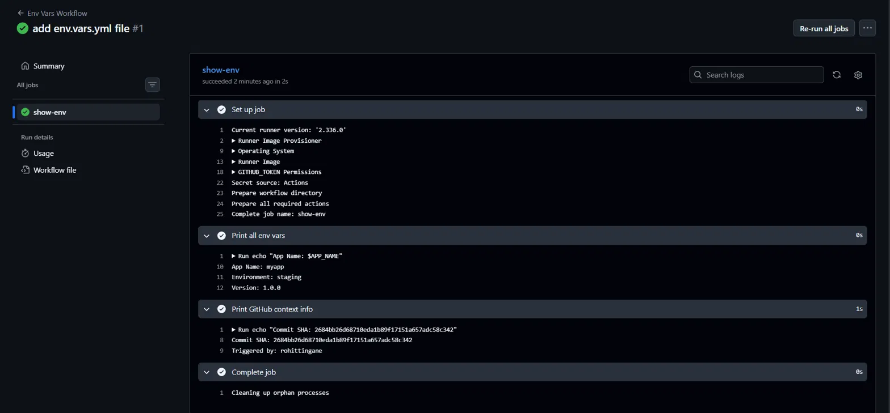

---

## Task 3: Job Outputs

### File: `.github/workflows/job-outputs.yml`

```yaml
name: Job Outputs Workflow

on: push

jobs:
  set-date:
    runs-on: ubuntu-latest
    outputs:
      today: ${{ steps.get-date.outputs.date }}
    steps:
      - name: Get current date
        id: get-date
        run: echo "date=$(date)" >> $GITHUB_OUTPUT

  use-date:
    needs: set-date
    runs-on: ubuntu-latest
    steps:
      - name: Print date from previous job
        run: echo "Date from set-date job - ${{ needs.set-date.outputs.today }}"
```

### What this code does

The `set-date` job generates the current date and exposes it as a job
output called `today`. The `use-date` job then reads that same value and
prints it, even though the two jobs ran on completely separate virtual
machines.

### Why it is written this way

Every job in GitHub Actions runs on its own isolated runner (its own fresh
virtual machine). That means a normal shell variable or even an `env:`
variable set inside `build` will **not** automatically be visible inside
`test`, because they don't share memory or a file system. If I need one
job's result to be used by another job, I need an official mechanism to
pass that data across — that mechanism is `outputs:` combined with
`needs.<job>.outputs.<name>`.

### How it works (the logic)

1. Inside the step, I give it an `id: get-date`. An id is required because
   without it, there is no way to refer back to "this specific step" from
   the job level.
2. `echo "date=$(date)" >> $GITHUB_OUTPUT` is a special GitHub Actions
   pattern. `$(date)` runs the Linux `date` command and captures its
   result. The `echo "date=..."` line writes a `key=value` pair into a
   special file that GitHub Actions uses to record step outputs.
   `$GITHUB_OUTPUT` is an environment variable pointing to that file.
3. At the job level, `outputs: today: ${{ steps.get-date.outputs.date }}`
   pulls that `date` value out of the step (referenced by its id,
   `get-date`) and exposes it as a job-level output named `today`.
4. In the second job, `needs: set-date` creates the dependency (this job
   waits for `set-date` to finish), and also unlocks access to
   `needs.set-date.outputs.today`, which contains whatever value was
   stored in step 3.

### Why would you pass outputs between jobs? (in my own words)

You pass outputs between jobs whenever a later stage of the pipeline
depends on information generated earlier — for example, a version number
generated during build, a build artifact's file name, a computed test
result, or, like in this example, a timestamp. Since jobs are isolated
from each other, `outputs:` is the official, safe way to bridge that gap
without saving data to external files or services.

### Verification

The `use-date` job printed:
```
Date from set-date job - Thu Aug 27 20:11:08 UTC 2026
```
This confirms the value travelled successfully from `set-date` to
`use-date`.

**Final corrected YAML file:**
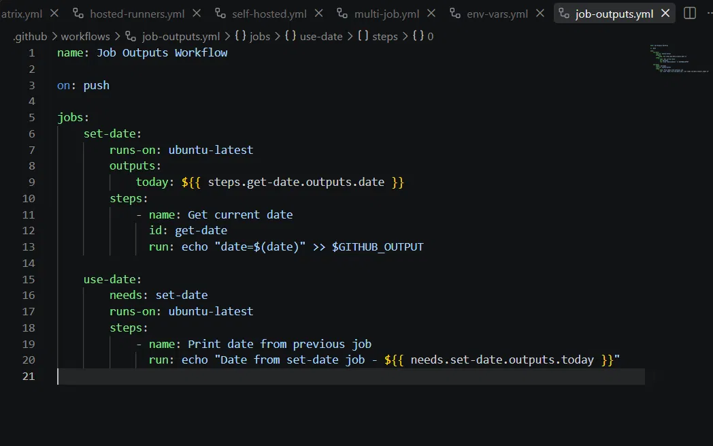

**Workflow run history (earlier failure, then success):**
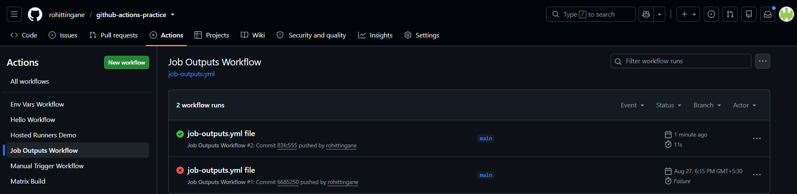

**Dependency graph (set-date → use-date):**
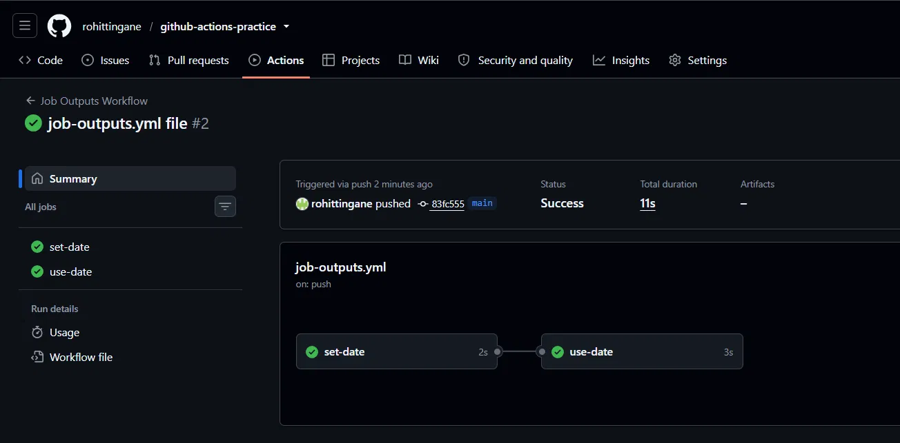

**Final logs showing the passed date value:**
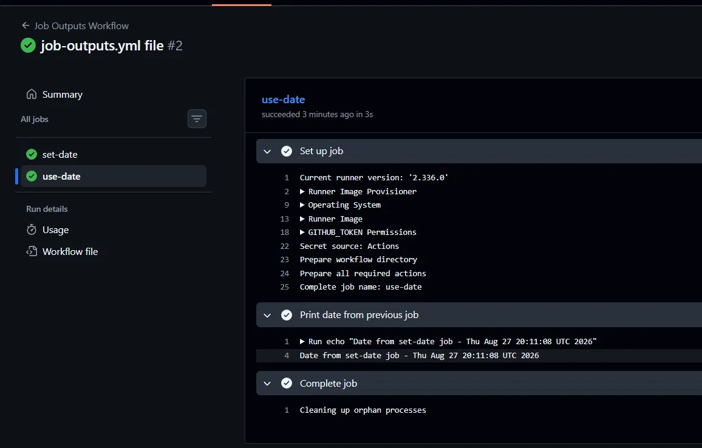

---

## Task 4: Conditionals

### File: `.github/workflows/conditionals.yml`

```yaml
name: Conditionals Workflow

on: [push, pull_request]

jobs:
  demo:
    runs-on: ubuntu-latest
    steps:
      - name: Only on main branch
        if: github.ref == 'refs/heads/main'
        run: echo "Running on main"

      - name: Fails on purpose
        continue-on-error: true
        run: exit 1

      - name: Runs if previous failed
        if: failure()
        run: echo "Previous step failed"

  push-only:
    if: github.event_name == 'push'
    runs-on: ubuntu-latest
    steps:
      - name: Only on push
        run: echo "This runs only on push events"
```

### What this code does

This workflow demonstrates four different ways to control whether a step
or job runs at all, based on conditions rather than always running
unconditionally.

### Why it is written this way

Not every step should run every single time. Some steps only make sense on
a specific branch (like a production deploy step that should never run
from a feature branch). Some steps should only run as a reaction to
something failing (like a notification or rollback step). Some entire jobs
should only run for certain trigger events (like skipping a deploy job on
pull requests, since PRs haven't been merged yet). Conditionals let the
pipeline behave intelligently instead of blindly running everything every
time.

### How it works (the logic)

- **Branch-based step condition**:
  `if: github.ref == 'refs/heads/main'` checks the full ref path of the
  branch that triggered the workflow. If it is not exactly `main`, the
  step is skipped rather than failed — it simply does not run.
- **Failure-based step condition**:
  `if: failure()` is a built-in function that checks whether any earlier
  step in the same job has already failed. If nothing failed yet, this
  step is skipped.
- **Event-based job condition**:
  `if: github.event_name == 'push'` is placed directly under the job name,
  which means the condition applies to the entire job, not just one step.
  If the workflow was triggered by a `pull_request` event instead of
  `push`, this whole job — including its setup — is skipped.
- **continue-on-error**:
  `continue-on-error: true` on the "Fails on purpose" step means that even
  though the command `exit 1` genuinely fails (exit code 1, which normally
  signals failure), GitHub Actions will not mark the overall job as
  failed, and will continue running the remaining steps instead of
  stopping the pipeline.

### An important discovery / gotcha

When I ran this workflow, the "Runs if previous failed" step was
**skipped**, even though the previous step technically failed (`exit 1`).
This happened because `continue-on-error: true` tells GitHub Actions to
treat that step as **successful for pipeline purposes**, even though the
command itself returned a failure exit code. Since `failure()` only
triggers when a step is officially marked as failed, and `continue-on-error`
prevents that official failure marking, the two features effectively
cancel each other out when used on the same step. This is a real-world
gotcha: `continue-on-error` and `failure()` don't combine the way you might
expect on the very same step.

### What `continue-on-error: true` does, in my own words

It tells GitHub Actions "if this particular step fails, don't stop the
whole pipeline and don't mark the job as failed — just note the failure
and keep going." It's useful for optional or non-critical steps, like an
experimental test suite, where you don't want one flaky check to block an
entire deployment.

**YAML file:**
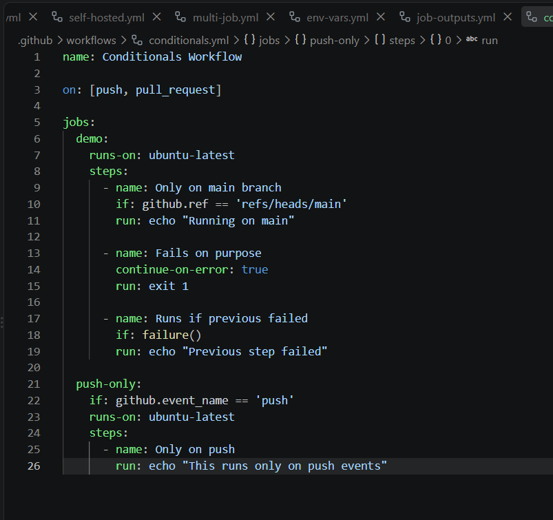

**Job succeeding overall despite an internal failed step (continue-on-error in action):**
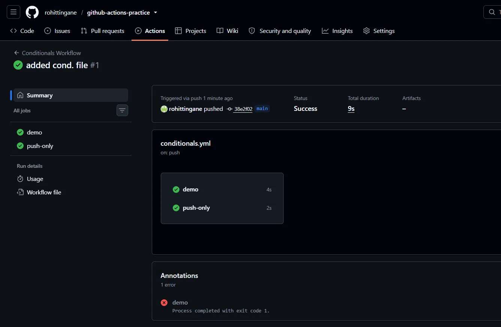

**Detailed step logs (showing the skipped `failure()` step):**
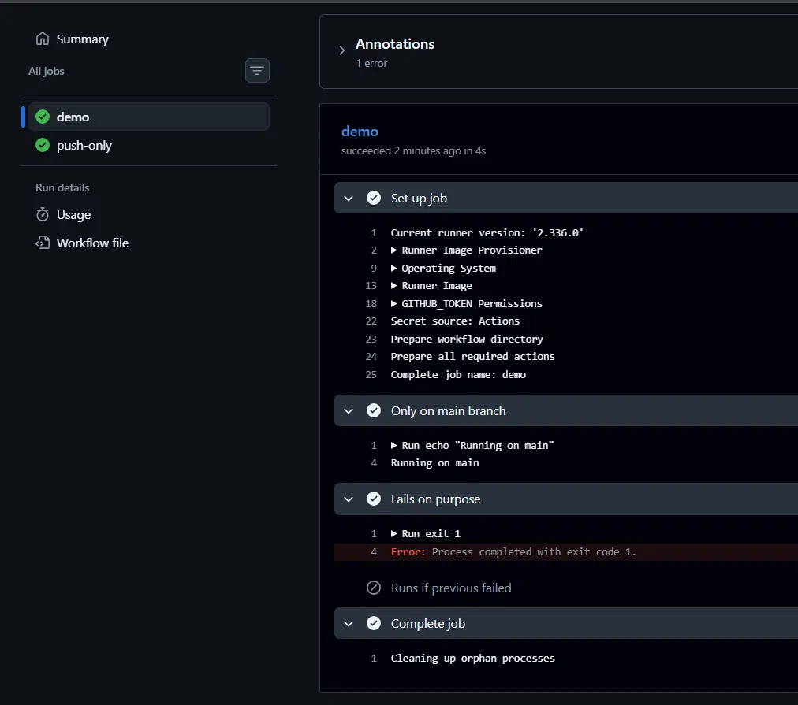

---

## Task 5: Putting It Together — Smart Pipeline

### File: `.github/workflows/smart-pipeline.yml`

```yaml
name: Smart Pipeline

on: push

jobs:
  lint:
    runs-on: ubuntu-latest
    steps:
      - run: echo "Linting code"

  test:
    runs-on: ubuntu-latest
    steps:
      - run: echo "Running tests"

  summary:
    needs: [lint, test]
    runs-on: ubuntu-latest
    steps:
      - if: github.ref == 'refs/heads/main'
        run: echo "Main branch push"

      - if: github.ref != 'refs/heads/main'
        run: echo "Feature branch push"

      - run: echo "Commit - ${{ github.event.commits[0].message }}"
```

### What this code does

This workflow runs `lint` and `test` at the same time (in parallel), and
only after both of them finish, it runs a `summary` job that reports
whether the push happened on the `main` branch or a feature branch, and
prints the latest commit message.

### Why it is written this way

`lint` and `test` don't depend on each other's output — a lint check and a
test run are independent tasks — so there's no reason to force them to run
one after another. Running them in parallel saves time. The `summary` job,
however, needs to know that both of those checks are done before it
reports anything meaningful, so it does need a dependency.

### How it works (the logic)

- Because `lint` and `test` have no `needs:` key at all, GitHub Actions
  runs them simultaneously as soon as the workflow starts.
- `summary` uses `needs: [lint, test]` — note the square-bracket list
  syntax, which is how you specify a dependency on **more than one** job
  at once, rather than just one. This job will not start until both
  `lint` and `test` have completed successfully.
- Inside `summary`, the same `if: github.ref` pattern from Task 4 is
  reused to decide whether to print the "main branch" message or the
  "feature branch" message — only one of the two will actually run,
  depending on which branch triggered the push.
- `github.event.commits[0].message` reaches into the GitHub event payload
  for a push event, which contains an array of all commits included in
  that push. `[0]` selects the first (most recent) commit, and `.message`
  extracts its commit message text.

### Verification

The workflow graph showed `lint` and `test` side by side (proving they ran
in parallel), connected into `summary` afterward. The `summary` logs
correctly printed "Main branch push" (since the push was to `main`), the
"Feature branch push" step was correctly skipped, and the commit message
was printed accurately.

**YAML file (draft, before final formatting):**
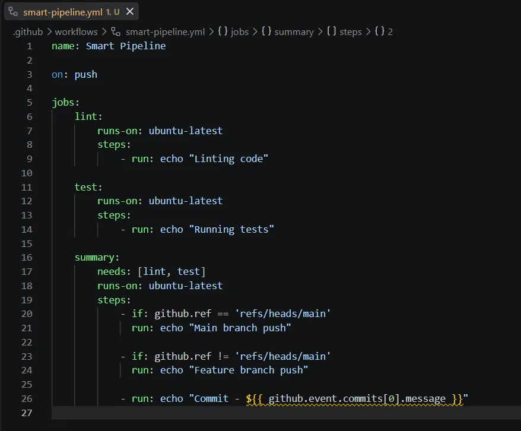

**Workflow run (success):**
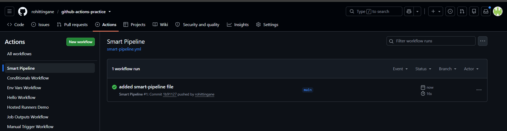

**Parallel jobs graph (lint + test → summary):**
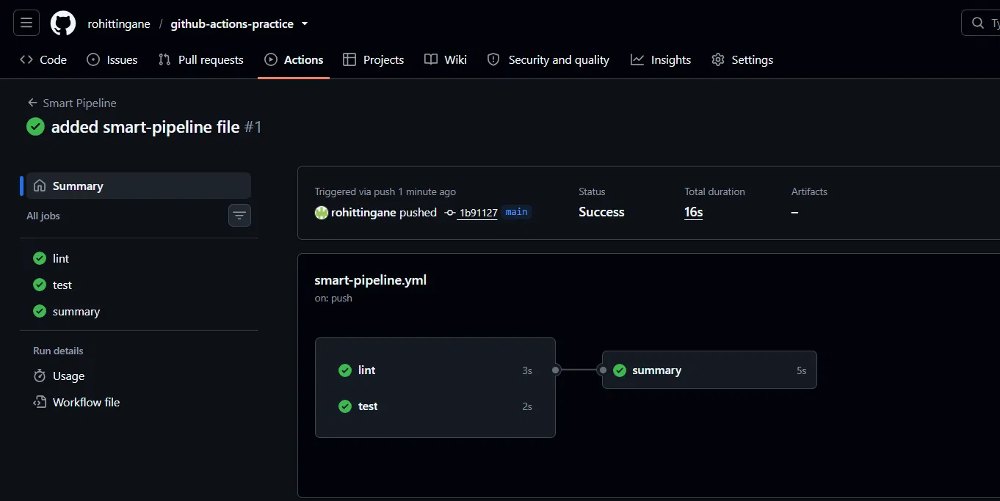

**Summary job logs:**
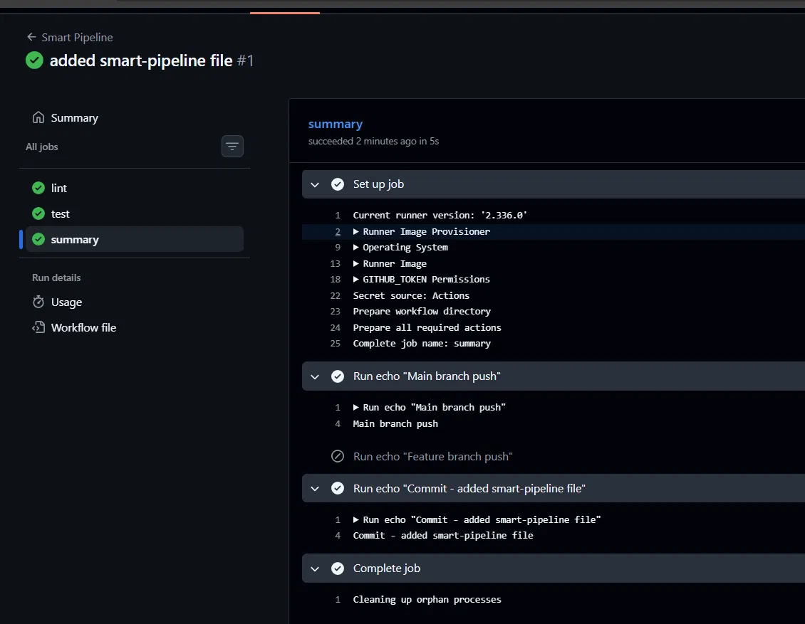

---

## Key Concepts — Summary in My Own Words

**`needs:`** — This keyword creates a dependency between jobs. A job with
`needs: job-name` will wait for `job-name` to finish, and will only run if
`job-name` succeeded. It can also take a list, like `needs: [job-a, job-b]`,
to wait on multiple jobs at once. Without `needs:`, all jobs run in
parallel by default.

**`outputs:`** — Since every job runs on its own isolated machine, data
doesn't automatically flow from one job to another. `outputs:` is the
official way to expose a value from inside a job (usually captured from a
step using `$GITHUB_OUTPUT`) so that a later job can read it through
`needs.<job-name>.outputs.<output-name>`.

**`if:`** — Adds a condition to a step or a job. If the condition
evaluates to false, that step or job is skipped entirely (not marked as
failed, just not run).

**`continue-on-error: true`** — Allows a step to fail without failing the
entire job or stopping the rest of the pipeline.

**Environment variables (3 levels)** — Workflow-level env vars are visible
everywhere; job-level env vars are visible to that job's steps only;
step-level env vars are visible to that one step only. This scoping keeps
values organized and prevents accidental leakage or overwriting.

---

## Files Created Today

- `.github/workflows/multi-job.yml`
- `.github/workflows/env-vars.yml`
- `.github/workflows/job-outputs.yml`
- `.github/workflows/conditionals.yml`
- `.github/workflows/smart-pipeline.yml`
- `2026/day-43/day-43-jobs-steps.md` (this file)
