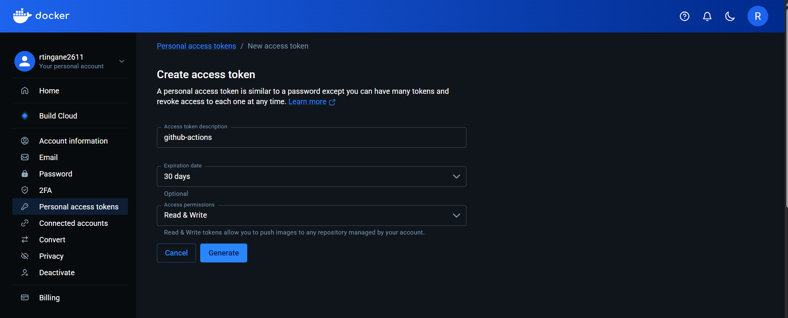
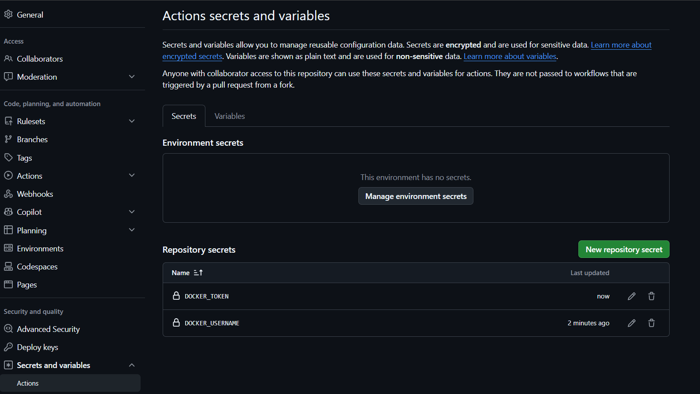
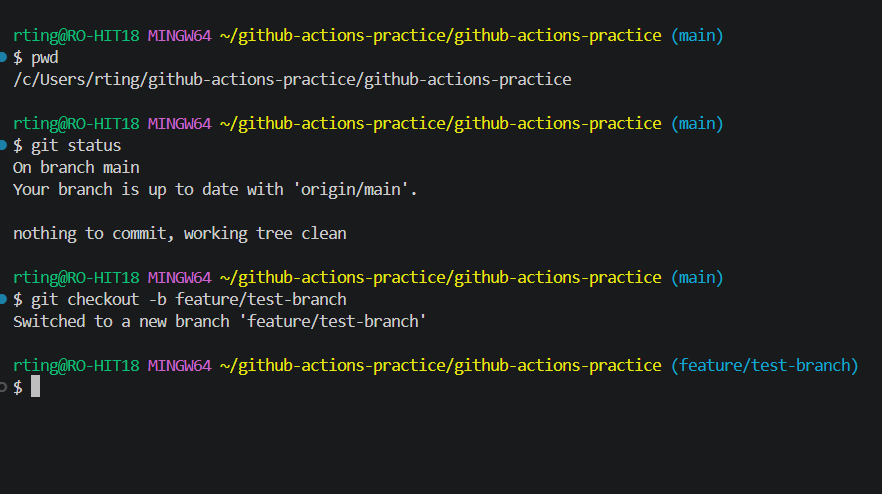
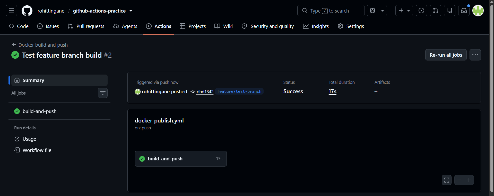
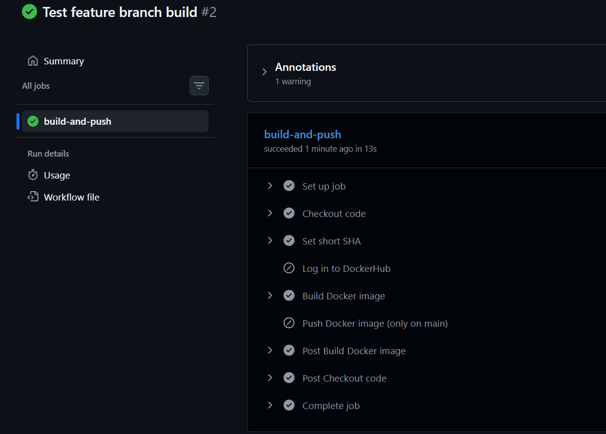
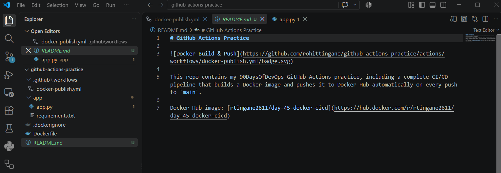
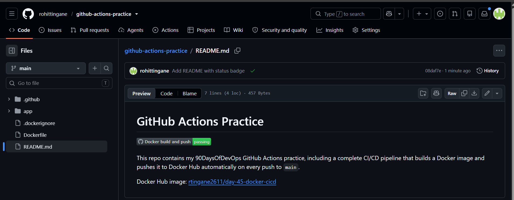
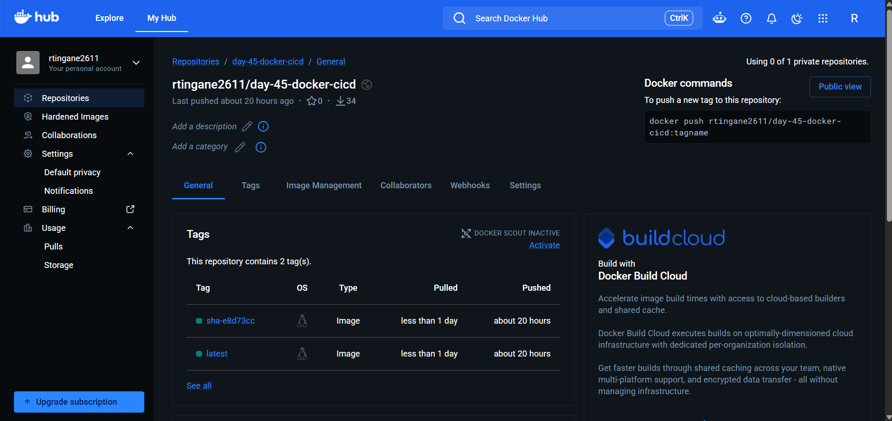
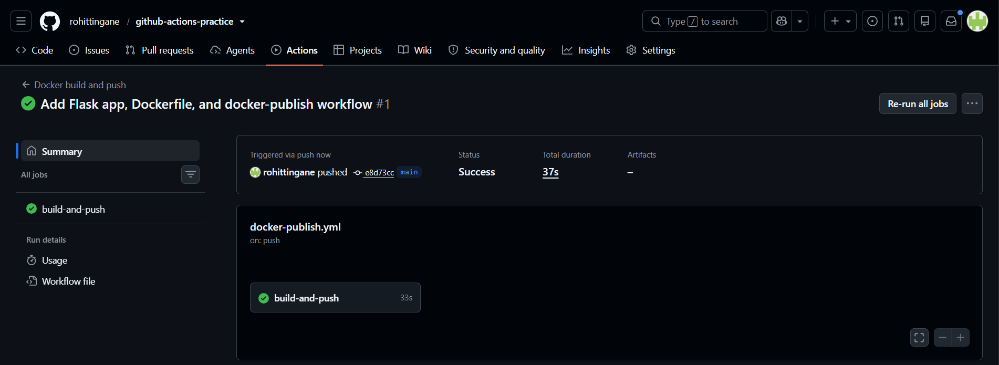

# Day 45 – Docker Build & Push in GitHub Actions

## Overview

The goal of this task was to build a complete CI/CD pipeline: every time code is pushed to GitHub, a Docker image is automatically built and shipped to Docker Hub — with no manual steps at all. This is exactly how real production pipelines work, where a developer never runs `docker build` or `docker push` by hand.

By the end of this task, pushing code to the `main` branch on GitHub automatically:
1. Builds a Docker image from the app in this repo
2. Tags it two ways (`latest` and `sha-<commit-hash>`)
3. Pushes both tags to Docker Hub
4. Skips the push step entirely if the branch is not `main`

---

## Task 1: Preparing the Project

### The App Used

For this task, a **simple Flask (Python) app** was used instead of a full database-backed app. The reasoning: Day 45 is about learning the **CI/CD pipeline mechanics** (build → tag → push → conditional logic), not about running a database inside a CI runner. Adding Postgres here would have added complexity without teaching anything new about GitHub Actions.

**`app/app.py`**
```python
from flask import Flask, jsonify

app = Flask(__name__)

@app.route("/")
def home():
    return jsonify({"message": "Day 45 Docker CI/CD pipeline is working!"})

@app.route("/health")
def health():
    return jsonify({"status": "ok"})

if __name__ == "__main__":
    app.run(host="0.0.0.0", port=5000)
```

**What each part does:**
- `Flask(__name__)` creates the web application object.
- `@app.route("/")` is a decorator — it tells Flask "when someone visits this URL, run the function below it."
- The `/` route returns a JSON message, just to prove the app is alive and responding.
- The `/health` route is a common pattern used by monitoring tools and load balancers to check "is this app still running?"
- `host="0.0.0.0"` is important for Docker — it tells Flask to accept connections from **outside** the container, not just from inside it. If this were `127.0.0.1`, the app would only be reachable from inside its own container and nothing outside could talk to it.
- `port=5000` is Flask's common default port.

**`app/requirements.txt`**
```
flask
```
Just one line — the only external library this app needs.

### Secrets Setup (Docker Hub Access Token)

Before any CI pipeline can push to Docker Hub, GitHub needs credentials it can use safely — without ever exposing them in code or logs. This is done using **GitHub Secrets** combined with a **Docker Hub Access Token** (not your actual password).

**Steps followed:**
1. Went to **hub.docker.com** → logged in
2. Clicked profile icon → **Account Settings** → **Personal access tokens**
3. Clicked **Generate new token**, gave it a description (`github-actions`), set permission to **Read & Write** (needed to push images), and generated it
4. Copied the generated token immediately (it is shown only once)
5. Went to the GitHub repo → **Settings** → **Secrets and variables** → **Actions**
6. Added two repository secrets:
   - `DOCKER_USERNAME` → Docker Hub username
   - `DOCKER_TOKEN` → the access token generated above

**Why a token and not a password?**
A password gives full account access if leaked. A token can be scoped (read/write only), named, tracked, and revoked individually without changing your main password. This is standard practice in real DevOps environments.

**generating the Docker Hub access token**



**both secrets added in GitHub repo settings**



---

## Task 2 & 3: The Complete Workflow File

**File location:** `.github/workflows/docker-publish.yml`

### Full Workflow Code

```yaml
name: Docker build and push

on:
  push:
    branches:
      - main
      - 'feature/**'

jobs:
  build-and-push:
    runs-on: ubuntu-latest

    steps:
      - name: Checkout code
        uses: actions/checkout@v4

      - name: Set short SHA
        id: vars
        run: echo "sha_short=$(git rev-parse --short HEAD)" >> $GITHUB_OUTPUT

      - name: Log in to DockerHub
        if: github.ref == 'refs/heads/main'
        uses: docker/login-action@v3
        with:
          username: ${{ secrets.DOCKER_USERNAME }}
          password: ${{ secrets.DOCKER_TOKEN }}

      - name: Build Docker image
        uses: docker/build-push-action@v5
        with:
          context: .
          push: false
          tags: |
            ${{ secrets.DOCKER_USERNAME }}/day-45-docker-cicd:latest
            ${{ secrets.DOCKER_USERNAME }}/day-45-docker-cicd:sha-${{ steps.vars.outputs.sha_short }}

      - name: Push Docker image (only on main)
        if: github.ref == 'refs/heads/main'
        uses: docker/build-push-action@v5
        with:
          context: .
          push: true
          tags: |
            ${{ secrets.DOCKER_USERNAME }}/day-45-docker-cicd:latest
            ${{ secrets.DOCKER_USERNAME }}/day-45-docker-cicd:sha-${{ steps.vars.outputs.sha_short }}
```

### Line-by-Line Explanation

**`name: Docker build and push`**
This is just a label. It shows up in the GitHub Actions tab so it's easy to identify which workflow ran.

**`on: push: branches: [main, 'feature/**']`**
This tells GitHub *when* to trigger this workflow:
- `push` → run whenever someone pushes commits (not on pull requests, not on a schedule)
- `branches: - main` → run on pushes to `main`
- `- 'feature/**'` → also run on pushes to any branch starting with `feature/` (the `**` matches anything after, like `feature/login` or `feature/test-branch`)

Both branch types trigger the workflow because we *want* feature branches to build (as a check), but not push to Docker Hub — that restriction is handled later with an `if` condition, not here.

**`jobs: build-and-push: runs-on: ubuntu-latest`**
- `jobs:` starts the definition of what work actually happens
- `build-and-push` is a name we chose for this job (could be anything)
- `runs-on: ubuntu-latest` tells GitHub to run this job on a fresh, temporary Ubuntu Linux virtual machine — provided free by GitHub, destroyed after the run finishes

**Step 1 — Checkout code**
```yaml
- name: Checkout code
  uses: actions/checkout@v4
```
`runs-on: ubuntu-latest` gives us a completely empty machine — it doesn't have our code on it. `actions/checkout` is GitHub's own official pre-built action whose only job is to copy (clone) our repository's code onto that machine. Without this step, there would be no Dockerfile or app code to build from.

**Step 2 — Set short SHA**
```yaml
- name: Set short SHA
  id: vars
  run: echo "sha_short=$(git rev-parse --short HEAD)" >> $GITHUB_OUTPUT
```
Every Git commit has a long unique ID (SHA), e.g. `a1b2c3d4e5f6789...` (40 characters). We only want the first 7 characters — the "short SHA" — to use as a readable, unique Docker tag.

Breaking the command down:
- `git rev-parse --short HEAD` → a Git command that outputs just the 7-character short hash of the current commit
- `$(...)` → "run what's inside first, and substitute the result here"
- `echo "sha_short=a1b2c3d"` → creates a labeled value: a variable named `sha_short` holding that short hash
- `>> $GITHUB_OUTPUT` → this is the GitHub Actions convention for saving a value so that **later steps in the same job** can read it

`id: vars` gives this step a nickname (`vars`). Later, we access this value using `${{ steps.vars.outputs.sha_short }}` — meaning "the value called `sha_short` that came out of the step named `vars`."

**Step 3 — Log in to DockerHub**
```yaml
- name: Log in to DockerHub
  if: github.ref == 'refs/heads/main'
  uses: docker/login-action@v3
  with:
    username: ${{ secrets.DOCKER_USERNAME }}
    password: ${{ secrets.DOCKER_TOKEN }}
```
- `if: github.ref == 'refs/heads/main'` is a **condition**. This step only runs if the branch being pushed is `main`. `github.ref` is a built-in variable that tells GitHub which branch triggered this run; `refs/heads/main` is GitHub's internal full name for the `main` branch. If the condition is false, this whole step is **skipped**.
- `uses: docker/login-action@v3` → an official Docker-maintained action whose only job is logging into a container registry (Docker Hub by default)
- `with: username / password` → pulls the values from GitHub Secrets using `${{ secrets.SECRET_NAME }}` syntax. These values are never printed in logs — GitHub automatically masks them as `***`.

**Step 4 — Build Docker image**
```yaml
- name: Build Docker image
  uses: docker/build-push-action@v5
  with:
    context: .
    push: false
    tags: |
      ${{ secrets.DOCKER_USERNAME }}/day-45-docker-cicd:latest
      ${{ secrets.DOCKER_USERNAME }}/day-45-docker-cicd:sha-${{ steps.vars.outputs.sha_short }}
```
This step has **no `if` condition** — it runs on every push, including feature branches, because we want to verify the image actually builds successfully everywhere.
- `context: .` → tells Docker to look for the Dockerfile and app files in the current directory (the repo root)
- `push: false` → build only, do **not** upload anywhere yet — this is the key line that makes this step safe to run on any branch
- `tags: |` → gives the built image two names/tags (the `|` means "multiple lines follow"):
  - `.../day-45-docker-cicd:latest` — the standard "most recent" tag
  - `.../day-45-docker-cicd:sha-a1b2c3d` — tied permanently to this exact commit, useful for rolling back to a specific version later

**Step 5 — Push Docker image (only on main)**
```yaml
- name: Push Docker image (only on main)
  if: github.ref == 'refs/heads/main'
  uses: docker/build-push-action@v5
  with:
    context: .
    push: true
    tags: |
      ${{ secrets.DOCKER_USERNAME }}/day-45-docker-cicd:latest
      ${{ secrets.DOCKER_USERNAME }}/day-45-docker-cicd:sha-${{ steps.vars.outputs.sha_short }}
```
Nearly identical to Step 4, except:
- Same `if` condition as the login step — only runs on `main`
- `push: true` → this time the image is actually uploaded to Docker Hub

**Why build twice (once with `push: false`, once with `push: true`)?**
This is a simplicity trade-off. It keeps the logic easy to read and understand at this learning stage — one step always runs to validate the build, and a second step (guarded by `if`) does the actual publish. In a more optimized pipeline you could reuse layer caching to avoid the second full build, but for learning the CI/CD flow, this approach is clear and correct.

---

## Task 4: Testing "Only Push on Main"

To prove the `if` condition actually works, a real test was done:

**Commands used:**
```bash
git checkout -b feature/test-branch
# made a small change to app/app.py
git add .
git commit -m "Test feature branch build"
git push origin feature/test-branch
```

**What this does:**
- `git checkout -b feature/test-branch` creates a new branch off the current one and switches to it immediately
- Pushing to `feature/test-branch` (not `main`) triggers the workflow because of the `'feature/**'` pattern in the `on:` section
- Since `github.ref` will now equal `refs/heads/feature/test-branch`, not `refs/heads/main`, both the **Log in to DockerHub** and **Push Docker image** steps evaluate their `if` condition as false and get **skipped**

**Result confirmed in GitHub Actions logs:**

| Step | Status |
|---|---|
| Checkout code | ✅ Ran successfully |
| Set short SHA | ✅ Ran successfully |
| Log in to DockerHub | ⊘ Skipped |
| Build Docker image | ✅ Ran successfully |
| Push Docker image (only on main) | ⊘ Skipped |

This confirms the pipeline correctly builds on every branch as a sanity check, but only ever publishes from `main`.

**new branch created locally**



**workflow triggered on the feature branch, overall status Success**



**login and push steps showing as Skipped**



---

## Dockerfile Explanation

**File location:** `Dockerfile` (in the repo root)

```dockerfile
FROM python:3.12-slim

WORKDIR /app

RUN useradd --create-home --shell /bin/bash appuser

COPY app/requirements.txt .
RUN pip install --no-cache-dir -r requirements.txt

COPY app/ .
RUN chown -R appuser:appuser /app

USER appuser

EXPOSE 5000

CMD ["python", "app.py"]
```

| Line | What it does | Why |
|---|---|---|
| `FROM python:3.12-slim` | Uses the official Python 3.12 "slim" image as the base | Slim images are much smaller than the full Python image (roughly 150MB vs 1GB) while still working reliably, unlike `alpine` which sometimes causes issues with certain Python packages |
| `WORKDIR /app` | Sets `/app` as the working directory inside the container | Keeps everything in one predictable folder instead of scattered across the container's filesystem |
| `RUN useradd --create-home --shell /bin/bash appuser` | Creates a normal (non-root) Linux user | Containers run as `root` by default, which is a security risk — if the app is ever compromised, a non-root user limits the damage |
| `COPY app/requirements.txt .` | Copies only the dependency list first | Docker caches each instruction as a layer. If only the app code changes (not dependencies), Docker can skip re-running `pip install` and reuse the cached layer — making rebuilds much faster |
| `RUN pip install --no-cache-dir -r requirements.txt` | Installs Flask | `--no-cache-dir` prevents pip from storing its own download cache inside the image, keeping the final image smaller |
| `COPY app/ .` | Copies the rest of the app code | Done after installing dependencies, to preserve the caching benefit above |
| `RUN chown -R appuser:appuser /app` | Gives the new user ownership of the app files | Files were copied in as `root`; without this, `appuser` wouldn't have permission to read or run them |
| `USER appuser` | Switches the active user from `root` to `appuser` | From here onward, everything (including running the app) happens as a non-root user |
| `EXPOSE 5000` | Documents that the app listens on port 5000 | This is just metadata — it doesn't actually open the port. The real port mapping happens when the container is run with `-p` |
| `CMD ["python", "app.py"]` | The command that runs when the container starts | This is the container's main process — the container stays alive as long as this keeps running |

**`.dockerignore`**
```
__pycache__
*.pyc
.git
.gitignore
.env
*.md
.dockerignore
```
This tells Docker which files to *never* copy into the image — cache files, git history, secrets, and documentation, none of which the running app needs.

---

## Task 5: Status Badge in README

A GitHub Actions status badge is a small auto-generated image that shows whether the latest workflow run passed (green) or failed (red).

**Badge URL format:**
```
https://github.com/<username>/<repo>/actions/workflows/<workflow-file>.yml/badge.svg
```

**Used in this repo:**
```
https://github.com/rohittingane/github-actions-practice/actions/workflows/docker-publish.yml/badge.svg
```

**Added to `README.md` like this:**
```markdown

```

- `![...]` is Markdown syntax for embedding an image
- The text inside `[...]` is alt text (shown if the image fails to load)
- The URL is the badge itself, generated live by GitHub based on the latest run of that specific workflow file

Once pushed, the badge appeared in green, reading **"passing"** — confirming the most recent run on `main` succeeded.

**README source with the badge markdown**



**the green "passing" badge rendered on GitHub**



---

## Task 6: Pull and Run — Proving It Actually Works

The final and most convincing test: pulling the exact image that GitHub Actions built and pushed, on a completely separate machine (an AWS EC2 instance), with no source code or Dockerfile present there at all — only Docker itself.

**Commands used and what each one does:**

```bash
docker pull rtingane2611/day-45-docker-cicd:latest
```
Downloads the image directly from Docker Hub onto the EC2 server. This machine had never built this image locally — it is a completely fresh pull, proving the image is fully self-contained.

```bash
docker images
```
Lists locally available images, confirming the pull succeeded and showing the image size (51.2MB content size — small, thanks to the `slim` base image).

```bash
docker run -d -p 5000:5000 --name day45-test rtingane2611/day-45-docker-cicd:latest
```
Starts a container from the pulled image:
- `-d` → detached mode, runs in the background instead of blocking the terminal
- `-p 5000:5000` → maps port 5000 on the host machine to port 5000 inside the container, so the app is reachable from outside
- `--name day45-test` → gives the container a friendly, easy-to-reference name

```bash
docker ps
```
Confirms the container is running, showing status `Up` and the port mapping.

```bash
curl http://localhost:5000/
curl http://localhost:5000/health
```
Sends actual HTTP requests to the running app, just like a browser would. Both returned correct JSON responses:
```json
{"message":"Day 45 Docker CI/CD pipeline is working!"}
{"status":"ok"}
```

This proves the app inside the container is genuinely alive and responding correctly — not just that the container started.

**Cleanup afterward:**
```bash
docker stop day45-test
docker rm day45-test
docker rmi rtingane2611/day-45-docker-cicd:latest
```
- `stop` halts the running container
- `rm` removes the stopped container entirely
- `rmi` removes the local copy of the image from this server (the image on Docker Hub is untouched — this only clears the local copy on this one machine)

**full sequence: pull, run, `docker ps`, and both successful curl responses**


---

## Docker Hub Verification

After the first successful push from GitHub Actions, Docker Hub was checked directly to confirm the image and both tags were genuinely there.

**Result:** the repository `rtingane2611/day-45-docker-cicd` appeared under **My Hub → Repositories**, marked **Public**, containing exactly 2 tags:

| Tag | Pushed |
|---|---|
| `latest` | ✅ present |
| `sha-e8d73cc` | ✅ present |

**both tags visible on Docker Hub**



**Docker Hub repository list after removing unrelated old practice repos, leaving only `day-45-docker-cicd` (and `flask-postgres-app` from Day 36, kept intentionally)**


**the first successful workflow run summary in GitHub Actions**



**detailed step-by-step logs showing `Login Succeeded!` and a successful build**


---

## The Full Journey: From `git push` to a Running Container

Putting the entire pipeline together, here is what happens end-to-end every time code is pushed to `main`:

1. **Developer runs `git push`** from their local machine (or, in this case, VS Code's integrated terminal) targeting the `main` branch.
2. **GitHub receives the push** and checks all workflow files under `.github/workflows/`. It finds `docker-publish.yml`, sees its `on: push: branches: [main, ...]` trigger matches, and starts a new workflow run.
3. **GitHub spins up a fresh Ubuntu virtual machine** (`ubuntu-latest`) — completely empty, with nothing from this repo on it yet.
4. **Checkout step** clones the repository's code onto that fresh machine.
5. **Short SHA step** extracts a 7-character identifier from the current commit and saves it for later steps to use.
6. **Login step** runs (because the branch is `main`) — GitHub Actions securely retrieves the `DOCKER_USERNAME` and `DOCKER_TOKEN` secrets and logs into Docker Hub, without ever exposing them in the logs.
7. **Build step** reads the `Dockerfile` in the repo root, builds a new Docker image layer by layer (base image → dependencies → app code → non-root user), and tags it as both `latest` and `sha-<hash>`. This step alone always runs, even on non-main branches, as a build-health check.
8. **Push step** runs (again, only because the branch is `main`) and uploads both tagged versions of the image to Docker Hub.
9. **Anyone, anywhere, can now run:**
   ```bash
   docker pull rtingane2611/day-45-docker-cicd:latest
   docker run -d -p 5000:5000 rtingane2611/day-45-docker-cicd:latest
   ```
   and get the exact same application running, with zero access to the original source code or Dockerfile needed — everything required is baked into the image itself.
10. **The README badge automatically updates** to reflect the outcome of the latest run — green for success, red for failure — giving anyone visiting the repo an instant status check without digging into the Actions tab.

This is the same fundamental flow used in real production CI/CD systems: code → automated build → automated publish → deployable artifact, with humans only ever touching step 1.

---

## Challenges Faced (and Fixed)

1. **Old workflow files running unintentionally.** The `.github/workflows/` folder had several files from earlier practice days (Day 44 and others), all triggering on `push` with no restrictions. This caused many unrelated workflows to run together, making the Actions tab confusing. **Fix:** old files were renamed to `.yml.disabled` first (to safely test), and once the new pipeline was confirmed working, the disabled files were deleted entirely for a clean workflows folder.

2. **YAML indentation errors.** `jobs:` and `steps:` were initially indented at the wrong level, which nested them incorrectly inside `on:` instead of at the top level of the file. YAML structure depends entirely on indentation — even one extra space changes meaning. **Fix:** carefully re-aligned each section so `jobs:` sits at the very left margin, and `steps:` sits at the same indentation as `runs-on:`.

3. **Output variable name mismatch.** The short SHA was originally saved as `SHORT_SHA` in one step but referenced as `sha_short` in another. GitHub Actions treats these as two completely different variables — the mismatch would have produced tags ending in a blank value. **Fix:** used the exact same variable name (`sha_short`) everywhere it was defined and referenced.

4. **Wrong secret name referenced.** The workflow initially referenced `secrets.DOCKER_PASSWORD`, but the secret had actually been created as `DOCKER_TOKEN`. Since secret names must match exactly, this would have caused the Docker Hub login step to fail. **Fix:** corrected the reference to `secrets.DOCKER_TOKEN`.

5. **Files created in the wrong folder.** Several times, new files (`Dockerfile`, `.dockerignore`, `requirements.txt`, `README.md`) were accidentally created inside `.github/workflows/` instead of the repository root, because that folder was selected in the editor when right-clicking "New File." Since the workflow's `context: .` expects the Dockerfile at the repo root, this would have caused the build step to fail with "Dockerfile not found." **Fix:** used `mv` (and `git mv` once tracked) to move each misplaced file to its correct location, and re-verified the full folder structure with `find . -not -path "./.git/*" -type f` before every commit.

---

## Final Project Structure

```
github-actions-practice/
├── .github/
│   └── workflows/
│       └── docker-publish.yml
├── app/
│   ├── app.py
│   └── requirements.txt
├── Dockerfile
├── .dockerignore
├── README.md
└── 2026/
    └── day-45/
        ├── day-45-docker-cicd.md   (this file)
        └── Screenshots/
```

---

## Docker Hub Link

**https://hub.docker.com/r/rtingane2611/day-45-docker-cicd**

Anyone can pull and run this image directly:
```bash
docker pull rtingane2611/day-45-docker-cicd:latest
docker run -d -p 5000:5000 rtingane2611/day-45-docker-cicd:latest
```

---

## Submission Checklist

- [x] `.github/workflows/docker-publish.yml` — complete CI/CD workflow
- [x] Docker image live on Docker Hub with `latest` and `sha-<hash>` tags
- [x] Status badge added to `README.md`, showing green/passing
- [x] `day-45-docker-cicd.md` (this file) added to `2026/day-45/`
- [x] Verified push only happens on `main` (tested via feature branch)
- [x] Verified fresh pull and run on a separate server (AWS EC2), with successful `curl` responses
