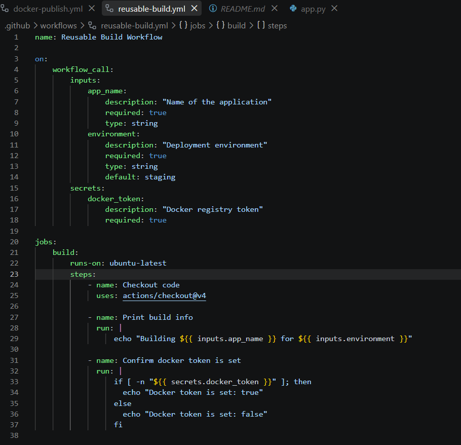
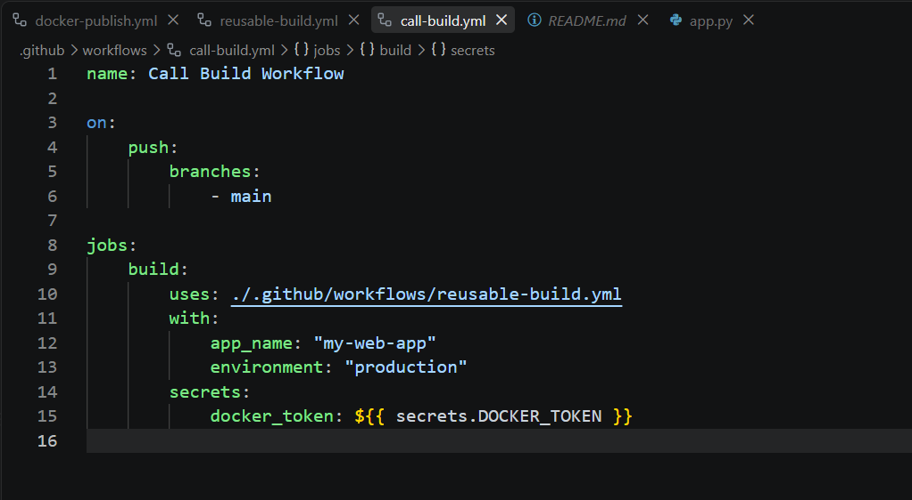
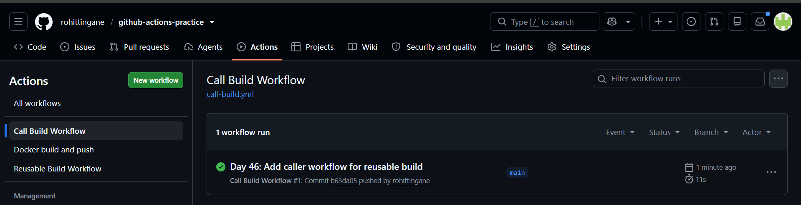
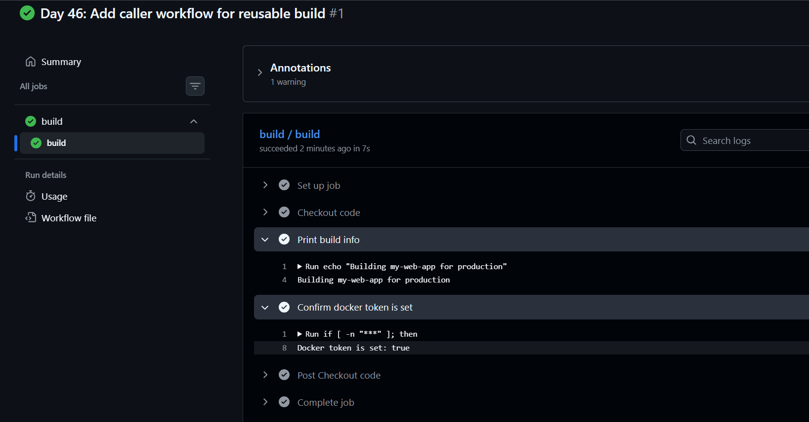
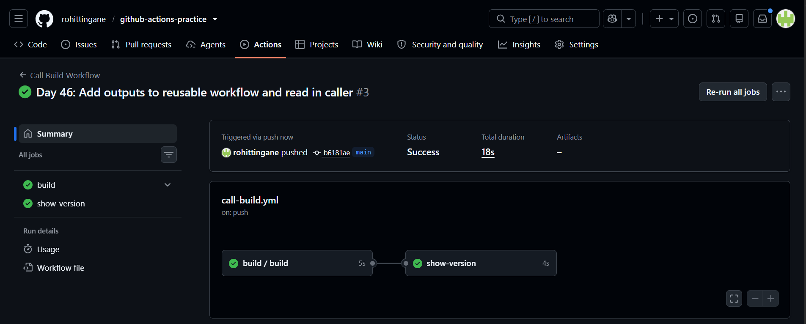
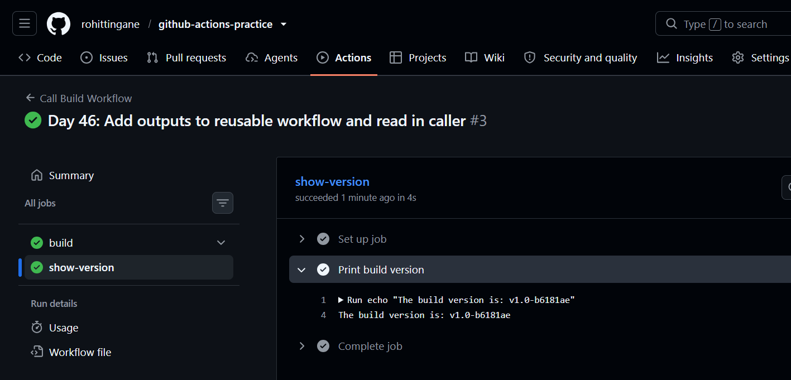
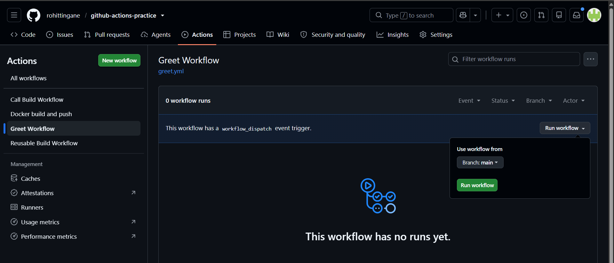
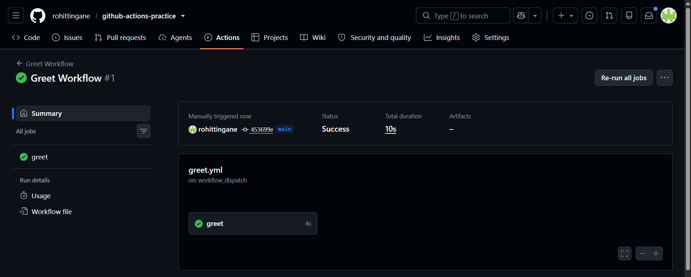
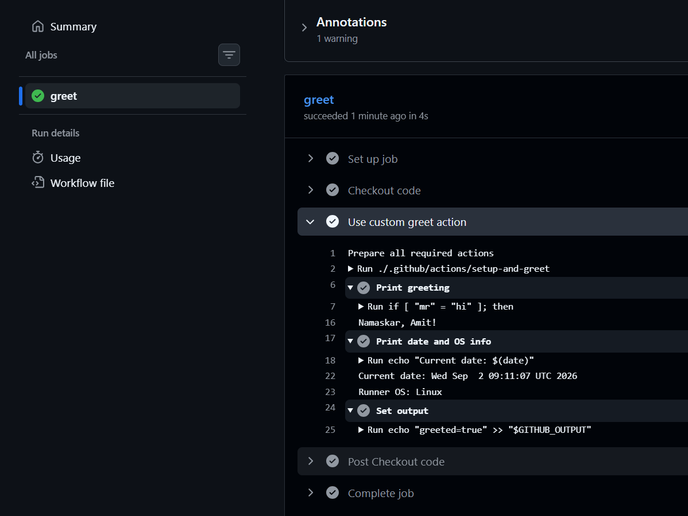

# Day 46 – Reusable Workflows & Composite Actions

> A beginner-friendly guide. Even if you know nothing about GitHub Actions,
> you should be able to read this file top to bottom and understand
> **what** we built, **why** we built it, **where** each file lives, and
> **how** the code works line by line.

---

## 0. The Big Picture (Read This First)

Before Day 46, every workflow file we wrote was written **from scratch**.
If two different repos needed the same "build and push docker image" logic,
we had to copy-paste the same YAML into both repos. That's bad practice —
just like copy-pasting the same function into every Python file instead of
writing it once and importing it.

GitHub Actions solves this with two features:

| Feature | What it reuses | Think of it as |
|---|---|---|
| **Reusable Workflow** (`workflow_call`) | A whole **job** (or set of jobs) | A function you call from another workflow |
| **Composite Action** | A group of **steps** | A custom mini-tool, just like `actions/checkout@v4` |

Today we built one of each, plus a workflow that calls each of them.

---

## 1. Folder Structure — Where Everything Lives

```
github-actions-practice/
└── .github/
    ├── workflows/                     <-- ALL workflow files live here
    │   ├── reusable-build.yml         <-- Task 2: the reusable workflow
    │   ├── call-build.yml             <-- Task 3 & 4: the caller workflow
    │   ├── greet.yml                  <-- Task 5: workflow that uses the composite action
    │   └── docker-publish.yml         <-- old workflow from a previous day (disabled auto-trigger)
    └── actions/                       <-- CUSTOM ACTIONS live here (NOT inside workflows/)
        └── setup-and-greet/
            └── action.yml             <-- Task 5: the composite action itself
```

**Golden rule:**
- A file that starts with `on:` and has `jobs:` → it's a **workflow** → goes in `.github/workflows/`
- A file that starts with `name:`, `description:`, `runs:` → it's a **custom action** → goes in `.github/actions/<action-name>/action.yml`

Mixing these up is the most common mistake (we made it too, and fixed it!).

---

## 2. Task 1 — Understanding the Concepts (Theory)

**Q1: What is a reusable workflow?**
A workflow file written once, which other workflows can "call" like a
function, instead of copy-pasting the same jobs everywhere.

**Q2: What is the `workflow_call` trigger?**
A special trigger you put under `on:`. It means: *"This workflow will
NEVER run by itself (not on push, not on PR). It only runs when another
workflow calls it."*

**Q3: How is calling a reusable workflow different from a normal `uses:` action?**

| | Normal action (`uses: actions/checkout@v4`) | Reusable workflow (`uses: ./.github/workflows/x.yml`) |
|---|---|---|
| Placed at | **step** level (inside `steps:`) | **job** level (instead of `runs-on` + `steps`) |
| Reuses | A single step's logic | An entire job (or several jobs) |
| Can have its own jobs? | No | Yes |

**Q4: Where must a reusable workflow file live?**
Inside `.github/workflows/`, exactly like any normal workflow file. The
only thing that makes it "reusable" is having `on: workflow_call` instead
of `on: push` etc.

---

## 3. Task 2 — The Reusable Workflow

**File path:** `.github/workflows/reusable-build.yml`

**Purpose:** This is our "function". It accepts an app name, an
environment, and a secret docker token, and prints build information.
By itself it does nothing — it just waits to be called.

```yaml
name: Reusable Build Workflow

on:
  workflow_call:
    inputs:
      app_name:
        description: "Name of the application"
        required: true
        type: string
      environment:
        description: "Deployment environment"
        required: true
        type: string
        default: staging
    secrets:
      docker_token:
        description: "Docker registry token"
        required: true
    outputs:
      build_version:
        description: "Generated build version"
        value: ${{ jobs.build.outputs.build_version }}

jobs:
  build:
    runs-on: ubuntu-latest
    outputs:
      build_version: ${{ steps.set_version.outputs.build_version }}
    steps:
      - name: Checkout code
        uses: actions/checkout@v4

      - name: Print build info
        run: |
          echo "Building ${{ inputs.app_name }} for ${{ inputs.environment }}"

      - name: Confirm docker token is set
        run: |
          if [ -n "${{ secrets.docker_token }}" ]; then
            echo "Docker token is set: true"
          else
            echo "Docker token is set: false"
          fi

      - name: Generate build version
        id: set_version
        run: |
          SHORT_SHA=$(git rev-parse --short HEAD)
          VERSION="v1.0-$SHORT_SHA"
          echo "Generated version: $VERSION"
          echo "build_version=$VERSION" >> "$GITHUB_OUTPUT"
```

### Line-by-line meaning

| Code | Meaning in plain English |
|---|---|
| `on: workflow_call:` | This file only runs when another workflow calls it. |
| `inputs:` | Values the caller must send in — like function parameters. |
| `app_name` (type: string, required: true) | The caller MUST send a name, no default value. |
| `environment` (default: staging) | If the caller doesn't send this, "staging" is used automatically. |
| `secrets:` | A separate, protected section for sensitive values (never shown in logs). |
| `docker_token` | The name of the secret this workflow expects to receive. |
| `outputs: build_version:` | Declares that this whole workflow will "return" a value called `build_version` once it finishes — its value comes from the job's own output. |
| `jobs: build: runs-on: ubuntu-latest` | Run this job on a temporary Linux virtual machine provided free by GitHub. |
| `outputs: build_version:` (job level) | The job also needs its own `outputs:` so it can pass data up to the workflow level. |
| `uses: actions/checkout@v4` | An official, ready-made GitHub action that copies your repo's code onto the runner machine. Almost every workflow starts with this. |
| `${{ inputs.app_name }}` | Expression syntax — reads the actual value sent by the caller for `app_name`. |
| `if [ -n "${{ secrets.docker_token }}" ]` | Bash check: "is this string NOT empty?" We only print true/false, **never** the real secret value — that is a critical security rule. |
| `id: set_version` | Gives this step a nickname so we can reference its output later. |
| `git rev-parse --short HEAD` | A git command that returns the short commit hash (e.g. `b6181ae`). |
| `echo "build_version=$VERSION" >> "$GITHUB_OUTPUT"` | The official modern way to set a step's output. `$GITHUB_OUTPUT` is a special file GitHub Actions gives every step; anything written as `key=value` becomes that step's output. |

**Why this file "does nothing" by itself:** Because its only trigger is
`workflow_call`, GitHub will never run it on its own — not on push, not on
schedule, nothing. It needs Task 3's caller file to actually execute it.



---

## 4. Task 3 — The Caller Workflow

**File path:** `.github/workflows/call-build.yml`

**Purpose:** This is the workflow that actually "calls" (uses) the
reusable workflow from Task 2 — like calling a function you wrote.

```yaml
name: Call Build Workflow

on:
  push:
    branches:
      - main

jobs:
  build:
    uses: ./.github/workflows/reusable-build.yml
    with:
      app_name: "my-web-app"
      environment: "production"
    secrets:
      docker_token: ${{ secrets.DOCKER_TOKEN }}
```

### Line-by-line meaning

| Code | Meaning |
|---|---|
| `on: push: branches: [main]` | This workflow runs automatically every time someone pushes to the `main` branch. |
| `jobs: build: uses: ./.github/workflows/reusable-build.yml` | Instead of writing `runs-on:` + `steps:`, this job's ENTIRE job is "go run that other workflow file". The `./` means "same repo". For a different repo it would be `org/repo/.github/workflows/file.yml@main`. |
| `with:` | Sends actual values for the `inputs:` that `reusable-build.yml` expects. |
| `app_name: "my-web-app"` | This value flows into `${{ inputs.app_name }}` inside the reusable workflow. |
| `secrets: docker_token: ${{ secrets.DOCKER_TOKEN }}` | `secrets.DOCKER_TOKEN` (right side, ALL CAPS) is the real secret stored in this repo's **Settings → Secrets and variables → Actions**. `docker_token` (left side, lowercase) is just the parameter name the reusable workflow expects. We are mapping "our real secret" → "the parameter name the function wants". |



### Data flow diagram

```
GitHub Secrets (DOCKER_TOKEN)
        │
        ▼
call-build.yml  ──with/secrets──▶  reusable-build.yml
   (caller)                           (called)
        │                                 │
   on: push to main               on: workflow_call
```

### Where do the results show up on GitHub?

This is a common point of confusion, so remember it:

- Go to **Actions → "Reusable Build Workflow"** → it will always show
  **"0 workflow runs"**. This is normal! A workflow that is only triggered
  by `workflow_call` never gets its own independent run entry.
- Go to **Actions → "Call Build Workflow"** → this is where the ACTUAL
  run appears, and inside it you will see a nested job (e.g. `build /
  build`) — that nested job is the reusable workflow actually executing.





---

## 5. Task 4 — Adding Outputs (Sending Data Back)

**Files changed:** `reusable-build.yml` (already shown above, with the
`outputs:` sections added) and `call-build.yml` (a second job added).

**Purpose:** Until now data only flowed one direction: caller → reusable
workflow. Now we make data flow the other way too: reusable workflow →
caller. This is exactly like a function that `return`s a value.

**Updated `call-build.yml`:**

```yaml
name: Call Build Workflow

on:
  push:
    branches:
      - main

jobs:
  build:
    uses: ./.github/workflows/reusable-build.yml
    with:
      app_name: "my-web-app"
      environment: "production"
    secrets:
      docker_token: ${{ secrets.DOCKER_TOKEN }}

  show-version:
    needs: build
    runs-on: ubuntu-latest
    steps:
      - name: Print build version
        run: |
          echo "The build version is: ${{ needs.build.outputs.build_version }}"
```

### Line-by-line meaning

| Code | Meaning |
|---|---|
| `needs: build` | "Do not start this job until the `build` job has completely finished." Without this, both jobs would run in parallel and `show-version` wouldn't have the data yet. |
| `${{ needs.build.outputs.build_version }}` | Read the `build_version` output that the `build` job (which is really our reusable workflow) produced. |

### The full output chain (3 levels of "bubbling up")

```
Step "Generate build version"
   sets: build_version = v1.0-b6181ae
        │
        ▼  (job's own outputs: pulls it from the step)
Job "build" 
   outputs.build_version = steps.set_version.outputs.build_version
        │
        ▼  (workflow_call outputs: pulls it from the job)
Reusable Workflow "reusable-build.yml"
   outputs.build_version = jobs.build.outputs.build_version
        │
        ▼  (caller reads it via needs.<job_id>.outputs)
Caller job "show-version"
   prints: needs.build.outputs.build_version
```

Each level has to explicitly "pass up" the value — it does not happen
automatically. Miss one level and the output becomes empty.





---

## 6. Task 5 — Composite Action

**File path:** `.github/actions/setup-and-greet/action.yml`
(Note: this is in `actions/`, NOT `workflows/`)

**Purpose:** A composite action groups several **steps** into one
reusable "mini action" that behaves just like an official action such as
`actions/checkout@v4`. It is different from a reusable workflow because
it works at the **step** level, not the **job** level.

```yaml
name: "Setup and Greet"
description: "Greets the user in the specified language and prints system info"

inputs:
  name:
    description: "Name of the person to greet"
    required: true
  language:
    description: "Language for the greeting"
    required: false
    default: en

outputs:
  greeted:
    description: "Whether the greeting was successful"
    value: ${{ steps.set_output.outputs.greeted }}

runs:
  using: "composite"
  steps:
    - name: Print greeting
      shell: bash
      run: |
        if [ "${{ inputs.language }}" = "hi" ]; then
          echo "Namaste, ${{ inputs.name }}!"
        elif [ "${{ inputs.language }}" = "mr" ]; then
          echo "Namaskar, ${{ inputs.name }}!"
        else
          echo "Hello, ${{ inputs.name }}!"
        fi

    - name: Print date and OS info
      shell: bash
      run: |
        echo "Current date: $(date)"
        echo "Runner OS: ${{ runner.os }}"

    - name: Set output
      id: set_output
      shell: bash
      run: echo "greeted=true" >> "$GITHUB_OUTPUT"
```

### Line-by-line meaning

| Code | Meaning |
|---|---|
| `name:` / `description:` | Metadata describing what this action does (compulsory for a composite action, unlike a workflow). |
| `inputs: name / language` | Same idea as workflow inputs — parameters the caller must/can send. `language` defaults to `en` if not sent. |
| `outputs: greeted:` | Same output pattern as before — pulls its value from a step's output. |
| `runs: using: "composite"` | THE key line. Tells GitHub "this action is made of shell steps", as opposed to a Docker-based or JavaScript-based action. |
| `shell: bash` (required in every step) | Unlike normal workflow steps, composite action steps MUST explicitly say which shell to use, because the action could run on Linux, Windows, or macOS. |
| `runner.os` | A built-in variable that tells you which OS the runner machine is using (Linux/Windows/macOS). |
| `id: set_output` + `$GITHUB_OUTPUT` | Same output-writing technique used in Task 4. |

**Workflow that uses this composite action:**

**File path:** `.github/workflows/greet.yml`

```yaml
name: Greet Workflow

on:
  workflow_dispatch:

jobs:
  greet:
    runs-on: ubuntu-latest
    steps:
      - name: Checkout code
        uses: actions/checkout@v4

      - name: Use custom greet action
        uses: ./.github/actions/setup-and-greet
        with:
          name: "Amit"
          language: "mr"
```

| Code | Meaning |
|---|---|
| `on: workflow_dispatch:` | This workflow does NOT run automatically on push. It only runs when someone clicks the "Run workflow" button on GitHub manually. |
| `uses: ./.github/actions/setup-and-greet` | Notice this `uses:` is inside `steps:` (step level!) — exactly like using `actions/checkout@v4`. This is the key difference from calling a reusable workflow, where `uses:` sits at the job level. |

### Actual output we got (proof it works)

```
Namaskar, Amit!
Current date: Wed Sep  2 09:11:07 UTC 2026
Runner OS: Linux
```







---

## 7. Task 6 — Reusable Workflow vs Composite Action (Comparison)

| | Reusable Workflow | Composite Action |
|---|---|---|
| **Triggered by** | `workflow_call` (used at the **job** level with `uses:`) | Called with `uses:` inside a **step** |
| **Can contain jobs?** | Yes — it can have one or many full jobs, each with its own `runs-on` | No — it has no concept of a "job"; it only groups steps |
| **Can contain multiple steps?** | Yes, inside its job(s) | Yes, that is its whole purpose |
| **Lives where?** | `.github/workflows/<file>.yml` | `.github/actions/<action-name>/action.yml` |
| **Can accept secrets directly?** | Yes, via a dedicated `secrets:` block | No — secrets must be passed in as regular `inputs:`, composite actions have no separate secrets mechanism |
| **Best for** | Sharing an entire pipeline/process (e.g. "build, test, and deploy") across workflows or repos | Sharing a small reusable chunk of steps (e.g. "setup + login + greet") that gets used like any other action |

---

## 8. Quick Recap — If Someone New Reads Only This Section

1. **Reusable workflow** = a workflow file that only runs when another
   workflow "calls" it (`on: workflow_call`). You call it at the **job**
   level: `jobs.myjob.uses: ./.github/workflows/file.yml`.
2. **Composite action** = a bunch of steps packaged as a custom action.
   You call it at the **step** level: `steps[].uses:
   ./.github/actions/name`, exactly like `actions/checkout@v4`.
3. **Inputs** flow from caller → callee. **Outputs** flow from callee →
   caller, bubbling up through step → job → workflow (or step → action).
4. **Never print secrets directly.** Only check if they exist
   (`true`/`false`), never echo the actual value.
5. Reusable workflows live in `.github/workflows/`. Composite actions live
   in `.github/actions/<name>/action.yml`. Mixing these up is the #1
   beginner mistake — GitHub will simply not find your file if the path
   is wrong.

---

