# Day 47 – Advanced Triggers: PR Events, Cron Schedules & Event-Driven Pipelines

This document explains everything I did for Day 47 of the #90DaysOfDevOps challenge. It covers advanced GitHub Actions triggers: PR lifecycle events, PR validation checks, scheduled (cron) workflows, path/branch filters, chaining workflows together, and triggering workflows from an external system.

Anyone reading this file should be able to follow it step by step and recreate every task, even without knowing the original assignment.

---

## Before You Start

Repo used in this guide: `rohittingane/github-actions-practice`
Replace this with your own repo name wherever it appears.

All workflow files go inside this folder in your repo:
```
.github/workflows/
```

If this folder doesn't exist, create it.

---

## Task 1: PR Lifecycle Events

### What this does
GitHub sends a different "event" every time something happens to a Pull Request — when it's opened, when new commits are pushed to it, when it's reopened, and when it's closed (merged or not). This workflow listens for all of these and prints details about what happened.

### Why we use this
In real projects, teams want to know exactly what stage a PR is in — was it just opened? Did someone push new code? Was it merged or just closed without merging? This is the foundation for building automation like "notify Slack when a PR is merged" or "run extra tests only when a PR is updated."

### File to create
```
.github/workflows/pr-lifecycle.yml
```

### Full Code
```yaml
name: PR Lifecycle Tracker

on:
  pull_request:
    types: [opened, synchronize, reopened, closed]

jobs:
  track-pr:
    runs-on: ubuntu-latest
    steps:
      - name: Print event details
        run: |
          echo "Event action: ${{ github.event.action }}"
          echo "PR Title: ${{ github.event.pull_request.title }}"
          echo "PR Author: ${{ github.event.pull_request.user.login }}"
          echo "Source Branch: ${{ github.event.pull_request.head.ref }}"
          echo "Target Branch: ${{ github.event.pull_request.base.ref }}"

      - name: Run only if PR was merged
        if: github.event.pull_request.merged == true
        run: echo "This PR was MERGED, not just closed!"
```

### Code Explanation (line by line)
- `on: pull_request: types: [...]` — By default, `pull_request` only listens to `opened`, `synchronize`, and `reopened`. We add `closed` manually because we want to detect merges too.
- `opened` — fires when a new PR is created.
- `synchronize` — fires when new commits are pushed to an already-open PR.
- `reopened` — fires when a closed PR is reopened.
- `closed` — fires when a PR is closed, whether merged or not.
- `github.event.action` — tells you which of the above four actually happened in this specific run.
- `github.event.pull_request.head.ref` — the **source** branch (where the PR is coming FROM).
- `github.event.pull_request.base.ref` — the **target** branch (where the PR wants to merge INTO, usually `main`).
- `if: github.event.pull_request.merged == true` — this is the important safety check. A PR being "closed" does NOT always mean it was merged — someone can close a PR without merging it. This condition makes sure the extra step only runs on an actual merge.

### Commands to run
```bash
git add .github/workflows/pr-lifecycle.yml
git commit -m "Add PR lifecycle tracker workflow"
git push origin main
```

### How to test — step by step

1. Create a new branch:
```bash
git checkout -b feature/test-pr-trigger
```
2. Make a small change (edit README.md, add any line).
3. Commit and push:
```bash
git add .
git commit -m "test PR trigger"
git push origin feature/test-pr-trigger
```
4. Go to your repo on GitHub → you'll see a yellow banner "feature/test-pr-trigger had recent pushes" → click **Compare & pull request**.
5. Add a title and description → click **Create pull request**.
6. Go to the **Actions** tab → click **PR Lifecycle Tracker** → open the latest run → open **track-pr** job → open **Print event details** step.
   You should see:
   ```
   Event action: opened
   PR Title: test PR trigger
   PR Author: <your-username>
   Source Branch: feature/test-pr-trigger
   Target Branch: main
   ```
7. Push another commit to the same branch (to test `synchronize`):
```bash
git commit --allow-empty -m "second commit to test synchronize event"
git push origin feature/test-pr-trigger
```
   Go back to Actions tab → new run should show `Event action: synchronize`.
8. Go to the PR on GitHub → click **Merge pull request** → **Confirm merge**.
9. Go to Actions tab again → new run should show `Event action: closed`, and this time the **"Run only if PR was merged"** step should actually run (not be skipped), printing:
   ```
   This PR was MERGED, not just closed!
   ```

### Result
All three PR events (`opened`, `synchronize`, `closed+merged`) were tested and worked correctly.

### Screenshots

**The workflow file in the editor:**
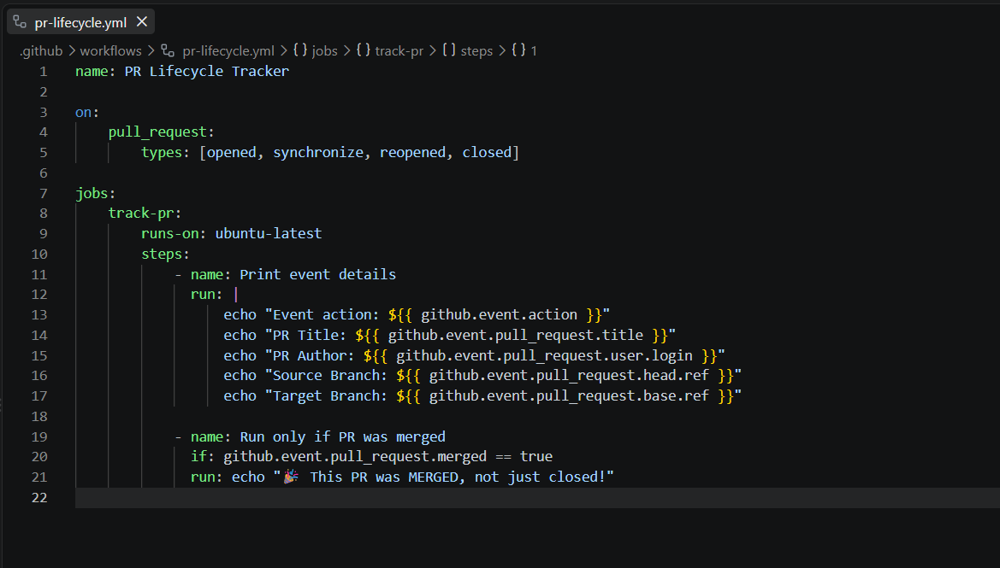

**Creating the test pull request:**
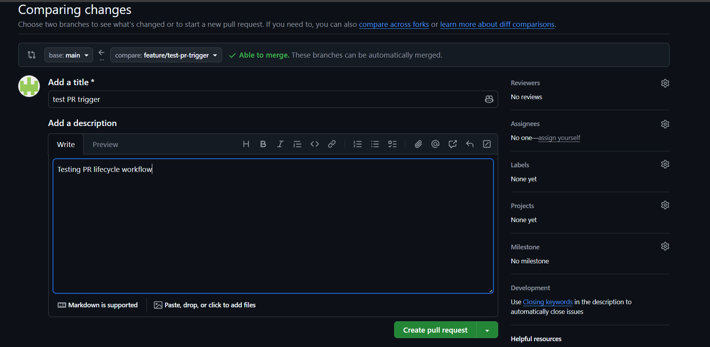

**The "Compare & pull request" banner after pushing a branch:**
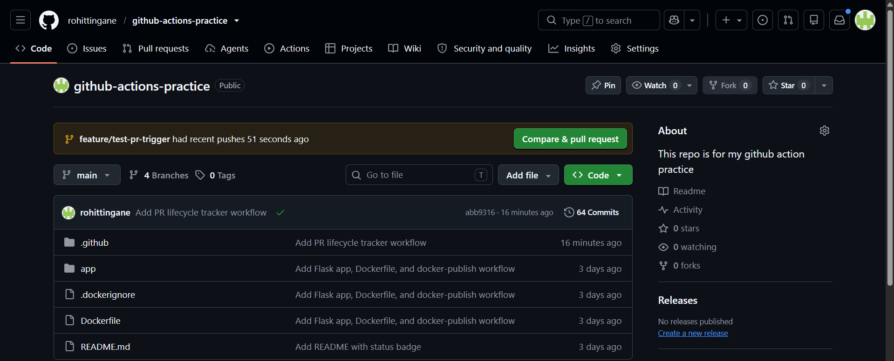

**Workflow run summary when PR was opened:**
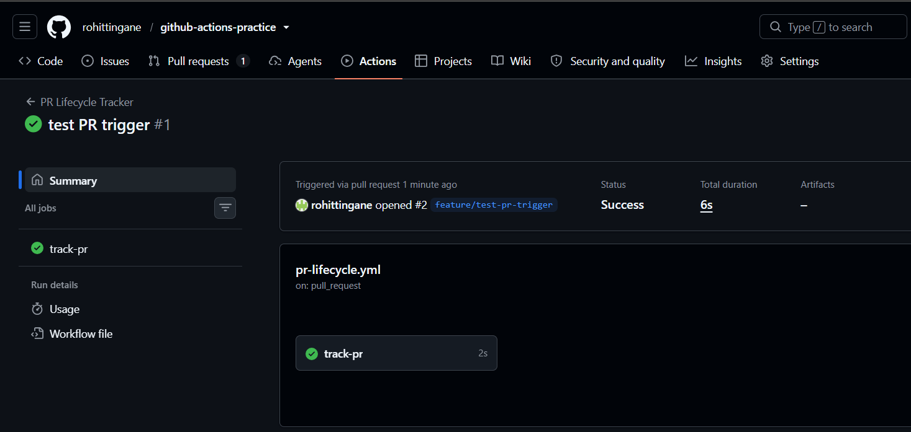

**PR opened — checks passed on the PR page:**
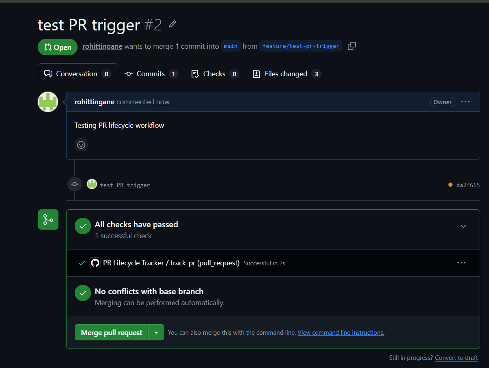

**Logs showing the `opened` event details:**
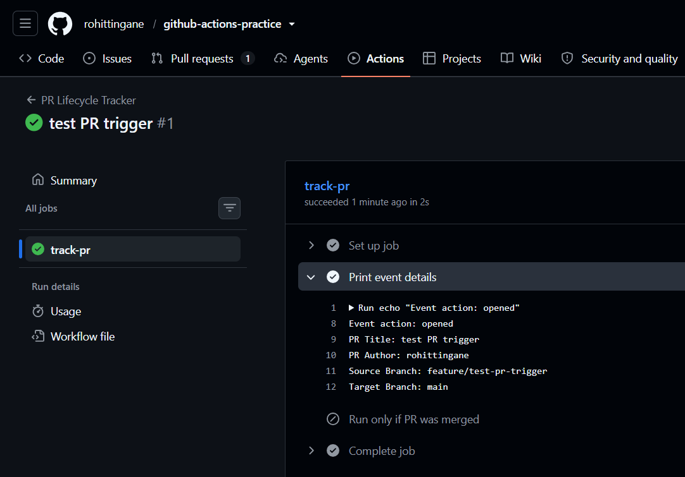

**Logs showing the `synchronize` event after a second push:**
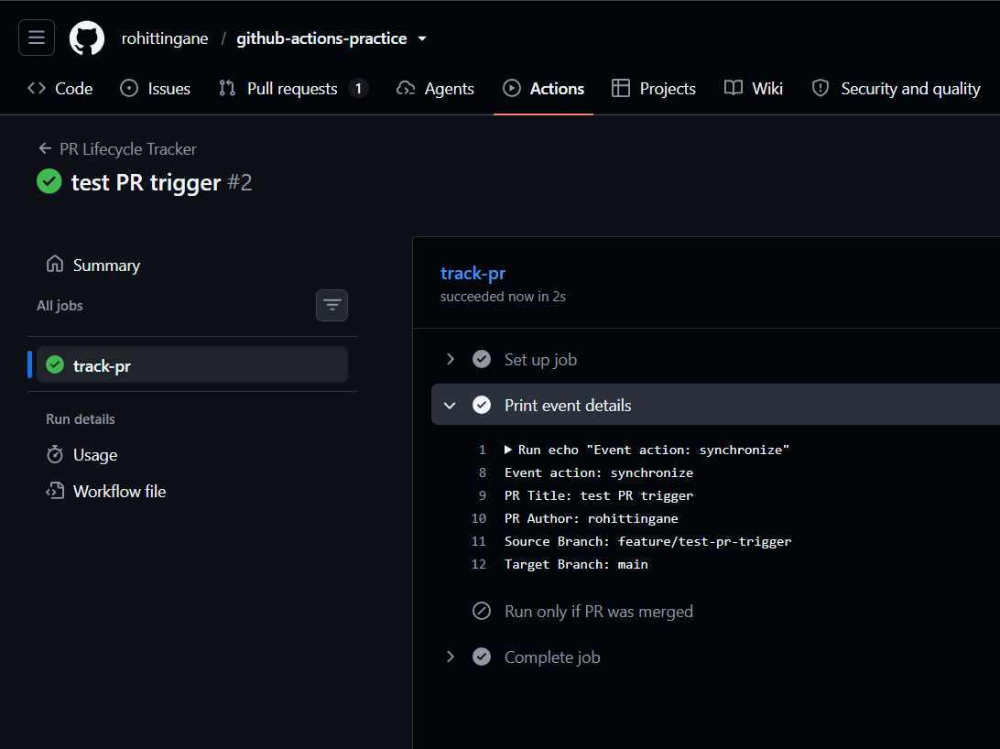

**PR ready to merge:**
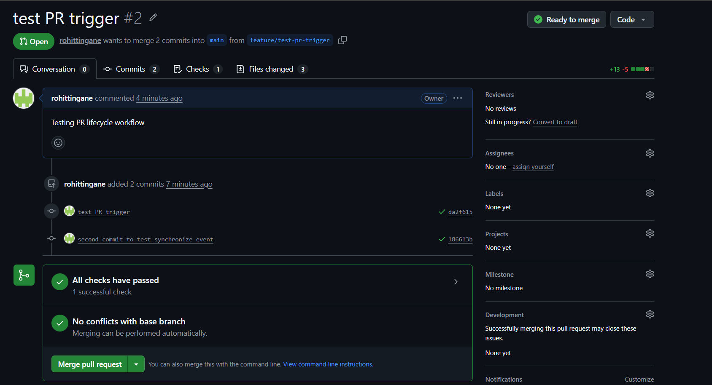

**PR merged successfully:**
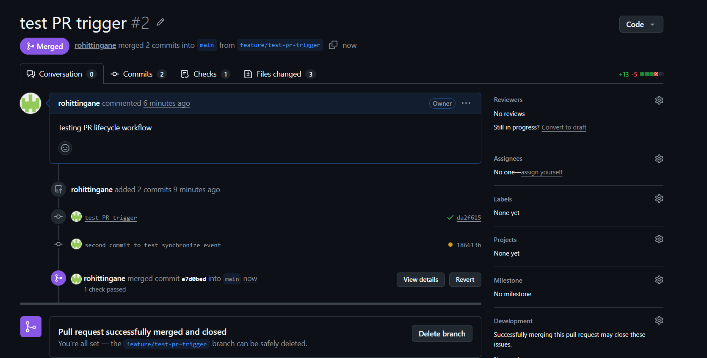

**Workflow run summary when PR was closed/merged:**
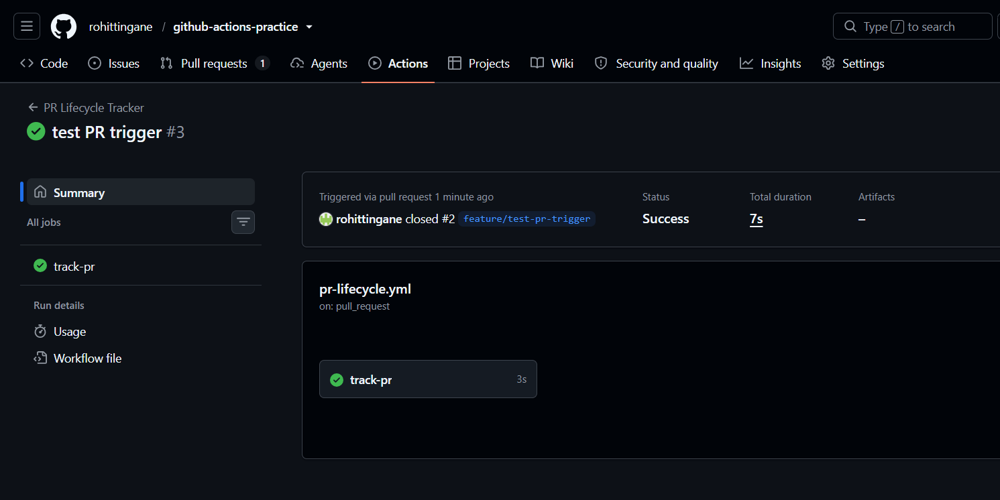

**Logs showing `closed` event + the merged-only step running:**
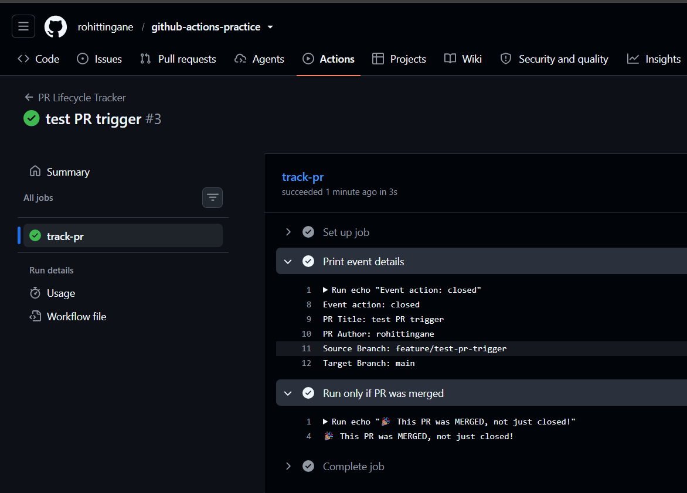

---

## Task 2: PR Validation Workflow (PR Gate)

### What this does
This creates automatic checks that run on every Pull Request, before it's allowed to merge. This is called a "PR gate" — a set of rules a PR must pass.

### Why we use this
In real companies, you don't want broken code, huge files, or unclear PRs getting merged into `main`. Automated checks catch these problems before a human reviewer even looks at the code.

### File to create
```
.github/workflows/pr-checks.yml
```

### Full Code
```yaml
name: PR Validation Checks

on:
  pull_request:
    branches: [main]

jobs:
  file-size-check:
    runs-on: ubuntu-latest
    steps:
      - uses: actions/checkout@v4
      - name: Check file sizes
        run: find . -type f -size +1M -not -path "./.git/*" | grep . && exit 1 || echo "All files under 1MB"

  branch-name-check:
    runs-on: ubuntu-latest
    steps:
      - name: Validate branch name
        run: |
          echo "Branch: ${{ github.head_ref }}"
          [[ "${{ github.head_ref }}" =~ ^(feature|fix|docs)/ ]] && echo "Valid branch name" || (echo "Invalid branch name" && exit 1)

  pr-body-check:
    runs-on: ubuntu-latest
    steps:
      - name: Check PR description
        run: |
          if [ -z "${{ github.event.pull_request.body }}" ]; then
            echo "PR description is empty!"
          else
            echo "PR description present"
          fi
```

### Code Explanation
- `on: pull_request: branches: [main]` — this workflow only runs for PRs targeting the `main` branch.
- **file-size-check job:**
  - `find . -type f -size +1M -not -path "./.git/*"` searches for any file bigger than 1MB, ignoring the internal `.git` folder.
  - `| grep .` checks if anything was found (grep matches any non-empty line).
  - `&& exit 1 || echo "..."` — this is a shortcut for if/else in one line: if a big file was found (`grep .` succeeds), exit with failure (`exit 1`); otherwise print a success message.
- **branch-name-check job:**
  - `github.head_ref` gives the name of the source branch of the PR.
  - `[[ "$BRANCH" =~ ^(feature|fix|docs)/ ]]` is a regex check — the branch name must start with `feature/`, `fix/`, or `docs/`.
  - If it doesn't match, the job fails.
- **pr-body-check job:**
  - Checks if the PR description (`github.event.pull_request.body`) is empty.
  - If empty, it only prints a warning — it does **not** fail the job (`exit 1` is not used here). This is a "soft" check, not a blocking one.

### Commands to run
```bash
git add .github/workflows/pr-checks.yml
git commit -m "Add PR validation checks workflow"
git push origin main
```

### How to test — step by step

**Test A: Invalid branch name (should FAIL branch-name-check)**
```bash
git checkout main
git pull origin main
git checkout -b mybranch
```
Edit README.md (add any line), then:
```bash
git add .
git commit -m "test invalid branch name"
git push origin mybranch
```
Go to GitHub → **Compare & pull request** → Create PR (base: main, compare: mybranch).
Go to the PR page → Checks tab → you should see:
- `branch-name-check` → FAILED (red X) — because "mybranch" doesn't start with feature/fix/docs
- `file-size-check` → PASSED
- `pr-body-check` → PASSED

**Test B: Large file (should FAIL file-size-check)**
```bash
git checkout main
git checkout -b feature/test-large-file
```
Create a 2MB file. On Windows PowerShell:
```powershell
fsutil file createnew bigfile.dat 2097152
```
On Linux/Mac:
```bash
dd if=/dev/zero of=bigfile.dat bs=1M count=2
```
Then:
```bash
git add .
git commit -m "test large file check"
git push origin feature/test-large-file
```
Create the PR on GitHub. You should see:
- `file-size-check` → FAILED
- `branch-name-check` → PASSED (name is valid this time)
- `pr-body-check` → PASSED (but check its logs for the warning if description was left empty)

**Test C: Empty PR description (should show warning, but still PASS)**
Open any PR without writing a description. Click on the `pr-body-check` job logs — you'll see:
```
PR description is empty!
```
but the job still shows green (success), because we only warn, we don't fail.

### Result
All three checks behave as intended: two are strict (fail the build), one is a soft warning.

### Screenshots

**The pr-checks.yml workflow file in the editor:**
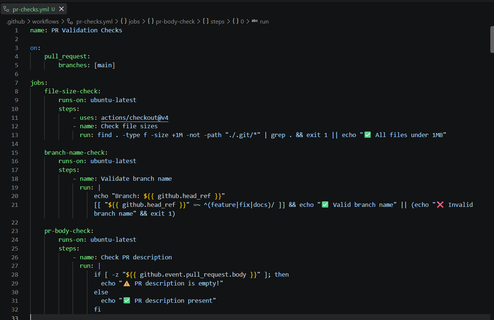

**"Compare & pull request" banner for the invalid branch name test:**
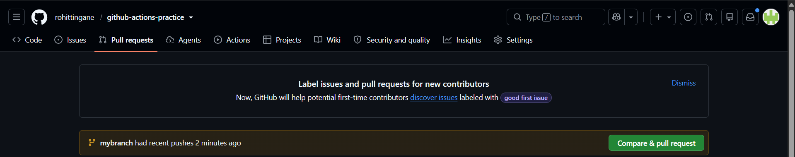

**branch-name-check failing on an invalid branch name:**
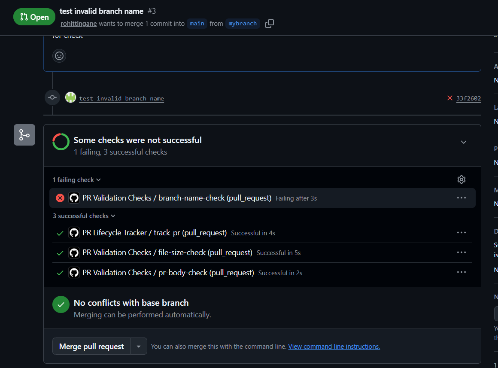

**file-size-check failing on a 2MB test file:**
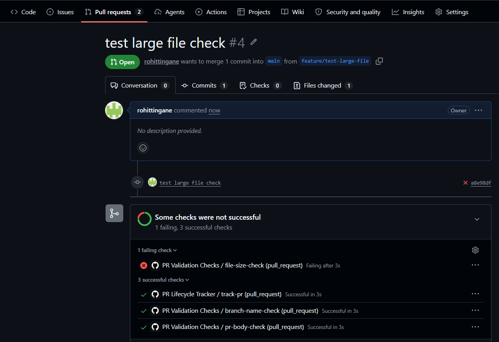

**pr-body-check passing but printing a warning for an empty description:**
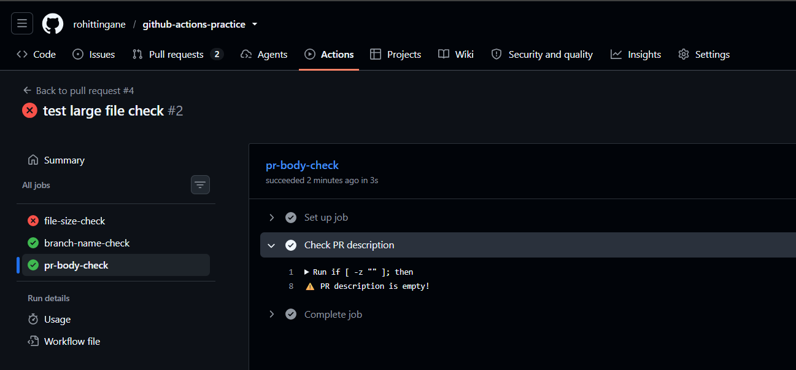

---

## Task 3: Scheduled Workflows (Cron)

### What this does
This workflow runs automatically at specific times, without anyone pushing code or opening a PR. This is done using "cron" — a time-based scheduling syntax.

### Why we use this
Useful for things like nightly backups, periodic health checks, cleanup jobs, or reports that need to run on a fixed schedule instead of being triggered by a code change.

### File to create
```
.github/workflows/scheduled-tasks.yml
```

### Full Code
```yaml
name: Scheduled Tasks

on:
  schedule:
    - cron: '30 2 * * 1'
    - cron: '0 */6 * * *'
  workflow_dispatch:

jobs:
  scheduled-job:
    runs-on: ubuntu-latest
    steps:
      - name: Show which schedule triggered
        run: |
          echo "Triggered by schedule: ${{ github.event.schedule }}"

      - name: Health check
        run: |
          response=$(curl -s -o /dev/null -w "%{http_code}" https://api.github.com)
          echo "Health check response code: $response"
          if [ "$response" -ne 200 ]; then
            echo "Health check failed!"
            exit 1
          else
            echo "Health check passed!"
          fi
```

### Code Explanation
- **Cron syntax format:** `minute hour day-of-month month day-of-week`
- `'30 2 * * 1'` → minute 30, hour 2, any day of month, any month, day-of-week 1 (Monday). Meaning: **every Monday at 2:30 AM UTC**.
- `'0 */6 * * *'` → minute 0, every 6 hours, any day/month/weekday. Meaning: **every 6 hours** (12 AM, 6 AM, 12 PM, 6 PM UTC).
- **Important:** GitHub Actions cron always runs in **UTC time**, not your local timezone. India (IST) is UTC + 5:30.
- `workflow_dispatch:` — this is added so we can manually trigger the workflow from the GitHub UI instead of waiting for the scheduled time. Very useful for testing.
- `github.event.schedule` — tells you which of the cron entries triggered this specific run. When you trigger manually with `workflow_dispatch`, this value is empty (blank), because no schedule fired it.
- The health check step uses `curl` to ping `https://api.github.com` and checks if the response code is 200 (OK). If not 200, the job fails.

### Cron cheat sheet (answers required for notes)
- Every weekday at 9 AM IST → `30 3 * * 1-5` (9:00 AM IST minus 5:30 = 3:30 AM UTC, weekdays only = Mon–Fri = 1-5)
- First day of every month at midnight → `0 0 1 * *`

### Why scheduled workflows may be delayed or skipped
GitHub runs thousands of scheduled workflows across all repos at the same time. To save resources, GitHub gives **lower priority** to workflows in repositories that have been inactive for a while. This means the exact scheduled time might be delayed by a few minutes, or in rare cases, a run might be skipped entirely. For critical scheduled tasks in production, many teams don't rely purely on GitHub's cron — they use external schedulers instead.

### Commands to run
```bash
git add .github/workflows/scheduled-tasks.yml
git commit -m "Add scheduled workflow with cron triggers"
git push origin main
```

### How to test — step by step

Since waiting for the actual cron time is impractical, use manual trigger:

1. Go to your repo on GitHub → click **Actions** tab.
2. In the left sidebar, click **Scheduled Tasks**.
3. Click the **Run workflow** dropdown button (top right).
4. Make sure branch is `main`, then click the green **Run workflow** button.
5. Refresh the page — a new run will appear. Click on it.
6. Click the **scheduled-job** → open both steps:
   - "Show which schedule triggered" → will show: `Triggered by schedule:` (empty, because this was a manual run)
   - "Health check" → will show: `Health check response code: 200` and `Health check passed!`

### Result
The manual trigger worked, confirming the workflow logic is correct. The actual cron schedules will fire automatically at their set times (Monday 2:30 AM UTC and every 6 hours).

### Screenshots

**The scheduled-tasks.yml workflow file in the editor:**
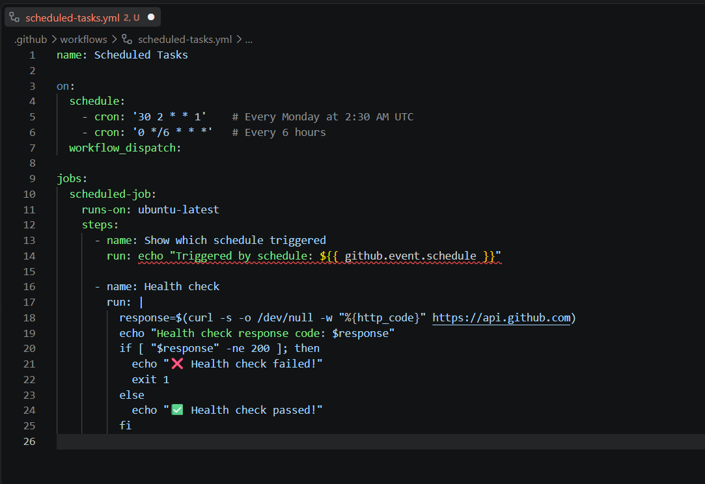

**The "Run workflow" button available because of workflow_dispatch:**
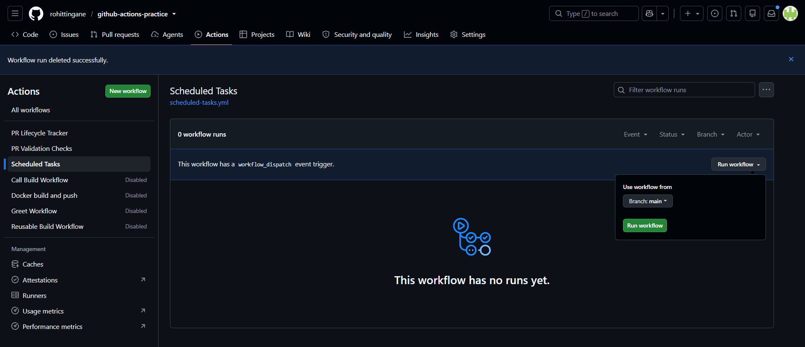

**Manual run completed successfully:**
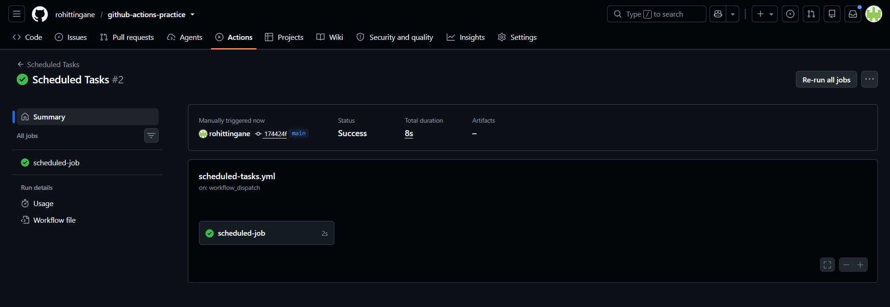

**Logs showing the schedule value and health check result:**
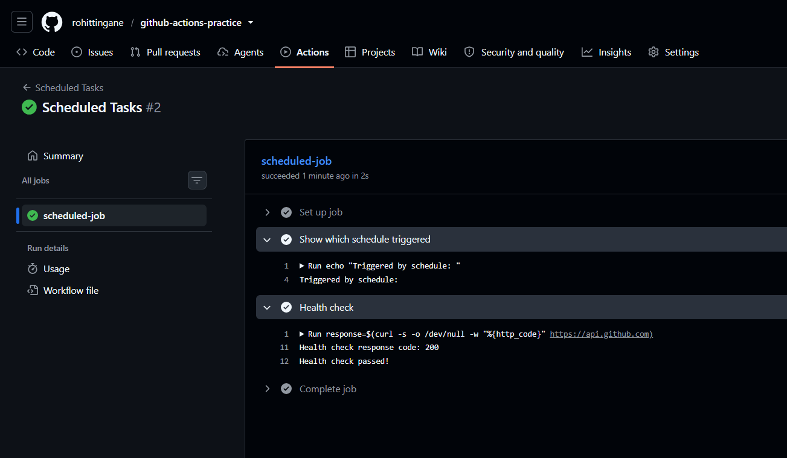

---

## Task 4: Path & Branch Filters

### What this does
Normally, a workflow set to run `on: push` runs for EVERY push, no matter what file changed. Path filters let you control this — running a workflow only when specific folders/files change (or skip it when only certain files change).

### Why we use this
Imagine a repo with both application code (`src/`, `app/`) and documentation (`docs/`, `README.md`). If someone only fixes a typo in the README, you don't want to waste time and CI minutes running the full build/test/deploy pipeline. Path filters solve this.

### `paths` vs `paths-ignore`
- **`paths`** = "ONLY run if these specific paths changed" (whitelist — strict)
- **`paths-ignore`** = "run for everything EXCEPT these paths" (blacklist — permissive)

### File 1 to create
```
.github/workflows/smart-triggers.yml
```

```yaml
name: Smart Triggers

on:
  push:
    branches:
      - main
      - 'release/*'
    paths:
      - 'src/**'
      - 'app/**'

jobs:
  notify-src-change:
    runs-on: ubuntu-latest
    steps:
      - name: Show trigger info
        run: |
          echo "Triggered on branch: ${{ github.ref_name }}"
          echo "This ran because src/ or app/ changed"
```

### File 2 to create
```
.github/workflows/skip-docs-changes.yml
```

```yaml
name: Skip Docs Changes

on:
  push:
    branches:
      - main
      - 'release/*'
    paths-ignore:
      - '*.md'
      - 'docs/**'

jobs:
  build-job:
    runs-on: ubuntu-latest
    steps:
      - name: Show trigger info
        run: |
          echo "Triggered on branch: ${{ github.ref_name }}"
          echo "This did NOT run for docs-only changes"
```

### Code Explanation
- `branches: [main, 'release/*']` — runs only on pushes to `main` or any branch starting with `release/` (like `release/v1`, `release/v2`).
- `paths: ['src/**', 'app/**']` — the `**` means "this folder and any folder inside it, at any depth." So `app/utils/helper.py` also counts as a match.
- `paths-ignore: ['*.md', 'docs/**']` — skips the run only if ALL changed files are `.md` files or inside `docs/`. If even one other file also changed, the workflow still runs.
- `github.ref_name` — gives just the branch name (e.g. `main`) instead of the full ref path (`refs/heads/main`).
- Both workflows cannot combine `paths` and `paths-ignore` in the same trigger block — that's why we made two separate files.

### Commands to run
```bash
git add .github/workflows/smart-triggers.yml .github/workflows/skip-docs-changes.yml
git commit -m "Add path filter workflows"
git push origin main
```

### How to test — step by step

**Test A: Only change README.md**
```bash
echo "test docs change" >> README.md
git add .
git commit -m "docs: update readme"
git push origin main
```
Go to Actions tab → check both workflows:
- **Smart Triggers** → should show NO new run for this commit (because README.md is not in `src/` or `app/`).
- **Skip Docs Changes** → should also show NO new run for this commit (because `paths-ignore` correctly skipped it).

**Test B: Change a file inside the app/ folder**
Open any file inside your `app/` folder, add a small comment line, save it, then:
```bash
git add .
git commit -m "test app folder trigger"
git push origin main
```
Go to Actions tab → check both workflows:
- **Smart Triggers** → SHOULD run now (because `app/` changed). Open the run, check logs:
  ```
  Triggered on branch: main
  This ran because src/ or app/ changed
  ```
- **Skip Docs Changes** → SHOULD also run (because `app/` is not `.md` or `docs/`). Open the run, check logs:
  ```
  Triggered on branch: main
  This did NOT run for docs-only changes
  ```

### When to use `paths` vs `paths-ignore` (notes answer)
- Use **`paths`** in a large monorepo where you only want CI to run for a specific microservice/folder that actually changed — keeps unrelated services from rebuilding unnecessarily.
- Use **`paths-ignore`** when you want CI to run for almost every change, but just want to skip trivial changes like documentation or README updates.

### Result
Both filters were tested and confirmed to work exactly as designed.

### Screenshots

**Skip Docs Changes — no run triggered for the README-only push (paths-ignore working):**
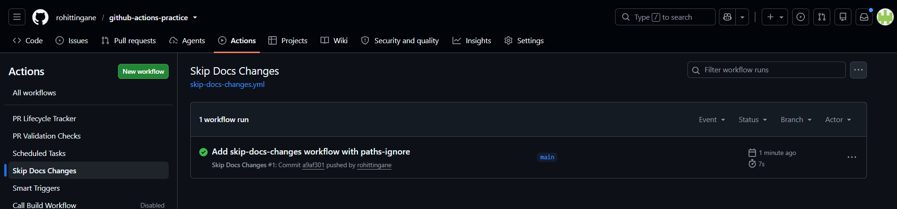

**Smart Triggers — no runs yet, because src/ or app/ hadn't changed:**
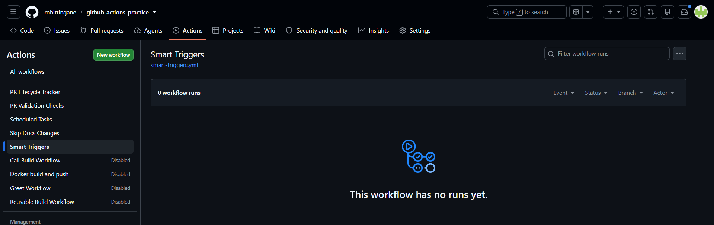

**Smart Triggers — run triggered after changing a file inside app/:**
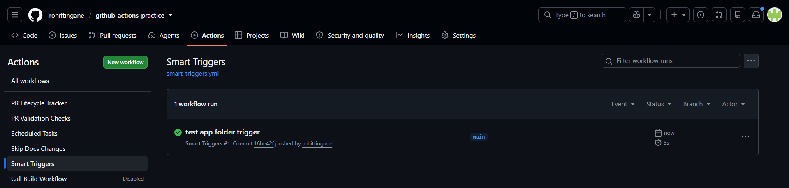

**Logs confirming the branch name and why it ran:**
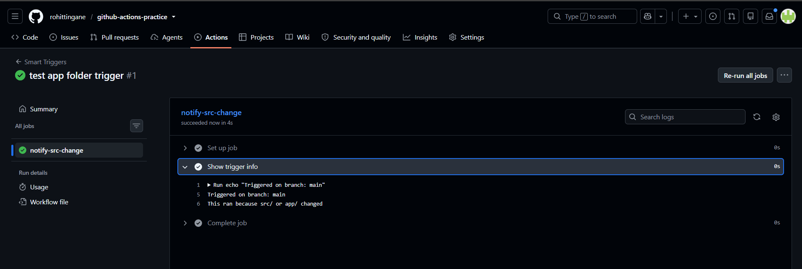

**Skip Docs Changes — also ran for the same app/ folder change (correct, since app/ is not docs):**
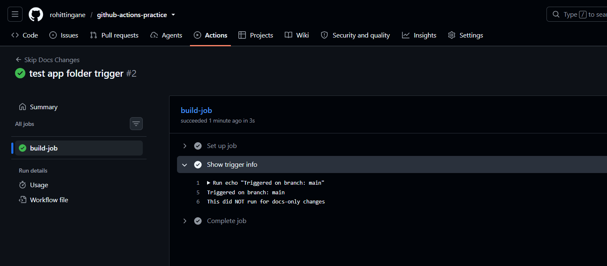

---

## Task 5: workflow_run — Chaining Workflows Together

### What this does
This connects two separate, independent workflow files so that one runs automatically only after another one finishes — and only continues if the first one succeeded.

### Why we use this
Real pipelines have stages: first run tests, then deploy — but only if tests pass. If tests fail, deployment should never happen. `workflow_run` lets you connect completely separate workflow files (even ones maintained by different teams) into this kind of chain.

### `workflow_run` vs `needs`
- `needs:` connects jobs **inside the same workflow file**.
- `workflow_run` connects **two different workflow files** — one reacts to the other's completion.

### File 1 to create
```
.github/workflows/tests.yml
```

```yaml
name: Run Tests

on:
  push:

jobs:
  test:
    runs-on: ubuntu-latest
    steps:
      - name: Run fake tests
        run: |
          echo "Running tests..."
          echo "All tests passed!"
```

### File 2 to create
```
.github/workflows/deploy-after-tests.yml
```

```yaml
name: Deploy After Tests

on:
  workflow_run:
    workflows: ["Run Tests"]
    types: [completed]

jobs:
  deploy:
    runs-on: ubuntu-latest
    if: ${{ github.event.workflow_run.conclusion == 'success' }}
    steps:
      - name: Deploy step
        run: echo "Deploying because tests passed!"

  handle-failure:
    runs-on: ubuntu-latest
    if: ${{ github.event.workflow_run.conclusion == 'failure' }}
    steps:
      - name: Warn and stop
        run: |
          echo "Tests failed! Skipping deployment."
          exit 1
```

### Code Explanation
- `workflows: ["Run Tests"]` — this must exactly match the `name:` field written INSIDE the `tests.yml` file (not the file name). If the spelling or capitalization doesn't match exactly, the connection will not work.
- `types: [completed]` — reacts only when the other workflow has fully finished (success or failure), not when it starts.
- `github.event.workflow_run.conclusion` — tells you the final result of the triggering workflow: `success`, `failure`, `cancelled`, etc.
- Two separate jobs handle two outcomes:
  - `deploy` job only runs if the tests succeeded.
  - `handle-failure` job only runs if the tests failed, and it deliberately exits with `exit 1` so the failure is clearly visible and deployment never happens.
- **Note:** `workflow_run` only reacts to workflows completed on the repository's default branch (usually `main`).

### Commands to run
```bash
git add .github/workflows/tests.yml .github/workflows/deploy-after-tests.yml
git commit -m "Add workflow_run chaining: tests then deploy"
git push origin main
```

### How to test — step by step

**Test A: Success case**
Just push anything to `main` (the above commit itself triggers it).
Go to Actions tab:
1. Click **Run Tests** → confirm it succeeded.
2. Click **Deploy After Tests** (a new run should appear automatically, without you pushing again) → open it → check jobs:
   - `deploy` → SUCCESS, logs show: `Deploying because tests passed!`
   - `handle-failure` → SKIPPED

**Test B: Failure case**
Edit `tests.yml` to force a failure:
```yaml
      - name: Run fake tests
        run: |
          echo "Running tests..."
          echo "Simulating a test failure!"
          exit 1
```
Push it:
```bash
git add .github/workflows/tests.yml
git commit -m "simulate test failure"
git push origin main
```
Go to Actions tab:
1. **Run Tests** → shows FAILED.
2. **Deploy After Tests** → new run appears automatically → check jobs:
   - `deploy` → SKIPPED
   - `handle-failure` → FAILED (intentionally), logs show: `Tests failed! Skipping deployment.`

**Remember to revert `tests.yml`** back to the passing version afterward:
```yaml
      - name: Run fake tests
        run: |
          echo "Running tests..."
          echo "All tests passed!"
```

### `workflow_run` vs `workflow_call` (explained simply)
- **`workflow_run`** — used to react to another workflow AFTER it has already finished. The two workflows are independent and loosely connected — like one workflow "listening" for another's result. Good for connecting workflows owned by different teams.
- **`workflow_call`** — used to directly call another workflow like a reusable function, passing inputs to it and getting outputs back, as part of the SAME run. Good for reusing common steps (like a shared build workflow) across multiple pipelines.

### Result
Both the success chain and the failure chain were tested and behaved exactly as expected.

### Screenshots

**Run Tests — succeeded on push:**
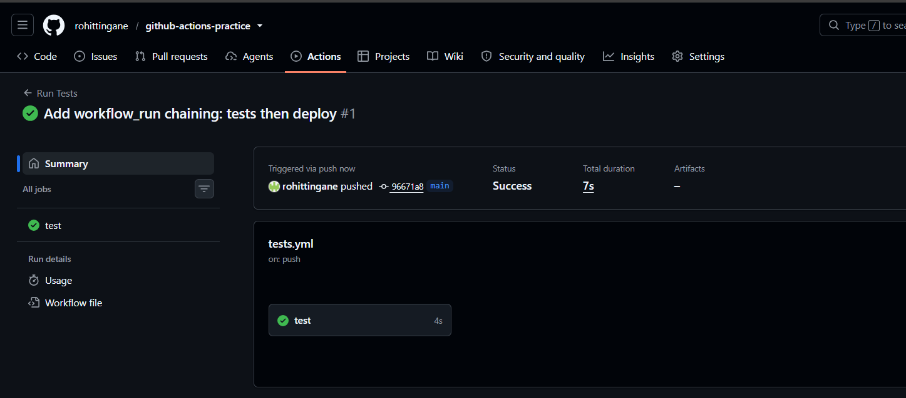

**Logs of the Run Tests job:**
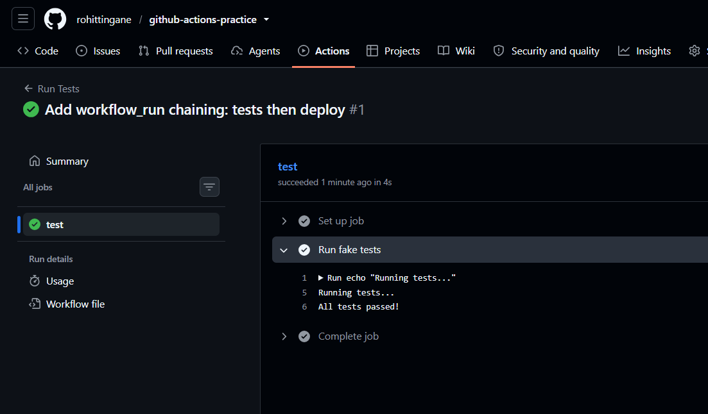

**Deploy After Tests — automatically triggered after Run Tests completed:**
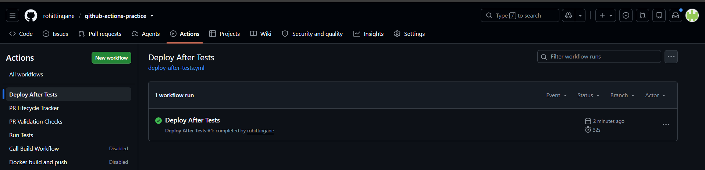

**Summary graph showing the deploy job ran and handle-failure was skipped:**
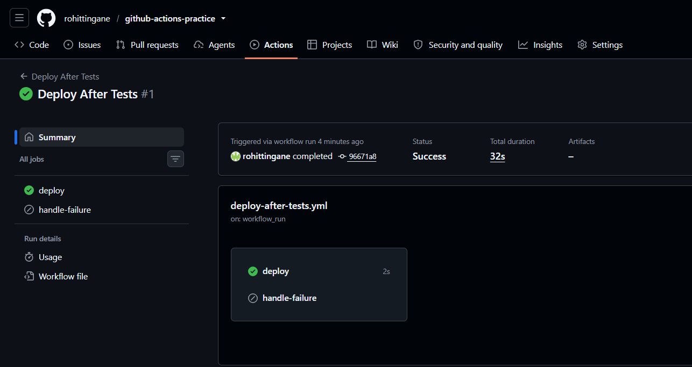

**Logs of the successful deploy job:**
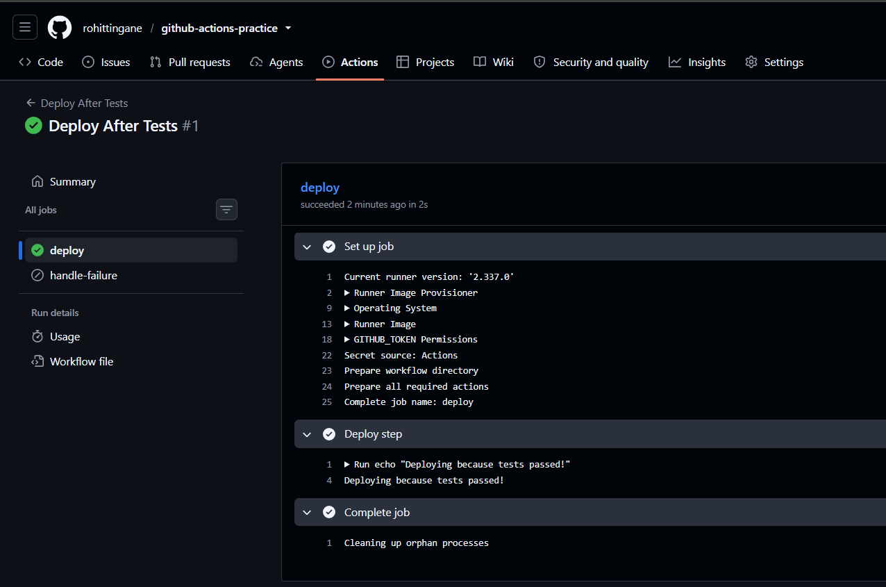

**Run Tests — intentionally failed (exit 1) to test the failure path:**
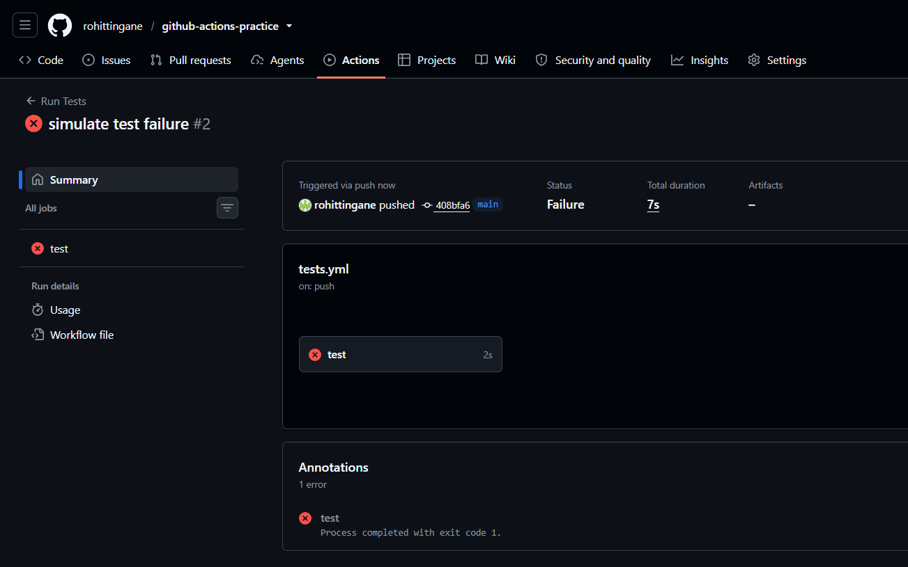

**Deploy After Tests — failure case: deploy skipped, handle-failure ran instead:**
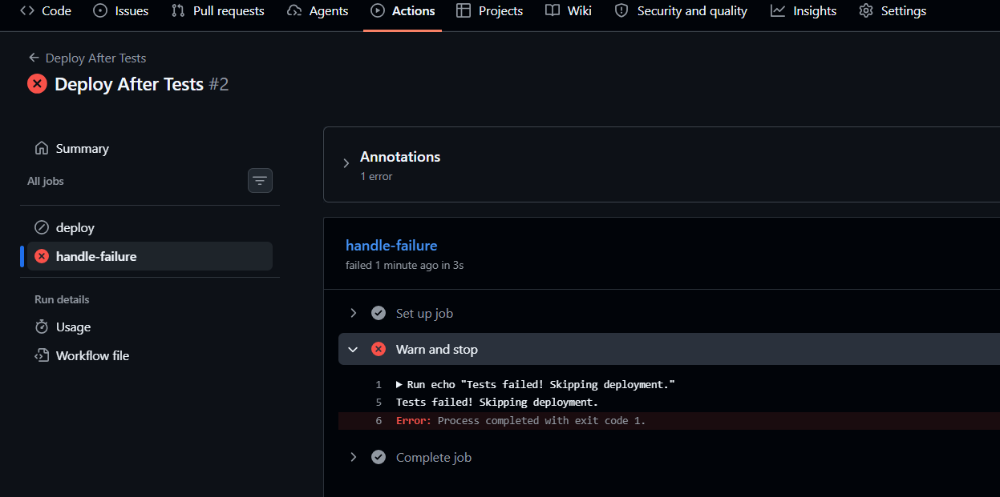

---

## Task 6: repository_dispatch — External Event Triggers

### What this does
This lets a system OUTSIDE of GitHub (a script, a bot, another server, a monitoring tool) trigger a GitHub Actions workflow by sending an HTTP API request — without any human clicking a button in the GitHub UI.

### Why we use this
Useful when you want automation-to-automation communication. For example, a monitoring tool detects a problem and automatically triggers a rollback pipeline, or a Slack bot lets a team member type a command that kicks off a deployment.

### `repository_dispatch` vs `workflow_dispatch`
- `workflow_dispatch` = a HUMAN manually clicks "Run workflow" in the GitHub UI.
- `repository_dispatch` = a PROGRAM/SYSTEM sends an API request to trigger the workflow. There is no "Run workflow" button for this — it can only be triggered via API call.

### File to create
```
.github/workflows/external-trigger.yml
```

### Full Code
```yaml
name: External Trigger

on:
  repository_dispatch:
    types: [deploy-request]

jobs:
  handle-dispatch:
    runs-on: ubuntu-latest
    steps:
      - name: Print payload
        run: |
          echo "Environment: ${{ github.event.client_payload.environment }}"
```

### Code Explanation
- `types: [deploy-request]` — this is a custom name you choose yourself. It acts as a filter: only react to dispatch events tagged with this exact type.
- `client_payload` — this is custom data sent by the external system. Think of it like a function argument. Here we expect it to contain an `environment` field.
- `github.event.client_payload.environment` — reads that data inside the workflow.

### Commands to run
```bash
git add .github/workflows/external-trigger.yml
git commit -m "Add repository_dispatch workflow"
git push origin main
```

### How to trigger it (requires GitHub CLI)

**Step 1: Install GitHub CLI**

Windows (PowerShell):
```powershell
winget install --id GitHub.cli
```
Linux:
```bash
sudo apt install gh -y
```
After installing, close and reopen your terminal completely.

**Step 2: Log in**
```bash
gh auth login
```
Answer the prompts:
- Account: GitHub.com
- Protocol: HTTPS
- Authenticate Git: Yes
- Authentication method: Login with a web browser

Copy the code shown, press Enter, paste the code in the browser, and authorize.

Check it worked:
```bash
gh auth status
```

**Step 3: Trigger the workflow (send the external event)**

On Mac/Linux/Git Bash:
```bash
gh api repos/rohittingane/github-actions-practice/dispatches -f event_type=deploy-request -f client_payload='{"environment":"production"}'
```

On Windows PowerShell (quoting works differently, use this version instead):
```powershell
gh api repos/rohittingane/github-actions-practice/dispatches -f event_type=deploy-request -f client_payload[environment]=production
```
(If PowerShell gives a JSON error, just switch to a Git Bash terminal and run the original command — it handles quotes correctly.)

Replace `rohittingane/github-actions-practice` with your own `<owner>/<repo>`.

A successful call returns no output (this is normal — it means success).

### How to verify it worked
1. Go to your repo → **Actions** tab.
2. Click **External Trigger** in the sidebar.
3. You should see a new run named `deploy-request #1`, triggered via "repository dispatch".
4. Open it → click **handle-dispatch** → open **Print payload** step.
5. You should see:
   ```
   Environment: production
   ```

### When would an external system trigger a pipeline? (notes answer)
- A monitoring tool (like Datadog) detects an error spike in production and automatically triggers a rollback pipeline.
- A Slack bot lets a team member type a command (e.g. `/deploy production`) which triggers the deployment workflow.
- Another CI/CD system (like Jenkins) finishes its job and tells GitHub Actions to run the next stage (e.g., send a notification).
- An external scheduler on a different server triggers a GitHub pipeline at a specific time, outside of GitHub's own cron system.

### Result
Successfully triggered a GitHub Actions workflow from outside GitHub using the GitHub CLI, and confirmed the custom payload data was received correctly.

### Screenshots

**External Trigger workflow run, triggered via repository dispatch:**
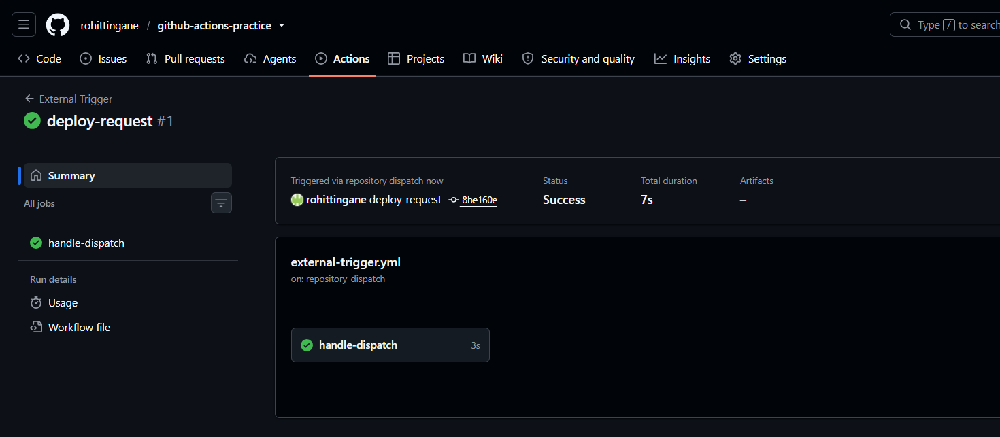

**Logs confirming the client_payload environment value was received:**
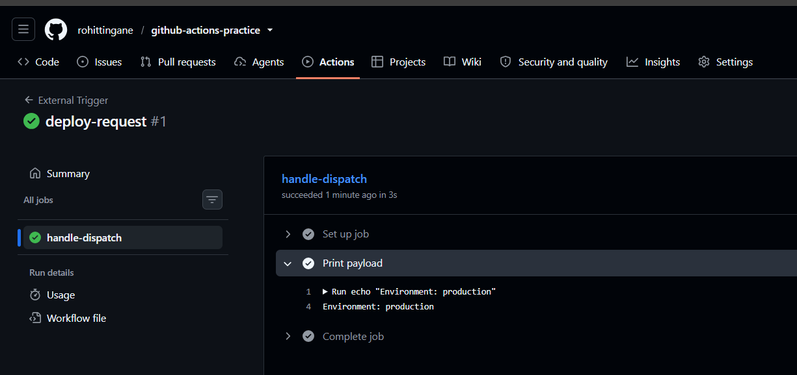

---

## Summary Table

| Task | Workflow File | Trigger Type | Key Concept |
|---|---|---|---|
| 1 | pr-lifecycle.yml | pull_request (opened, synchronize, reopened, closed) | PR event types & merge detection |
| 2 | pr-checks.yml | pull_request | Multi-job PR gate (blocking vs warning checks) |
| 3 | scheduled-tasks.yml | schedule (cron) + workflow_dispatch | Time-based automation, UTC timezone |
| 4 | smart-triggers.yml / skip-docs-changes.yml | push (paths / paths-ignore) | Selective triggering by changed files |
| 5 | tests.yml / deploy-after-tests.yml | push / workflow_run | Chaining independent workflows |
| 6 | external-trigger.yml | repository_dispatch | External system triggers via API |

---

## Submission Checklist

- [ ] All 8 workflow files committed to `.github/workflows/`
- [ ] This file saved as `2026/day-47/day-47-advanced-triggers.md`
- [ ] Screenshots of each task's Actions tab run added to `2026/day-47/`
- [ ] Committed and pushed to fork
- [ ] Shared PR validation workflow on LinkedIn with #90DaysOfDevOps #DevOpsKaJosh #TrainWithShubham

