# Day 48 – GitHub Actions Capstone Project
### End-to-End CI/CD Pipeline for a Flask App

**Repo:** github-actions-capstone
**Docker Hub Image:** rtingane2611/myapp

This document explains **every single file** in this project, **word by word**, in simple English — so that anyone reading it, even a beginner, can understand exactly what was built and why, and could rebuild it themselves.

---

## 1. Project Overview

We built a small Flask web application, wrapped it in Docker, and created a full CI/CD (Continuous Integration / Continuous Deployment) pipeline using GitHub Actions.

The pipeline automatically:
1. Tests the code whenever someone opens a Pull Request (PR)
2. Tests, builds a Docker image, pushes it to Docker Hub, and deploys it whenever code is merged into the `main` branch
3. Checks the app's health every 12 hours automatically

### Architecture Diagram (Text Flow)

```
Developer writes code on their own branch
        |
        v
Opens Pull Request (PR) into main
        |
        v
pr-pipeline.yml runs automatically
        -> calls reusable-build-test.yml
        -> runs tests only (NO Docker build/push here)
        |
        v
Senior reviews the PR, approves it
        |
        v
PR is merged into main
        |
        v
main-pipeline.yml runs automatically
        -> Job 1: calls reusable-build-test.yml (test again, final safety check)
        -> Job 2a: calls reusable-docker.yml (build + push image tagged "latest")
        -> Job 2b: calls reusable-docker.yml (build + push image tagged "sha-<commit>")
        -> Job 3: deploy job (prints deployment message, uses production environment)
        |
        v
Image is live on Docker Hub, deployed to server (EC2)

Separately, every 12 hours:
        health-check.yml runs automatically
        -> pulls latest image, runs it, curls /health, reports pass/fail
```

---

## 2. The Application Files (Written by the Developer)

### 2.1 `app.py`

```python
from flask import Flask, jsonify

app = Flask(__name__)

@app.route("/health", methods=["GET"])
def health():
    return jsonify({"status": "ok"}), 200

if __name__ == "__main__":
    app.run(host="0.0.0.0", port=5000)
```

**Word by word explanation:**

- `from flask import Flask, jsonify` — This line brings in tools from the Flask library. `Flask` lets us create a web application. `jsonify` lets us send back data in JSON format (a standard text format computers use to talk to each other).
- `app = Flask(__name__)` — This creates our actual web application and stores it in a variable called `app`. `__name__` just tells Flask which file it's running from.
- `@app.route("/health", methods=["GET"])` — This line says: "When someone visits the web address `/health` using a GET request (a normal browser visit), run the function right below this line."
- `def health():` — This defines a function named `health`. This function's code runs whenever someone hits the `/health` URL.
- `return jsonify({"status": "ok"}), 200` — This sends back the text `{"status": "ok"}` as the response, along with the number `200`, which is the standard code meaning "everything worked fine."
- `if __name__ == "__main__":` — This is a Python convention meaning "only run the code below if this file is being run directly (not imported by another file)."
- `app.run(host="0.0.0.0", port=5000)` — This actually starts the web server. `host="0.0.0.0"` means "accept connections from anywhere, not just this computer." `port=5000` means "listen on port number 5000."

---

### 2.2 `requirements.txt`

```
flask==3.0.3
```

**Explanation:** This file lists every external package (library) our app needs to run. Here we only need Flask, and we've pinned it to an exact version (`3.0.3`) so that everyone who installs it gets the exact same version — avoiding "it works on my machine but not yours" problems.

---

### 2.3 `README.md`

Basic file describing what the project is, its endpoint, and its tech stack. This is the first thing anyone sees when they open the repo on GitHub.

### Status Badges (Task 7)

At the top of `README.md`, we added five status badges — small images that show whether each workflow's last run passed or failed, without anyone needing to open the Actions tab:

```markdown


```

**Word by word explanation:**

- `![...]` — Standard Markdown syntax for embedding an image. The text inside `[...]` is the alt-text (shown if the image fails to load).
- `https://github.com/rohittingane/github-actions-capstone/actions/workflows/pr-pipeline.yml/badge.svg` — GitHub automatically generates a small SVG image at this exact URL for every workflow file in the repo. The image is always up to date — it reflects the status of that workflow's most recent run.
- `/badge.svg` — The special path GitHub reserves for these auto-generated status images.

**Result:**

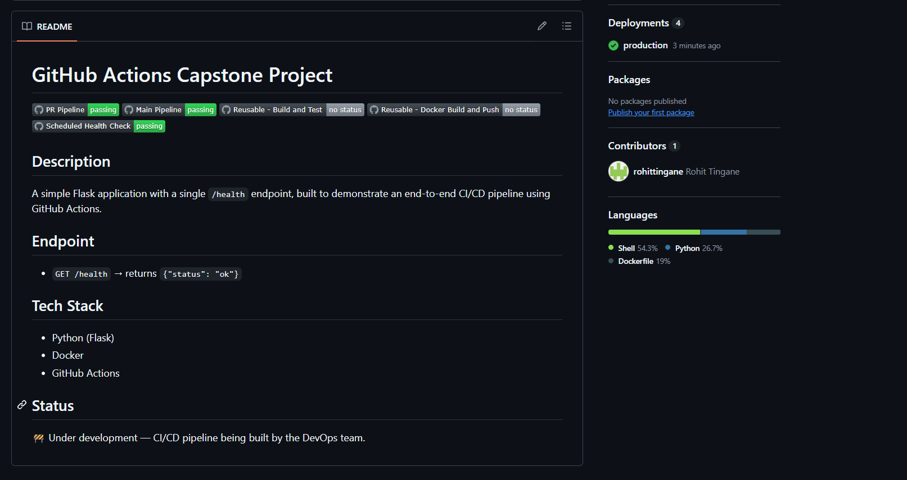
*Three badges show "passing" (PR Pipeline, Main Pipeline, Scheduled Health Check). Two show "no status."*

**Why two badges show "no status" instead of passing/failing:**

`reusable-build-test.yml` and `reusable-docker.yml` are **reusable workflows** — they only have `on: workflow_call` as their trigger, with no `on: push` or `on: pull_request` of their own. GitHub's badge system looks for a direct, standalone run history for that specific workflow file. But reusable workflows never run standalone — they only ever run as a job *inside* another workflow (`pr-pipeline.yml` or `main-pipeline.yml`). So GitHub has no independent run history to generate a pass/fail badge for them, even though they succeed every time they're called. This is expected, normal behavior, not a bug.

We also noticed GitHub automatically tracks our `environment: production` deploy job under the repo's **Deployments** section, showing a green checkmark next to "production" — extra confirmation that the deploy job ran successfully.

---

## 3. `Dockerfile` (Built by DevOps team)

```dockerfile
FROM python:3.9-slim
WORKDIR /app
COPY requirements.txt .
RUN pip install --no-cache-dir -r requirements.txt
COPY . .
EXPOSE 5000
CMD ["python", "app.py"]
```

**Word by word explanation:**

- `FROM python:3.9-slim` — Every Docker image starts from a "base image." We're starting from an official, lightweight (slim) version of Python 3.9. This already has Python installed, so we don't have to install it ourselves.
- `WORKDIR /app` — This creates a folder called `/app` inside the container and says "from now on, treat this as our working folder." Any file we copy or command we run happens inside `/app`.
- `COPY requirements.txt .` — This copies the `requirements.txt` file from our computer into the container's current folder (`.` means "here", which is `/app`). We copy this file first, before the rest of the code, as a smart trick: Docker caches this step, so if only our app code changes later (not our dependencies), Docker doesn't need to reinstall everything from scratch — making rebuilds faster.
- `RUN pip install --no-cache-dir -r requirements.txt` — This runs the command `pip install` inside the container, which reads `requirements.txt` and installs Flask. `--no-cache-dir` tells pip not to save temporary download files, which keeps the final image smaller.
- `COPY . .` — This copies everything else from our project folder (app.py, etc.) into the container's `/app` folder.
- `EXPOSE 5000` — This is documentation for humans and tools: "this container listens on port 5000." It doesn't actually open the port by itself; it's a hint for whoever runs the container later.
- `CMD ["python", "app.py"]` — This is the command that runs automatically when the container starts. It's the same as typing `python app.py` in a terminal — it starts our Flask app.

---

## 4. `test-health.sh` (Built by DevOps team)

```bash
#!/bin/bash

echo "Starting Flask app for testing..."
python app.py &
APP_PID=$!

echo "Waiting for app to start..."
sleep 3

echo "Testing /health endpoint..."
RESPONSE=$(curl -s -o /dev/null -w "%{http_code}" http://127.0.0.1:5000/health)

if [ "$RESPONSE" -eq 200 ]; then
    echo "Health check PASSED (HTTP $RESPONSE)"
    kill $APP_PID
    exit 0
else
    echo "Health check FAILED (HTTP $RESPONSE)"
    kill $APP_PID
    exit 1
fi
```

**Word by word explanation:**

- `#!/bin/bash` — This is called a "shebang." It tells the computer "run this file using the bash program" (bash is a common command-line language on Linux).
- `echo "..."` — Prints a message to the screen, just so we can see what's happening as the script runs.
- `python app.py &` — This starts our Flask app. The `&` at the end means "run this in the background" — so the script doesn't get stuck waiting for the app to finish (which it never would, since it's a server).
- `APP_PID=$!` — This saves the "Process ID" (a unique number) of the app we just started, into a variable called `APP_PID`. We need this number later so we know exactly which process to shut down.
- `sleep 3` — Pauses the script for 3 seconds, giving Flask enough time to fully start up before we try to test it.
- `RESPONSE=$(curl -s -o /dev/null -w "%{http_code}" http://127.0.0.1:5000/health)` — This sends a request to our `/health` endpoint and captures only the HTTP status code (like 200 or 404), throwing away the actual response body (`-o /dev/null` means "send the body to nowhere, we don't need it").
- `if [ "$RESPONSE" -eq 200 ]; then ... else ... fi` — This is an if/else check: "if the status code equals 200, do this; otherwise, do that."
- `kill $APP_PID` — Shuts down the Flask app we started earlier, using its saved Process ID. This cleans up after the test.
- `exit 0` — Tells the operating system "this script succeeded." Anything that runs this script (like GitHub Actions) will see this as a PASS.
- `exit 1` — Tells the operating system "this script failed." GitHub Actions will see this as a FAIL.

---

## 5. `reusable-build-test.yml`

Location: `.github/workflows/reusable-build-test.yml`

```yaml
# This is a REUSABLE workflow — it does NOT run on its own.
# It only runs when another workflow calls it using workflow_call.
name: Reusable - Build and Test

on:
  workflow_call:
    # These are the inputs this workflow can receive from the caller
    inputs:
      python_version:
        required: false          # Not compulsory to provide
        type: string              # Must be text (e.g. "3.9")
        default: '3.9'            # Used if caller doesn't provide a value

      run_tests:
        required: false          # Not compulsory to provide
        type: boolean              # Only true or false allowed
        default: true              # By default, tests will run

jobs:
  build-and-test:
    runs-on: ubuntu-latest        # Run this job on a fresh Ubuntu Linux machine

    # This makes the test result available to OTHER jobs that call this workflow
    outputs:
      test_result: ${{ steps.run_tests_step.outputs.result }}

    steps:
      # Step 1: Bring the repository code onto this virtual machine
      - name: Checkout code
        uses: actions/checkout@v4

      # Step 2: Install Python on this virtual machine
      - name: Set up Python
        uses: actions/setup-python@v5
        with:
          python-version: ${{ inputs.python_version }}   # Uses the input value

      # Step 3: Install all packages listed in requirements.txt (e.g. Flask)
      - name: Install dependencies
        run: pip install -r requirements.txt

      # Step 4: Run the health-check test script (only if run_tests input is true)
      - name: Run tests
        id: run_tests_step          # Naming this step so we can read its output later
        if: ${{ inputs.run_tests == true }}   # Skip this step if run_tests is false
        run: |
          chmod +x test-health.sh              # Give permission to execute the script
          if ./test-health.sh; then            # Run the script
            echo "result=passed" >> $GITHUB_OUTPUT   # Save "passed" if script succeeded
          else
            echo "result=failed" >> $GITHUB_OUTPUT   # Save "failed" if script failed
          fi
```

**Purpose:** This workflow does NOT run on its own. It only runs when another workflow calls it. It exists so we don't repeat the same "build and test" logic in multiple places — write once, reuse everywhere.

**Word by word explanation:**

- `name: Reusable - Build and Test` — A human-readable name shown in the GitHub Actions tab.
- `on: workflow_call:` — This says "this workflow has no trigger of its own. It only starts when another workflow calls it using `workflow_call`."
- `inputs:` — This declares which pieces of information (parameters) this workflow accepts from whoever calls it.
- `python_version:` — The name of the first input.
  - `required: false` — The caller does NOT have to provide this value.
  - `type: string` — The value must be text (not a number or true/false).
  - `default: '3.9'` — If the caller doesn't provide a value, use `'3.9'` automatically. It's in quotes so YAML treats it as text, not a number (otherwise `3.90` could accidentally be misread).
- `run_tests:` — The name of the second input.
  - `required: false` — Optional.
  - `type: boolean` — Only `true` or `false` is allowed.
  - `default: true` — By default, tests will run unless told otherwise.
- `jobs:` — Declares what actual work this workflow does.
- `build-and-test:` — The name we chose for this job.
- `runs-on: ubuntu-latest` — Run this job on a brand-new, temporary virtual computer running the latest version of Ubuntu Linux.
- `outputs:` — This makes information from inside this job available to whichever OTHER job called this workflow.
- `test_result: ${{ steps.run_tests_step.outputs.result }}` — Says "the output named `test_result` for this whole job comes from the step with id `run_tests_step`, specifically its `result` output."
- `steps:` — The list of actions to perform, in order.
- `- name: Checkout code` / `uses: actions/checkout@v4` — Uses an official pre-built GitHub Action whose only job is to copy our repository's code onto this temporary virtual computer, so we have something to work with.
- `- name: Set up Python` / `uses: actions/setup-python@v5` — Uses another official pre-built Action to install Python on this virtual computer.
- `with: python-version: ${{ inputs.python_version }}` — Passes the `python_version` input (that we defined above) into this action, so the correct Python version gets installed.
- `- name: Install dependencies` / `run: pip install -r requirements.txt` — Runs a direct terminal command: install every package listed in `requirements.txt` (this installs Flask).
- `- name: Run tests` — The name of this step.
- `id: run_tests_step` — Gives this step a unique "ID" (like a roll number), so we can refer to its output later.
- `if: ${{ inputs.run_tests == true }}` — Only run this step if the `run_tests` input is `true`. If it's `false`, this whole step is skipped.
- `run: |` — The pipe symbol `|` means "the following block contains multiple lines of commands to run in sequence."
- `chmod +x test-health.sh` — Gives our script file "permission to execute" (Linux requires this before a script file can be run).
- `if ./test-health.sh; then ... else ... fi` — Runs the test script. If it succeeds (exit code 0), do one thing; if it fails (exit code 1), do another.
- `echo "result=passed" >> $GITHUB_OUTPUT` — Writes the text "result=passed" into a special GitHub file used to store this step's output, so other parts of the workflow (or other jobs) can read it later.
- `echo "result=failed" >> $GITHUB_OUTPUT` — Same idea, but records failure instead.

---

## 6. `reusable-docker.yml`

Location: `.github/workflows/reusable-docker.yml`

```yaml
# This is a REUSABLE workflow — it does NOT run on its own.
# It only runs when another workflow calls it using workflow_call.
name: Reusable - Docker Build and Push

on:
  workflow_call:
    # These values MUST be provided by the caller — no default exists
    inputs:
      image_name:
        required: true          # Compulsory — e.g. "myapp"
        type: string
      tag:
        required: true          # Compulsory — e.g. "latest" or "sha-abc123"
        type: string

    # Secrets are sensitive values (never shown in logs)
    secrets:
      docker_username:
        required: true          # Docker Hub username
      docker_token:
        required: true          # Docker Hub password/token

jobs:
  docker-build-push:
    runs-on: ubuntu-latest

    # This makes image_url available to OTHER jobs that call this workflow
    outputs:
      image_url: ${{ steps.set_output.outputs.image_url }}

    steps:
      # Step 1: Bring the repository code onto this virtual machine
      - name: Checkout code
        uses: actions/checkout@v4

      # Step 2: Log in to Docker Hub using the secrets provided
      - name: Log in to Docker Hub
        uses: docker/login-action@v3
        with:
          username: ${{ secrets.docker_username }}
          password: ${{ secrets.docker_token }}

      # Step 3: Build the Docker image using the Dockerfile, then push it to Docker Hub
      - name: Build and push Docker image
        run: |
          docker build -t ${{ secrets.docker_username }}/${{ inputs.image_name }}:${{ inputs.tag }} .
          docker push ${{ secrets.docker_username }}/${{ inputs.image_name }}:${{ inputs.tag }}

      # Step 4: Save the full image path so the next job (deploy) can use it
      - name: Set output
        id: set_output
        run: |
          echo "image_url=${{ secrets.docker_username }}/${{ inputs.image_name }}:${{ inputs.tag }}" >> $GITHUB_OUTPUT
```

**Purpose:** Also a reusable workflow (only runs when called). Builds our Docker image and pushes it to Docker Hub so it can be pulled and run anywhere.

**Word by word explanation of the NEW parts (not already explained above):**

- `image_name:` / `tag:` — Both are `required: true`, meaning the caller MUST provide these — there is no safe default value that makes sense for every situation (unlike Python version, an image name or tag is always specific to that particular build).
- `secrets:` — A separate block from `inputs:`, used specifically for sensitive information like passwords and tokens. GitHub treats anything declared here specially: it's encrypted, and it's automatically hidden from logs so nobody can accidentally see it.
- `docker_username:` / `docker_token:` — The two secret values this workflow needs to log into Docker Hub. Both `required: true`.
- `uses: docker/login-action@v3` — An official Action made by Docker, whose only job is to log in to Docker Hub using the given username and password/token.
- `username: ${{ secrets.docker_username }}` / `password: ${{ secrets.docker_token }}` — Fill in the login form using the secret values passed to this workflow.
- `docker build -t <name>:<tag> .` — Builds a Docker image using our `Dockerfile`. `-t` means "tag it with this name" so we can identify it later. The final `.` means "look for the Dockerfile in the current folder."
- `docker push <name>:<tag>` — Uploads the image we just built to Docker Hub, making it available for anyone (with permission) to download.
- `${{ secrets.docker_username }}/${{ inputs.image_name }}:${{ inputs.tag }}` — This builds the full image name by joining three pieces together, following Docker's naming rules: `username/imagename:tag`. Example: `rtingane2611/myapp:latest`.
- `- name: Set output` / `id: set_output` — A final step that saves the full image path so the next job in the pipeline (the deploy job) can know exactly which image was just pushed, without having to guess or rebuild the name itself.

---

## 7. `pr-pipeline.yml`

Location: `.github/workflows/pr-pipeline.yml`

```yaml
# This workflow runs automatically when someone opens a PR to main,
# or pushes new commits to an existing PR.
name: PR Pipeline

on:
  pull_request:
    branches:
      - main            # Only trigger for PRs targeting the main branch
    types:
      - opened          # Trigger when a new PR is opened
      - synchronize     # Trigger when new commits are pushed to the PR

jobs:
  # Job 1: Call the reusable build-test workflow (from our own repo)
  call-build-test:
    uses: ./.github/workflows/reusable-build-test.yml
    with:
      python_version: '3.9'   # Explicitly stated, even though it's the default
      run_tests: true          # Tests must always run on a PR

  # Job 2: Runs ONLY after call-build-test succeeds, prints a summary message
  pr-comment:
    needs: call-build-test    # Wait for call-build-test to finish first
    runs-on: ubuntu-latest
    steps:
      - name: Print summary
        run: 'echo "PR checks passed for branch: ${{ github.head_ref }}"'
```

**Purpose:** This is NOT a reusable workflow — it runs on its own, automatically, whenever someone opens or updates a Pull Request targeting `main`. Its job is to test the proposed code BEFORE it's allowed to merge. It never builds or pushes Docker images, since the code isn't approved yet.

**Word by word explanation of the NEW parts:**

- `on: pull_request:` — This workflow triggers based on Pull Request activity (not on direct pushes).
- `branches: - main` — Only trigger if the PR is targeting the `main` branch. PRs aimed at other branches are ignored.
- `types: - opened - synchronize` — Trigger on two specific events: `opened` (a brand-new PR was created) and `synchronize` (new commits were pushed to an already-open PR).
- `call-build-test:` — Our first job's name. It calls the reusable build-test workflow, passing `python_version` and `run_tests` values explicitly (even though they match the defaults, writing them out makes the intent clear to anyone reading the file).
- `pr-comment:` — Our second job.
- `needs: call-build-test` — This job will only start after `call-build-test` finishes successfully. If the test job fails, this job is skipped entirely.
- `run: 'echo "PR checks passed for branch: ${{ github.head_ref }}"'` — Prints a message stating which branch the PR came from. `github.head_ref` is a built-in piece of information GitHub automatically provides — the name of the branch the Pull Request originated from. The whole command is wrapped in single quotes because the double-curly-brace syntax `${{ }}` can otherwise confuse the YAML file format.

**Screenshots — PR Pipeline in action:**

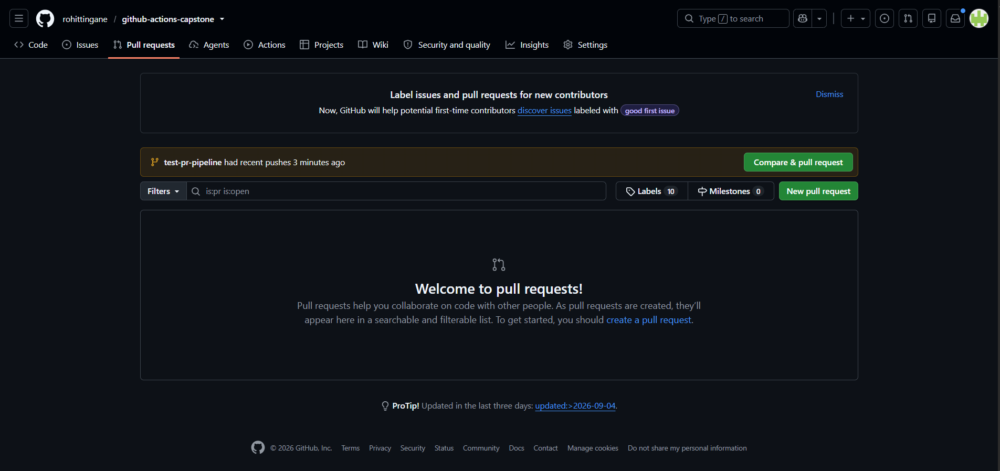
*GitHub detecting the new branch and suggesting "Compare & pull request."*

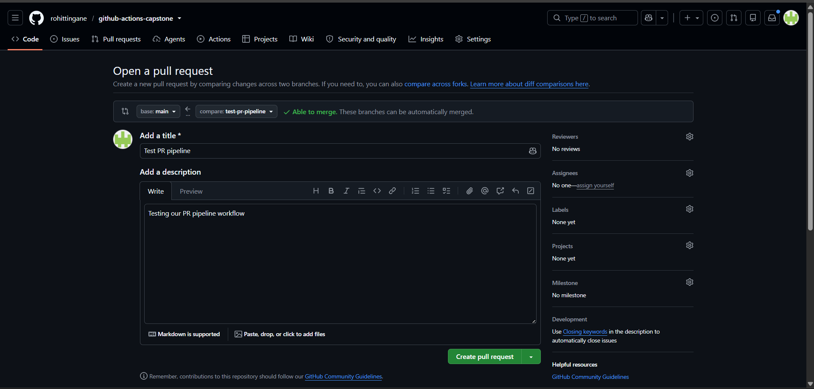
*PR title and description filled in, ready to create.*

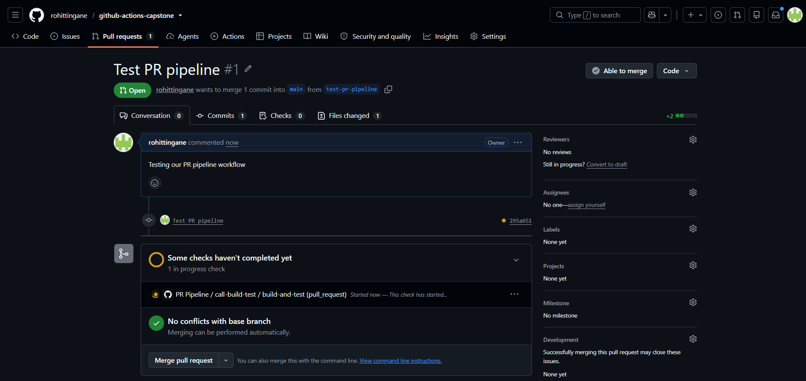
*The pr-pipeline.yml workflow starting automatically right after the PR was opened.*

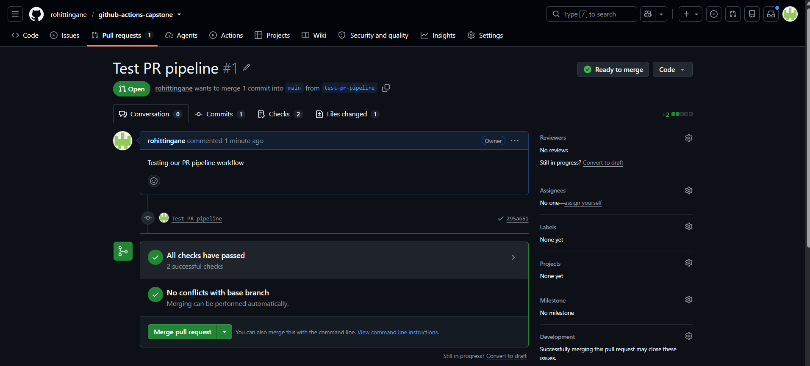
*Both jobs (call-build-test and pr-comment) finished successfully — PR marked "Ready to merge."*

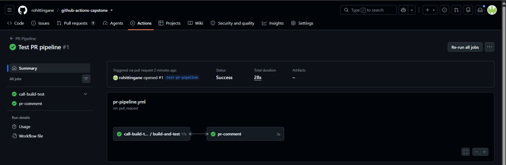
*Visual flow showing call-build-test finishing before pr-comment starts, proving the `needs:` dependency worked.*

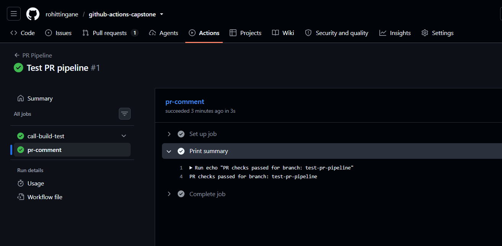
*Actual log output: "PR checks passed for branch: test-pr-pipeline" — proof that `github.head_ref` worked correctly.*

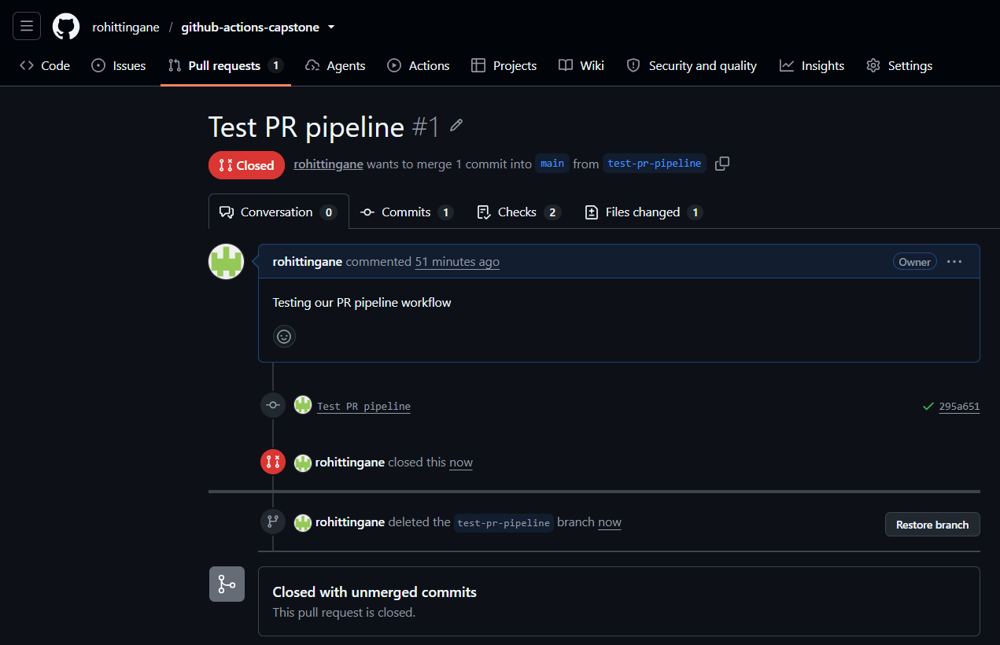
*The test PR closed (not merged) and its branch deleted afterward, keeping main clean for testing main-pipeline.yml separately.*

---

## 8. `main-pipeline.yml`

Location: `.github/workflows/main-pipeline.yml`

```yaml
# This workflow runs automatically when code is pushed to the main branch
# (including when a PR is merged, since that creates a push to main).
name: Main Pipeline

on:
  push:
    branches:
      - main            # Only trigger for pushes to the main branch

jobs:
  # Job 1: Run tests again as a final safety check before deployment
  test:
    uses: ./.github/workflows/reusable-build-test.yml
    with:
      python_version: '3.9'
      run_tests: true

  # Job 2a: Build and push the Docker image tagged as "latest"
  docker-latest:
    needs: test                          # Wait for tests to pass first
    uses: ./.github/workflows/reusable-docker.yml
    with:
      image_name: myapp
      tag: latest
    secrets:
      docker_username: ${{ secrets.DOCKER_USERNAME }}
      docker_token: ${{ secrets.DOCKER_TOKEN }}

  # Job 2b: Build and push the same image tagged with the commit SHA
  # (this allows rollback to this exact version later)
  docker-sha:
    needs: test                          # Wait for tests to pass first
    uses: ./.github/workflows/reusable-docker.yml
    with:
      image_name: myapp
      tag: sha-${{ github.sha }}
    secrets:
      docker_username: ${{ secrets.DOCKER_USERNAME }}
      docker_token: ${{ secrets.DOCKER_TOKEN }}

  # Job 3: Deploy to production (only after BOTH docker jobs succeed)
  deploy:
    needs: [docker-latest, docker-sha]   # Wait for both image pushes to finish
    runs-on: ubuntu-latest
    environment: production               # Can require manual approval (set in repo Settings)
    steps:
      - name: Deploy application
        run: 'echo "Deploying image: ${{ needs.docker-latest.outputs.image_url }} to production"'
```

**Purpose:** This runs automatically whenever code is pushed to `main` (including when a Pull Request is merged, since a merge technically creates a push). This is the workflow that actually ships our code to production.

**Word by word explanation of the NEW parts:**

- `on: push: branches: - main` — Triggers only when new commits land directly on `main`.
- `test:` — Job 1. Calls the reusable build-test workflow again, as one final safety check before anything gets built and shipped. Even though the PR pipeline already tested this code, we test again here in case anything changed between the PR test and the actual merge — this extra layer of checking is sometimes called "defense in depth."
- `docker-latest:` — Job 2a.
- `needs: test` — Waits for the `test` job to succeed first.
- `tag: latest` — Tags this build of the image as "latest," meaning "the newest version available."
- `docker-sha:` — Job 2b. Runs in parallel with `docker-latest` (both only depend on `test`, not on each other).
- `tag: sha-${{ github.sha }}` — Tags this build using the exact Git commit ID. `github.sha` is another built-in GitHub value — the unique ID of the exact commit that triggered this workflow. This lets us "roll back" to this exact version later if needed, since `latest` gets overwritten every time but a SHA-tagged image never changes.
- `secrets: docker_username: ${{ secrets.DOCKER_USERNAME }} docker_token: ${{ secrets.DOCKER_TOKEN }}` — This passes our repository's saved secrets (named in CAPITAL letters, as stored in GitHub Settings) into the reusable workflow's expected secret names (in lowercase, as defined inside `reusable-docker.yml`). These are two different naming systems being connected together.
- `deploy:` — Job 3, the final job.
- `needs: [docker-latest, docker-sha]` — Square brackets mean "this job depends on MORE THAN ONE other job." It will only start after BOTH `docker-latest` AND `docker-sha` finish successfully.
- `environment: production` — Tells GitHub "run this job under the 'production' environment." If we configure "Required reviewers" for this environment in repo Settings, GitHub will automatically pause here and wait for a person to manually approve before continuing — without us writing any extra code for it.
- `${{ needs.docker-latest.outputs.image_url }}` — Reads the `image_url` output that the `docker-latest` job already produced, rather than typing the image name out again by hand. This connects one job's result into another job's step.

**Screenshots — Main Pipeline in action:**

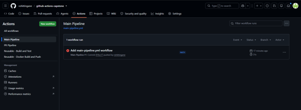
*First run of main-pipeline.yml — failed at both Docker jobs due to an invalid Docker Hub token.*

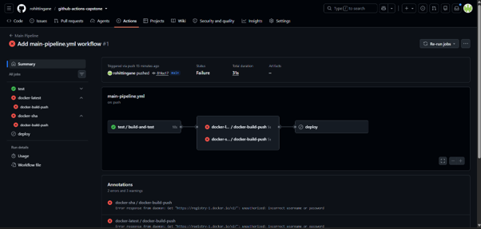
*Detailed failure view showing the "unauthorized: incorrect username or password" error.*

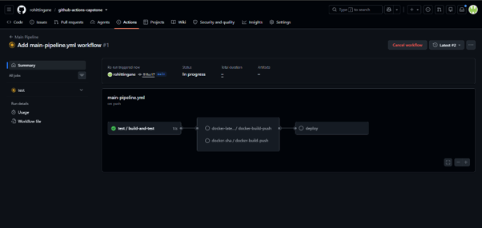
*After fixing the DOCKER_TOKEN secret, re-running the failed jobs.*

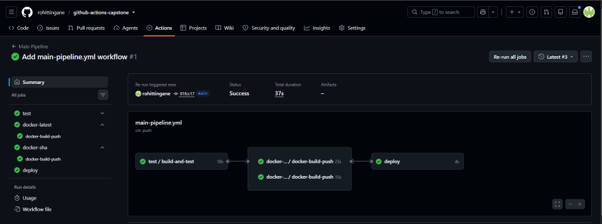
*All four jobs green: test, docker-latest, docker-sha, and deploy — full pipeline success.*

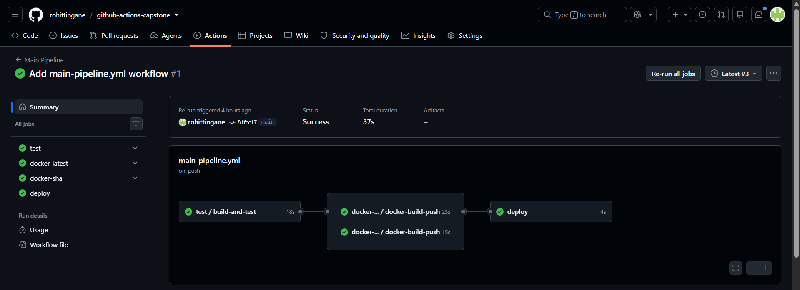
*Overall Actions tab confirming the successful main pipeline run.*

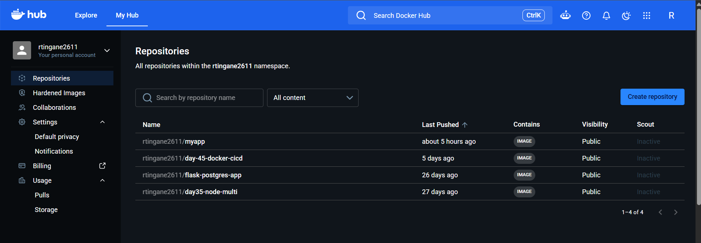
*The myapp repository now visible on Docker Hub after the push.*

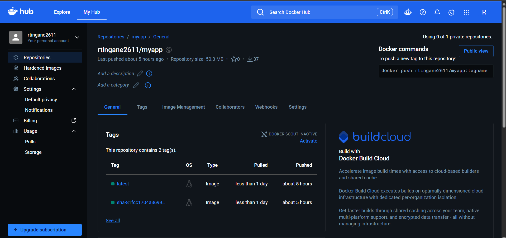
*Both tags — latest and sha-&lt;commit&gt; — visible under the repository.*

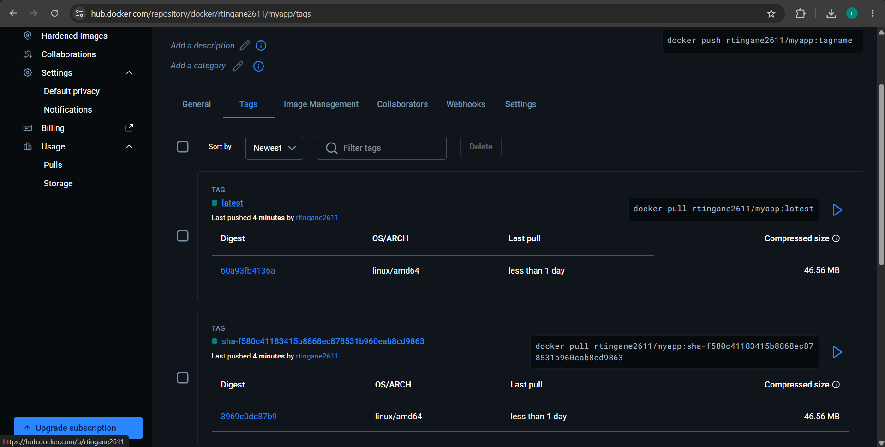
*Closer look at tag details, including image size and push time.*

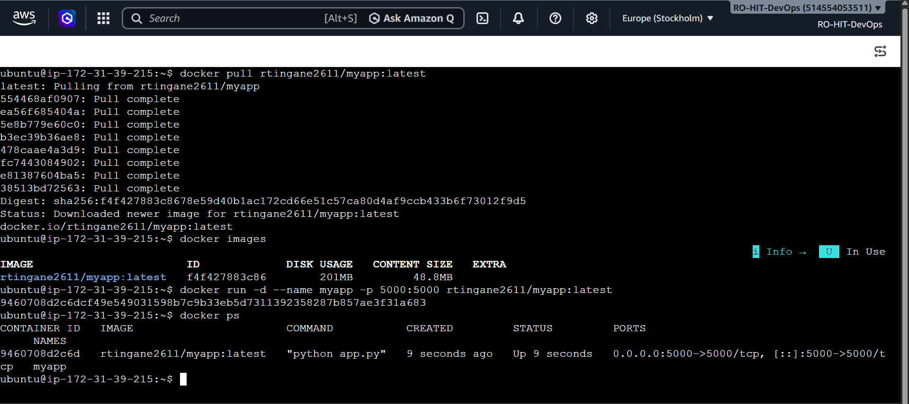
*Pulling the image on the EC2 server and running it with `docker run -d --name myapp -p 5000:5000 rtingane2611/myapp:latest`.*

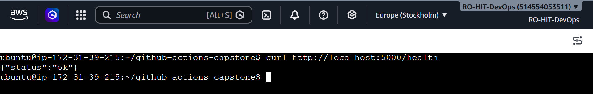
*Successful response from `curl http://localhost:5000/health` on the deployed EC2 server — `{"status": "ok"}`.*

---

## 9. `health-check.yml`

Location: `.github/workflows/health-check.yml`

```yaml
# This workflow runs on its own — every 12 hours automatically,
# or anytime manually via the "Run workflow" button (workflow_dispatch).
name: Scheduled Health Check

on:
  schedule:
    - cron: '0 */12 * * *'   # Runs at 12:00 AM and 12:00 PM every day
  workflow_dispatch:          # Adds a manual "Run workflow" button in GitHub

jobs:
  health-check:
    runs-on: ubuntu-latest
    steps:
      # Step 1: Bring the repository code onto this virtual machine
      - name: Checkout code
        uses: actions/checkout@v4

      # Step 2: Download the newest image from Docker Hub
      - name: Pull latest Docker image
        run: docker pull rtingane2611/myapp:latest

      # Step 3: Start the container in the background (detached mode)
      - name: Run container in detached mode
        run: docker run -d --name health-check-container -p 5000:5000 rtingane2611/myapp:latest

      # Step 4: Give the app a few seconds to fully start before testing it
      - name: Wait for container to start
        run: sleep 5

      # Step 5: Hit the /health endpoint and record PASSED or FAILED
      - name: Curl health endpoint
        id: health_check
        run: |
          RESPONSE=$(curl -s -o /dev/null -w "%{http_code}" http://localhost:5000/health)
          if [ "$RESPONSE" -eq 200 ]; then
            echo "status=PASSED" >> $GITHUB_OUTPUT
          else
            echo "status=FAILED" >> $GITHUB_OUTPUT
          fi

      # Step 6: Print the result so it's visible directly in the logs
      - name: Print result
        run: echo "Health check status: ${{ steps.health_check.outputs.status }}"

      # Step 7: Always clean up the container, even if the health check failed
      - name: Stop and remove container
        if: always()
        run: |
          docker stop health-check-container
          docker rm health-check-container

      # Step 8: Write a nicely formatted report to the workflow run's summary page
      - name: Create summary
        if: always()
        run: |
          echo "## Health Check Report" >> $GITHUB_STEP_SUMMARY
          echo "- Image: rtingane2611/myapp:latest" >> $GITHUB_STEP_SUMMARY
          echo "- Status: ${{ steps.health_check.outputs.status }}" >> $GITHUB_STEP_SUMMARY
          echo "- Time: $(date)" >> $GITHUB_STEP_SUMMARY
```

**Purpose:** Runs completely on its own, automatically, every 12 hours, regardless of whether anyone pushes code or opens a PR. Its job is to catch problems (like the app crashing or a bad deployment) even when nobody is actively working on the project.

**Word by word explanation of the NEW parts:**

- `on: schedule: - cron: '0 */12 * * *'` — Schedules this workflow using "cron syntax," a standard way computers describe repeating schedules. `0 */12 * * *` means "at minute 0, every 12th hour, every day, every month, every day of the week" — in plain words: run at 12:00 AM and 12:00 PM every day.
- `workflow_dispatch:` — Adds a manual "Run workflow" button in the GitHub Actions tab, so we can trigger this workflow ourselves anytime, instead of waiting up to 12 hours for the schedule.
- `docker pull rtingane2611/myapp:latest` — Downloads the newest version of our image from Docker Hub onto this temporary machine.
- `docker run -d --name health-check-container -p 5000:5000 ...` — Starts a container from that image. `-d` means "detached" (run in the background, don't block the rest of the script). `--name` gives the container a name we can refer to later. `-p 5000:5000` connects port 5000 on the virtual machine to port 5000 inside the container.
- `sleep 5` — Waits 5 seconds so the app has time to fully start before we test it.
- The `curl` and `if/else` logic here works exactly the same way as it did in `test-health.sh` and `reusable-build-test.yml` — check the status code, record PASSED or FAILED into `$GITHUB_OUTPUT`.
- `if: always()` — Normally, if an earlier step in a job fails, GitHub Actions skips all the following steps. `always()` overrides this — it says "run this step no matter what happened before, even if a previous step failed." This is critical for the "stop and remove container" step: we must always clean up the container, even if the health check itself failed, otherwise leftover containers pile up on the machine.
- `docker stop health-check-container` / `docker rm health-check-container` — Stops the running container, then deletes it completely, cleaning up after ourselves.
- `$GITHUB_STEP_SUMMARY` — Another special GitHub file. Anything written here appears as nicely formatted Markdown on the workflow run's summary page, giving us a clean report without digging through raw logs.
- `$(date)` — A command that inserts the current date and time into our summary.

**Screenshots — Scheduled Health Check in action:**

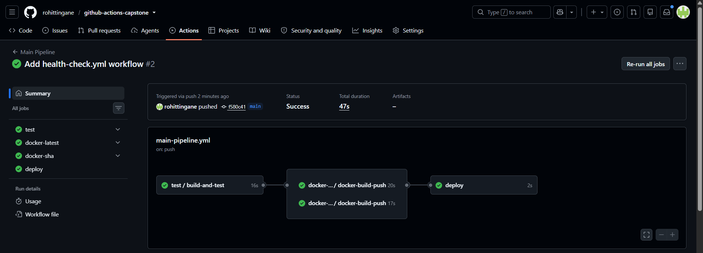
*The health-check.yml workflow listed in the Actions tab, showing both the manual (workflow_dispatch) and scheduled trigger options.*


*A completed run of the health check — pulling the image, running it, checking `/health`, and cleaning up the container automatically.*

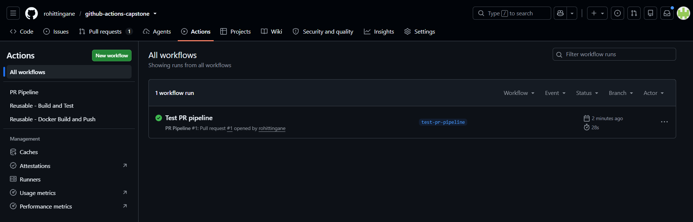
*Confirmation from the Actions tab that the workflow run finished successfully.*

---

## 10. GitHub Secrets Setup

We created two repository secrets under **Settings -> Secrets and variables -> Actions**:

- `DOCKER_USERNAME` — our Docker Hub username
- `DOCKER_TOKEN` — a Docker Hub Access Token (never the real account password) with Read & Write permission, generated from Docker Hub -> Account Settings -> Security -> New Access Token

These are referenced inside `main-pipeline.yml` as `${{ secrets.DOCKER_USERNAME }}` and `${{ secrets.DOCKER_TOKEN }}`, and passed down into `reusable-docker.yml`.

**Screenshots:**

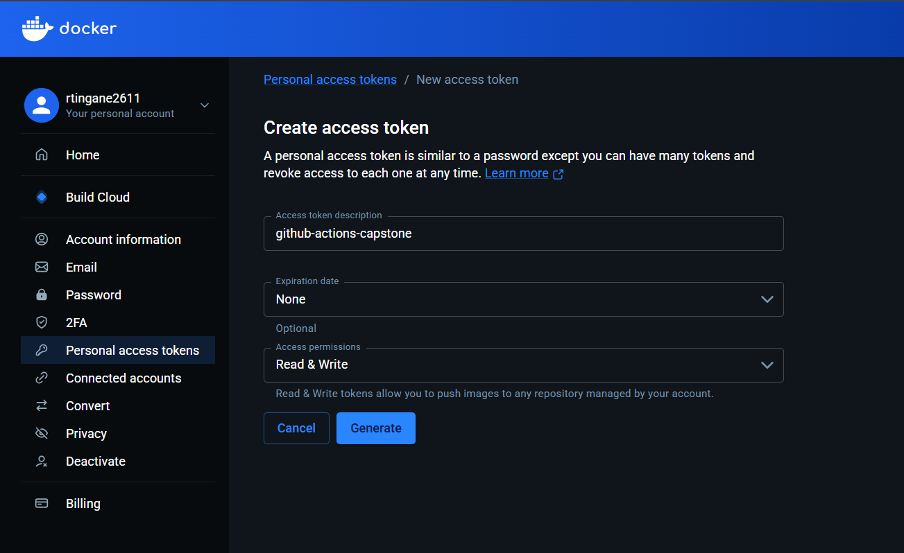
*Creating a Docker Hub Access Token (Read & Write permission) instead of using the real password.*

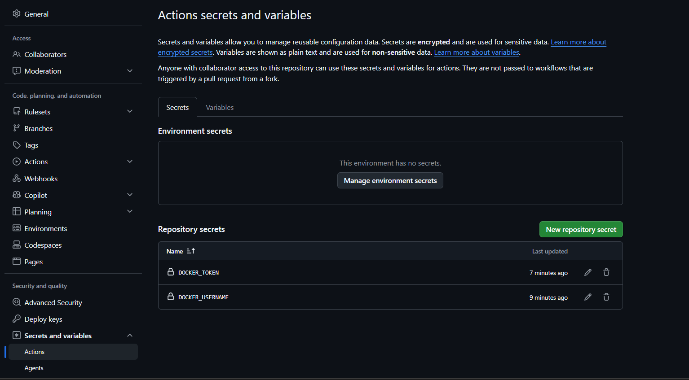
*DOCKER_USERNAME and DOCKER_TOKEN saved as repository secrets in GitHub Settings.*

---

## 11. Errors We Hit and How We Fixed Them

### Error 1: YAML "Nested mappings are not allowed in compact mappings"

**Where:** `pr-pipeline.yml`, in the line printing the branch name.

**Cause:** The double curly braces `${{ ... }}` inside an unquoted `echo "..."` string confused the YAML parser, because it looked like we were trying to start a new YAML mapping inside the string.

**Fix:** Wrapped the entire `run:` value in single quotes:
```yaml
run: 'echo "PR checks passed for branch: ${{ github.head_ref }}"'
```

---

### Error 2: Docker Hub Authentication Failure

**Where:** `main-pipeline.yml`, in the `docker-latest` and `docker-sha` jobs.

**Error message:**
```
Error response from daemon: Get "https://registry-1.docker.io/v2/": unauthorized: incorrect username or password
```

**Cause:** The `DOCKER_TOKEN` secret stored in GitHub was invalid or expired.

**Fix:** Generated a fresh Docker Hub Access Token, updated the `DOCKER_TOKEN` secret in GitHub repo Settings, then re-ran the failed jobs. All jobs passed afterward (test, docker-latest, docker-sha, deploy — all green).

---

### Error 3: `curl` returned "404 Not Found" when testing on an EC2 server

**Where:** Manually testing the deployed container on an AWS EC2 instance.

**Cause:** We ran `curl http://localhost:5000` (the root URL `/`), but our Flask app only has a route defined for `/health`, not `/`. There is no code handling requests to `/`, so Flask correctly returned a 404.

**Fix:** Used the correct URL:
```bash
curl http://localhost:5000/health
```
This returned `{"status": "ok"}` as expected.

---

## 12. Docker Hub Link

Image: `rtingane2611/myapp`
Tags pushed: `latest`, `sha-<commit-hash>` (a new SHA tag is created on every push to main)

---

## 13. What We'd Improve Next

- Combine `docker-latest` and `docker-sha` into a single Docker build step using multiple `-t` tags at once, instead of running `docker build` twice (currently we call `reusable-docker.yml` twice, which rebuilds the image twice — wasteful but simpler to understand).
- Add Slack or email notifications when a pipeline fails, so the team knows immediately without checking GitHub manually.
- Add a rollback workflow that lets us quickly redeploy a previous `sha-` tagged image if a new deployment breaks something.
- Add the Trivy security scanning step (Brownie Points task) to catch vulnerable dependencies before deployment.
- Set up "Required reviewers" on the `production` environment in repo Settings, so deployments genuinely require manual human approval, not just the environment name being set.

---

## 14. Summary Table

| Task | File | Status |
|---|---|---|
| App + Dockerfile + Repo | `app.py`, `Dockerfile`, `requirements.txt`, `README.md` | Done |
| Reusable Build & Test | `reusable-build-test.yml` | Done, tested |
| Reusable Docker Build & Push | `reusable-docker.yml` | Done, tested |
| PR Pipeline | `pr-pipeline.yml` | Done, tested via real PR |
| Main Pipeline | `main-pipeline.yml` | Done, tested, deployed to EC2 |
| Scheduled Health Check | `health-check.yml` | Done, tested via manual + automatic run |
| Badges & Documentation | `README.md`, `day-48-actions-project.md` | Done |
