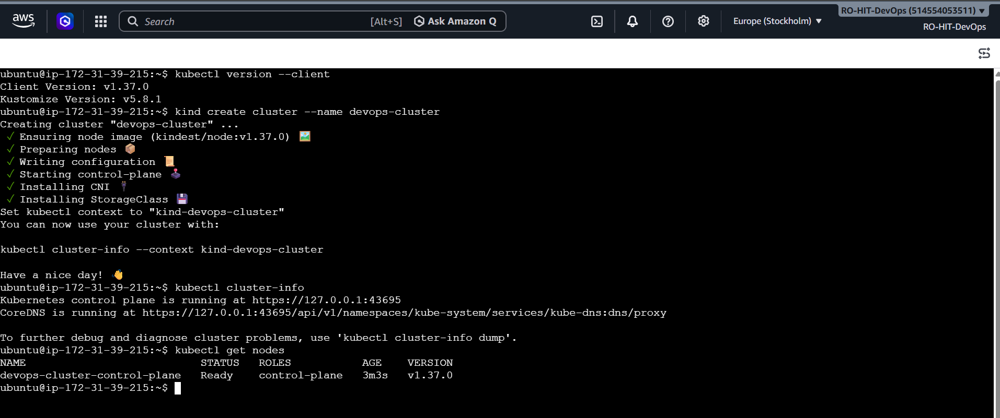
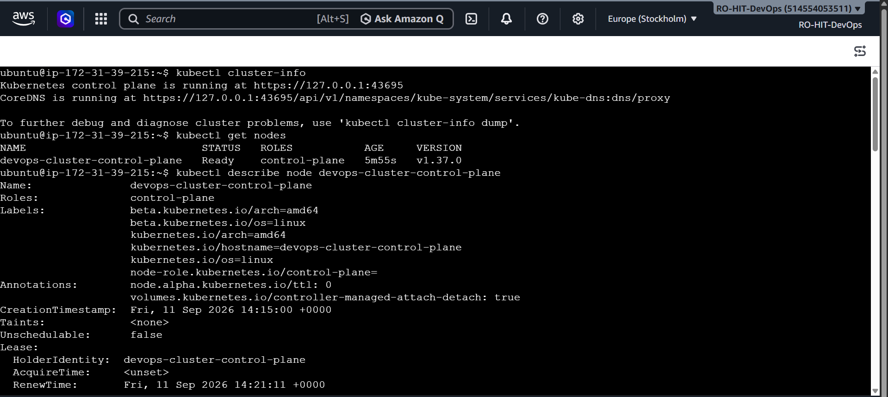
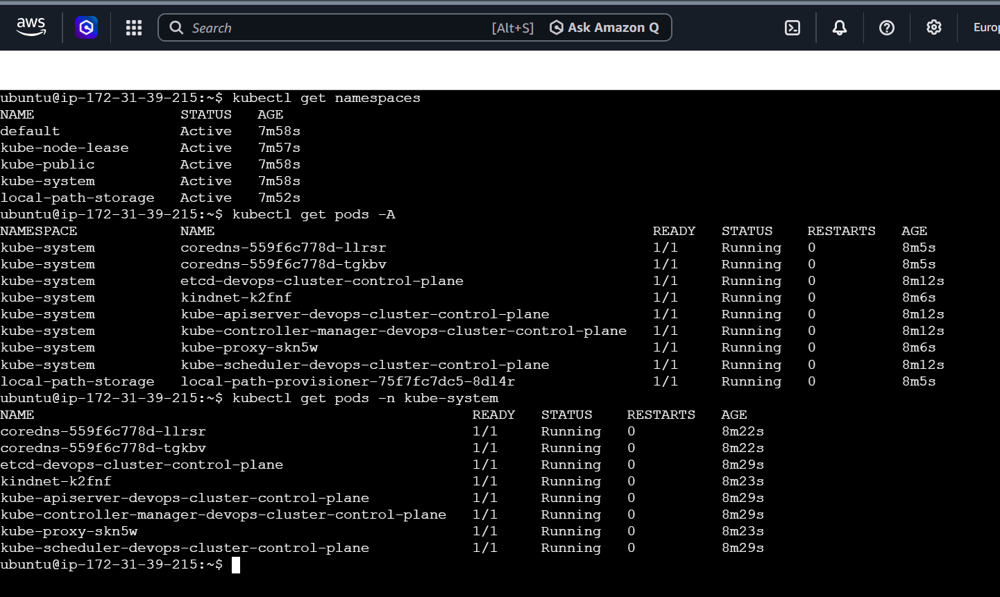
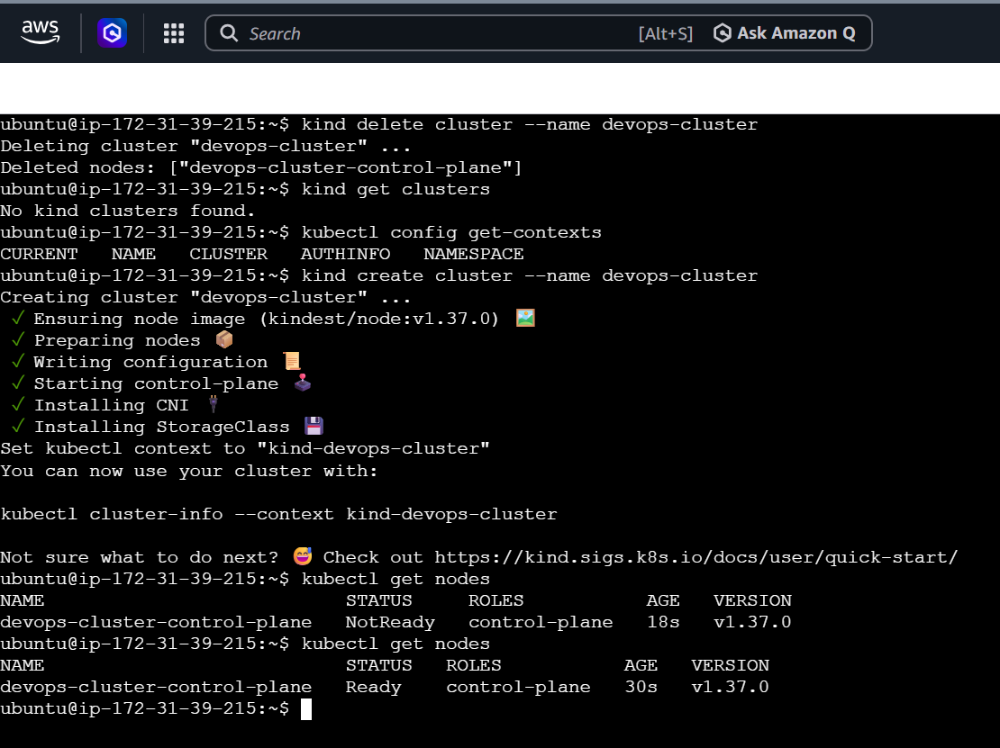
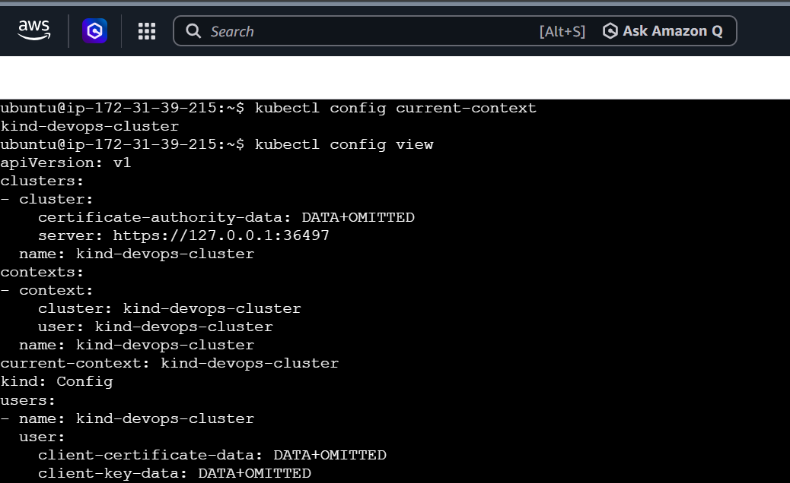
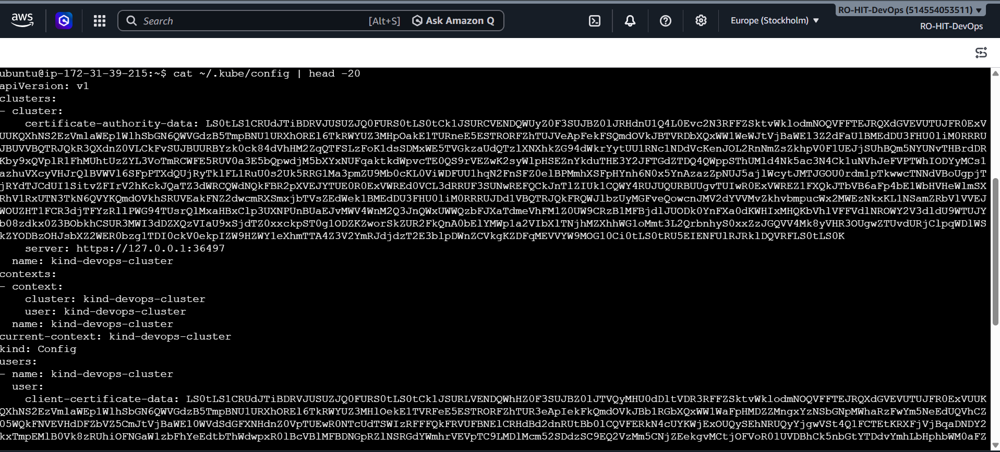

# Day 50 – Kubernetes Architecture and Cluster Setup

## 📌 Overview

Until now, I worked with Docker to build and run containers.

Docker is very useful for running containers, but managing many containers across multiple servers becomes difficult.

This is where **Kubernetes** comes in.

Kubernetes is a container orchestration platform. It helps us manage containers by providing features such as scheduling, scaling, networking, self-healing, and maintaining the desired state of applications.

In this task, I learned:

* Why Kubernetes was created
* Kubernetes history
* Kubernetes architecture
* Control Plane components
* Worker Node components
* How `kubectl` communicates with Kubernetes
* How to install and verify `kubectl`
* How to create a local Kubernetes cluster using `kind`
* How to explore Kubernetes nodes, namespaces, and pods
* How Kubernetes system components run inside the cluster
* Kubernetes cluster lifecycle
* What kubeconfig is and where it is stored

---

# Task 1 – Recall the Kubernetes Story

## What problem does Kubernetes solve?

Docker is excellent for creating and running containers.

But imagine an application with hundreds of containers running across many servers.

Manually managing all these containers would become difficult.

We would need to manage:

* Which server should run a container?
* What happens if a container stops?
* What happens if a server goes down?
* How can we scale containers?
* How can containers communicate with each other?
* How can we keep the application in the required state?

Kubernetes solves these problems by acting as a **container orchestrator**.

It automatically manages containerized applications across a cluster of machines.

---

## Who created Kubernetes?

Kubernetes was originally developed by **Google**.

It was inspired by Google's internal container management system called **Borg**.

Google open-sourced Kubernetes in 2014.

---

## What does Kubernetes mean?

The word **Kubernetes** comes from Greek.

It means **helmsman or pilot** — a person who steers a ship.

This name represents the idea of Kubernetes controlling and coordinating containers.

---

## Simple Real-World Example

Think about a restaurant.

If there are only 2 customers, one person can manage the orders manually.

But if there are 1,000 customers, manual management becomes difficult.

We need a system that can:

* Assign work
* Monitor work
* Handle failures
* Add more workers when required
* Keep everything organized

Kubernetes does something similar for containers.

---

### Task 1 – Key Learning

> **Docker runs containers. Kubernetes manages containers at scale.**

---

# Task 2 – Kubernetes Architecture

Kubernetes architecture can be divided into two major parts:

1. **Control Plane**
2. **Worker Nodes**

The Control Plane is responsible for managing the cluster.

Worker Nodes are responsible for running application workloads.

---

## Kubernetes Architecture Diagram

```text
                         Kubernetes Cluster
                                |
                +---------------+---------------+
                |                               |
          CONTROL PLANE                     WORKER NODE
          (Cluster Brain)                  (Runs Pods)
                |                               |
        +-------+-------+               +-------+-------+
        |       |       |       |       |       |       |
     API Server etcd Scheduler Controller  kubelet kube-proxy
                           Manager             |
                                               |
                                        Container Runtime
                                         (containerd/CRI-O)
                                               |
                                              Pods
                                               |
                                          Containers
```

---

# Control Plane Components

The Control Plane manages the overall Kubernetes cluster.

## 1. API Server

The **API Server** is the front door of Kubernetes.

Almost every Kubernetes operation goes through the API Server.

For example:

```bash
kubectl get nodes
```

The `kubectl` command sends the request to the API Server.

### Simple meaning

> API Server = Main entry point to Kubernetes.

---

## 2. etcd

`etcd` is the database used by Kubernetes.

It stores important cluster state and configuration.

For example:

* Cluster information
* Node information
* Pod information
* Configuration
* Desired state

### Simple meaning

> etcd = Kubernetes cluster database.

---

## 3. Scheduler

The Scheduler decides where a new Pod should run.

Suppose Kubernetes has three worker nodes:

```text
Worker Node 1
Worker Node 2
Worker Node 3
```

A new Pod needs to be created.

The Scheduler evaluates the available nodes and selects a suitable node.

### Simple meaning

> Scheduler = Decides which node should run a Pod.

---

## 4. Controller Manager

The Controller Manager continuously watches the cluster.

It compares:

```text
Desired State
      ↓
Actual State
```

If the actual state is different from the desired state, Kubernetes tries to correct it.

### Example

Suppose we want:

```text
3 Pods
```

But one Pod crashes.

Now only:

```text
2 Pods
```

are running.

Kubernetes controllers detect the difference and work toward getting the cluster back to:

```text
3 Pods
```

### Simple meaning

> Controller Manager = Keeps the actual cluster state close to the desired state.

---

# Worker Node Components

Worker Nodes are the machines where application Pods run.

A worker node normally contains:

* kubelet
* kube-proxy
* Container Runtime

---

## 1. kubelet

`kubelet` is an agent running on each worker node.

It communicates with the Kubernetes API Server and makes sure the Pods assigned to that node are running.

### Simple meaning

> kubelet = Worker node agent that manages Pods.

---

## 2. kube-proxy

`kube-proxy` helps provide Kubernetes networking.

It maintains networking rules that allow network communication between Pods and Services.

### Simple meaning

> kube-proxy = Helps Kubernetes networking work correctly.

---

## 3. Container Runtime

The Container Runtime is responsible for actually running containers.

Examples:

* containerd
* CRI-O

### Simple meaning

> Container Runtime = The software that actually runs containers.

---

# What happens when we run kubectl apply?

Consider this command:

```bash
kubectl apply -f pod.yaml
```

Let's understand it step by step.

### Step 1 – kubectl

`kubectl` reads the `pod.yaml` file.

`-f` means:

> Read the resource definition from this file.

So:

```bash
kubectl apply -f pod.yaml
```

means:

> Apply the Kubernetes configuration written inside `pod.yaml`.

---

### Step 2 – API Server

`kubectl` sends the request to the Kubernetes API Server.

The API Server validates and processes the request.

---

### Step 3 – etcd

The Kubernetes cluster state is stored in `etcd`.

The desired configuration becomes part of the cluster state.

---

### Step 4 – Scheduler

The Scheduler notices that the new Pod needs a node.

It selects an appropriate worker node.

---

### Step 5 – kubelet

The kubelet on the selected node receives the information about the Pod.

It makes sure that the Pod is created on that node.

---

### Step 6 – Container Runtime

The kubelet works with the Container Runtime.

The runtime pulls the required image if necessary and starts the container.

---

## Complete Flow

```text
kubectl
   |
   v
API Server
   |
   +------> etcd
   |
   v
Scheduler
   |
   v
Worker Node
   |
   v
kubelet
   |
   v
Container Runtime
   |
   v
Pod
   |
   v
Container
```

---

# What happens if the API Server goes down?

If the API Server becomes unavailable:

* New `kubectl` requests cannot be processed.
* We cannot normally make new changes through the Kubernetes API.
* New scheduling and cluster management operations are affected.

However, containers that are already running on worker nodes can continue running because the kubelet and container runtime are already running on those nodes.

In a real production cluster, highly available Control Plane components are commonly used to reduce this type of failure.

---

# What happens if a Worker Node goes down?

If a worker node fails:

* Pods running on that node can become unavailable.
* Kubernetes detects the node failure.
* Controllers can work to restore the desired number of replicas.
* If multiple healthy worker nodes are available, replacement Pods can be scheduled there.

This is one of the important reasons Kubernetes is useful for production workloads.

---

# Task 2 – Key Learning

```text
Control Plane
     ↓
Manages the cluster

Worker Node
     ↓
Runs application workloads
```

The Control Plane decides and manages.

The Worker Node executes the workload.

---

# Task 3 – Install kubectl

## What is kubectl?

`kubectl` is the command-line tool used to communicate with a Kubernetes cluster.

We can use `kubectl` to:

* Create resources
* View Pods
* View Nodes
* View Services
* View Namespaces
* Check cluster information
* Delete resources
* Debug workloads

---

## Check kubectl

Run:

```bash
kubectl version --client
```

### Command meaning

```text
kubectl
```

Kubernetes command-line tool.

```text
version
```

Requests version information.

```text
--client
```

Shows the version of the local kubectl client.

So:

```bash
kubectl version --client
```

means:

> Show the version of the kubectl installed on this machine.

---

## Expected Result

The command should show the installed kubectl client version.

At this point, kubectl is ready to communicate with Kubernetes once a cluster is configured.

---

# Task 4 – Create a Local Kubernetes Cluster

## Tool Selected: kind

I selected **kind** for this task.

`kind` means:

> Kubernetes IN Docker.

It allows us to create a Kubernetes cluster using Docker containers as the cluster nodes.

---

## Why I chose kind

I already have Docker available in my environment.

kind is useful for learning because:

* It is lightweight.
* It works with Docker.
* It can create Kubernetes clusters locally.
* It is fast to create and delete.
* It is useful for Kubernetes testing and practice.

---

## Check Docker

Before creating a kind cluster, Docker should be running.

Run:

```bash
docker ps
```

### Command meaning

```text
docker
```

Docker command-line tool.

```text
ps
```

Shows running containers.

So:

```bash
docker ps
```

means:

> Show the currently running Docker containers.

---

## Create the Kubernetes Cluster

Run:

```bash
kind create cluster --name devops-cluster
```

### Command explained

```text
kind
```

Runs the kind tool.

```text
create
```

Tells kind to create something.

```text
cluster
```

Specifies that we want to create a Kubernetes cluster.

```text
--name devops-cluster
```

Assigns the name `devops-cluster` to the cluster.

Therefore:

```bash
kind create cluster --name devops-cluster
```

means:

> Create a Kubernetes cluster using kind and name it `devops-cluster`.

---

## Verify Cluster Information

Run:

```bash
kubectl cluster-info
```

### Command meaning

```text
cluster-info
```

Displays basic information about the Kubernetes cluster.

This helps us verify that `kubectl` can communicate with the cluster.

---

## Check Nodes

Run:

```bash
kubectl get nodes
```

### Command meaning

```text
get
```

Requests information about a Kubernetes resource.

```text
nodes
```

Specifies that we want information about cluster nodes.

Therefore:

```bash
kubectl get nodes
```

means:

> Show the nodes available in the Kubernetes cluster.

A healthy cluster should show the node in:

```text
Ready
```

status.

---

### Screenshot



**Screenshot:** `day-50-kubectl-get-nodes.png`

This screenshot verifies that the Kubernetes cluster is running and the node is in `Ready` state.

---

# Task 5 – Explore the Kubernetes Cluster

Now that the cluster is running, we can explore it.

---

## 5.1 Check Cluster Information

```bash
kubectl cluster-info
```

### What does it do?

It displays information about the Kubernetes control plane and cluster services.

### Why use it?

It is a quick way to check whether `kubectl` can communicate with the cluster.

---

## 5.2 List Nodes

```bash
kubectl get nodes
```

This displays the nodes in the cluster.

Example:

```text
NAME                 STATUS   ROLES           AGE   VERSION
devops-cluster...    Ready    control-plane   ...   ...
```

### Important column

```text
STATUS
```

If it shows:

```text
Ready
```

the node is available to run workloads.

---

## 5.3 Get Detailed Node Information

First find the node name:

```bash
kubectl get nodes
```

Then run:

```bash
kubectl describe node <node-name>
```

Example:

```bash
kubectl describe node devops-cluster-control-plane
```

### Command meaning

```text
describe
```

Shows detailed information about a Kubernetes resource.

```text
node
```

Specifies that the resource is a Node.

```text
<node-name>
```

The name of the node we want to inspect.

Therefore:

```bash
kubectl describe node <node-name>
```

means:

> Show detailed information about this Kubernetes node.

It can show information such as:

* Node conditions
* CPU
* Memory
* Labels
* Taints
* Pods running on the node
* Kubernetes version
* Container runtime

---

### Screenshot



**Screenshot:** `day-50-cluster-info-describe-node.png`

This screenshot shows cluster information and detailed node information.

---

# 5.4 List Kubernetes Namespaces

Run:

```bash
kubectl get namespaces
```

### What is a Namespace?

A Namespace is a logical way to separate and organize resources inside a Kubernetes cluster.

For example:

```text
default
kube-system
kube-public
kube-node-lease
```

The `kube-system` namespace contains important Kubernetes system components.

---

### Command meaning

```text
get
```

Gets information.

```text
namespaces
```

Requests Namespace resources.

Therefore:

```bash
kubectl get namespaces
```

means:

> Show all Namespaces in the cluster.

---

# 5.5 List All Pods

Run:

```bash
kubectl get pods -A
```

`-A` means:

```text
--all-namespaces
```

Therefore:

```bash
kubectl get pods -A
```

means:

> Show Pods from all namespaces.

This is useful when we want to see everything running across the cluster.

---

# 5.6 Explore kube-system Pods

Run:

```bash
kubectl get pods -n kube-system
```

### Command meaning

```text
get
```

Get information.

```text
pods
```

Show Pods.

```text
-n kube-system
```

`-n` means `--namespace`.

So this command means:

> Show Pods inside the `kube-system` namespace.

---

## Kubernetes System Pods

Depending on the kind version and cluster configuration, we can see system components such as:

```text
etcd
kube-apiserver
kube-controller-manager
kube-scheduler
coredns
kube-proxy
```

These Pods represent important Kubernetes system services.

---

## Match Pods With Architecture

| Pod / Component           | Main Responsibility                       |
| ------------------------- | ----------------------------------------- |
| `etcd`                    | Stores Kubernetes cluster state           |
| `kube-apiserver`          | Kubernetes API entry point                |
| `kube-scheduler`          | Selects nodes for Pods                    |
| `kube-controller-manager` | Maintains desired state                   |
| `kube-proxy`              | Provides node-level Kubernetes networking |
| `coredns`                 | Provides cluster DNS                      |

---

### Screenshot



**Screenshot:** `day-50-kube-system-pods.png`

This screenshot shows the Kubernetes system Pods running inside the `kube-system` namespace.

---

# Task 6 – Practice Kubernetes Cluster Lifecycle

A Kubernetes cluster is not something we only create once.

During development and testing, we may need to:

* Create a cluster
* Check a cluster
* Delete a cluster
* Recreate a cluster

This is called the **cluster lifecycle**.

---

# 6.1 Delete the Cluster

Run:

```bash
kind delete cluster --name devops-cluster
```

### Command meaning

```text
kind
```

Uses the kind tool.

```text
delete
```

Tells kind to remove something.

```text
cluster
```

Specifies the cluster.

```text
--name devops-cluster
```

Specifies which cluster should be deleted.

Therefore:

```bash
kind delete cluster --name devops-cluster
```

means:

> Delete the kind cluster named `devops-cluster`.

---

# 6.2 Recreate the Cluster

Run:

```bash
kind create cluster --name devops-cluster
```

This creates the cluster again with the same name.

---

# 6.3 Verify the Cluster

Run:

```bash
kubectl get nodes
```

If the cluster is working correctly, the node should become:

```text
Ready
```

---

### Screenshot



**Screenshot:** `day-50-cluster-lifecycle-delete-recreate.png`

This screenshot demonstrates the cluster delete and recreate lifecycle and verifies that the cluster became available again.

---

# Check Current Kubernetes Context

Run:

```bash
kubectl config current-context
```

### What is a Context?

A context tells `kubectl` which Kubernetes cluster and configuration it should use.

For example:

```text
kind-devops-cluster
```

means `kubectl` is currently connected to the kind cluster named `devops-cluster`.

---

## Command meaning

```text
config
```

Works with kubectl configuration.

```text
current-context
```

Shows the context currently being used.

Therefore:

```bash
kubectl config current-context
```

means:

> Show which Kubernetes cluster/context kubectl is currently connected to.

---

# List All Kubernetes Contexts

Run:

```bash
kubectl config get-contexts
```

### What does it do?

It shows all Kubernetes contexts configured for `kubectl`.

This is useful when we have multiple Kubernetes clusters.

For example:

```text
kind-devops-cluster
minikube
production-cluster
```

We can use contexts to switch between clusters.

---

# View the kubeconfig

Run:

```bash
kubectl config view
```

### What is kubeconfig?

**kubeconfig** is a configuration file used by `kubectl` to know:

* Which cluster to connect to
* Which API Server to use
* Which user/credentials to use
* Which context is currently selected

The default kubeconfig file is:

```text
~/.kube/config
```

---

## Understanding the Path

```text
~
```

means the current user's home directory.

```text
.kube
```

is the Kubernetes configuration directory.

```text
config
```

is the kubeconfig file.

So:

```text
~/.kube/config
```

means:

> The `config` file inside the `.kube` directory in the user's home directory.

---

### Screenshot



**Screenshot:** `day-50-kubeconfig-view.png`

This screenshot shows the kubeconfig information using:

```bash
kubectl config view
```

---

# Kubeconfig Raw File

The kubeconfig file can also contain certificate and authentication data.

The file can be viewed using:

```bash
cat ~/.kube/config
```

### Command meaning

```text
cat
```

Displays the contents of a file.

```text
~/.kube/config
```

Specifies the kubeconfig file.

Therefore:

```bash
cat ~/.kube/config
```

means:

> Display the complete contents of the kubeconfig file.

---

### Important Security Note

A kubeconfig can contain credentials or certificate data that can provide access to a Kubernetes cluster.

Therefore:

> **Never publish a real production kubeconfig file or its credentials on GitHub, LinkedIn, screenshots, or public websites.**

For a local learning cluster, the risk is much lower, but the security habit is important.

---

### Screenshot



**Screenshot:** `day-50-kubeconfig-raw-file.png`

This screenshot shows the raw kubeconfig file.

---

# Useful Kubernetes Commands Learned

| Command                             | Meaning                          |
| ----------------------------------- | -------------------------------- |
| `kubectl version --client`          | Show kubectl client version      |
| `kubectl cluster-info`              | Show cluster information         |
| `kubectl get nodes`                 | List Kubernetes nodes            |
| `kubectl describe node <node-name>` | Show detailed node information   |
| `kubectl get namespaces`            | List namespaces                  |
| `kubectl get pods -A`               | List Pods from all namespaces    |
| `kubectl get pods -n kube-system`   | List system Pods                 |
| `kubectl config current-context`    | Show current kubectl context     |
| `kubectl config get-contexts`       | List available contexts          |
| `kubectl config view`               | Show kubeconfig configuration    |
| `kind create cluster`               | Create a kind Kubernetes cluster |
| `kind delete cluster`               | Delete a kind Kubernetes cluster |

---

# Important Kubernetes Concepts

## Cluster

A **cluster** is a group of machines working together to run Kubernetes workloads.

---

## Node

A **Node** is a machine inside the Kubernetes cluster.

It can run Pods.

---

## Pod

A **Pod** is the smallest deployable unit in Kubernetes.

Containers run inside Pods.

Simple relationship:

```text
Kubernetes Cluster
        |
       Node
        |
       Pod
        |
    Container
```

---

## Control Plane

The Control Plane manages the Kubernetes cluster.

Important components:

```text
API Server
etcd
Scheduler
Controller Manager
```

---

## Worker Node

Worker Nodes run application workloads.

Important components:

```text
kubelet
kube-proxy
Container Runtime
```

---

# Final Architecture Summary

```text
                         Kubernetes Cluster
                                |
              +-----------------+-----------------+
              |                                   |
        CONTROL PLANE                         WORKER NODE
              |                                   |
       +------+-------+                    +------+-------+
       |      |       |                    |      |       |
      API    etcd  Scheduler           kubelet kube-proxy
     Server                               |
       |                                   |
       |                           Container Runtime
       |                                   |
       +--------> Cluster State             |
                                           |
                                          Pod
                                           |
                                       Container
```

---

# What I Learned Today

In Day 50, I started my Kubernetes journey.

I learned that Kubernetes is used to manage containerized applications at scale.

I learned the difference between the Control Plane and Worker Nodes.

I understood the responsibilities of:

* API Server
* etcd
* Scheduler
* Controller Manager
* kubelet
* kube-proxy
* Container Runtime

I also learned how `kubectl` communicates with a Kubernetes cluster.

I created a local Kubernetes cluster using **kind**, explored its nodes and system Pods, and practiced deleting and recreating the cluster.

Finally, I learned about Kubernetes contexts and the kubeconfig file.

---

# Final Verification Checklist

* [x] Kubernetes history understood
* [x] Kubernetes architecture understood
* [x] Control Plane components understood
* [x] Worker Node components understood
* [x] kubectl installed and verified
* [x] kind cluster created
* [x] `kubectl cluster-info` verified
* [x] `kubectl get nodes` verified
* [x] Node details explored
* [x] Namespaces explored
* [x] All Pods explored
* [x] `kube-system` Pods explored
* [x] Cluster deleted and recreated
* [x] Current context checked
* [x] Available contexts checked
* [x] kubeconfig explored
* [x] Screenshots captured

---

# Screenshots

All Day 50 screenshots are stored inside:

```text
2026/day-50/Screenshots/
```

Files:

```text
day-50-kubectl-get-nodes.png
day-50-cluster-info-describe-node.png
day-50-kube-system-pods.png
day-50-cluster-lifecycle-delete-recreate.png
day-50-kubeconfig-view.png
day-50-kubeconfig-raw-file.png
```

---

# Conclusion

Day 50 was my introduction to Kubernetes.

The most important concept I learned is:

> **Docker helps us run containers, while Kubernetes helps us manage containers across a cluster.**

I also learned how the Control Plane makes decisions and how Worker Nodes run the actual workloads.

The next step is to move from understanding the Kubernetes architecture to actually creating and managing Kubernetes resources such as **Pods, Deployments, and Services**.
