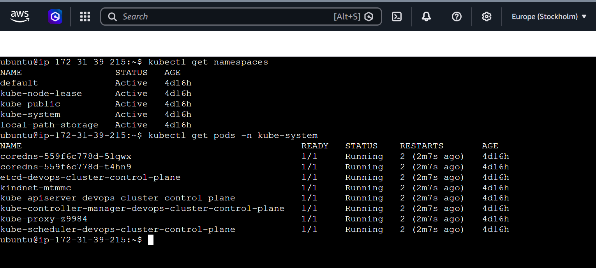
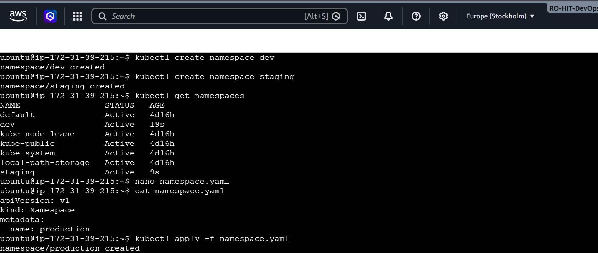
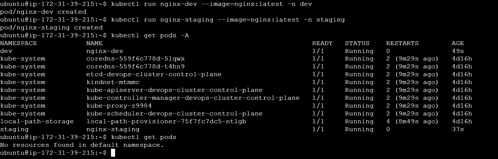
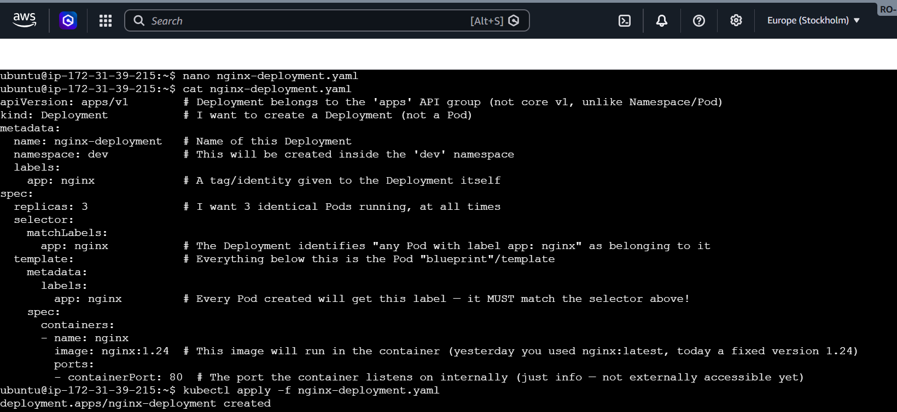
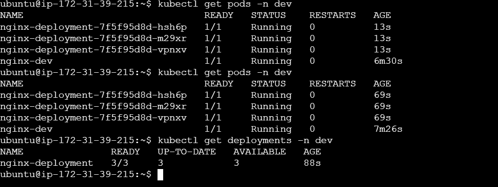
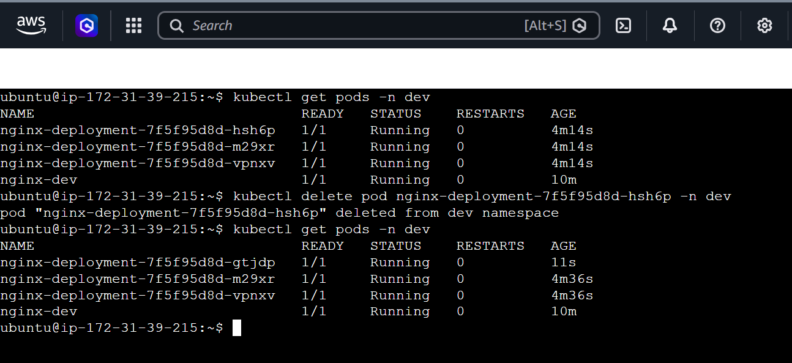
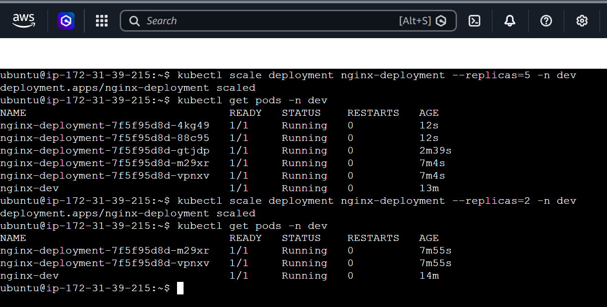
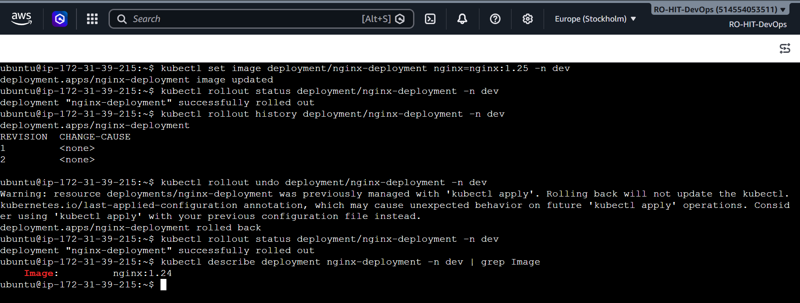
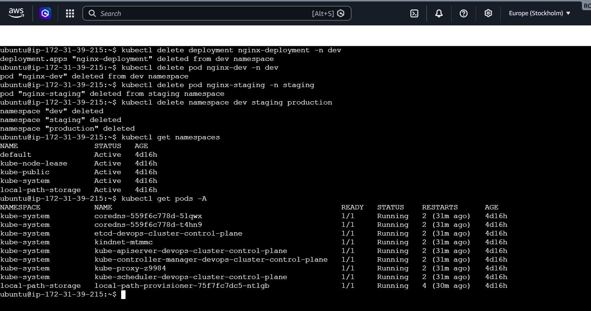

# Day 52 – Kubernetes Namespaces and Deployments

## Why this day matters

Yesterday (Day 51) we created **standalone Pods** using `kubectl run`. Those Pods had one big problem: if a Pod crashes or gets deleted, **nobody brings it back**. It's gone forever.

Today fixes that problem with two core Kubernetes concepts:

1. **Namespaces** – virtual "folders" inside a cluster used to organize and isolate resources (e.g., separating `dev`, `staging`, and `production` environments so they never accidentally mix).
2. **Deployments** – a controller that watches over a set of Pods and guarantees: *"I always want X identical copies of this Pod running. If one dies, recreate it immediately."*

By the end of this day you will understand self-healing, scaling, and zero-downtime rolling updates — the real, production-grade way applications are run on Kubernetes.

---

## Task 1: Explore Default Namespaces

### Concept
Every Kubernetes cluster ships with a few built-in namespaces already created for you. Think of a namespace as a labeled drawer inside a filing cabinet (the cluster) — resources placed in one drawer don't mix with resources in another drawer.

### Command 1 — List all namespaces

```bash
kubectl get namespaces
```

**What each word does:**
- `kubectl` → the command-line tool used to talk to any Kubernetes cluster.
- `get` → a verb meaning "show me the current state of."
- `namespaces` → the resource type we want to list.

**What you should see (built-in namespaces):**
| Namespace | Purpose |
|---|---|
| `default` | Where your resources go if you don't specify a namespace |
| `kube-system` | Kubernetes' own internal components (API server, scheduler, DNS, etc.) |
| `kube-public` | Resources meant to be readable by anyone in the cluster |
| `kube-node-lease` | Used internally to track whether nodes are alive ("heartbeats") |

> Depending on your setup (e.g. `kind` – Kubernetes in Docker), you may also see an extra namespace like `local-path-storage`, used for local storage provisioning. That's completely normal.

### Command 2 — Inspect what's running inside kube-system

```bash
kubectl get pods -n kube-system
```

**Breaking it down:**
- `-n kube-system` → short for `--namespace kube-system`. This tells `kubectl` "only show me resources that live inside this specific namespace."

These Pods are the **control plane** — the brain of the cluster. Do not touch or delete them.

| Pod | What it does |
|---|---|
| `coredns-*` (x2) | Internal DNS — resolves service/pod names to IP addresses |
| `etcd-*` | The cluster's database — stores the entire desired state of the cluster |
| `kindnet-*` | Networking plugin (specific to `kind` clusters) |
| `kube-apiserver-*` | The front door — every `kubectl` command talks to this |
| `kube-controller-manager-*` | Constantly checks: "is the actual state matching the desired state?" |
| `kube-proxy-*` | Handles networking rules so Pods/Services can talk to each other |
| `kube-scheduler-*` | Decides which node a new Pod should be placed on |

### ✅ Output



### Verify
**Q: How many pods are running in kube-system?**
**A:** 8 pods — `coredns` (x2), `etcd`, `kindnet`, `kube-apiserver`, `kube-controller-manager`, `kube-proxy`, `kube-scheduler`.

---

## Task 2: Create and Use Custom Namespaces

### Concept
Real-world clusters usually separate environments — `dev`, `staging`, `production` — into different namespaces so a mistake in one environment can't affect another.

### Command 1 — Create namespaces imperatively

```bash
kubectl create namespace dev
kubectl create namespace staging
```

- `create namespace <name>` → the direct, one-line way to make a namespace. Good for quick testing.

### Command 2 — Verify they exist

```bash
kubectl get namespaces
```

You should now see `dev` and `staging` added to the list, each with an `Active` status and an age of just a few seconds.

### Command 3 — Create a namespace using a YAML manifest (the "as code" way)

Create a file:

```bash
nano namespace.yaml
```

Paste this content:

```yaml
apiVersion: v1        # Namespace belongs to the core v1 API
kind: Namespace        # We want to create a Namespace (not a Pod, not a Deployment)
metadata:
  name: production      # The name of the namespace being created
```

Save with `Ctrl+O`, `Enter`, then exit with `Ctrl+X`.

Apply it:

```bash
kubectl apply -f namespace.yaml
```

**Why use a YAML file instead of just typing the command?**
Because a file can be saved in Git, shared with a team, reviewed before being applied, and re-applied any time exactly the same way. This is called **Infrastructure as Code**, and it's the standard used in real companies — the imperative command (`kubectl create`) is fine for quick experiments, but YAML files are what you'll use for anything that matters.

### Command 4 — Run a Pod inside a specific namespace

```bash
kubectl run nginx-dev --image=nginx:latest -n dev
kubectl run nginx-staging --image=nginx:latest -n staging
```

**Breaking it down:**
- `run nginx-dev` → create a single Pod named `nginx-dev`.
- `--image=nginx:latest` → the container image to run inside that Pod (pulled from Docker Hub).
- `-n dev` → place this Pod inside the `dev` namespace instead of `default`.

**What happens behind the scenes when you run this:**
1. `kubectl` converts your command into an API request.
2. The request goes to `kube-apiserver`.
3. The API server validates it and stores the desired state ("I want a Pod named nginx-dev in namespace dev") in `etcd`.
4. `kube-scheduler` picks a node to run it on.
5. The `kubelet` on that node tells the container runtime (Docker/containerd) to pull the `nginx` image and start the container.
6. Within seconds, the Pod shows status `Running`.

### Command 5 — List pods across all namespaces

```bash
kubectl get pods
kubectl get pods -A
```

**Key lesson (this trips up almost everyone starting out):**
- `kubectl get pods` (no namespace flag) → shows **only** the `default` namespace. Since `nginx-dev` and `nginx-staging` live in `dev`/`staging`, they will **not** appear here — you'll likely see "No resources found in default namespace."
- `kubectl get pods -A` (short for `--all-namespaces`) → shows pods from **every** namespace at once, with an extra `NAMESPACE` column so you can tell them apart.

### ✅ Output




### Verify
**Q: Does `kubectl get pods` show these pods? What about `kubectl get pods -A`?**
**A:** `kubectl get pods` shows nothing (it only checks `default`, and both new Pods live elsewhere). `kubectl get pods -A` shows both `nginx-dev` and `nginx-staging`, along with all `kube-system` and `local-path-storage` pods, each labeled with its namespace.

---

## Task 3: Create Your First Deployment

### Concept
A **Deployment** is a higher-level object that manages Pods for you. Instead of manually creating one Pod at a time, you tell the Deployment: *"Keep 3 identical copies of this Pod running, always."* If a Pod dies, the Deployment notices and creates a replacement automatically — this is called **self-healing**.

### Step 1 — Create the manifest file

```bash
nano nginx-deployment.yaml
```

Paste this content:

```yaml
apiVersion: apps/v1
kind: Deployment
metadata:
  name: nginx-deployment
  namespace: dev
  labels:
    app: nginx
spec:
  replicas: 3
  selector:
    matchLabels:
      app: nginx
  template:
    metadata:
      labels:
        app: nginx
    spec:
      containers:
      - name: nginx
        image: nginx:1.24
        ports:
        - containerPort: 80
```

**Line-by-line explanation:**

| Line | Meaning |
|---|---|
| `apiVersion: apps/v1` | Deployment lives in the `apps` API group (unlike Pod/Namespace, which use core `v1`) |
| `kind: Deployment` | We are creating a Deployment, not a bare Pod |
| `metadata.name` | The Deployment's own name: `nginx-deployment` |
| `metadata.namespace: dev` | This Deployment (and the Pods it creates) will live inside the `dev` namespace |
| `metadata.labels` | A tag attached to the Deployment object itself, for identification |
| `spec.replicas: 3` | The desired number of identical Pods to keep running at all times |
| `spec.selector.matchLabels` | Tells the Deployment which Pods belong to it — "any Pod carrying the label `app: nginx` is mine to manage" |
| `spec.template` | Everything under this key is the **Pod blueprint** — the Deployment stamps out new Pods using this exact template |
| `template.metadata.labels` | The label every Pod created from this template will carry |
| `containers[0].name: nginx` | The name of the container inside each Pod |
| `containers[0].image: nginx:1.24` | Which container image to run, and at which fixed version |
| `containerPort: 80` | Documents which port the container listens on internally (informational — does not expose it externally by itself) |

**⚠️ The single most important rule in this file:**
`spec.selector.matchLabels` and `spec.template.metadata.labels` **must match exactly**. This matching label is the thread that connects the Deployment controller to the Pods it owns. If they don't match, `kubectl apply` will reject the file with a validation error.

### Step 2 — Apply it

```bash
kubectl apply -f nginx-deployment.yaml
```

### Step 3 — Check the result

```bash
kubectl get deployments -n dev
kubectl get pods -n dev
```

You should see 3 Pods with auto-generated names following the pattern:
```
nginx-deployment-<replicaset-hash>-<random-suffix>
```
e.g. `nginx-deployment-7f5f95d8d-hsh6p`. This naming pattern is how you tell a Deployment-managed Pod apart from a standalone Pod (like `nginx-dev` from Task 2, which has no random hash in its name).

### ✅ Output




### Verify
**Q: What do READY, UP-TO-DATE, and AVAILABLE mean in the deployment output?**

Example output:
```
NAME               READY   UP-TO-DATE   AVAILABLE   AGE
nginx-deployment   3/3     3            3           88s
```

| Column | Meaning |
|---|---|
| **READY (`3/3`)** | Left number = Pods currently ready to serve traffic. Right number = desired replica count (`replicas: 3`) |
| **UP-TO-DATE** | How many Pods match the *latest* Pod template (image/config). This number changes gradually during a rolling update |
| **AVAILABLE** | How many Pods are ready **and** have been stable for a minimum time (not immediately crashing) — i.e., truly usable |

When all three numbers match the desired replica count, the Deployment is fully healthy.

---

## Task 4: Self-Healing — Delete a Pod and Watch It Come Back

### Concept
This is the core reason Deployments exist. A standalone Pod, once deleted, is gone forever. A Deployment-managed Pod is different: the Deployment controller **continuously watches** the actual Pod count vs. the desired count (`replicas: 3`). If they don't match, it immediately corrects the difference.

### Step 1 — List current pods (copy an actual pod name)

```bash
kubectl get pods -n dev
```

Pick one of the **Deployment-managed** Pods (names with the random-hash pattern) — not the standalone `nginx-dev` Pod, which the Deployment doesn't control.

### Step 2 — Delete that pod

```bash
kubectl delete pod <pod-name> -n dev
```

Example:
```bash
kubectl delete pod nginx-deployment-7f5f95d8d-hsh6p -n dev
```

### Step 3 — Immediately check again

```bash
kubectl get pods -n dev
```

**What happens behind the scenes:**
1. The Pod you deleted disappears.
2. The ReplicaSet (a helper controller created automatically by the Deployment) notices: "I should have 3 Pods, I only see 2."
3. Within seconds, it creates a **brand-new** Pod to fill the gap — with a **new random suffix** in its name, a new internal ID, and a new IP address.
4. The original deleted Pod never comes back — it is **replaced**, not resurrected.

### ✅ Output



### Verify
**Q: Is the replacement pod's name the same as the one you deleted, or different?**
**A:** **Different.** The deleted Pod (e.g. `...-hsh6p`) is permanently gone. A brand-new Pod appears with a different random suffix (e.g. `...-gtjdp`), running the exact same image/config, with an age starting back at a few seconds. This proves self-healing = replacement, not revival — and it's exactly the behavior a standalone Pod does **not** have.

---

## Task 5: Scale the Deployment

### Concept
Scaling means changing how many replicas (copies) of a Pod are running — more replicas to handle more load, fewer replicas to save resources. This is one command, and Kubernetes handles the rest automatically.

### Command 1 — Scale up to 5

```bash
kubectl scale deployment nginx-deployment --replicas=5 -n dev
kubectl get pods -n dev
```

- `scale deployment <name>` → change the replica count of an existing Deployment.
- `--replicas=5` → the new desired count.

You'll see 2 brand-new Pods appear (3 existing + 2 new = 5 total).

### Command 2 — Scale down to 2

```bash
kubectl scale deployment nginx-deployment --replicas=2 -n dev
kubectl get pods -n dev
```

You'll see 3 Pods enter `Terminating` status and then disappear, leaving only 2.

**Alternative method (editing the manifest):**
You can also scale by opening the YAML file, changing `replicas: 2`, and running `kubectl apply -f nginx-deployment.yaml` again. Same result — different method. The YAML method is preferred in real teams because the change is recorded in a file (and usually in Git), giving you a history of what changed and why.

### ✅ Output



### Verify
**Q: When you scaled down from 5 to 2, what happened to the extra pods?**
**A:** The 3 extra Pods were **terminated gracefully** — not crashed. Kubernetes:
1. Selects which Pods to remove (typically the newest ones).
2. Marks them `Terminating`.
3. Sends a graceful shutdown signal to the container process inside.
4. Removes them completely from the cluster (and from `etcd`) once shutdown completes.

This is a clean, controlled shutdown — no data loss, no errors. The remaining Pods are completely undisturbed.

---

## Task 6: Rolling Update

### Concept
This is how real applications get updated in production **without downtime**. Instead of stopping all Pods at once and starting new ones (which would cause an outage), Kubernetes replaces Pods **one at a time**: it starts a new Pod with the new image, waits until it's healthy, *then* terminates one old Pod. It repeats this until every Pod is running the new version.

### Command 1 — Trigger the rolling update

```bash
kubectl set image deployment/nginx-deployment nginx=nginx:1.25 -n dev
```

**Breaking it down carefully (this command confuses most beginners):**

| Part | Meaning |
|---|---|
| `set image` | Sub-command used specifically to change a container's image on an existing resource |
| `deployment/nginx-deployment` | The target resource — a Deployment named `nginx-deployment` |
| `nginx=nginx:1.25` | Left of `=` → the **container's name** (as defined in the YAML, `name: nginx`). Right of `=` → the **new image** to use |
| `-n dev` | The namespace the Deployment lives in |

So the command reads as: *"For the container named `nginx` inside `nginx-deployment`, switch its image to `nginx:1.25`."*

Behind the scenes, this is functionally the same as opening the YAML file and changing `image: nginx:1.24` to `image: nginx:1.25`, then re-applying it — except it's a single, fast command.

### Command 2 — Watch the rollout live

```bash
kubectl rollout status deployment/nginx-deployment -n dev
```

This streams progress until it prints `successfully rolled out` — confirming every Pod is now running the new image and is healthy.

### Command 3 — Check the rollout history

```bash
kubectl rollout history deployment/nginx-deployment -n dev
```

Every change to the Deployment's Pod template creates a new **revision**:
```
REVISION  CHANGE-CAUSE
1         <none>
2         <none>
```
- Revision 1 = the original Deployment (`nginx:1.24`)
- Revision 2 = after the image update (`nginx:1.25`)

(`CHANGE-CAUSE` shows `<none>` because we didn't attach a description to the change — this is just informational and doesn't affect functionality.)

### Command 4 — Roll back to the previous version

```bash
kubectl rollout undo deployment/nginx-deployment -n dev
kubectl rollout status deployment/nginx-deployment -n dev
```

`rollout undo` tells Kubernetes: *"Discard the latest revision, go back to the previous stable one."* This is extremely useful in production — if a new deployment breaks something, one command reverts it.

> **Note on a warning you may see:** If your Deployment was created using `kubectl apply -f`, rolling back with `rollout undo` may print a warning that the `last-applied-configuration` annotation (used internally by `kubectl apply` to track changes) won't be updated. This is just a heads-up for future `apply` operations — it does not break anything as long as your YAML file on disk still matches the version you rolled back to.

### Command 5 — Verify the image version after rollback

```bash
kubectl describe deployment nginx-deployment -n dev | grep Image
```

- `describe` → gives a detailed, human-readable report of a resource.
- `| grep Image` → pipes that output through `grep`, filtering only the line(s) containing the word "Image" — a quick way to find one specific detail in a long output.

### ✅ Output



### Verify
**Q: What image version is running after the rollback?**
**A:** `nginx:1.24` — the original version, before the update to `nginx:1.25`. The full lifecycle was:
1. Start: `nginx:1.24` (Revision 1)
2. Updated to `nginx:1.25` (Revision 2) — rolled out with zero downtime, Pod by Pod
3. Rolled back → returned to `nginx:1.24`, and this rollback itself was also performed as a rolling operation (Pod by Pod, no downtime)

---

## Task 7: Clean Up

### Concept
Always clean up resources you created for practice so your cluster doesn't accumulate unused objects. Deleting a **namespace** removes everything inside it automatically — Pods, Deployments, Services, ConfigMaps, everything. This is powerful and dangerous: **never delete a namespace in production without being absolutely certain**, since it cannot be undone.

### Commands

```bash
kubectl delete deployment nginx-deployment -n dev
```
Removes the Deployment (and its managed Pods) from the `dev` namespace.

```bash
kubectl delete pod nginx-dev -n dev
```
Removes the standalone Pod created back in Task 2.

```bash
kubectl delete pod nginx-staging -n staging
```
Removes the other standalone Pod.

```bash
kubectl delete namespace dev staging production
```
Deletes all three custom namespaces (and anything still inside them) in one command. You can pass multiple names to `delete namespace` separated by spaces.

### Verify everything is gone

```bash
kubectl get namespaces
kubectl get pods -A
```

### ✅ Output



### Verify
**Q: Are all your resources gone?**
**A:** Yes. `kubectl get namespaces` shows only the built-in namespaces (`default`, `kube-node-lease`, `kube-public`, `kube-system`, `local-path-storage`) — `dev`, `staging`, and `production` are completely gone. `kubectl get pods -A` shows only the control-plane pods and the storage-provisioner pod — none of the `nginx-*` Pods remain. The cluster is back to a clean state.

---

## Key Takeaways from Day 52

- **Namespaces** isolate resources into logical groups (e.g., environments) inside one cluster. Deleting a namespace deletes everything inside it.
- **Deployments** manage Pods for you and guarantee a desired replica count is always maintained.
- **Self-healing**: a deleted Pod under a Deployment is replaced automatically — with a new name, not the same one.
- **Scaling** up or down is a single command (`kubectl scale`) or a one-line YAML edit.
- **Rolling updates** replace Pods one at a time, giving zero-downtime deployments — and `kubectl rollout undo` gives you an instant safety net to revert a bad release.
- Always clean up practice resources, and treat `kubectl delete namespace` with extreme caution in any real environment.
