# Day 54 – Kubernetes ConfigMaps and Secrets (Full Beginner Guide)

> This guide assumes **zero prior knowledge** of Day 54's tasks. Every command is broken down word-by-word, every YAML field is explained, and every step says *why* it exists — not just *what* to type. Follow it top to bottom on your own cluster (Minikube, Kind, or any Kubernetes cluster) and you will get the same result.

---

## Part 0: The Problem, Explained Slowly

Imagine you built an app and packed it into a Docker/container image. That app needs some settings to run — for example:
- Which environment is this? (`production` or `development`)
- Should debug logs be on or off?
- Which port should it listen on?
- What is the database password?

**Bad approach:** Write these values directly inside your application code or Dockerfile, then build the image.

**Why this is bad:**
- If tomorrow you need to change the port from `8080` to `9090`, you must edit code → rebuild the image → push it to a registry → redeploy. That's a lot of work for one number.
- If you want the **same image** to run in dev, staging, and production (which is the whole point of containers — build once, run anywhere), you can't, because each environment needs different values baked into the same image.

**Kubernetes' solution:** Keep the image "dumb" (it has no hardcoded values) and hand it configuration **from outside**, at the moment it starts running. Kubernetes gives you two objects for this:

| Object | Used for | How data is stored |
|---|---|---|
| **ConfigMap** | Non-secret settings (env name, port, feature flags) | Plain, readable text |
| **Secret** | Sensitive data (passwords, tokens, keys) | Base64-encoded text |

Both are stored as separate objects in the cluster, **outside** your Pod and outside your image. You attach them to a Pod at deploy time. Change the ConfigMap/Secret, and (depending on how it's attached) the app can pick up the new value — no rebuild, sometimes not even a restart.

Keep this mental model in your head for the entire guide: **ConfigMap/Secret = a box of settings sitting in the cluster. A Pod = a running container that asks to "borrow" values from that box.**

---

## Part 1: Create a ConfigMap from Literals (Task 1)

### What we're doing
Creating a ConfigMap called `app-config` that holds three settings, typed directly on the command line.

### The command
```bash
kubectl create configmap app-config \
  --from-literal=APP_ENV=production \
  --from-literal=APP_DEBUG=false \
  --from-literal=APP_PORT=8080
```

### Breaking down every part of this command
- `kubectl` — the command-line tool you use to talk to your Kubernetes cluster. Every instruction to the cluster goes through this.
- `create` — tells kubectl you want to make a brand-new object (as opposed to `get`, which reads, or `delete`, which removes).
- `configmap` — the **type** of object you're creating. This tells Kubernetes: "store this as plain-text config data."
- `app-config` — the **name** you're giving this ConfigMap. You will refer to this exact name later when a Pod wants to use it.
- `--from-literal=KEY=VALUE` — this flag says "take this one key-value pair and put it straight into the ConfigMap's data." You used it three times, so you get three separate keys: `APP_ENV`, `APP_DEBUG`, `APP_PORT`. Each `--from-literal` = one key.

**Why use `--from-literal` here specifically?** Because you only have three small, simple values. Typing them inline is faster than creating a file first. (Task 2 shows the file-based alternative — useful when you have many settings.)

### Checking what you just created
```bash
kubectl describe configmap app-config
```
- `describe` gives you a **human-readable summary** of an object — its name, namespace, labels, and (for a ConfigMap) its data keys and values. Good for a quick glance.

```bash
kubectl get configmap app-config -o yaml
```
- `get` retrieves an object.
- `-o yaml` means "output format = YAML" — this shows you the **exact underlying structure** Kubernetes stores, not just a summary. This is the "raw truth" of the object.

### Understanding the YAML output
It will look roughly like this:
```yaml
apiVersion: v1
kind: ConfigMap
metadata:
  name: app-config
data:
  APP_ENV: production
  APP_DEBUG: "false"
  APP_PORT: "8080"
```
- `apiVersion: v1` — tells Kubernetes which version of its API this object follows. ConfigMaps have existed since the earliest stable Kubernetes API (`v1`), so this rarely changes.
- `kind: ConfigMap` — literally states what type of object this YAML describes.
- `metadata.name` — the object's name, same as what you typed after `create configmap`.
- `data:` — this is the actual payload. Each line under it is one key and its value.

**The important observation:** every value under `data:` is fully readable plain text. `production`, `false`, `8080` — nothing is hidden, nothing is scrambled. This is intentional: ConfigMaps are **not** meant for secrets. Anyone who can view this YAML sees everything immediately. This is the core contrast you should remember going into the Secret sections later.

**Screenshot:**
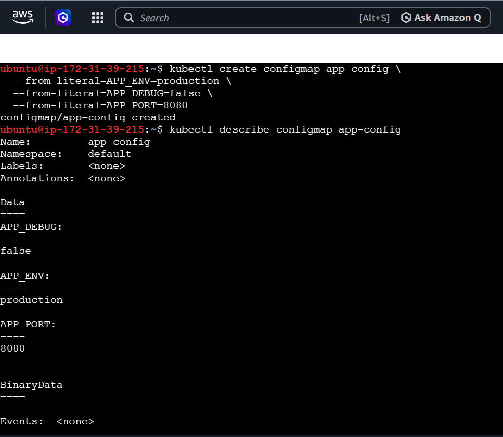
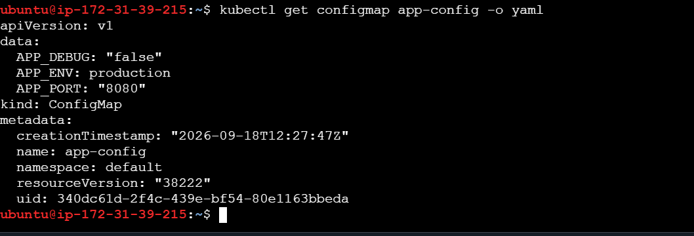

---

## Part 2: Create a ConfigMap from a File (Task 2)

### Why this task exists
`--from-literal` doesn't scale. If you have 20 settings, typing 20 flags is painful and error-prone. Real applications often already keep their settings in a config file (like `.env`, `.properties`, or `.conf`). Kubernetes lets you load that **whole file** straight into a ConfigMap.

### Step 1 — create a sample file to work with
```bash
cat <<EOF > app.properties
LOG_LEVEL=info
MAX_CONNECTIONS=100
CACHE_TTL=300
EOF
```
- `cat <<EOF > app.properties` — this is a **heredoc**: everything you type between `<<EOF` and the closing `EOF` gets written into the file `app.properties`. It's just a fast way to create a text file from the terminal without opening an editor.
- Inside, you're writing three normal `KEY=VALUE` lines — this mimics a real app's settings file.

### Step 2 — turn that file into a ConfigMap
```bash
kubectl create configmap file-config --from-file=app.properties
```
- `--from-file=app.properties` — instead of one key-value pair, this tells Kubernetes: "take this **entire file** and store it as ConfigMap data."
- `file-config` — the name of this new ConfigMap (different from `app-config` in Task 1, so both can exist side by side).

### Checking the result
```bash
kubectl get configmap file-config -o yaml
```
You'll see something like:
```yaml
data:
  app.properties: |
    LOG_LEVEL=info
    MAX_CONNECTIONS=100
    CACHE_TTL=300
```

**What's different here compared to Task 1?** In Task 1, you had **three separate keys** (`APP_ENV`, `APP_DEBUG`, `APP_PORT`). Here, you have **one key** — the filename `app.properties` — and its value is the **entire file content as one text blob** (the `|` symbol in YAML means "keep this as multi-line text exactly as written"). This matters because how a Pod later reads this ConfigMap depends on whether the data is many small keys or one big blob.

**Why choose `--from-file` over `--from-literal`?** Whenever your config already exists as a file, or when you have too many settings to type by hand, `--from-file` saves time and reduces typos.

**Screenshot:**
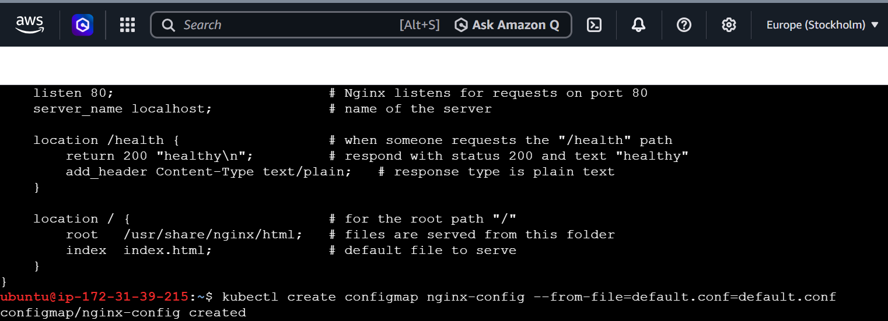
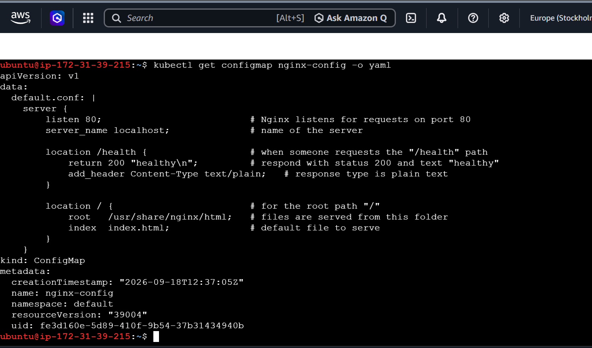

---

## Part 3: Use a ConfigMap Inside a Pod as Environment Variables (Task 3)

### Why this task exists
So far the ConfigMap has just been sitting in the cluster, unused. This task actually **connects** it to a running container, so the application inside can read those values as normal environment variables — the same way any app reads config, without knowing or caring that Kubernetes is involved.

### The Pod manifest
Create a file called `pod-envfrom.yaml`:
```yaml
apiVersion: v1
kind: Pod
metadata:
  name: app-envfrom
spec:
  containers:
    - name: app
      image: busybox
      command: ["sh", "-c", "env | grep APP_ && sleep 3600"]
      envFrom:
        - configMapRef:
            name: app-config
```

### Line-by-line explanation
- `kind: Pod` — this time we're defining a Pod, the smallest deployable unit in Kubernetes (basically "one or more containers running together").
- `metadata.name: app-envfrom` — the name of this Pod.
- `spec.containers` — a list of containers that will run inside this Pod. Here there's just one.
- `name: app` — a label for this container inside the Pod (used in logs/kubectl commands).
- `image: busybox` — busybox is a tiny, minimal Linux image, commonly used for quick tests because it's small and has basic shell tools (`sh`, `env`, `sleep`, etc.). We're not running a "real" app — just using it to prove the config was injected.
- `command: ["sh", "-c", "env | grep APP_ && sleep 3600"]` — this overrides what the container runs on startup:
  - `env` — lists every environment variable currently set inside the container.
  - `| grep APP_` — filters that list down to only variables starting with `APP_` (so we don't have to scroll through unrelated system variables).
  - `&& sleep 3600` — after printing, keep the container alive for an hour (otherwise the container would finish and exit immediately, and you couldn't `exec` into it or want to keep checking logs).
- `envFrom:` — this is the actual "connect to ConfigMap" step. `envFrom` means "grab **all** keys from a source and turn each one into an environment variable automatically" (as opposed to picking them one-by-one, which Task 5 shows for Secrets).
- `configMapRef.name: app-config` — tells Kubernetes exactly which ConfigMap to pull from — the one we made in Task 1.

**Why `envFrom` and not something else?** Because we want *all three* keys from `app-config` (APP_ENV, APP_DEBUG, APP_PORT) injected at once, without listing each one individually. If you only wanted one specific key, you'd use `env.valueFrom.configMapKeyRef` instead (that pattern is shown for Secrets in Task 5).

### Apply and verify
```bash
kubectl apply -f pod-envfrom.yaml
```
- `apply -f <file>` — tells Kubernetes to create (or update) whatever object is described in that YAML file. This is the standard way to deploy anything in Kubernetes — you write the desired state in a file, and `apply` makes the cluster match it.

```bash
kubectl logs app-envfrom
```
- `logs` — shows you whatever the container printed to its output (stdout). Since our `command` ran `env | grep APP_`, this should print:
  ```
  APP_ENV=production
  APP_DEBUG=false
  APP_PORT=8080
  ```

**What this proves:** the application inside the container never needed any special Kubernetes-aware code. It just sees normal environment variables — Kubernetes did the wiring behind the scenes.

**Screenshot:**
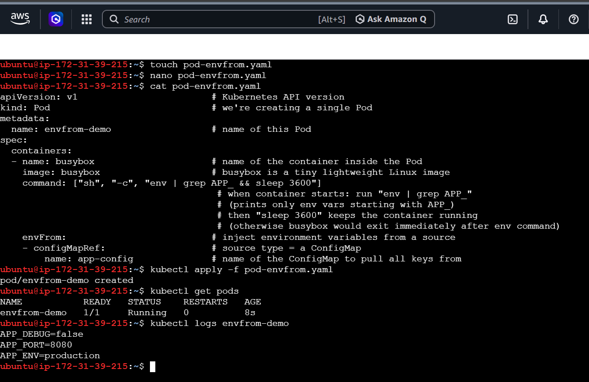

---

## Part 4: Create a Secret and Understand base64 (Task 4)

### Why this task exists
Now we move from "settings" to "sensitive credentials." Kubernetes uses a different object type, `Secret`, specifically so that credentials are logically separated and can be locked down with tighter access rules than regular config.

### The command
```bash
kubectl create secret generic db-credentials \
  --from-literal=DB_USER=admin \
  --from-literal=DB_PASSWORD=SuperSecret123
```
- `create secret` — same idea as `create configmap`, but for the Secret object type.
- `generic` — this is the **type** of Secret. `generic` is the most common type, meaning "arbitrary key-value data, no special format." (Other types exist for things like TLS certificates or Docker registry logins, but we don't need those here.)
- `db-credentials` — the name of this Secret.
- `--from-literal=DB_USER=admin` and `--from-literal=DB_PASSWORD=SuperSecret123` — exactly like ConfigMap literals, but Kubernetes will automatically base64-encode these values before storing them.

### Checking the result
```bash
kubectl get secret db-credentials -o yaml
```
You'll see something like:
```yaml
data:
  DB_USER: YWRtaW4=
  DB_PASSWORD: U3VwZXJTZWNyZXQxMjM=
```

**Why do the values look like gibberish?** Because Kubernetes automatically **base64-encodes** every value in a Secret before saving it. `YWRtaW4=` is not encryption — it's just `admin` rewritten in a different text format. Base64 is a **reversible, non-secret encoding**, used mainly so that binary or special-character data can be safely stored as plain text in YAML/JSON. It gives **zero real protection** on its own.

### Proving it's reversible — decode it yourself
```bash
kubectl get secret db-credentials -o jsonpath='{.data.DB_PASSWORD}' | base64 --decode
```
- `-o jsonpath='{.data.DB_PASSWORD}'` — instead of dumping the whole YAML, `jsonpath` lets you pull out **one specific field** — here, just the base64 value of `DB_PASSWORD`.
- `| base64 --decode` — pipes that base64 text into the `base64` command-line tool with the `--decode` flag, which converts it back to the original readable text.
- Result: it prints `SuperSecret123` — the exact original password, recovered in one command.

**The real lesson of this task:** if someone has permission to run `kubectl get secret`, they can trivially recover the plaintext password in seconds. The actual protection Kubernetes gives you comes from **RBAC** (Role-Based Access Control) — i.e., controlling *who is even allowed* to read Secrets in the first place — not from the base64 encoding itself. Never think of base64 as "encryption."

**Screenshot:**
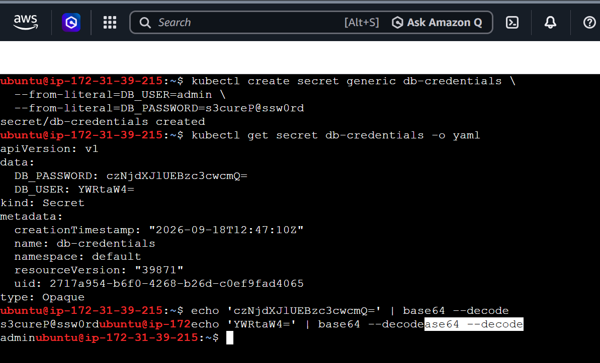

---

## Part 5: Use a Secret Inside a Pod (Task 5)

### Why this task exists
Just like the ConfigMap, a Secret is useless sitting alone. This task wires the `db-credentials` Secret into a running Pod, but this time using a **per-key** approach instead of grabbing everything at once — useful when you only want specific keys, or want to rename them.

### The Pod manifest
`pod-secret.yaml`:
```yaml
apiVersion: v1
kind: Pod
metadata:
  name: app-secret
spec:
  containers:
    - name: app
      image: busybox
      command: ["sh", "-c", "echo DB_USER=$DB_USER && echo DB_PASSWORD=$DB_PASSWORD && sleep 3600"]
      env:
        - name: DB_USER
          valueFrom:
            secretKeyRef:
              name: db-credentials
              key: DB_USER
        - name: DB_PASSWORD
          valueFrom:
            secretKeyRef:
              name: db-credentials
              key: DB_PASSWORD
```

### Line-by-line explanation
- `command: ["sh", "-c", "echo DB_USER=$DB_USER && echo DB_PASSWORD=$DB_PASSWORD && sleep 3600"]` — prints the two environment variables so we can visually confirm they were injected, then sleeps to keep the container alive.
- `env:` — unlike `envFrom` (Task 3), `env` lets you define environment variables **one at a time**, giving you full control over the variable's name and exactly where its value comes from.
- `name: DB_USER` — the environment variable name that will exist **inside the container**. (Note: it doesn't have to match the Secret's key name, though here we kept them the same for clarity.)
- `valueFrom.secretKeyRef` — says "don't give this variable a literal value; instead, pull it from a Secret."
  - `name: db-credentials` — which Secret to pull from.
  - `key: DB_USER` — which specific key inside that Secret to use.
- The same pattern repeats for `DB_PASSWORD`.

**Why use this `env` + `secretKeyRef` pattern instead of `envFrom` + `secretRef`?** Because it gives fine-grained control: you can pick only the keys you need, and rename them if the app expects a different variable name than what's stored in the Secret. `envFrom` (used in Task 3) is faster when you want everything with the same names.

### Apply and verify
```bash
kubectl apply -f pod-secret.yaml
kubectl logs app-secret
```
Expected output:
```
DB_USER=admin
DB_PASSWORD=SuperSecret123
```

**What this proves:** Kubernetes automatically **decoded** the base64 value before injecting it as an environment variable. The application inside the container just sees a normal plain-text variable — it never has to know or care that the value was stored as base64 in etcd (Kubernetes' backing datastore).

**Screenshot:**
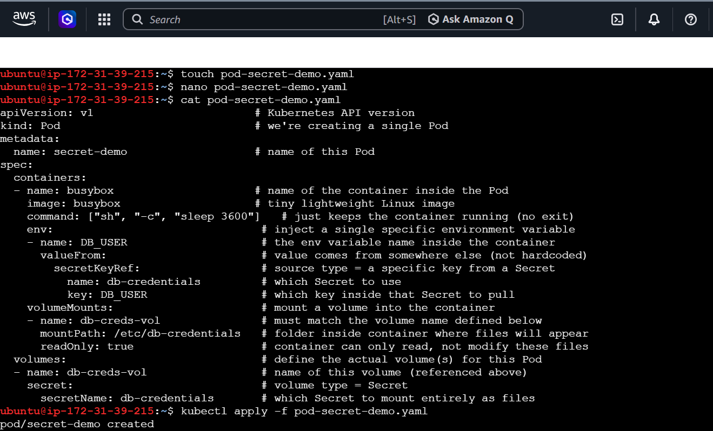
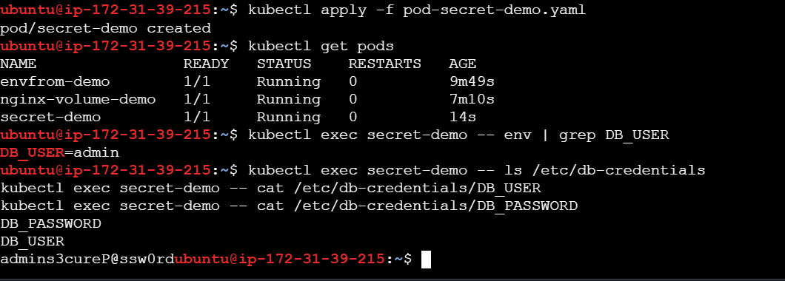

---

## Part 6: Live Config Updates — Volume Mounts vs Environment Variables (Task 6)

### Why this task is the most important one today
Here's a critical limitation you need to understand: **environment variables are only read once, at the exact moment a container starts.** If you update a ConfigMap or Secret *after* the Pod is already running, the environment variables inside that Pod do **not** change. You would have to restart/recreate the Pod to see the new value.

But there's a second way to attach a ConfigMap to a Pod: **mounting it as a volume** (i.e., as files on disk inside the container, instead of environment variables). When you do this, Kubernetes' kubelet (the agent running on each node) periodically syncs the ConfigMap's latest data into those files — **automatically, without restarting the Pod.**

This task proves that behavior hands-on.

### Step 1 — create a fresh ConfigMap to test with
```bash
kubectl create configmap live-config --from-literal=MESSAGE=hello
```
Same command style as Task 1 — one key, `MESSAGE`, currently set to `hello`.

### Step 2 — mount it as a volume in an nginx Pod
`pod-live-config.yaml`:
```yaml
apiVersion: v1
kind: Pod
metadata:
  name: nginx-live-config
spec:
  containers:
    - name: nginx
      image: nginx
      volumeMounts:
        - name: config-volume
          mountPath: /etc/config
  volumes:
    - name: config-volume
      configMap:
        name: live-config
```

**What's new here compared to earlier Pods:**
- `image: nginx` — a real, commonly-used web server image (used here just because it's a stable, well-known image for demonstration; it's not actually serving the config file to the internet in this exercise).
- `volumes:` — this is a **Pod-level** field (sits directly under `spec`, not under a specific container) that defines storage sources available to the Pod. Here, `configMap.name: live-config` says "create a volume whose content comes from the `live-config` ConfigMap."
- `volumeMounts:` — this is a **container-level** field that says "take a volume defined above (matched by `name: config-volume`) and attach it inside this specific container at a chosen file path."
  - `mountPath: /etc/config` — the folder path *inside the container* where the ConfigMap's data will appear as files. Since `live-config` has one key (`MESSAGE`), Kubernetes will create a file at `/etc/config/MESSAGE` whose content is `hello`.

**Key idea:** with `envFrom`/`env` (Tasks 3 & 5), ConfigMap/Secret data becomes environment variables. With `volumes`/`volumeMounts`, the same data instead becomes **files on disk**. Same source data, two very different delivery mechanisms — and they behave differently when the source changes later.

### Step 3 — apply and check the file exists
```bash
kubectl apply -f pod-live-config.yaml
kubectl exec nginx-live-config -- cat /etc/config/MESSAGE
```
- `kubectl exec <pod> -- <command>` — runs a command **inside** an already-running container, as if you opened a terminal into it.
- `cat /etc/config/MESSAGE` — prints the content of that file.
- Expected output: `hello`.

### Step 4 — update the ConfigMap while the Pod is still running
```bash
kubectl patch configmap live-config --type merge -p '{"data":{"MESSAGE":"world"}}'
```
- `patch` — updates part of an existing object without deleting and recreating it.
- `--type merge` — tells Kubernetes to merge the given JSON into the existing object (only the fields you specify get changed; everything else stays as-is).
- `-p '{"data":{"MESSAGE":"world"}}'` — the actual patch: change the `MESSAGE` key's value to `world`.

Notice: **we did not touch the Pod at all.** We only updated the ConfigMap.

### Step 5 — check the file again, without restarting anything
```bash
kubectl exec nginx-live-config -- cat /etc/config/MESSAGE
```
Wait roughly up to a minute (kubelet syncs mounted ConfigMaps periodically, not instantly), then run this again. Expected output now: `world`.

**Also confirm the Pod was never restarted:**
```bash
kubectl get pod nginx-live-config
```
Check the `AGE` and `RESTARTS` columns — `RESTARTS` should still be `0`, proving the file updated live while the same container kept running the whole time.

### The takeaway to remember forever
| Delivery method | Updates live? | Use when |
|---|---|---|
| Environment variables (`envFrom` / `env` + `secretKeyRef`/`configMapKeyRef`) | ❌ No — fixed at container start | Simple config, restart-on-change is acceptable |
| Volume mount (`volumes` + `volumeMounts`) | ✅ Yes — auto-syncs into files, usually within ~60 seconds | Config that needs to change without redeploying the app |

**Screenshot:**
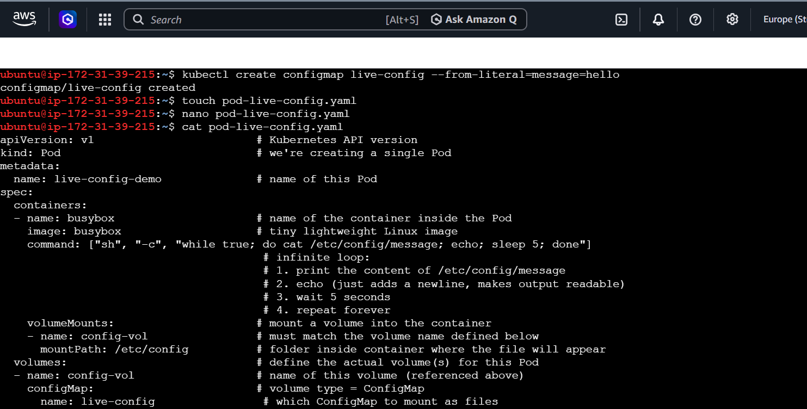
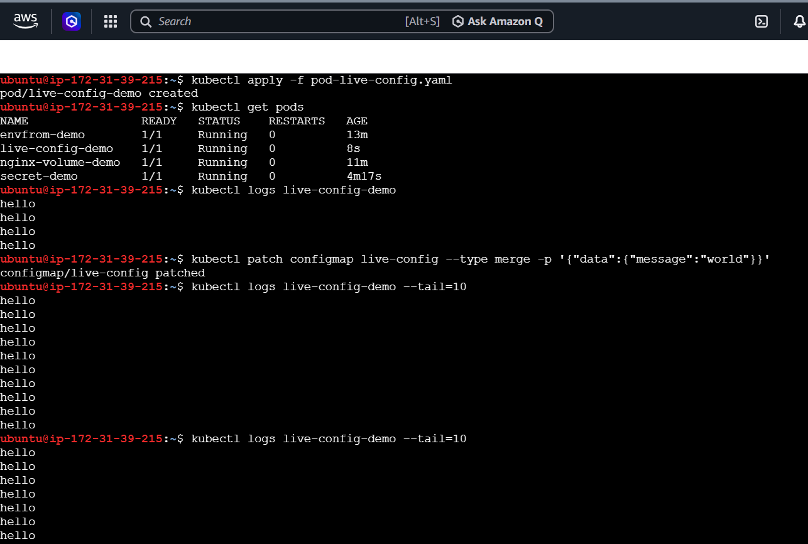
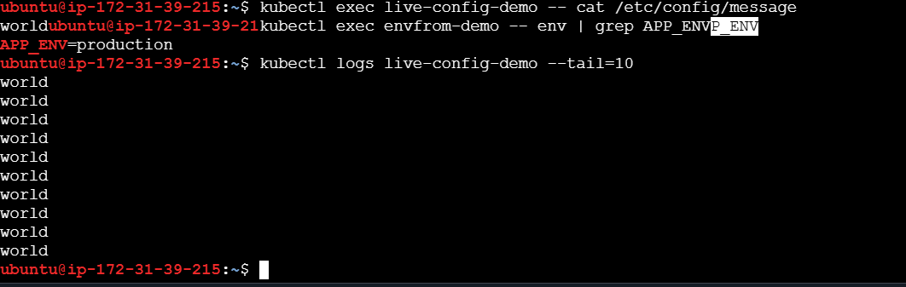
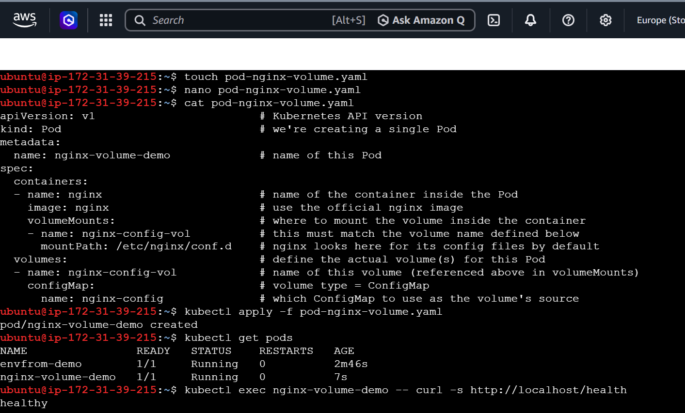

---

## Part 7: Cleanup (Task 7)

### Why cleanup matters
Every object you create (Pods, ConfigMaps, Secrets) keeps consuming a small amount of cluster resources and clutters `kubectl get` output. It's good practice to remove everything you made for practice once you're done, and it also builds the habit of tidy resource management that matters a lot in real production clusters.

### The commands
```bash
kubectl delete pod app-envfrom app-secret nginx-live-config
kubectl delete configmap app-config file-config live-config
kubectl delete secret db-credentials
```
- `kubectl delete <type> <name1> <name2> ...` — you can delete multiple objects of the same type in a single command by listing their names space-separated. This deletes:
  - All 3 Pods created in Tasks 3, 5, and 6.
  - All 3 ConfigMaps created in Tasks 1, 2, and 6.
  - The 1 Secret created in Task 4.

  (Note: `file-config` from Task 2 was never actually attached to a Pod in this guide — it's deleted here purely for cleanup completeness.)

### Verifying everything is gone
```bash
kubectl get pods
kubectl get configmap
kubectl get secret
```

**Expected results and what they mean:**
- `kubectl get pods` → `No resources found` — confirms all 3 practice Pods were removed.
- `kubectl get secret` → `No resources found` — confirms `db-credentials` was removed.
- `kubectl get configmap` → shows only `kube-root-ca.crt`. **This is normal and expected** — Kubernetes automatically creates this one specific ConfigMap in every namespace by default (it holds a certificate used for secure communication within the cluster). You never created it, and you should never delete it. Seeing *only* this one confirms every ConfigMap **you** made (`app-config`, `file-config`, `live-config`) was successfully deleted.

**Screenshot:**
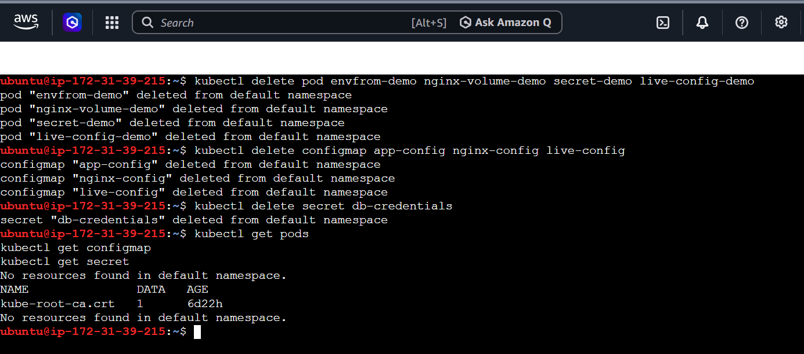

---

## Final Summary Table

| Concept | Plain-English meaning |
|---|---|
| ConfigMap | A cluster object that stores non-secret settings as plain, readable text |
| Secret | A cluster object that stores sensitive data, automatically base64-encoded (encoding ≠ encryption) |
| `--from-literal` | Create one key-value pair directly on the command line |
| `--from-file` | Load an entire existing file's content into one ConfigMap key |
| `envFrom` | Inject **all** keys from a ConfigMap/Secret as environment variables at once |
| `env` + `secretKeyRef`/`configMapKeyRef` | Inject **one specific** key as a named environment variable |
| `volumes` + `volumeMounts` | Inject ConfigMap/Secret data as **files** inside the container instead of environment variables |
| Environment variables vs volume mounts | Env vars are frozen at container start; volume-mounted files auto-update live when the source ConfigMap/Secret changes |
| Real Secret protection | Comes from Kubernetes RBAC (who is allowed to read Secrets), not from base64 encoding |
| `kube-root-ca.crt` | A default ConfigMap Kubernetes creates in every namespace automatically — not something you create or delete |

If you've read this top to bottom and typed every command yourself, you now understand not just *what* ConfigMaps and Secrets are, but *why* each command, field, and design choice exists — enough to explain it to someone else or reproduce it from memory.
