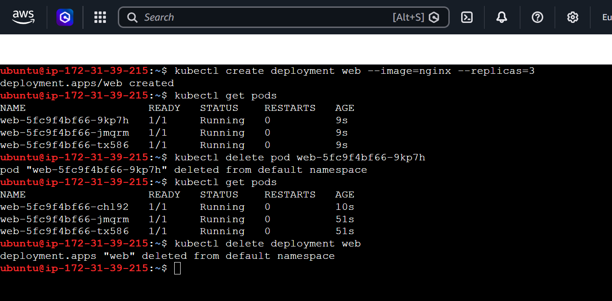
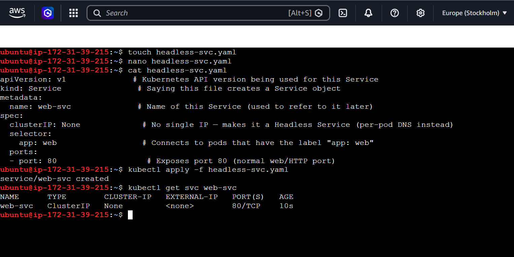
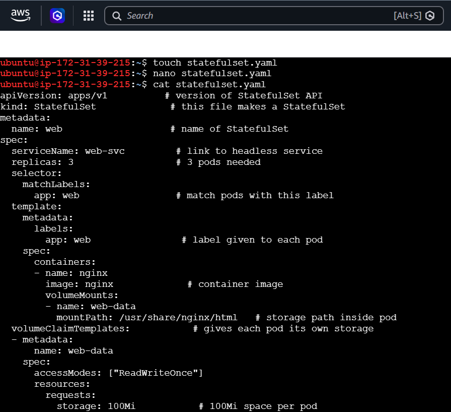
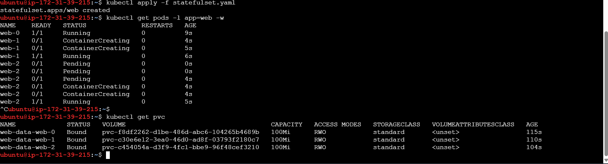
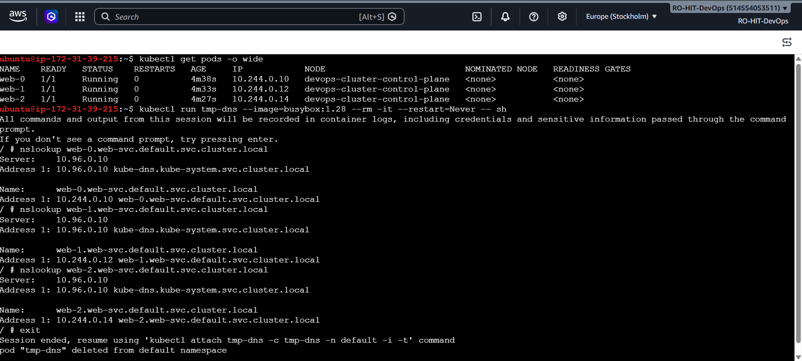
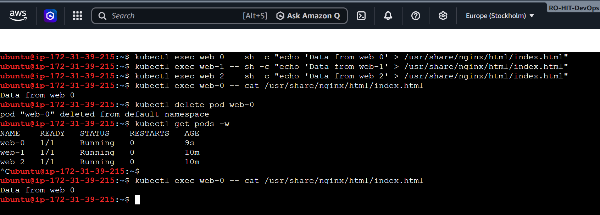
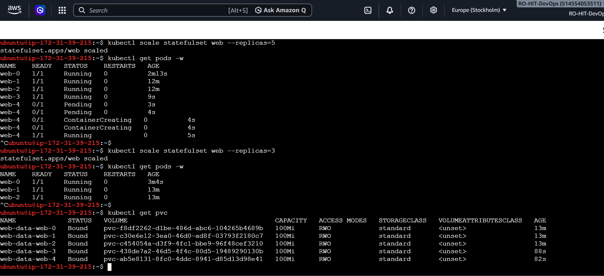
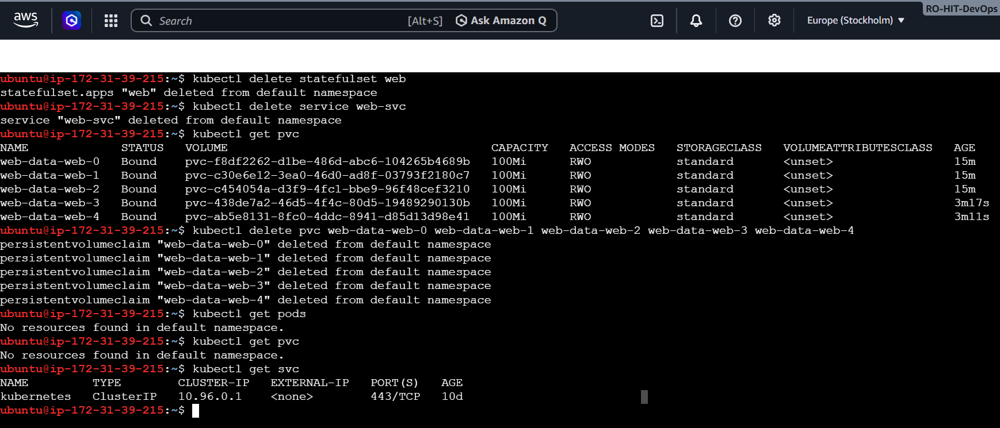

# Day 56 – Kubernetes StatefulSets

## Table of Contents
- [Introduction](#introduction)
- [Task 1: Understand the Problem with Deployments](#task-1-understand-the-problem-with-deployments)
- [Task 2: Create a Headless Service](#task-2-create-a-headless-service)
- [Task 3: Create a StatefulSet](#task-3-create-a-statefulset)
- [Task 4: Stable Network Identity (DNS Test)](#task-4-stable-network-identity-dns-test)
- [Task 5: Stable Storage — Data Survives Pod Deletion](#task-5-stable-storage--data-survives-pod-deletion)
- [Task 6: Ordered Scaling](#task-6-ordered-scaling)
- [Task 7: Clean Up](#task-7-clean-up)
- [Summary](#summary)

---

## Introduction

This is Day 56 of the 100 Days DevOps Challenge. Today's topic is **Kubernetes StatefulSets**.

You do not need to know anything from Day 54 or Day 55 to follow this file. Everything is explained from scratch, in simple words, with every command and every line of code explained.

### What is the problem we are solving?

In Kubernetes, a **Deployment** is normally used to run applications (like web servers). It works great when every pod (a running instance of your app) is identical and does not need to remember anything — this is called being "stateless."

But some applications are different. A **database** (like MySQL, PostgreSQL) or a messaging system (like Kafka) needs:
1. A **stable, predictable name** for each instance (so you always know which one is which).
2. Its **own separate storage** (so each instance keeps its own data, and does not lose it if it restarts).
3. To **start up in a fixed order** (for example, the "main" database node should start before the "replica" nodes that copy data from it).

A Deployment cannot guarantee any of these three things. A **StatefulSet** is a special Kubernetes object built exactly for this purpose.

### Quick Comparison

| Feature | Deployment | StatefulSet |
|---|---|---|
| Pod names | Random (e.g. `app-xyz-abc`) | Stable and ordered (e.g. `app-0`, `app-1`, `app-2`) |
| Startup order | All pods start at the same time | Ordered: pod-0 starts, becomes Ready, then pod-1 starts, and so on |
| Storage | All pods can share the same storage, or none | Each pod automatically gets its own separate storage (PVC) |
| Network identity | No fixed hostname | Each pod gets a fixed, predictable DNS hostname |

Now let's prove all of this ourselves, step by step, with real commands.

---

## Task 1: Understand the Problem with Deployments

**Goal:** See with our own eyes why a normal Deployment is not good enough for something like a database.

### Step 1.1 — Create a Deployment with 3 replicas of nginx

```bash
kubectl create deployment web --image=nginx --replicas=3
```

**What this command does, word by word:**
- `kubectl create deployment` → tells Kubernetes to create a new Deployment object.
- `web` → this is the name we are giving to our Deployment.
- `--image=nginx` → every pod in this Deployment will run the `nginx` container image (a simple web server).
- `--replicas=3` → we want 3 copies (pods) of this app running at the same time.

### Step 1.2 — Check the pod names

```bash
kubectl get pods
```

This lists all running pods. You will see something like:

```
NAME                   READY   STATUS    RESTARTS   AGE
web-5fc9f4bf66-9kp7h   1/1     Running   0          9s
web-5fc9f4bf66-jmqrm   1/1     Running   0          9s
web-5fc9f4bf66-tx586   1/1     Running   0          9s
```

**Important observation:** Look at the last part of each pod's name — `9kp7h`, `jmqrm`, `tx586`. These are **random**. There is no pattern, and you cannot predict what a new pod's name will be.

### Step 1.3 — Delete one pod and watch what happens

```bash
kubectl delete pod web-5fc9f4bf66-9kp7h
```

This deletes one specific pod (replace the name with whatever pod name you see in your own terminal).

Now check the pods again:

```bash
kubectl get pods
```

You will see something like:

```
NAME                   READY   STATUS    RESTARTS   AGE
web-5fc9f4bf66-chl92   1/1     Running   0          10s
web-5fc9f4bf66-jmqrm   1/1     Running   0          51s
web-5fc9f4bf66-tx586   1/1     Running   0          51s
```

**What happened:** Kubernetes automatically created a replacement pod (because the Deployment always tries to keep 3 pods running). But notice the new pod's name — `chl92` — this is a **completely new random name**, different from the one we deleted (`9kp7h`).

**Why this matters:** If this were a database, and each pod had a specific role (for example, "the main writer" vs "read-only copies"), losing the name every time a pod restarts would make it impossible to know which pod is which. This is the core problem StatefulSets solve.

### Step 1.4 — Clean up

```bash
kubectl delete deployment web
```

This deletes the whole Deployment (and all its pods) so we have a clean environment for the next task.

### 📸 Screenshot


### ✅ Verify: Why would random pod names be a problem for a database cluster?

Because in a database cluster, each node usually has a fixed role (for example, a "primary" node that accepts writes, and "replica" nodes that only read). Other parts of the system need to reliably know the name/address of the primary node to send writes to it. If names change randomly every time a pod restarts, there is no way to reliably identify "which node is the primary" — the whole cluster would break every time a pod restarted.

---

## Task 2: Create a Headless Service

**Goal:** Create a special kind of Service that gives each pod its own DNS name, instead of giving one shared IP address for all pods (which is what a normal Service does).

### Why do we need this at all?

A normal Kubernetes Service works like a load balancer: it has **one IP address**, and any traffic sent to that IP gets randomly forwarded to one of the matching pods. That is perfect for stateless web servers, but it is a problem for something like a database, where you need to reach **one specific pod** directly (for example, only the primary database node) — not a random one.

A **Headless Service** solves this. It does **not** get a single IP address. Instead, Kubernetes' internal DNS system creates a **separate DNS record for every individual pod**. This is required by every StatefulSet.

### Step 2.1 — Create the Service file

```bash
touch headless-svc.yaml
nano headless-svc.yaml
```

- `touch headless-svc.yaml` → creates a new, empty file with this name.
- `nano headless-svc.yaml` → opens a simple text editor so we can write our YAML code into the file.

Paste this code into the file:

```yaml
apiVersion: v1              # Kubernetes API version being used for this Service
kind: Service                # Saying this file creates a Service object
metadata:
  name: web-svc              # Name of this Service (used to refer to it later)
spec:
  clusterIP: None             # No single IP — makes it a Headless Service (per-pod DNS instead)
  selector:
    app: web                  # Connects to pods that have the label "app: web"
  ports:
  - port: 80                   # Exposes port 80 (normal web/HTTP port)
```

**Explanation of every part:**
- `apiVersion: v1` — Every Kubernetes object type has an API version. For a Service, it is always `v1`.
- `kind: Service` — This tells Kubernetes what kind of object to create — here, a Service.
- `metadata.name: web-svc` — Just a label/name for this Service so we (and the StatefulSet, later) can refer to it.
- `spec.clusterIP: None` — **This is the most important line.** Setting it to `None` is exactly what turns a normal Service into a Headless Service.
- `spec.selector.app: web` — This tells the Service which pods it should manage. It looks for any pod that has the label `app: web`. Our StatefulSet pods (created in Task 3) will have this exact label, so this Service will automatically apply to them.
- `spec.ports.port: 80` — The network port this Service listens on (80 is the standard web/HTTP port).

Save and exit the editor (in `nano`: press `Ctrl+O`, then `Enter`, then `Ctrl+X`).

### Step 2.2 — Apply the file to Kubernetes

```bash
kubectl apply -f headless-svc.yaml
```

This tells Kubernetes: "read this YAML file, and create the object described inside it."

### Step 2.3 — Confirm it is a Headless Service

```bash
kubectl get svc web-svc
```

Expected output:

```
NAME      TYPE        CLUSTER-IP   EXTERNAL-IP   PORT(S)   AGE
web-svc   ClusterIP   None         <none>        80/TCP    10s
```

### 📸 Screenshot


### ✅ Verify: What does the CLUSTER-IP column show?

It shows **`None`**. This confirms the Service has no single shared IP address — exactly what we want for a Headless Service. Instead of load-balancing to one address, Kubernetes will create individual DNS entries for each pod that matches this Service.

---

## Task 3: Create a StatefulSet

**Goal:** Create the actual StatefulSet — 3 pods with stable names and their own individual storage.

### Step 3.1 — Create the StatefulSet file

```bash
touch statefulset.yaml
nano statefulset.yaml
```

Paste this code into the file:

```yaml
apiVersion: apps/v1          # version of StatefulSet API
kind: StatefulSet             # this file makes a StatefulSet
metadata:
  name: web                   # name of StatefulSet
spec:
  serviceName: web-svc         # link to headless service
  replicas: 3                  # 3 pods needed
  selector:
    matchLabels:
      app: web                 # match pods with this label
  template:
    metadata:
      labels:
        app: web                # label given to each pod
    spec:
      containers:
      - name: nginx
        image: nginx             # container image
        volumeMounts:
        - name: web-data
          mountPath: /usr/share/nginx/html   # storage path inside pod
  volumeClaimTemplates:           # gives each pod its own storage
  - metadata:
      name: web-data
    spec:
      accessModes: ["ReadWriteOnce"]
      resources:
        requests:
          storage: 100Mi           # 100Mi space per pod
```

**Explanation of every part:**
- `apiVersion: apps/v1` — the API version used for StatefulSet objects.
- `kind: StatefulSet` — tells Kubernetes what type of object this is.
- `metadata.name: web` — the name of our StatefulSet.
- `spec.serviceName: web-svc` — **this links the StatefulSet to the Headless Service we made in Task 2.** This is what makes DNS names work for each pod.
- `spec.replicas: 3` — we want 3 pods.
- `spec.selector.matchLabels.app: web` — the StatefulSet needs to know which pods "belong" to it — it looks for the label `app: web`.
- `spec.template` — this describes the pods that will be created:
  - `labels.app: web` — every pod gets this label (must match the selector above, and the Service's selector from Task 2).
  - `containers.image: nginx` — every pod runs the nginx web server.
  - `volumeMounts.mountPath: /usr/share/nginx/html` — inside the container, this is the folder where the persistent storage will be attached. Anything written here will be saved even if the pod restarts.
- `spec.volumeClaimTemplates` — **this is the special part that makes each pod get its own separate storage.** For every pod (`web-0`, `web-1`, `web-2`), Kubernetes will automatically create a separate PersistentVolumeClaim (PVC) named `web-data-web-0`, `web-data-web-1`, `web-data-web-2` — each with 100Mi of space, and each completely separate from the others.

### Step 3.2 — Apply the file and watch pods being created

```bash
kubectl apply -f statefulset.yaml
kubectl get pods -l app=web -w
```

- `kubectl apply -f statefulset.yaml` — creates the StatefulSet.
- `kubectl get pods -l app=web -w` — lists pods with the label `app=web`, and the `-w` flag means "watch" — it keeps the output live-updating on screen instead of showing it once and stopping.

Expected output over time:

```
NAME    READY   STATUS              RESTARTS   AGE
web-0   1/1     Running             0          9s
web-1   0/1     ContainerCreating   0          4s
web-1   0/1     ContainerCreating   0          5s
web-1   1/1     Running             0          6s
web-2   0/1     Pending             0          0s
web-2   0/1     Pending             0          0s
web-2   0/1     Pending             0          4s
web-2   0/1     ContainerCreating   0          4s
web-2   0/1     ContainerCreating   0          4s
web-2   1/1     Running             0          5s
```

**What to notice:** `web-0` becomes fully `Running` first. Only **after** `web-0` is ready does `web-1` start being created. Only after `web-1` is ready does `web-2` start. This is the **ordered startup** behavior unique to StatefulSets.

Once all 3 pods show `Running`, press `Ctrl+C` to stop watching.

### Step 3.3 — Check the PVCs (storage)

```bash
kubectl get pvc
```

Expected output:

```
NAME             STATUS   VOLUME                                     CAPACITY   ACCESS MODES   STORAGECLASS   AGE
web-data-web-0   Bound    pvc-f8df2262-...                           100Mi      RWO            standard       115s
web-data-web-1   Bound    pvc-c30e6e12-...                           100Mi      RWO            standard       110s
web-data-web-2   Bound    pvc-c454054a-...                           100Mi      RWO            standard       104s
```

Notice the naming pattern: `<volumeClaimTemplate-name>-<pod-name>` → `web-data-web-0`, `web-data-web-1`, `web-data-web-2`. Each is a completely separate piece of storage.

### 📸 Screenshots



### ✅ Verify: What are the exact pod names and PVC names?

- **Pod names:** `web-0`, `web-1`, `web-2`
- **PVC names:** `web-data-web-0`, `web-data-web-1`, `web-data-web-2`

---

## Task 4: Stable Network Identity (DNS Test)

**Goal:** Prove that every pod gets a fixed, predictable DNS hostname — and that this hostname always points to the correct pod.

Every StatefulSet pod automatically gets a DNS name in this format:

```
<pod-name>.<service-name>.<namespace>.svc.cluster.local
```

In our case: `web-0.web-svc.default.svc.cluster.local`, `web-1.web-svc.default.svc.cluster.local`, and so on.

### Step 4.1 — Check the current IP address of each pod

```bash
kubectl get pods -o wide
```

`-o wide` shows extra columns, including each pod's internal IP address. Example output:

```
NAME    READY   STATUS    RESTARTS   AGE     IP            NODE
web-0   1/1     Running   0          4m38s   10.244.0.10   devops-cluster-control-plane
web-1   1/1     Running   0          4m33s   10.244.0.12   devops-cluster-control-plane
web-2   1/1     Running   0          4m27s   10.244.0.14   devops-cluster-control-plane
```

Keep these IP addresses noted — we will compare them with the DNS lookup results.

### Step 4.2 — Start a temporary test pod

```bash
kubectl run tmp-dns --image=busybox:1.28 --rm -it --restart=Never -- sh
```

- `kubectl run tmp-dns` — creates one temporary pod named `tmp-dns`.
- `--image=busybox:1.28` — busybox is a tiny Linux image that includes basic networking tools like `nslookup`.
- `--rm` — automatically deletes this pod as soon as we exit it (so we don't leave test resources lying around).
- `-it` — gives us an interactive terminal session inside the pod.
- `--restart=Never` — don't try to restart this pod if it stops; it's meant to be temporary.
- `-- sh` — once inside, start a shell so we can type commands.

You are now inside the temporary pod's shell (prompt will look like `/ #`).

### Step 4.3 — Look up each pod's DNS name

Run these one at a time (replace `web-svc` if you named your Service differently):

```bash
nslookup web-0.web-svc.default.svc.cluster.local
```
```bash
nslookup web-1.web-svc.default.svc.cluster.local
```
```bash
nslookup web-2.web-svc.default.svc.cluster.local
```

`nslookup` asks the DNS system: "what IP address does this hostname point to?" Example output for one pod:

```
Name:      web-0.web-svc.default.svc.cluster.local
Address 1: 10.244.0.10 web-0.web-svc.default.svc.cluster.local
```

### Step 4.4 — Compare with Step 4.1

| Pod | IP from `get pods -o wide` | IP from `nslookup` | Match? |
|---|---|---|---|
| web-0 | 10.244.0.10 | 10.244.0.10 | ✅ |
| web-1 | 10.244.0.12 | 10.244.0.12 | ✅ |
| web-2 | 10.244.0.14 | 10.244.0.14 | ✅ |

Type `exit` to leave the temporary pod's shell (it will delete itself automatically because of `--rm`).

### 📸 Screenshot


### ✅ Verify: Does the nslookup IP match the pod IP?

**Yes.** For all three pods, the IP address returned by `nslookup` was exactly the same as the pod's actual IP shown by `kubectl get pods -o wide`. This proves that each pod has its own working, predictable DNS name — something a normal Deployment cannot offer.

---

## Task 5: Stable Storage — Data Survives Pod Deletion

**Goal:** Prove that if a StatefulSet pod is deleted and recreated, it keeps its old data (because it reconnects to the same storage).

### Step 5.1 — Write unique data into each pod

```bash
kubectl exec web-0 -- sh -c "echo 'Data from web-0' > /usr/share/nginx/html/index.html"
kubectl exec web-1 -- sh -c "echo 'Data from web-1' > /usr/share/nginx/html/index.html"
kubectl exec web-2 -- sh -c "echo 'Data from web-2' > /usr/share/nginx/html/index.html"
```

- `kubectl exec web-0 -- sh -c "..."` — runs a command **inside** the `web-0` pod.
- `echo 'Data from web-0' > /usr/share/nginx/html/index.html` — writes the text "Data from web-0" into a file called `index.html`, saved inside the pod's mounted storage (remember, we set this exact path as the `mountPath` in Task 3).

### Step 5.2 — Confirm the data is there

```bash
kubectl exec web-0 -- cat /usr/share/nginx/html/index.html
```

Expected output: `Data from web-0`

### Step 5.3 — Delete the pod

```bash
kubectl delete pod web-0
```

This deletes only the `web-0` pod itself — **not** its storage (PVC).

### Step 5.4 — Wait for it to come back

```bash
kubectl get pods -w
```

Wait until `web-0` shows `Running` again, then press `Ctrl+C`.

### Step 5.5 — Check the data again

```bash
kubectl exec web-0 -- cat /usr/share/nginx/html/index.html
```

Expected output: `Data from web-0` (exactly the same as before).

### 📸 Screenshot


### ✅ Verify: Is the data identical after pod recreation?

**Yes, identical.** When `web-0` was deleted, its PVC (`web-data-web-0`) was **not** deleted. When Kubernetes created a brand-new `web-0` pod to replace it, that new pod automatically reconnected to the **same** PVC — so all the old data was still there. This is only possible because of the stable, one-to-one relationship between each pod and its own PVC, which is unique to StatefulSets.

---

## Task 6: Ordered Scaling

**Goal:** Prove that scaling up and down also happens in a strict, predictable order — and that storage is not deleted automatically when you scale down.

### Step 6.1 — Scale up to 5 replicas

```bash
kubectl scale statefulset web --replicas=5
kubectl get pods -w
```

- `kubectl scale statefulset web --replicas=5` — tells Kubernetes to change the StatefulSet named `web` so that it has 5 pods instead of 3.
- Watch the output: `web-3` will be created and become `Running` **first**. Only after that does `web-4` start being created.

Press `Ctrl+C` once all 5 pods show `Running`.

### Step 6.2 — Scale down to 3 replicas

```bash
kubectl scale statefulset web --replicas=3
kubectl get pods -w
```

Watch what happens this time: pods are removed in **reverse order** — `web-4` is terminated first, then `web-3`. The original three (`web-0`, `web-1`, `web-2`) are left untouched.

Press `Ctrl+C` once only `web-0`, `web-1`, and `web-2` remain.

### Step 6.3 — Check the PVCs

```bash
kubectl get pvc
```

Expected: **all 5 PVCs are still present** — `web-data-web-0` through `web-data-web-4` — even though only 3 pods currently exist.

### 📸 Screenshot


### ✅ Verify: After scaling down, how many PVCs exist?

**All 5 PVCs still exist** (`web-data-web-0` to `web-data-web-4`), even though we scaled back down to 3 pods. Kubernetes deliberately does **not** delete a pod's storage when it is removed by scaling down. This means if you scale back up to 5 later, `web-3` and `web-4` would reconnect to their old storage and get their old data back, instead of starting empty.

---

## Task 7: Clean Up

**Goal:** Remove everything we created, and confirm that storage is not deleted automatically — it must be removed manually as a safety measure.

### Step 7.1 — Delete the StatefulSet and the Headless Service

```bash
kubectl delete statefulset web
kubectl delete service web-svc
```

### Step 7.2 — Check the PVCs

```bash
kubectl get pvc
```

You will see that **all the PVCs are still there**, even though the StatefulSet and Service are both gone.

### Step 7.3 — Delete the PVCs manually

```bash
kubectl delete pvc web-data-web-0 web-data-web-1 web-data-web-2 web-data-web-3 web-data-web-4
```

This deletes each PVC one by one, by name.

### Step 7.4 — Confirm everything is cleaned up

```bash
kubectl get pods
kubectl get pvc
kubectl get svc
```

Expected: no pods, no PVCs, and only the default `kubernetes` service remains.

### 📸 Screenshot


### ✅ Verify: Were PVCs auto-deleted with the StatefulSet?

**No.** Deleting the StatefulSet did **not** delete its PVCs. This is an intentional safety feature in Kubernetes — it protects your data (for example, a real database's data) from being accidentally destroyed just because someone deleted the StatefulSet. PVCs must always be deleted manually and deliberately, as a separate step.

---

## Summary

| Task | What we proved |
|---|---|
| 1 | Deployment pods get random names that change on every restart |
| 2 | A Headless Service (`clusterIP: None`) gives per-pod DNS instead of one shared IP |
| 3 | A StatefulSet creates pods with stable names (`web-0`, `web-1`, `web-2`) in strict order, each with its own PVC |
| 4 | Each pod's DNS name reliably resolves to that exact pod's IP address |
| 5 | Deleting a pod does not delete its data — the new pod reconnects to the same storage |
| 6 | Scaling up creates pods in order; scaling down removes them in reverse order; PVCs are always kept |
| 7 | Deleting a StatefulSet never auto-deletes its PVCs — this is a deliberate safety feature |

Bottom line: Use a Deployment for stateless apps (web servers, APIs) where any pod can be replaced by any other pod at any time. Use a StatefulSet for anything that needs stable identity, its own storage, and ordered startup — such as databases (MySQL, PostgreSQL) or distributed systems (Kafka, Zookeeper).
