# Day 57 – Resource Requests, Limits, and Probes

## Introduction

When you run a Pod in Kubernetes, two big questions come up:

1. **How much CPU and memory does this Pod actually need, and how much is it allowed to use?**
2. **How does Kubernetes know if the Pod is actually healthy, or just "running" but stuck/broken?**

Today's challenge answers both questions using:
- **Resource Requests & Limits** – tells Kubernetes how much CPU/memory a Pod needs (minimum) and is allowed to use (maximum)
- **Probes** (Liveness, Readiness, Startup) – health checks that let Kubernetes automatically detect and react to problems

You do **not** need to know anything from previous days to follow this guide. Every command, every line of YAML, and every concept is explained from scratch.

---

## Core Concepts (Read this before starting)

### Requests vs Limits

| Term | Meaning |
|------|---------|
| **Request** | The minimum amount of CPU/memory a Pod is guaranteed to get. The Kubernetes **scheduler** uses this number to decide which node has enough room to place the Pod. |
| **Limit** | The maximum amount of CPU/memory a Pod is allowed to use. The **kubelet** (the agent running on each node) enforces this at runtime. |

**Units:**
- CPU is measured in **millicores**. `100m` = 0.1 of one CPU core. `1000m` = 1 full core.
- Memory is measured in **mebibytes/gibibytes**. `128Mi` = 128 Mebibytes. `1Gi` = 1024Mi.

**What happens when you cross a limit?**
- **Memory limit exceeded** → the container is immediately killed. This is called **OOMKilled** (Out Of Memory Killed). No warning, no grace period.
- **CPU limit exceeded** → the container is **throttled** (slowed down), not killed. CPU is a "soft" resource; memory is not.

### QoS (Quality of Service) Class

Kubernetes automatically assigns every Pod a QoS class based on how you set requests/limits. This class decides which Pods get evicted first if a node runs low on resources.

| Requests vs Limits | QoS Class | Eviction Priority |
|---------------------|-----------|--------------------|
| Requests == Limits (for every container/resource) | **Guaranteed** | Evicted last (safest) |
| Requests set, Limits set, but they differ | **Burstable** | Evicted second |
| Nothing set at all | **BestEffort** | Evicted first (least safe) |

### Probes (Health Checks)

A probe is a periodic check Kubernetes runs against your container to decide if it's healthy. There are three kinds:

| Probe | Question it answers | What happens on failure |
|-------|----------------------|--------------------------|
| **Liveness Probe** | "Is this container still alive/working (not stuck/deadlocked)?" | Container is **restarted** |
| **Readiness Probe** | "Is this container ready to receive traffic right now?" | Container is **removed from Service endpoints** (no traffic sent to it) — it is **NOT restarted** |
| **Startup Probe** | "Has this slow-starting container finished starting up yet?" | While this probe is running, Liveness and Readiness probes are **disabled**. If it never succeeds within its budget, the container is restarted. |

**Simple analogy:** Think of a hotel.
- **Request** = the minimum guaranteed room size when you book.
- **Limit** = the max number of people allowed in that room — go over it, and security (kubelet) removes the excess (or kicks everyone out, in memory's case).
- **Liveness probe** = staff checking "are you actually in the room and OK?" — if not, they reset the room.
- **Readiness probe** = staff checking "are you dressed and ready for guests?" — if not, they just stop sending guests your way, but don't kick you out.
- **Startup probe** = staff giving a new guest extra time to settle in before starting any checks at all.

---

## Prerequisites

- A working Kubernetes cluster (this guide used a local `kind`/`devops-cluster` setup, but any cluster works)
- `kubectl` installed and configured to talk to your cluster
- Basic comfort typing commands in a terminal

All files created below can be created with `nano <filename>.yaml`, pasting the content, then saving (`Ctrl+O`, `Enter`, `Ctrl+X` in nano).

---

## Task 1: Resource Requests and Limits

**Goal:** Create a Pod with defined CPU/memory requests and limits, then confirm its QoS Class.

### Step 1 — Write the Pod manifest

Create a file called `pod-resources.yaml`:

```yaml
apiVersion: v1                     # Kubernetes API version being used
kind: Pod                          # We are creating a Pod (not Deployment etc.)
metadata:
  name: resource-demo-pod          # Name of this Pod
spec:
  containers:
  - name: demo-container           # Name of the container inside the Pod
    image: nginx                   # Using nginx image (simple web server, easy to test)
    resources:
      requests:
        cpu: "100m"                # Minimum CPU guaranteed = 0.1 core
        memory: "128Mi"            # Minimum memory guaranteed = 128 Mebibytes
      limits:
        cpu: "250m"                # Maximum CPU allowed = 0.25 core (throttled if exceeded)
        memory: "256Mi"            # Maximum memory allowed = 256 Mebibytes (OOMKilled if exceeded)
```

**Why these values?** Requests (100m/128Mi) are lower than limits (250m/256Mi) on purpose — this makes the QoS class "Burstable" (see the table above).

### Step 2 — Apply the manifest

```bash
kubectl apply -f pod-resources.yaml
```

This command sends your YAML file to the cluster, which creates the Pod. You should see:
```
pod/resource-demo-pod created
```

### Step 3 — Inspect the Pod

```bash
kubectl describe pod resource-demo-pod
```

`describe` shows full details about a resource — its config, current state, and recent events. Look for these three sections in the output:
- `Requests:` → should show `cpu: 100m`, `memory: 128Mi`
- `Limits:` → should show `cpu: 250m`, `memory: 256Mi`
- `QoS Class:` → should show `Burstable`

**Why Burstable?** Because requests and limits are both set, but they are **not equal** to each other.

### Screenshots
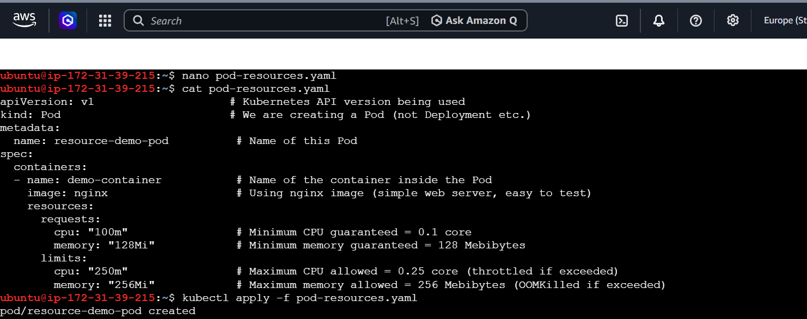
*manifest file created and applied*
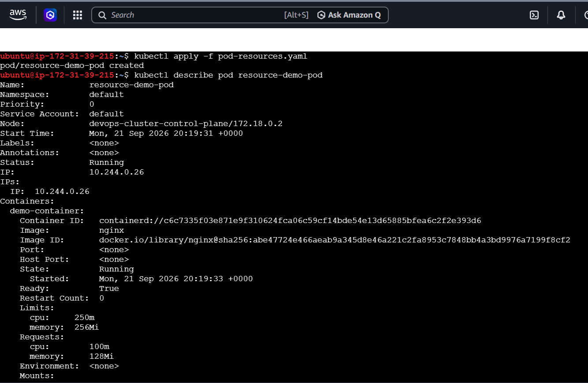
*describe output showing Limits/Requests*

*describe output showing `QoS Class: Burstable`*

### ✅ Verify
**Question:** What QoS class does your Pod have?
**Answer:** `Burstable` — because requests and limits are set but not equal.

---

## Task 2: OOMKilled — Exceeding Memory Limits

**Goal:** Deliberately make a container use more memory than its limit allows, and observe Kubernetes kill it (OOMKilled).

### Step 1 — Write the Pod manifest

Create a file called `oom-demo-pod.yaml`:

```yaml
apiVersion: v1                     # Kubernetes API version
kind: Pod                          # Creating a Pod
metadata:
  name: oom-demo-pod                # Name of this Pod
spec:
  containers:
  - name: stress-container          # Container name
    image: polinux/stress           # Image built specifically to generate CPU/memory load for testing
    resources:
      limits:
        memory: "100Mi"              # Max memory allowed = 100 Mebibytes
    command: ["stress"]             # Run the 'stress' command
    args: ["--vm", "1", "--vm-bytes", "200M", "--vm-hang", "1"]
    # --vm 1          = spin up 1 memory-stress worker process
    # --vm-bytes 200M = that worker tries to allocate 200MB of memory
    # --vm-hang 1     = hold onto that memory instead of releasing it immediately
```

**The trick:** We only set a `limit` (100Mi), no `request` — but more importantly, we tell the container to try to grab **200MB**, which is **double** the 100Mi limit. Kubernetes will not allow this.

### Step 2 — Apply it

```bash
kubectl apply -f oom-demo-pod.yaml
```
Expected output: `pod/oom-demo-pod created`

### Step 3 — Describe the Pod

```bash
kubectl describe pod oom-demo-pod
```

Since the container tries to use more memory than its 100Mi limit, the kubelet kills it almost instantly. Look for:
- `State: Terminated`
- `Reason: OOMKilled`
- `Exit Code: 137`

**Why 137?** In Linux, when a process is killed by a signal, the exit code is `128 + signal number`. The kill signal used here is `SIGKILL` (signal number 9). So: `128 + 9 = 137`. This exit code **always** means "this process was forcefully killed," and in Kubernetes it's the fingerprint of an OOM kill.

You'll also notice `Restart Count` increasing and an event like:
```
Warning  BackOff  kubelet  Back-off restarting failed container
```
This means Kubernetes tried restarting the container, it got OOMKilled again (because the command never changes), and Kubernetes started slowing down its retries — this is the beginning of `CrashLoopBackOff`.

### Screenshots
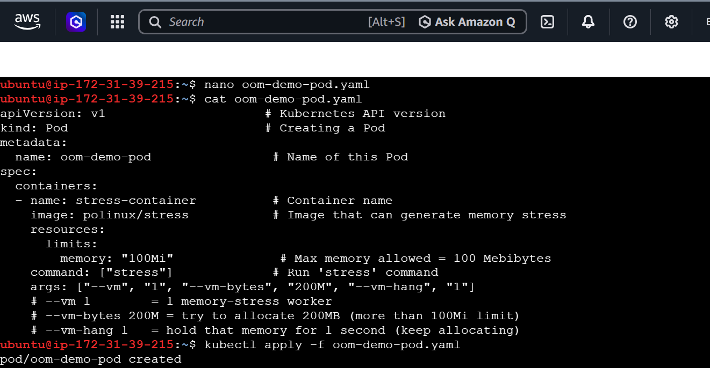
*manifest created and applied*
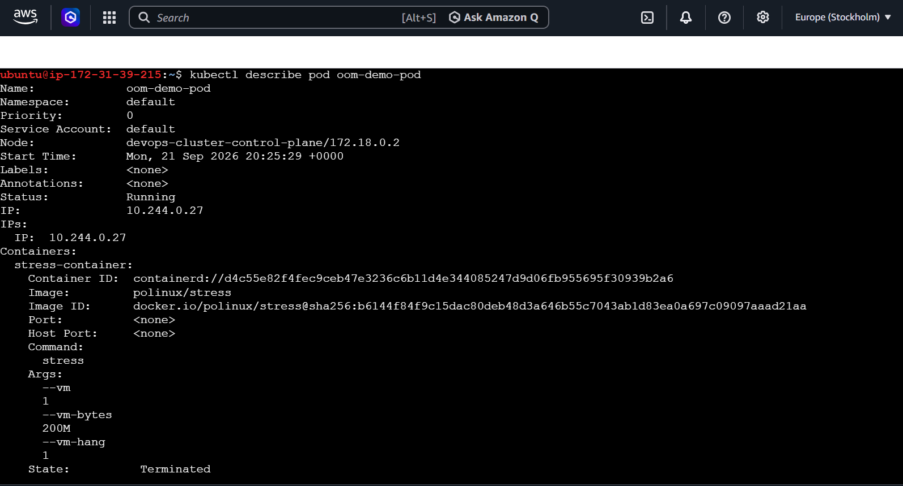
*describe output, container state*
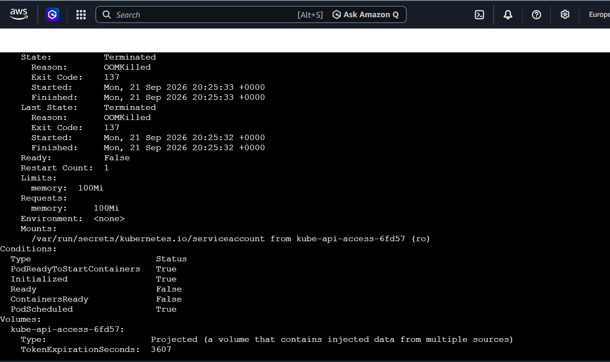
*Reason: OOMKilled, Exit Code: 137*
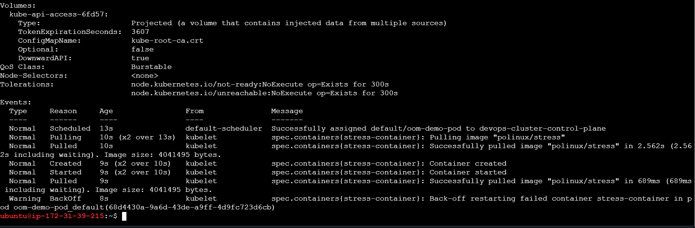
*QoS class + BackOff event*

### ✅ Verify
**Question:** What exit code does an OOMKilled container have?
**Answer:** `137` (which is `128 + 9`, where `9` is the SIGKILL signal number).

---

## Task 3: Pending Pod — Requesting Too Much

**Goal:** Request an unreasonably large amount of CPU/memory and see what happens when no node can satisfy it.

### Step 1 — Write the Pod manifest

Create a file called `pending-pod.yaml`:

```yaml
apiVersion: v1                     # Kubernetes API version
kind: Pod                          # Creating a Pod
metadata:
  name: pending-demo-pod            # Name of this Pod
spec:
  containers:
  - name: greedy-container          # Container name
    image: nginx                    # Simple image
    resources:
      requests:
        cpu: "100"                   # Requesting 100 FULL CPU cores (unrealistic for a normal node)
        memory: "128Gi"              # Requesting 128 Gibibytes of memory (also unrealistic)
```

**The trick:** `cpu: "100"` (no `m` suffix) means **100 whole CPU cores** — a normal machine (laptop, small cloud VM) has nowhere near that. Same with `128Gi` of memory.

### Step 2 — Apply it

```bash
kubectl apply -f pending-pod.yaml
```
Expected output: `pod/pending-demo-pod created`

### Step 3 — Check the status

```bash
kubectl get pod pending-demo-pod
```

You will see:
```
NAME               READY   STATUS    RESTARTS   AGE
pending-demo-pod   0/1     Pending   0          10s
```

**Why "Pending"?** The Pod object was accepted by the cluster (it exists), but the **scheduler** could not find any node with enough free CPU/memory to place it on. It will stay `Pending` forever unless you lower the request or add a bigger node.

### Step 4 — Describe it to see the exact reason

```bash
kubectl describe pod pending-demo-pod
```

Look at the `Events:` section at the bottom:
```
Warning  FailedScheduling  default-scheduler  0/1 nodes are available: 1 Insufficient cpu, 1 Insufficient memory. preemption: 0/1 nodes are available: 1 Preemption is not helpful for scheduling.
```

**Breaking this down:**
- `0/1 nodes are available` → out of 1 node in the cluster, 0 nodes qualify
- `Insufficient cpu, Insufficient memory` → that node doesn't have enough of either resource
- `preemption ... not helpful` → Kubernetes even considered evicting other Pods to make room, but the gap is so huge that even that wouldn't help

You'll also notice:
- `Node: <none>` → no node was ever assigned
- `PodScheduled: False` → confirms scheduling never succeeded

### Screenshots
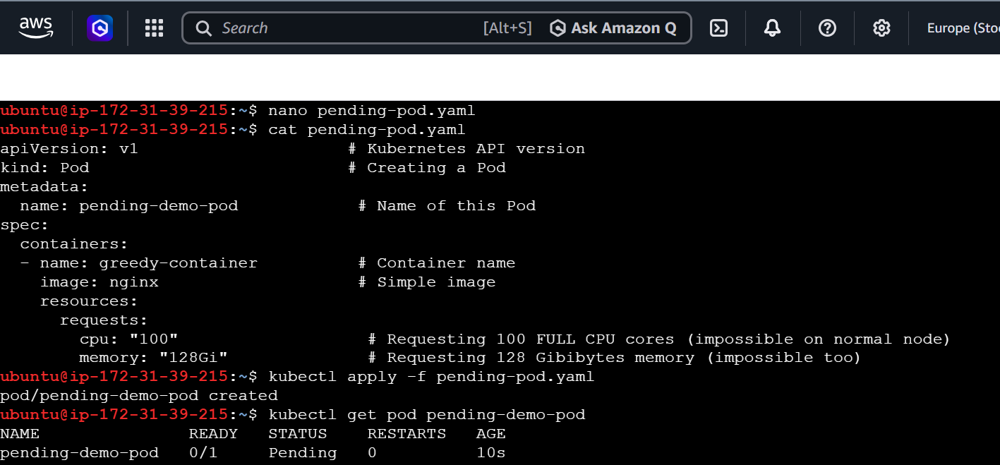
*manifest, apply, and Pending status*
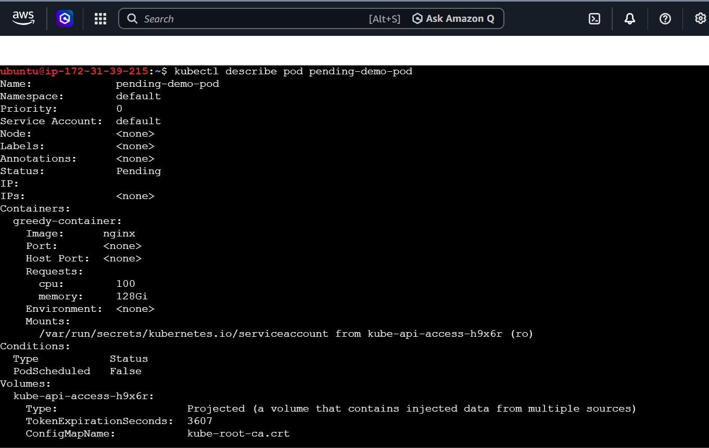
*describe output, Node: none*
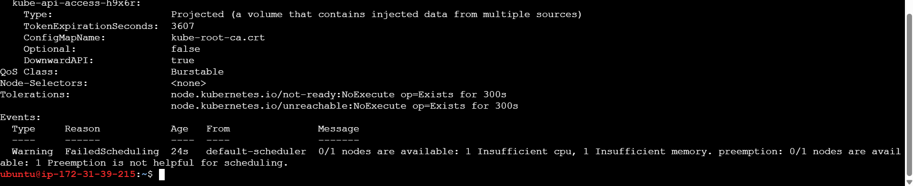
*the FailedScheduling event message*

### ✅ Verify
**Question:** What event message does the scheduler produce?
**Answer:** `0/1 nodes are available: 1 Insufficient cpu, 1 Insufficient memory. preemption: 0/1 nodes are available: 1 Preemption is not helpful for scheduling.`

---

## Task 4: Liveness Probe

**Goal:** Set up a probe that detects a "stuck" container and see Kubernetes restart it automatically.

### Step 1 — Write the Pod manifest

Create a file called `liveness-pod.yaml`:

```yaml
apiVersion: v1                          # Kubernetes API version
kind: Pod                               # Creating a Pod
metadata:
  name: liveness-demo-pod                # Name of this Pod
spec:
  containers:
  - name: liveness-container             # Container name
    image: busybox                       # Tiny, lightweight image with basic shell commands
    args:
    - /bin/sh
    - -c
    - touch /tmp/healthy; sleep 30; rm -f /tmp/healthy; sleep 600
    # touch /tmp/healthy   = creates the file (this marks the Pod as "healthy" for now)
    # sleep 30             = wait for 30 seconds while the file exists
    # rm -f /tmp/healthy   = deletes the file after 30 sec (Pod becomes "unhealthy")
    # sleep 600            = keeps the container running afterward (so it doesn't exit)
    livenessProbe:
      exec:
        command:
        - cat
        - /tmp/healthy                   # This command succeeds if the file exists, fails if it doesn't
      initialDelaySeconds: 5             # Wait 5 sec after container starts before running the first check
      periodSeconds: 5                   # Run the check every 5 seconds
      failureThreshold: 3                # Restart the container after 3 consecutive failed checks
```

**How the `exec` probe works:** Kubernetes runs the given command **inside the container**. If the command exits with code `0` (success), the probe passes. If it exits with a non-zero code (like when `cat` can't find a missing file), the probe fails.

**Timeline of what will happen:**
1. `0–30s`: file exists → every probe (every 5s) passes
2. `30s`: file gets deleted
3. `30–45s`: probe fails 3 times in a row (3 × 5s = 15s)
4. `~45s`: Kubernetes restarts the container

### Step 2 — Apply it

```bash
kubectl apply -f liveness-pod.yaml
```
Expected output: `pod/liveness-demo-pod created`

### Step 3 — Watch it live

```bash
kubectl get pod liveness-demo-pod -w
```

`-w` means **watch** — instead of showing the status once, this command keeps running and prints a new line every time something changes. Watch the `RESTARTS` column:

```
NAME                READY   STATUS    RESTARTS      AGE
liveness-demo-pod   1/1     Running   0             75s
liveness-demo-pod   1/1     Running   1 (1s ago)    76s
```

Once you see `RESTARTS` go from `0` to `1`, press `Ctrl + C` to stop watching.

**Note:** This cycle repeats forever if you leave the Pod running — every ~45 seconds it will restart again, because the same startup command runs each time.

### Screenshots
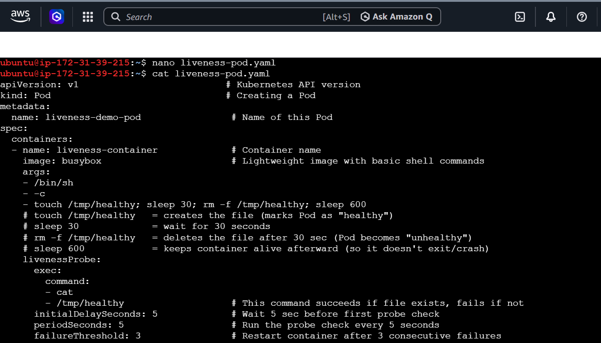
*manifest with livenessProbe config*
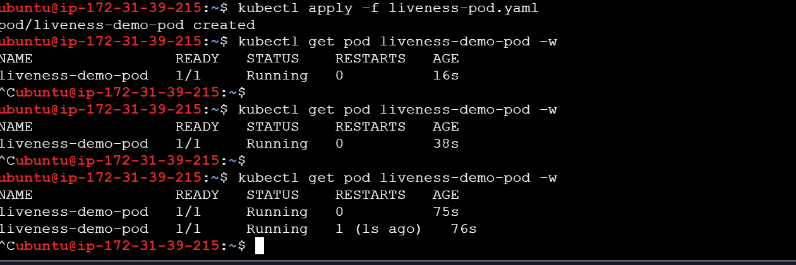
*watch output showing RESTARTS: 0 → 1*

### ✅ Verify
**Question:** How many times has the container restarted?
**Answer:** `1` time (RESTARTS column shows `1 (1s ago)` after the healthy file was deleted and 3 consecutive probe failures occurred).

---

## Task 5: Readiness Probe

**Goal:** Show that a readiness probe controls **traffic**, not the container's lifecycle — failing it removes the Pod from a Service's endpoints, but does **not** restart the container.

### Step 1 — Write the Pod manifest

Create a file called `readiness-pod.yaml`:

```yaml
apiVersion: v1                          # Kubernetes API version
kind: Pod                               # Creating a Pod
metadata:
  name: readiness-demo-pod               # Name of this Pod
  labels:
    app: readiness-demo                  # Label — required so a Service can find/select this Pod
spec:
  containers:
  - name: readiness-container            # Container name
    image: nginx                         # Web server image
    ports:
    - containerPort: 80                  # nginx listens on port 80 inside the container
    readinessProbe:
      httpGet:
        path: /                          # Send an HTTP GET request to this path
        port: 80                         # On this port
      periodSeconds: 5                   # Check every 5 seconds
      failureThreshold: 3                # Mark as "not ready" after 3 consecutive failed checks
```

**How the `httpGet` probe works:** Kubernetes sends an HTTP GET request to `http://<pod-ip>:80/`. If the response status code is in the 200–399 range, the probe passes. nginx's default page lives at `/usr/share/nginx/html/index.html` — if that file is missing, nginx returns a `404 Not Found`, which counts as a failure.

### Step 2 — Apply it

```bash
kubectl apply -f readiness-pod.yaml
```
Expected output: `pod/readiness-demo-pod created`

### Step 3 — Expose it as a Service

```bash
kubectl expose pod readiness-demo-pod --port=80 --name=readiness-svc
```

A **Service** is a stable network entry point that forwards traffic to one or more Pods matching a label. This command:
- `expose pod readiness-demo-pod` → creates a Service that targets this specific Pod
- `--port=80` → the Service listens on port 80
- `--name=readiness-svc` → names the Service `readiness-svc`

Expected output: `service/readiness-svc exposed`

### Step 4 — Check the Service's endpoints

```bash
kubectl get endpoints readiness-svc
```

An **endpoint** is the actual Pod IP address behind a Service. If the Pod is ready, you'll see its IP listed:
```
NAME            ENDPOINTS        AGE
readiness-svc   10.244.0.29:80   17s
```
(You may see a deprecation warning about `v1 Endpoints` — this is just informational and can be ignored.)

### Step 5 — Break the readiness probe

```bash
kubectl exec readiness-demo-pod -- rm /usr/share/nginx/html/index.html
```

`kubectl exec <pod> -- <command>` runs a command **inside** the container. Here we delete nginx's homepage file. Now `GET /` will return `404`, which will make the readiness probe start failing.

### Step 6 — Wait ~15–20 seconds, then check again

```bash
kubectl get pod readiness-demo-pod
```
Expected:
```
NAME                 READY   STATUS    RESTARTS   AGE
readiness-demo-pod   0/1     Running   0          4m9s
```
- `READY: 0/1` → the probe is failing
- `STATUS: Running` and `RESTARTS: 0` → **the container itself was never touched or restarted**

```bash
kubectl get endpoints readiness-svc
```
Expected:
```
NAME            ENDPOINTS   AGE
readiness-svc               4m6s
```
The `ENDPOINTS` column is now **empty** — the Service has removed this Pod from its list of targets, because it's not ready to serve traffic. No traffic will be routed to it until it becomes ready again.

### Screenshots
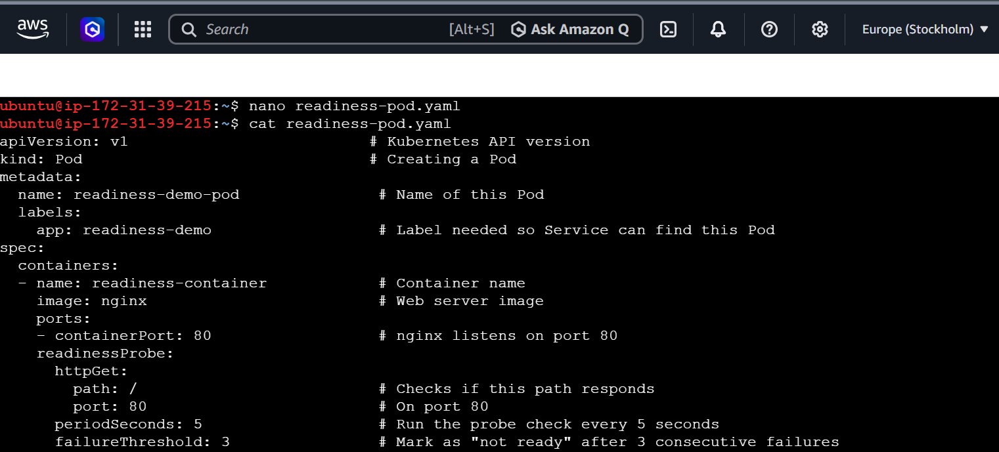
*manifest with readinessProbe config*
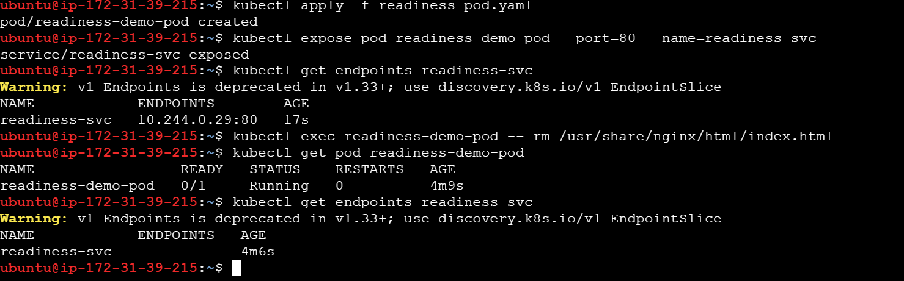
*full flow: expose, endpoints, break probe, empty endpoints, RESTARTS still 0*

### ✅ Verify
**Question:** When readiness failed, was the container restarted?
**Answer:** **No.** The container kept running the entire time (`RESTARTS: 0`). Only its traffic was cut off — Kubernetes removed it from the Service's endpoint list. This is the key difference from a liveness probe: **liveness failure = restart the container; readiness failure = stop sending it traffic (no restart)**.

---

## Task 6: Startup Probe

**Goal:** Give a slow-starting container extra time before liveness/readiness checks kick in, and understand why the "budget" (how long the probe is allowed to keep failing) matters.

### Step 1 — Write the Pod manifest

Create a file called `startup-pod.yaml`:

```yaml
apiVersion: v1                          # Kubernetes API version
kind: Pod                               # Creating a Pod
metadata:
  name: startup-demo-pod                 # Name of this Pod
spec:
  containers:
  - name: startup-container              # Container name
    image: busybox                       # Lightweight image
    args:
    - /bin/sh
    - -c
    - sleep 20 && touch /tmp/started && sleep 600
    # sleep 20            = simulates a SLOW-starting application (takes 20 sec to be ready)
    # touch /tmp/started  = create this file only AFTER the 20 sec delay (marks the app as "started")
    # sleep 600           = keeps the container alive afterward
    startupProbe:
      exec:
        command:
        - cat
        - /tmp/started                   # Succeeds only once this file exists
      periodSeconds: 5                   # Check every 5 seconds
      failureThreshold: 12               # Allow up to 12 failures = a 60-second total budget (12 x 5s)
    livenessProbe:
      exec:
        command:
        - cat
        - /tmp/started                   # Same check, but this only starts running AFTER startupProbe succeeds
      periodSeconds: 5
      failureThreshold: 3
```

**Why does this matter?** Without a startup probe, the **liveness probe** would start checking immediately from second 0. Since the app genuinely needs 20 seconds to be ready, the liveness probe would see several early failures and might restart the container before it even finished starting — creating an endless restart loop for a perfectly healthy, just-slow app. The startup probe acts like a "grace period" gatekeeper: while it's running, liveness and readiness probes are paused/disabled.

**The math:** `periodSeconds: 5` × `failureThreshold: 12` = a **60-second budget**. Since the app only needs 20 seconds, it comfortably finishes within budget.

### Step 2 — Apply it

```bash
kubectl apply -f startup-pod.yaml
```
Expected output: `pod/startup-demo-pod created`

### Step 3 — Watch it live

```bash
kubectl get pod startup-demo-pod -w
```

Expected pattern:
```
NAME               READY   STATUS    RESTARTS   AGE
startup-demo-pod   0/1     Running   0          13s
startup-demo-pod   0/1     Running   0          26s
startup-demo-pod   1/1     Running   0          26s
```
- `READY: 0/1` at first → the startupProbe hasn't succeeded yet, so liveness/readiness are on hold
- `READY: 1/1` after ~20–26 seconds → startupProbe succeeded (`/tmp/started` now exists), so normal liveness checks begin
- `RESTARTS: 0` the whole time → because the 60-second budget was never exceeded

Press `Ctrl + C` once you see `1/1`.

### Screenshots

*full flow from apply to `0/1 → 1/1`, RESTARTS staying at 0*

### ✅ Verify
**Question:** What would happen if `failureThreshold` were 2 instead of 12?
**Answer:** The budget would shrink to `2 × 5s = 10 seconds`. But the container genuinely needs **20 seconds** to create `/tmp/started`. So:
1. The startupProbe would use up all 10 seconds of budget without ever finding the file → it fails.
2. Kubernetes concludes the container failed to start and **kills and restarts it**.
3. The container starts over from scratch, tries again, hits the same 10-second wall again, fails again — repeating forever.
4. This creates a **CrashLoopBackOff** situation, where a perfectly healthy (just slow) application gets endlessly restarted because its startup budget was too small.

**Lesson:** Your startup probe's total budget (`periodSeconds × failureThreshold`) must always be **larger** than the real time your app needs to start — otherwise you'll break healthy, slow-starting apps.

---

## Task 7: Clean Up

**Goal:** Delete every Pod and Service created during this challenge, so they don't keep consuming cluster resources.

### Step 1 — Delete all the Pods

```bash
kubectl delete pod resource-demo-pod oom-demo-pod pending-demo-pod liveness-demo-pod readiness-demo-pod startup-demo-pod
```

`kubectl delete pod` can take multiple Pod names separated by spaces, deleting them all in one command.

### Step 2 — Delete the Service

```bash
kubectl delete svc readiness-svc
```

### Step 3 — Confirm everything is gone

```bash
kubectl get pods
kubectl get svc
```

Expected:
```
No resources found in default namespace.

NAME         TYPE        CLUSTER-IP   EXTERNAL-IP   PORT(S)   AGE
kubernetes   ClusterIP   10.96.0.1    <none>        443/TCP   10d
```
- `get pods` shows nothing → all Pods deleted successfully
- `get svc` only shows the default `kubernetes` Service that every cluster has built-in → your `readiness-svc` is gone

### Screenshots
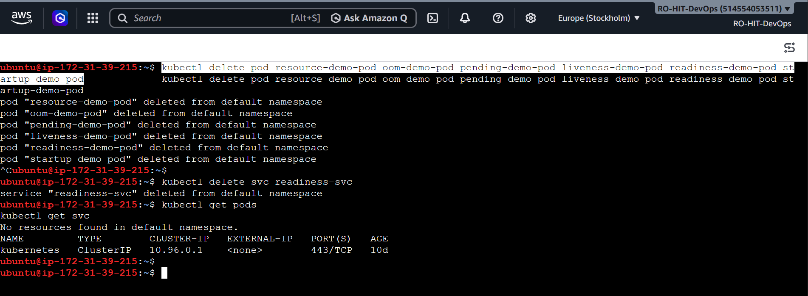
*full cleanup flow, confirming No resources found*

---

## Summary Table

| Task | What it Taught | Key Result |
|------|-----------------|------------|
| 1 | Resource requests & limits, QoS classes | QoS Class: **Burstable** |
| 2 | Memory limits are hard-enforced (killed, not throttled) | Exit Code: **137** (OOMKilled) |
| 3 | Scheduler behavior when no node can fit a Pod | Status: **Pending** forever, `Insufficient cpu/memory` |
| 4 | Liveness probes restart stuck containers | Container **restarted** (RESTARTS: 1) |
| 5 | Readiness probes control traffic, not restarts | Container **NOT restarted**, only removed from Service endpoints |
| 6 | Startup probes give slow apps a grace period | `READY` went 0/1 → 1/1 with **no wrong restarts** |
| 7 | Cleaning up cluster resources | All Pods and Services removed |

---

## Quick Reference — All Commands Used

```bash
# Task 1
kubectl apply -f pod-resources.yaml
kubectl describe pod resource-demo-pod

# Task 2
kubectl apply -f oom-demo-pod.yaml
kubectl describe pod oom-demo-pod

# Task 3
kubectl apply -f pending-pod.yaml
kubectl get pod pending-demo-pod
kubectl describe pod pending-demo-pod

# Task 4
kubectl apply -f liveness-pod.yaml
kubectl get pod liveness-demo-pod -w

# Task 5
kubectl apply -f readiness-pod.yaml
kubectl expose pod readiness-demo-pod --port=80 --name=readiness-svc
kubectl get endpoints readiness-svc
kubectl exec readiness-demo-pod -- rm /usr/share/nginx/html/index.html
kubectl get pod readiness-demo-pod
kubectl get endpoints readiness-svc

# Task 6
kubectl apply -f startup-pod.yaml
kubectl get pod startup-demo-pod -w

# Task 7 (Clean up)
kubectl delete pod resource-demo-pod oom-demo-pod pending-demo-pod liveness-demo-pod readiness-demo-pod startup-demo-pod
kubectl delete svc readiness-svc
kubectl get pods
kubectl get svc
```
