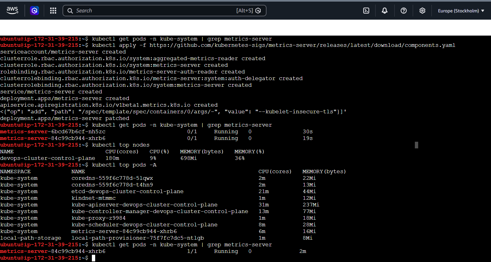
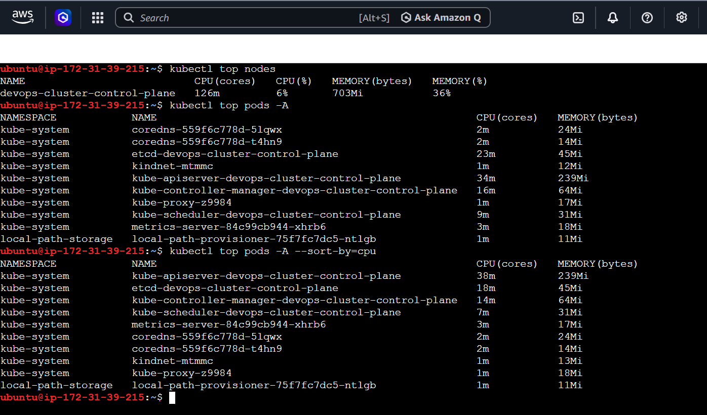
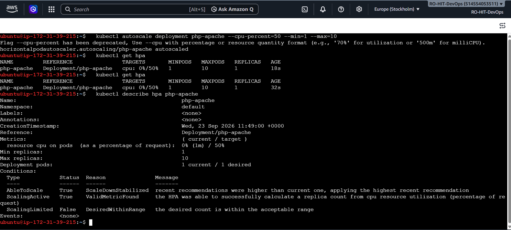
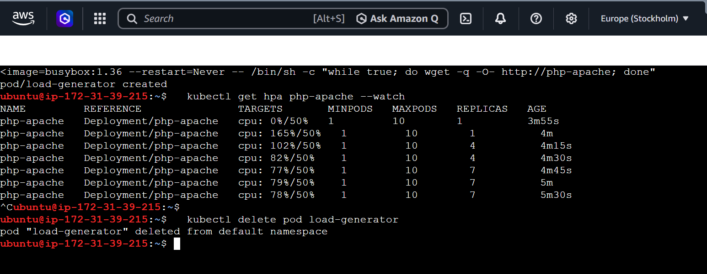
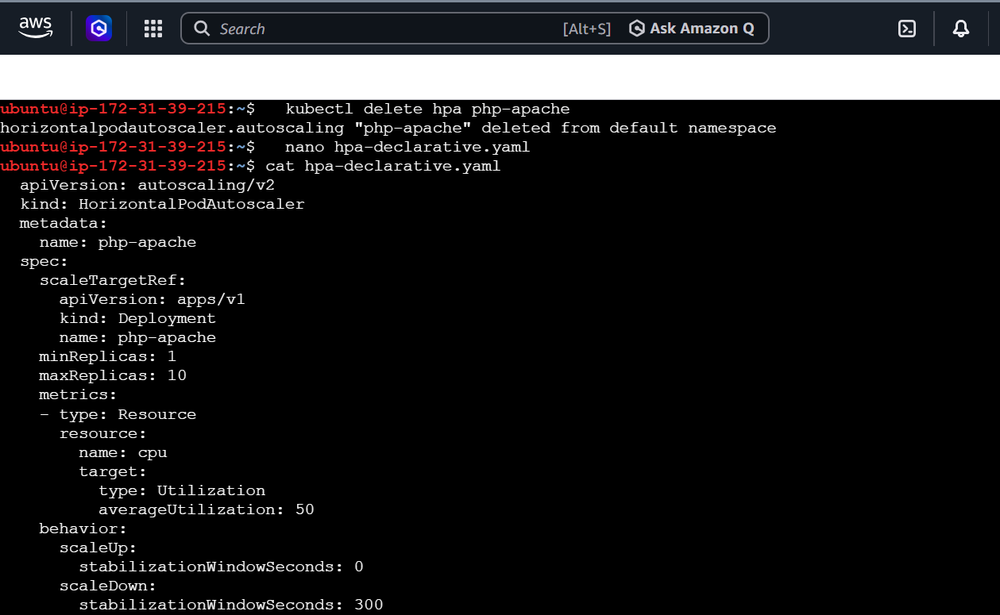
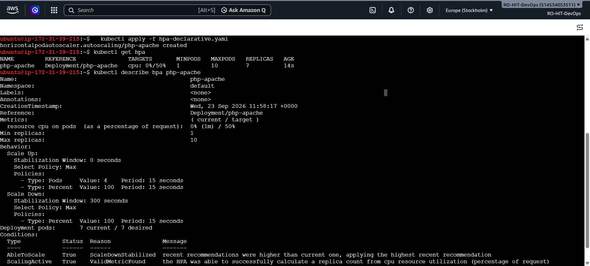
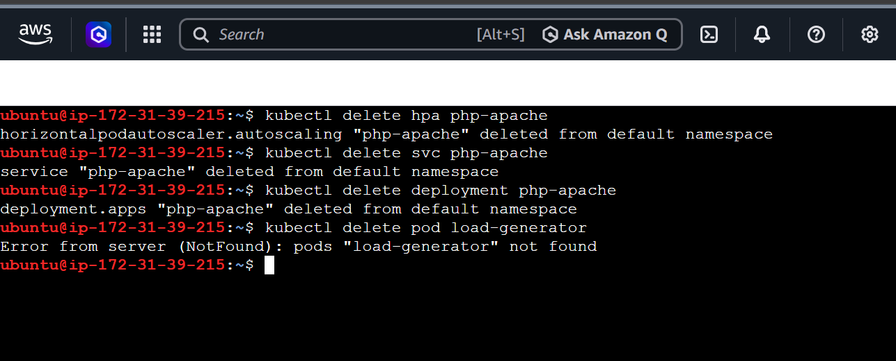

# Day 58 – Metrics Server and Horizontal Pod Autoscaler (HPA)

## What is today about? (In simple words)

Yesterday (Day 57), we told Kubernetes "how much CPU and memory a pod should get" using **resource requests and limits**. But just setting numbers is not enough — Kubernetes also needs a way to **see** how much CPU/memory a pod is *actually* using right now.

Today we do two things:

1. Install the **Metrics Server** — this is a small tool that watches every pod and node, and tells Kubernetes "this pod is using this much CPU/memory right now."
2. Set up an **HPA (Horizontal Pod Autoscaler)** — this is a rule that says "if CPU usage goes above X%, create more pods automatically. If it goes down, remove extra pods automatically."

If you have zero knowledge of Day 58, don't worry. Every command below has **What / Why / How** explained, so you can just follow along.

> Note: This guide assumes you already have a working Kubernetes cluster (in our case, a **Kind** cluster) from previous days, like Day 55–57.

---

## Task 1: Install the Metrics Server

### Why do we need this?
Kubernetes, by default, does **not** know real-time CPU/memory usage of pods. Commands like `kubectl top` will not work unless Metrics Server is installed. HPA also depends 100% on Metrics Server — without it, HPA cannot scale anything.

### Step 1.1 – Check if Metrics Server is already installed

```bash
kubectl get pods -n kube-system | grep metrics-server
```

**What this does:** Lists all pods in the `kube-system` namespace (where Kubernetes keeps its internal system tools) and filters (`grep`) only the ones with "metrics-server" in the name.

**Why:** No point installing something twice. If it already exists and is `Running`, we skip installation.

If this command shows nothing, Metrics Server is not installed yet — move to Step 1.2.

### Step 1.2 – Install Metrics Server (for Kind/kubeadm clusters)

```bash
kubectl apply -f https://github.com/kubernetes-sigs/metrics-server/releases/latest/download/components.yaml
```

**What this does:** Downloads the official Metrics Server configuration file (YAML) directly from GitHub and applies it to our cluster. This creates all the required Kubernetes objects: a Deployment, a Service, permissions (RBAC), etc.

**Why:** This is the official, recommended way to install Metrics Server on non-managed clusters like Kind or kubeadm (Minikube has its own shortcut: `minikube addons enable metrics-server`, but we are using Kind).

**How it works:** Kubernetes reads the YAML file and creates every resource described in it — you'll see multiple lines like `serviceaccount/metrics-server created`, `deployment.apps/metrics-server created`, etc.

### Step 1.3 – Fix TLS issue (Kind-specific step)

On real production clusters, kubelets (the agent running on each node) have proper SSL certificates. But on local clusters like **Kind**, these certificates are self-signed, so Metrics Server refuses to connect by default — this causes the pod to stay `0/1 Running` forever.

To fix this **only on local/test clusters**, we add a flag:

```bash
kubectl patch deployment metrics-server -n kube-system --type='json' -p='[{"op": "add", "path": "/spec/template/spec/containers/0/args/-", "value": "--kubelet-insecure-tls"}]'
```

**What this does:** Edits (patches) the existing metrics-server Deployment and adds an extra startup argument: `--kubelet-insecure-tls`.

**Why:** This tells Metrics Server "don't worry about verifying kubelet's TLS certificate, just trust it." This is only safe on local/test clusters.

⚠️ **Important:** Never use `--kubelet-insecure-tls` in a real production cluster. It skips a security check.

### Step 1.4 – Wait and verify

Wait about 60 seconds after patching (Metrics Server needs time to restart and collect its first data), then run:

```bash
kubectl get pods -n kube-system | grep metrics-server
```

You should now see something like:

```
metrics-server-84c99cb944-xhrb6   1/1   Running   0   2m
```

`1/1` and `Running` means it worked.

Now check actual usage numbers:

```bash
kubectl top nodes
kubectl top pods -A
```

**What this does:**
- `kubectl top nodes` → shows real CPU/memory usage of the whole machine (node).
- `kubectl top pods -A` → shows real CPU/memory usage of every pod, in every namespace (`-A` = all namespaces).

### ✅ Verify — Task 1

**Question: What is the current CPU and memory usage of your node?**

**Answer:**
```
NAME                           CPU(cores)   CPU(%)   MEMORY(bytes)   MEMORY(%)
devops-cluster-control-plane   180m         9%       698Mi           36%
```

The node is using **180 millicores (m) of CPU (9%)** and **698Mi of memory (36%)**.

📸 **Screenshot:**


---

## Task 2: Explore `kubectl top`

### Why do this?
Before setting up HPA, it's good to understand the difference between:
- **Requests/Limits** → numbers *we* set (a promise/limit), from Day 57.
- **`kubectl top`** → the *actual, real* usage happening right now, measured by Metrics Server.

These are two completely different things, and beginners often confuse them.

### Step 2.1 – Run the three exploration commands

```bash
kubectl top nodes
```
**What:** Shows CPU/memory usage of the node (machine) itself.

```bash
kubectl top pods -A
```
**What:** Shows CPU/memory usage of every pod, across all namespaces.

```bash
kubectl top pods -A --sort-by=cpu
```
**What:** Same as above, but sorted — the pod using the **most CPU** appears at the top.
**Why:** This makes it instantly easy to spot which pod is the "heaviest" right now, instead of scanning a long unsorted list.

### How the data actually arrives (important concept)

Metrics Server does **not** show live, second-by-second data. Instead:
1. Every **15 seconds**, Metrics Server asks (polls) each node's **kubelet** (the local Kubernetes agent) "how much CPU/memory is each pod using?"
2. Kubelet answers with the latest numbers it has.
3. Metrics Server stores this and answers `kubectl top` requests using that data.

So there can be a small delay (up to ~15 seconds) between real usage and what `kubectl top` shows.

### ✅ Verify — Task 2

**Question: Which pod is using the most CPU right now?**

**Answer:** `kube-apiserver-devops-cluster-control-plane` was using the most CPU (38m), followed by `etcd` and `kube-controller-manager`. This makes sense — the API server is the "brain" of Kubernetes; every `kubectl` command and every internal controller talks to it constantly, so it's almost always the busiest process.

📸 **Screenshot:**


---

## Task 3: Create a Deployment with CPU Requests

### Why do this?
HPA cannot work on a pod that has **no CPU request** set. HPA calculates scaling decisions as a **percentage of the requested CPU**, not the node's total CPU. Without a request, there is nothing to calculate a percentage *of* — this is the single most common mistake people make with HPA.

We will deploy a special test image called `hpa-example` — it's a small PHP+Apache server built specifically for practicing autoscaling, because it can be made to "burn CPU" easily on demand.

### Step 3.1 – Create the file (step-by-step, using `touch` → `nano`)

**Create an empty file:**
```bash
touch php-apache-deployment.yaml
```
**What this does:** Creates a brand-new, empty file with this name. If the file already existed, it would just update its "last modified" time and leave the content untouched.

**Open the file in a text editor:**
```bash
nano php-apache-deployment.yaml
```
**What this does:** Opens the `nano` editor (a simple text editor that runs directly inside the terminal) so we can type/paste content into the file.

**Paste this content inside `nano`:**

```yaml
apiVersion: apps/v1
kind: Deployment
metadata:
  name: php-apache
spec:
  replicas: 1
  selector:
    matchLabels:
      run: php-apache
  template:
    metadata:
      labels:
        run: php-apache
    spec:
      containers:
      - name: php-apache
        image: registry.k8s.io/hpa-example
        ports:
        - containerPort: 80
        resources:
          requests:
            cpu: 200m
          limits:
            cpu: 500m
```

**What each important line means:**
- `image: registry.k8s.io/hpa-example` → the CPU-hungry test app we are deploying.
- `resources.requests.cpu: 200m` → **the most important line today.** We are telling Kubernetes "this pod normally needs 200 millicores of CPU." HPA will use this number as its "100% baseline."
- `resources.limits.cpu: 500m` → the pod is never allowed to use more than 500 millicores, even under heavy load.

**Save and exit `nano`:**
- Press `Ctrl + O` (Write Out / Save), then press `Enter` to confirm the filename.
- Press `Ctrl + X` to exit the editor.

**Double-check the file was saved correctly:**
```bash
cat php-apache-deployment.yaml
```
**What this does:** Prints the full content of the file to the screen so we can visually confirm it looks correct before applying it.

📸 **Screenshot:**


### Step 3.2 – Apply the Deployment

```bash
kubectl apply -f php-apache-deployment.yaml
```
**What this does:** Reads our YAML file and creates the actual Deployment (and its Pod) inside the cluster.

### Step 3.3 – Expose it as a Service

```bash
kubectl expose deployment php-apache --port=80
```
**What this does:** Creates a Kubernetes **Service** — a stable network address inside the cluster that can be used to send traffic to the `php-apache` pod(s). We will need this later to generate load.

### Step 3.4 – Check the pod and its current CPU usage

```bash
kubectl get pods -l run=php-apache
```
**What this does:** Lists only the pods that have the label `run=php-apache` (the label we set in the YAML).

```bash
kubectl top pods -l run=php-apache
```
**What this does:** Shows the real, current CPU/memory usage of that specific pod.

### ✅ Verify — Task 3

**Question: What is the current CPU usage of the Pod?**

**Answer:**
```
NAME                          CPU(cores)   MEMORY(bytes)
php-apache-5899f79df5-dwzpq   1m           21Mi
```

The pod is using only **1 millicore of CPU** — almost nothing, because it just started and no traffic is hitting it yet. Compare this to the `200m` we requested — the pod is using less than 1% of its requested CPU right now.

📸 **Screenshot:**


---

## Task 4: Create an HPA (Imperative way)

### Why "imperative"?
"Imperative" means we run a direct command to create something, instead of writing a YAML file first. It's the quick way to create an HPA.

### Step 4.1 – Create the HPA

```bash
kubectl autoscale deployment php-apache --cpu-percent=50 --min=1 --max=10
```

**What this does:** Creates a new Kubernetes object called an **HPA (HorizontalPodAutoscaler)** that watches the `php-apache` Deployment.

**How it decides to scale:**
- `--cpu-percent=50` → Target: keep average CPU usage at around **50% of the requested CPU** (200m × 50% = 100m per pod, on average).
- `--min=1` → Never go below **1** pod, even if there's zero traffic.
- `--max=10` → Never go above **10** pods, even under extreme load (this protects the cluster from scaling infinitely).

**In plain English:** "If pods are using more than 50% of their requested CPU on average, add more pods. If they're using much less, remove some pods — but always keep between 1 and 10 pods."

### Step 4.2 – Check HPA status

```bash
kubectl get hpa
```

**What this does:** Shows a summary table of the HPA: which Deployment it targets, the current vs target CPU usage, min/max pods, and current replica count.

**Important:** Right after creation, the `TARGETS` column often shows `<unknown>/50%`. This is completely normal — it just means Metrics Server hasn't delivered its first usage reading yet.

### Step 4.3 – Wait ~30 seconds, then check again

```bash
kubectl get hpa
```

Now `TARGETS` should show real numbers, like `0%/50%` (if the app is idle).

### Step 4.4 – Look at full details

```bash
kubectl describe hpa php-apache
```

**What this does:** Shows a detailed view — current/target metrics, min/max pod limits, and an **Events** section at the bottom that logs any scaling actions the HPA has taken (or decided not to take), along with the reason.

### ✅ Verify — Task 4

**Question: What does the TARGETS column show?**

**Answer:** Right after creation it showed `<unknown>/50%` because Metrics Server hadn't reported any data yet. After waiting ~30 seconds, it changed to `0%/50%` (since the pod was idle with no traffic, actual usage was near 0% of the 200m requested CPU).

📸 **Screenshot:**


---

## Task 5: Generate Load and Watch the HPA Scale

### Why do this?
An HPA sitting at 0% usage doesn't prove much. We need to actually push CPU usage up and **watch, live, as Kubernetes creates new pods automatically.**

### Step 5.1 – Watch the HPA continuously (in one terminal)

```bash
kubectl get hpa php-apache --watch
```

**What this does:** Keeps this command running and automatically refreshes the screen every time the HPA's status changes, so we can watch scaling happen in real time. Leave this running.

### Step 5.2 – Generate load (in a second terminal)

Open a **new terminal window/tab** and run:

```bash
kubectl run load-generator --image=busybox --restart=Never -- /bin/sh -c "while true; do wget -q -O- http://php-apache; done"
```

**What this does:**
- `kubectl run load-generator` → creates a new, temporary pod named `load-generator`.
- `--image=busybox` → uses a tiny Linux image with basic tools.
- `--restart=Never` → run it once as a plain Pod (not a Deployment) — we don't need it to restart automatically.
- `-- /bin/sh -c "while true; do wget -q -O- http://php-apache; done"` → this is the actual work: an infinite loop that continuously sends web requests to our `php-apache` Service, non-stop. This forces the php-apache pod's CPU usage way up.

### Step 5.3 – Watch the first terminal

Within a minute or two, in the terminal running `kubectl get hpa php-apache --watch`, you should see:
- The `TARGETS` percentage climb well above `50%`.
- The `REPLICAS` count increase from `1` to `2`, `3`, or more — Kubernetes automatically creating new php-apache pods to handle the load.

### Step 5.4 – Confirm with a normal check

In any terminal:

```bash
kubectl get hpa
kubectl get pods -l run=php-apache
```

**What this does:** A one-time snapshot (not continuously watching) showing the current replica count and the list of running php-apache pods.

### ✅ Verify — Task 5

**Question: Did the HPA scale up the pods under load?**

**Answer:** Yes — once the `load-generator` pod started hammering `php-apache` with continuous requests, CPU usage crossed well above the 50% target, and the HPA automatically increased the number of `php-apache` replicas to handle the load.

📸 **Screenshot:**


---

## Task 6: Create an HPA the Declarative Way (YAML)

### Why do this if we already made one with Task 4?
Task 4 used the **imperative** method (a single command). In real projects, we usually prefer the **declarative** method — writing a YAML file — because it can be version-controlled (saved in Git), reviewed, and reapplied consistently. Same result, better practice.

### Step 6.1 – Delete the old imperative HPA first

```bash
kubectl delete hpa php-apache
```

**What this does:** Removes the HPA we created in Task 4, so we don't end up with two HPAs conflicting over the same Deployment.

### Step 6.2 – Create the HPA YAML file

```bash
nano php-apache-hpa.yaml
```

Paste this content:

```yaml
apiVersion: autoscaling/v2
kind: HorizontalPodAutoscaler
metadata:
  name: php-apache
spec:
  scaleTargetRef:
    apiVersion: apps/v1
    kind: Deployment
    name: php-apache
  minReplicas: 1
  maxReplicas: 10
  metrics:
  - type: Resource
    resource:
      name: cpu
      target:
        type: Utilization
        averageUtilization: 50
```

**What each part means:**
- `scaleTargetRef` → tells the HPA exactly which Deployment to watch and scale (`php-apache`).
- `minReplicas: 1` / `maxReplicas: 10` → same safety limits as before.
- `metrics` → defines *what* to measure: here, CPU (`resource.name: cpu`), measured as a `Utilization` percentage, with a target of `50` (i.e., 50%).

This YAML produces the **exact same behavior** as the imperative command in Task 4 — just written explicitly so it can be saved and reused.

Save with `Ctrl + O`, `Enter`, then exit with `Ctrl + X`.

📸 **Screenshot:**


### Step 6.3 – Apply the YAML

```bash
kubectl apply -f php-apache-hpa.yaml
```

**What this does:** Creates the HPA object from our YAML file, exactly as we would `kubectl apply` any other Kubernetes manifest.

### Step 6.4 – Verify it

```bash
kubectl get hpa
kubectl describe hpa php-apache
```

### ✅ Verify — Task 6

**Question: Does the declarative HPA behave the same as the imperative one?**

**Answer:** Yes — `kubectl get hpa` shows the same target (`50%`) and the same min/max replica range (`1`–`10`) as the one created with `kubectl autoscale` in Task 4. The only difference is *how* we created it (a saved YAML file vs. a one-line command).

📸 **Screenshot:**


---

## Task 7: Clean Up

### Why do this?
Test resources like `load-generator`, the `php-apache` deployment, its Service, and the HPA are only needed for practice. Leaving them running wastes CPU/memory on our cluster and can cause confusion in future days. We **keep Metrics Server**, though, since future days will likely need it again.

### Step 7.1 – Delete the HPA

```bash
kubectl delete hpa php-apache
```
**What this does:** Removes the autoscaler rule. The Deployment itself is untouched by this command.

### Step 7.2 – Delete the Service

```bash
kubectl delete svc php-apache
```
**What this does:** Removes the network Service we created in Task 3, which was used to route traffic to the php-apache pods.

### Step 7.3 – Delete the Deployment

```bash
kubectl delete deployment php-apache
```
**What this does:** Removes the Deployment and all its pods.

### Step 7.4 – Delete the load generator pod

```bash
kubectl delete pod load-generator
```
**What this does:** Removes the temporary `busybox` pod we used to generate load.

> Note: If you already deleted `load-generator` earlier (for example, by pressing `Ctrl+C` and manually removing it), this command may return `Error from server (NotFound)`. That is expected and not a problem — it just means the pod was already gone.

### ⚠️ What we do NOT delete

We **keep Metrics Server installed** (`kubectl get pods -n kube-system | grep metrics-server` should still show it running). It's a cluster-wide tool, not a per-task test resource, and future days will likely reuse it.

### ✅ Verify — Task 7

**Question: Is everything cleaned up except Metrics Server?**

**Answer:** Yes — the HPA, Service, and Deployment for `php-apache` were all successfully deleted, and the `load-generator` pod was removed (or already gone). Metrics Server was left running for future use.

📸 **Screenshot:**


---

## 📝 Key Takeaways from Day 58

1. **Metrics Server** is the tool that makes `kubectl top` and HPA possible — without it, Kubernetes has no idea how much CPU/memory pods are actually using.
2. On local clusters like **Kind**, Metrics Server needs the `--kubelet-insecure-tls` flag — never use this in production.
3. **`kubectl top`** shows real, live usage. **Requests/Limits** (from Day 57) are just numbers *we* configure — they are not the same thing.
4. **HPA absolutely requires `resources.requests.cpu`** to be set on the pod — without it, HPA has no baseline to calculate a percentage from. This is the #1 mistake people make.
5. HPA can be created **imperatively** (`kubectl autoscale ...`, quick and simple) or **declaratively** (a YAML file, better for real projects since it's saved and repeatable) — both produce the same result.
6. `TARGETS` showing `<unknown>` right after creating an HPA is completely normal — just wait ~30–60 seconds for Metrics Server to report the first reading.
7. Always clean up test resources (deployments, services, HPAs, load generators) once you're done practicing — but keep shared cluster tools like Metrics Server running for future use.
