# Day 59 – Helm: Kubernetes Package Manager

## Introduction (Read this first)

For the past several days, we deployed applications on Kubernetes by writing separate YAML files for every piece: a Deployment, a Service, a ConfigMap, a Secret, a PVC, and so on. For a real application, this can mean writing and managing 10-20 different YAML files by hand.

**Helm** solves this problem. Helm is the **package manager for Kubernetes** — the same way `apt` is the package manager for Ubuntu. Instead of writing everything from scratch, you can install a ready-made "package" (called a Chart) with a single command, and Helm will create all the Kubernetes resources for you automatically.

### Three Core Concepts You Must Know

| Term | Meaning | Simple Analogy |
|---|---|---|
| **Chart** | A package containing Kubernetes manifest templates | A "recipe" for an application |
| **Release** | One specific installation of a Chart in your cluster | The actual "dish" made using the recipe |
| **Repository** | A collection of Charts, hosted online | A "shop" that sells recipes (e.g. Bitnami) |

Once you understand these three words, everything else in this guide will make sense.

---

## Task 1: Install Helm

### What
We need to install the Helm command-line tool on our machine before we can use any of its features.

### Why
Without installing Helm, none of the `helm` commands will work. This is the very first step, just like installing `kubectl` before you can talk to a Kubernetes cluster.

### How
Since this is an Ubuntu machine, we use the official install script (if you are on macOS use `brew install helm`, on Windows use `choco install kubernetes-helm`):

```bash
curl -fsSL -o get_helm.sh https://raw.githubusercontent.com/helm/helm/main/scripts/get-helm-3
chmod +x get_helm.sh
./get_helm.sh
```

**Line by line explanation:**
- `curl -fsSL -o get_helm.sh ...` → downloads the official Helm install script and saves it as `get_helm.sh`
- `chmod +x get_helm.sh` → gives the file "execute" permission so it can be run
- `./get_helm.sh` → runs the script, which automatically detects your OS, downloads the correct Helm binary, and installs it into `/usr/local/bin`

Now verify the installation with two commands:

```bash
helm version
```
This prints the installed Helm version.

```bash
helm env
```
This prints Helm's configuration paths (where it stores cache, config, and repository information).

### Verify
**Question: What version of Helm is installed?**
**Answer: v3.22.0**

### Output Screenshot
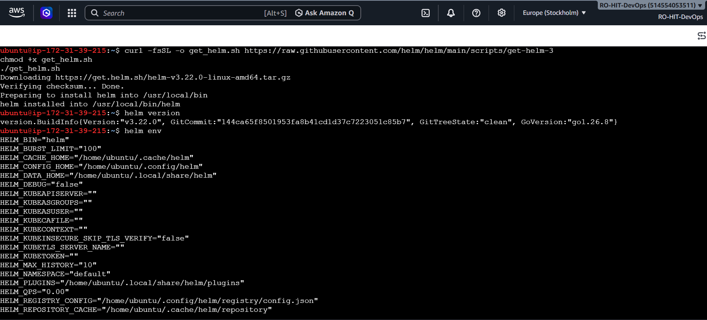

---

## Task 2: Add a Repository and Search

### What
A **Repository** is an online collection of Charts. **Bitnami** is one of the most popular public repositories — it has ready-made Charts for nginx, MySQL, WordPress, Redis, and 100+ other applications.

### Why
Helm does not know about any Charts until you tell it where to look. Adding a repository is like telling `apt` which software sources to use. Once added, you can search that repository for Charts, just like `apt search`.

### How

**Step 1 — Add the Bitnami repository:**
```bash
helm repo add bitnami https://charts.bitnami.com/bitnami
```
This registers the URL under the local name "bitnami".

**Step 2 — Update the repository list:**
```bash
helm repo update
```
This downloads the latest list of Charts available in that repository (similar to `apt update`).

**Step 3 — Search for Charts:**
```bash
helm search repo nginx
helm search repo bitnami
```
The first command searches for any chart with "nginx" in the name.
The second command lists **every** chart available in the Bitnami repository.

**Step 4 — Count the charts (extra step for an exact number):**
```bash
helm search repo bitnami | tail -n +2 | wc -l
```
- `tail -n +2` removes the header line
- `wc -l` counts the remaining lines = the number of charts

### Verify
**Question: How many charts does Bitnami have?**
**Answer: 144 charts** (this number can change over time as Bitnami adds or removes charts)

### Output Screenshot
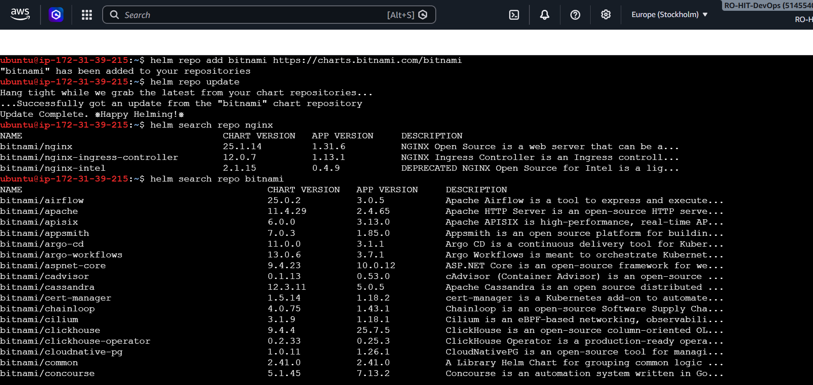

---

## Task 3: Install a Chart

### What
Now we actually deploy an application using a Chart. We will install `nginx` from the Bitnami repository.

### Why
This shows the real power of Helm: **one command replaces writing a Deployment, a Service, a ConfigMap, and more, by hand.**

### How

**Step 1 — Install the chart:**
```bash
helm install my-nginx bitnami/nginx
```
- `my-nginx` → the name we are giving to this **Release** (you can choose any name)
- `bitnami/nginx` → the Chart we want to install, from the `bitnami` repository

**Step 2 — See what Kubernetes resources were created:**
```bash
kubectl get all
```
This shows Pods, Services, Deployments, and ReplicaSets — all created automatically by the one command above.

**Step 3 — Inspect the release using three different commands:**
```bash
helm list
```
Shows all releases currently installed, with their status and revision number.

```bash
helm status my-nginx
```
Shows detailed information about just this one release.

```bash
helm get manifest my-nginx
```
Shows the actual, final Kubernetes YAML that Helm generated and sent to the cluster. This is the exact YAML you would have had to write by hand without Helm — but Helm just generated it for us.

### Verify
**Question: How many Pods are running? What Service type was created?**
**Answer: 1 Pod is running. The Service type is LoadBalancer (the Bitnami nginx chart's default).**

### Output Screenshots
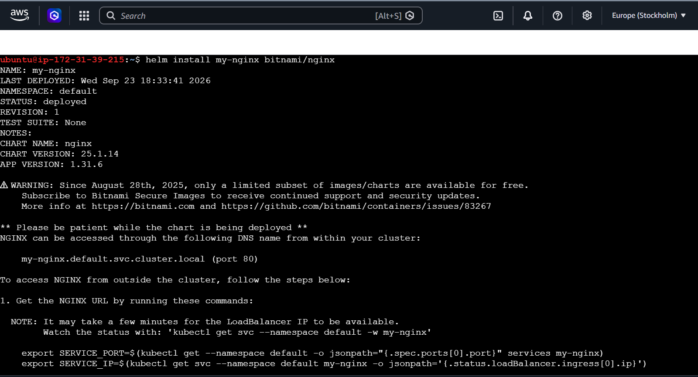
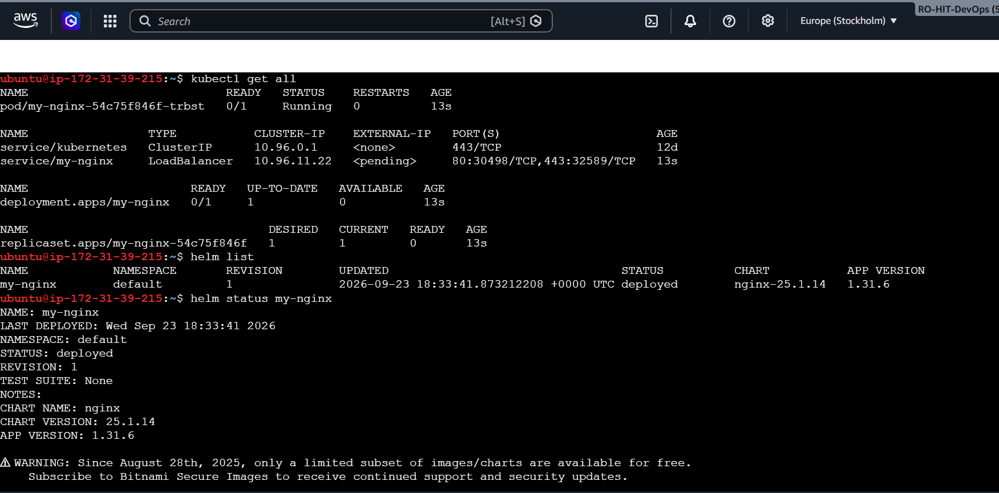
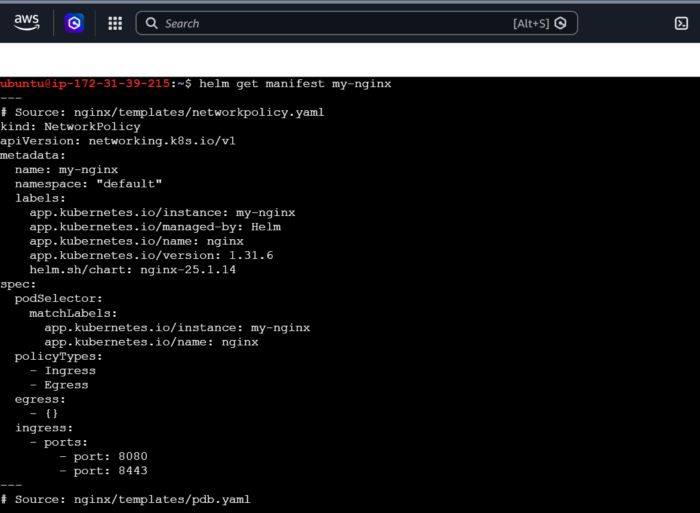

---

## Task 4: Customize with Values

### What
Every Chart has a file called `values.yaml` containing **default settings** (like how many replicas to run, or what type of Service to create). You can override these defaults in two ways:
1. On the command line with `--set`
2. Using your own values file with `-f`

### Why
You will almost never want the default settings for a real project. For example, you might want 3 replicas instead of 1, or a `NodePort` Service instead of `LoadBalancer` (especially if you don't have a cloud load balancer available). Overriding values lets you reuse the same Chart for many different situations without changing the Chart itself.

### How

**Step 1 — View the default values of a chart:**
```bash
helm show values bitnami/nginx
```
This prints the full list of settings you are allowed to change, along with their default values.

**Step 2 — Override values directly on the command line:**
```bash
helm install my-nginx-set bitnami/nginx --set replicaCount=3 --set service.type=NodePort
```
This installs a new release, but this time with 3 replicas and a NodePort Service, instead of the defaults.

Verify it:
```bash
kubectl get all -l app.kubernetes.io/instance=my-nginx-set
```

**Step 3 — Create your own values file for cleaner, reusable overrides:**
```bash
nano custom-values.yaml
```
Type in the following content:
```yaml
replicaCount: 3
service:
  type: NodePort
resources:
  requests:
    cpu: 100m
    memory: 128Mi
  limits:
    cpu: 200m
    memory: 256Mi
```

**What each line means:**
- `replicaCount: 3` → how many Pod copies to run
- `service.type: NodePort` → opens a fixed port on every Node, so the app can be reached from outside the cluster without a cloud LoadBalancer
- `resources.requests` → the minimum CPU/Memory guaranteed to the Pod (used by the Scheduler to decide which Node to use)
- `resources.limits` → the maximum CPU/Memory the Pod is allowed to use (it gets throttled if it goes over this)

**Step 4 — Install a new release using this file:**
```bash
helm install my-nginx-file bitnami/nginx -f custom-values.yaml
```
`-f custom-values.yaml` tells Helm: "use the values in this file instead of the chart's defaults."

**Step 5 — Check that the override actually worked:**
```bash
helm get values my-nginx-file
kubectl get all -l app.kubernetes.io/instance=my-nginx-file
```

### Verify
**Question: Does the values file release have the correct replicas and service type?**
**Answer: Yes. `helm get values` confirms `replicaCount: 3` and `service.type: NodePort`, and `kubectl get all` confirms 3 running Pods and a Service of type NodePort.**

### Output Screenshots
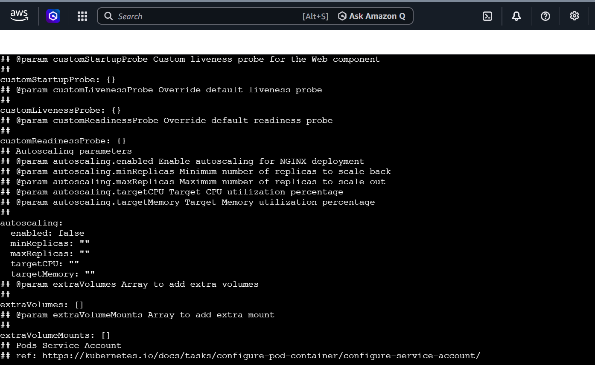
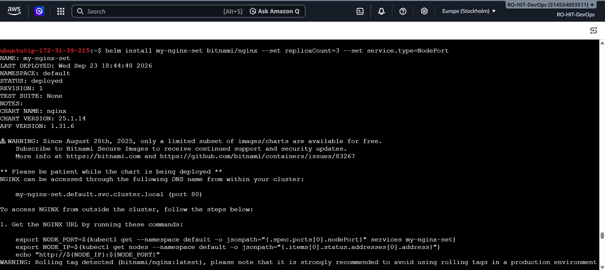
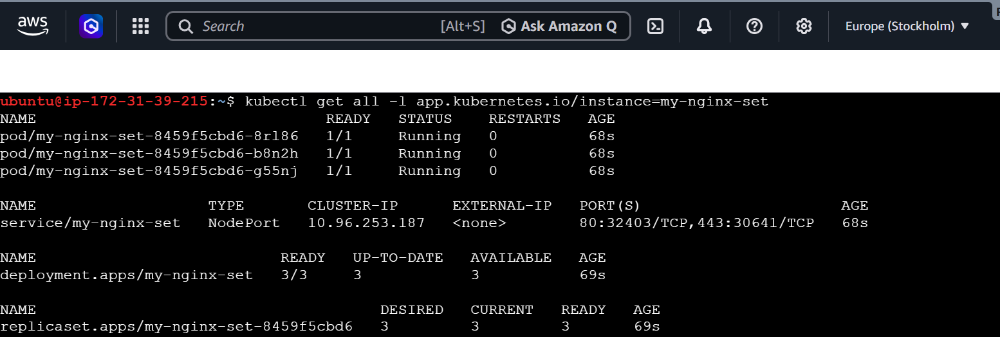
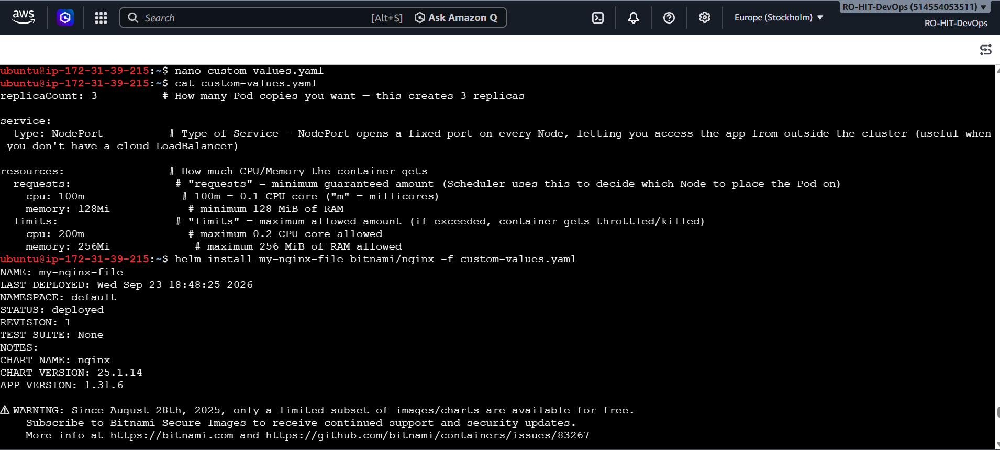
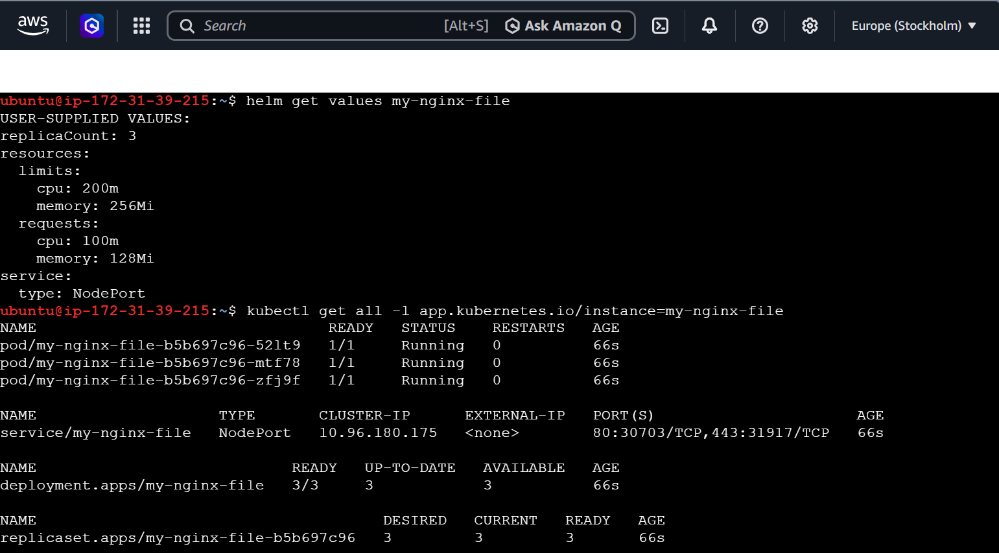

---

## Task 5: Upgrade and Rollback

### What
`helm upgrade` changes an existing release to use new settings. Every upgrade creates a new **revision number** in the release's history. `helm rollback` lets you go back to any previous revision if something goes wrong.

### Why
This is the same idea as `kubectl rollout undo` from Day 52 — but instead of rolling back just one Deployment, Helm rolls back the **entire application stack** (Deployment + Service + everything else) at once. This is very useful if an upgrade breaks your app and you need to recover quickly.

**Important concept:** Rolling back does **not** delete or overwrite history. It creates a **brand-new revision number** that copies the content of the older revision. Nothing in the history is ever erased — it only grows, just like `git revert`.

### How

**Step 1 — Upgrade the release we created in Task 3:**
```bash
helm upgrade my-nginx bitnami/nginx --set replicaCount=5
```

**Step 2 — Check the revision history:**
```bash
helm history my-nginx
```
You will see Revision 1 (the original install) marked as `superseded`, and Revision 2 (this upgrade) marked as `deployed`.

**Step 3 — Roll back to the original revision:**
```bash
helm rollback my-nginx 1
```
This does **not** simply go back to "Revision 1" — it creates a brand new Revision 3, whose content is the same as Revision 1 (replicaCount goes back to 1).

**Step 4 — Check history again:**
```bash
helm history my-nginx
```
Now you will see three revisions: Revision 1 (superseded), Revision 2 (superseded), Revision 3 (deployed, described as "Rollback to 1").

**Step 5 — Verify the actual Pod count:**
```bash
kubectl get pods -l app.kubernetes.io/instance=my-nginx
```

### Verify
**Question: How many revisions after the rollback?**
**Answer: 3 revisions in total (Revision 1, 2, and 3). Revision 3 is the currently active/deployed one, and its Pod count is back to 1, matching the original install.**

### Output Screenshots
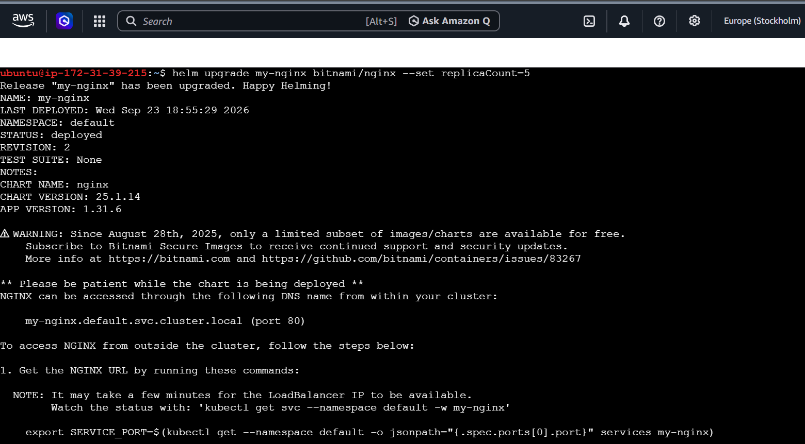
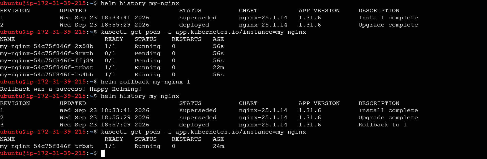

---

## Task 6: Create Your Own Chart

### What
So far we only used Charts that someone else (Bitnami) already built. Now we build our **own Chart from scratch**.

### Why
In the real world, you will deploy your own applications (your own code, your own container image) — and Bitnami will not have a Chart for that. This task teaches you what is actually inside a Chart, and how the "template" system works — the same system that generated the YAML you saw in Task 3.

### How

**Step 1 — Scaffold (generate) a new chart:**
```bash
helm create my-app
```
This creates a folder called `my-app` with a ready-made structure: `Chart.yaml`, `values.yaml`, and a `templates/` folder — you don't have to start from a blank page.

**Step 2 — Explore the files:**
```bash
cat my-app/Chart.yaml
cat my-app/values.yaml
cat my-app/templates/deployment.yaml
```

- `Chart.yaml` → just metadata about the chart (its name and version). Nothing special here.
- `values.yaml` → the default settings (`replicaCount: 1`, `image.repository: nginx`, `service.type: ClusterIP`, etc.) — this is a plain settings file, just like the `custom-values.yaml` we made in Task 4.
- `templates/deployment.yaml` → this is **not** plain YAML. It is a mix of normal Kubernetes YAML and special placeholders written in `{{ ... }}` (this is called "Go template syntax").

**Understanding the template placeholders (the most important part of this task):**

In the template file you will see a line like:
```yaml
replicas: {{ .Values.replicaCount }}
```
This means: *"Put the value of `replicaCount` from `values.yaml` here."* If `values.yaml` says `replicaCount: 3`, the final generated YAML will say `replicas: 3`.

Similarly:
```yaml
image: "{{ .Values.image.repository }}:{{ .Values.image.tag | default .Chart.AppVersion }}"
```
This means: *"Build the image name using `image.repository` and `image.tag` from `values.yaml`."*

You will also see blocks like `{{- if ... }} ... {{- end }}`. These work exactly like `if` statements in programming — they only include a section of YAML if a certain condition in `values.yaml` is true.

**In short: the template file is a "mold." The `{{ }}` parts are empty slots that Helm fills in using `values.yaml` when you run `helm install` or `helm template`.**

**Step 3 — Edit `values.yaml` to customize our app:**
```bash
nano my-app/values.yaml
```
Change these two lines:
```yaml
replicaCount: 1        # change this to 3
```
```yaml
image:
  repository: nginx
  tag: ""               # change this to "1.25"
```

Save the file (`Ctrl+O`, Enter, `Ctrl+X` in nano).

**Step 4 — Validate the chart for errors:**
```bash
helm lint my-app
```
This checks the chart's templates and values for syntax mistakes before you try to install it. A healthy result looks like: `1 chart(s) linted, 0 chart(s) failed`.

**Step 5 — Preview the final YAML without installing anything:**
```bash
helm template my-release ./my-app
```
This command does **not** touch your cluster at all. It simply shows you what the final YAML would look like after Helm fills in all the `{{ }}` placeholders using your edited `values.yaml`. This is the safest way to check your work before actually installing.

If you look closely at the output, you will see the placeholder:
```yaml
replicas: {{ .Values.replicaCount }}
```
has become:
```yaml
replicas: 3
```
and:
```yaml
image: "{{ .Values.image.repository }}:{{ .Values.image.tag | default .Chart.AppVersion }}"
```
has become:
```yaml
image: "nginx:1.25"
```
This is the moment where the whole templating idea "clicks" — the placeholder text has literally been replaced by the real value from `values.yaml`.

**Step 6 — Actually install the chart:**
```bash
helm install my-release ./my-app
```
Note we install from a local folder (`./my-app`) instead of a repository name, since this is our own chart.

Verify:
```bash
kubectl get pods -l app.kubernetes.io/instance=my-release
```

**Step 7 — Upgrade the release to 5 replicas:**
```bash
helm upgrade my-release ./my-app --set replicaCount=5
```

Verify again:
```bash
kubectl get pods -l app.kubernetes.io/instance=my-release
```

### Verify
**Question: After installing, 3 replicas? After upgrading, 5?**
**Answer: Yes to both. After `helm install`, 3 Pods were running using image `nginx:1.25`. After `helm upgrade --set replicaCount=5`, the count went up to 5 running Pods.**

### Output Screenshots
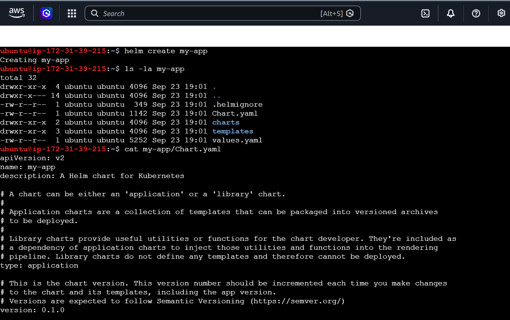
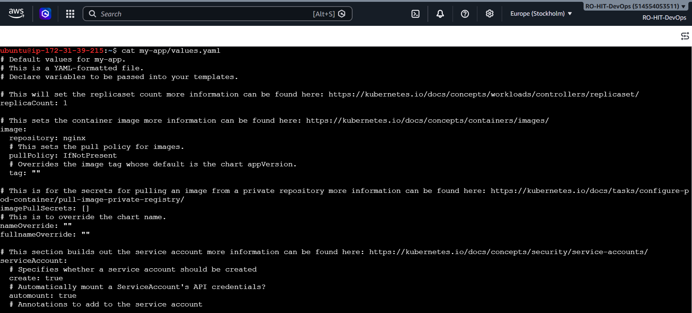
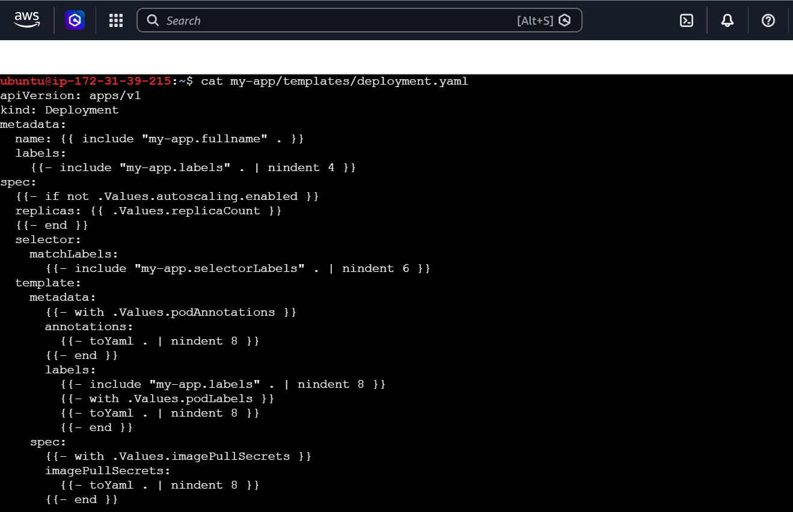
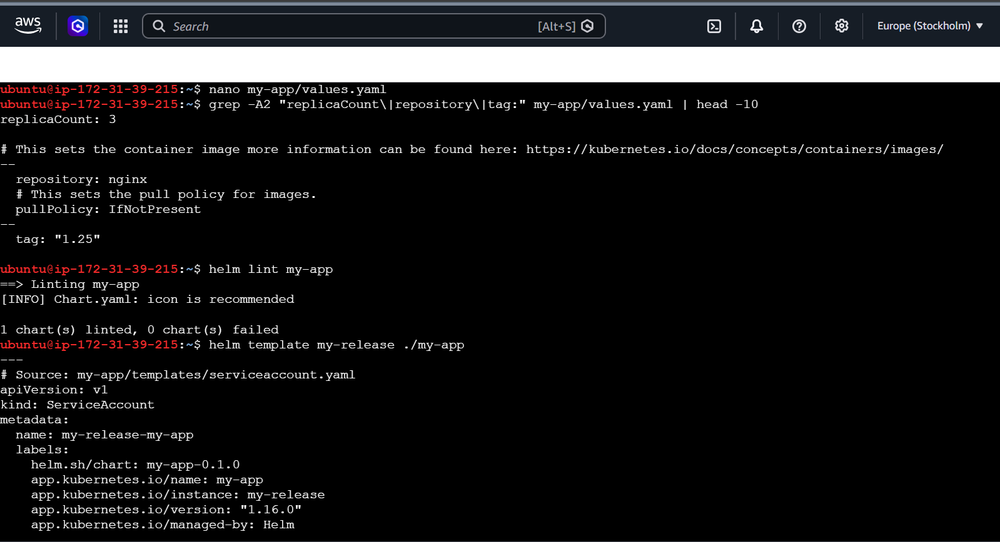
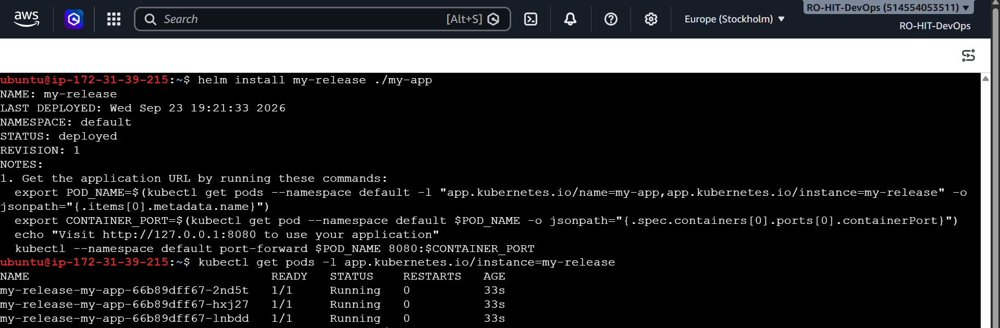
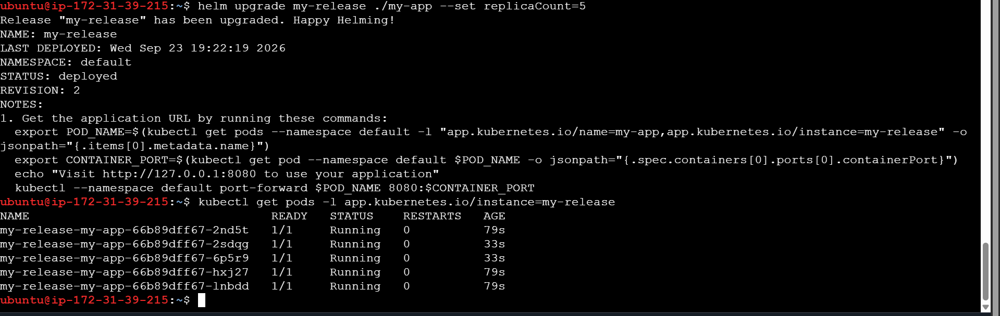

---

## Task 7: Clean Up

### What
We remove all the releases and files we created during this exercise, so the cluster is left clean.

### Why
Leaving unused releases running wastes cluster resources (CPU, memory) and clutters up your environment. In real projects, cleaning up test resources is a good habit.

### How

**Step 1 — Check which releases currently exist:**
```bash
helm list
```

**Step 2 — Uninstall every release:**
```bash
helm uninstall my-nginx
helm uninstall my-nginx-set
helm uninstall my-nginx-file
helm uninstall my-release
```

**Note on `--keep-history`:**
A normal `helm uninstall` removes the release and its entire history. If you want to keep the history for later auditing (for example, to still be able to run `helm history <name>` after uninstalling), add the flag:
```bash
helm uninstall my-nginx --keep-history
```
This removes the running resources (Pods, Services) but keeps a record that the release existed.

**Step 3 — Remove our custom chart directory and values file:**
```bash
rm -rf my-app
rm -f custom-values.yaml
```

**Step 4 — Confirm everything is gone:**
```bash
helm list
```
This should now print an empty list (just the column headers, no rows).

### Verify
**Question: Does `helm list` show zero releases?**
**Answer: Yes. The final `helm list` command shows only the header row with no releases listed, confirming everything was cleaned up successfully.**

### Output Screenshot
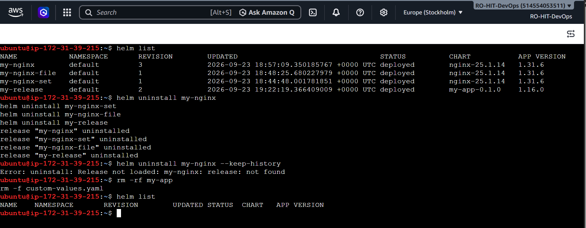

---

## Final Summary

| Task | What we did | Result |
|---|---|---|
| 1 | Installed Helm | v3.22.0 |
| 2 | Added Bitnami repo and searched | 144 charts found |
| 3 | Installed nginx chart from Bitnami | 1 Pod, LoadBalancer Service |
| 4 | Customized values (`--set` and values file) | 3 replicas, NodePort Service |
| 5 | Upgraded and rolled back a release | 3 revisions in history after rollback |
| 6 | Created and installed our own chart | 3 replicas → upgraded to 5 |
| 7 | Cleaned up all releases and files | 0 releases remaining |

**Key takeaway:** Helm does not change *how* an application runs on Kubernetes (Scheduler, kubelet, containers all still work the same way). Helm only makes it much easier to *generate and manage* the YAML that gets sent to Kubernetes — turning many manually-written files into one reusable, versioned package.
