# Day 61: Terraform Intro (TerraWeek Day 1)

> Goal of the day: install Terraform, connect it to AWS, and use it to **create, inspect, change and destroy** real AWS resources (an S3 bucket and an EC2 server) using only code.

This guide is written so that **anyone, even a complete beginner, can follow it step by step and practice it.** Every task has:

- **What** we are doing
- **Why** we are doing it
- **Commands / Code** to copy
- **How to read the output**
- **Screenshot** of the real output

---

## Table of Contents

1. [Big Picture: What is Terraform?](#big-picture-what-is-terraform)
2. [Before You Start (Requirements)](#before-you-start-requirements)
3. [Task 1: Install Terraform and AWS CLI](#task-1-install-terraform-and-aws-cli)
4. [Task 2: Give Terraform access to AWS (IAM user + credentials)](#task-2-give-terraform-access-to-aws-iam-user--credentials)
5. [Task 3: Write `main.tf` and create an S3 bucket](#task-3-write-maintf-and-create-an-s3-bucket)
6. [Task 4: Add an EC2 instance](#task-4-add-an-ec2-instance)
7. [Task 5: Understand the state file](#task-5-understand-the-state-file)
8. [Task 6: Modify, plan and destroy](#task-6-modify-plan-and-destroy)
9. [Common Errors and Fixes](#common-errors-and-fixes)
10. [Command Cheat Sheet](#command-cheat-sheet)
11. [Key Learnings](#key-learnings)

---

## Big Picture: What is Terraform?

- **Terraform** is a tool that lets you create cloud resources (servers, storage, networks) by writing **code** instead of clicking in the AWS Console.
- This idea is called **Infrastructure as Code (IaC)**.
- You write what you **want** (for example "1 S3 bucket and 1 server"). Terraform works out **how** to do it.
- The code is written in a language called **HCL** (HashiCorp Configuration Language) inside files ending with `.tf`.

### Why use code instead of clicking?

- **Repeatable:** run the same code again and get the same result.
- **Trackable:** code can be saved in Git, so you can see who changed what.
- **Fast to clean up:** one command (`terraform destroy`) removes everything.
- **Less human error:** no forgetting a checkbox in the Console.

### The Terraform workflow (remember these 4 commands)

| Command | What it does |
|---|---|
| `terraform init` | Downloads the plugins (providers) Terraform needs. Run once per folder. |
| `terraform plan` | Shows what **will** happen. Nothing is changed. Safe to run any time. |
| `terraform apply` | Actually creates or changes the resources. |
| `terraform destroy` | Deletes everything Terraform created. |

### Key words used in this guide

- **Provider:** a plugin that lets Terraform talk to a service. Here: the AWS provider (`hashicorp/aws`).
- **Resource:** one thing Terraform manages (a bucket, a server).
- **State file (`terraform.tfstate`):** Terraform's notebook. It records what Terraform has already created.
- **Region:** the AWS location. We use **Mumbai (`ap-south-1`)**.

---

## Before You Start (Requirements)

- An **AWS account**.
- A Linux machine to run commands. In this guide it is an **Ubuntu EC2 server** (prompt looks like `ubuntu@ip-172-31-39-215`). A local Linux/WSL/Mac terminal also works.
- Internet access from that machine.
- Basic terminal knowledge (`cd`, `ls`, `cat`).

### Safety warnings (please read)

- **Cost:** EC2 servers cost money if left running. Always finish with `terraform destroy` (Task 6).
- **Secrets:** never share or commit your AWS Access Key and Secret Key.
- **Account ID:** screenshots can show your AWS account ID (12 digits). Blur it before sharing publicly.

---

## Task 1: Install Terraform and AWS CLI

### What
Install two tools and check that they work:

- **Terraform:** the tool that builds the infrastructure.
- **AWS CLI:** the command-line tool for AWS. Terraform uses your AWS credentials, and the CLI helps us set and test them.

### Why
Without Terraform we cannot run any `terraform` command. Without AWS CLI we cannot easily configure credentials or run checks like "who am I logged in as".

### Commands

**Install Terraform (Ubuntu):**

```bash
sudo apt-get update && sudo apt-get install -y gnupg software-properties-common curl

wget -O- https://apt.releases.hashicorp.com/gpg | \
  gpg --dearmor | \
  sudo tee /usr/share/keyrings/hashicorp-archive-keyring.gpg > /dev/null

echo "deb [signed-by=/usr/share/keyrings/hashicorp-archive-keyring.gpg] \
https://apt.releases.hashicorp.com $(lsb_release -cs) main" | \
  sudo tee /etc/apt/sources.list.d/hashicorp.list

sudo apt-get update && sudo apt-get install -y terraform
```

**Install AWS CLI v2:**

```bash
sudo apt-get install -y unzip
curl "https://awscli.amazonaws.com/awscli-exe-linux-x86_64.zip" -o "awscliv2.zip"
unzip awscliv2.zip
sudo ./aws/install
```

**Check both versions:**

```bash
terraform -version
aws --version
```

### How to read the output

- `terraform -version` prints something like `Terraform v1.16.4`. Your number may be different, that is fine.
- `aws --version` prints something like `aws-cli/2.x.x ...`.
- If you see `command not found`, the install did not finish. Run the install steps again.

### Screenshot (output)

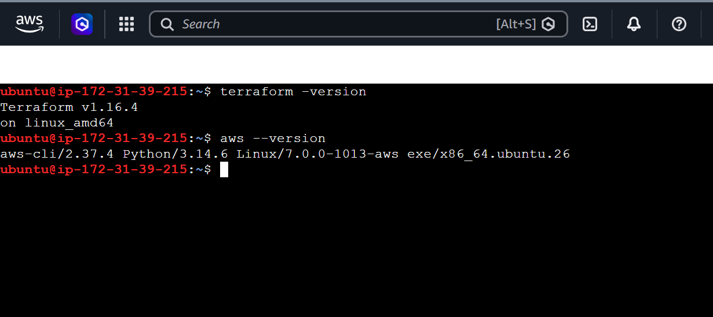

---

## Task 2: Give Terraform access to AWS (IAM user + credentials)

### What
Create a dedicated **IAM user** in AWS, create an **Access Key** for it, and save the key on your machine with `aws configure`.

### Why
- Terraform needs permission to create things in your AWS account.
- It gets that permission from **credentials** (Access Key ID + Secret Access Key).
- It is safer to use a separate IAM user than your root account.

### Steps in the AWS Console

1. Open **IAM** > **Users** > **Create user**.
2. Give the user a name and give it permissions. For learning, `AdministratorAccess` is the easiest. In real projects give only the permissions that are needed.
3. Open the user > **Security credentials** > **Create access key**.
4. Choose **Command Line Interface (CLI)** as the use case.
5. **Copy the Access Key ID and Secret Access Key** and keep them safe. The secret is shown only once.

### Screenshots (IAM)

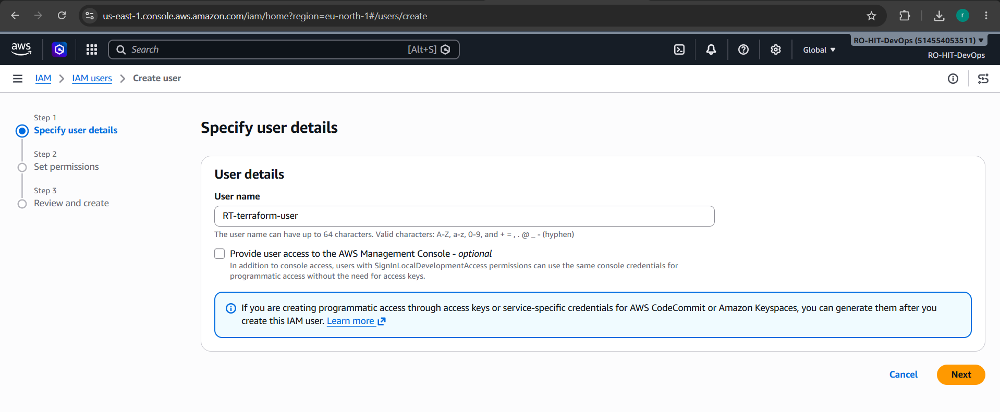

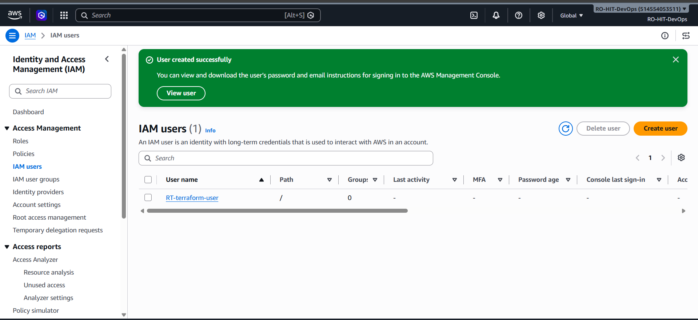

### Configure the credentials on your machine

```bash
aws configure
```

It asks 4 questions:

| Question | What to enter |
|---|---|
| AWS Access Key ID | the key you copied |
| AWS Secret Access Key | the secret you copied |
| Default region name | `ap-south-1` |
| Default output format | `json` |

The keys are saved in `~/.aws/credentials` and the region in `~/.aws/config`. Terraform reads them automatically.

### Check that it works

```bash
aws sts get-caller-identity
```

- **`sts get-caller-identity`** means "tell me who I am logged in as".
- The output shows `UserId`, `Account` and `Arn`. If you see your IAM user's name in the `Arn`, the setup is correct.
- If you get an error like `InvalidClientTokenId`, the keys were copied wrongly. Run `aws configure` again.

### Screenshot (output)

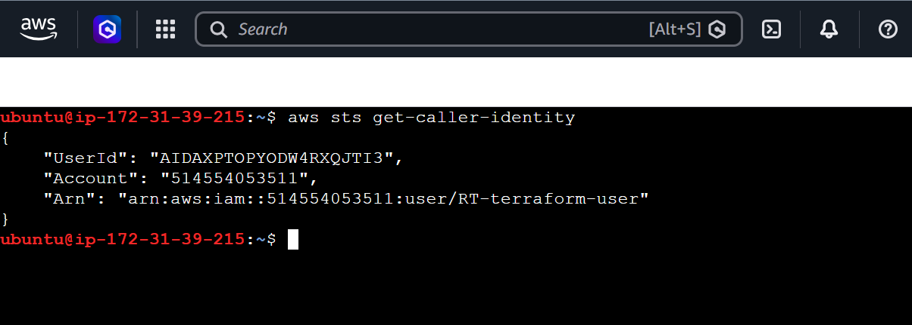

---

## Task 3: Write `main.tf` and create an S3 bucket

### What
Write our first Terraform code, then run `init`, `plan` and `apply` to create an **S3 bucket** in Mumbai. Finally check the bucket in the AWS Console.

### Why
This is the core Terraform loop: **write code, preview, create, verify.** Everything else in the course builds on it.

### Step 1: Create a project folder

```bash
mkdir ~/terraform-basics
cd ~/terraform-basics
```

- Terraform reads **all `.tf` files in the current folder**. So always run terraform commands from inside this folder.
- Path used in this guide: `~/terraform-basics`

### Step 2: Write `main.tf`

```bash
cat > main.tf << 'EOF'
terraform {
  required_providers {
    aws = {
      source  = "hashicorp/aws"
      version = "~> 6.0"
    }
  }
}

provider "aws" {
  region = "ap-south-1"
}

resource "aws_s3_bucket" "my_bucket" {
  bucket = "rohit-tf-day61-48291"
}
EOF
```

> **Important:** S3 bucket names are **globally unique** (across all AWS users). Change `rohit-tf-day61-48291` to your own name plus some random digits, for example `yourname-tf-day61-73920`. Use only lowercase letters, numbers and hyphens.

### Understanding every block of the code

**1. `terraform { ... }` block: settings for Terraform itself**

- `required_providers`: lists the plugins we need.
- `source = "hashicorp/aws"`: download the official AWS provider made by HashiCorp.
- `version = "~> 6.0"`: allow any `6.x` version, but **not** `7.0`. This protects us from big breaking changes.

**2. `provider "aws" { ... }` block: how to connect to AWS**

- `region = "ap-south-1"`: create everything in Mumbai.
- No keys are written here on purpose. Terraform picks them up from `aws configure`. Never write keys inside `.tf` files.

**3. `resource "aws_s3_bucket" "my_bucket" { ... }` block: the thing we want**

- `"aws_s3_bucket"`: the **resource type** (an S3 bucket).
- `"my_bucket"`: a **local name** used only inside our code (to refer to it later). It is not the AWS name.
- `bucket = "..."`: the real bucket name in AWS.

### Step 3: `terraform init`

```bash
terraform init
```

- **What it does:** downloads the AWS provider plugin and prepares the folder.
- **Look for:** `Terraform has been successfully initialized!`
- **What it creates:**
  - `.terraform/` folder: the downloaded provider plugins live here (for example `.terraform/providers/registry.terraform.io/hashicorp/aws/6.66.0/linux_amd64/`).
  - `.terraform.lock.hcl` file: locks the exact provider version so everyone on the team uses the same one.

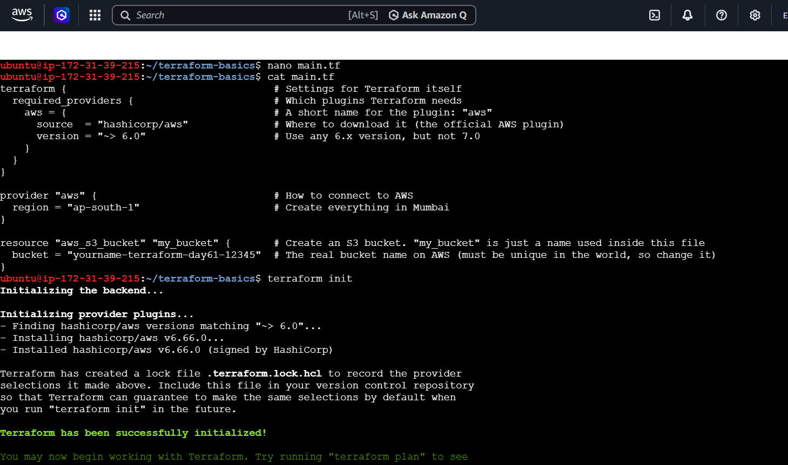

### Step 4: `terraform plan`

```bash
terraform plan
```

- **What it does:** compares your code with what exists and prints what **would** be created. Nothing is really created yet.
- **Look for:** `# aws_s3_bucket.my_bucket will be created` and at the end `Plan: 1 to add, 0 to change, 0 to destroy.`
- The green `+` sign means "will be created".

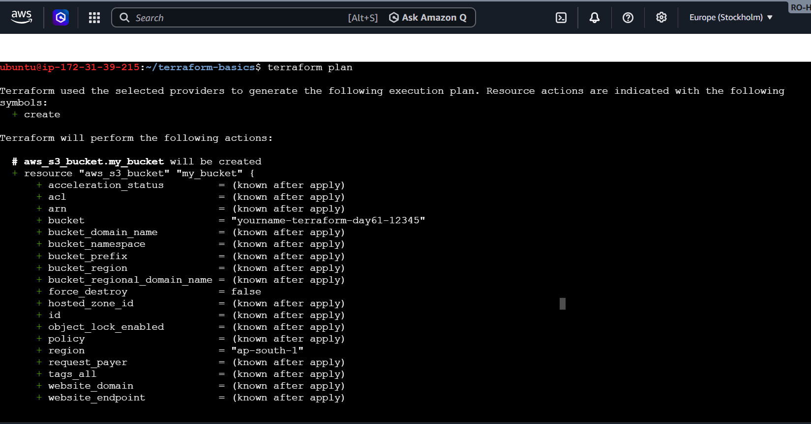

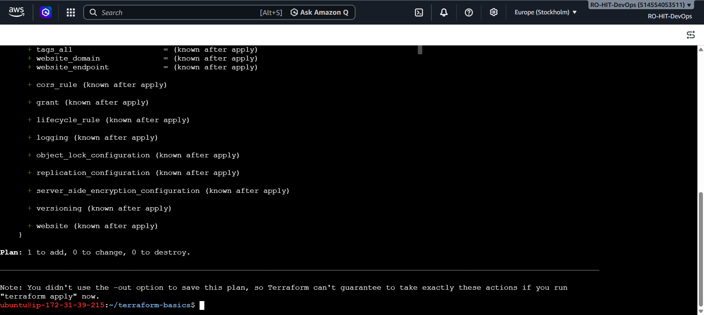

### Step 5: `terraform apply`

```bash
terraform apply
```

- **What it does:** shows the plan again and asks for permission.
- Type `yes` and press Enter. (Only the exact word `yes` is accepted.)
- **Look for:** `Apply complete! Resources: 1 added, 0 changed, 0 destroyed.`

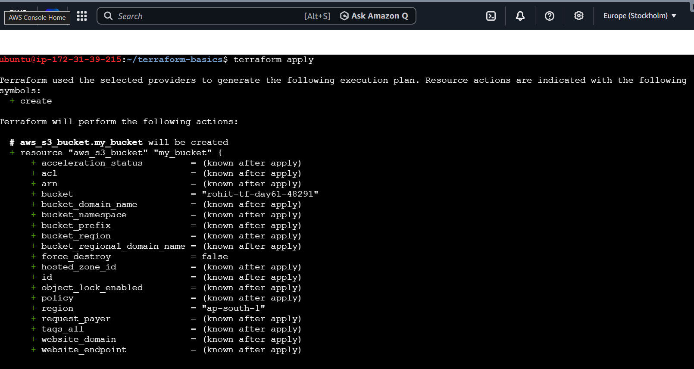

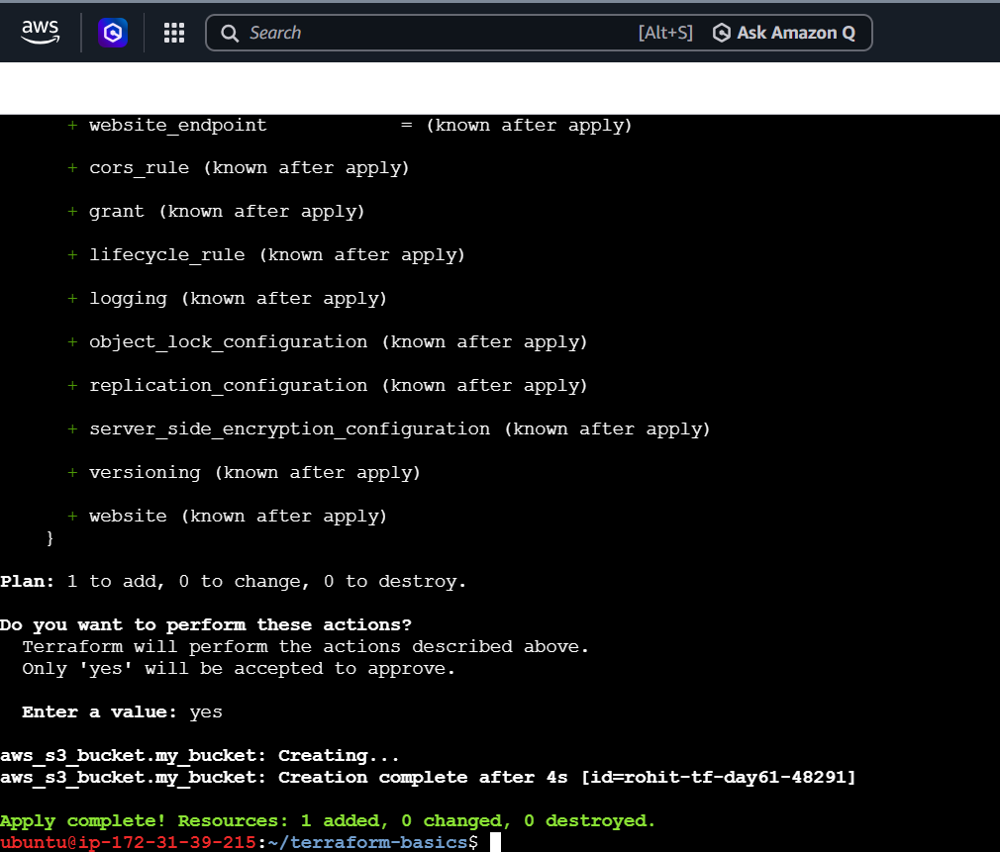

### Step 6: Verify in the AWS Console

1. Open the AWS Console and search for **S3**.
2. Look in **General purpose buckets** for your bucket name.
3. The **AWS Region** column must show **Asia Pacific (Mumbai) ap-south-1**.

> Tip: the S3 bucket list shows buckets from **all regions** together. The top-right region of the Console can be different (for example Stockholm) and the bucket will still appear.

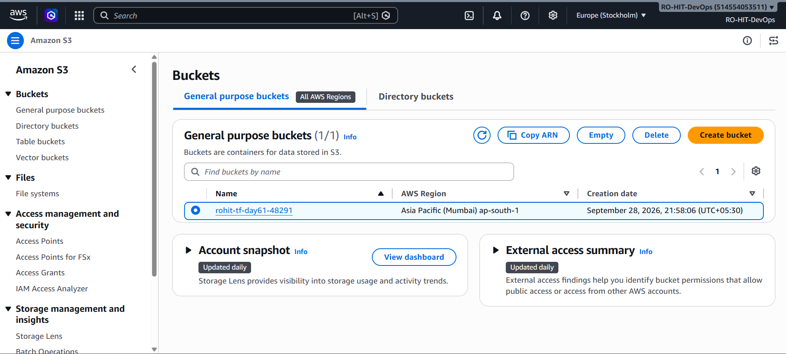

### Documentation questions

**What did `terraform init` download?**

- The `hashicorp/aws` provider (version 6.66.0 in this run).
- It also created the `.terraform.lock.hcl` lock file.

**What is inside the `.terraform/` folder?**

- The downloaded provider plugins.
- In this run: `providers/registry.terraform.io/hashicorp/aws/6.66.0/linux_amd64/` containing the provider binary and a LICENSE file.

---

## Task 4: Add an EC2 instance

### What
Add a second resource, an **EC2 server**, to the **same** `main.tf`. Then plan, apply and check it in the EC2 Console.

### Why
- Shows that one Terraform project can manage **many** resources.
- Shows that Terraform only creates what is **missing**. The bucket already exists, so only the server is added.

### What an EC2 instance needs

- **AMI:** the operating system image (Amazon Linux, Ubuntu, etc).
- **Instance type:** the size of the server (CPU and memory).
- **Tags:** labels. The `Name` tag is the name you see in the Console.

### Step 1: Find the correct AMI for your region

The task gives a sample AMI `ami-0f5ee92e2d63afc18`. **Do not copy it blindly.**

- AMI IDs are **different in every region** and change over time.
- The old ID may not exist in Mumbai. The task itself says "use the correct AMI for your region".
- Amazon Linux 2 is getting old, so we use **Amazon Linux 2023**.

Ask AWS for the latest Amazon Linux 2023 image in Mumbai:

```bash
aws ec2 describe-images \
  --owners amazon \
  --filters "Name=name,Values=al2023-ami-2023*-x86_64" "Name=state,Values=available" \
  --query "sort_by(Images, &CreationDate)[-1].ImageId" \
  --output text \
  --region ap-south-1
```

- The output is one ID starting with `ami-`. In this run: `ami-0ee11497c4eac651d`. **Yours may be different, use your own output.**


### Step 2: Add the EC2 block to `main.tf`

Append it at the end of the file:

```bash
cat >> main.tf << 'EOF'

resource "aws_instance" "my_server" {
  ami           = "ami-0ee11497c4eac651d"   # Amazon Linux 2023, Mumbai
  instance_type = "t2.micro"                # Small server size

  tags = {
    Name = "TerraWeek-Day1"                 # Name shown in the EC2 console
  }
}
EOF
```

> **Warning:** run the `cat >>` command **only once**. Running it twice creates a duplicate block and Terraform fails with `Duplicate resource`. If that happens, rewrite the whole file with a single `cat > main.tf << 'EOF'` (one `>`), which replaces the file.

**Understanding the block:**

- `"aws_instance"`: resource type (an EC2 server).
- `"my_server"`: local name in our code.
- `ami`: which OS image to use.
- `instance_type`: server size.
- `tags`: the `Name` tag appears in the Console.

Check the file has both resources exactly once:

```bash
cat main.tf
```

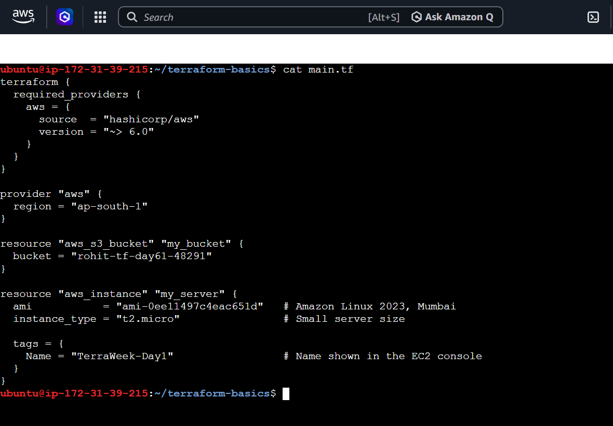

### Step 3: Validate and plan

```bash
terraform validate
terraform plan
```

- `terraform validate` checks the syntax. Expected: `Success! The configuration is valid.`
- `terraform plan` should show:
  - `# aws_instance.my_server will be created`
  - **no change** for the bucket
  - `Plan: 1 to add, 0 to change, 0 to destroy.`

`1 to add` (not 2) proves Terraform knows the bucket already exists.

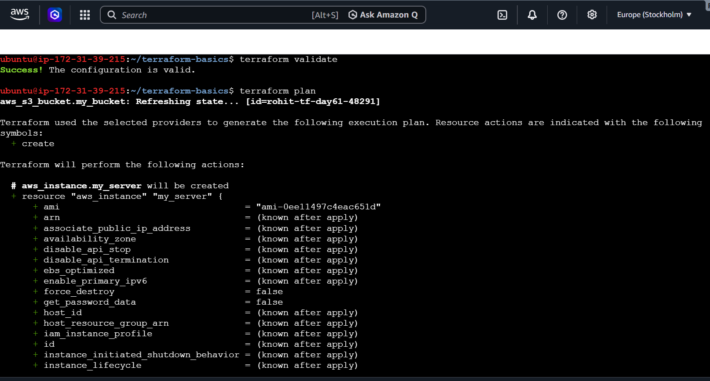

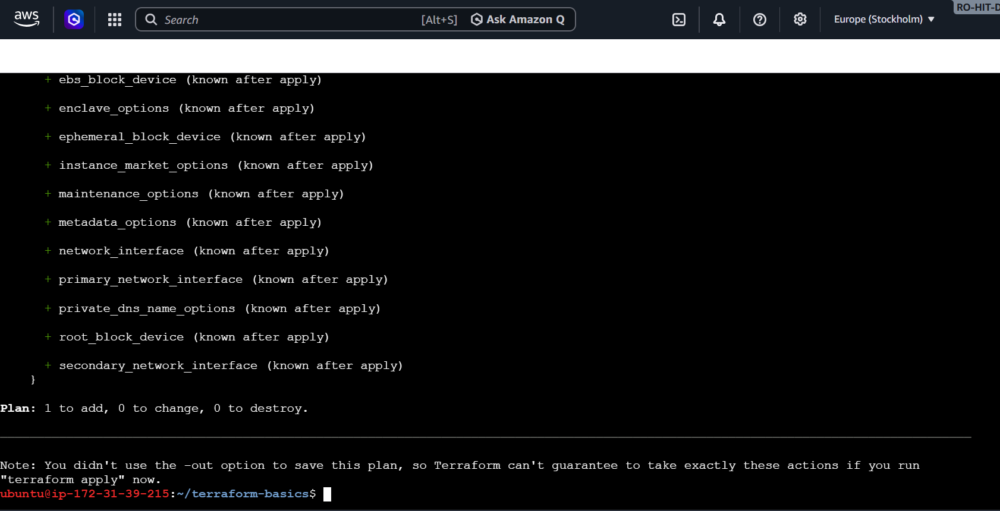

### Step 4: `terraform apply` and the Free Tier error

```bash
terraform apply
```

Type `yes`. In this run it **failed** with:

```
Error: creating EC2 Instance: operation error EC2: RunInstances, https response error
StatusCode: 400, api error InvalidParameterCombination:
The specified instance type is not eligible for Free Tier.
```

**What this means:**

- `t2.micro` is not Free Tier eligible for this AWS account.
- The code is **not wrong**. `validate` and `plan` passed. It is an AWS account rule.
- Nothing was created, so the bucket and state are safe.


### Step 5: Find a Free Tier instance type

```bash
aws ec2 describe-instance-types \
  --filters "Name=free-tier-eligible,Values=true" \
  --query "InstanceTypes[*].InstanceType" \
  --output text \
  --region ap-south-1
```

In this run the list was: `t8i.micro`, `c7i-flex.large`, `t4g.small`, `t3.micro`, `t4g.micro`, `t3.small`, `t8i.small`, `m7i-flex.large`.

**How we chose `t3.micro`:**

- It is small, like the `t2.micro` in the task.
- It is **x86_64**, the same as our AMI.
- `t4g.*` types are **ARM (Graviton)**. They will not work with an x86_64 AMI.


### Step 6: Change the instance type and apply again

```bash
sed -i 's/t2.micro/t3.micro/' main.tf
grep instance_type main.tf
terraform plan
terraform apply
```

- `sed -i 's/old/new/' file` replaces text inside a file, in place.
- Type `yes` when asked.
- Expected: `Apply complete! Resources: 1 added, 0 changed, 0 destroyed.` (about 15 seconds).

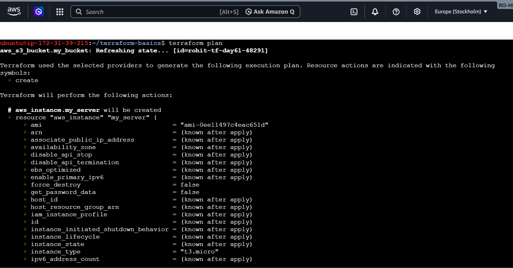

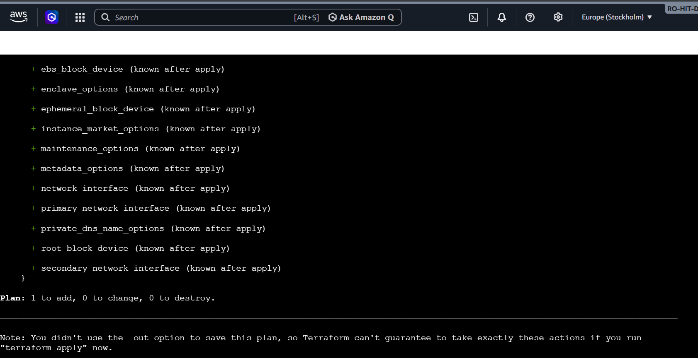

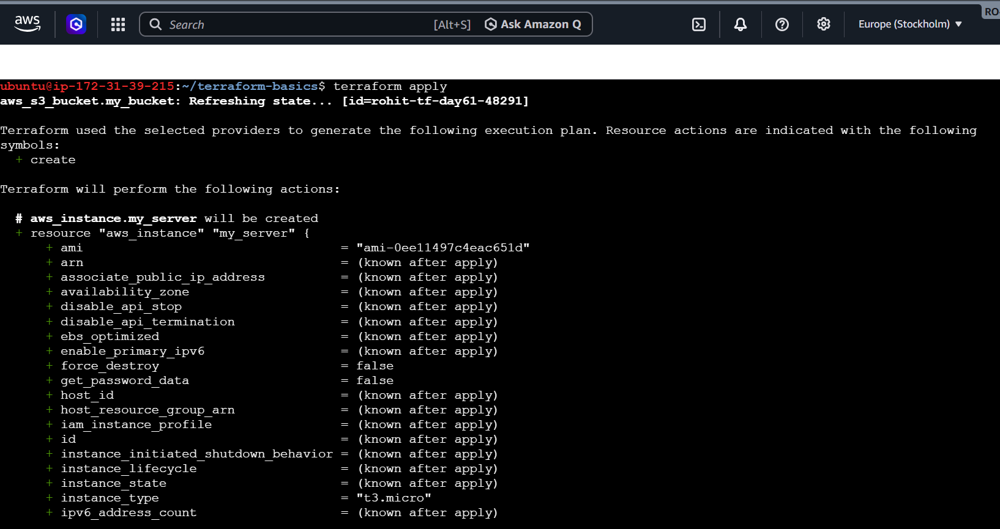

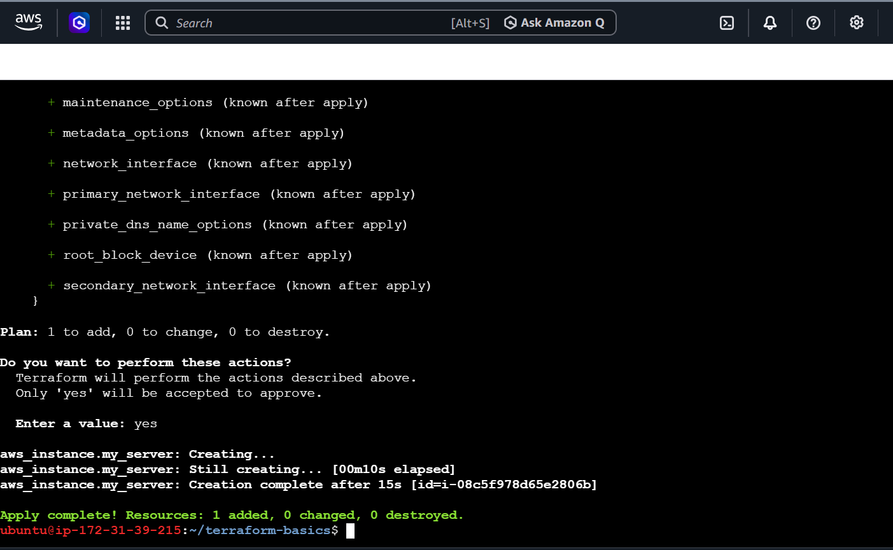

### Step 7: Verify in the EC2 Console

1. **Switch the Console region to Asia Pacific (Mumbai).** Unlike S3, the EC2 page only shows the **selected region**. If you stay in another region (for example Stockholm) you will not see your server.
2. Open **EC2 > Instances**.
3. Check:
   - **Name:** `TerraWeek-Day1`
   - **Instance ID:** matches the ID in the Terraform output
   - **Instance state:** Running
   - **Instance type:** `t3.micro`

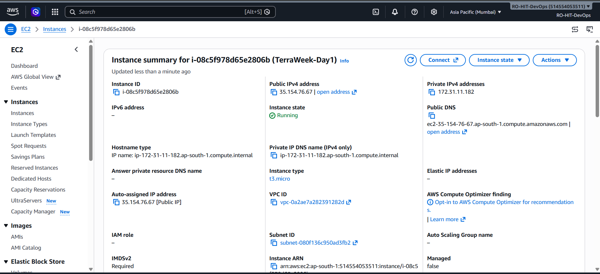

### Documentation question

**How does Terraform know the S3 bucket already exists and only the EC2 instance needs to be created?**

- Terraform keeps a **state file** (`terraform.tfstate`) that records everything it created.
- On every `plan` it compares three things:
  1. Your **code** (`main.tf`, what you want)
  2. The **state file** (what Terraform has built before)
  3. The **real AWS** (what exists now)
- The bucket is in the code **and** in the state, so nothing to do.
- The EC2 instance is only in the code, so Terraform plans to **create** it: `1 to add`.

---

## Task 5: Understand the state file

### What
Open and read the state file, and use Terraform commands to look inside it.

### Why
The state file is the "memory" of Terraform. Understanding it explains how `plan`, `apply` and `destroy` know what to do.

### Step 1: Look at the files in the folder

```bash
ls -l
head -40 terraform.tfstate
```

You will see:

- `main.tf`: your code.
- `terraform.tfstate`: the current state (JSON format).
- `terraform.tfstate.backup`: an automatic copy of the **previous** state.

**Important fields at the top of the JSON:**

| Field | Meaning |
|---|---|
| `version` | format version of the state file |
| `terraform_version` | Terraform version that wrote it |
| `serial` | counter that increases with every change |
| `lineage` | unique ID of this state, prevents mixing up two states |
| `resources` | the list of resources, each with `type`, `name`, `provider` and `attributes` |

> Do not run `cat terraform.tfstate` on the whole file, it is long. Use `head`.

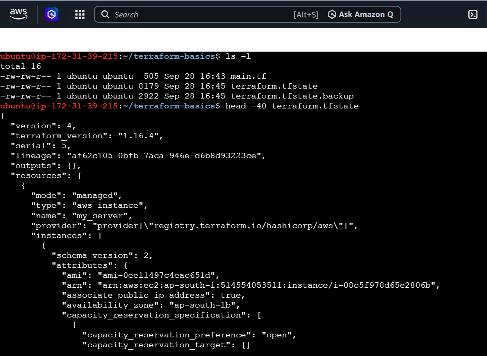

### Step 2: `terraform state list` and `terraform show`

```bash
terraform state list
terraform show
```

- `terraform state list`: prints only the **names** of the resources Terraform manages:
  - `aws_instance.my_server`
  - `aws_s3_bucket.my_bucket`
- `terraform show`: prints the **full state** in a human-friendly format.

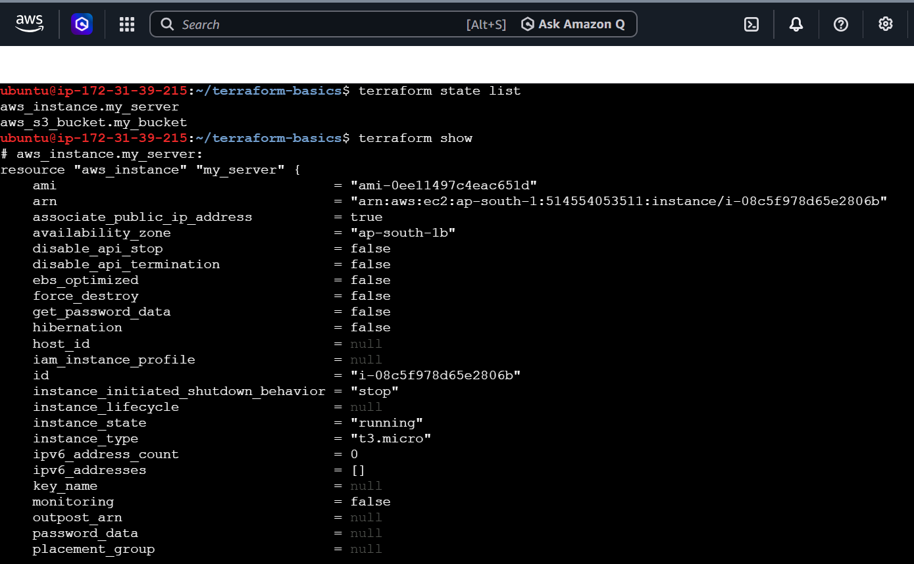

### Step 3: `terraform state show <resource>`

```bash
terraform state show aws_s3_bucket.my_bucket
terraform state show aws_instance.my_server
```

- Shows **one** resource in detail.
- Format is `terraform state show <resource_type>.<local_name>`.
- Notice that many values (such as `availability_zone`, `arn`, `hosted_zone_id`) were **never written in our code**. AWS created them and Terraform stored them.

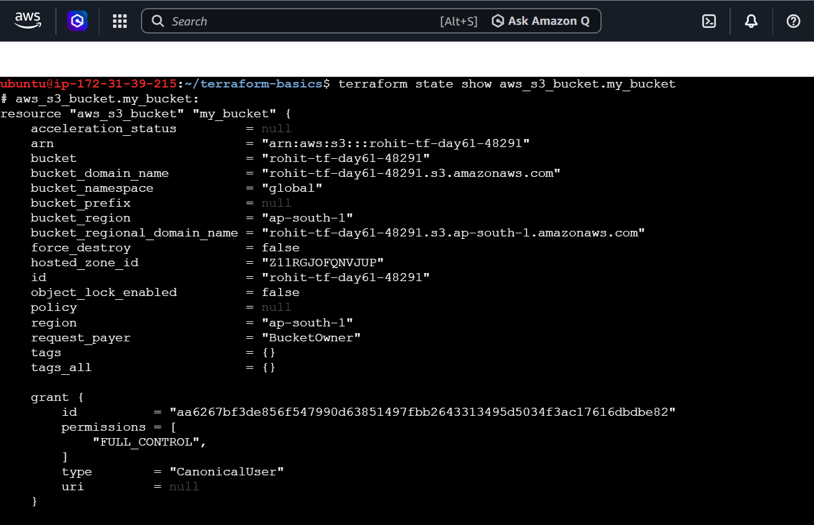

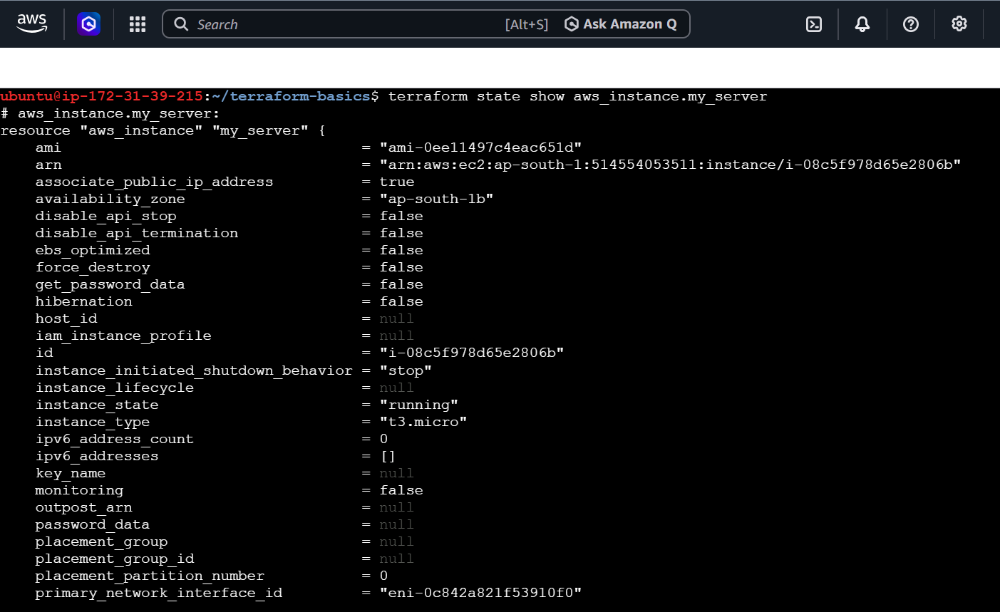

### Difference between the commands

| Command | Shows |
|---|---|
| `terraform state list` | names of all resources only |
| `terraform show` | full details of **all** resources |
| `terraform state show <name>` | full details of **one** resource |

### Documentation questions

**What information does the state file store about each resource?**

- The resource **type and name** (`aws_instance`, `my_server`).
- The AWS **ID and ARN**.
- All **attributes** with their current values (availability zone, instance type, IP addresses, tags, root volume, and so on).
- Values that AWS decided after creation (not written in our code).
- Provider details, Terraform version, `serial` and `lineage`.

**Why should you never manually edit the state file?**

- The state must match the real AWS. A manual edit makes them differ.
- Terraform may then **recreate or delete** the wrong resource.
- One small mistake in the JSON can **corrupt** the file.
- To change infrastructure, edit `main.tf` and run `terraform apply`. To fix the state, use `terraform state` commands.

**Why should the state file not be committed to Git?**

- It can contain **sensitive data** in plain text (account IDs, IP addresses, and sometimes passwords or keys).
- Two people changing it at the same time cause **conflicts**.
- Once something is in Git history it is hard to remove.
- The right way is a **remote backend** (for example S3 with locking), and adding this to `.gitignore`:

```gitignore
*.tfstate
*.tfstate.*
.terraform/
```

---

## Task 6: Modify, plan and destroy

### What

1. Change the EC2 `Name` tag from `TerraWeek-Day1` to `TerraWeek-Modified`.
2. Run `terraform plan` and read the symbols.
3. Apply the change and verify it in the Console.
4. Destroy everything and verify that both resources are gone.

### Why
Real infrastructure changes over time. This task shows how Terraform handles **changes** and **clean-up**.

### Step 1: Change the tag

Make sure you are inside the project folder first:

```bash
cd ~/terraform-basics
sed -i 's/TerraWeek-Day1/TerraWeek-Modified/' main.tf
grep Name main.tf
```

> If you see `sed: can't read main.tf: No such file or directory`, you are in the wrong folder (for example your home folder `~`). Run `cd ~/terraform-basics` and try again.

You should see `Name = "TerraWeek-Modified"`.

### Step 2: `terraform plan` and the symbols

```bash
terraform plan
```

**Symbols in the plan:**

| Symbol | Meaning |
|---|---|
| `+` | a resource will be **created** |
| `~` | a resource will be **updated in-place** |
| `-` | a resource will be **destroyed** |
| `-/+` | a resource will be **destroyed and recreated** |

**In our plan we saw:**

- `# aws_instance.my_server will be updated in-place`
- `~ tags` and `~ tags_all` changed from `"TerraWeek-Day1" -> "TerraWeek-Modified"`
- The `id` stayed the same
- `Plan: 0 to add, 1 to change, 0 to destroy.`

**Is it an in-place update or destroy-and-recreate?**

- It is an **in-place update** (`~`).
- A tag is only a label, so AWS can change it without rebuilding the server.
- The same instance ID stays before and after.

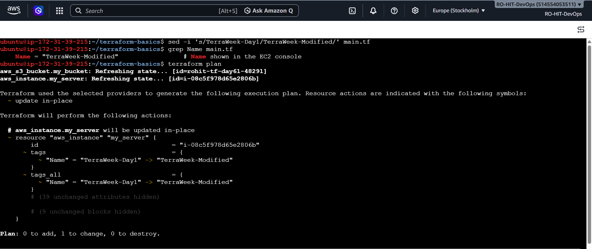

### Step 3: Console before the change

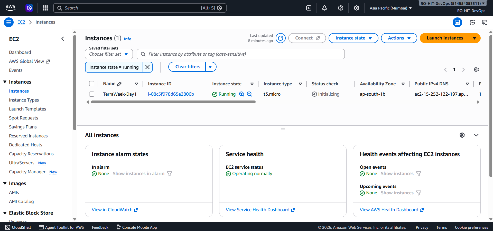

### Step 4: `terraform apply`

```bash
terraform apply
```

Type `yes`. Expected:

- `Modifications complete after 3s`
- `Apply complete! Resources: 0 added, 1 changed, 0 destroyed.`

It is fast because the server is not rebuilt.

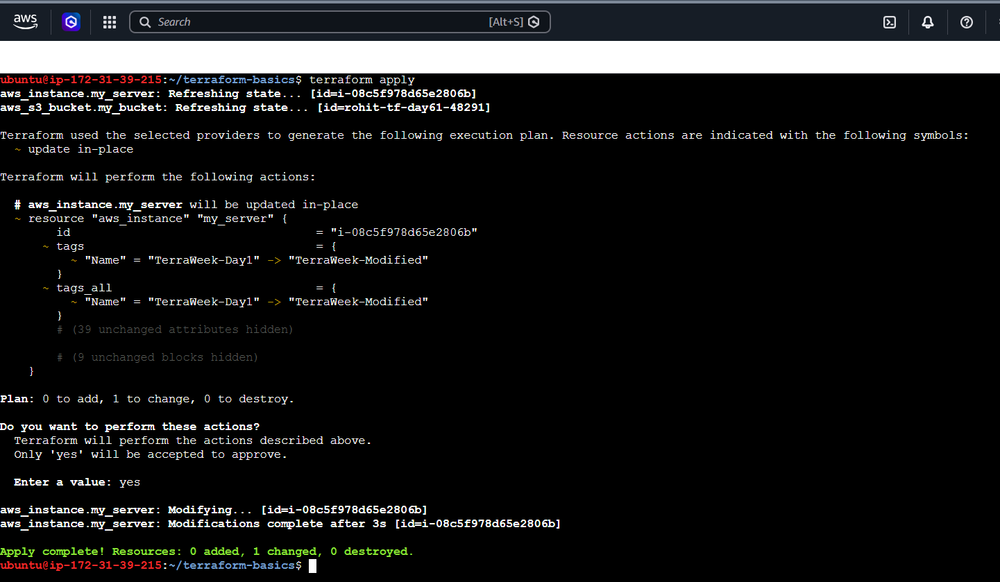

### Step 5: Verify the tag in the Console

- Mumbai region > **EC2 > Instances** > click the **refresh** button.
- The Name is now `TerraWeek-Modified`.
- The Instance ID is unchanged, which proves it was an in-place update.

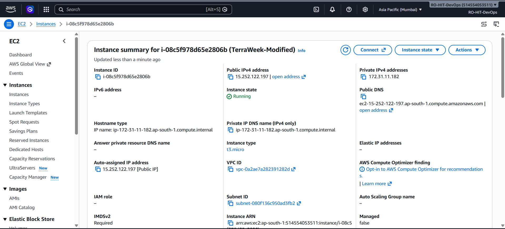

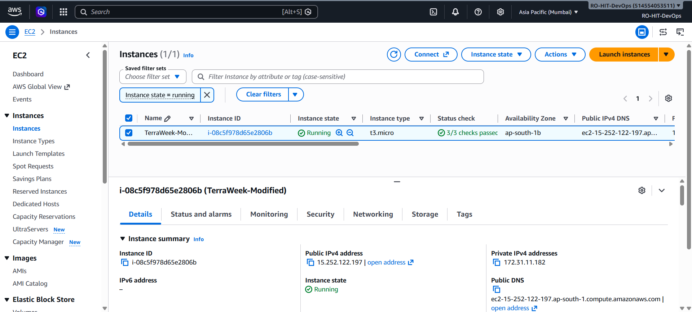

### Step 6: `terraform destroy`

```bash
terraform destroy
```

- Shows every resource with a red `-` sign.
- Expected: `Plan: 0 to add, 0 to change, 2 to destroy.`
- It says `There is no undo. Only 'yes' will be accepted`. Type `yes`.
- Expected: `Destroy complete! Resources: 2 destroyed.`
- The bucket is removed in about 1 second, the EC2 server in about 20 seconds.
- Terraform starts both together because they do not depend on each other.

> Before typing `yes`, check the line says `2 to destroy`. Deleting cannot be undone.


### Step 7: Verify in the Console

- **EC2 (Mumbai):** the instance is gone or shows `Terminated`. A terminated server may stay visible for a short time. That is normal. If a filter like `Instance state = running` is applied, the list will simply be empty. Click **Clear filters** to see the `Terminated` entry.
- **S3:** the bucket is no longer in the list. An account with no buckets shows the S3 welcome page with a **Create bucket** button.

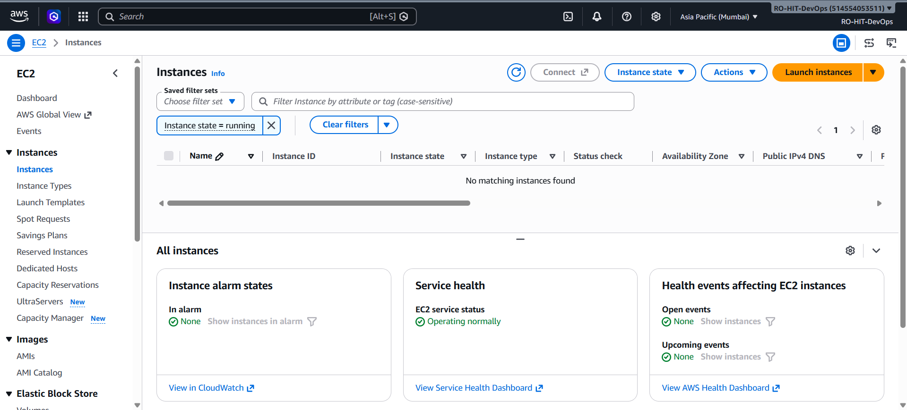

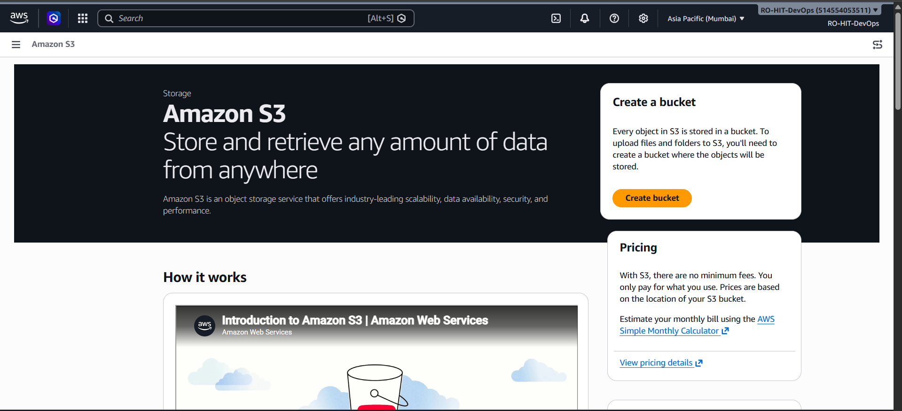

---

## Common Errors and Fixes

| Problem | Reason | Fix |
|---|---|---|
| `command not found: terraform` | Terraform not installed | Repeat Task 1 |
| `No such file or directory: main.tf` | Wrong folder | `cd ~/terraform-basics` |
| `Duplicate resource` | The `cat >>` command was run twice | Rewrite the file with `cat > main.tf << 'EOF'` |
| `BucketAlreadyExists` | Bucket names are global | Use a more unique bucket name |
| `not eligible for Free Tier` | `t2.micro` not allowed on this account | Use a Free Tier type such as `t3.micro` |
| `InvalidAMIID.NotFound` | AMI belongs to another region | Look up the AMI for your region |
| Instance not visible in the Console | Console is in a different region | Switch to Asia Pacific (Mumbai) |
| `InvalidClientTokenId` | Wrong or expired AWS keys | Run `aws configure` again |

---

## Command Cheat Sheet

```bash
# Check tools
terraform -version
aws --version
aws sts get-caller-identity

# Core workflow (run inside the project folder)
terraform init
terraform validate
terraform plan
terraform apply
terraform destroy

# Inspect state
terraform state list
terraform show
terraform state show <resource_type>.<local_name>

# Handy helpers
sed -i 's/old/new/' main.tf      # replace text in a file
grep <word> main.tf              # find text in a file
```

---

## Key Learnings

- Terraform builds infrastructure from **code**, and `plan` lets you preview changes safely.
- The **state file** is how Terraform knows what already exists. Never edit it by hand and never commit it to Git.
- Terraform only does the **difference**: adding EC2 did not touch the bucket.
- **Tag changes** are in-place updates (`~`), while some changes force a rebuild (`-/+`). Always read the plan.
- Values such as AMI IDs and Free Tier rules are **region and account specific**. Always verify them.
- The **S3 list is global**, but the **EC2 list is per region**.
- Always finish with `terraform destroy` to avoid surprise costs.

---

