# Day 62 - Providers, Resources and Dependencies

Yesterday I created single, standalone resources. Real infrastructure is connected: a server lives inside a subnet, a subnet lives inside a VPC, and a security group controls the traffic. Today I built a full networking stack on AWS with Terraform and learned **how Terraform decides what to create first**.

> This file is written so that a beginner can read it top to bottom and repeat every task on their own machine.

---

## What I built today

- A **VPC** with a **public subnet**, **internet gateway**, **route table** and **route table association**
- A **security group** (SSH + HTTP) and an **EC2 instance** inside the subnet
- An **S3 bucket** that is created only after the instance (using `depends_on`)
- A **dependency graph** using `terraform graph`
- A **lifecycle rule** (`create_before_destroy`) and a full **`terraform destroy`**

## Before you start (what you need)

- An AWS account and a Linux terminal (I used an Ubuntu EC2 server)
- Terraform installed (`terraform -version` should work)
- AWS credentials configured on the machine (`aws sts get-caller-identity` should work)
- Graphviz `dot` (only for the PNG graph, optional): `dot -V`
- My region: **eu-north-1 (Stockholm)**. You can use any region, but AMI IDs are different in every region.

## Final folder structure

```
terraform-aws-infra/
├── providers.tf        # which provider + version + region
├── main.tf             # all resources
├── .terraform/         # provider plugin (created by terraform init)
├── .terraform.lock.hcl # exact provider version (created by terraform init)
├── terraform.tfstate   # Terraform's memory of what it created (created by apply)
└── graph.png           # dependency graph picture
```

---

# Task 1: Explore the AWS Provider

## What is a provider?
- Terraform itself cannot talk to AWS. It needs a plugin called a **provider**.
- The **AWS provider** knows how to create VPCs, EC2 instances, S3 buckets and more.
- Terraform downloads the provider when we run `terraform init`.

## Step 1: Create the project directory

**What:** Make a new folder for this project and go inside it.
**Why:** Terraform treats every `.tf` file in one folder as one project. A separate folder keeps state and downloads separate from yesterday's project.

```bash
mkdir terraform-aws-infra
cd terraform-aws-infra
pwd
```

## Step 2: Write `providers.tf`

**What:** A file with two blocks: the `terraform` block (which provider and version) and the `provider` block (settings such as region).
**Why:** Pinning the version means a new major version of the provider cannot break my code by surprise.

```bash
nano providers.tf
```

```hcl
terraform {
  required_providers {
    aws = {
      source  = "hashicorp/aws"
      version = "~> 5.0"
    }
  }
}

provider "aws" {
  region = "eu-north-1"
}
```

Line by line:
- `source = "hashicorp/aws"` : download the AWS provider made by HashiCorp from the Terraform Registry.
- `version = "~> 5.0"` : allow any 5.x version, but not 6.0.
- `region = "eu-north-1"` : all resources will be created in this AWS region.

To save in nano: `Ctrl + O`, `Enter`, `Ctrl + X`.

## Step 3: Run `terraform init`

**What:** Terraform reads `providers.tf` and downloads the AWS provider.
**Why:** Without `init`, `plan` and `apply` do not work because the provider is not on the machine yet.

```bash
terraform init
```

What to look for in the output:
- `Finding hashicorp/aws versions matching "~> 5.0"...`
- `Installing hashicorp/aws v5.100.0...` : **the installed version is 5.100.0**
- `Terraform has created a lock file .terraform.lock.hcl`
- `Terraform has been successfully initialized!`

Check what was created:

```bash
ls -a
```

You will see `.terraform/` (the downloaded plugin) and `.terraform.lock.hcl` (the lock file).

## Step 4: Read the lock file

```bash
cat .terraform.lock.hcl
```

```hcl
provider "registry.terraform.io/hashicorp/aws" {
  version     = "5.100.0"
  constraints = "~> 5.0"
  hashes = [ ... ]
}
```

**What does the lock file do?**
- It saves the **exact provider version** that Terraform picked (`5.100.0`).
- It saves **checksums (hashes)** so Terraform can check the downloaded file was not changed or damaged.
- Because of this, everyone who runs `terraform init` later (teammates, CI/CD) gets the **same version**.
- Commit this file to Git. Do **not** commit the `.terraform/` folder.

## Document: What does `~> 5.0` mean?

| Constraint | Meaning | Allowed versions |
|---|---|---|
| `~> 5.0` | 5.0 or higher, but **less than 6.0** | 5.0, 5.50, 5.100.0 (yes), 6.0 (no) |
| `>= 5.0` | 5.0 or **anything higher** | 5.0, 5.100.0, 6.0, 7.0 (all yes) |
| `= 5.0.0` | **Exactly** 5.0.0 only | Only 5.0.0 |

- `~>` is called the "pessimistic constraint operator". It only lets the **last number** go up.
- `~> 5.0` = `>= 5.0` and `< 6.0`.
- `~> 5.0.0` = `>= 5.0.0` and `< 5.1.0` (only patch updates).
- `>= 5.0` is risky: version 6.0 may have breaking changes and can break my code.
- `= 5.0.0` is very strict: I never get bug fixes or security patches.
- `~> 5.0` is the balanced choice: new features and fixes, but no big breaking jump.

## Output (screenshots)

`terraform init` output (installed version 5.100.0):

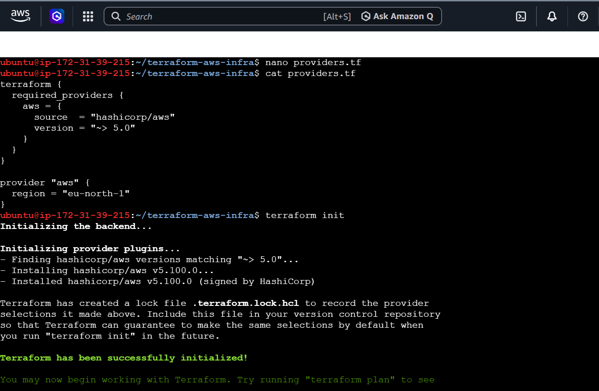

Lock file (`ls -a` and `cat .terraform.lock.hcl`):

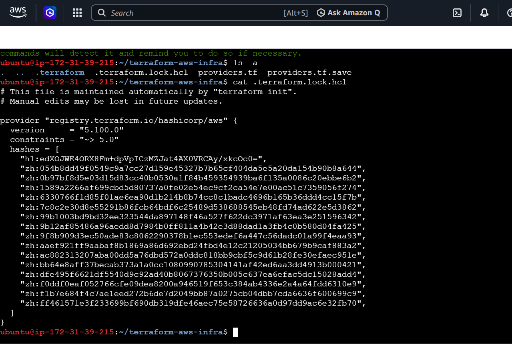

---

# Task 2: Build a VPC from Scratch

I created `main.tf` and added 5 resources **one by one**. Do not delete the earlier blocks when you add the next one. Always add the new block at the **bottom** of the file.

```bash
nano main.tf
```

## Resource 1: `aws_vpc`

**What:** A VPC is my own private network inside AWS.
**Why:** Every other resource (subnet, gateway, route table) lives inside this VPC, so it comes first.
`10.0.0.0/16` means about 65,000 private IP addresses.

```hcl
resource "aws_vpc" "main" {
  cidr_block = "10.0.0.0/16"

  tags = {
    Name = "TerraWeek-VPC"
  }
}
```

- `"aws_vpc"` is the **resource type**. `"main"` is my own name for it inside Terraform. I refer to it later as `aws_vpc.main`.

## Resource 2: `aws_subnet`

**What:** A smaller part of the VPC where servers are placed.
**Why:** An EC2 instance is created in a subnet, not directly in the VPC.
`map_public_ip_on_launch = true` gives every instance in this subnet a public IP automatically.

```hcl
resource "aws_subnet" "public" {
  vpc_id                  = aws_vpc.main.id
  cidr_block              = "10.0.1.0/24"
  map_public_ip_on_launch = true

  tags = {
    Name = "TerraWeek-Public-Subnet"
  }
}
```

- `vpc_id = aws_vpc.main.id` is the **first dependency**. The VPC ID is only known after the VPC is created, so Terraform creates the VPC first.
- The subnet range `10.0.1.0/24` must be **inside** the VPC range `10.0.0.0/16`.

## Resource 3: `aws_internet_gateway`

**What:** The door between my VPC and the internet.
**Why:** Without it, nothing in the VPC can reach the internet, even with a public IP.

```hcl
resource "aws_internet_gateway" "gw" {
  vpc_id = aws_vpc.main.id

  tags = {
    Name = "TerraWeek-IGW"
  }
}
```

- `vpc_id = aws_vpc.main.id` is what "attaches" the gateway to the VPC. No separate attach step is needed.

## Resource 4: `aws_route_table`

**What:** A map that tells network traffic where to go.
**Why:** The internet gateway exists, but the subnet does not know about it until a route points to it.
`0.0.0.0/0` means "every address that is not inside the VPC", which is the whole internet.

```hcl
resource "aws_route_table" "public" {
  vpc_id = aws_vpc.main.id

  route {
    cidr_block = "0.0.0.0/0"
    gateway_id = aws_internet_gateway.gw.id
  }

  tags = {
    Name = "TerraWeek-Public-RT"
  }
}
```

## Resource 5: `aws_route_table_association`

**What:** Connects the route table to the subnet.
**Why:** A route table does not apply to a subnet automatically. If I skip this, the subnet uses the default route table that has no internet route, so it is not really public.

```hcl
resource "aws_route_table_association" "public" {
  subnet_id      = aws_subnet.public.id
  route_table_id = aws_route_table.public.id
}
```

## Run plan and apply

```bash
terraform plan
```
Expected last line: `Plan: 5 to add, 0 to change, 0 to destroy.`
Values like `id` show `(known after apply)` because AWS only creates the ID later.

```bash
terraform apply
```
Type `yes` when asked. Expected last line: `Apply complete! Resources: 5 added, 0 changed, 0 destroyed.`

The apply output shows Terraform's order:
1. `aws_vpc.main` first
2. `aws_internet_gateway.gw` and `aws_subnet.public` together (both only need the VPC)
3. `aws_route_table.public`
4. `aws_route_table_association.public` last

## Verify in the AWS console

Open **VPC** in the console (make sure the region is Stockholm / `eu-north-1`):
- **Your VPCs** : `TerraWeek-VPC` (10.0.0.0/16)
- **Subnets** : `TerraWeek-Public-Subnet` (10.0.1.0/24)
- **Internet gateways** : `TerraWeek-IGW` (state: Attached)
- **Route tables** : `TerraWeek-Public-RT` has `10.0.0.0/16 -> local` and `0.0.0.0/0 -> igw-...`
- **Resource map** tab of the VPC shows Subnet -> Route table -> Internet gateway all connected.
- Note: the map also shows a second route table. That is the **default (main) route table** AWS creates with every VPC. It is not one of my 5 resources.

## Output (screenshots)

`main.tf` (part 1) and start of the file:

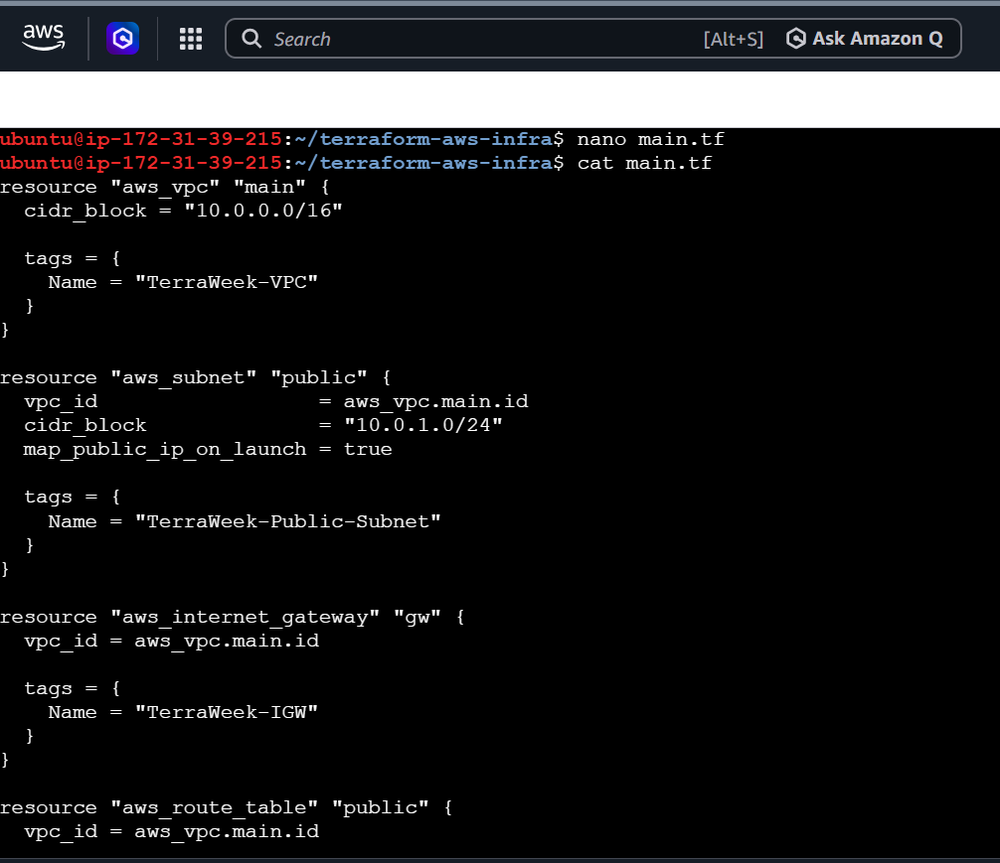

`main.tf` (part 2) and start of `terraform plan`:

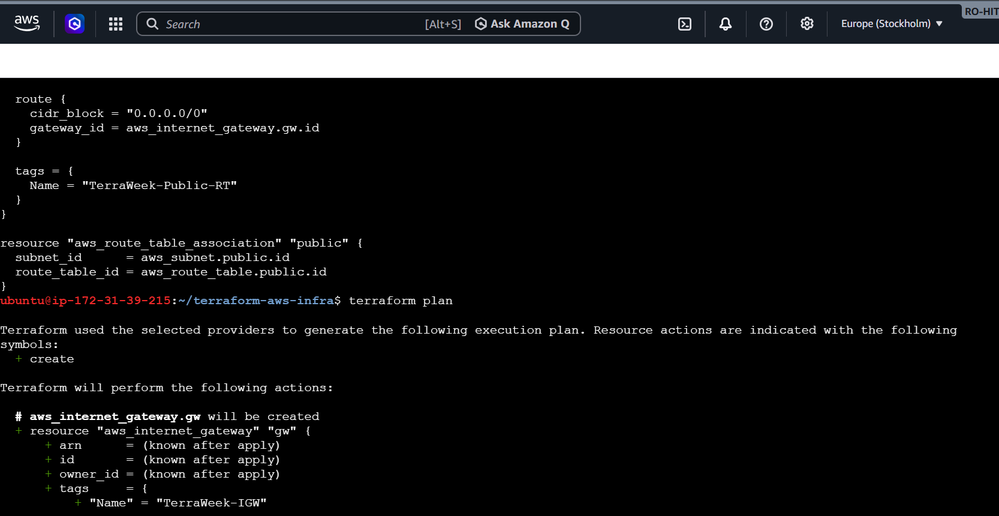

Plan summary (`5 to add`):

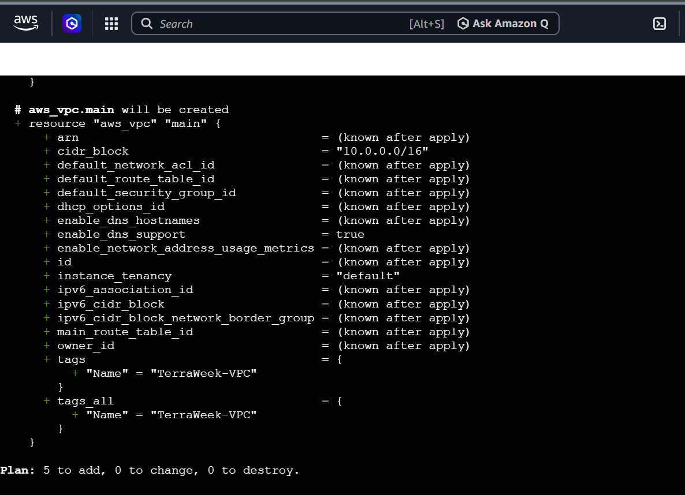

Start of `terraform apply`:

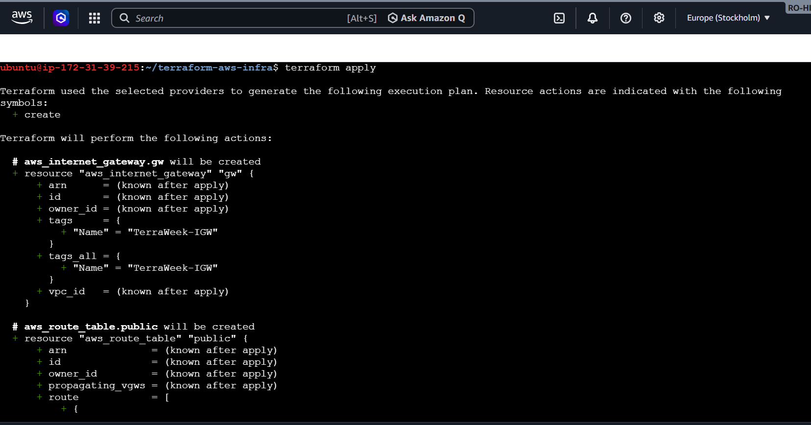

Apply complete (`5 added`):

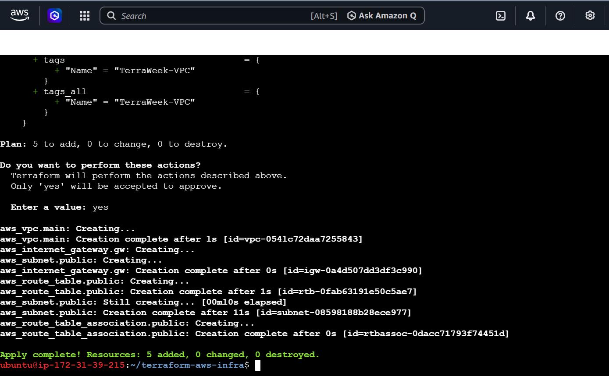

VPC resource map in the console (all connected):

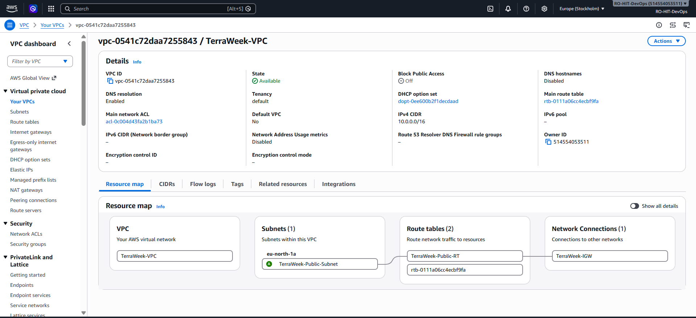

---

# Task 3: Understand Implicit Dependencies

## Question 1: How does Terraform know to create the VPC before the subnet?

- The subnet has the line `vpc_id = aws_vpc.main.id`.
- That is a **reference** to the VPC. The VPC ID does not exist until the VPC is created.
- Terraform reads every reference in my code and builds a **dependency graph**.
- Because the subnet needs a value from the VPC, Terraform creates the **VPC first**, then the subnet.
- The order of blocks in the file does **not** matter. Terraform follows dependencies, not line numbers.
- Resources that do not depend on each other are created **in parallel** (for example the subnet and the internet gateway).
- This is called an **implicit dependency** because I did not write "create this first". Terraform found it from the reference.

## Question 2: What if the subnet was created before the VPC existed?

- The subnet needs the VPC ID, and that ID does not exist yet.
- In Terraform this does not happen, because Terraform waits (the value is "known after apply").
- If someone tried to create a subnet in AWS with a VPC ID that does not exist, AWS would return an error (`InvalidVpcID.NotFound`) and the subnet would not be created.

## Question 3: All implicit dependencies in my config

| Resource | Depends on | Because of this line |
|---|---|---|
| `aws_subnet.public` | `aws_vpc.main` | `vpc_id = aws_vpc.main.id` |
| `aws_internet_gateway.gw` | `aws_vpc.main` | `vpc_id = aws_vpc.main.id` |
| `aws_route_table.public` | `aws_vpc.main` | `vpc_id = aws_vpc.main.id` |
| `aws_route_table.public` | `aws_internet_gateway.gw` | `gateway_id = aws_internet_gateway.gw.id` |
| `aws_route_table_association.public` | `aws_subnet.public` | `subnet_id = aws_subnet.public.id` |
| `aws_route_table_association.public` | `aws_route_table.public` | `route_table_id = aws_route_table.public.id` |
| `aws_security_group.web` | `aws_vpc.main` | `vpc_id = aws_vpc.main.id` |
| `aws_instance.server` | `aws_subnet.public` | `subnet_id = aws_subnet.public.id` |
| `aws_instance.server` | `aws_security_group.web` | `vpc_security_group_ids = [aws_security_group.web.id]` |

- `aws_s3_bucket.logs` depends on `aws_instance.server` too, but that one is an **explicit** dependency (Task 5).
- Small detail: in the `terraform graph` output (Task 5) the arrow `aws_route_table.public -> aws_vpc.main` is **not shown**. Terraform hides arrows that are already covered by a longer path (`route table -> internet gateway -> VPC`). The reference is still in my code.

You can see all of this in the graph pictures in Task 5.

---

# Task 4: Add a Security Group and EC2 Instance

## Step 1: Add the security group

**What:** A virtual firewall for the instance.
**Why:** Without a security group, nobody can reach the server. Port 22 is SSH (login), port 80 is HTTP (websites).

```hcl
resource "aws_security_group" "web" {
  name        = "terraweek-sg"
  description = "Allow SSH and HTTP"
  vpc_id      = aws_vpc.main.id

  ingress {
    description = "SSH"
    from_port   = 22
    to_port     = 22
    protocol    = "tcp"
    cidr_blocks = ["0.0.0.0/0"]
  }

  ingress {
    description = "HTTP"
    from_port   = 80
    to_port     = 80
    protocol    = "tcp"
    cidr_blocks = ["0.0.0.0/0"]
  }

  egress {
    from_port   = 0
    to_port     = 0
    protocol    = "-1"
    cidr_blocks = ["0.0.0.0/0"]
  }

  tags = {
    Name = "TerraWeek-SG"
  }
}
```

- `ingress` = traffic coming **in**. `egress` = traffic going **out**.
- `protocol = "-1"` with ports `0` to `0` means **all protocols and all ports**, so all outbound traffic is allowed.
- Security note: `0.0.0.0/0` on SSH means the whole internet can try to connect. This is fine for learning. In production, allow only your own IP (`x.x.x.x/32`).

## Step 2: Find an AMI ID

**What:** An AMI is the operating system image for the instance. AMI IDs are **different in every region**.

I first tried the SSM way, but my IAM user did not have permission:

```
AccessDeniedException ... not authorized to perform: ssm:GetParameter
```

So I used the EC2 way instead:

```bash
aws ec2 describe-images \
  --region eu-north-1 \
  --owners amazon \
  --filters "Name=name,Values=amzn2-ami-hvm-*-x86_64-gp2" "Name=state,Values=available" \
  --query "sort_by(Images, &CreationDate)[-1].[ImageId,Name,CreationDate]" \
  --output text
```

Result: `ami-0a902a6ddd733537d` (Amazon Linux 2).
(You can also find it in the console: EC2 -> Launch instances -> Amazon Linux -> copy the AMI ID, but do not launch.)

## Step 3: Check the instance type

The task says `t2.micro`. I checked which types exist in my region:

```bash
aws ec2 describe-instance-type-offerings \
  --region eu-north-1 \
  --filters "Name=instance-type,Values=t2.micro,t3.micro" \
  --query "InstanceTypeOfferings[].InstanceType" \
  --output text
```

Result: only `t3.micro`. So **`t2.micro` is not available in eu-north-1** and I used `t3.micro` (same size: 2 vCPU, 1 GB RAM). If your region has `t2.micro`, you can use it.

## Step 4: Add the EC2 instance

**What:** The server, placed in my subnet, with the security group attached and a public IP.

```hcl
resource "aws_instance" "server" {
  ami                         = "ami-0a902a6ddd733537d"
  instance_type               = "t3.micro"
  subnet_id                   = aws_subnet.public.id
  vpc_security_group_ids      = [aws_security_group.web.id]
  associate_public_ip_address = true

  tags = {
    Name = "TerraWeek-Server"
  }
}
```

- `subnet_id` and `vpc_security_group_ids` are two more implicit dependencies. Terraform builds the subnet and the security group first.
- `vpc_security_group_ids` takes a **list**, so it needs `[ ]`.

## Step 5: Plan and apply

```bash
terraform plan     # Plan: 2 to add, 0 to change, 0 to destroy.
terraform apply    # type yes
```

The 5 old resources are already in the state file, so Terraform only creates the **2 new ones**. Apply output: security group first (`sg-...`), then the instance (`i-...`).
`Apply complete! Resources: 2 added, 0 changed, 0 destroyed.`

## Step 6: Verify (public IP and reachable)

Check the public IP:

```bash
aws ec2 describe-instances \
  --region eu-north-1 \
  --instance-ids <your-instance-id> \
  --query "Reservations[].Instances[].[PublicIpAddress,State.Name,SubnetId,SecurityGroups[0].GroupName]" \
  --output text
```

Result: a public IP, `running`, my subnet ID, and `terraweek-sg`.

Check that port 22 is open from the internet:

```bash
nc -zv <public-ip> 22
```

Result: `Connection to ... 22 port [tcp/ssh] succeeded!`

This one test proves three things work together: the **security group** (port 22 open), the **route table + internet gateway** (a path to the internet) and the **public IP**.

Notes:
- `ping` will not work, because the security group only opens ports 22 and 80 (not ICMP).
- I did not add a key pair, so I cannot log in with SSH. The task only asks that the instance is reachable.
- Nothing listens on port 80 because I did not install a web server.

Also check in the console: EC2 -> Instances -> `TerraWeek-Server` shows Running, `t3.micro`, a Public IPv4 address, my VPC and subnet, and the Security tab shows inbound ports 22 and 80.

## Output (screenshots)

Plan start (instance block):

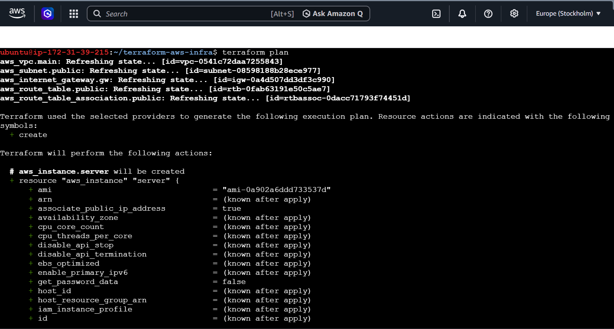

Plan summary (`2 to add`, security group rules):

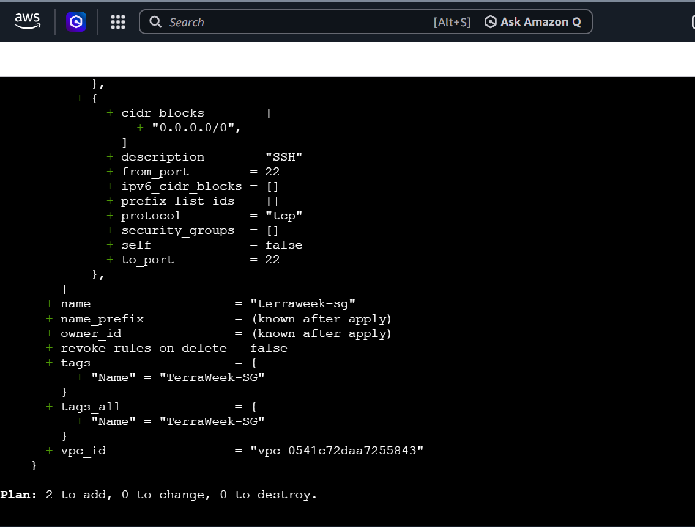

Apply start:

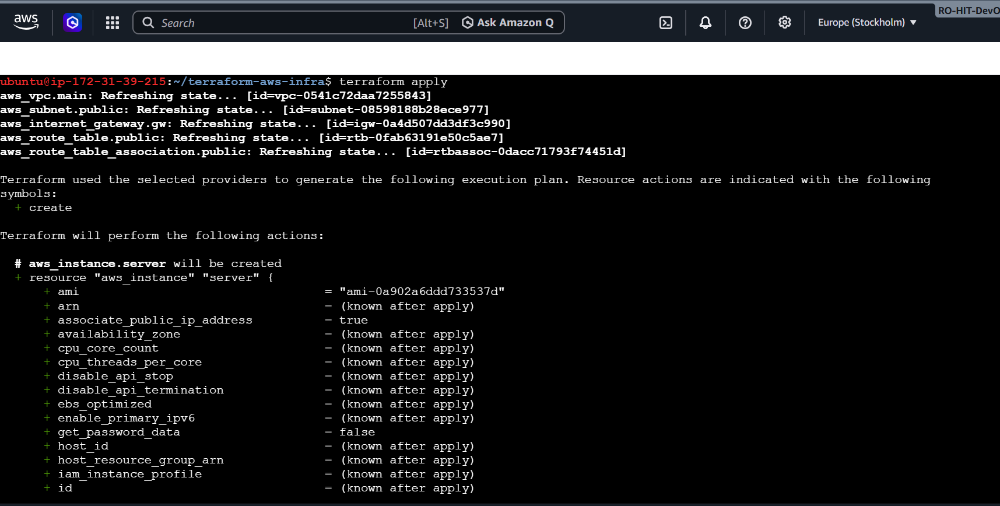

Apply complete, public IP check and port 22 check:

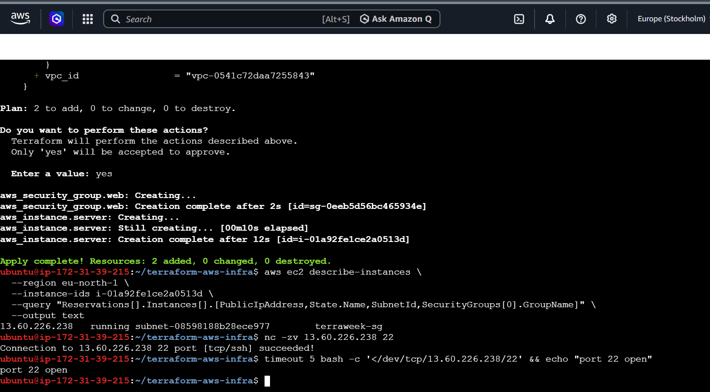

EC2 console (Running, `t3.micro`, public IP):

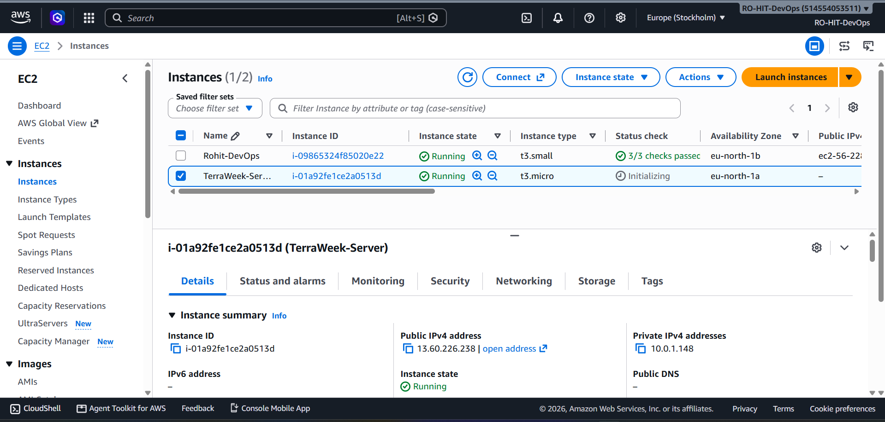

Security group inbound rules (22 and 80):

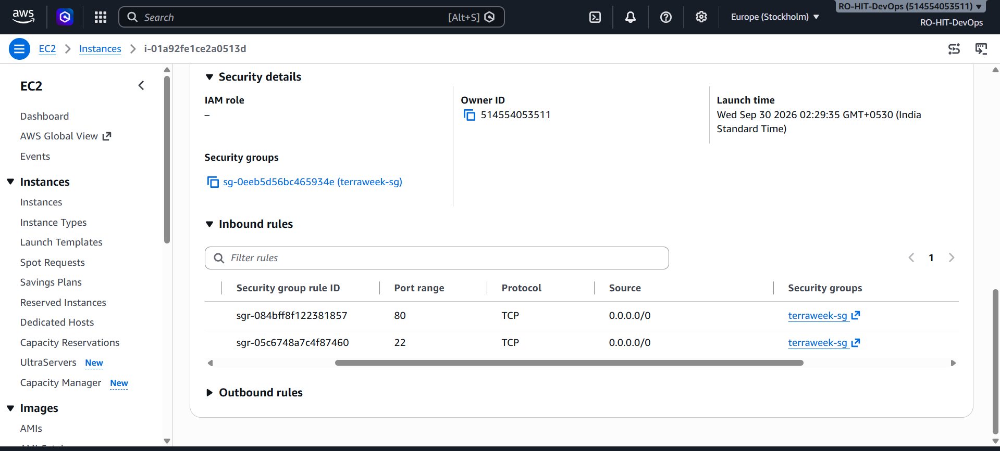

---

# Task 5: Explicit Dependencies with `depends_on`

## What is an explicit dependency?
- Sometimes there is **no reference** between two resources, but I still want one to be created after the other.
- Terraform cannot see that link by itself, so I write it manually with `depends_on`.

## Step 1: Add the S3 bucket with `depends_on`

**Important:** the task text says `depends_on = [aws_instance.main]`, but my instance is named **`server`** (`resource "aws_instance" "server"`). The name must match my own code, so I wrote `aws_instance.server`. Using `main` would give a "Reference to undeclared resource" error.

S3 bucket names must be **unique in the whole world**, so add some random digits.

```hcl
resource "aws_s3_bucket" "logs" {
  bucket = "rohit-tf-day62-logs-58317"

  depends_on = [aws_instance.server]

  tags = {
    Name = "TerraWeek-Logs"
  }
}
```

- The bucket code does not use anything from the instance. That is why Terraform needs `depends_on` here.
- `depends_on` also takes a list, so it needs `[ ]`.
- If you get `BucketAlreadyExists`, change the numbers in the bucket name.

## Step 2: Plan and apply

```bash
terraform plan     # Plan: 1 to add, 0 to change, 0 to destroy.
terraform apply    # type yes
```

Result: `aws_s3_bucket.logs: Creation complete` and `Apply complete! Resources: 1 added`.

**Honest note about "observe the order":** my instance already existed, so only the bucket was created and the order "instance first, bucket second" could not be seen in this apply. The order is visible in two other places:
- in the **dependency graph** (arrow from the bucket to the instance), see below
- in the **destroy output** (Task 6): the bucket is destroyed first, because it depends on the instance

## Step 3: Visualize the dependency graph

```bash
terraform graph
```

Each line `"A" -> "B"` means **A depends on B**.

```
"aws_instance.server" -> "aws_security_group.web";
"aws_instance.server" -> "aws_subnet.public";
"aws_internet_gateway.gw" -> "aws_vpc.main";
"aws_route_table.public" -> "aws_internet_gateway.gw";
"aws_route_table_association.public" -> "aws_route_table.public";
"aws_route_table_association.public" -> "aws_subnet.public";
"aws_s3_bucket.logs" -> "aws_instance.server";
"aws_security_group.web" -> "aws_vpc.main";
"aws_subnet.public" -> "aws_vpc.main";
```

Make a PNG picture (needs Graphviz):

```bash
dot -V                                   # check it is installed
terraform graph | dot -Tpng > graph.png
ls -lh graph.png
file graph.png                           # PNG image data
```

If `dot` is not installed: `sudo apt update && sudo apt install -y graphviz`.
Or copy the text output (from `digraph G {` to the last `}`) and paste it into an online viewer such as **edotor.net** (Graphviz online). That is what I did for the picture below.

How to read the picture (`rankdir = "RL"` means right to left):
- `aws_vpc.main` is the base. Everything depends on it.
- The internet gateway, subnet and security group depend directly on the VPC.
- The route table depends on the internet gateway.
- The association depends on the subnet and the route table.
- The instance depends on the subnet and the security group.
- `aws_s3_bucket.logs -> aws_instance.server` is the **only explicit arrow** (from `depends_on`). All other arrows are implicit (from references).

## Document: When would you use `depends_on` in real projects? (two examples)

Use it only when the dependency is **hidden**, meaning there is no reference in the code that Terraform can follow.

**Example 1: IAM permissions must exist before the server starts using them**
An EC2 instance runs a startup script that reads from S3. The instance only references the IAM instance profile, but the **policy attachment** is a separate resource that the instance never references. If the instance starts before the policy is attached, the script fails with "Access Denied".

```hcl
resource "aws_instance" "app" {
  # ...
  iam_instance_profile = aws_iam_instance_profile.app.name

  depends_on = [aws_iam_role_policy_attachment.app_s3_access]
}
```

**Example 2: The network path must be ready before the server needs the internet**
A private-subnet server downloads packages in its startup script. The instance does not reference the NAT gateway or the private route table, but it needs them working. Without `depends_on`, the instance may boot before the route exists, and the download fails.

```hcl
resource "aws_instance" "worker" {
  # ...
  depends_on = [aws_nat_gateway.main, aws_route.private_to_nat]
}
```

Rule of thumb: prefer real references (implicit dependencies). Use `depends_on` only for these hidden links, and add a comment that explains why.

## Output (screenshots)

S3 block with `depends_on` and start of plan:

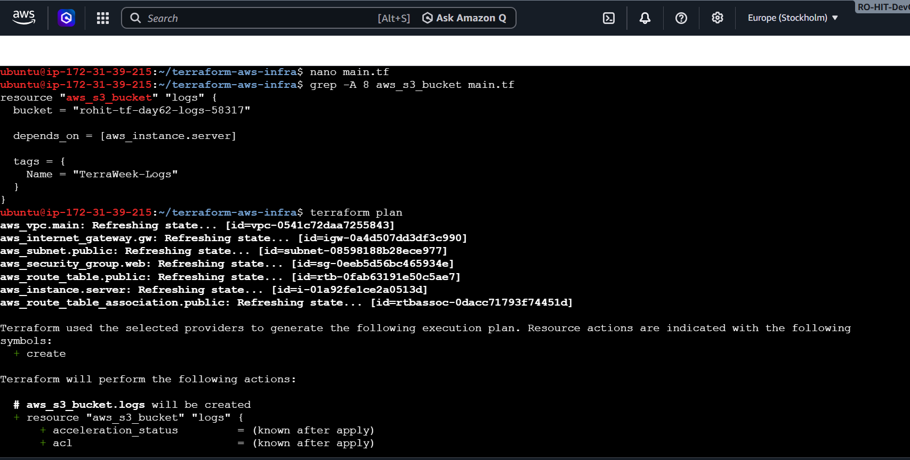

Plan summary (`1 to add`):

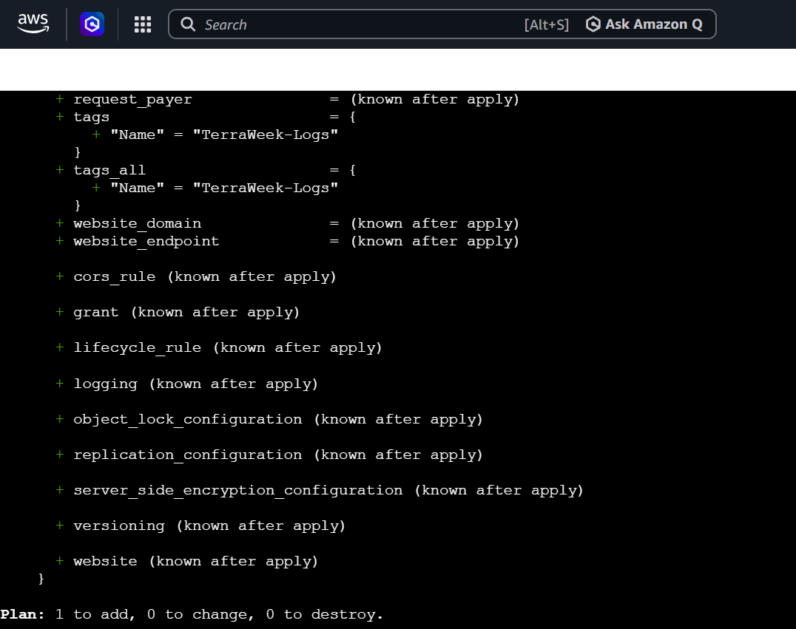

Apply start:

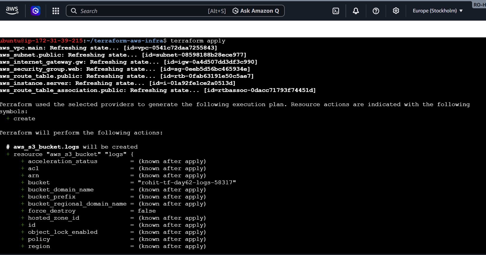

Apply complete (bucket created):

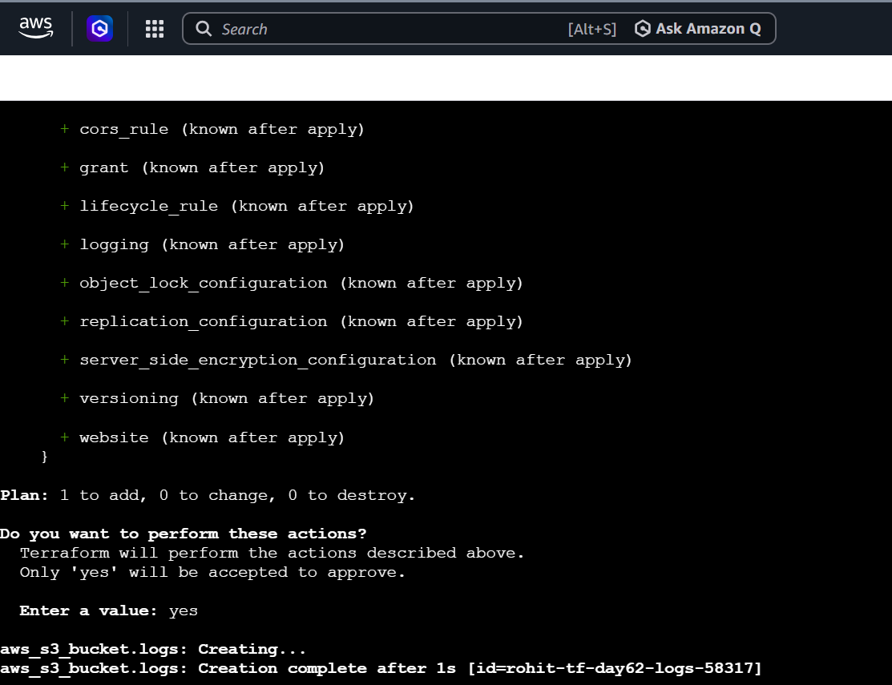

`terraform graph` text output:

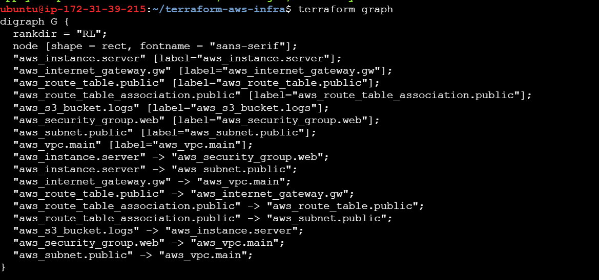

Dependency graph picture (Graphviz online):

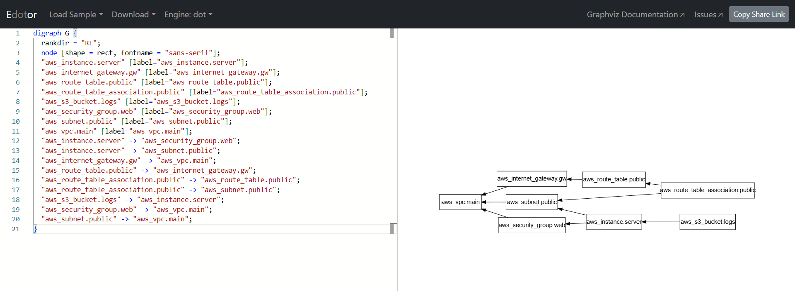

`graph.png` created on the server:

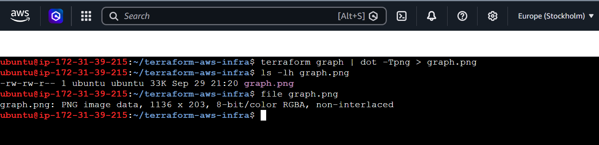

S3 bucket in the console:

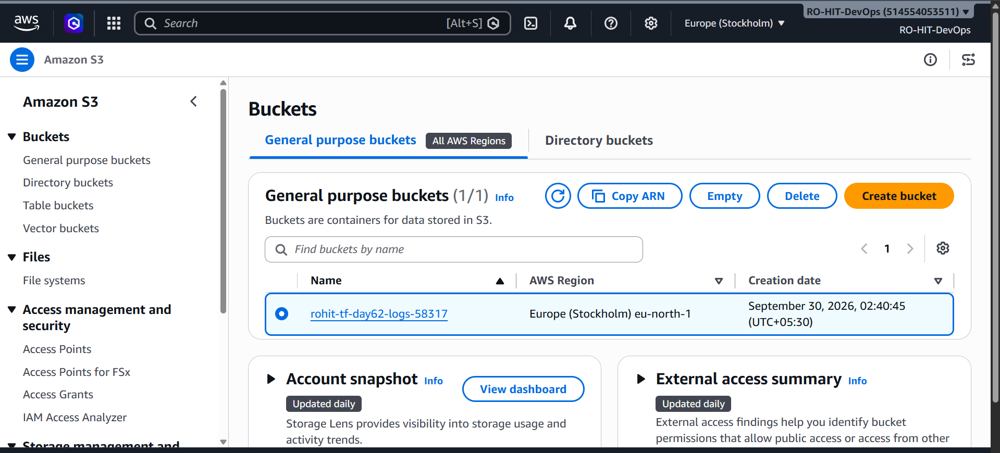

---

# Task 6: Lifecycle Rules and Destroy

## Step 1: Add a `lifecycle` block to the EC2 instance

**What:** Extra rules about how Terraform replaces or deletes a resource.
**Why:** By default, when an instance must be replaced, Terraform **destroys the old one first and then creates the new one**, so the server is down in between. With `create_before_destroy = true`, Terraform **creates the new one first**, then destroys the old one.

The `lifecycle` block must be **inside** the `resource` block, after `tags`:

```hcl
resource "aws_instance" "server" {
  ami                         = "ami-0a902a6ddd733537d"
  instance_type               = "t3.micro"
  subnet_id                   = aws_subnet.public.id
  vpc_security_group_ids      = [aws_security_group.web.id]
  associate_public_ip_address = true

  tags = {
    Name = "TerraWeek-Server"
  }

  lifecycle {
    create_before_destroy = true
  }
}
```

**Common mistake I made:** I pasted the block at the very end of the file, outside any resource. `terraform validate` then gave:

```
Error: Unsupported block type
Blocks of type "lifecycle" are not expected here.
```

Fix: use `cat -n main.tf` to see line numbers, move the block inside the `aws_instance` block, then run `terraform validate` again. Expected: `Success! The configuration is valid.`

## Step 2: Change the AMI and run `terraform plan`

Find a different AMI (Amazon Linux 2023):

```bash
aws ec2 describe-images \
  --region eu-north-1 \
  --owners amazon \
  --filters "Name=name,Values=al2023-ami-2023.*-x86_64" "Name=state,Values=available" \
  --query "sort_by(Images, &CreationDate)[-1].[ImageId,Name,CreationDate]" \
  --output text
```

Result: `ami-086ab3271ce53767d`. Replace the old AMI in `main.tf` (a safe one-line way):

```bash
sed -i 's/ami-0a902a6ddd733537d/ami-086ab3271ce53767d/' main.tf
grep "ami " main.tf
terraform validate
```

Now run **only plan** (do not apply, because we destroy next):

```bash
terraform plan
```

What I saw:
- Legend: `+/- create replacement and then destroy` (this symbol is the effect of `create_before_destroy`; without the lifecycle rule it would say `-/+ destroy and then create replacement`)
- `# aws_instance.server must be replaced`
- `ami = "ami-0a902a6ddd733537d" -> "ami-086ab3271ce53767d" # forces replacement`
- `Plan: 1 to add, 0 to change, 1 to destroy.`

Why replaced? An AMI cannot be changed on a running instance. AWS needs a new instance, so Terraform replaces it.

## Step 3: Destroy everything

**Warning:** `terraform destroy` deletes every resource in this project **permanently**. It only deletes what is in the Terraform state. My older server (not created by this project) is not touched, and my `.tf` files stay on disk.

```bash
terraform destroy
```

Check the list: `Plan: 0 to add, 0 to change, 8 to destroy.` Then type `yes`.

## Step 4: Watch the destroy order

Terraform destroys in **reverse dependency order**. What I saw:

1. `aws_s3_bucket.logs` and `aws_route_table_association.public` (they were created last)
2. `aws_route_table.public`, `aws_instance.server`, `aws_internet_gateway.gw`
3. `aws_subnet.public` and `aws_security_group.web`
4. `aws_vpc.main` (last, because everything else depended on it)

`Destroy complete! Resources: 8 destroyed.`

Why reverse? A thing cannot be deleted while another thing still depends on it. For example, a VPC cannot be deleted while a subnet is still inside it. The instance and internet gateway took about 30 seconds because AWS has to release the public IP first.

## Verify in the AWS console

- S3: the bucket `rohit-tf-day62-logs-58317` gives "can't be found" (shown in the screenshot below)
- VPC -> Your VPCs: `TerraWeek-VPC` is gone (only the default VPC remains)
- EC2 -> Instances: `TerraWeek-Server` shows **Terminated** or is gone
- VPC -> Security groups: `terraweek-sg` is gone

## Document: The three lifecycle arguments

### 1. `create_before_destroy`
- Creates the **new** resource first, then destroys the old one.
- **Use it when:** downtime is a problem, for example replacing a server behind a load balancer, or replacing a TLS certificate that is in use.
- Watch out: the old and new resource exist at the same time for a short while, so names must not clash (for example a fixed security group name).

```hcl
lifecycle {
  create_before_destroy = true
}
```

### 2. `prevent_destroy`
- Makes Terraform **refuse** to destroy the resource. Any plan that would destroy it fails with an error (this includes `terraform destroy`).
- **Use it when:** losing the resource would be a disaster, for example a production database or an S3 bucket with important data.
- To delete it later, remove the setting from the code first.

```hcl
lifecycle {
  prevent_destroy = true
}
```

### 3. `ignore_changes`
- Tells Terraform to **ignore changes** to some arguments, even if they differ from the code.
- **Use it when:** something outside Terraform changes a value on purpose. For example, an auto scaling group changes `desired_capacity`, or another tool adds tags, and I do not want Terraform to undo it every time.

```hcl
lifecycle {
  ignore_changes = [tags, desired_capacity]
}
```

Quick summary:

| Argument | What it does | Typical use |
|---|---|---|
| `create_before_destroy` | New first, then delete old | Avoid downtime |
| `prevent_destroy` | Blocks any destroy | Protect databases / important data |
| `ignore_changes` | Ignores listed changes | Values changed by other tools |

## Output (screenshots)

Plan with `+/- create replacement and then destroy`, `must be replaced` and `forces replacement`:

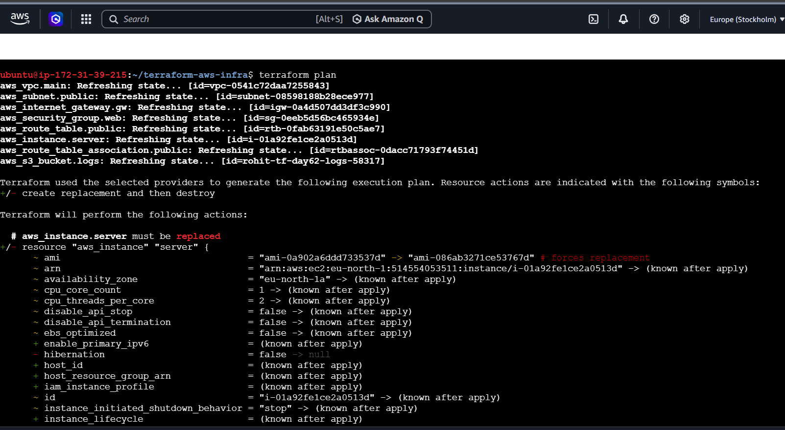

Plan summary (`1 to add, 0 to change, 1 to destroy`):

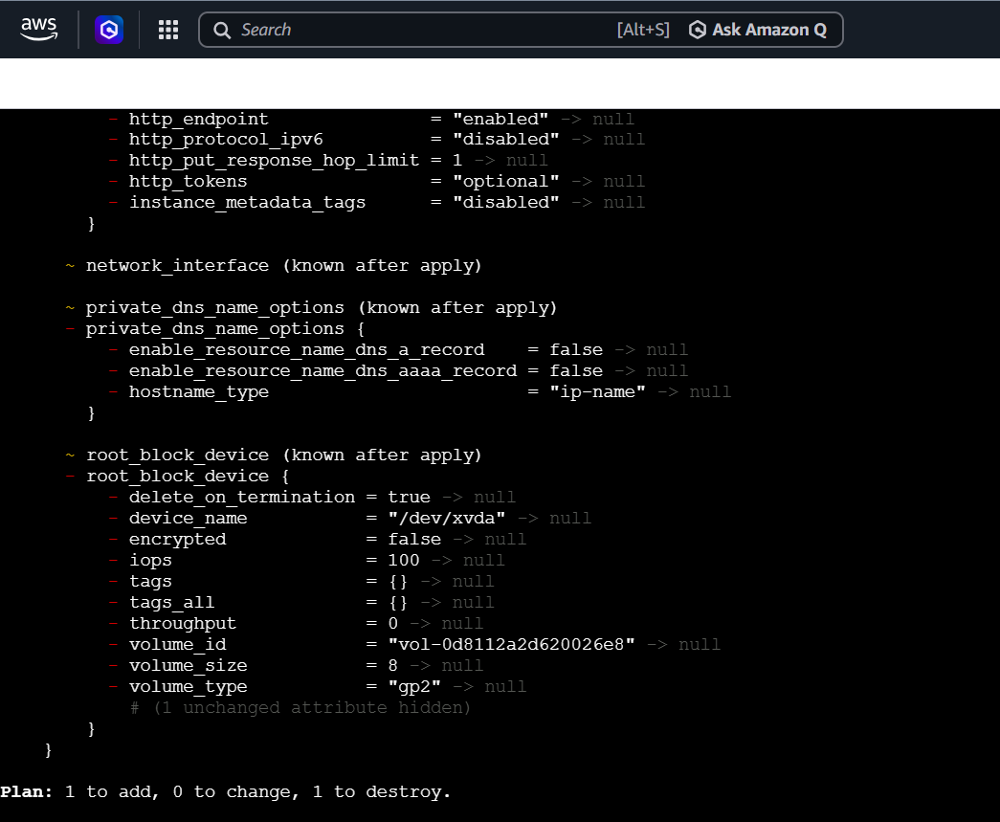

`terraform destroy` start:

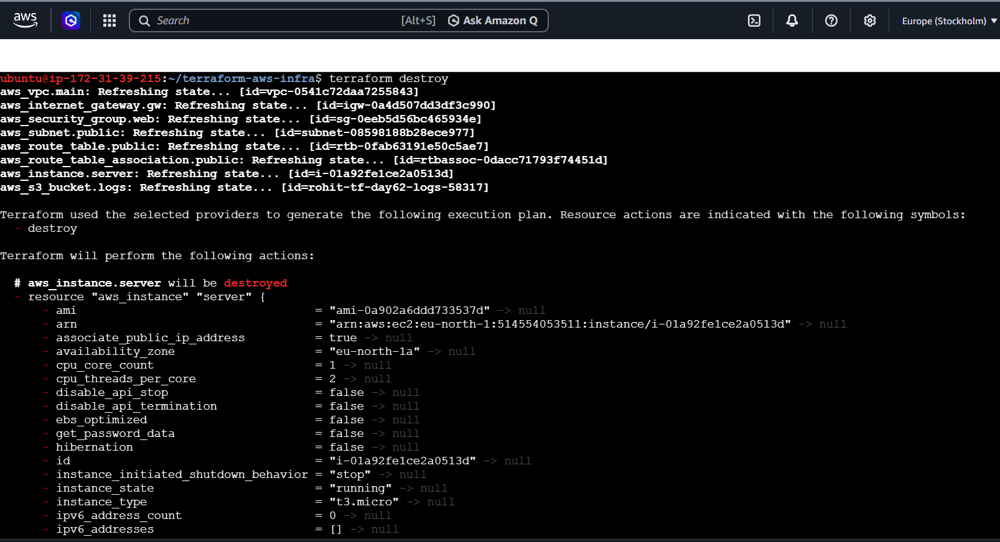

Destroy order and `Destroy complete! Resources: 8 destroyed.`:

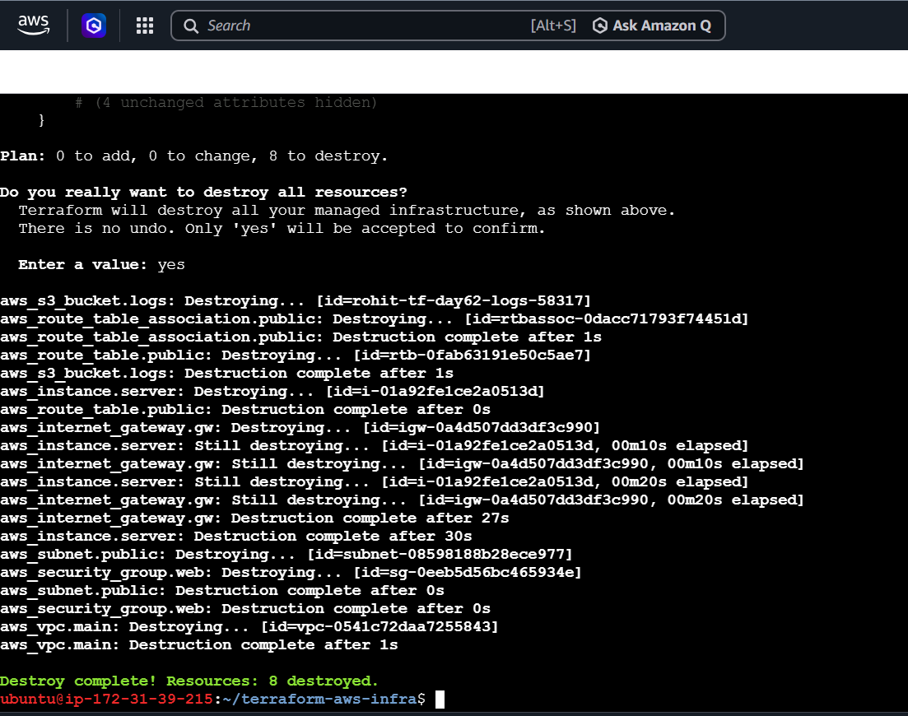

S3 bucket no longer exists in the console:

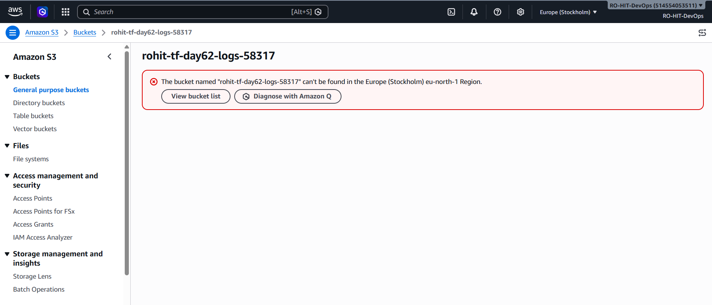

---

# Final code (all files together)

### `providers.tf`

```hcl
terraform {
  required_providers {
    aws = {
      source  = "hashicorp/aws"
      version = "~> 5.0"
    }
  }
}

provider "aws" {
  region = "eu-north-1"
}
```

### `main.tf`

```hcl
resource "aws_vpc" "main" {
  cidr_block = "10.0.0.0/16"

  tags = {
    Name = "TerraWeek-VPC"
  }
}

resource "aws_subnet" "public" {
  vpc_id                  = aws_vpc.main.id
  cidr_block              = "10.0.1.0/24"
  map_public_ip_on_launch = true

  tags = {
    Name = "TerraWeek-Public-Subnet"
  }
}

resource "aws_internet_gateway" "gw" {
  vpc_id = aws_vpc.main.id

  tags = {
    Name = "TerraWeek-IGW"
  }
}

resource "aws_route_table" "public" {
  vpc_id = aws_vpc.main.id

  route {
    cidr_block = "0.0.0.0/0"
    gateway_id = aws_internet_gateway.gw.id
  }

  tags = {
    Name = "TerraWeek-Public-RT"
  }
}

resource "aws_route_table_association" "public" {
  subnet_id      = aws_subnet.public.id
  route_table_id = aws_route_table.public.id
}

resource "aws_security_group" "web" {
  name        = "terraweek-sg"
  description = "Allow SSH and HTTP"
  vpc_id      = aws_vpc.main.id

  ingress {
    description = "SSH"
    from_port   = 22
    to_port     = 22
    protocol    = "tcp"
    cidr_blocks = ["0.0.0.0/0"]
  }

  ingress {
    description = "HTTP"
    from_port   = 80
    to_port     = 80
    protocol    = "tcp"
    cidr_blocks = ["0.0.0.0/0"]
  }

  egress {
    from_port   = 0
    to_port     = 0
    protocol    = "-1"
    cidr_blocks = ["0.0.0.0/0"]
  }

  tags = {
    Name = "TerraWeek-SG"
  }
}

resource "aws_instance" "server" {
  ami                         = "ami-086ab3271ce53767d" # use an AMI from YOUR region
  instance_type               = "t3.micro"
  subnet_id                   = aws_subnet.public.id
  vpc_security_group_ids      = [aws_security_group.web.id]
  associate_public_ip_address = true

  tags = {
    Name = "TerraWeek-Server"
  }

  lifecycle {
    create_before_destroy = true
  }
}

resource "aws_s3_bucket" "logs" {
  bucket = "your-unique-bucket-name-12345" # must be globally unique

  depends_on = [aws_instance.server]

  tags = {
    Name = "TerraWeek-Logs"
  }
}
```

---

# Commands used today (cheat sheet)

| Command | What it does |
|---|---|
| `terraform init` | Downloads the provider and creates the lock file |
| `terraform validate` | Checks the syntax of the `.tf` files |
| `terraform plan` | Shows what Terraform will do (changes nothing) |
| `terraform apply` | Creates or changes the real resources |
| `terraform graph` | Prints the dependency graph in DOT format |
| `terraform destroy` | Deletes everything in the state |
| `dot -Tpng` | Turns DOT text into a PNG picture (Graphviz) |
| `aws ec2 describe-images` | Finds AMI IDs for a region |
| `aws ec2 describe-instance-type-offerings` | Checks which instance types exist in a region |
| `aws ec2 describe-instances` | Shows instance details such as the public IP |
| `nc -zv <ip> 22` | Tests if a TCP port is open |

# Key learnings

- A **provider** is the plugin that lets Terraform talk to AWS. Pin its version with `~> 5.0`.
- The **lock file** makes sure everyone uses the same provider version. Commit it to Git.
- **Implicit dependency** = a reference like `aws_vpc.main.id`. Terraform finds it automatically and builds things in the right order.
- **Explicit dependency** = `depends_on`. Use it only when the link is hidden.
- Create order follows dependencies. **Destroy order is the reverse.**
- `terraform plan` before `apply` catches mistakes early. Always read the `Plan: X to add, Y to change, Z to destroy` line.
- Lifecycle rules control how a resource is replaced (`create_before_destroy`), protected (`prevent_destroy`) or ignored (`ignore_changes`).
- Clean up with `terraform destroy` so AWS does not keep charging for resources I no longer need.

# Try it yourself (practice ideas)

1. Change the subnet CIDR to `10.0.2.0/24` and run `terraform plan`. Which resources are replaced? Why?
2. Remove the `depends_on` from the S3 bucket and run `terraform graph`. What arrow disappears?
3. Add `prevent_destroy = true` to the S3 bucket and run `terraform destroy`. Read the error.
4. Restrict SSH in the security group to your own IP only.
5. Add a second subnet in another availability zone and connect it to the same route table.
