# Day 63 - Variables, Outputs, Data Sources and Expressions

> **Goal of the day:** Turn a Terraform config that has many hardcoded values into a **dynamic, reusable, environment-aware** config.
>
> This guide is written so that **anyone can follow it from zero** and practice it, even if they have never seen the Day 62 or Day 63 task before. Every task has: *what it is, why we do it, the exact commands, the code, how to read the output, and a screenshot as proof.*

---

## Table of Contents

1. [What you will learn](#what-you-will-learn)
2. [Before you start (prerequisites)](#before-you-start-prerequisites)
3. [Project folder and path](#project-folder-and-path)
4. [Starting point: the Day 62 config](#starting-point-the-day-62-config)
5. [Task 1: Extract variables](#task-1-extract-variables)
6. [Task 2: Variable files and precedence](#task-2-variable-files-and-precedence)
7. [Task 3: Add outputs](#task-3-add-outputs)
8. [Task 4: Use data sources](#task-4-use-data-sources)
9. [Task 5: Use locals for dynamic values](#task-5-use-locals-for-dynamic-values)
10. [Task 6: Built-in functions and conditional expressions](#task-6-built-in-functions-and-conditional-expressions)
11. [Cleanup: terraform destroy](#cleanup-terraform-destroy)
12. [Final code of every file](#final-code-of-every-file)
13. [Problems I faced and how I fixed them](#problems-i-faced-and-how-i-fixed-them)
14. [Quick cheat sheet](#quick-cheat-sheet)
15. [Key takeaways](#key-takeaways)

---

## What you will learn

| Topic | In simple words |
|---|---|
| **Variables** | Empty slots in your code. You fill the value from outside, so you never edit the code to change a value. |
| **`.tfvars` files** | Files that hold the values for the variables. One file per environment (dev, prod). |
| **Precedence** | If a variable gets a value from many places, which one wins? |
| **Outputs** | Useful information Terraform prints after `apply` (IDs, IP address, DNS). |
| **Data sources** | Read information that already exists in AWS (like the latest AMI), without creating anything. |
| **Locals** | Named values inside the config, so you write a long expression only once. |
| **Functions and conditionals** | Small tools to change text, lists, maps, and to make decisions (`if prod then big else small`). |

---

## Before you start (prerequisites)

- An **AWS account** and a Linux machine (I used an Ubuntu EC2 machine) with:
  - **Terraform** installed (`terraform -version` should work)
  - **AWS credentials** configured (`aws configure` or an IAM role on the machine)
- Basic Terraform knowledge from Day 62: `init`, `plan`, `apply`, `destroy`, and what a `resource` is.
- My AWS region is **eu-north-1 (Stockholm)**. If you use another region, change the default of the `region` variable.

> **Cost warning:** Task 3 onward creates real AWS resources (an EC2 instance and an S3 bucket). They cost a little money. Always run `terraform destroy` when you finish (see the [Cleanup](#cleanup-terraform-destroy) section).

---

## Project folder and path

All work is done inside one folder. Mine is:

```
~/terraform-aws-infra
```

Go to it with:

```bash
cd ~/terraform-aws-infra
ls
```

At the end of the day the folder has these files:

```
terraform-aws-infra/
├── providers.tf        # AWS provider and region
├── variables.tf        # all input variables            (Task 1)
├── terraform.tfvars    # values for dev (auto-loaded)    (Task 2)
├── prod.tfvars         # values for prod (manual)        (Task 2)
├── outputs.tf          # outputs printed after apply     (Task 3)
├── data.tf             # data sources: AMI and AZs       (Task 4)
├── locals.tf           # name_prefix and common_tags     (Task 5)
└── main.tf             # all the resources
```

> **Good to know:** Terraform reads **every `.tf` file** in the folder together. The file names are only for humans. Splitting the code into `variables.tf`, `outputs.tf`, etc. just keeps it tidy.

---

## Starting point: the Day 62 config

My Day 62 config created this infrastructure:

`VPC` -> `Public Subnet` -> `Internet Gateway` -> `Route Table` -> `Route Table Association` -> `Security Group` -> `EC2 instance` -> `S3 bucket`

The problem: **every value was typed directly in the code (hardcoded)**. Example:

```hcl
resource "aws_vpc" "main" {
  cidr_block = "10.0.0.0/16"          # hardcoded

  tags = {
    Name = "TerraWeek-VPC"            # hardcoded
  }
}

resource "aws_instance" "server" {
  ami           = "ami-086ab3271ce53767d"   # hardcoded, only valid in ONE region
  instance_type = "t3.micro"                # hardcoded
}
```

Why this is bad:

- Change the region and the AMI ID no longer exists, so everything breaks.
- To make a "prod" copy you must copy the whole code and edit it by hand.
- The same name is typed in many places, so it is easy to make a mistake.

Today we fix all of this in six tasks.

Your `providers.tf` from Day 62 looks like this (the region is hardcoded on the last-but-one line; we fix that in Task 1):

```hcl
terraform {
  required_providers {
    aws = {
      source  = "hashicorp/aws"
      version = "~> 5.0"
    }
  }
}

provider "aws" {
  region = "eu-north-1"
}
```

---

## Task 1: Extract variables

### What is a variable?

A **variable** is an empty slot in your code. Instead of writing `"10.0.0.0/16"` inside the resource, you write `var.vpc_cidr`, and you give the value from outside.

### Why do we do it?

- Change a value in **one place** and it changes everywhere.
- Reuse the same code for dev, test and prod, only the values change.

### What we build

Create `variables.tf` with **8 variables**:

| Variable | Type | Default | Meaning |
|---|---|---|---|
| `region` | string | `eu-north-1` | AWS region |
| `vpc_cidr` | string | `10.0.0.0/16` | IP range of the VPC |
| `subnet_cidr` | string | `10.0.1.0/24` | IP range of the subnet |
| `instance_type` | string | `t3.micro` | EC2 size |
| `project_name` | string | **none** | Forces the user to give a value |
| `environment` | string | `dev` | dev / staging / prod |
| `allowed_ports` | list(number) | `[22, 80, 443]` | Ports opened in the security group |
| `extra_tags` | map(string) | `{}` | Any extra tags |

> **Note about `instance_type`:** the task says `t2.micro`. I used `t3.micro` because `t2` instances are not available in the Stockholm region (`eu-north-1`). Use whatever works in your region.

### Step 1: Create `variables.tf`

```bash
nano variables.tf
```

Paste this, then save with `Ctrl + O`, `Enter`, `Ctrl + X`:

```hcl
variable "region" {
  description = "AWS region"
  type        = string
  default     = "eu-north-1"
}

variable "vpc_cidr" {
  description = "CIDR block for the VPC"
  type        = string
  default     = "10.0.0.0/16"
}

variable "subnet_cidr" {
  description = "CIDR block for the public subnet"
  type        = string
  default     = "10.0.1.0/24"
}

variable "instance_type" {
  description = "EC2 instance type"
  type        = string
  default     = "t3.micro"
}

variable "project_name" {
  description = "Name of the project (no default, must be provided)"
  type        = string
}

variable "environment" {
  description = "Environment name"
  type        = string
  default     = "dev"
}

variable "allowed_ports" {
  description = "List of ports allowed in the security group"
  type        = list(number)
  default     = [22, 80, 443]
}

variable "extra_tags" {
  description = "Extra tags to add to resources"
  type        = map(string)
  default     = {}
}
```

**How to read a variable block**

- `variable "region"` is the name. You use it later as `var.region`.
- `description` is a note for humans.
- `type` limits what kind of value is allowed.
- `default` is the value used when nobody gives one. **`project_name` has no default**, so Terraform will ask for it.

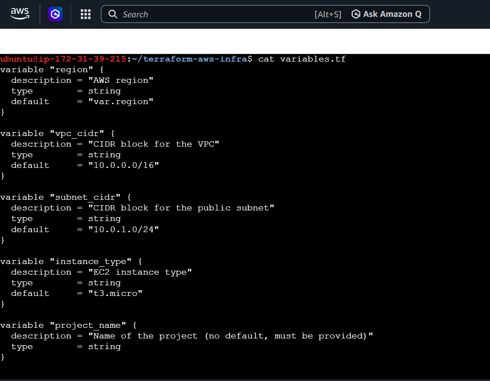
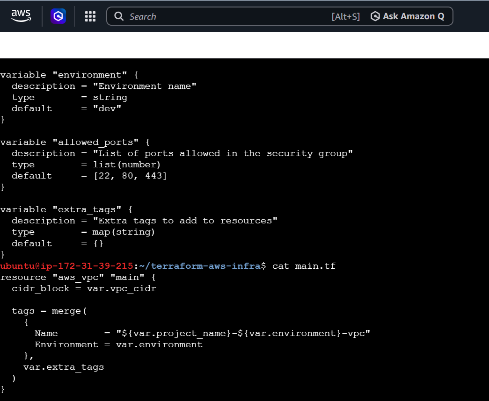

### Step 2: Use the region variable in `providers.tf`

Open `providers.tf` and change the region line so it uses the variable.

```bash
nano providers.tf
```

```hcl
provider "aws" {
  region = var.region
}
```

> **Very important:** `var.region` has **no quotes**. If you write `"var.region"` with quotes, Terraform treats it as plain text and fails with `invalid AWS Region: var.region`. (This exact mistake happened to me, see [Problems I faced](#problems-i-faced-and-how-i-fixed-them).)

To change it in one command and check it:

```bash
sed -i 's/region = "eu-north-1"/region = var.region/' providers.tf
grep -n "region" providers.tf
```

You should see `region = var.region`.

### Step 3: Replace hardcoded values in `main.tf`

Replace every hardcoded value with `var.<name>`.

Use this version of `main.tf`. Notes before you paste:

- Replace `ami-xxxxxxxxxxxxxxxxx` with the AMI ID from your Day 62 config (we remove it completely in Task 4).
- The S3 bucket name must be **globally unique** in all of AWS. Change `58317` to your own random number.

```bash
cat > main.tf << 'EOF'
resource "aws_vpc" "main" {
  cidr_block = var.vpc_cidr

  tags = merge(
    {
      Name        = "${var.project_name}-${var.environment}-vpc"
      Environment = var.environment
    },
    var.extra_tags
  )
}

resource "aws_subnet" "public" {
  vpc_id                  = aws_vpc.main.id
  cidr_block              = var.subnet_cidr
  map_public_ip_on_launch = true

  tags = merge(
    {
      Name        = "${var.project_name}-${var.environment}-public-subnet"
      Environment = var.environment
    },
    var.extra_tags
  )
}

resource "aws_internet_gateway" "gw" {
  vpc_id = aws_vpc.main.id

  tags = merge(
    {
      Name        = "${var.project_name}-${var.environment}-igw"
      Environment = var.environment
    },
    var.extra_tags
  )
}

resource "aws_route_table" "public" {
  vpc_id = aws_vpc.main.id

  route {
    cidr_block = "0.0.0.0/0"
    gateway_id = aws_internet_gateway.gw.id
  }

  tags = merge(
    {
      Name        = "${var.project_name}-${var.environment}-public-rt"
      Environment = var.environment
    },
    var.extra_tags
  )
}

resource "aws_route_table_association" "public" {
  subnet_id      = aws_subnet.public.id
  route_table_id = aws_route_table.public.id
}

resource "aws_security_group" "web" {
  name        = "${var.project_name}-${var.environment}-sg"
  description = "Allow inbound traffic on allowed ports"
  vpc_id      = aws_vpc.main.id

  dynamic "ingress" {
    for_each = var.allowed_ports
    content {
      description = "Allow port ${ingress.value}"
      from_port   = ingress.value
      to_port     = ingress.value
      protocol    = "tcp"
      cidr_blocks = ["0.0.0.0/0"]
    }
  }

  egress {
    from_port   = 0
    to_port     = 0
    protocol    = "-1"
    cidr_blocks = ["0.0.0.0/0"]
  }

  tags = merge(
    {
      Name        = "${var.project_name}-${var.environment}-sg"
      Environment = var.environment
    },
    var.extra_tags
  )
}

resource "aws_instance" "server" {
  ami                         = "ami-xxxxxxxxxxxxxxxxx"
  instance_type               = var.instance_type
  subnet_id                   = aws_subnet.public.id
  vpc_security_group_ids      = [aws_security_group.web.id]
  associate_public_ip_address = true

  tags = merge(
    {
      Name        = "${var.project_name}-${var.environment}-server"
      Environment = var.environment
    },
    var.extra_tags
  )

  lifecycle {
    create_before_destroy = true
  }
}

resource "aws_s3_bucket" "logs" {
  bucket = "${var.project_name}-${var.environment}-logs-58317"

  depends_on = [aws_instance.server]

  tags = merge(
    {
      Name        = "${var.project_name}-${var.environment}-logs"
      Environment = var.environment
    },
    var.extra_tags
  )
}
EOF
```

> **Tip for pasting:** the last line `EOF` must start at the **very left** with no spaces. If there are spaces before it, the terminal keeps waiting (you will see a `>` prompt). Press `Ctrl + C` and paste again.

**New things in this code (explained simply)**

| Code | Meaning |
|---|---|
| `var.vpc_cidr` | Use the value of the variable `vpc_cidr` |
| `"${var.project_name}-${var.environment}-vpc"` | Join text and variables, e.g. `terraweek-dev-vpc`. `${ }` puts a value inside text. |
| `merge(map1, map2)` | Combines two maps into one. Used to add `extra_tags` to the normal tags. |
| `dynamic "ingress"` + `for_each` | Creates **one ingress rule for each item** in a list. With `[22, 80, 443]` we get 3 rules without writing 3 blocks. |
| `ingress.value` | The current item (the current port) inside the loop |

### Step 4: Format, validate, and plan

```bash
terraform init      # only needed if you did not run it before
terraform fmt       # fixes spacing and indentation
terraform validate  # checks the code is correct
terraform plan      # shows what will happen
```

Because `project_name` has no default, **Terraform asks for it**:

```
var.project_name
  Name of the project (no default, must be provided)

  Enter a value: terraweek
```

Type `terraweek` and press Enter.

**Expected result:** `Plan: 8 to add, 0 to change, 0 to destroy.`

8 resources = VPC, subnet, internet gateway, route table, route table association, security group, EC2 instance, S3 bucket.

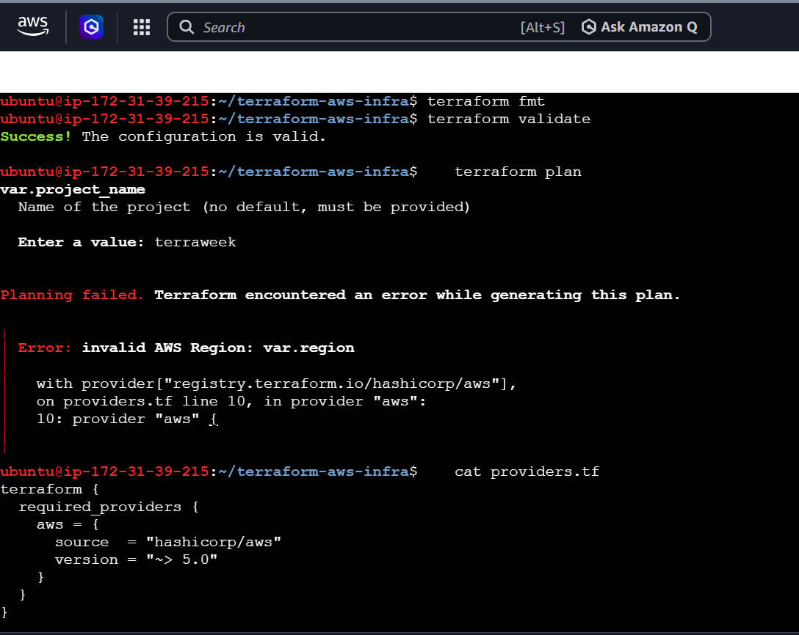
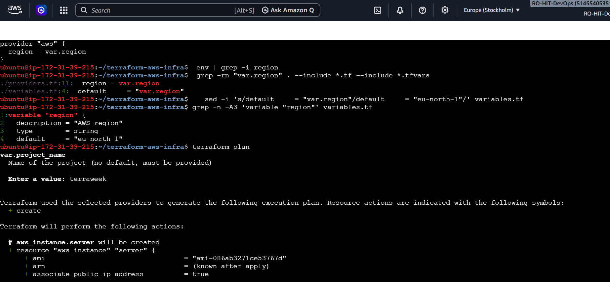
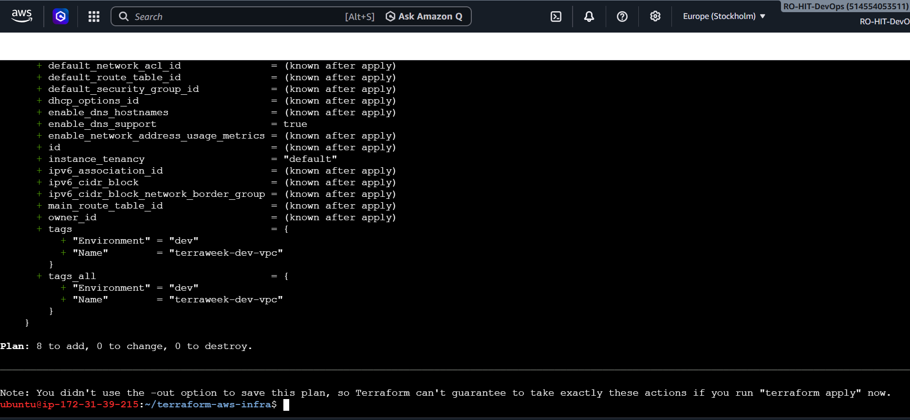

### Documentation: the five variable types in Terraform

| Type | What it stores | Example |
|---|---|---|
| `string` | Text | `"t3.micro"` |
| `number` | A number | `22` |
| `bool` | `true` or `false` | `true` |
| `list` | An ordered list of values | `[22, 80, 443]` |
| `map` | Key-value pairs | `{ Team = "devops", Owner = "rohit" }` |

In this project, `allowed_ports` is a **`list(number)`** and `extra_tags` is a **`map(string)`**.

> Terraform also has `set`, `object` and `tuple`, but the five above are the basic ones to learn first.

---

## Task 2: Variable files and precedence

### What is a `.tfvars` file?

A `.tfvars` file is a simple file that only contains `name = value` lines. It gives values to the variables. There is **no `variable` block** inside it.

### Why do we do it?

- You do not type values at the prompt every time.
- You keep **one file per environment**: `terraform.tfvars` for dev, `prod.tfvars` for prod. The code stays the same.

### Step 1: Create `terraform.tfvars` (dev values)

This file is **loaded automatically** by Terraform because of its special name.

```bash
cat > terraform.tfvars << 'EOF'
project_name  = "terraweek"
environment   = "dev"
instance_type = "t3.micro"
EOF
```

### Step 2: Create `prod.tfvars` (prod values)

This file is **not loaded automatically**. You must ask for it with `-var-file`.

```bash
cat > prod.tfvars << 'EOF'
project_name  = "terraweek"
environment   = "prod"
instance_type = "t3.small"
vpc_cidr      = "10.1.0.0/16"
subnet_cidr   = "10.1.1.0/24"
EOF
```

Check both files:

```bash
cat terraform.tfvars
cat prod.tfvars
```

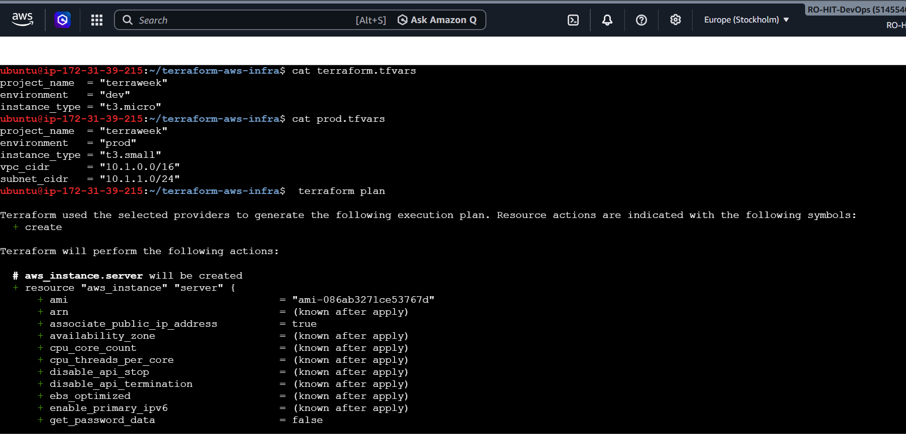

### Step 3: Plan with the default file

```bash
terraform plan
```

What to notice:

- **No prompt** for `project_name`, because `terraform.tfvars` already has it.
- Names look like `terraweek-dev-...`.
- `vpc_cidr` and `subnet_cidr` are not in `terraform.tfvars`, so the **defaults from `variables.tf`** are used (`10.0.0.0/16` and `10.0.1.0/24`).

A shorter view of the important lines:

```bash
terraform plan | grep -E "instance_type|Name|cidr_block|Plan:"
```

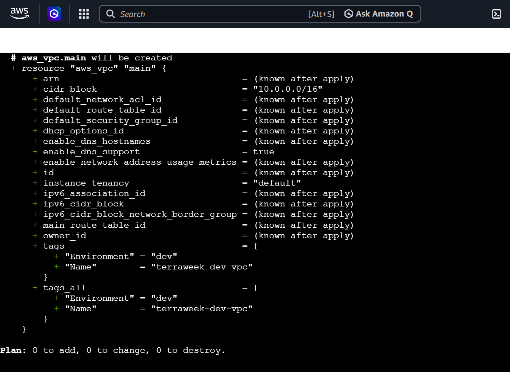
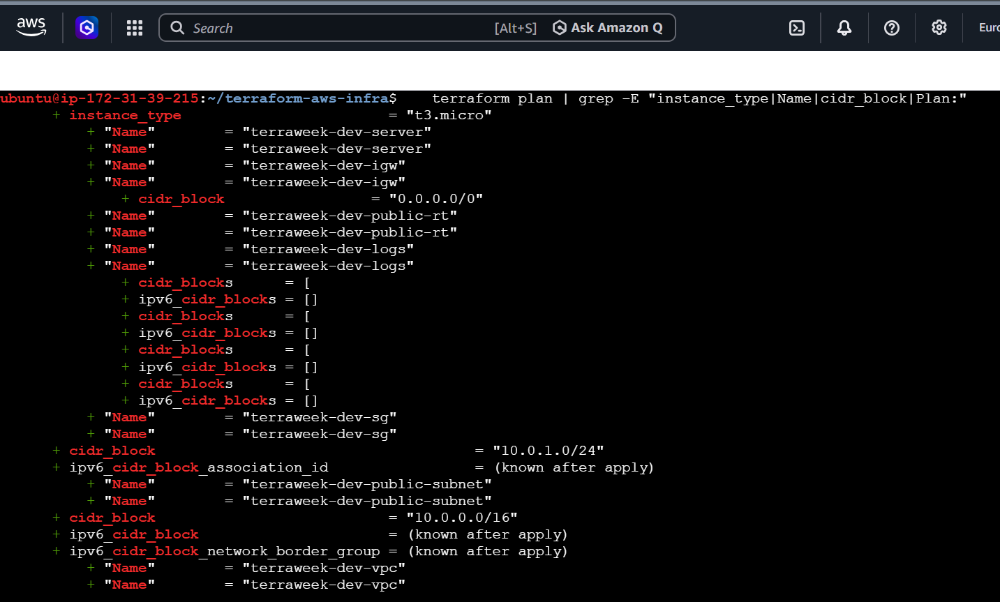

### Step 4: Plan with the prod file

```bash
terraform plan -var-file="prod.tfvars" | grep -E "instance_type|Name|cidr_block |Plan:"
```

What changed compared to dev:

- `instance_type` is now `t3.small`
- names are `terraweek-prod-...`
- CIDR blocks are `10.1.0.0/16` and `10.1.1.0/24`

Same code, different environment.

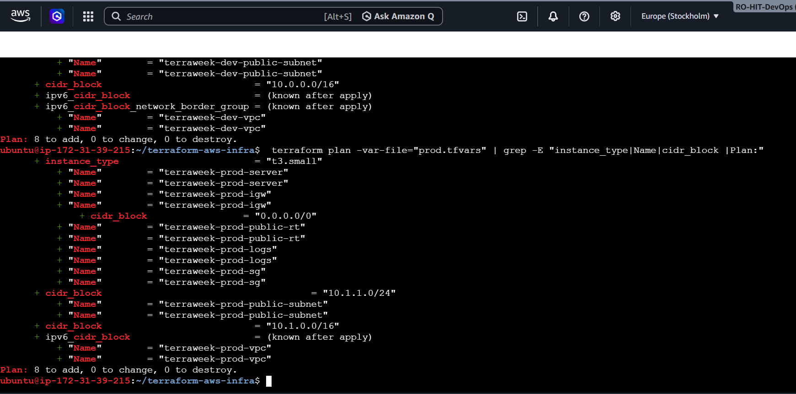

### Step 5: Override from the command line (`-var`)

```bash
terraform plan -var="instance_type=t3.nano" | grep -E "instance_type|Plan:"
```

`instance_type` becomes `t3.nano`, even though `terraform.tfvars` says `t3.micro`. **The command line wins.**

### Step 6: Set an environment variable (`TF_VAR_...`)

```bash
export TF_VAR_environment="staging"
terraform plan | grep -E "Name|Plan:" | head -5
unset TF_VAR_environment      # remove it when you are done!
```

The names still show `dev`, because `terraform.tfvars` has a **higher priority** than an environment variable.

> Always run `unset TF_VAR_environment` afterwards. If you forget, the variable stays active in that terminal and confuses your next commands.

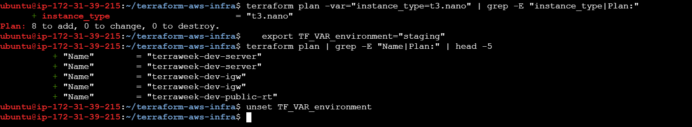

### Documentation: variable precedence (lowest to highest priority)

If the same variable is given a value in several places, **the highest priority wins**.

| Priority | Source |
|---|---|
| 1 (lowest) | `default` value in `variables.tf` |
| 2 | Environment variables (`TF_VAR_name`) |
| 3 | `terraform.tfvars` |
| 4 | `terraform.tfvars.json` |
| 5 | `*.auto.tfvars` and `*.auto.tfvars.json` files |
| 6 (highest) | `-var` and `-var-file` on the command line |

Easy way to remember: **the more manual and specific the source, the higher its priority.**

---

## Task 3: Add outputs

### What is an output?

An **output** is information that Terraform prints after `apply`. A variable is an input (value goes **in**), an output is the opposite (value comes **out**).

### Why do we do it?

- You do not need to search the AWS console for the VPC ID or the public IP.
- You need the public IP to connect with SSH.
- Other tools and scripts can read these values.

### Step 1: Create `outputs.tf`

```bash
cat > outputs.tf << 'EOF'
output "vpc_id" {
  description = "The VPC ID"
  value       = aws_vpc.main.id
}

output "subnet_id" {
  description = "The public subnet ID"
  value       = aws_subnet.public.id
}

output "instance_id" {
  description = "The EC2 instance ID"
  value       = aws_instance.server.id
}

output "instance_public_ip" {
  description = "The public IP of the EC2 instance"
  value       = aws_instance.server.public_ip
}

output "instance_public_dns" {
  description = "The public DNS name of the EC2 instance"
  value       = aws_instance.server.public_dns
}

output "security_group_id" {
  description = "The security group ID"
  value       = aws_security_group.web.id
}
EOF
```

**How an output value is written:** `resource_type.resource_name.attribute`, for example `aws_instance.server.public_ip`. The value has no quotes.

Check it:

```bash
terraform fmt
terraform validate
```

<!-- Add this screenshot file, then remove the comment marks around the next line:

-->

### Step 2: Plan

```bash
terraform plan
```

At the bottom you will see `Changes to Outputs:` with all 6 outputs showing `(known after apply)`. This is normal: IDs and IPs exist only after the resources are created.

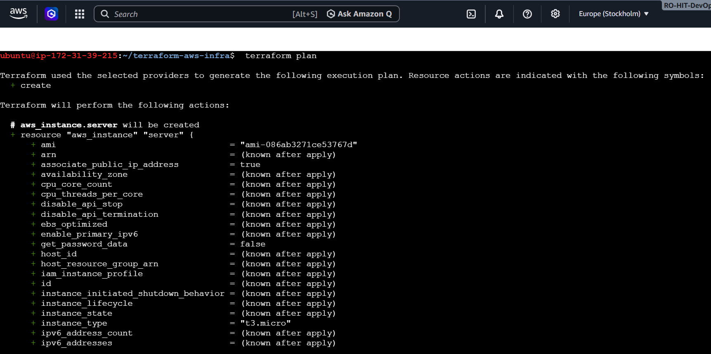
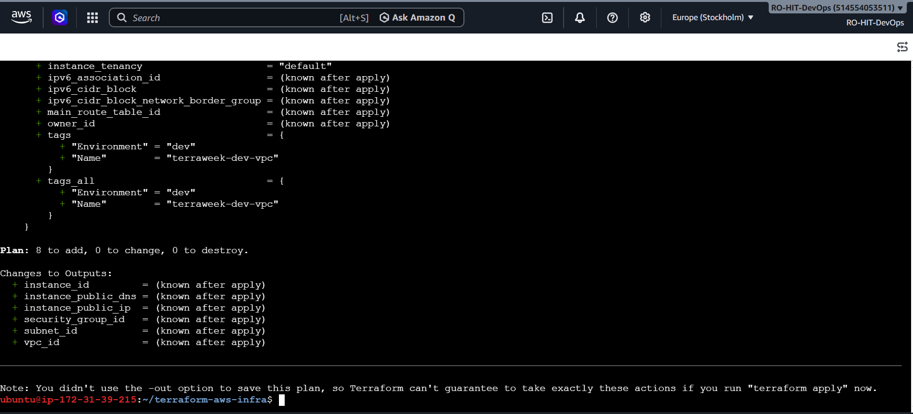

### Step 3: Apply

```bash
terraform apply
```

Type `yes` when asked. At the end you will see:

```
Apply complete! Resources: 8 added, 0 changed, 0 destroyed.

Outputs:

instance_id = "i-081d42a10f0def65a"
instance_public_dns = ""
instance_public_ip = "13.49.46.231"
security_group_id = "sg-0cf8b19ade770c2b3"
subnet_id = "subnet-0b227d9152a9d6b12"
vpc_id = "vpc-0976084118946483c"
```

(Your IDs and IP will be different.)

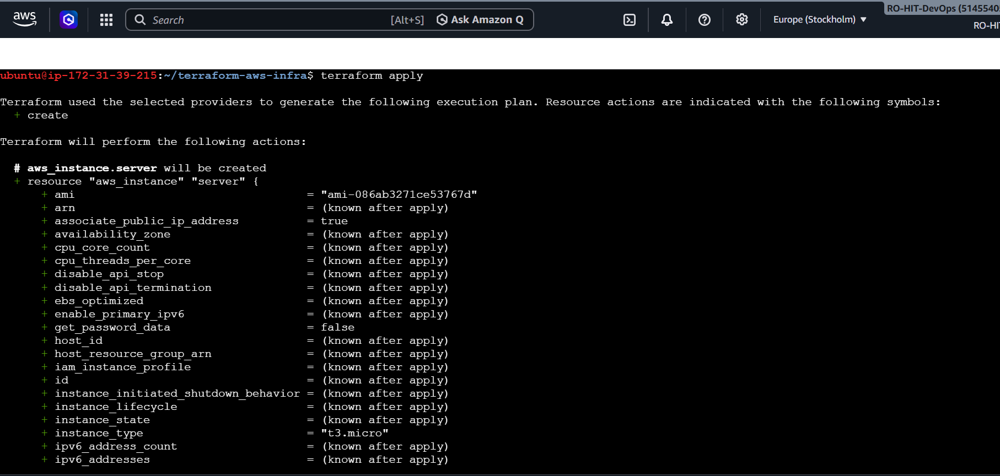
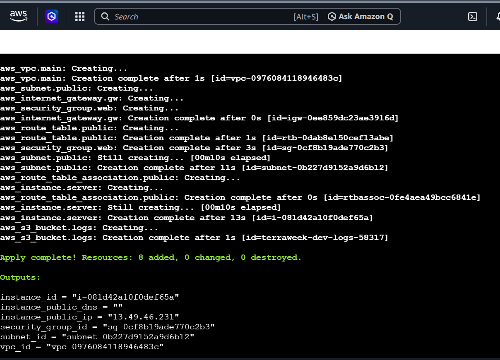

### Step 4: Read outputs any time

```bash
terraform output                          # show all outputs
terraform output instance_public_ip       # show one output
terraform output -json                    # JSON format, good for scripts
terraform output -raw instance_public_ip  # plain text without quotes
```

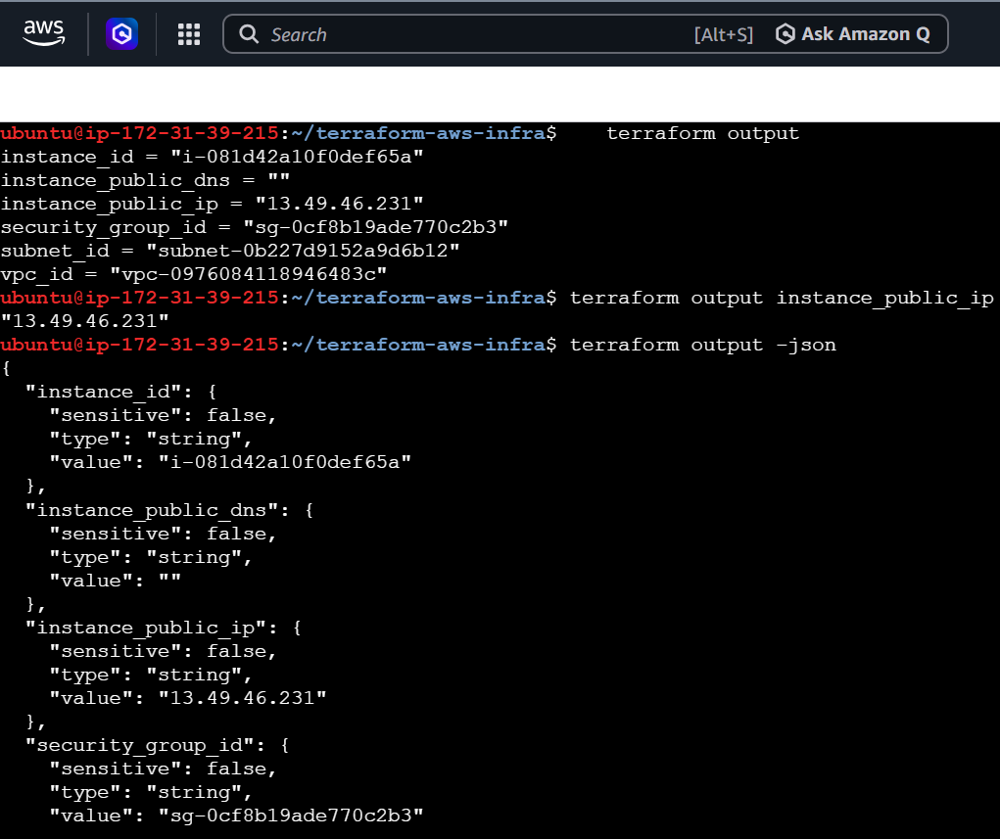

### Step 5: Verify in the AWS console

**Question from the task:** *Does `terraform output instance_public_ip` return the correct IP?*

Open **EC2 -> Instances** and check the instance. The **Public IPv4 address** in the console matches the output. Also compare the VPC ID, security group ID and instance ID.

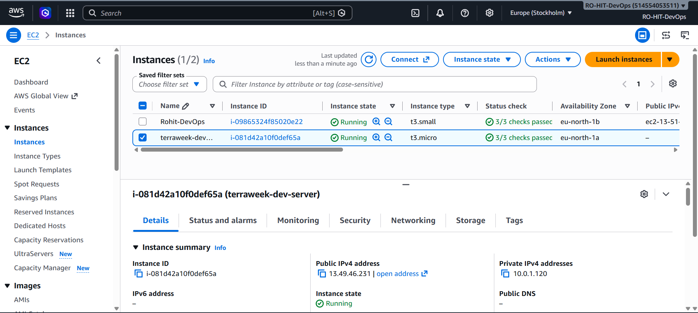
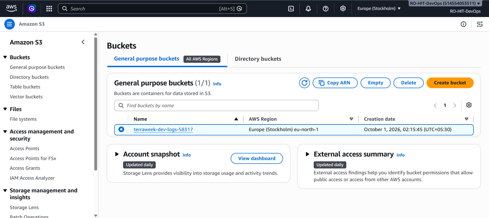
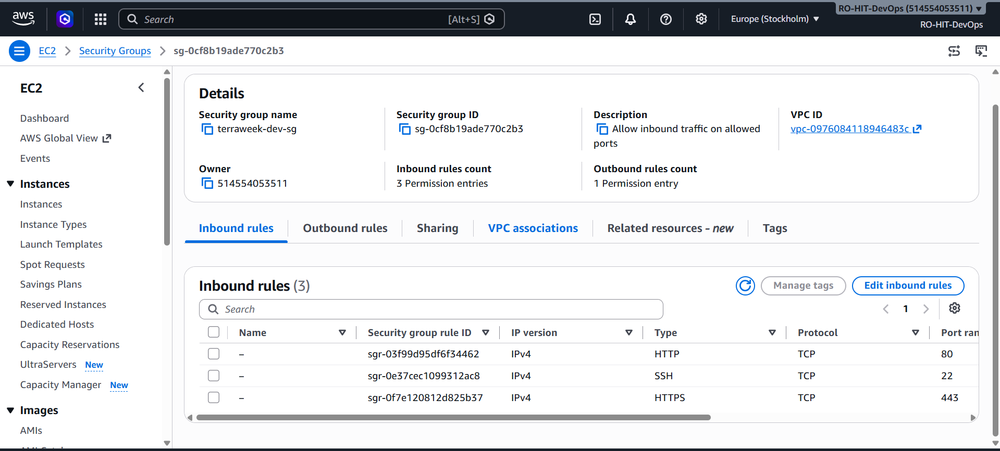
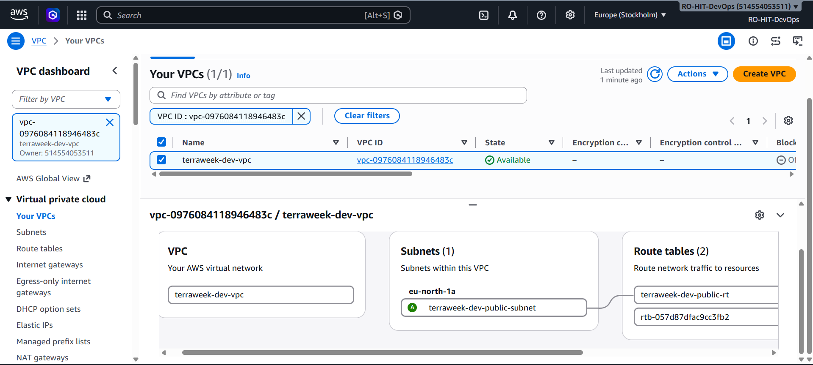

### Step 6: Fix the empty `instance_public_dns`

Notice that `instance_public_dns` was **empty** (`""`). This is not a Terraform bug. A VPC that you create yourself has **DNS hostnames turned off** by default, so EC2 gets no public DNS name.

**Fix:** add one line to the VPC in `main.tf`:

```hcl
resource "aws_vpc" "main" {
  cidr_block           = var.vpc_cidr
  enable_dns_hostnames = true
  # ... tags stay the same
}
```

Then:

```bash
terraform fmt
terraform apply
```

The plan shows `aws_vpc.main will be updated in-place` and `enable_dns_hostnames = false -> true`, with `Plan: 0 to add, 1 to change, 0 to destroy.` This only changes the VPC setting. Nothing is destroyed.

The output may still show `""` because Terraform read the instance before the VPC changed. Refresh the saved values without touching any real resource:

```bash
terraform apply -refresh-only        # type yes
terraform output instance_public_dns
```

Now you get a name like `ec2-13-49-46-231.eu-north-1.compute.amazonaws.com`.

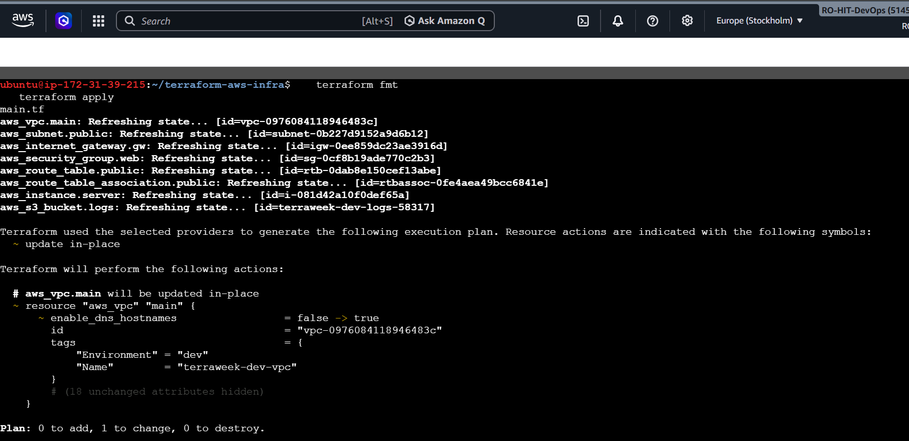
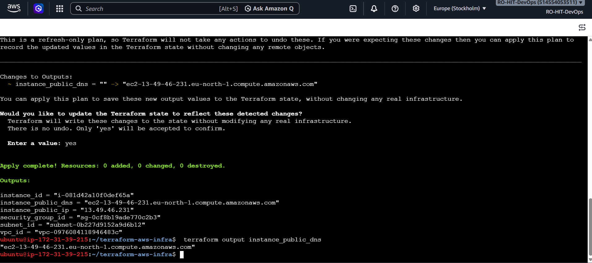

---

## Task 4: Use data sources

### What is a data source?

A **data source** *reads* something that **already exists** in AWS. It does not create, change or delete anything.

| | `resource` | `data` |
|---|---|---|
| Creates things? | Yes | **No** |
| Changes or destroys things? | Yes | **No** |
| Used for | Building infrastructure | Looking up existing information |
| Example | `aws_instance` creates an EC2 | `aws_ami` finds an existing AMI |

### Why do we do it?

The AMI ID is **different in every region**. A hardcoded AMI ID works in only one region. A data source finds the **latest** correct AMI for **whatever region you use**, so the config works anywhere without editing the AMI.

### Step 1: Create `data.tf`

```bash
cat > data.tf << 'EOF'
data "aws_ami" "amazon_linux" {
  most_recent = true
  owners      = ["amazon"]

  filter {
    name   = "name"
    values = ["amzn2-ami-hvm-*-x86_64-gp2"]
  }

  filter {
    name   = "virtualization-type"
    values = ["hvm"]
  }

  filter {
    name   = "root-device-type"
    values = ["ebs"]
  }
}

data "aws_availability_zones" "available" {
  state = "available"
}
EOF
```

**What each line does**

| Code | Meaning |
|---|---|
| `owners = ["amazon"]` | Only look at official AMIs from Amazon |
| `most_recent = true` | If many AMIs match, pick the newest |
| `name` filter `amzn2-ami-hvm-*-x86_64-gp2` | Amazon Linux 2, hvm type, gp2 disk (`*` means "anything here") |
| `virtualization-type = hvm` | Use hvm virtualization |
| `root-device-type = ebs` | The root disk is an EBS volume |
| `aws_availability_zones` | Gets the list of available zones in the region, e.g. `eu-north-1a`, `1b`, `1c` |

```bash
terraform fmt
terraform validate
```

<!-- Add this screenshot file, then remove the comment marks around the next line:

-->

### Step 2: Use the data sources in `main.tf`

Two small changes.

**1. In `aws_instance`, replace the hardcoded AMI:**

```hcl
ami = data.aws_ami.amazon_linux.id
```

**2. In `aws_subnet`, add the first availability zone:**

```hcl
availability_zone = data.aws_availability_zones.available.names[0]
```

You can do both with two commands (change the AMI text in the first one to your own AMI ID if it is different):

```bash
sed -i 's|"ami-xxxxxxxxxxxxxxxxx"|data.aws_ami.amazon_linux.id|' main.tf
sed -i '/cidr_block *= var.subnet_cidr/a\  availability_zone = data.aws_availability_zones.available.names[0]' main.tf
terraform fmt
terraform validate
grep -n "ami\|availability_zone" main.tf
```

How to read it: a data source is used as `data.<type>.<name>.<attribute>`. `names[0]` means the **first** item of the list.

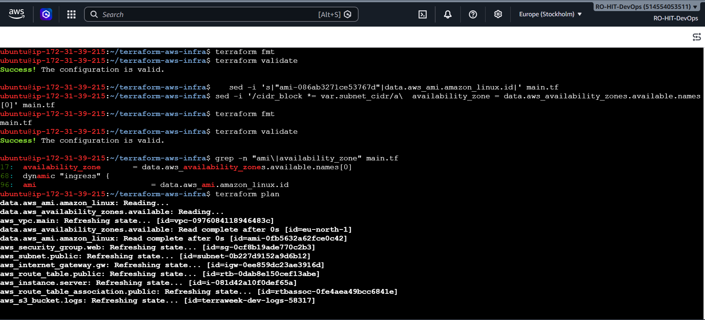

### Step 3: Plan and read it carefully

```bash
terraform plan
```

What you should see:

- `aws_instance.server must be replaced`
- `Plan: 1 to add, 0 to change, 1 to destroy.`

**Why is the EC2 replaced?** A new AMI is a different image, and an EC2 instance cannot change its AMI in place. Terraform creates a new instance and removes the old one. The public IP changes too. This is expected.

The subnet is **not** in the list. That means the first zone (`names[0]`) is the zone the subnet was already in, so nothing changed there.

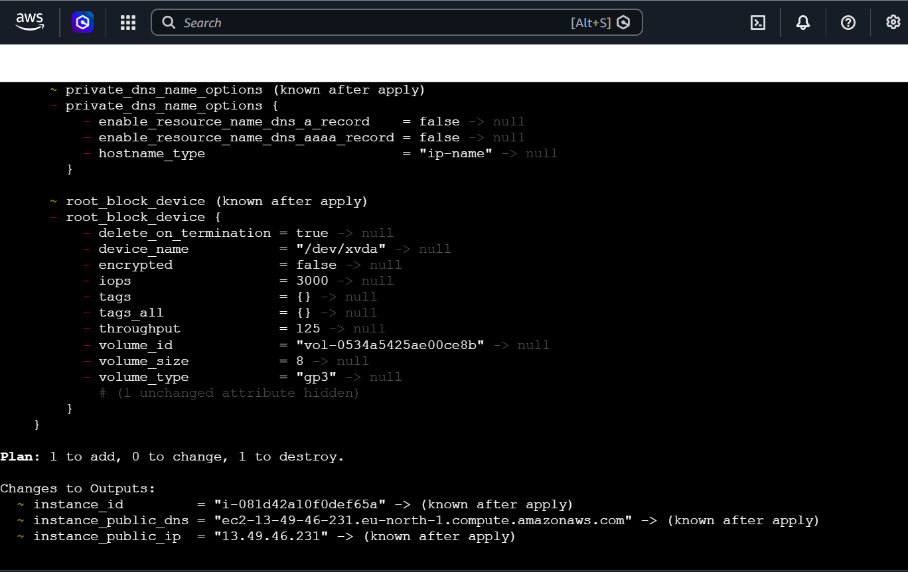

### Step 4: Apply

```bash
terraform apply
```

Type `yes`. Result: `Apply complete! Resources: 1 added, 0 changed, 1 destroyed.` and new values for `instance_id`, `instance_public_ip`, `instance_public_dns`.

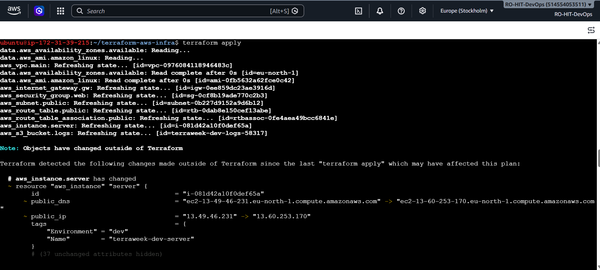

### Step 5: Verify

```bash
terraform state show aws_instance.server | grep -E "ami|availability_zone"
echo "data.aws_ami.amazon_linux.id" | terraform console
echo "data.aws_availability_zones.available.names" | terraform console
```

The AMI in the instance and the AMI from the data source must be **the same ID**. The instance zone must be the first item of the zone list.

In the EC2 console you will see the old instance as **Terminated** and the new one **Running**.

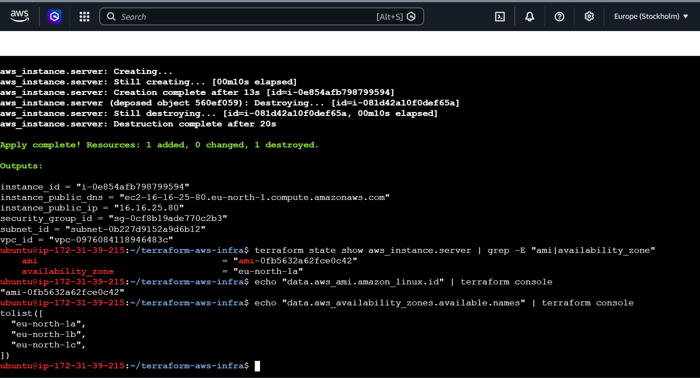
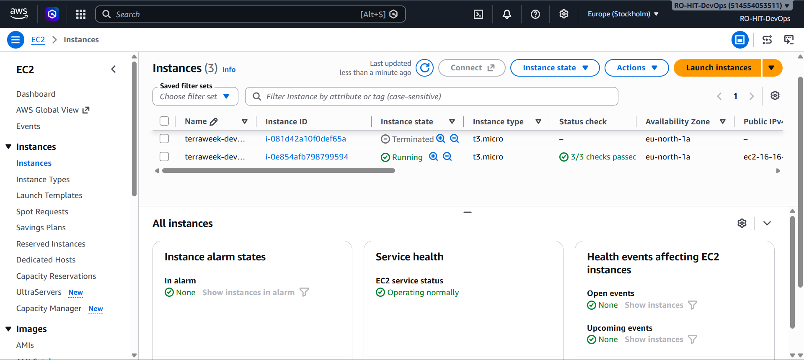

### Documentation: difference between `resource` and `data`

- A **`resource`** **creates and manages** infrastructure. Terraform owns it: it can create, update and destroy it.
- A **`data`** source only **reads** information that already exists. It never creates, changes or destroys anything.

---

## Task 5: Use locals for dynamic values

### What are locals?

**Locals** are named values that live **inside** your config. They are like variables, but you cannot set them from outside. Think of it as: *variable = input, local = a calculation you do at home.*

### Why do we do it?

In our `main.tf`, the text `"${var.project_name}-${var.environment}"` and the long `merge(...)` tags block were copied into every resource. With locals, we write them **once** and use them everywhere. Tags also stay **consistent** on every resource.

### Step 1: Create `locals.tf`

```bash
cat > locals.tf << 'EOF'
locals {
  name_prefix = "${var.project_name}-${var.environment}"

  common_tags = {
    Project     = var.project_name
    Environment = var.environment
    ManagedBy   = "Terraform"
  }
}
EOF
```

- `name_prefix` becomes `terraweek-dev`.
- `common_tags` are the tags every resource must have.

> **Spelling note:** the block is called `locals` (plural), but you use a value as `local.name_prefix` (singular).

```bash
terraform fmt
terraform validate
```

### Step 2: Use locals in every resource

Every resource now has tags written like this:

```hcl
tags = merge(local.common_tags, var.extra_tags, {
  Name = "${local.name_prefix}-server"
})
```

`merge` combines three maps. If the same key appears twice, **the last one wins**. So the specific `Name` goes last.

Names that use the prefix:

| Resource | Name |
|---|---|
| VPC | `"${local.name_prefix}-vpc"` |
| Subnet | `"${local.name_prefix}-public-subnet"` |
| Internet gateway | `"${local.name_prefix}-igw"` |
| Route table | `"${local.name_prefix}-public-rt"` |
| Security group name and tag | `"${local.name_prefix}-sg"` |
| EC2 instance | `"${local.name_prefix}-server"` |
| S3 bucket name | `"${local.name_prefix}-logs-58317"` |

The complete updated `main.tf` is in [Final code of every file](#final-code-of-every-file). Check that locals are used:

```bash
grep -c "local\." main.tf
grep -n "local.name_prefix" main.tf
```

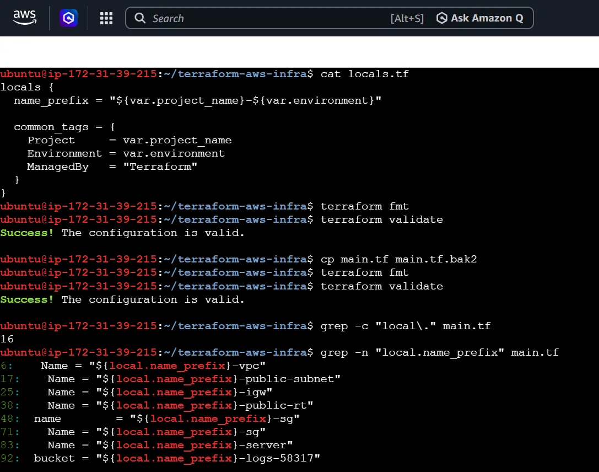

> **Safe change:** the security group `name` and the S3 bucket name still have the **same final text** (`terraweek-dev-sg`, `terraweek-dev-logs-58317`). That is why Terraform does not replace them. Only tags change.

### Step 3: Plan

```bash
terraform plan
terraform plan | grep -E "will be|must be|Plan:"
```

Expected: `Plan: 0 to add, 7 to change, 0 to destroy.` and seven resources with `will be updated in-place`. New tags `Project` and `ManagedBy` appear with a `+`. Nothing is replaced. (The route table association has no tags, so it is not in the list.)

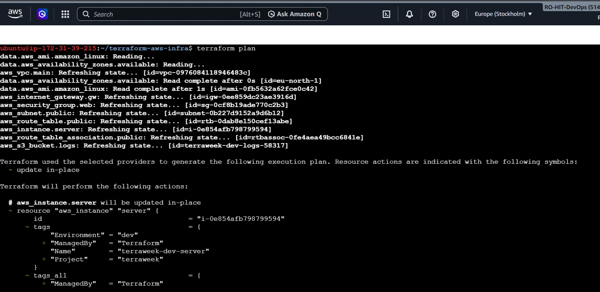
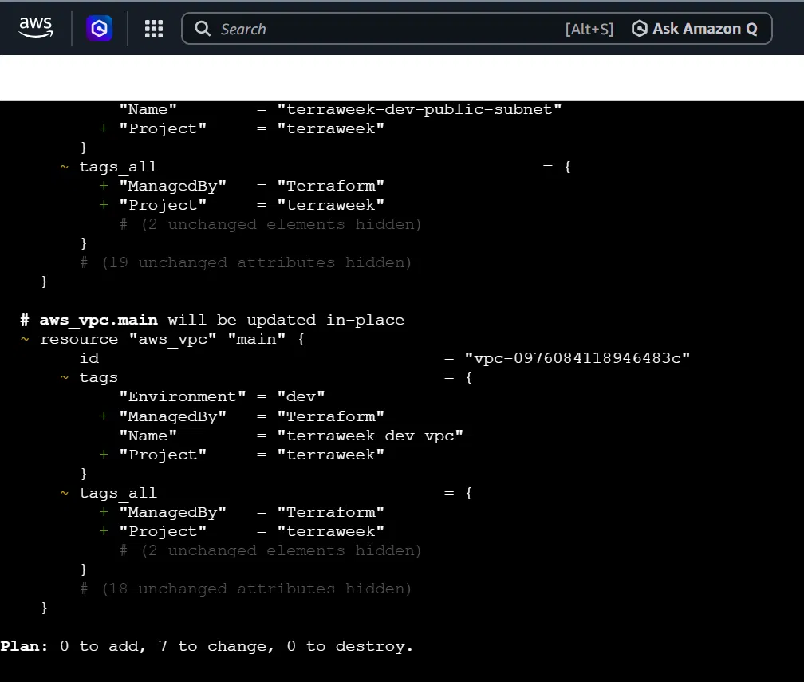

### Step 4: Apply

```bash
terraform apply
```

Result: `Apply complete! Resources: 0 added, 7 changed, 0 destroyed.` The instance and its IP stay the same.

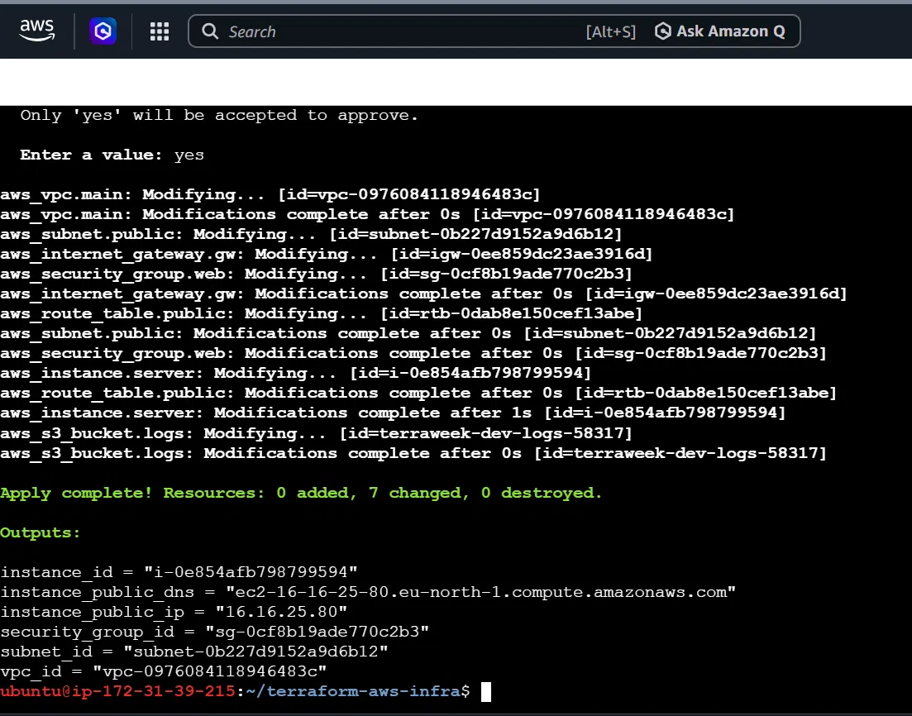


### Step 5: Check the tags in the AWS console

Every resource should have the same four tags: `Project`, `Environment`, `ManagedBy` and `Name`.

| Resource | Where to look | Screenshot |
|---|---|---|
| EC2 instance | EC2 -> Instances -> Tags tab | below |
| VPC | VPC -> Your VPCs -> Tags tab | below |
| Subnet | VPC -> Subnets -> Tags tab | below |
| Internet gateway | VPC -> Internet gateways -> Tags | below |
| Route table | VPC -> Route tables -> Tags tab | below |
| Security group | EC2 -> Security Groups -> Tags tab | below |
| S3 bucket | S3 -> bucket -> Properties -> Tags | below |

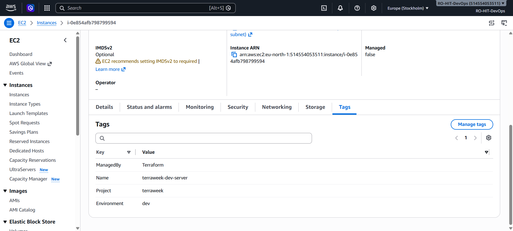
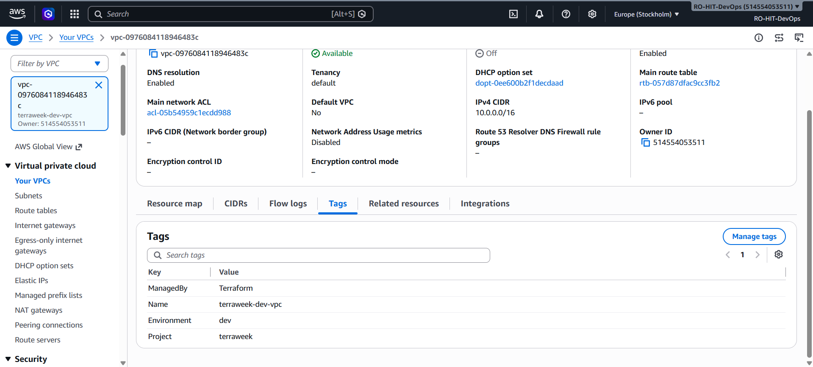
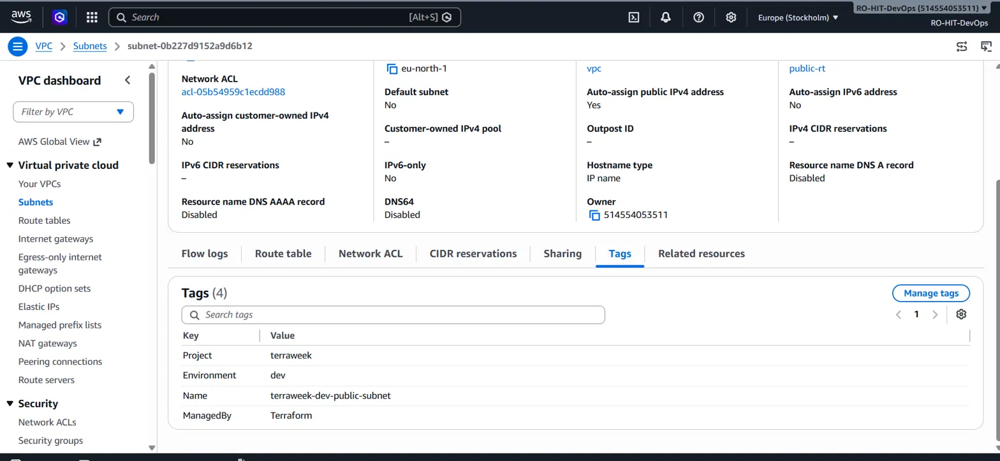
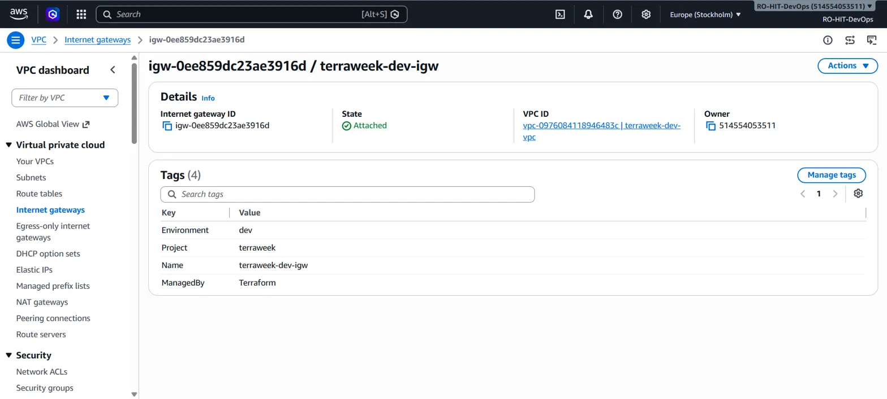
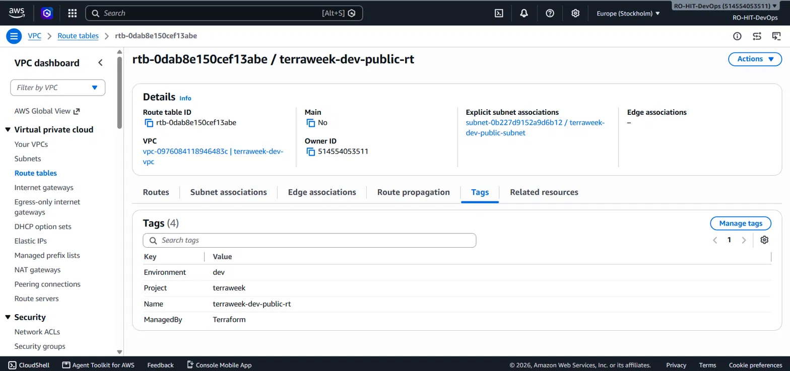
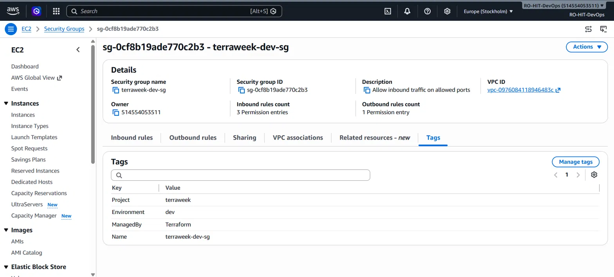
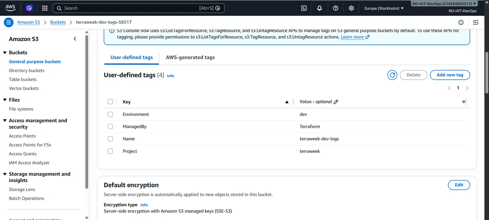

### Documentation: locals vs variables

| | Variable | Local |
|---|---|---|
| Value comes from | Outside (tfvars, CLI, prompt, env) | Calculated inside the config |
| Can the user change it? | Yes | No |
| Use it as | `var.name` | `local.name` |
| Think of it as | Input | A named shortcut or calculation |

> Our task used `Name = ...-subnet` for the subnet. I kept `-public-subnet` to stay consistent with Day 62. Use whichever name you prefer.

---

## Task 6: Built-in functions and conditional expressions

### What is `terraform console`?

`terraform console` is a **practice room**. You type an expression and it shows the answer immediately. **Nothing is created or changed in AWS.** It can also read your variables and locals.

```bash
terraform console
```

You will get a `>` prompt. Type `exit` (or press `Ctrl + D`) to leave.

### Part 1: String functions

```
upper("terraweek")
join("-", ["terra", "week", "2026"])
format("arn:aws:s3:::%s", "my-bucket")
local.name_prefix
```

| Expression | Result | Meaning |
|---|---|---|
| `upper("terraweek")` | `"TERRAWEEK"` | Makes all letters capital |
| `join("-", ["terra","week","2026"])` | `"terra-week-2026"` | Joins list items with a separator |
| `format("arn:aws:s3:::%s", "my-bucket")` | `"arn:aws:s3:::my-bucket"` | Puts a value in place of `%s` |
| `local.name_prefix` | `"terraweek-dev"` | Reads a local from our own config |

### Part 2: Collection functions

```
length(["a", "b", "c"])
lookup({dev = "t2.micro", prod = "t3.small"}, "dev")
toset(["a", "b", "a"])
length(var.allowed_ports)
```

| Expression | Result | Meaning |
|---|---|---|
| `length(["a","b","c"])` | `3` | Counts items |
| `lookup({dev=..., prod=...}, "dev")` | `"t2.micro"` | Finds a value in a map by its key |
| `toset(["a","b","a"])` | `["a", "b"]` | Removes duplicates |
| `length(var.allowed_ports)` | `3` | Number of ports in our own list |

### Part 3: Networking function

```
cidrsubnet("10.0.0.0/16", 8, 1)
cidrsubnet("10.0.0.0/16", 8, 2)
cidrsubnet("10.0.0.0/16", 4, 1)
cidrsubnet(var.vpc_cidr, 8, 1)
```

| Expression | Result |
|---|---|
| `cidrsubnet("10.0.0.0/16", 8, 1)` | `"10.0.1.0/24"` |
| `cidrsubnet("10.0.0.0/16", 8, 2)` | `"10.0.2.0/24"` |
| `cidrsubnet("10.0.0.0/16", 4, 1)` | `"10.0.16.0/20"` |
| `cidrsubnet(var.vpc_cidr, 8, 1)` | `"10.0.1.0/24"` |

**How to read the three numbers:**

1. The big network (`10.0.0.0/16`)
2. How many bits to add to the prefix (`/16` + 8 = `/24`)
3. Which subnet number you want (1 gives `10.0.1.0`, 2 gives `10.0.2.0`)

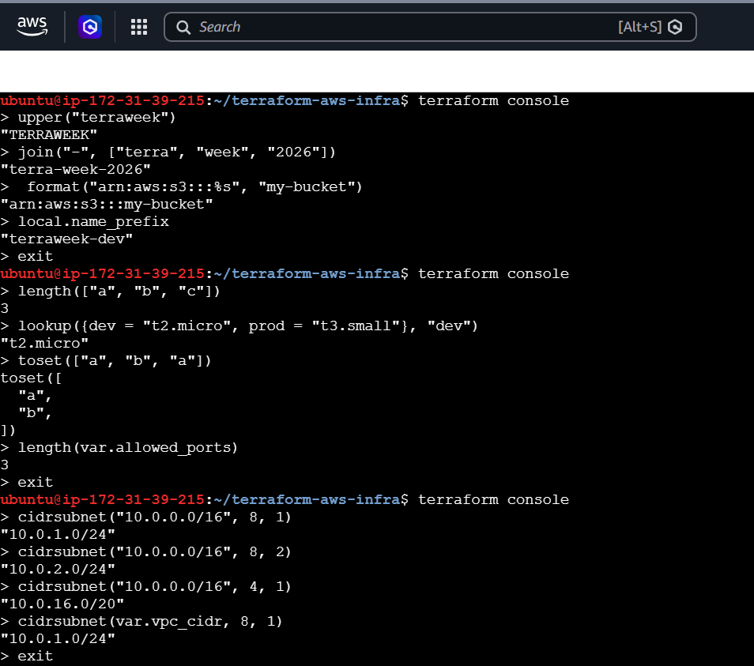

### Part 4: Conditional expression

A conditional is an "if this then that, else the other" decision. The format is:

```
condition ? value_if_true : value_if_false
```

Change the `instance_type` line of the EC2 instance in `main.tf`:

```hcl
instance_type = var.environment == "prod" ? "t3.small" : "t3.micro"
```

Meaning: *if the environment is `prod`, use `t3.small`, otherwise use `t3.micro`.*

You can change it with one command:

```bash
sed -i 's|\(instance_type[[:space:]]*=[[:space:]]*\)var.instance_type|\1var.environment == "prod" ? "t3.small" : "t3.micro"|' main.tf
terraform fmt
terraform validate
grep -n "instance_type" main.tf
```

> **Note:** after this change the EC2 size depends only on `environment`. The `instance_type` variable is no longer used by the EC2.

### Part 5: Test it with `environment = "prod"`

```bash
# dev: nothing should change
terraform plan | grep -E "instance_type|Plan:|No changes"

# prod: instance type should change
terraform plan -var="environment=prod" | grep -E "will be|must be|instance_type|Plan:"
```

Results:

- **dev:** `No changes. Your infrastructure matches the configuration.`
- **prod:** `instance_type = "t3.micro" -> "t3.small"`

So the conditional works. With `prod`, the security group and S3 bucket also show `must be replaced` because the prefix becomes `terraweek-prod`, and their names change. The other resources only get new tags.

I stopped at `plan` and **did not apply prod** on purpose, because applying would replace the security group and the S3 bucket and restart the EC2. The plan output is enough to prove that the conditional works.

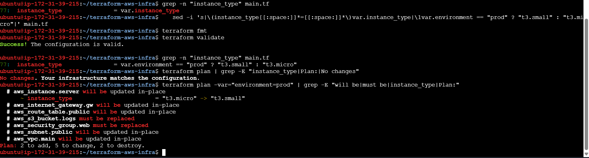

### Documentation: five most useful functions

| # | Function | What it does | Where I would use it |
|---|---|---|---|
| 1 | `merge(map1, map2)` | Combines maps into one. The later map wins if a key repeats. | Adding common tags and extra tags to every resource |
| 2 | `join(separator, list)` | Joins list items into one string. | Building names or text like `terra-week-2026` |
| 3 | `format(template, values)` | Builds a string by filling placeholders like `%s`. | Writing ARNs and formatted names |
| 4 | `lookup(map, key, default)` | Gets a value from a map by key. | Picking an instance type by environment |
| 5 | `cidrsubnet(cidr, bits, number)` | Calculates a smaller subnet range from a big one. | Creating many subnets without writing each CIDR by hand and without overlap |

Honorable mentions: `length` (count items), `toset` (remove duplicates), `upper` and `lower` (change letter case; S3 bucket names must be lowercase).

---

## Cleanup: terraform destroy

Real resources cost money. When you finish, remove everything:

```bash
terraform destroy
```

Check that the plan says `8 to destroy`, then type `yes`. Result:

```
Destroy complete! Resources: 8 destroyed.
```

Verify nothing is left:

```bash
terraform state list     # should show nothing
terraform output         # should show no outputs
```

Also check the AWS console: the `terraweek-dev` instance is **Terminated**, the S3 bucket is gone and the `terraweek-dev-vpc` VPC is gone.

> Your `.tf` and `.tfvars` files stay on disk. Only the AWS resources are removed.

<!-- Add these screenshot files, then remove the comment marks around the next two lines:


-->

---

## Final code of every file

### `providers.tf`

```hcl
terraform {
  required_providers {
    aws = {
      source  = "hashicorp/aws"
      version = "~> 5.0"
    }
  }
}

provider "aws" {
  region = var.region
}
```

### `variables.tf`

```hcl
variable "region" {
  description = "AWS region"
  type        = string
  default     = "eu-north-1"
}

variable "vpc_cidr" {
  description = "CIDR block for the VPC"
  type        = string
  default     = "10.0.0.0/16"
}

variable "subnet_cidr" {
  description = "CIDR block for the public subnet"
  type        = string
  default     = "10.0.1.0/24"
}

variable "instance_type" {
  description = "EC2 instance type"
  type        = string
  default     = "t3.micro"
}

variable "project_name" {
  description = "Name of the project (no default, must be provided)"
  type        = string
}

variable "environment" {
  description = "Environment name"
  type        = string
  default     = "dev"
}

variable "allowed_ports" {
  description = "List of ports allowed in the security group"
  type        = list(number)
  default     = [22, 80, 443]
}

variable "extra_tags" {
  description = "Extra tags to add to resources"
  type        = map(string)
  default     = {}
}
```

### `terraform.tfvars`

```hcl
project_name  = "terraweek"
environment   = "dev"
instance_type = "t3.micro"
```

### `prod.tfvars`

```hcl
project_name  = "terraweek"
environment   = "prod"
instance_type = "t3.small"
vpc_cidr      = "10.1.0.0/16"
subnet_cidr   = "10.1.1.0/24"
```

### `locals.tf`

```hcl
locals {
  name_prefix = "${var.project_name}-${var.environment}"

  common_tags = {
    Project     = var.project_name
    Environment = var.environment
    ManagedBy   = "Terraform"
  }
}
```

### `data.tf`

```hcl
data "aws_ami" "amazon_linux" {
  most_recent = true
  owners      = ["amazon"]

  filter {
    name   = "name"
    values = ["amzn2-ami-hvm-*-x86_64-gp2"]
  }

  filter {
    name   = "virtualization-type"
    values = ["hvm"]
  }

  filter {
    name   = "root-device-type"
    values = ["ebs"]
  }
}

data "aws_availability_zones" "available" {
  state = "available"
}
```

### `outputs.tf`

```hcl
output "vpc_id" {
  description = "The VPC ID"
  value       = aws_vpc.main.id
}

output "subnet_id" {
  description = "The public subnet ID"
  value       = aws_subnet.public.id
}

output "instance_id" {
  description = "The EC2 instance ID"
  value       = aws_instance.server.id
}

output "instance_public_ip" {
  description = "The public IP of the EC2 instance"
  value       = aws_instance.server.public_ip
}

output "instance_public_dns" {
  description = "The public DNS name of the EC2 instance"
  value       = aws_instance.server.public_dns
}

output "security_group_id" {
  description = "The security group ID"
  value       = aws_security_group.web.id
}
```

### `main.tf` (final version after all six tasks)

```hcl
resource "aws_vpc" "main" {
  cidr_block           = var.vpc_cidr
  enable_dns_hostnames = true

  tags = merge(local.common_tags, var.extra_tags, {
    Name = "${local.name_prefix}-vpc"
  })
}

resource "aws_subnet" "public" {
  vpc_id                  = aws_vpc.main.id
  cidr_block              = var.subnet_cidr
  availability_zone       = data.aws_availability_zones.available.names[0]
  map_public_ip_on_launch = true

  tags = merge(local.common_tags, var.extra_tags, {
    Name = "${local.name_prefix}-public-subnet"
  })
}

resource "aws_internet_gateway" "gw" {
  vpc_id = aws_vpc.main.id

  tags = merge(local.common_tags, var.extra_tags, {
    Name = "${local.name_prefix}-igw"
  })
}

resource "aws_route_table" "public" {
  vpc_id = aws_vpc.main.id

  route {
    cidr_block = "0.0.0.0/0"
    gateway_id = aws_internet_gateway.gw.id
  }

  tags = merge(local.common_tags, var.extra_tags, {
    Name = "${local.name_prefix}-public-rt"
  })
}

resource "aws_route_table_association" "public" {
  subnet_id      = aws_subnet.public.id
  route_table_id = aws_route_table.public.id
}

resource "aws_security_group" "web" {
  name        = "${local.name_prefix}-sg"
  description = "Allow inbound traffic on allowed ports"
  vpc_id      = aws_vpc.main.id

  dynamic "ingress" {
    for_each = var.allowed_ports
    content {
      description = "Allow port ${ingress.value}"
      from_port   = ingress.value
      to_port     = ingress.value
      protocol    = "tcp"
      cidr_blocks = ["0.0.0.0/0"]
    }
  }

  egress {
    from_port   = 0
    to_port     = 0
    protocol    = "-1"
    cidr_blocks = ["0.0.0.0/0"]
  }

  tags = merge(local.common_tags, var.extra_tags, {
    Name = "${local.name_prefix}-sg"
  })
}

resource "aws_instance" "server" {
  ami                         = data.aws_ami.amazon_linux.id
  instance_type               = var.environment == "prod" ? "t3.small" : "t3.micro"
  subnet_id                   = aws_subnet.public.id
  vpc_security_group_ids      = [aws_security_group.web.id]
  associate_public_ip_address = true

  tags = merge(local.common_tags, var.extra_tags, {
    Name = "${local.name_prefix}-server"
  })

  lifecycle {
    create_before_destroy = true
  }
}

resource "aws_s3_bucket" "logs" {
  bucket = "${local.name_prefix}-logs-58317"

  depends_on = [aws_instance.server]

  tags = merge(local.common_tags, var.extra_tags, {
    Name = "${local.name_prefix}-logs"
  })
}
```

---

## Problems I faced and how I fixed them

| # | Problem | Cause | Fix |
|---|---|---|---|
| 1 | `Error: invalid AWS Region: var.region` | I wrote `"var.region"` **with quotes**, so Terraform read it as plain text. I also had `default = "var.region"` in `variables.tf`. | Remove the quotes in `providers.tf` (`region = var.region`) and set the default in `variables.tf` to a real region: `default = "eu-north-1"`. |
| 2 | Terminal showed `>` and never finished after `cat > file << 'EOF'` | The closing `EOF` line had spaces before it. | Press `Ctrl + C`, then paste again with `EOF` at the very left. |
| 3 | `main.tf` was valid but had a missing block and leftover lines | I edited pieces by hand in `nano` and deleted `aws_route_table_association` by mistake. | Rewrite the whole file with one `cat > main.tf << 'EOF'` command, then `terraform fmt` and `terraform validate`. |
| 4 | `instance_public_dns = ""` | DNS hostnames are off by default in a self-created VPC. | Add `enable_dns_hostnames = true` to the VPC, `apply`, then `terraform apply -refresh-only`. |
| 5 | EC2 was replaced after the AMI change | A new AMI always means a new instance. | This is expected. Read the plan (`must be replaced`) before typing `yes`. |
| 6 | Wrong VPC in a console screenshot | The account has a default VPC too (`172.31.0.0/16`). | Open the VPC named `terraweek-dev-vpc` and compare the VPC ID with `terraform output vpc_id`. |

---

## Quick cheat sheet

```bash
# Daily workflow
terraform init                      # download providers (first time)
terraform fmt                       # tidy the code
terraform validate                  # check the code
terraform plan                      # preview changes
terraform apply                     # create or change resources
terraform destroy                   # remove everything

# Giving values to variables
terraform plan -var-file="prod.tfvars"
terraform plan -var="instance_type=t3.nano"
export TF_VAR_environment="staging"     # then: unset TF_VAR_environment

# Outputs
terraform output
terraform output instance_public_ip
terraform output -json

# Practice and inspect
terraform console
terraform state list
terraform state show aws_instance.server
terraform apply -refresh-only
```

| Reference | How to write it |
|---|---|
| Use a variable | `var.region` |
| Use a local | `local.name_prefix` |
| Use a data source | `data.aws_ami.amazon_linux.id` |
| Use a resource attribute | `aws_vpc.main.id` |
| Put a value inside text | `"${var.project_name}-vpc"` |
| Condition | `var.environment == "prod" ? "big" : "small"` |

---

## Key takeaways

- **Variables** remove hardcoded values, so one code can be used in many places.
- **`.tfvars` files** keep one set of values per environment, and **precedence** decides which value wins (CLI is the strongest).
- **Outputs** print the useful information after `apply` and let scripts read it.
- **Data sources** *read* existing information (like the newest AMI) so the config works in any region.
- **Locals** write a repeated expression once and keep tags consistent on every resource.
- **Functions and conditionals** give small tools for text, lists, maps, networking and decisions. Use `terraform console` to practice them safely.
- **Always read the plan** before typing `yes`, especially when you see `must be replaced`.
- **Always run `terraform destroy`** when you finish practicing, to avoid AWS charges.
