# Day 64 – Terraform State Management and Remote Backends

> **Goal of today:** Learn to look after the Terraform **state file** like a professional.
> Move it from your laptop/server to **AWS S3**, protect it with **DynamoDB locking**, **import** an existing AWS resource, do **state surgery** (`mv` / `rm`), and **fix drift**.

This guide is written for **complete beginners**. You do not need to know anything about Terraform state before reading it. Every task has:

- **What** – what we are doing
- **Why** – why it matters in real projects
- **How** – exact commands (copy and paste)
- **Expected output** – what you should see
- **Screenshots** – real output from my run

---

## Table of Contents

1. [What you will learn](#1-what-you-will-learn)
2. [Key words explained](#2-key-words-explained-in-simple-english)
3. [Before you start](#3-before-you-start)
4. [Starter configuration](#4-starter-configuration-code)
5. [Task 1 – Inspect the current state](#task-1--inspect-your-current-state)
6. [Task 2 – Set up the S3 remote backend](#task-2--set-up-s3-remote-backend-with-dynamodb-locking)
7. [Task 3 – Test state locking](#task-3--test-state-locking)
8. [Task 4 – Import an existing resource](#task-4--import-an-existing-resource)
9. [Task 5 – State surgery: mv and rm](#task-5--state-surgery-mv-and-rm)
10. [Task 6 – Simulate and fix drift](#task-6--simulate-and-fix-state-drift)
11. [Problems I faced and how I fixed them](#problems-i-faced-and-how-i-fixed-them)
12. [Cleanup (avoid AWS bills)](#cleanup-avoid-aws-bills)
13. [Summary](#summary)

---

## 1. What you will learn

| Task | Topic | Result |
|---|---|---|
| 1 | Inspect state | Understand what is stored inside `terraform.tfstate` |
| 2 | Remote backend | State moved from local to **S3**, locked by **DynamoDB** |
| 3 | Locking | See the "state lock" error with your own eyes |
| 4 | Import | Bring a Console-created S3 bucket under Terraform |
| 5 | `state mv` / `state rm` | Rename and remove resources in state safely |
| 6 | Drift | Detect a manual change and fix it with `apply` |

---

## 2. Key words explained in simple English

| Word | Simple meaning |
|---|---|
| **State file** (`terraform.tfstate`) | A JSON file. Terraform's **notebook**. It remembers every resource it created. |
| **Source of truth** | The place Terraform trusts to know "what exists". That is the state file. |
| **Backend** | The place where the state file is stored. Default = your local folder. |
| **Remote backend** | Storing state somewhere shared and safe, like **S3**. |
| **State locking** | A "do not disturb" sign. Only one person can change state at a time. |
| **DynamoDB** | An AWS database. Terraform uses it to keep the lock. |
| **Versioning (S3)** | S3 keeps old copies of a file. Like an "undo" button. |
| **Import** | Tell Terraform: "this resource already exists in AWS, please manage it". |
| **Drift** | Someone changed AWS manually, so reality ≠ your `.tf` code. |
| **serial** | A counter inside the state file. Goes up by 1 every time state changes. |
| **lineage** | A unique ID of a state file. It never changes. |
| **Data source** | Terraform only **reads** it (for example, finds an AMI). It creates nothing. |

**Easy example:** Think of the state file as a **school attendance register**.
`.tf` files = the list of students who *should* be there. AWS = the students *actually* in class. The register (state) connects both.

---

## 3. Before you start

### Requirements

- An AWS account and the **AWS CLI** configured (`aws sts get-caller-identity` must work)
- **Terraform** installed (I used version `1.16.4`)
- An IAM user with permission for **EC2, VPC, S3, DynamoDB**
- A Linux terminal (I used an Ubuntu EC2 machine)

> ⚠️ **Permissions matter.** Task 2 needs S3 (`ListBucket`, `GetObject`, `PutObject`, `DeleteObject`) and DynamoDB (`CreateTable`, `DescribeTable`, `GetItem`, `PutItem`, `DeleteItem`). If an IAM *permissions boundary* blocks these, you will get `AccessDenied`. See [Problems I faced](#problems-i-faced-and-how-i-fixed-them).

### Important values (replace with your own)

| Item | The task text said | I used (my region is Stockholm) |
|---|---|---|
| Region | `ap-south-1` | `eu-north-1` |
| State bucket | `terraweek-state-<yourname>` | `terraweek-state-1476613341` |
| Lock table | `terraweek-state-lock` | `terraweek-state-lock` |
| Import bucket | `terraweek-import-test-<yourname>` | `terraweek-import-test-2970113925` |

S3 bucket names must be **globally unique**, so always add a random number.

### Folder structure in this repo

```
2026/day-64/
├── day-64-state-management.md
└── Screenshots/
    ├── task1-01-init-apply-start.png
    ├── task2-11-terraform-init-migration.png
    └── ...
```

Project folder on my machine: `~/terraform-aws-infra`

---

## 4. Starter configuration (code)

Use your **Day 63 config**. If you do not have one, create these small files in a new folder. They build a **VPC + subnet + internet gateway + route table + security group + EC2 + S3 bucket**.

```bash
mkdir ~/terraform-aws-infra && cd ~/terraform-aws-infra
```

### `providers.tf`

```hcl
terraform {
  required_providers {
    aws = {
      source  = "hashicorp/aws"
      version = "~> 5.0"
    }
  }
}

provider "aws" {
  region = var.region
}
```

### `variables.tf`

```hcl
variable "region" {
  type    = string
  default = "eu-north-1"
}

variable "logs_bucket_name" {
  type        = string
  description = "Must be globally unique"
}
```

### `terraform.tfvars`

```hcl
logs_bucket_name = "terraweek-dev-logs-12345"   # change the number
```

### `main.tf`

```hcl
locals {
  common_tags = {
    Environment = "dev"
    ManagedBy   = "Terraform"
    Project     = "terraweek"
  }
}

# Data sources: Terraform only READS these
data "aws_ami" "amazon_linux" {
  most_recent = true
  owners      = ["amazon"]
  filter {
    name   = "name"
    values = ["amzn2-ami-hvm-*-x86_64-gp2"]
  }
}

data "aws_availability_zones" "available" {
  state = "available"
}

resource "aws_vpc" "main" {
  cidr_block           = "10.0.0.0/16"
  enable_dns_hostnames = true
  tags                 = merge(local.common_tags, { Name = "terraweek-dev-vpc" })
}

resource "aws_subnet" "public" {
  vpc_id                  = aws_vpc.main.id
  cidr_block              = "10.0.1.0/24"
  availability_zone       = data.aws_availability_zones.available.names[0]
  map_public_ip_on_launch = true
  tags                    = merge(local.common_tags, { Name = "terraweek-dev-public-subnet" })
}

resource "aws_internet_gateway" "gw" {
  vpc_id = aws_vpc.main.id
  tags   = merge(local.common_tags, { Name = "terraweek-dev-igw" })
}

resource "aws_route_table" "public" {
  vpc_id = aws_vpc.main.id
  route {
    cidr_block = "0.0.0.0/0"
    gateway_id = aws_internet_gateway.gw.id
  }
  tags = merge(local.common_tags, { Name = "terraweek-dev-public-rt" })
}

resource "aws_route_table_association" "public" {
  subnet_id      = aws_subnet.public.id
  route_table_id = aws_route_table.public.id
}

resource "aws_security_group" "web" {
  name   = "terraweek-dev-web-sg"
  vpc_id = aws_vpc.main.id

  ingress {
    from_port   = 80
    to_port     = 80
    protocol    = "tcp"
    cidr_blocks = ["0.0.0.0/0"]
  }
  egress {
    from_port   = 0
    to_port     = 0
    protocol    = "-1"
    cidr_blocks = ["0.0.0.0/0"]
  }
  tags = merge(local.common_tags, { Name = "terraweek-dev-web-sg" })
}

resource "aws_instance" "server" {
  ami                    = data.aws_ami.amazon_linux.id
  instance_type          = "t3.micro"
  subnet_id              = aws_subnet.public.id
  vpc_security_group_ids = [aws_security_group.web.id]
  tags                   = merge(local.common_tags, { Name = "terraweek-dev-server" })
}

resource "aws_s3_bucket" "logs" {
  bucket = var.logs_bucket_name
  tags   = local.common_tags
}
```

### `outputs.tf`

```hcl
output "instance_id"         { value = aws_instance.server.id }
output "instance_public_ip"  { value = aws_instance.server.public_ip }
output "vpc_id"              { value = aws_vpc.main.id }
output "subnet_id"           { value = aws_subnet.public.id }
output "security_group_id"   { value = aws_security_group.web.id }
```

> The names `aws_instance.server`, `aws_vpc.main` and `aws_s3_bucket.logs` are used in all commands below. If you use different names, change the commands.

---

## Task 1 – Inspect Your Current State

### What
Apply the config, then **look inside the state file** to see what Terraform remembers.

### Why
Before you move or edit state, you must understand what is in it. State stores **much more** than what you wrote in `.tf` files.

### How

**Step 1 – Go to the project and initialise**

```bash
cd ~/terraform-aws-infra
terraform init
terraform apply
```

Type `yes` when asked. Wait for `Apply complete! Resources: 8 added`.

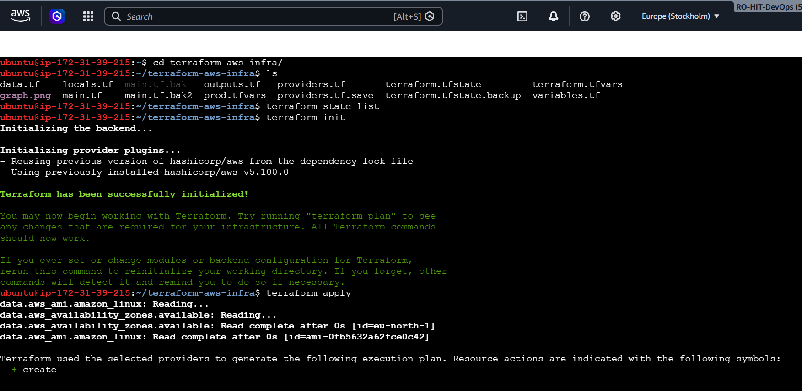

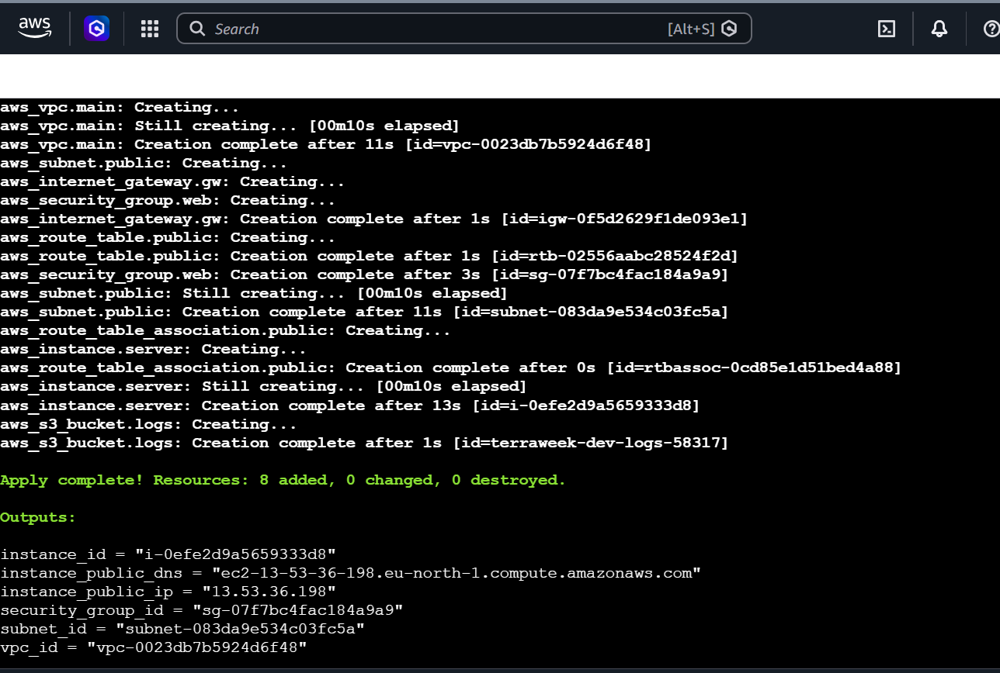

**Step 2 – List everything Terraform tracks**

```bash
terraform state list
```

Output (10 lines):

```
data.aws_ami.amazon_linux
data.aws_availability_zones.available
aws_instance.server
aws_internet_gateway.gw
aws_route_table.public
aws_route_table_association.public
aws_s3_bucket.logs
aws_security_group.web
aws_subnet.public
aws_vpc.main
```

**Step 3 – Show the full state in readable form**

```bash
terraform show | less      # press q to quit
```

**Step 4 – Show all attributes of the EC2 instance**

```bash
terraform state show aws_instance.server
```

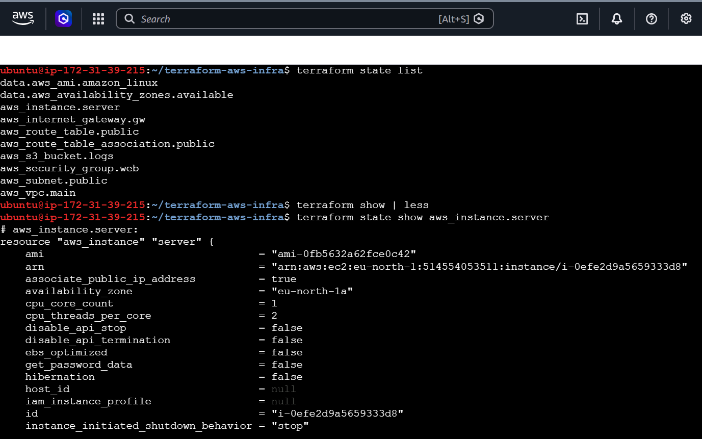

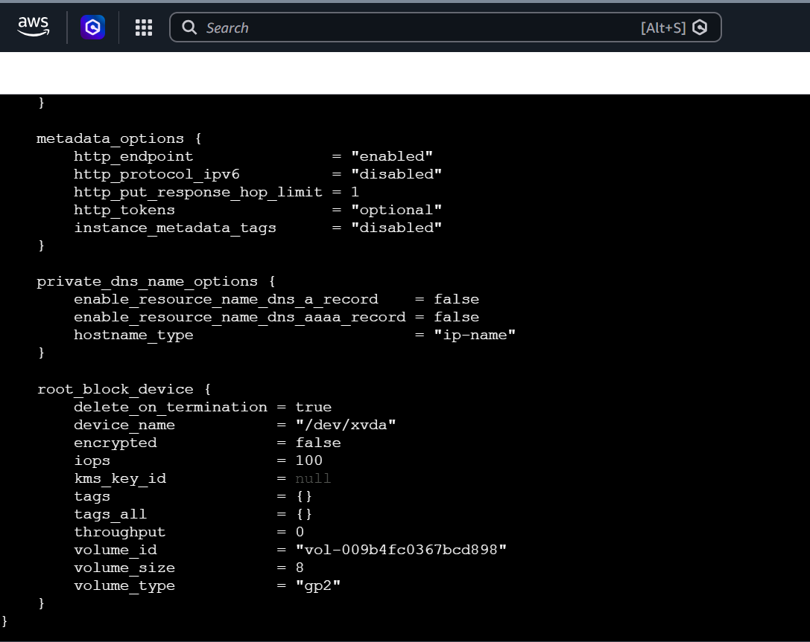

**Step 5 – Show all attributes of the VPC**

```bash
terraform state show aws_vpc.main
```

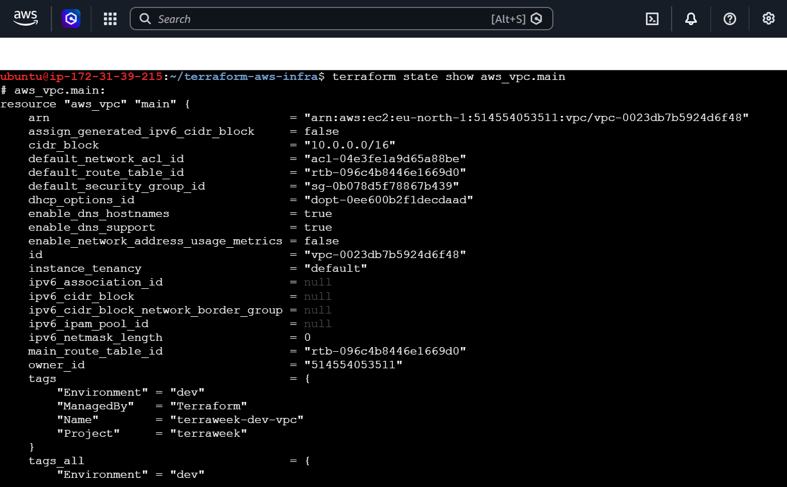

**Step 6 – Find the `serial` number in the raw file**

```bash
grep -E '"serial"|"version"|"terraform_version"|"lineage"' terraform.tfstate
```

Output on my machine:

```
  "version": 4,
  "terraform_version": "1.16.4",
  "serial": 63,
  "lineage": "d3b07e44-764e-c8cc-0e52-391a0f62c23f",
```

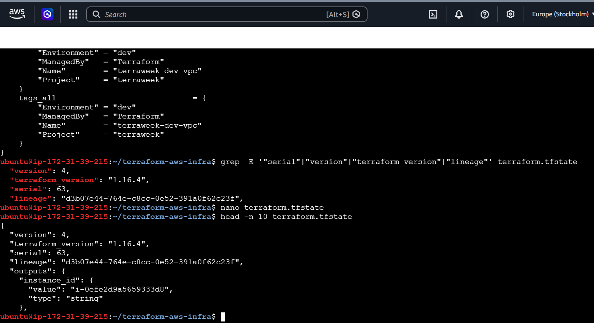

> ⚠️ Only **read** `terraform.tfstate`. Never edit it by hand.

### Answers

**1. How many resources does Terraform track?**
**8 managed resources** (VPC, subnet, internet gateway, route table, route table association, security group, EC2 instance, S3 bucket) plus **2 data sources** (AMI and availability zones). So `state list` shows **10 entries**.

**2. What attributes does the state store for an EC2 instance?**
Way more than what I wrote (about **40+ attributes** and **8 nested blocks**). Examples:
- *I defined:* `instance_type`, `subnet_id`, `tags`
- *AWS gave back:* `id`, `arn`, `private_ip`, `public_ip`, `public_dns`, `availability_zone`, `primary_network_interface_id`, `instance_state`
- *Defaults:* `monitoring`, `ebs_optimized`, `tenancy`, `source_dest_check`
- *Nested blocks:* `root_block_device` (with `volume_id`, `volume_size`), `metadata_options`, `cpu_options`, `credit_specification`

**3. What does `serial` represent?**
It is a **version counter** of the state. It goes up by **1** every time state changes (`apply`, `destroy`, `state rm`, etc.). Mine was **63** because I used the same folder for Day 62 and Day 63 too. With a remote backend, Terraform uses `serial` to know which copy is newer, so an old state can never overwrite a new one.

---

## Task 2 – Set Up S3 Remote Backend (with DynamoDB Locking)

### What
Move the state file from your local folder to an **S3 bucket**, and use a **DynamoDB table** for locking.

### Why
Local state is risky:
- Delete the file or lose the machine → Terraform forgets everything.
- Teammates cannot share it.
- Two people applying at once can corrupt it.

```
BEFORE (local)                    AFTER (remote)
┌──────────────┐                  ┌──────────────┐     ┌────────────────┐
│ Your machine │                  │ Your machine │────▶│  S3 bucket     │ state + versions
│ tfstate file │                  └──────────────┘     ├────────────────┤
└──────────────┘                         │             │  DynamoDB lock │ one writer at a time
                                         └────────────▶└────────────────┘
```

### How

**Step 1 – Check AWS CLI and set variables**

```bash
aws sts get-caller-identity

export REGION="eu-north-1"
export BUCKET="terraweek-state-$RANDOM$RANDOM"
export TABLE="terraweek-state-lock"
echo $BUCKET        # copy this name, you need it later
```

**Step 2 – Create the S3 bucket**

> Write this command on **one line**. If you paste a multi-line command with `\` and an extra space after it, you will get `Unknown options`.

```bash
aws s3api create-bucket --bucket $BUCKET --region $REGION --create-bucket-configuration LocationConstraint=$REGION
```

**Step 3 – Turn on versioning (your "undo button")**

```bash
aws s3api put-bucket-versioning --bucket $BUCKET --versioning-configuration Status=Enabled
aws s3api get-bucket-versioning --bucket $BUCKET
```

Expected: `"Status": "Enabled"`

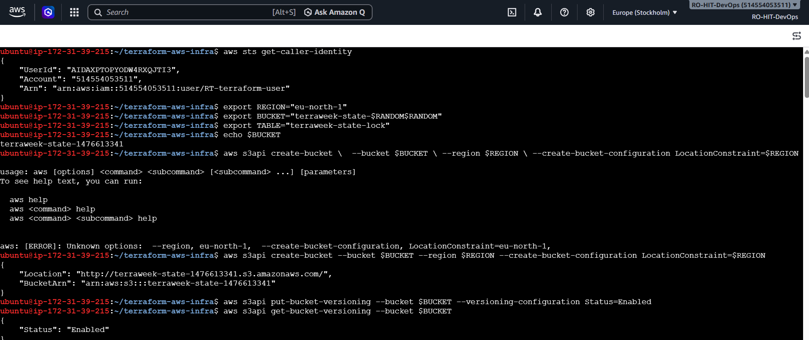

**Step 4 – Create the DynamoDB lock table**

```bash
aws dynamodb create-table --table-name $TABLE --attribute-definitions AttributeName=LockID,AttributeType=S --key-schema AttributeName=LockID,KeyType=HASH --billing-mode PAY_PER_REQUEST --region $REGION

aws dynamodb describe-table --table-name $TABLE --region $REGION --query "Table.TableStatus"
```

Expected: `"ACTIVE"`

> The key name must be exactly **`LockID`** (capital L and I, capital D). Terraform looks for this exact name.

**Step 5 – Add the backend block inside the `terraform {}` block**

The `backend` block must be **inside** `terraform { ... }`. Edit `providers.tf`:

```hcl
terraform {
  required_providers {
    aws = {
      source  = "hashicorp/aws"
      version = "~> 5.0"
    }
  }

  backend "s3" {
    bucket         = "terraweek-state-1476613341"   # your bucket name
    key            = "dev/terraform.tfstate"        # path inside the bucket
    region         = "eu-north-1"
    dynamodb_table = "terraweek-state-lock"
    encrypt        = true
  }
}

provider "aws" {
  region = var.region
}
```

> Backend blocks **cannot use variables**. Write the bucket name directly.

**Step 6 – Migrate the state**

```bash
terraform init
```

Terraform asks:

```
Do you want to copy existing state to the new backend?
  Enter a value: yes
```

Type **`yes`**. If you type `no`, S3 gets an *empty* state and Terraform forgets your resources.

You will also see a *Deprecated Parameter* warning for `dynamodb_table`. Newer Terraform prefers `use_lockfile = true`. It is only a warning, so the task still works.

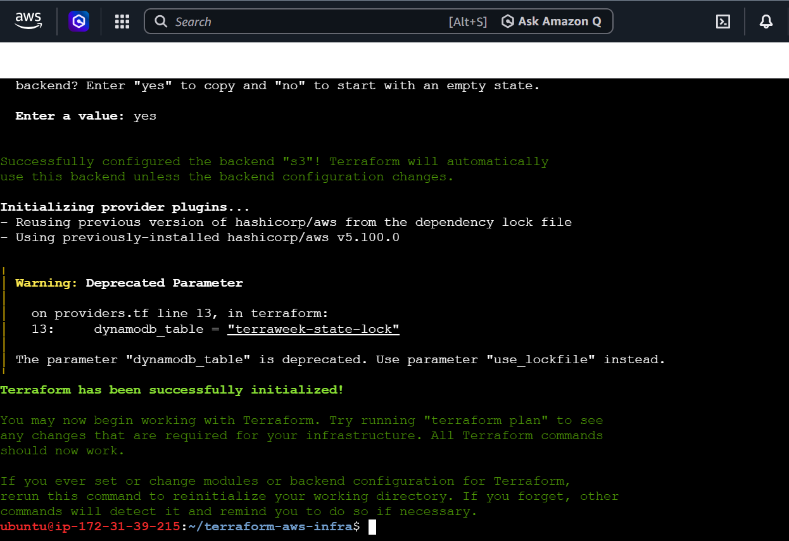

**Step 7 – Verify**

```bash
aws s3 ls s3://terraweek-state-1476613341/dev/     # state file is in S3
terraform state list | wc -l                       # 11 (read from S3)
terraform plan                                     # No changes
ls -l terraform.tfstate*                           # local file is now 0 bytes
```

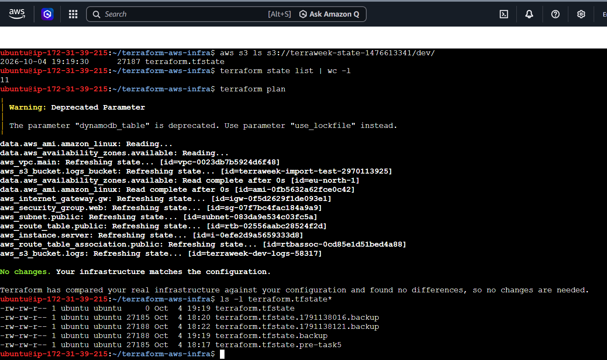

What the screenshot proves:
- ✅ `dev/terraform.tfstate` exists in S3
- ✅ `terraform plan` says **No changes** (migration is correct)
- ✅ Local `terraform.tfstate` is **0 bytes** (empty)

---

## Task 3 – Test State Locking

### What
Run two Terraform commands at the same time and see Terraform **block** the second one.

### Why
If two people run `terraform apply` together, both write to the same state and it can get **corrupted**. A lock makes the second person wait.

**Real-life picture:** a toilet door. When someone is inside you see "Occupied". Nobody else goes in.

### How

**Step 1 – Open two terminals** in the same folder (call them **T1** and **T2**).

```bash
cd ~/terraform-aws-infra
```

**Step 2 – Make a harmless change** so that `apply` stops at the confirmation prompt (in T1). If there are *no changes*, apply finishes instantly and no lock is held.

```bash
cat >> outputs.tf <<'EOF'

output "lock_test" {
  value = "hello"
}
EOF
terraform apply          # type yes once (this adds the output)
sed -i 's/"hello"/"hello3"/' outputs.tf
```

**Step 3 – In T1 start apply and WAIT at the prompt**

```bash
terraform apply
```

When you see `Enter a value:` → **do not type anything**. The lock is now active.

**Step 4 – In T2 run plan**

```bash
terraform plan
```

Result:

```
Error: Error acquiring the state lock

Error message: resource temporarily unavailable
Lock Info:
  ID:        7ed0dcef-a4e3-d215-f8f8-68bdcdfb3404
  Path:      terraform.tfstate
  Operation: OperationTypeApply
  Who:       ubuntu@ip-172-31-39-215
  Version:   1.16.4
  Created:   2026-10-04 17:52:56 +0000 UTC
```

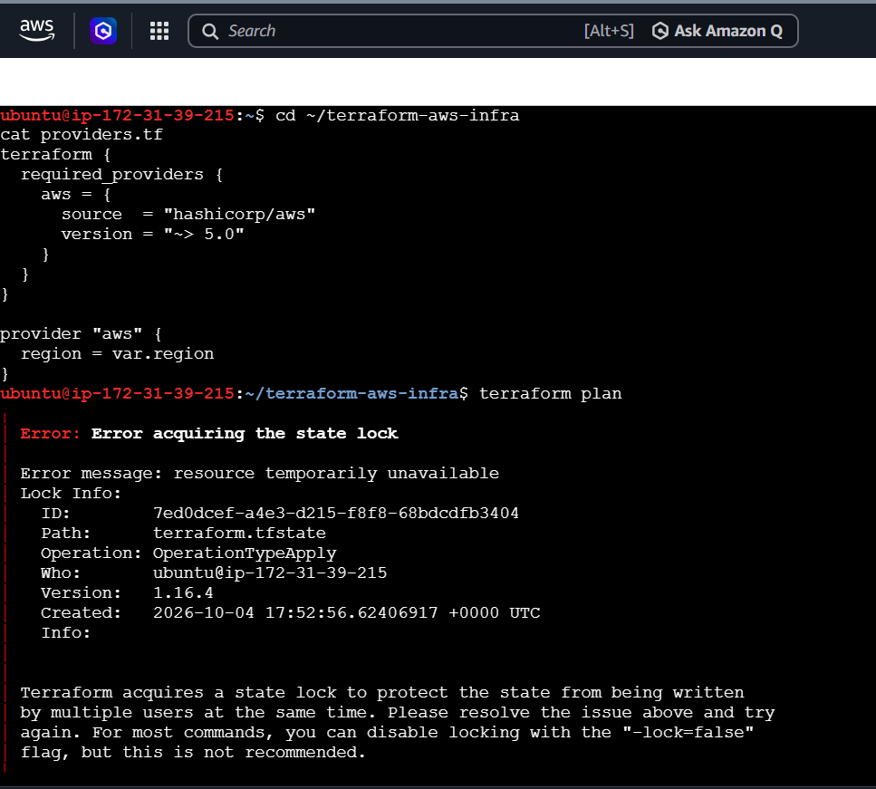

**Step 5 – Release the lock.** Go to T1 and type `no`.

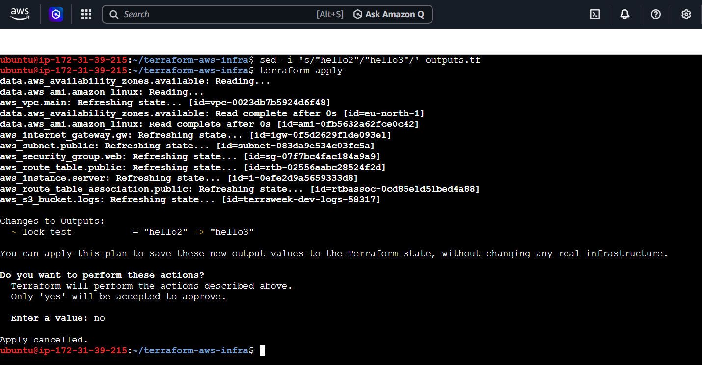

**Step 6 – Run plan again in T2.** It works now.

```bash
terraform plan
```

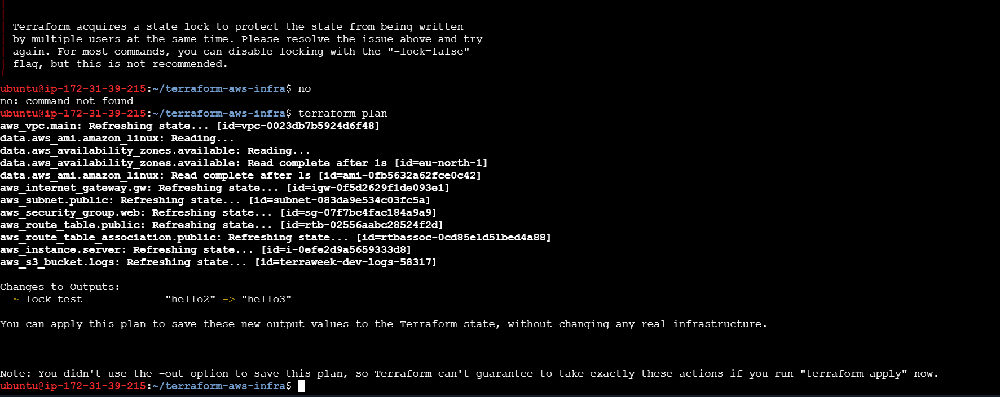

**Step 7 – Clean up the test output**

```bash
sed -i '/^output "lock_test"/,/^}/d' outputs.tf
terraform apply
```

> I did this test while the state was still **local**, so the lock was a local file lock (`Path: terraform.tfstate`). With the S3 backend, the lock lives in the **DynamoDB** table and the steps are exactly the same.

### Stuck lock? `force-unlock`

If a command crashes, the lock may stay forever (a *stale lock*). Remove it with the Lock ID from the error:

```bash
terraform force-unlock <LOCK_ID>
```

Use it **only** when you are 100% sure nobody else is running Terraform.

### What each field in the error means

| Field | Meaning |
|---|---|
| `ID` | Unique number of this lock |
| `Operation` | What holds the lock (`apply`, `plan`, ...) |
| `Who` | User and machine |
| `Created` | When the lock started |
| `-lock=false` | A flag to skip locking. **Dangerous. Do not use.** |

### Answers

**What is the error message?**
`Error acquiring the state lock`, followed by the lock info (ID, Operation, Who, Created).

**Why is locking critical for team environments?**
If two people apply at the same time, both write to the same state and it can be **corrupted**, which can lead to duplicate or deleted resources. A lock allows **only one writer at a time**; the other person waits. This keeps shared infrastructure safe.

---

## Task 4 – Import an Existing Resource

### What
Take a resource that **already exists in AWS** (created by hand) and bring it under Terraform.

### Why
Not everything starts with Terraform. Someone may have created a bucket in the Console. If you do not import it, Terraform does not know it exists. Import **adds it to state without creating or deleting anything**.

| | Create from scratch | Import |
|---|---|---|
| Resource exists in AWS first? | No | **Yes** |
| What `apply`/`import` does | Creates the resource in AWS | Only records it in **state** |
| `.tf` block | You write it | You write it (Terraform does not) |

### How

**Step 1 – Create a bucket by hand** (AWS Console → S3 → Create bucket). Use a unique name:

```bash
export IMPORT_BUCKET="terraweek-import-test-$RANDOM$RANDOM"
echo $IMPORT_BUCKET
```

Create a bucket with exactly that name in the Console (same region, default settings). Then check:

```bash
aws s3api head-bucket --bucket $IMPORT_BUCKET
```

JSON output (with `BucketArn`) means the bucket exists and you can access it.

**Step 2 – Write the resource block** (only the name, nothing else)

```bash
cat >> main.tf <<'EOF'

resource "aws_s3_bucket" "imported" {
  bucket = "terraweek-import-test-2970113925"   # your exact bucket name
}
EOF
terraform validate
```

**Step 3 – Import it**

Format: `terraform import <resource_address> <real_id_in_aws>`

```bash
terraform import aws_s3_bucket.imported terraweek-import-test-2970113925
```

Expected: `Import successful!`

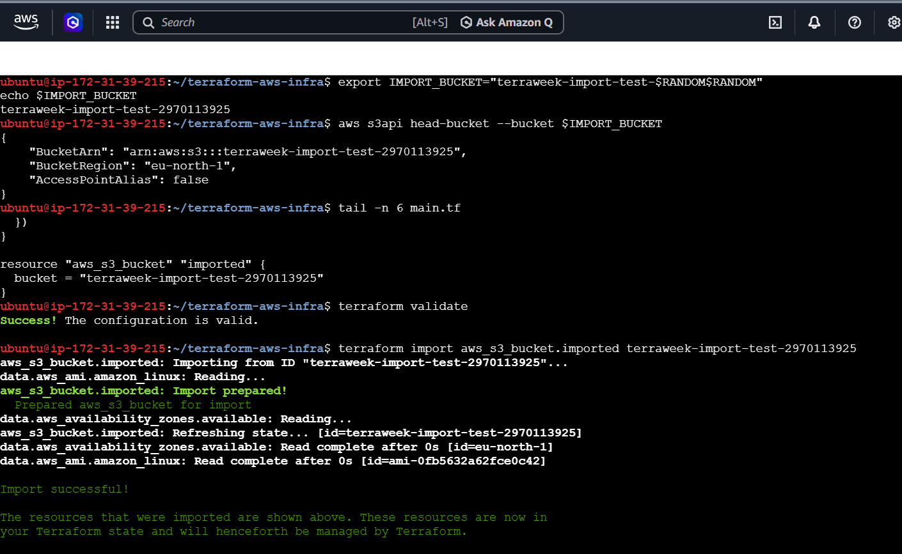

**Step 4 – Plan**

```bash
terraform plan
```

- **No changes** → import was perfect ✅
- **Changes shown** → your `.tf` does not match reality. Fix the `.tf`, then plan again until you get *No changes*.

**Step 5 – Confirm it is in state**

```bash
terraform state list
```

You should see `aws_s3_bucket.imported` next to the others (11 entries).

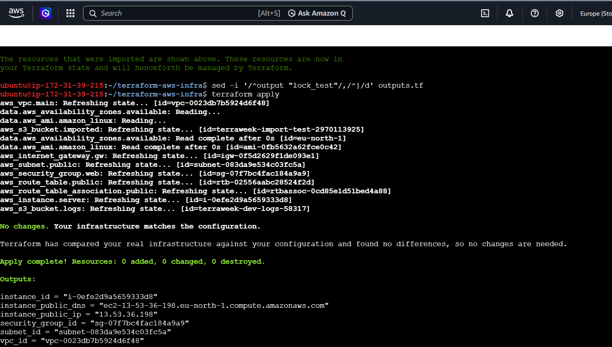

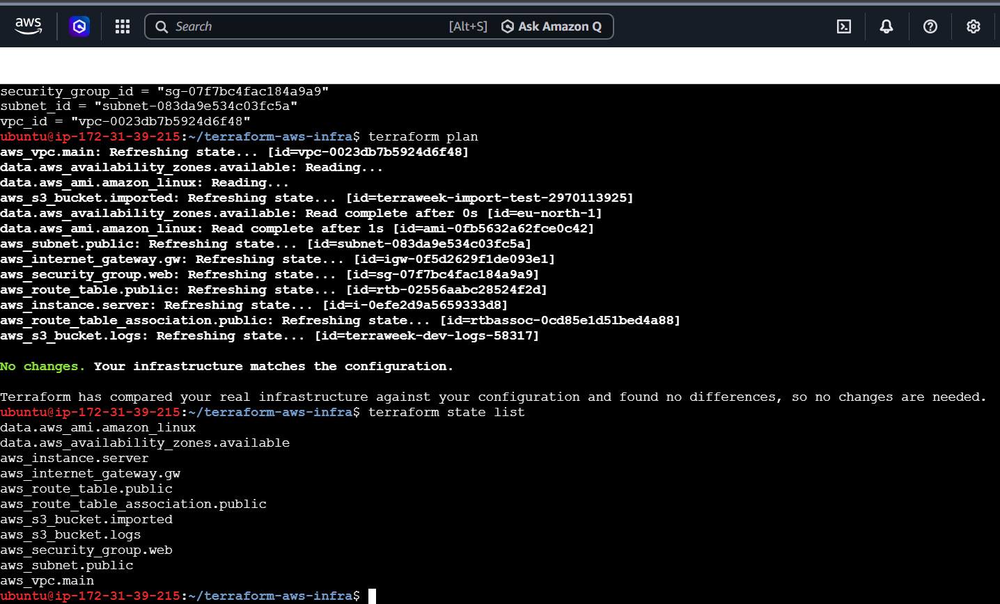

### Answer

**What is the difference between `terraform import` and creating a resource from scratch?**
When you **create from scratch**, Terraform builds the resource in AWS and then saves it in state. With **import**, the resource already exists in AWS, so Terraform only **writes it into the state**. It does not create or change anything. You still have to write the `.tf` block yourself.

---

## Task 5 – State Surgery: `mv` and `rm`

### What

| Command | What it does | What happens in AWS |
|---|---|---|
| `terraform state mv A B` | **Renames** a resource in state | Nothing |
| `terraform state rm A` | **Removes** a resource from state | Nothing (resource stays) |

### Why
- If you only rename a resource in `.tf`, Terraform thinks: "old one is gone, delete it; new one is needed, create it." `state mv` stops that.
- `state rm` lets you stop managing a resource **without destroying it**.

### How

**Step 0 – Back up the state first (good habit)**

```bash
cp terraform.tfstate terraform.tfstate.pre-task5
```

> With a remote backend, the local file is empty. Use `terraform state pull > backup.json` for a backup instead.

**Step 1 – Rename in state (`mv`)**

```bash
terraform state list
terraform state mv aws_s3_bucket.imported aws_s3_bucket.logs_bucket
```

Expected: `Successfully moved 1 object(s).`

Now change the **same name in the `.tf` file**:

```bash
sed -i 's/resource "aws_s3_bucket" "imported"/resource "aws_s3_bucket" "logs_bucket"/' main.tf
tail -n 4 main.tf
terraform plan
```

Expected: **No changes**.

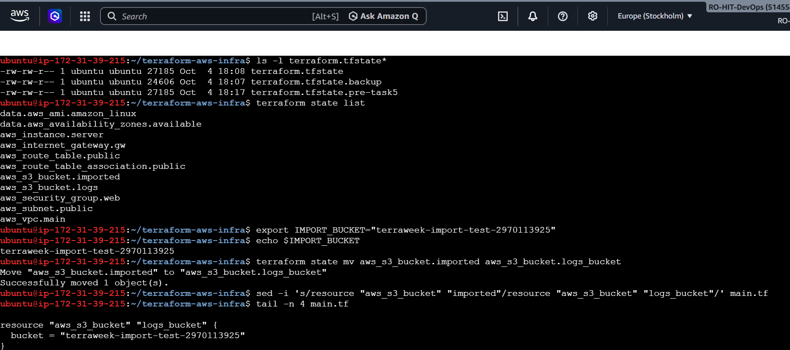

**Step 2 – Remove from state (`rm`)**

```bash
terraform state rm aws_s3_bucket.logs_bucket
terraform plan
```

Expected: `Plan: 1 to add, 0 to change, 0 to destroy.`
Terraform now says "the block exists in `.tf` but not in state, so I would create it". The bucket **still exists in AWS**:

```bash
aws s3api head-bucket --bucket $IMPORT_BUCKET
```

> ⚠️ **Do not run `apply` here.** The bucket name is already taken, so create would fail.

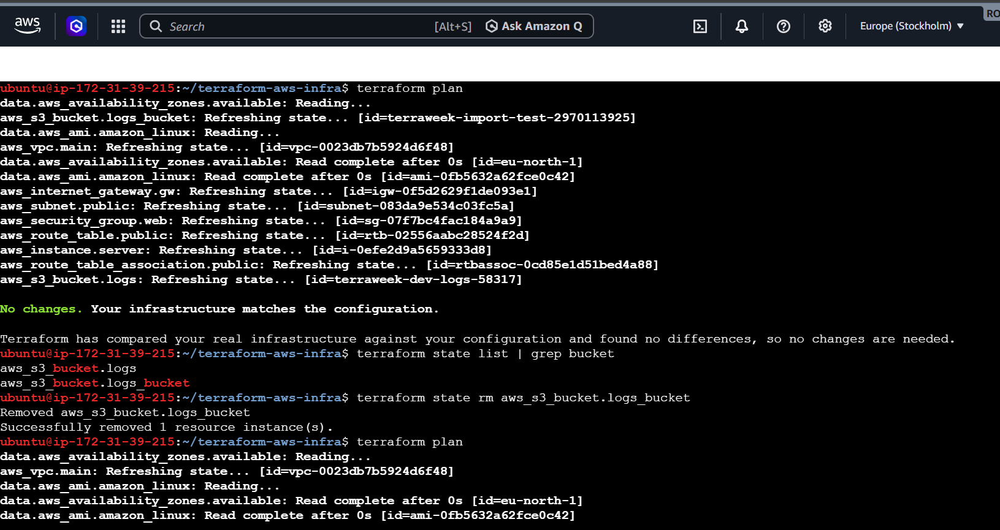

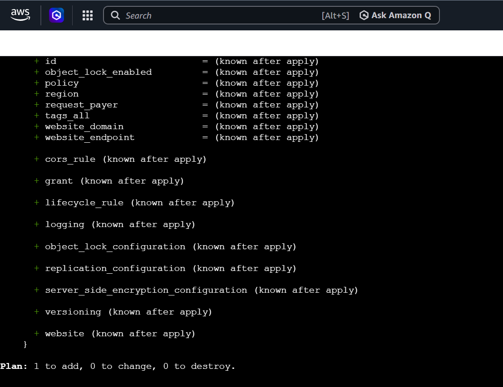

**Step 3 – Import it back**

```bash
terraform import aws_s3_bucket.logs_bucket terraweek-import-test-2970113925
terraform plan
terraform state list
```

Expected: `Import successful!` then **No changes**.

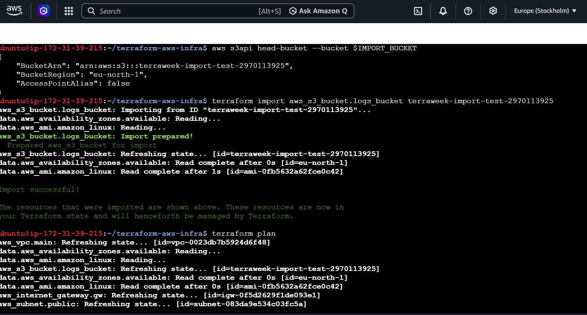

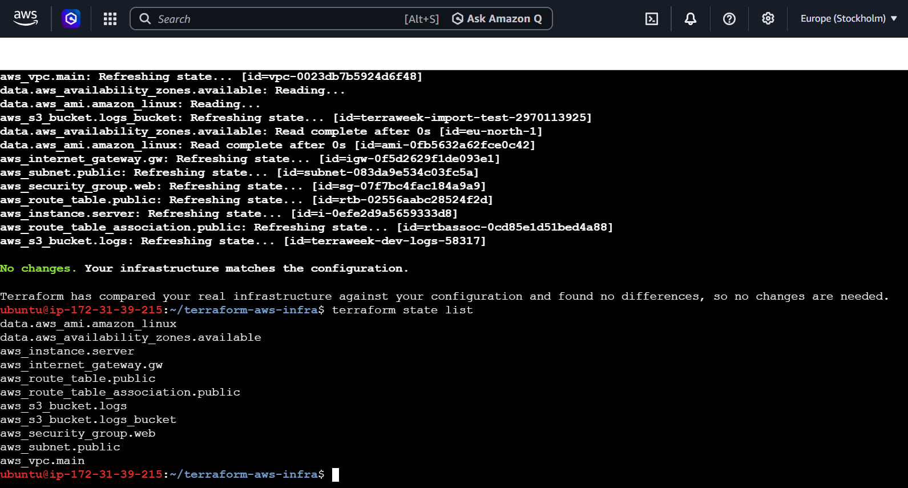

### Answers

**When would you use `state mv` in a real project?**
- You want to **rename** a resource in code without destroying and recreating it.
- You **move a resource into or out of a module** while refactoring code.
- You want to reorganise your configuration but keep the same real infrastructure.

**When would you use `state rm`?**
- You want Terraform to **stop managing** a resource but **keep it in AWS** (for example, another team will own it).
- A resource was removed outside Terraform and you need to clean the state entry.
- You are splitting one big state into smaller ones.

---

## Task 6 – Simulate and Fix State Drift

### What
Change a resource by hand in the AWS Console, let Terraform **detect** it, then **fix** it.

### Why
**Drift** = reality no longer matches your code. It happens when someone edits AWS manually. If you do not catch it, your code lies about what is running.

### How

**Step 1 – Make sure everything is in sync**

```bash
terraform apply
terraform state show aws_instance.server | grep -A 6 "tags "
```

Expected: `No changes`, and the tag `"Name" = "terraweek-dev-server"`.

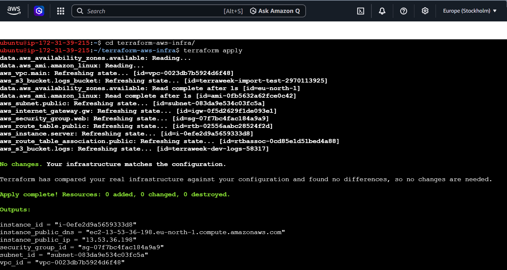

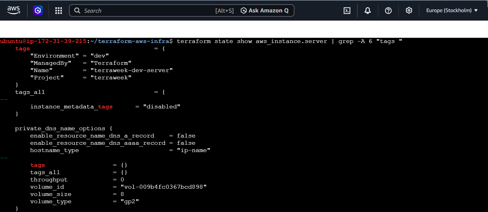

**Step 2 – Change a tag by hand in the Console**

1. AWS Console → **EC2** → **Instances** (check your region).
2. Select the instance `terraweek-dev-server`.
3. Open the **Tags** tab → **Manage tags**.
4. Change `Name` to **`ManuallyChanged`** → **Save**.

> I changed only a tag. It is safe. I did not touch the instance type, because changing it needs a stop/start.

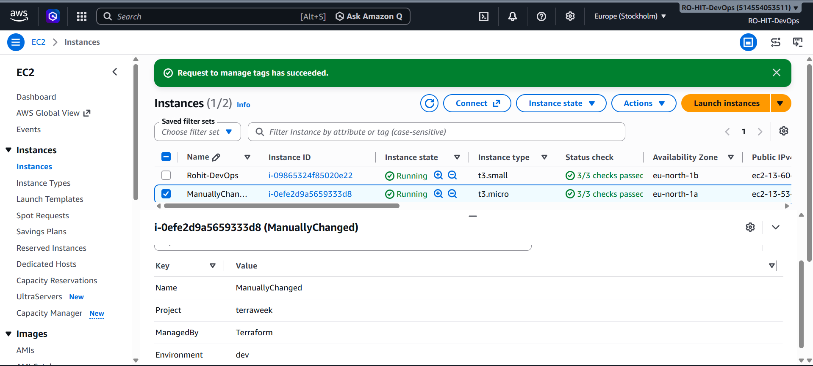

**Step 3 – Let Terraform detect the drift**

```bash
terraform plan
```

Terraform shows:

```
# aws_instance.server will be updated in-place
  ~ tags = {
      ~ "Name" = "ManuallyChanged" -> "terraweek-dev-server"
    }
Plan: 0 to add, 1 to change, 0 to destroy.
```

Check the symbols: `~` means **update in place** (safe). `-/+` would mean destroy and recreate (be careful).

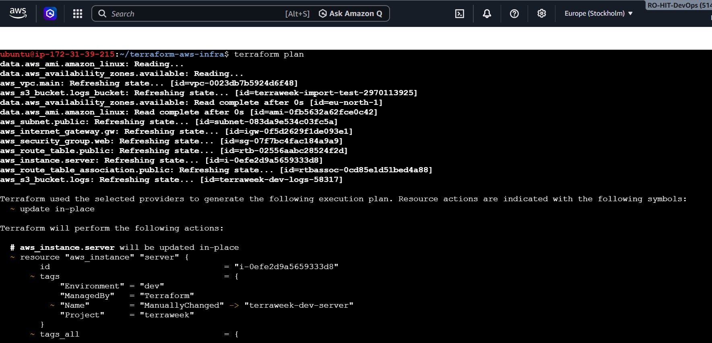

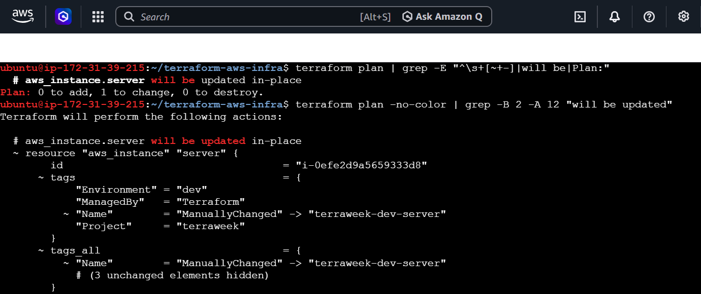

**Step 4 – Choose how to fix it**

| Option | Action | Result |
|---|---|---|
| **A – Reconcile** | `terraform apply` | AWS is changed back to match your code |
| B – Accept | Edit `.tf` to the new value | Your code follows the manual change |

I chose **Option A**.

**Step 5 – Apply**

```bash
terraform apply        # type yes
```

Expected: `Apply complete! Resources: 0 added, 1 changed, 0 destroyed.`

**Step 6 – Verify the tag and that drift is gone**

```bash
aws ec2 describe-tags --filters "Name=resource-id,Values=<your-instance-id>" "Name=key,Values=Name" --region eu-north-1 --query "Tags[0].Value"
terraform plan
```

Expected: `"terraweek-dev-server"` and then **No changes**.

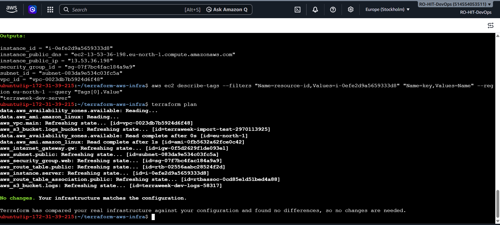

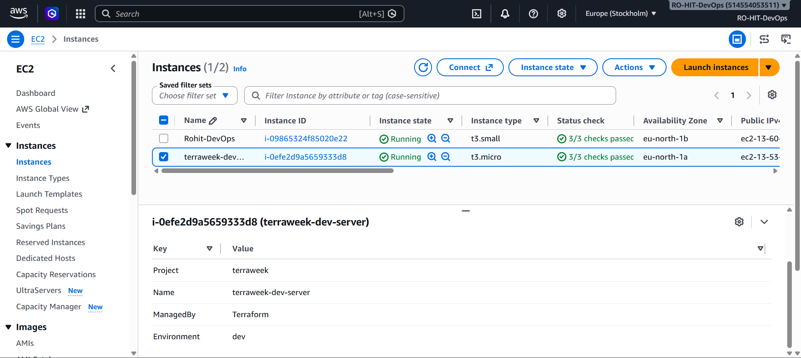

### Answer

**How do teams prevent state drift in production?**
- **Restrict Console access.** Give people read-only access; only the pipeline can write.
- **Use CI/CD for every change.** Changes go through a pull request, review, and an automated `terraform apply`.
- **Run `terraform plan` on a schedule** (for example daily) to detect drift early.
- **Turn on alerts** (CloudTrail, AWS Config) to know when someone changes resources manually.
- **Use remote state with locking** so only one trusted process changes infrastructure.

---

## Problems I faced and how I fixed them

| Problem | Cause | Fix |
|---|---|---|
| `aws: Unknown options: --region, ...` | Multi-line command pasted with a space after `\` | Write the command on **one line** |
| `AccessDeniedException ... dynamodb:CreateTable` | IAM user had no DynamoDB permission | Admin attached DynamoDB permission |
| `Error loading state ... S3 HeadObject 403 Forbidden` | IAM **permissions boundary** blocked S3 actions | Admin allowed `ListBucket/GetObject/PutObject/DeleteObject` on the state bucket |
| `Backend initialization required` right after adding the block | Backend config changed but `init` not run yet | Run `terraform init` |
| `backend` block outside `terraform {}` | Pasted in the wrong place in the file | Move it **inside** `terraform { ... }` |
| `apply` gave `UnauthorizedOperation ... ec2:DescribeImages` | Permissions boundary also blocked EC2 read actions | Permissions were fixed by the admin |
| `apply` finished instantly during lock test | No changes = no prompt = no lock held | Added a temporary output to force a prompt |
| `no: command not found` | Typed `no` in the shell, not at the Terraform prompt | Type `no` in the terminal that shows `Enter a value:` |

---

## Cleanup (avoid AWS bills)

Do this after your documentation and screenshots are done.

**1. Destroy everything Terraform manages**

```bash
cd ~/terraform-aws-infra
terraform destroy        # type yes
```

**2. Delete the state bucket (it is versioned, so remove all versions first)**

```bash
export BUCKET="terraweek-state-1476613341"

aws s3api list-object-versions --bucket $BUCKET --query '{Objects: Versions[].{Key:Key,VersionId:VersionId}}' --output json > /tmp/versions.json
aws s3api delete-objects --bucket $BUCKET --delete file:///tmp/versions.json

aws s3api list-object-versions --bucket $BUCKET --query '{Objects: DeleteMarkers[].{Key:Key,VersionId:VersionId}}' --output json > /tmp/markers.json
aws s3api delete-objects --bucket $BUCKET --delete file:///tmp/markers.json

aws s3api delete-bucket --bucket $BUCKET --region eu-north-1
```

(If a list command returns `null`, there is nothing of that kind to delete. Skip that step.)

**3. Delete the lock table**

```bash
aws dynamodb delete-table --table-name terraweek-state-lock --region eu-north-1
```

---

## Summary

| Task | Command(s) | Lesson |
|---|---|---|
| 1 | `terraform state list`, `state show`, `show` | State stores far more than your `.tf` code |
| 2 | `backend "s3"` + `terraform init` | Remote state is safe, shared and versioned |
| 3 | two terminals, `plan` during `apply` | A lock stops two people corrupting state |
| 4 | `terraform import` | Brings existing resources under Terraform |
| 5 | `state mv`, `state rm` | Edit state without touching real infrastructure |
| 6 | `plan` then `apply` | Plan detects drift; apply restores your desired state |

### Golden rules of state

1. **Never edit** `terraform.tfstate` by hand.
2. **Never commit** state files to Git (they can contain secrets).
3. Always use a **remote backend with locking and versioning** for team work.
4. **Back up** state before `mv`, `rm` or any surgery.
5. After `state rm`, **do not `apply`** until you import the resource back.
6. Use `force-unlock` only for a truly **stale** lock.

---
*
