# Day 65 - Terraform Modules: Build Reusable Infrastructure

Welcome to Day 65. Today we learn **Terraform Modules**. If you have never used a module before, do not worry. This guide starts from zero and explains every step as **What**, **Why** and **How**.

> **Before you start:** You should know the basics from the earlier Terraform days (providers, resources, variables, outputs, `init`, `plan`, `apply`, `destroy`). You also need an AWS account and Terraform installed on a Linux machine (I used an Ubuntu EC2 instance). My AWS region is `eu-north-1` (Stockholm).

---

## Table of Contents

1. [What is a module and why use it?](#what-is-a-module-and-why-use-it)
2. [Task 1: Understand the module structure](#task-1-understand-the-module-structure)
3. [Task 2: Build a Security Group module](#task-2-build-a-security-group-module)
4. [Task 3: Build an EC2 Instance module](#task-3-build-an-ec2-instance-module)
5. [Task 4: Call the modules from a root module](#task-4-call-the-modules-from-a-root-module)
6. [Task 5: Use a public registry module (VPC)](#task-5-use-a-public-registry-module-vpc)
7. [Task 6: Versioning and best practices](#task-6-versioning-and-best-practices)
8. [Five module best practices](#five-module-best-practices)
9. [Key learnings](#key-learnings)

---

## What is a module and why use it?

**What:** A module is just a folder with Terraform files (`.tf`) inside it. Every Terraform project is already a module. The folder you run `terraform apply` in is called the **root module**. Other modules that you call from it are called **child modules**.

**Why:** Imagine you need two EC2 servers. Without modules, you copy and paste the same 20 lines twice. For ten servers, you paste ten times. If you need to change something, you fix it in ten places. With a module, you write the code **once** and call it as many times as you want with different inputs.

Think of a module like a **function** in programming:

| Programming | Terraform module |
|---|---|
| Function parameters | `variables.tf` (inputs) |
| Function body | `main.tf` (the real resources) |
| Return value | `outputs.tf` (outputs) |
| Calling the function | `module "name" { source = "..." }` |

**How:** Every module normally has three files:

- `variables.tf`: what the module **needs** (inputs)
- `main.tf`: what the module **creates** (resources)
- `outputs.tf`: what the module **gives back** (outputs)

---

## Task 1: Understand the module structure

**What:** Create the project folder and the file layout for our root module and two child modules.

**Why:** A clean folder structure makes it easy to find things. Keeping each module in its own folder means we can reuse it later.

**How:**

```bash
mkdir -p ~/terraform-modules/modules/ec2-instance
mkdir -p ~/terraform-modules/modules/security-group
cd ~/terraform-modules
```

Then create the files. The final structure looks like this:

```
terraform-modules/
├── main.tf                  # Root module: calls the child modules
├── variables.tf             # Root inputs
├── outputs.tf               # Root outputs
├── providers.tf             # AWS provider and region
└── modules/
    ├── ec2-instance/
    │   ├── main.tf
    │   ├── variables.tf
    │   └── outputs.tf
    └── security-group/
        ├── main.tf
        ├── variables.tf
        └── outputs.tf
```

**Output:**

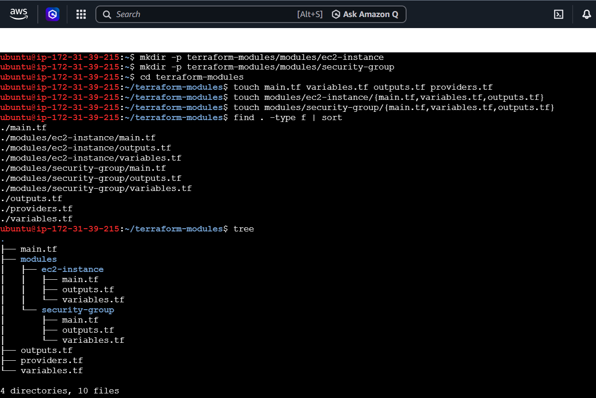

---

## Task 2: Build a Security Group module

**What:** A reusable module that creates one AWS Security Group. A security group is a virtual firewall that decides which network traffic can reach your server.

**Why:** Almost every server needs a security group. If we put it in a module, any project can create one by passing just a name, a VPC and a list of ports.

### Step 1: Inputs (`modules/security-group/variables.tf`)

```hcl
variable "vpc_id" {
  description = "VPC where the security group will be created"
  type        = string
}

variable "sg_name" {
  description = "Name of the security group"
  type        = string
}

variable "ingress_ports" {
  description = "List of ports to allow from anywhere"
  type        = list(number)
  default     = [22, 80]
}

variable "tags" {
  description = "Tags to attach to the security group"
  type        = map(string)
  default     = {}
}
```

**Explanation:**

- `type = string` means the value must be text. `list(number)` means a list of numbers. `map(string)` means key/value pairs (like tags).
- A variable with a `default` is **optional**. A variable without a default is **required**. The caller must give a value.

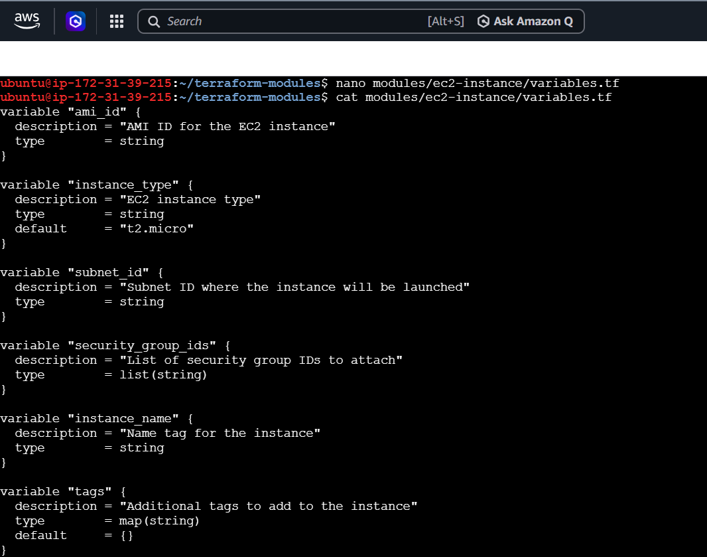

### Step 2: The resource and outputs (`main.tf` and `outputs.tf`)

```hcl
# modules/security-group/main.tf
resource "aws_security_group" "this" {
  name        = var.sg_name
  description = "Managed by Terraform"
  vpc_id      = var.vpc_id

  # Creates one ingress (incoming) rule for every port in the list
  dynamic "ingress" {
    for_each = var.ingress_ports
    content {
      from_port   = ingress.value
      to_port     = ingress.value
      protocol    = "tcp"
      cidr_blocks = ["0.0.0.0/0"]
    }
  }

  # Allow all outgoing traffic
  egress {
    from_port   = 0
    to_port     = 0
    protocol    = "-1"
    cidr_blocks = ["0.0.0.0/0"]
  }

  tags = merge(var.tags, {
    Name = var.sg_name
  })
}
```

```hcl
# modules/security-group/outputs.tf
output "sg_id" {
  description = "ID of the security group"
  value       = aws_security_group.this.id
}
```

**Explanation:**

- `aws_security_group "this"`: `this` is just a common name for the only resource inside a module.
- `dynamic "ingress"` + `for_each`: instead of writing three separate rules for ports 22, 80 and 443, Terraform loops over the list and builds one rule per port.
- `merge(var.tags, { Name = ... })` joins two maps into one. This adds the `Name` tag on top of the common tags.
- The output `sg_id` lets the root module (and other modules) use this security group's ID.

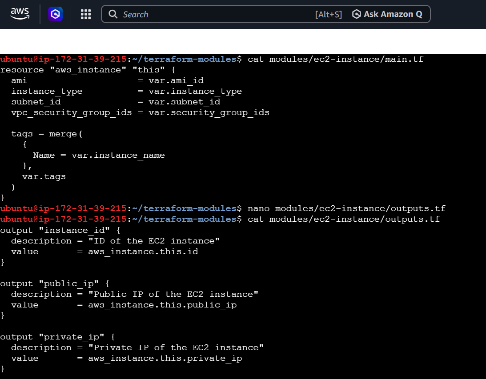

---

## Task 3: Build an EC2 Instance module

**What:** A reusable module that creates one EC2 virtual machine.

**Why:** We need two servers (web and API). Instead of writing the EC2 code twice, we write it once and call the module twice.

### Step 1: Inputs (`modules/ec2-instance/variables.tf`)

```hcl
variable "ami_id" {
  description = "AMI (operating system image) to use"
  type        = string
}

variable "instance_type" {
  description = "Size of the instance"
  type        = string
  default     = "t3.micro"
}

variable "subnet_id" {
  description = "Subnet to launch the instance in"
  type        = string
}

variable "security_group_ids" {
  description = "List of security group IDs"
  type        = list(string)
}

variable "instance_name" {
  description = "Value of the Name tag"
  type        = string
}

variable "tags" {
  description = "Common tags"
  type        = map(string)
  default     = {}
}
```

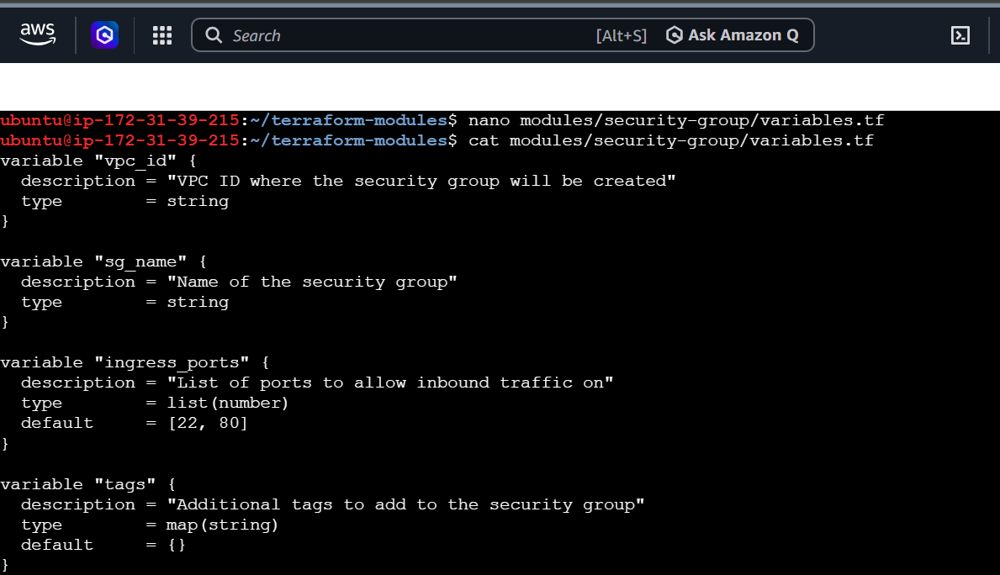

### Step 2: The resource (`main.tf`)

```hcl
resource "aws_instance" "this" {
  ami                    = var.ami_id
  instance_type          = var.instance_type
  subnet_id              = var.subnet_id
  vpc_security_group_ids = var.security_group_ids

  tags = merge(var.tags, {
    Name = var.instance_name
  })
}
```

**Explanation:** Every value comes from a variable. Nothing is hardcoded, so the same module can create a web server, an API server or anything else.

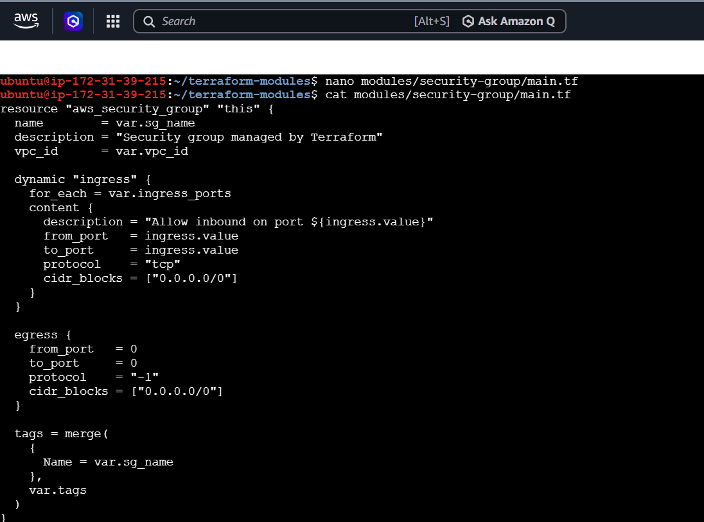

### Step 3: Outputs (`outputs.tf`)

```hcl
output "instance_id" {
  value = aws_instance.this.id
}

output "public_ip" {
  value = aws_instance.this.public_ip
}

output "private_ip" {
  value = aws_instance.this.private_ip
}
```

**Explanation:** Outputs are the only way the outside world can read values from inside a module. Here we expose the instance ID and both IP addresses.

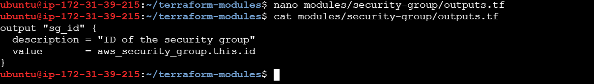

---

## Task 4: Call the modules from a root module

**What:** Write the **root module**. It builds a network (VPC, subnet, internet gateway, route table), then uses our two child modules to create one security group and two EC2 servers.

**Why:** Child modules are only blueprints. Nothing is created until a root module calls them.

### Step 1: Provider and variables

`providers.tf` tells Terraform to talk to AWS in the Stockholm region:

```hcl
terraform {
  required_providers {
    aws = {
      source  = "hashicorp/aws"
      version = "~> 5.0"
    }
  }
}

provider "aws" {
  region = "eu-north-1"
}
```

`variables.tf` holds the root inputs:

```hcl
variable "project_name" { default = "terraweek" }
variable "environment"  { default = "dev" }
variable "vpc_cidr"     { default = "10.0.0.0/16" }
variable "subnet_cidr"  { default = "10.0.1.0/24" }
variable "instance_type" { default = "t3.micro" }
```

**Explanation:** `~> 5.0` means "any 5.x version". CIDR blocks like `10.0.0.0/16` define the private IP range of the network.

### Step 2: Locals, AMI lookup and network (`main.tf`)

```hcl
locals {
  common_tags = {
    Project     = var.project_name
    Environment = var.environment
    ManagedBy   = "Terraform"
  }
}

data "aws_ami" "amazon_linux" {
  most_recent = true
  owners      = ["amazon"]

  filter {
    name   = "name"
    values = ["al2023-ami-2023.*-x86_64"]
  }

  filter {
    name   = "virtualization-type"
    values = ["hvm"]
  }
}
```

**Explanation:**

- `locals` are like private variables. We define the common tags **once** and reuse them everywhere with `local.common_tags`.
- `data "aws_ami"` **reads** existing information from AWS (it does not create anything). It finds the newest Amazon Linux 2023 image so we never hardcode an AMI ID (AMI IDs differ per region).

Now the hand-written network:

```hcl
resource "aws_vpc" "main" {
  cidr_block           = var.vpc_cidr
  enable_dns_support   = true
  enable_dns_hostnames = true
  tags = merge(local.common_tags, { Name = "${var.project_name}-vpc" })
}

resource "aws_subnet" "public" {
  vpc_id                  = aws_vpc.main.id
  cidr_block              = var.subnet_cidr
  map_public_ip_on_launch = true
  tags = merge(local.common_tags, { Name = "${var.project_name}-public-subnet" })
}

resource "aws_internet_gateway" "main" {
  vpc_id = aws_vpc.main.id
  tags   = merge(local.common_tags, { Name = "${var.project_name}-igw" })
}

resource "aws_route_table" "public" {
  vpc_id = aws_vpc.main.id

  route {
    cidr_block = "0.0.0.0/0"
    gateway_id = aws_internet_gateway.main.id
  }

  tags = merge(local.common_tags, { Name = "${var.project_name}-public-rt" })
}

resource "aws_route_table_association" "public" {
  subnet_id      = aws_subnet.public.id
  route_table_id = aws_route_table.public.id
}
```

**Explanation (what each piece does):**

| Resource | Purpose |
|---|---|
| `aws_vpc` | Your own private network in AWS |
| `aws_subnet` | A smaller section of the VPC where servers live |
| `aws_internet_gateway` | The door between the VPC and the internet |
| `aws_route_table` | Rules that say "send internet traffic to the gateway" |
| `aws_route_table_association` | Connects the route table to the subnet |

`map_public_ip_on_launch = true` means servers in this subnet automatically get a public IP.

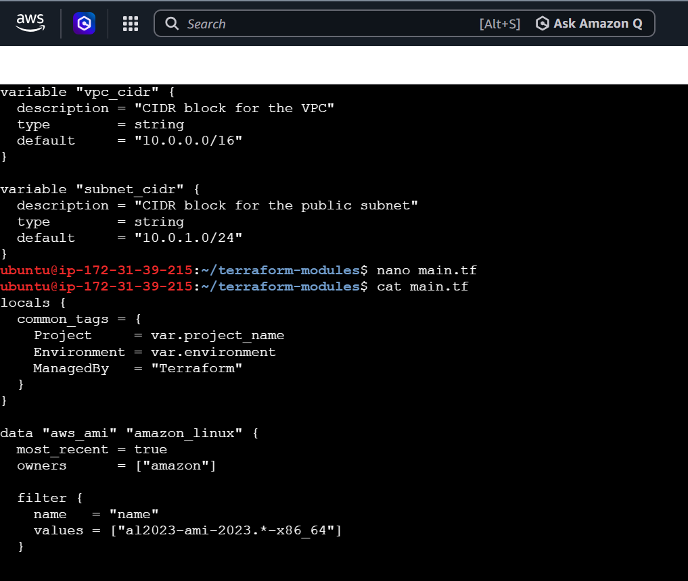

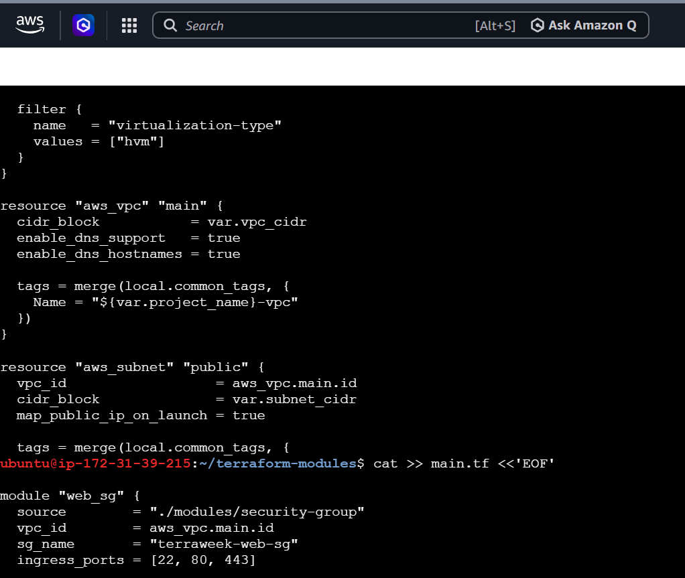

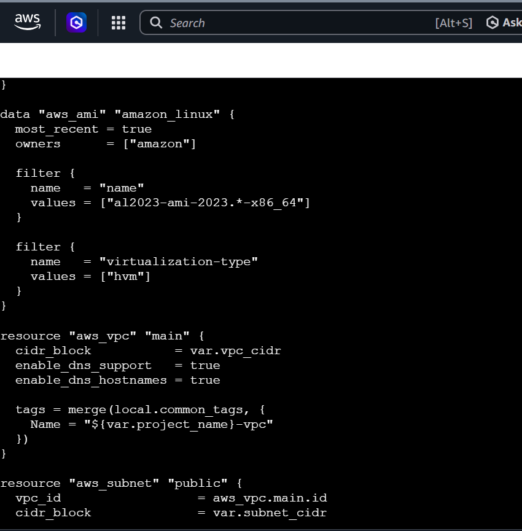

### Step 3: Calling the modules

```hcl
module "web_sg" {
  source        = "./modules/security-group"
  vpc_id        = aws_vpc.main.id
  sg_name       = "terraweek-web-sg"
  ingress_ports = [22, 80, 443]
  tags          = local.common_tags
}

module "web_server" {
  source             = "./modules/ec2-instance"
  ami_id             = data.aws_ami.amazon_linux.id
  instance_type      = var.instance_type
  subnet_id          = aws_subnet.public.id
  security_group_ids = [module.web_sg.sg_id]
  instance_name      = "terraweek-web"
  tags               = local.common_tags
}

module "api_server" {
  source             = "./modules/ec2-instance"
  ami_id             = data.aws_ami.amazon_linux.id
  instance_type      = var.instance_type
  subnet_id          = aws_subnet.public.id
  security_group_ids = [module.web_sg.sg_id]
  instance_name      = "terraweek-api"
  tags               = local.common_tags
}
```

**Explanation:**

- `source = "./modules/ec2-instance"` points to the local folder of the module.
- We call the **same** `ec2-instance` module twice with different names. This is the power of modules: one blueprint, two servers.
- `module.web_sg.sg_id` reads the **output** of the security group module and passes it as an **input** to the EC2 module. This is how modules talk to each other. Terraform also understands that the security group must be created first.

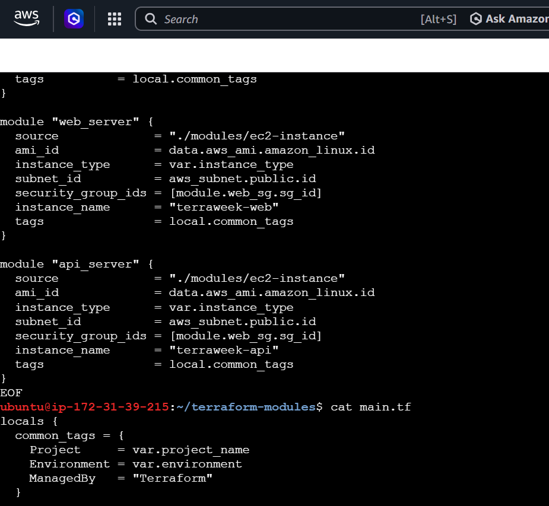

### Step 4: Root outputs (`outputs.tf`)

```hcl
output "web_server_ip" {
  value = module.web_server.public_ip
}

output "api_server_ip" {
  value = module.api_server.public_ip
}

output "security_group_id" {
  value = module.web_sg.sg_id
}

output "vpc_id" {
  value = aws_vpc.main.id
}
```

**Explanation:** After `apply`, Terraform prints these four values so we can see the IPs without opening the AWS console.

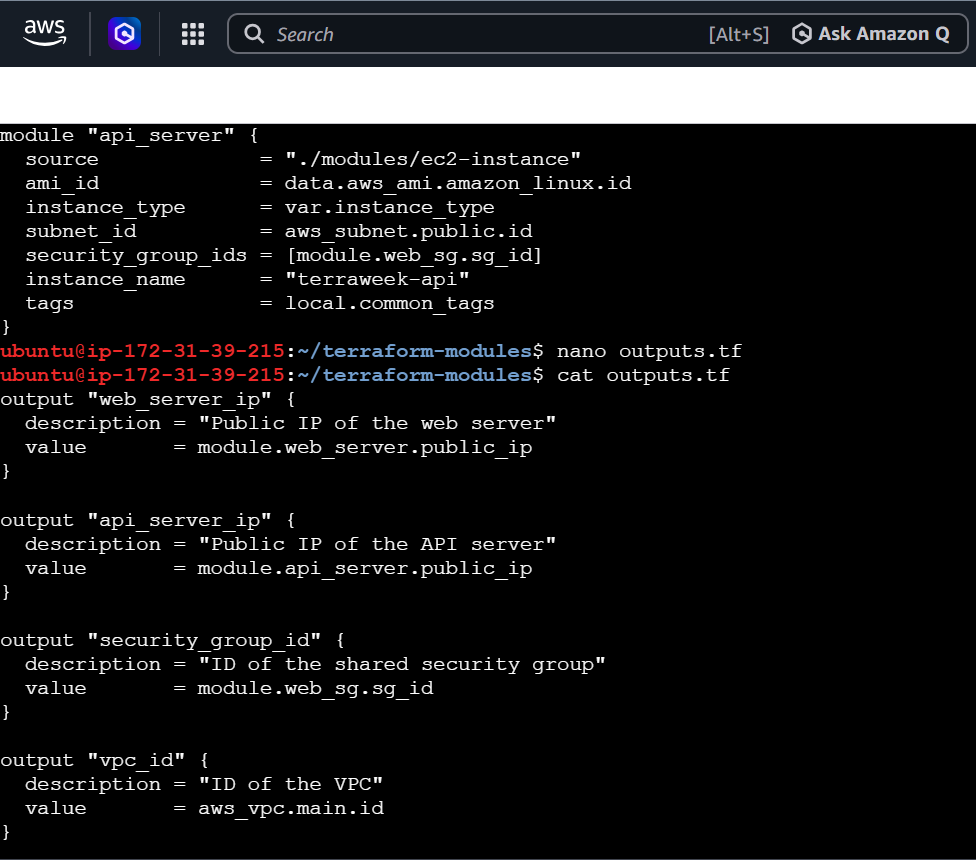

### Step 5: Run Terraform

**`terraform init`** downloads the AWS provider and finds our local modules. **`terraform validate`** checks that the code is correct.

```bash
terraform init
terraform validate
```

You should see `Success! The configuration is valid.`

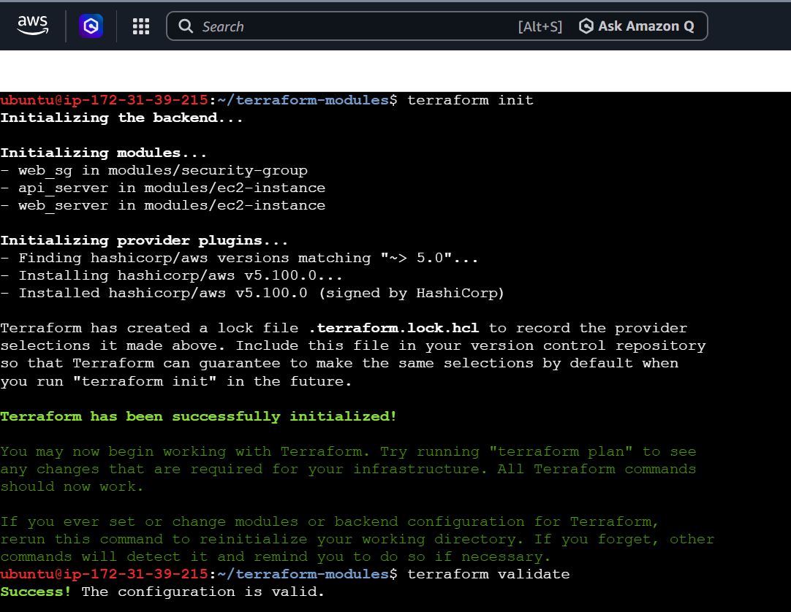

**`terraform plan`** shows what Terraform **will** do without changing anything.

```bash
terraform plan
```

We expect `Plan: 8 to add, 0 to change, 0 to destroy.` That is: VPC, subnet, internet gateway, route table, route table association (5), plus one security group and two EC2 instances (3).

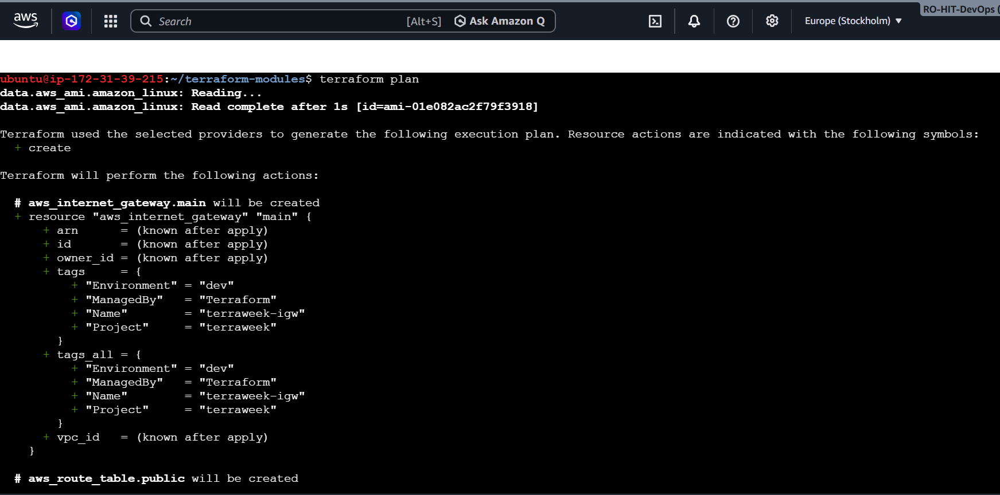

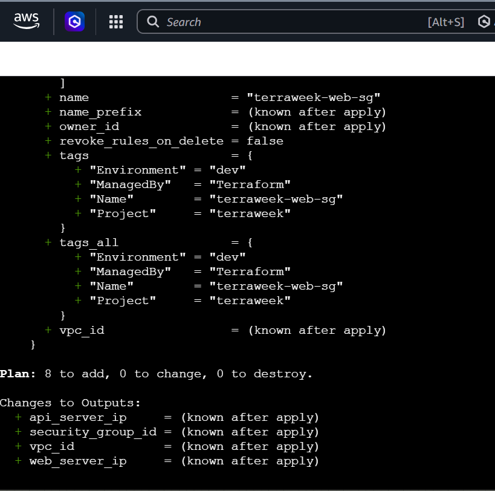

**`terraform apply`** creates the real infrastructure. Type `yes` when asked.

```bash
terraform apply
```

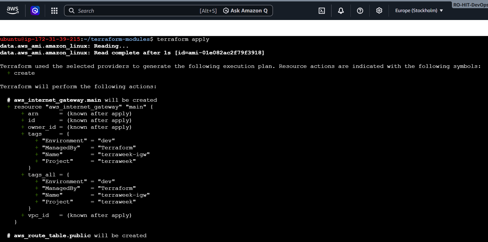

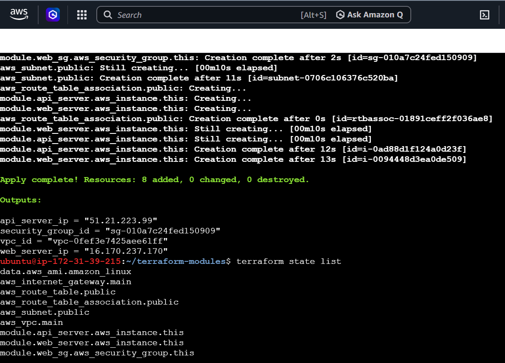

### Step 6: Verify in the AWS Console

Open **EC2 > Instances**. You should see `terraweek-web` and `terraweek-api` in the **Running** state with public IPs.

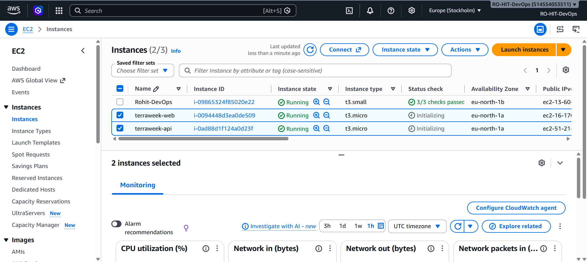

Select an instance and open the **Security** tab. Both servers use the same security group `terraweek-web-sg` with inbound ports 22, 80 and 443.

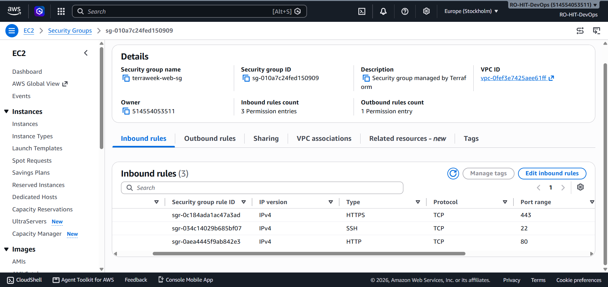

Open the **Tags** tab. You will see `Name` plus `Project`, `Environment` and `ManagedBy`. This proves `merge()` combined the instance name with the common tags.

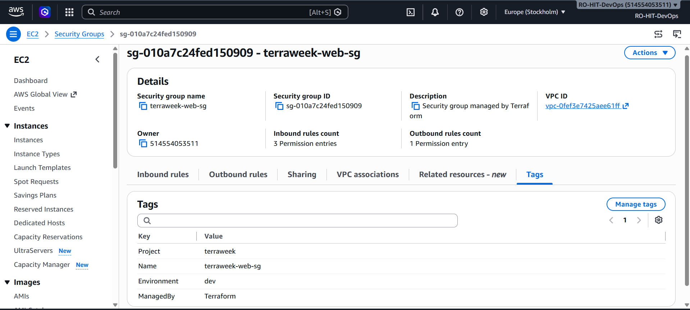

---

## Task 5: Use a public registry module (VPC)

**What:** Replace our 5 hand-written network resources with the official VPC module from the [Terraform Registry](https://registry.terraform.io).

**Why:** Other people have already built and tested modules for common things like a VPC. Using them saves time and avoids mistakes.

**How:**

### Step 1: Replace the VPC code in `main.tf`

Delete `aws_vpc`, `aws_subnet`, `aws_internet_gateway`, `aws_route_table` and `aws_route_table_association`. Add:

```hcl
module "vpc" {
  source  = "terraform-aws-modules/vpc/aws"
  version = "~> 5.0"

  name = "terraweek-vpc"
  cidr = "10.0.0.0/16"

  azs             = ["eu-north-1a", "eu-north-1b"]
  public_subnets  = ["10.0.1.0/24", "10.0.2.0/24"]
  private_subnets = ["10.0.3.0/24", "10.0.4.0/24"]

  enable_nat_gateway      = false
  enable_dns_hostnames    = true
  map_public_ip_on_launch = true

  tags = local.common_tags
}
```

> **Note:** The task example uses `ap-south-1a`. Always use Availability Zones from **your own region**. Mine is `eu-north-1`.

**Explanation:**

- `source = "terraform-aws-modules/vpc/aws"` is a registry address (`namespace/name/provider`). Terraform downloads it automatically.
- `azs` lists the Availability Zones (separate data centers). We make subnets in two of them.
- `public_subnets` get a route to the internet. `private_subnets` do not.
- `enable_nat_gateway = false` avoids a NAT gateway, which costs money every hour.
- `map_public_ip_on_launch = true` is explained in the "gotcha" below.

### Step 2: Update the references

```hcl
# security group module
vpc_id = module.vpc.vpc_id

# web_server and api_server modules
subnet_id = module.vpc.public_subnets[0]
```

In `outputs.tf`, change `aws_vpc.main.id` to `module.vpc.vpc_id`.

`public_subnets[0]` means "the first public subnet in the list".

### Step 3: Init, plan, apply

```bash
terraform init
terraform plan
terraform apply
```

`init` downloads the registry module. The plan said:

```
Plan: 20 to add, 0 to change, 8 to destroy.
```

**Why 8 destroys?** The VPC changed, so Terraform had to delete the old network and replace the security group and both servers too (they live inside the VPC).

### Gotcha I hit: empty public IPs

After the first apply, `web_server_ip` and `api_server_ip` were **empty**. The reason: the registry module has `map_public_ip_on_launch = false` by default, while my hand-written subnet had `true`. Check the default in the module code:

```bash
grep -n "map_public_ip_on_launch" -A3 .terraform/modules/vpc/variables.tf
```

The fix was to add `map_public_ip_on_launch = true` to the module and replace the instances:

```bash
terraform apply \
  -replace='module.web_server.aws_instance.this' \
  -replace='module.api_server.aws_instance.this'
```

Result: `Apply complete! Resources: 2 added, 2 changed, 2 destroyed.` and both servers got public IPs.

**Lesson:** Registry modules can have different defaults from what you used before. Always read a module's `variables.tf`.

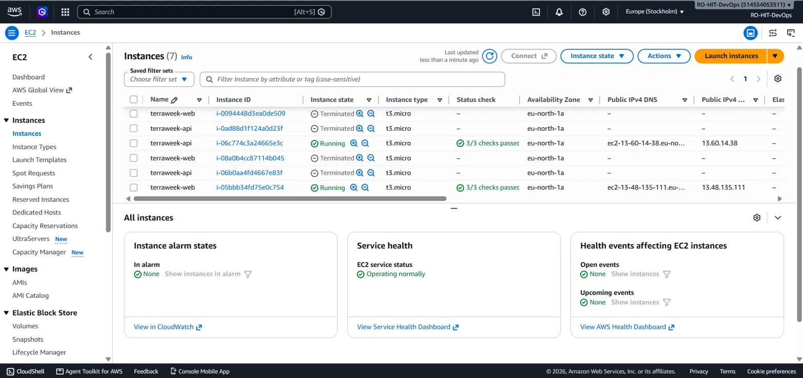

### Where does Terraform download registry modules?

Into the hidden folder `.terraform/modules/` inside your project:

```bash
ls .terraform/modules/
cat .terraform/modules/modules.json
ls .terraform/modules/vpc
```

- `modules.json` lists every module, its source and its version (the VPC module was `5.21.0`).
- `.terraform/modules/vpc/` holds the module's real code (`main.tf`, `variables.tf`, `outputs.tf`).
- Do **not** commit this folder to Git. Add `.terraform/` to `.gitignore`.

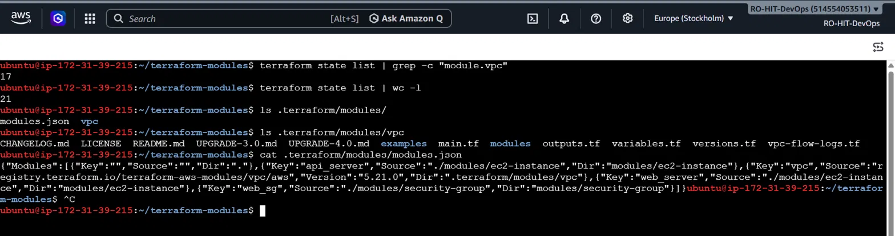

### Comparison: hand-written VPC vs registry module

| | Hand-written | Registry module |
|---|---|---|
| Resources created | **5** | **17** |
| Subnets | 1 public | 2 public + 2 private |
| Route tables | 1 | 3 (1 public + 2 private) |
| Extras | none | default NACL, default route table, default security group |
| Lines of code | ~40 | ~15 |

The module gives a much more complete network with far less code. In total we now have 20 resources (17 + 1 security group + 2 EC2). `terraform state list` shows 21 lines because it also lists the `data.aws_ami` data source (which is not a real resource).

---

## Task 6: Versioning and best practices

**What:** Learn how to lock the version of a registry module, see how modules look in the state, and clean up.

**Why:** If a module author releases a new version with breaking changes, your code could suddenly behave differently. Pinning the version keeps your infrastructure predictable.

### Step 1: Three ways to pin a version

```hcl
version = "5.1.0"            # Exact: only this version, never changes
version = "~> 5.0"           # Any 5.x version (5.0, 5.21, ...) but never 6.0
version = ">= 5.0, < 6.0"    # A range, same meaning as ~> 5.0 here
```

I changed my module to the range form and checked it:

```bash
sed -i 's/version = "~> 5.0"/version = ">= 5.0, < 6.0"/' main.tf
grep -n "version" main.tf
```

### Step 2: Check for newer versions

```bash
terraform init -upgrade
```

`-upgrade` tells Terraform to look for the newest version that fits the rule. It kept `5.21.0`, because that is the newest 5.x. The AWS provider stayed at `v5.100.0`.

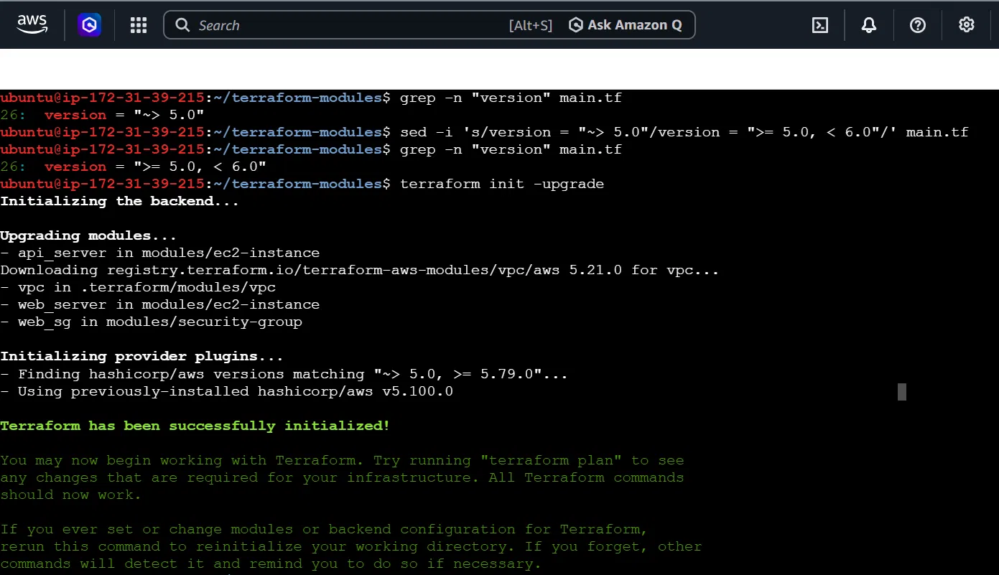

### Step 3: See how modules appear in state

```bash
terraform state list
```

Notice the prefixes: `module.vpc.`, `module.web_sg.`, `module.web_server.` and `module.api_server.`. Each prefix tells you which module owns the resource. Without modules you would see a long flat list.

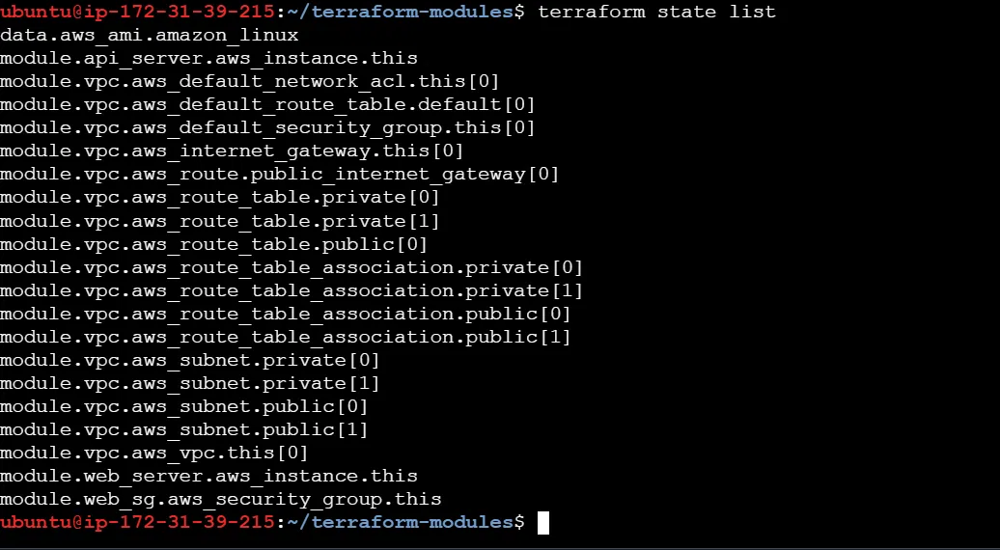

### Step 4: Destroy everything

To avoid AWS charges, delete all resources:

```bash
terraform destroy
```

Type `yes`. At the end you should see `Destroy complete! Resources: 20 destroyed.` Then check:

```bash
terraform state list
```

It should print nothing, which means the state is empty.

---

## Five module best practices

1. **Always pin versions for registry modules.** Use `~> 5.0` or an exact version so updates never surprise you.
2. **Keep modules focused.** One module should do one job (security group, EC2, VPC), not everything.
3. **Use variables for everything, hardcode nothing.** Names, sizes and CIDRs should be inputs so the module is reusable.
4. **Always define outputs.** Without outputs, the caller cannot use IDs or IPs created inside the module (like `module.web_sg.sg_id`).
5. **Add a `README.md` to every custom module.** Explain what it does, its inputs, its outputs and a usage example.

---

## Key learnings

- A **module** is a folder of `.tf` files. It is like a function: inputs (`variables`), logic (`main.tf`), return values (`outputs`).
- The folder you run Terraform in is the **root module**. It calls **child modules** using `module "name" { source = "..." }`.
- Modules talk to each other through outputs and inputs, like `module.web_sg.sg_id`.
- One module can be called many times (two EC2 servers from one module).
- The Terraform Registry gives ready-made modules. My hand-written VPC had **5** resources and the registry module created **17**.
- Registry modules can have different defaults (`map_public_ip_on_launch`). Always read the module's variables.
- Downloaded modules live in `.terraform/modules/`. Do not commit them.
- Always run `terraform destroy` after practice to avoid cost.
