# Day 66: Provision an EKS Cluster with Terraform Modules

> **#90DaysOfDevOps | #TerraWeek | #DevOpsKaJosh | #TrainWithShubham**

In the Kubernetes week we built clusters by hand. Today we build one the **DevOps way**: everything is written as code, created with one command, and deleted with one command.

**What we will build:**

- A **VPC** (our private network on AWS) using a Terraform registry module
- An **EKS cluster** (managed Kubernetes on AWS) with a **managed node group** (the worker servers)
- Connect **kubectl** to the cluster
- Run an **Nginx** web server on it and open it in the browser
- **Destroy everything** so we do not pay for it

This guide is written for a complete beginner. If you know basic Terraform (`init`, `plan`, `apply`, `destroy`), you can follow every step. Each task is explained in **What / Why / How** form, and every task ends with a screenshot of the result.

---

## Table of Contents

1. [Before you start](#before-you-start)
2. [Words you should know](#words-you-should-know)
3. [Big picture](#big-picture)
4. [Cost warning](#cost-warning)
5. [Task 1: Project setup](#task-1-project-setup)
6. [Task 2: Create the VPC](#task-2-create-the-vpc-with-a-registry-module)
7. [Task 3: Create the EKS cluster](#task-3-create-the-eks-cluster-with-a-registry-module)
8. [Task 4: Apply and connect kubectl](#task-4-apply-and-connect-kubectl)
9. [Task 5: Deploy Nginx](#task-5-deploy-a-workload-nginx)
10. [Task 6: Destroy everything](#task-6-destroy-everything)
11. [Summary and reflection](#summary-and-reflection)

---

## Before you start

### What
Make sure the tools and permissions are ready on the machine where you will type commands. I used an **Ubuntu EC2 instance** and a browser on my local PC.

### Why
If a tool is missing, you will get confusing errors later. A 2-minute check now saves a lot of time.

### How
Run these four commands. Each one should print a version or an account number, not an error.

```bash
terraform -version
aws --version
kubectl version --client
aws sts get-caller-identity
```

| Command | What it proves |
|---|---|
| `terraform -version` | Terraform is installed |
| `aws --version` | AWS CLI is installed |
| `kubectl version --client` | kubectl (the Kubernetes remote control) is installed |
| `aws sts get-caller-identity` | AWS CLI is logged in with your credentials |

You also need:

- An **AWS account** and an IAM user with enough permission to create VPC, EKS, EC2 and IAM resources. If you are only learning, `AdministratorAccess` on a practice account is the easiest.
- **Region:** I used `eu-north-1` (Stockholm). Use the region closest to you and keep it the same in every step.

---

## Words you should know

| Word | Simple meaning |
|---|---|
| **Terraform** | A tool that creates cloud resources from code files |
| **Module** | A ready-made, reusable Terraform package. Instead of writing 300 lines, you call it with a few settings |
| **Registry** | The public store of modules (registry.terraform.io) |
| **VPC** | Your own private network inside AWS |
| **Subnet** | A smaller part of the VPC. Public subnet = reachable from the internet. Private subnet = hidden from the internet |
| **NAT Gateway** | Lets servers in a private subnet go out to the internet (for example to download images) without letting the internet come in |
| **EKS** | Elastic Kubernetes Service. AWS runs the Kubernetes "brain" (control plane) for you |
| **Node / Node group** | The worker servers (EC2) where your containers actually run |
| **kubectl** | The command line tool to talk to a Kubernetes cluster |
| **Pod** | The smallest unit in Kubernetes. It runs one or more containers |
| **Deployment** | Tells Kubernetes "keep N copies of this pod running" |
| **Service (LoadBalancer)** | Gives your pods a stable address. Type `LoadBalancer` asks AWS to create a public load balancer |
| **IAM role** | A set of permissions given to an AWS service |

---

## Big picture

```
                          Internet
                             |
                    [ AWS Load Balancer ]   <- created by the nginx Service
                             |
   +---------------------- VPC 10.0.0.0/16 ----------------------+
   |                                                             |
   |   Public subnets (2 AZs)        Private subnets (2 AZs)     |
   |   - NAT Gateway                 - EKS worker node(s)        |
   |   - Load Balancer               - nginx pods                |
   |                                                             |
   +-------------------------------------------------------------+
                             |
               EKS control plane (managed by AWS)
```

Terraform builds the VPC and the EKS cluster. kubectl builds the nginx app on top.

---

## Cost warning

**EKS and the NAT Gateway charge money every hour**, even if you do nothing.

- EKS control plane: charged per hour
- NAT Gateway: about $0.045 per hour
- EC2 worker node: charged per hour

Do the lab in one sitting and **destroy everything at the end** (Task 6).

---

## Task 1: Project setup

### What
Create a new folder with a clean file structure, and write three files: `providers.tf`, `variables.tf` and `terraform.tfvars`.

### Why
Terraform reads every `.tf` file in a folder as one project. Splitting the code into separate files keeps it easy to read:

| File | Job |
|---|---|
| `providers.tf` | Which cloud (AWS) and which versions of the plugins |
| `vpc.tf` | The network |
| `eks.tf` | The Kubernetes cluster |
| `variables.tf` | The list of inputs (settings) with types and defaults |
| `outputs.tf` | Values to print after apply |
| `terraform.tfvars` | The actual values for the inputs |

### How

**Step 1: create the folder and empty files**

```bash
mkdir terraform-eks
cd terraform-eks
touch providers.tf vpc.tf eks.tf variables.tf outputs.tf terraform.tfvars
```

- `mkdir` makes the folder, `cd` goes inside, `touch` creates empty files.

**Final structure:**

```
terraform-eks/
├── providers.tf        # Provider and version config
├── vpc.tf              # VPC module call
├── eks.tf              # EKS module call
├── variables.tf        # All input variables
├── outputs.tf          # Cluster outputs
└── terraform.tfvars    # Variable values
```

### 1.1 `providers.tf`

**What:** Tell Terraform to use the AWS and Kubernetes providers, and which AWS region to use.

**Why:** A *provider* is the plugin that knows how to talk to a platform. Pinning the version (`~> 5.0`) means Terraform accepts any 5.x version but never jumps to 6.0, which could break your code.

**How:**

```hcl
terraform {
  required_version = ">= 1.5.0"

  required_providers {
    aws = {
      source  = "hashicorp/aws"
      version = "~> 5.0"
    }
    kubernetes = {
      source  = "hashicorp/kubernetes"
      version = "~> 2.0"
    }
  }
}

provider "aws" {
  region = var.region
}
```

- `required_providers` lists the plugins to download.
- `~> 5.0` means "5.0 or newer, but below 6.0".
- `region = var.region` reads the region from a variable, so you change it in one place only.

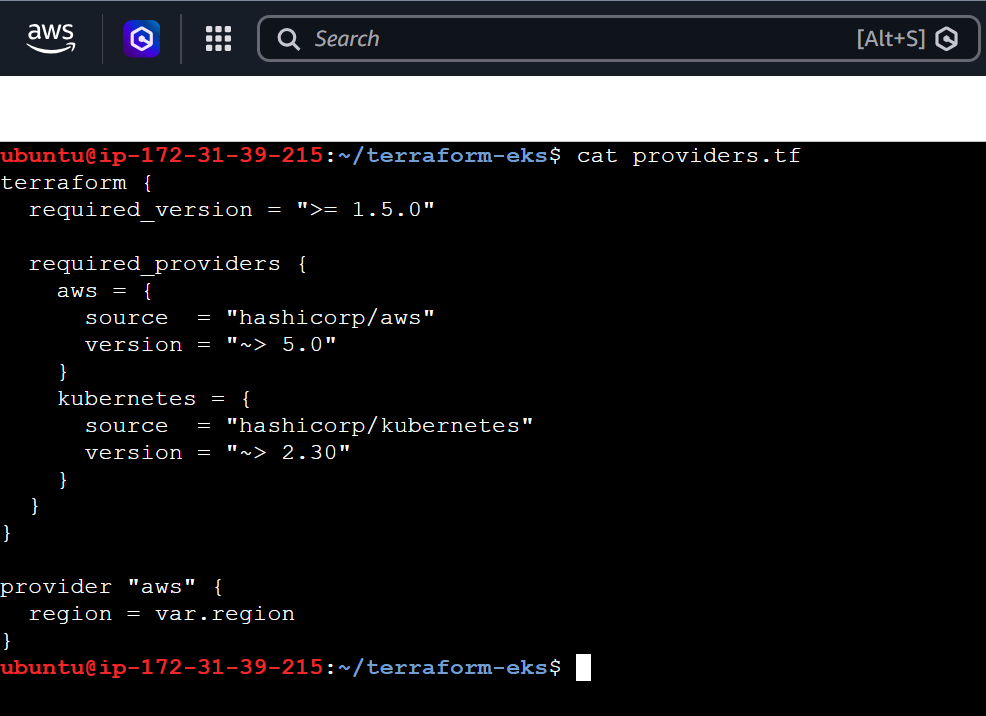

### 1.2 `variables.tf`

**What:** Declare all the inputs the project accepts.

**Why:** Variables make the code reusable. To build a bigger cluster you change one value, not ten lines of code.

**How:**

```hcl
variable "region" {
  description = "AWS region"
  type        = string
}

variable "cluster_name" {
  description = "Name of the EKS cluster"
  type        = string
  default     = "terraweek-eks"
}

variable "cluster_version" {
  description = "Kubernetes version"
  type        = string
  default     = "1.31"
}

variable "node_instance_type" {
  description = "EC2 instance type for worker nodes"
  type        = string
  default     = "t3.medium"
}

variable "node_desired_count" {
  description = "Number of worker nodes"
  type        = number
  default     = 2
}

variable "vpc_cidr" {
  description = "IP range of the VPC"
  type        = string
  default     = "10.0.0.0/16"
}
```

- `type` says what kind of value is allowed (`string` = text, `number` = number).
- `default` is used when you do not give a value. `region` has no default, so we must give it in `terraform.tfvars`.

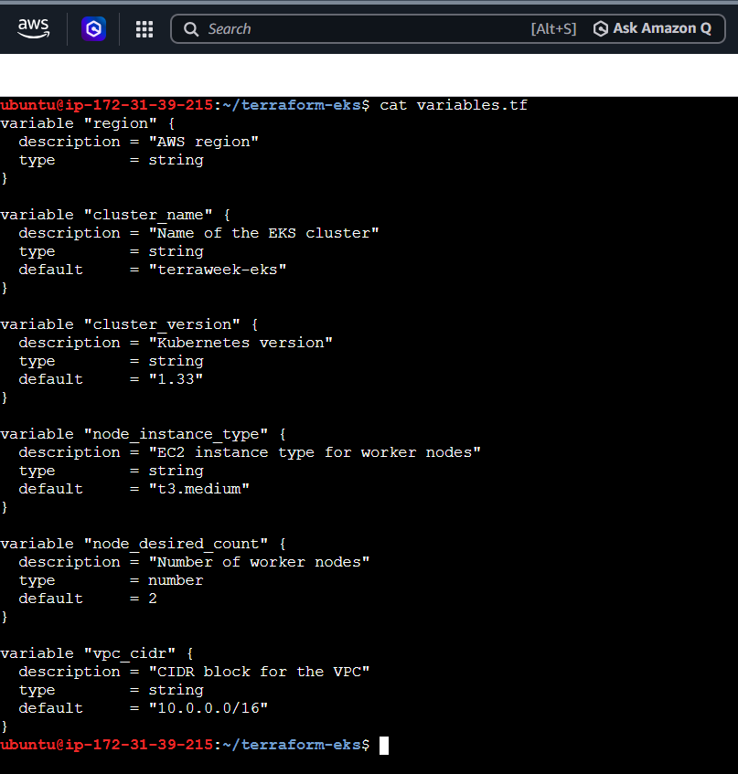

### 1.3 `terraform.tfvars`

**What:** Give real values to the variables.

**Why:** Terraform loads `terraform.tfvars` automatically. Values here override the defaults in `variables.tf`.

**How:**

```hcl
region             = "eu-north-1"
cluster_version    = "1.35"
node_instance_type = "t3.small"
node_desired_count = 1
```

> **Note about my changes:**
> - I used **`t3.small`** instead of `t3.medium` because my AWS account is on the **Free Tier plan, which did not allow `t3.medium`**. `t3.small` was allowed.
> - I used **1 node** instead of 2 to keep the cost low. All the pods still fit on one node.
> - I used a newer Kubernetes version (**1.35**), which is the version EKS offers today.

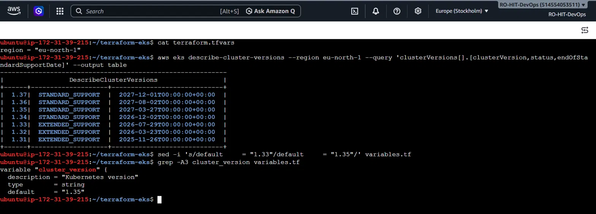

---

## Task 2: Create the VPC with a registry module

### What
Write `vpc.tf` and call the `terraform-aws-modules/vpc/aws` module. It creates the whole network: VPC, 2 public subnets, 2 private subnets, route tables, internet gateway and a NAT gateway.

### Why
EKS needs a network to live in. Building a VPC by hand needs 20+ resources. The module does it in about 25 lines.

### How

```hcl
data "aws_availability_zones" "available" {
  state = "available"
}

module "vpc" {
  source  = "terraform-aws-modules/vpc/aws"
  version = "~> 5.0"

  name = "${var.cluster_name}-vpc"
  cidr = var.vpc_cidr

  azs             = slice(data.aws_availability_zones.available.names, 0, 2)
  private_subnets = ["10.0.1.0/24", "10.0.2.0/24"]
  public_subnets  = ["10.0.101.0/24", "10.0.102.0/24"]

  enable_nat_gateway   = true
  single_nat_gateway   = true
  enable_dns_hostnames = true

  public_subnet_tags = {
    "kubernetes.io/role/elb" = 1
  }

  private_subnet_tags = {
    "kubernetes.io/role/internal-elb" = 1
  }
}
```

**Line by line:**

| Line | Meaning |
|---|---|
| `data "aws_availability_zones"` | Asks AWS for the list of data centers (AZs) in your region |
| `slice(..., 0, 2)` | Picks the first 2 AZs, so the network spans 2 data centers |
| `cidr = var.vpc_cidr` | The VPC IP range, `10.0.0.0/16` |
| `private_subnets` / `public_subnets` | 2 + 2 subnets, one of each in every AZ |
| `enable_nat_gateway = true` | Create a NAT gateway so private servers can reach the internet |
| `single_nat_gateway = true` | Use **one** NAT instead of one per AZ. Cheaper, good for learning |
| `enable_dns_hostnames = true` | Servers get DNS names. EKS needs this |
| `public_subnet_tags` / `private_subnet_tags` | Labels that tell Kubernetes where to put load balancers |

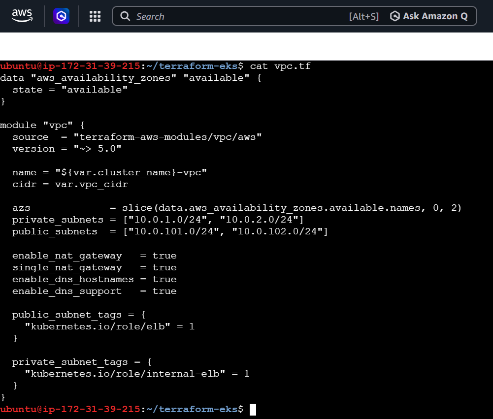

### Question: Why does EKS need both public and private subnets?

- **Private subnets** hold the **worker nodes**. Nodes do not need a public IP, so nobody on the internet can reach them directly. This is safer. They still reach the internet through the NAT gateway to pull container images.
- **Public subnets** hold the things that must face the internet: the **NAT gateway** and the **public load balancers**.
- Using **2 availability zones** means that if one AWS data center has a problem, the cluster can still work from the other one.

### Question: What do the subnet tags do?

Tags are labels. Kubernetes and AWS read them to decide where to create load balancers:

| Tag | Meaning |
|---|---|
| `kubernetes.io/role/elb = 1` (public subnets) | "Put **internet-facing** load balancers here" |
| `kubernetes.io/role/internal-elb = 1` (private subnets) | "Put **internal-only** load balancers here" |

Without these tags, when we create a `LoadBalancer` service in Task 5, Kubernetes would not know which subnets to use.

---

## Task 3: Create the EKS cluster with a registry module

### What
Write `eks.tf` and call the `terraform-aws-modules/eks/aws` module. Then run `terraform init`, `validate` and `plan`.

### Why
An EKS cluster needs many parts: the cluster, IAM roles, security groups, a node group, and more. The module creates all of them with correct settings, so you do not need to write IAM roles by hand.

### How

**Step 1: write `eks.tf`**

```hcl
module "eks" {
  source  = "terraform-aws-modules/eks/aws"
  version = "~> 20.0"

  cluster_name    = var.cluster_name
  cluster_version = var.cluster_version

  vpc_id     = module.vpc.vpc_id
  subnet_ids = module.vpc.private_subnets

  cluster_endpoint_public_access           = true
  enable_cluster_creator_admin_permissions = true

  eks_managed_node_groups = {
    terraweek_nodes = {
      ami_type       = "AL2023_x86_64_STANDARD"
      instance_types = [var.node_instance_type]

      min_size     = 1
      max_size     = 3
      desired_size = var.node_desired_count
    }
  }

  tags = {
    Environment = "dev"
    Project     = "TerraWeek"
    ManagedBy   = "Terraform"
  }
}
```

**Line by line:**

| Line | Meaning |
|---|---|
| `vpc_id = module.vpc.vpc_id` | Use the VPC we created in Task 2. This connects the two modules |
| `subnet_ids = module.vpc.private_subnets` | Put the nodes in the **private** subnets |
| `cluster_endpoint_public_access = true` | Lets you run kubectl from your own machine over the internet |
| `enable_cluster_creator_admin_permissions = true` | Makes the user who creates the cluster an admin, so kubectl works without "Unauthorized" |
| `eks_managed_node_groups` | AWS creates and manages the worker EC2 servers for you |
| `ami_type` | The operating system image for the nodes |
| `instance_types` | Server size. We pass our variable (`t3.small`) |
| `min_size / max_size / desired_size` | The node group can scale between 1 and 3 nodes. We want 1 now |
| `tags` | Labels on the AWS resources so you can find them later |

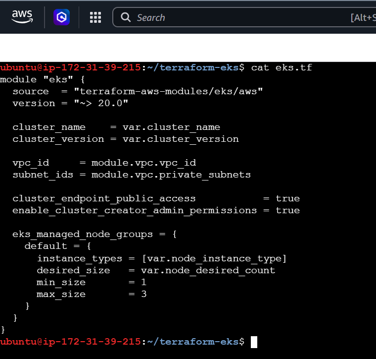

**Step 2: `terraform init`**

**What:** Download the AWS plugin and the two modules (VPC and EKS).
**Why:** Terraform cannot run until it has downloaded everything the code needs.

```bash
terraform init
```

You should see `Terraform has been successfully initialized!`

**Step 3: `terraform validate`**

**What:** Check the code for mistakes.
**Why:** It catches typos and wrong syntax before you spend time on a plan.

```bash
terraform validate
```

You should see `Success! The configuration is valid.`


**Step 4: `terraform plan`**

**What:** Show what Terraform *will* create, without creating anything.
**Why:** It is a safe preview. Always read the plan before applying. You should see the VPC, subnets, NAT gateway, EKS cluster, IAM roles, node group and security groups. The list has **30+ resources**.

```bash
terraform plan
```

At the end you will see a line like `Plan: XX to add, 0 to change, 0 to destroy.`

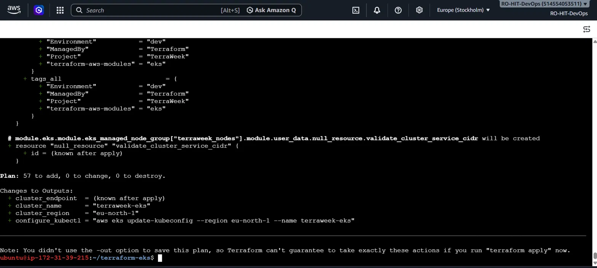

---

## Task 4: Apply and connect kubectl

### 4.1 Add outputs

**What:** Write `outputs.tf`.
**Why:** After apply, Terraform prints these values, so you do not have to hunt for them in the AWS console.

**How:**

```hcl
output "cluster_name" {
  value = module.eks.cluster_name
}

output "cluster_endpoint" {
  value = module.eks.cluster_endpoint
}

output "cluster_region" {
  value = var.region
}
```

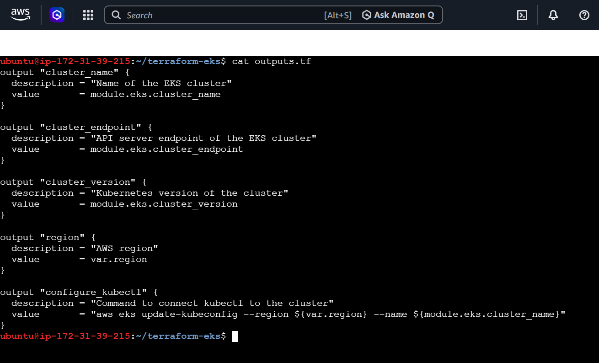

### 4.2 Apply

**What:** Create all the resources in AWS.
**Why:** This is the real build. Until now nothing was created.

**How:**

```bash
terraform apply
```

- Terraform shows the plan again and asks for confirmation. Type `yes`.
- **It takes about 10 to 15 minutes.** EKS is slow to create. Be patient.
- At the end you will see `Apply complete! Resources: XX added`.

**Total resources Terraform created: XX** (replace `XX` with the number from your apply output).

Plan check before apply:

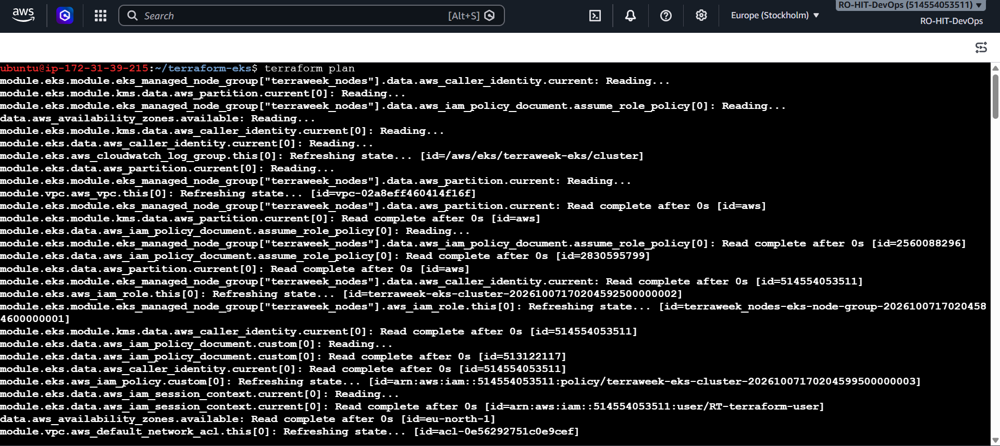

Apply complete:

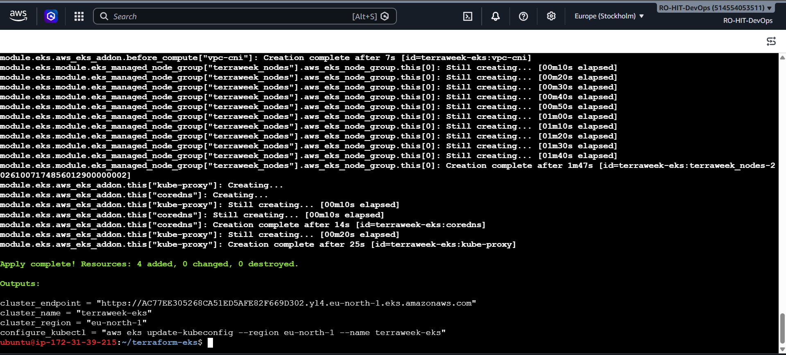

### 4.3 Connect kubectl to the cluster

**What:** Save the cluster's address and login info into kubectl's config file.
**Why:** kubectl does not know about your new cluster. This command tells it where the cluster is.

**How:**

```bash
aws eks update-kubeconfig --region eu-north-1 --name terraweek-eks
```

- It writes a new entry in `~/.kube/config`.
- If you later see `Unauthorized`, run this command again.

### 4.4 Verify the cluster

**What:** Check that the node is ready and the system pods are running.
**Why:** This proves the cluster is healthy before we put our app on it.

**How:**

```bash
kubectl get nodes
kubectl get pods -A
kubectl cluster-info
```

| Command | Meaning |
|---|---|
| `kubectl get nodes` | Lists worker servers. `STATUS = Ready` means good |
| `kubectl get pods -A` | Lists pods in **all** namespaces |
| `kubectl cluster-info` | Shows the cluster's control plane address |

**What the system pods in `kube-system` do:**

| Pod | Job |
|---|---|
| `aws-node` | The VPC CNI plugin. Gives each pod a network address |
| `coredns` (2 pods) | DNS inside the cluster, so pods can find each other by name |
| `kube-proxy` | Manages the network rules for Services |

**Expected result:** 1 node in `Ready` state (the task says 2, but I used 1 to save cost) and all `kube-system` pods `Running`.

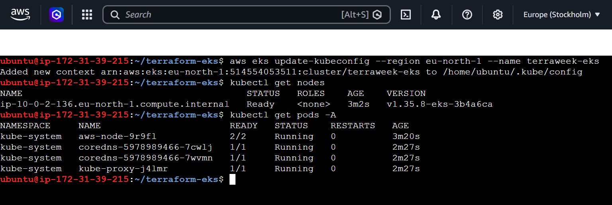

---

## Task 5: Deploy a workload (Nginx)

### What
Run the Nginx web server on our cluster, open it from the internet, and scale it to 3 copies.

### Why
A cluster with no app is just an empty box. Deploying Nginx proves that the whole chain works: Terraform, VPC, EKS, node, pod and load balancer.

### How

**Step 1: create the deployment**

```bash
kubectl create deployment nginx --image=nginx
kubectl get pods
```

- `create deployment` tells Kubernetes: "run the `nginx` container image".
- Wait about a minute until `STATUS` shows `Running` and `READY` shows `1/1`.

**Step 2: expose it to the internet**

```bash
kubectl expose deployment nginx --port=80 --type=LoadBalancer
kubectl get svc nginx
```

- `expose` creates a Service. `--type=LoadBalancer` makes AWS create a **public load balancer**. This is where the subnet tags from Task 2 are used.
- `--port=80` is the web port.
- The `EXTERNAL-IP` column can show `<pending>` at first. Wait 2 to 3 minutes and run the command again until a long URL ending in `elb.amazonaws.com` appears.

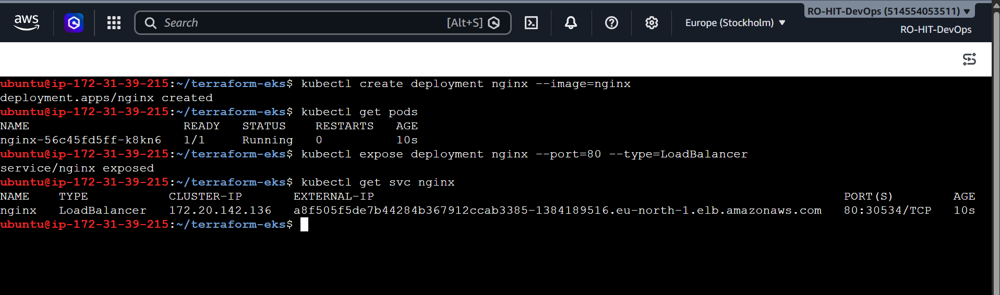

**Step 3: open it in the browser**

Put `http://` in front of the EXTERNAL-IP URL and open it in your browser. If the page does not open immediately, wait 2 to 3 minutes for the load balancer's DNS to become ready and refresh.

You should see **"Welcome to nginx!"**

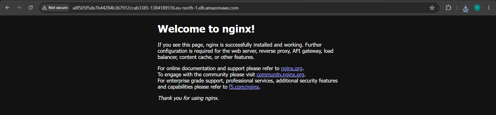

**Step 4: scale to 3 pods**

```bash
kubectl scale deployment nginx --replicas=3
kubectl get pods
```

- `scale` changes the number of copies. With one command we went from 1 pod to 3 pods.
- If one pod crashes, the other two keep serving users. Kubernetes also starts a new one automatically.

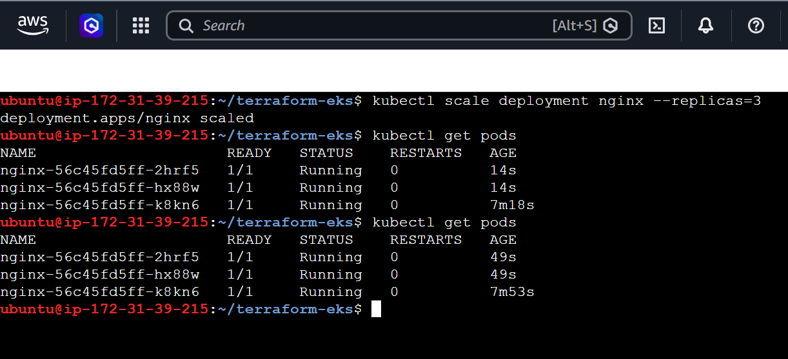

**Step 5: check the full picture**

```bash
kubectl get nodes
kubectl get deployments
kubectl get svc
kubectl cluster-info
```

You should see: 1 node `Ready`, the nginx deployment `3/3`, the nginx `LoadBalancer` service with its external URL, and the control plane running.

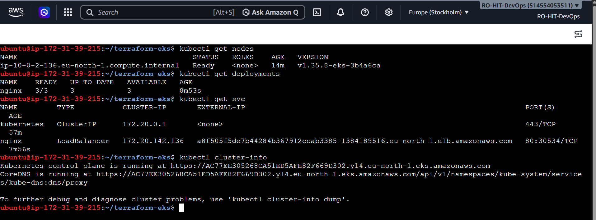

> **Note:** The task gives a YAML file (`k8s/nginx-deployment.yaml`) to do the same thing. I used `kubectl` commands, which give the same result. The YAML way is shown below. It is better in real projects because the file can be saved in Git.

<details>
<summary>Click to see the YAML version</summary>

```yaml
apiVersion: apps/v1
kind: Deployment
metadata:
  name: nginx-terraweek
  labels:
    app: nginx
spec:
  replicas: 3
  selector:
    matchLabels:
      app: nginx
  template:
    metadata:
      labels:
        app: nginx
    spec:
      containers:
      - name: nginx
        image: nginx:latest
        ports:
        - containerPort: 80
---
apiVersion: v1
kind: Service
metadata:
  name: nginx-service
spec:
  type: LoadBalancer
  selector:
    app: nginx
  ports:
  - port: 80
    targetPort: 80
```

Apply with `kubectl apply -f k8s/nginx-deployment.yaml` and delete with `kubectl delete -f k8s/nginx-deployment.yaml`.

</details>

### Check in the AWS console (before destroy)

**What:** Look at what Terraform and Kubernetes created in AWS.
**Why:** It shows what we will later delete, and proves the resources are real.

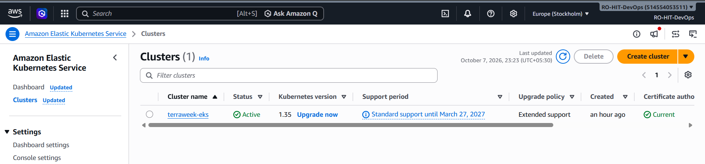

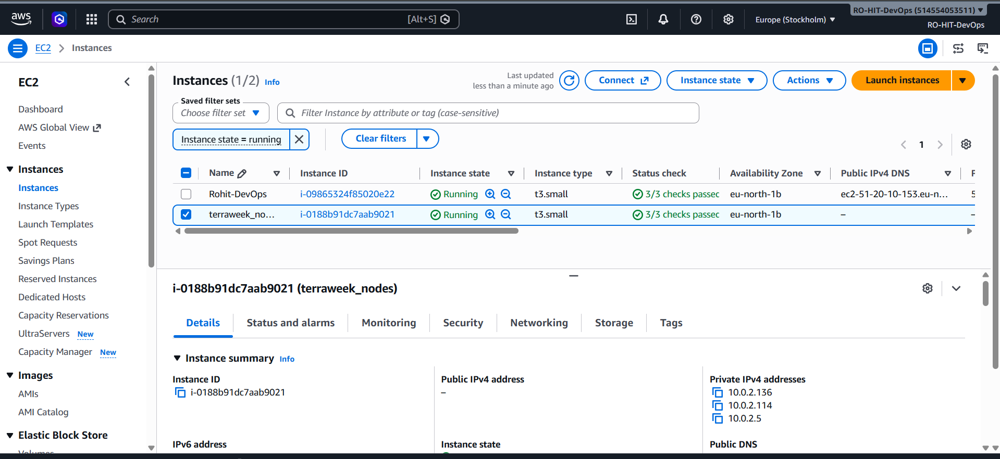

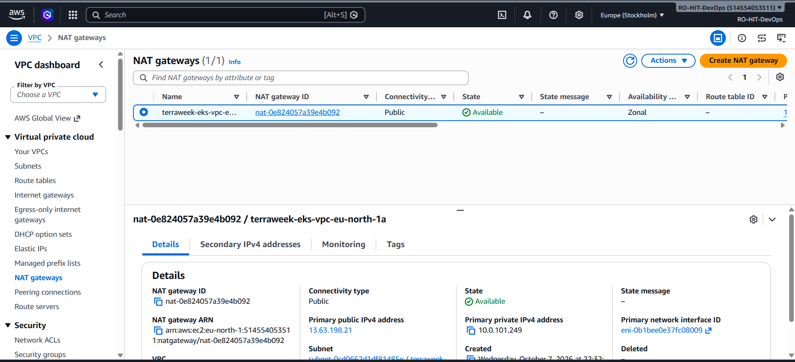

> The second EC2 instance in the list is my own terminal machine, not part of the cluster. Do **not** delete it.

---

## Task 6: Destroy everything

### What
Delete all Kubernetes resources first, then run `terraform destroy`, then check the AWS console.

### Why
This is the most important step. EKS, NAT gateway and EC2 charge money every hour.

**The order matters.** The `nginx` Service created a load balancer in AWS **outside Terraform's knowledge**. If it still exists, it blocks the VPC from being deleted and `terraform destroy` gets stuck. So delete the Kubernetes resources first.

### How

**Step 1: delete the Service and the Deployment**

```bash
kubectl delete svc nginx
kubectl delete deployment nginx
kubectl get svc
kubectl get pods
```

- After this, `get svc` should show only `kubernetes`, and `get pods` should say `No resources found`.

**Step 2: confirm the load balancer is gone**

Open **AWS Console → EC2 → Load Balancers** (same region), click refresh, and wait until the list is empty. It can take 1 to 2 minutes.

**Step 3: destroy with Terraform**

```bash
terraform destroy
```

- Type `yes` when asked.
- It takes about 10 to 15 minutes.
- At the end you will see `Destroy complete! Resources: XX destroyed.`

**Step 4: verify in the AWS console**

| Check | Expected |
|---|---|
| EKS → Clusters | Empty |
| EC2 → Instances | No `terraweek_nodes` instance |
| EC2 → Load Balancers | Empty |
| VPC → NAT gateways | Deleted or gone |
| VPC → Elastic IPs | Empty (released) |
| VPC → Your VPCs | The `terraweek-eks-vpc` is gone |

> The **default VPC** and my own terminal EC2 machine remain. They are not part of this project.

### Problem I faced during destroy: `Cluster has nodegroups attached`

My first `terraform destroy` stopped with this error:

```
Error: deleting EKS Cluster (terraweek-eks): ... 409,
ResourceInUseException: Cluster has nodegroups attached
```

**What it means:** AWS will not delete an EKS cluster while a node group is still attached to it.

**Why it happened:** My first `apply` used `t3.medium`, which my Free Tier account did not allow, so that node group ended in `CREATE_FAILED`. Terraform did not manage it any more, so `terraform destroy` could not remove it.

**How I fixed it:**

**Step 1: list the node groups of the cluster**

```bash
aws eks list-nodegroups --cluster-name terraweek-eks --region eu-north-1
```

**Step 2: check its status** (use the real name from Step 1)

```bash
aws eks describe-nodegroup --cluster-name terraweek-eks --region eu-north-1 \
  --nodegroup-name <nodegroup-name> --query nodegroup.status
```

The status was `"CREATE_FAILED"`.

**Step 3: delete it manually**

```bash
aws eks delete-nodegroup --cluster-name terraweek-eks --region eu-north-1 \
  --nodegroup-name <nodegroup-name>
```

**Step 4: wait until it is fully deleted**

```bash
aws eks wait nodegroup-deleted --cluster-name terraweek-eks --region eu-north-1 \
  --nodegroup-name <nodegroup-name>
```

This prints nothing and takes 5 to 15 minutes. When the prompt comes back, the node group is gone.

**Step 5: run `terraform destroy` again.** This time the cluster could be deleted.

**Other reasons `terraform destroy` can get stuck:** a leftover load balancer, network interface (ENI) or security group inside the VPC. Delete it, then run `terraform destroy` again.

---

## Summary and reflection

### File structure

```
2026/day-66/
├── day-66-eks-terraform.md
└── Screenshots/
```

The Terraform code lives in `terraform-eks/` (`providers.tf`, `vpc.tf`, `eks.tf`, `variables.tf`, `outputs.tf`, `terraform.tfvars`).

### Numbers

| Item | Value |
|---|---|
| Resources created by `terraform apply` | XX |
| Resources removed by `terraform destroy` | XX |
| Time to create | about 10 to 15 minutes |
| Time to destroy | about 10 to 15 minutes |

### Problem I faced

- **`t3.medium` was not allowed** on my Free Tier account. I changed the node type to `t3.small` in `terraform.tfvars` and ran `terraform apply` again. This shows the benefit of variables: one value changed, no code rewritten.
- **Destroy failed with a 409 error** because the failed `t3.medium` node group was still attached to the cluster. I deleted it manually with the AWS CLI and ran `terraform destroy` again (see Task 6).

### Reflection: this vs kind/minikube (Day 50)

| | kind / minikube | EKS with Terraform |
|---|---|---|
| Where it runs | Your own laptop | AWS cloud |
| Setup time | 1 to 2 minutes | 10 to 15 minutes |
| Cost | Free | Paid per hour |
| Real load balancer | No (needs workarounds) | Yes, a real AWS load balancer |
| Repeatable by code | Not really | Yes, same code gives the same cluster every time |
| Control plane | Runs on your laptop | Managed and highly available (AWS) |
| Good for | Learning and testing | Production-style work |

**My takeaway:** kind/minikube is great for quick practice. Terraform plus EKS is how teams build real infrastructure: it is written in code, it can be reviewed in Git, created with `apply` and removed with `destroy`.

### Key learnings

- Registry **modules** save a huge amount of time. The VPC and EKS modules created 30+ resources from a few dozen lines.
- **Variables** and `terraform.tfvars` make the same code easy to change.
- EKS needs **private subnets for nodes**, **public subnets for load balancers**, and **tags** so Kubernetes can find them.
- A Kubernetes `LoadBalancer` service creates an AWS resource that Terraform does not know about. **Always delete it before `terraform destroy`.**
- **Always destroy** practice infrastructure to avoid surprise bills.

### Final checklist

- [x] VPC created with the registry module
- [x] EKS cluster and managed node group created with the registry module
- [x] kubectl connected, node `Ready`
- [x] Nginx deployed, opened in the browser, scaled to 3 pods
- [x] Kubernetes resources deleted, `terraform destroy` completed
- [x] AWS console checked: no leftover resources

---


